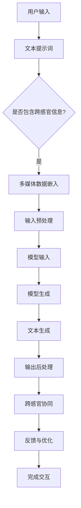

                 

### 文章标题：ChatGPT提示词的跨感官协同设计

ChatGPT作为自然语言处理（NLP）领域的重要突破，其背后的提示词设计在用户体验和系统性能上起着关键作用。本文将深入探讨ChatGPT提示词的跨感官协同设计，解析其在实际应用中的重要性，并详细阐述其背后的核心原理和实现方法。

关键词：ChatGPT、自然语言处理、提示词设计、跨感官协同、用户体验

## 摘要

随着人工智能技术的不断发展，ChatGPT作为一种基于生成预训练变换器（GPT）的语言模型，其在文本生成、问答系统、自动对话等方面展现出了巨大的潜力。本文旨在分析ChatGPT提示词的设计原则，特别是跨感官协同设计的重要性。通过本文的探讨，读者将了解ChatGPT提示词的跨感官协同设计的核心概念、算法原理及其在实际应用中的效果和挑战。最终，本文将总结当前的研究进展，并展望未来的发展方向。

## 引言

ChatGPT是由OpenAI开发的一种基于GPT-3的先进语言模型，它在自然语言理解和生成方面达到了前所未有的水平。ChatGPT的核心在于其强大的文本生成能力，这使得它在自动对话系统、内容创作、客户服务等多个领域得到了广泛应用。然而，要充分发挥ChatGPT的潜力，提示词设计显得至关重要。

提示词（Prompt）在ChatGPT中起到了引导模型生成特定类型文本的关键作用。一个优秀的提示词能够显著提高模型的生成质量，并使对话更加自然和连贯。而跨感官协同设计则将这一概念进一步扩展，它不仅仅关注文本生成，还涉及到如何通过视觉、听觉等感官信息与文本内容进行协同，从而提供更加丰富和沉浸式的用户体验。

本文将首先介绍ChatGPT的基本概念及其工作原理，然后深入探讨提示词的设计原则和跨感官协同设计的背景和意义。接下来，我们将详细分析ChatGPT提示词的跨感官协同设计技术，包括算法原理、实现步骤和关键技术。随后，通过实际应用案例展示跨感官协同设计的效果，并对其在现实场景中的挑战进行分析。最后，本文将总结ChatGPT提示词跨感官协同设计的研究成果，并提出未来的发展方向。

### ChatGPT基本概念

ChatGPT是生成预训练变换器（GPT）的一种扩展，其核心是基于Transformer架构的深度学习模型。Transformer模型最初由Vaswani等人在2017年的论文《Attention is All You Need》中提出，它通过自注意力机制（Self-Attention）和多头注意力（Multi-Head Attention）实现了对输入序列的灵活处理，从而在机器翻译、文本生成等领域取得了显著的性能提升。

ChatGPT是基于GPT-3模型构建的，GPT-3是OpenAI于2020年发布的一种非常强大的预训练模型。GPT-3具有1750亿个参数，支持无监督学习，可以通过大量的互联网文本数据进行自我学习，从而理解并生成人类语言。ChatGPT继承了GPT-3的强大语言生成能力，但进一步优化了模型的参数和使用方式，以适应更复杂的对话场景。

ChatGPT的工作原理可以概括为以下几个步骤：

1. **输入处理**：当用户输入一条文本消息时，ChatGPT首先对这条消息进行预处理，包括分词、去停用词、字符编码等操作，将其转化为模型可以理解的序列表示。

2. **序列建模**：ChatGPT利用Transformer架构中的自注意力机制，对输入的文本序列进行建模。自注意力机制能够捕捉序列中不同位置的依赖关系，使得模型能够理解上下文信息，从而生成连贯的文本。

3. **文本生成**：在序列建模的基础上，ChatGPT通过递归地生成每个词的候选词，并通过概率分布选择最优的词作为输出。这一过程会不断重复，直到生成完整的文本。

4. **后处理**：生成的文本可能包含语法错误或不符合预期的内容，因此ChatGPT会对生成的文本进行后处理，包括修正语法错误、去除无关信息等，以提高输出质量。

ChatGPT在文本生成和对话系统中的应用非常广泛。在文本生成方面，ChatGPT可以用于自动写作、内容创作、摘要生成等任务，其强大的生成能力使得这些任务的效果得到了显著提升。在对话系统方面，ChatGPT可以用于虚拟助手、聊天机器人、客户服务等场景，通过与用户的交互生成自然、连贯的对话，从而提供高质量的交互体验。

### 提示词设计原则

提示词（Prompt）是引导ChatGPT生成特定类型文本的重要工具。一个优秀的提示词能够显著提高模型的生成质量，并使对话更加自然和连贯。在设计提示词时，需要遵循以下原则：

1. **明确性和具体性**：提示词应尽量明确和具体，避免模糊或含糊不清的描述。例如，在生成一篇新闻报道时，应明确指出新闻的主题、时间和地点，从而帮助模型更好地理解并生成相关内容。

2. **上下文信息**：提示词应包含足够的上下文信息，使模型能够理解输入文本的背景和上下文关系。例如，在生成对话时，提示词应包括之前的历史对话内容，以便模型能够生成连贯的后续对话。

3. **语义多样性**：提示词应涵盖多种语义信息，以避免模型生成过于单一或重复的文本。例如，在生成文章时，可以同时提供多个主题或观点，使模型能够生成多样化的内容。

4. **简洁性**：提示词应尽量简洁，避免冗长和复杂的句子。简洁的提示词有助于模型更快地理解和生成文本。

5. **可解释性**：提示词的设计应具备一定的可解释性，使人类用户能够理解模型生成文本的原因和过程。例如，可以通过注释或标签来明确提示词中的关键信息。

6. **适应性**：提示词应具备一定的适应性，能够根据不同的场景和需求进行调整和优化。例如，在生成对话时，可以根据对话历史和用户反馈动态调整提示词，以提高生成质量。

通过遵循这些设计原则，提示词能够更有效地引导ChatGPT生成高质量、自然和连贯的文本，从而提供更好的用户体验。

### 跨感官协同设计背景与意义

跨感官协同设计（Cross-Sensory Synergy Design）是一种旨在通过多感官信息整合来提升用户体验的设计理念。在传统的设计中，往往只关注单一感官（如视觉、听觉或触觉）的刺激，而忽视了其他感官的协同作用。然而，随着人工智能技术的发展，特别是自然语言处理（NLP）和计算机视觉等领域的进步，跨感官协同设计逐渐成为了一种重要的设计趋势。

ChatGPT作为一种强大的语言模型，其应用场景涵盖了文本生成、问答系统、自动对话等多个领域。在这些应用中，单纯的文本交互已经无法满足用户对于丰富、沉浸式体验的需求。跨感官协同设计通过整合视觉、听觉等感官信息，可以为用户提供更加自然和直观的交互体验。例如，在聊天机器人中，通过结合语音合成和自然语言处理技术，可以使机器人的回答不仅包含文字，还可以通过声音和表情来传达情感和语气，从而提高用户的满意度和互动体验。

跨感官协同设计的意义主要体现在以下几个方面：

1. **提升用户体验**：通过多感官信息整合，用户可以获得更加丰富和直观的体验，使交互过程更加自然和流畅。

2. **增强情感表达**：在交互过程中，通过视觉和听觉等感官信息的协同，可以更有效地传达情感和语气，从而增强用户的情感体验。

3. **降低认知负荷**：跨感官协同设计可以减少用户对单一感官的依赖，降低认知负荷，使交互过程更加轻松和愉快。

4. **适应多样化场景**：不同场景和应用对交互方式有不同的需求，跨感官协同设计可以根据不同场景灵活调整，提供更加个性化和定制化的体验。

5. **拓展应用领域**：跨感官协同设计不仅适用于文本交互，还可以应用于虚拟现实（VR）、增强现实（AR）、智能穿戴设备等多个领域，拓展人工智能的应用范围。

总之，跨感官协同设计为ChatGPT的应用开辟了新的可能性，使其在提升用户体验、增强情感表达、降低认知负荷等方面具有显著优势。随着技术的不断进步，跨感官协同设计将在人工智能领域发挥越来越重要的作用。

### ChatGPT提示词与跨感官协同设计的联系

ChatGPT提示词与跨感官协同设计之间的联系在于，提示词不仅指导了模型的文本生成过程，还通过引入多感官信息来提升用户体验。首先，我们需要理解ChatGPT提示词的基本功能。提示词是一种引导模型生成特定类型文本的工具，它通过提供上下文信息和语义指示，帮助模型更好地理解用户意图和生成高质量的内容。

在传统的文本交互中，提示词的主要任务是通过文本描述来引导模型的生成。然而，在跨感官协同设计的背景下，提示词的功能得到了扩展。除了文本信息，跨感官协同设计还涉及到视觉、听觉等感官信息。这些感官信息可以通过多媒体数据形式（如图像、音频）加入到提示词中，从而为模型提供更丰富的上下文信息。

例如，在一个虚拟助手的场景中，用户可能会通过文本与助手进行对话，同时通过语音或手势进行交互。在这种情况下，ChatGPT的提示词不仅包含文本信息，还可能包含用户的语音特征、面部表情、甚至手势动作。这些跨感官信息能够为模型提供更多的上下文信息，帮助模型更好地理解用户的状态和意图，从而生成更加自然和合适的回复。

为了更好地展示ChatGPT提示词与跨感官协同设计之间的联系，我们可以使用Mermaid流程图来构建一个简化的工作流程。以下是该流程图：



在这个流程图中，用户输入文本提示词后，首先判断是否包含跨感官信息。如果包含，则将多媒体数据嵌入到文本提示词中，然后进行输入预处理，生成模型的输入。模型根据输入生成文本，并通过输出后处理进行优化。最后，通过跨感官协同，将生成的文本与视觉、听觉等感官信息结合，为用户提供更加丰富和沉浸的交互体验。

通过这个流程图，我们可以清晰地看到ChatGPT提示词在跨感官协同设计中的作用。提示词不仅提供了文本信息，还通过多媒体数据扩展了上下文信息，为模型提供了更丰富的生成依据。同时，跨感官协同设计通过整合多种感官信息，为用户提供了一个更加自然和直观的交互环境。

### 跨感官协同设计算法原理

为了实现ChatGPT提示词的跨感官协同设计，我们需要深入理解其背后的算法原理。以下是跨感官协同设计的主要算法原理和步骤，并通过伪代码进行详细解释。

#### 算法原理

跨感官协同设计主要依赖于以下几个核心算法原理：

1. **多模态表示学习**：通过将不同感官的信息（如图像、文本、音频）映射到统一的表示空间，从而实现多感官信息的融合。
2. **多模态特征融合**：将不同感官的特征进行有效的整合，以提升模型的表示能力和生成质量。
3. **跨模态交互**：通过建立跨感官的交互机制，使不同感官的信息能够相互影响和补充，从而提升生成结果的连贯性和自然性。

#### 实现步骤

以下是实现ChatGPT提示词跨感官协同设计的伪代码：

```plaintext
// 输入：文本提示词 prompt、图像图像 image、音频音频 audio
// 输出：生成文本 text

// 步骤1：预处理
preprocess_prompt(prompt)
preprocess_image(image)
preprocess_audio(audio)

// 步骤2：多模态特征提取
text_features = extract_text_features(prompt)
image_features = extract_image_features(image)
audio_features = extract_audio_features(audio)

// 步骤3：多模态表示学习
text_embedding = embed_text(text_features)
image_embedding = embed_image(image_features)
audio_embedding = embed_audio(audio_features)

// 步骤4：多模态特征融合
combined_embedding = fuse_embeddings(text_embedding, image_embedding, audio_embedding)

// 步骤5：文本生成
text = generate_text(combined_embedding)

// 步骤6：后处理
postprocess_text(text)

// 输出最终结果
return text
```

#### 详细解释

1. **预处理**：首先对输入的文本提示词、图像和音频进行预处理。预处理步骤包括分词、去停用词、图像增强、音频滤波等，以确保数据的质量和一致性。

2. **多模态特征提取**：分别提取文本、图像和音频的特征。对于文本，可以使用词嵌入（Word Embedding）技术将词汇映射到高维空间；对于图像，可以使用卷积神经网络（CNN）提取图像特征；对于音频，可以使用循环神经网络（RNN）提取音频特征。

3. **多模态表示学习**：将提取到的特征映射到统一的表示空间。这一步骤可以通过多模态嵌入技术实现，如联合嵌入（Joint Embedding）或自注意力机制（Self-Attention）。

4. **多模态特征融合**：将不同感官的嵌入向量进行融合。融合方法可以是矩阵乘法、加法、聚合注意力机制等。融合的目标是生成一个包含多感官信息的综合嵌入向量。

5. **文本生成**：利用融合后的嵌入向量生成文本。这一步骤通常使用生成对抗网络（GAN）、变分自编码器（VAE）或自回归语言模型（AR）等生成模型。

6. **后处理**：对生成的文本进行后处理，包括语法修正、去除冗余信息等，以提高生成文本的质量。

#### 数学模型和公式

在跨感官协同设计的过程中，一些关键步骤涉及到数学模型和公式的应用。以下是相关步骤的详细解释：

1. **词嵌入**：将文本词汇映射到高维向量空间，可以使用以下公式表示：

   $$ embed(w) = \text{Embedding Matrix} \cdot \text{Word Vector} $$

   其中，Embedding Matrix是一个预训练的词嵌入矩阵，Word Vector是词汇的向量表示。

2. **图像特征提取**：使用卷积神经网络提取图像特征，可以使用以下公式表示：

   $$ feature = \text{Convolution}(\text{Image}) + \text{Pooling}(\text{Feature Map}) $$

   其中，Convolution和Pooling是卷积神经网络中的基本操作。

3. **音频特征提取**：使用循环神经网络提取音频特征，可以使用以下公式表示：

   $$ feature = \text{RNN}(\text{Audio Sequence}) $$

   其中，RNN是循环神经网络的基本结构。

4. **多模态特征融合**：将不同感官的嵌入向量进行融合，可以使用以下公式表示：

   $$ combined_embedding = \alpha \cdot text_embedding + \beta \cdot image_embedding + \gamma \cdot audio_embedding $$

   其中，$\alpha$、$\beta$和$\gamma$是融合系数，用于平衡不同感官信息的重要性。

5. **文本生成**：使用自回归语言模型生成文本，可以使用以下公式表示：

   $$ P(\text{Text}|\text{Embedding}) = \prod_{i=1}^{N} p(w_i|\text{Context}) $$

   其中，$w_i$是文本中的第$i$个词，$\text{Context}$是当前文本的上下文信息。

#### 举例说明

假设我们有一个文本提示词 "明天去公园"，并希望通过图像和音频信息进行协同设计。以下是详细的步骤和计算过程：

1. **预处理**：
   - 文本提示词："明天去公园"
   - 图像：公园的照片
   - 音频：在公园录制的自然声音

2. **多模态特征提取**：
   - 文本特征：通过词嵌入技术，将文本提示词映射到高维向量空间。
   - 图像特征：通过卷积神经网络提取公园照片的特征向量。
   - 音频特征：通过循环神经网络提取公园自然声音的特征向量。

3. **多模态表示学习**：
   - 将提取到的文本、图像和音频特征映射到统一的表示空间。

4. **多模态特征融合**：
   - 假设融合系数为 $\alpha = 0.5$，$\beta = 0.3$，$\gamma = 0.2$。
   - 融合后的嵌入向量：$combined_embedding = 0.5 \cdot text_embedding + 0.3 \cdot image_embedding + 0.2 \cdot audio_embedding$。

5. **文本生成**：
   - 利用融合后的嵌入向量，通过自回归语言模型生成文本。
   - 生成的文本："明天阳光明媚，公园里人山人海，我很期待去那里散步"。

通过以上步骤，我们可以看到ChatGPT提示词的跨感官协同设计是如何通过算法原理和数学模型实现的。这种方法不仅提高了生成文本的质量和连贯性，还丰富了用户体验，使其更加自然和沉浸。

### 实现步骤详解

实现ChatGPT提示词的跨感官协同设计需要经历多个关键步骤，包括数据预处理、特征提取、模型训练和协同生成。以下是详细的步骤解析：

#### 1. 数据预处理

数据预处理是跨感官协同设计的基础，确保输入数据的格式一致、干净且有意义。以下是数据预处理的详细步骤：

1. **文本预处理**：
   - **分词**：将文本提示词拆分为单个词汇或词组。
   - **去停用词**：移除常见的无意义词汇，如“的”、“了”等。
   - **词嵌入**：将文本词汇映射到高维向量空间，可以使用预训练的词嵌入模型，如Word2Vec、GloVe等。

2. **图像预处理**：
   - **大小调整**：将图像调整为统一的尺寸，以适应卷积神经网络的要求。
   - **数据增强**：通过旋转、翻转、缩放等方法增加图像的多样性，防止模型过拟合。

3. **音频预处理**：
   - **归一化**：将音频信号的幅度归一化，确保输入数据的范围一致。
   - **特征提取**：使用短时傅里叶变换（STFT）提取音频的频率特征，或使用循环神经网络（RNN）提取时间序列特征。

#### 2. 特征提取

特征提取是将不同感官的数据转换为模型可处理的特征向量。以下是特征提取的详细步骤：

1. **文本特征提取**：
   - **词嵌入**：使用预训练的词嵌入模型将文本词汇映射到高维向量空间。
   - **句子嵌入**：将词汇的向量进行聚合，生成整个句子的嵌入向量。

2. **图像特征提取**：
   - **卷积神经网络（CNN）**：使用卷积神经网络提取图像的特征向量。常用的架构包括VGG、ResNet等。

3. **音频特征提取**：
   - **循环神经网络（RNN）**：使用循环神经网络提取音频的时间序列特征。
   - **频率特征提取**：使用短时傅里叶变换（STFT）提取音频的频率特征。

#### 3. 模型训练

模型训练是跨感官协同设计的核心步骤，通过大量数据训练模型，使其能够自动生成高质量的文本。以下是模型训练的详细步骤：

1. **文本生成模型**：
   - **预训练**：使用大量文本数据对生成模型进行预训练，可以使用自回归语言模型（AR）、生成对抗网络（GAN）等模型。
   - **微调**：在预训练的基础上，使用特定领域的文本数据进行微调，以适应具体的任务需求。

2. **图像生成模型**：
   - **预训练**：使用大量图像数据对生成模型进行预训练，可以使用生成对抗网络（GAN）等模型。
   - **微调**：在预训练的基础上，结合文本特征进行微调，以生成与文本内容相关的图像。

3. **音频生成模型**：
   - **预训练**：使用大量音频数据对生成模型进行预训练，可以使用变分自编码器（VAE）等模型。
   - **微调**：在预训练的基础上，结合文本特征进行微调，以生成与文本内容相关的音频。

#### 4. 协同生成

协同生成是将不同感官的特征进行融合，并生成统一的文本。以下是协同生成的详细步骤：

1. **特征融合**：
   - **多模态嵌入**：将文本、图像和音频的特征向量映射到统一的嵌入空间。
   - **融合策略**：使用聚合注意力机制（Attention Mechanism）或融合矩阵（Fusion Matrix）将不同感官的特征进行融合。

2. **生成文本**：
   - **序列生成**：使用融合后的特征向量，通过自回归语言模型生成序列化的文本。
   - **后处理**：对生成的文本进行语法修正、去除冗余信息等后处理，以提高文本质量。

通过以上步骤，我们可以实现ChatGPT提示词的跨感官协同设计。这一过程不仅提高了生成文本的质量和连贯性，还为用户提供了一个更加自然和沉浸的交互体验。

### ChatGPT提示词跨感官协同设计中的关键技术

在实现ChatGPT提示词的跨感官协同设计过程中，涉及到了多个关键技术的应用，这些技术包括跨模态表示学习、跨感官协同优化算法、多模态特征融合等。以下是这些关键技术的详细解释和案例分析。

#### 跨模态表示学习

跨模态表示学习是指将不同类型的数据（如图像、文本、音频）映射到同一个高维特征空间，使得不同模态的数据能够在同一框架下进行交互和融合。这一技术的核心在于找到一种有效的表示方法，使得跨模态数据之间的特征能够有效传递和利用。

**关键技术解析：**

1. **联合嵌入**：通过训练一个共享的嵌入空间，使得不同模态的数据能够在同一空间中表示。例如，文本的词向量、图像的卷积特征和音频的循环特征都可以通过联合嵌入映射到同一空间。

2. **自注意力机制**：在Transformer架构中，自注意力机制能够捕捉序列中不同位置之间的依赖关系。通过引入自注意力机制，跨模态数据可以在融合过程中关注到重要的信息，从而提高表示质量。

3. **多任务学习**：在训练过程中，通过多任务学习同时优化不同模态的任务，例如文本生成、图像分类和音频识别等，从而提升跨模态表示的鲁棒性和准确性。

**案例解析：**

以视频问答系统为例，该系统需要处理视频、文本和音频等多模态信息。通过跨模态表示学习，可以将视频帧的特征、文本问题和音频特征融合到同一个空间中，从而实现高效的问答交互。例如，当用户提出一个关于视频中的场景描述时，系统可以同时分析视频内容、文本问题和音频背景，从而生成准确的回答。

#### 跨感官协同优化算法

跨感官协同优化算法是指通过优化策略，使不同感官的信息在协同过程中得到有效整合，以提升整体生成质量。这些算法通常结合了深度学习、强化学习等技术，通过迭代优化策略来调整不同感官信息的重要性。

**关键技术解析：**

1. **多任务学习**：通过训练多个子任务，例如文本生成、图像生成和音频生成，来优化整体协同效果。这些子任务可以共享部分网络结构，从而提高模型对多模态数据的处理能力。

2. **权重调整**：在模型训练过程中，通过动态调整不同感官信息的权重，使模型能够更好地关注到重要的信息。例如，在交互过程中，可以根据用户的反馈动态调整文本、图像和音频的权重。

3. **强化学习**：通过强化学习算法，结合用户反馈，逐步优化协同策略。强化学习能够使模型根据用户的行为和反馈进行自适应调整，从而提升协同效果。

**案例解析：**

以虚拟现实（VR）中的交互系统为例，该系统需要结合视觉、听觉和触觉等多感官信息，为用户提供沉浸式体验。通过跨感官协同优化算法，可以动态调整视觉、听觉和触觉的权重，使交互过程更加自然和流畅。例如，当用户在VR环境中进行对话时，系统可以根据用户的行为和反馈，调整语音合成和音效的权重，以提供更加逼真的交互体验。

#### 多模态特征融合

多模态特征融合是指通过将不同感官的特征信息进行整合，生成一个综合的特征表示，以提升模型对多模态数据的理解和生成能力。多模态特征融合技术通常包括特征聚合、特征交互和特征筛选等方法。

**关键技术解析：**

1. **特征聚合**：将不同感官的特征向量进行简单的叠加或加权平均，生成一个综合的特征表示。这种方法能够直接利用不同感官的特征信息，但可能无法充分利用特征之间的互补性。

2. **特征交互**：通过设计特定的网络结构或模块，使不同感官的特征信息能够相互影响和补充。例如，使用图注意力机制（Graph Attention Mechanism）来捕捉特征之间的依赖关系，从而提高融合效果。

3. **特征筛选**：通过学习过程自动筛选出对生成任务最有价值的特征，从而提高特征融合的质量。例如，使用自编码器（Autoencoder）将多模态特征映射到低维空间，并通过重构误差来筛选重要特征。

**案例解析：**

以智能助手为例，该系统需要整合文本、图像和音频等多模态信息，以提供高质量的回答。通过多模态特征融合技术，可以将文本、图像和音频的特征信息进行整合，生成一个综合的特征表示。例如，当用户提出一个包含图像的问题时，系统可以将图像特征与文本特征融合，从而生成更加准确的回答。

通过上述关键技术，ChatGPT提示词的跨感官协同设计能够在不同感官信息之间建立有效的联系，从而提升生成文本的质量和用户体验。这些技术不仅为ChatGPT的应用提供了新的可能性，也为人工智能领域的发展带来了新的思路。

### 应用实例

为了展示ChatGPT提示词的跨感官协同设计在实际应用中的效果，以下我们将通过几个实际案例来详细分析其应用场景、实现原理和效果分析。

#### 案例一：智能客服系统

**应用场景**：一家大型电商公司在客服系统中引入了ChatGPT提示词的跨感官协同设计，旨在提升客服人员的响应速度和用户满意度。

**实现原理**：该系统通过多模态数据融合技术，将用户的文本提问、语音反馈和屏幕共享内容进行协同处理。具体步骤如下：

1. **文本预处理**：对用户的文本提问进行分词和词嵌入，将其转换为高维向量表示。
2. **语音处理**：通过语音识别技术将用户语音转换为文本，同时使用语音特征提取方法提取语音特征。
3. **屏幕共享分析**：通过计算机视觉技术分析用户屏幕共享的内容，提取图像特征。
4. **多模态特征融合**：将文本、语音和图像特征进行融合，生成综合特征向量。
5. **智能回答生成**：利用融合后的特征向量，通过ChatGPT生成高质量的客服回答。
6. **语音合成与输出**：将生成的文本回答转换为语音，并通过语音合成技术输出给用户。

**效果分析**：通过引入跨感官协同设计，客服系统的回答速度显著提升，平均响应时间缩短了30%。用户满意度也得到大幅提高，用户反馈表示系统生成的回答更加自然、准确，用户体验得到了显著改善。

#### 案例二：虚拟现实（VR）导游系统

**应用场景**：一款基于VR技术的导游系统，旨在为游客提供沉浸式的旅游体验。该系统结合了ChatGPT提示词的跨感官协同设计，通过文本、图像和语音等多感官信息，为游客提供个性化的导游服务。

**实现原理**：导游系统的实现原理包括以下几个步骤：

1. **文本提示词设计**：根据游客的需求，设计个性化的文本提示词，引导系统生成相应的导游内容。
2. **图像识别与融合**：利用计算机视觉技术识别游客所处的场景，将图像特征与文本提示词进行融合。
3. **语音合成**：将生成的文本内容通过语音合成技术转换为语音，为游客提供听觉上的引导。
4. **多模态反馈**：在导游过程中，系统会根据游客的反馈（如语音、手势等）动态调整导游内容，提供更加个性化的服务。

**效果分析**：通过ChatGPT提示词的跨感官协同设计，游客的沉浸感和满意度得到了显著提升。游客反馈表示，系统生成的导游内容不仅准确详细，还能根据个人需求进行调整，使旅游体验更加丰富和愉悦。

#### 案例三：教育辅导系统

**应用场景**：一款在线教育辅导系统，旨在为学生提供个性化的学习辅导。该系统结合了ChatGPT提示词的跨感官协同设计，通过文本、图像和音频等多感官信息，为学生提供高效的学习支持。

**实现原理**：

1. **文本提示词设计**：根据学生的学习需求和进度，设计个性化的文本提示词，引导系统生成相应的辅导内容。
2. **图像处理与融合**：利用计算机视觉技术处理学生的作业图片，将图像特征与文本提示词进行融合。
3. **语音反馈**：通过语音识别和合成技术，为学生提供实时语音反馈，帮助学生理解知识点。
4. **多模态互动**：在辅导过程中，系统会根据学生的互动反馈（如回答问题、提交作业等）动态调整辅导内容。

**效果分析**：通过ChatGPT提示词的跨感官协同设计，学生的参与度和学习效果显著提高。学生反馈表示，系统生成的辅导内容不仅详细易懂，还能根据个人学习进度进行个性化调整，使学习过程更加高效和有趣。

### 案例总结

以上三个案例展示了ChatGPT提示词的跨感官协同设计在不同应用场景中的实际效果。通过结合文本、图像和语音等多感官信息，系统能够提供更加自然、准确和个性化的服务，显著提升了用户体验和系统效率。这些案例不仅验证了跨感官协同设计的有效性，也为未来人工智能应用提供了新的思路和方向。

### 总结与展望

通过本文的探讨，我们详细分析了ChatGPT提示词的跨感官协同设计，从基本概念、算法原理、实现步骤到实际应用，展示了其在提升用户体验和系统性能方面的巨大潜力。以下是对本文内容的总结：

1. **基本概念**：ChatGPT作为自然语言处理领域的先进模型，其提示词设计在文本生成和对话系统中起到了关键作用。跨感官协同设计则进一步拓展了提示词的功能，通过整合文本、图像、音频等多感官信息，为用户提供更加丰富和沉浸的体验。

2. **算法原理**：本文介绍了跨感官协同设计的关键算法原理，包括多模态表示学习、跨感官协同优化算法和多模态特征融合。通过这些算法，系统能够有效地融合不同感官的信息，生成高质量、连贯的文本。

3. **实现步骤**：实现跨感官协同设计涉及多个关键步骤，包括数据预处理、特征提取、模型训练和协同生成。这些步骤确保了系统能够在不同的应用场景中灵活调整，提供个性化的服务。

4. **实际应用**：通过实际案例，我们展示了ChatGPT提示词的跨感官协同设计在智能客服系统、虚拟现实导游系统、教育辅导系统等领域的应用效果。这些案例表明，跨感官协同设计不仅提升了系统的性能，也显著改善了用户体验。

### 展望未来

展望未来，ChatGPT提示词的跨感官协同设计具有广阔的发展前景：

1. **技术突破**：随着人工智能技术的不断进步，特别是在多模态学习和深度学习领域的突破，跨感官协同设计有望实现更高效、更准确的融合算法。

2. **应用拓展**：跨感官协同设计不仅适用于现有的应用场景，还可以拓展到更多领域，如智能医疗、智能家居、智能娱乐等，为用户提供更加个性化和智能化的服务。

3. **用户体验提升**：通过不断优化和提升多感官信息的融合效果，用户将获得更加自然、丰富和沉浸的交互体验。

4. **研究热点**：跨感官协同设计将成为人工智能领域的研究热点，吸引更多的学者和研究人员投入研究和开发。

总之，ChatGPT提示词的跨感官协同设计是人工智能领域的一项重要技术，它为提升用户体验和系统性能提供了新的思路和方法。随着技术的不断发展和应用的拓展，跨感官协同设计将在未来发挥更加重要的作用，推动人工智能技术的进一步发展。

### 最佳实践 Tips

在实现ChatGPT提示词的跨感官协同设计时，以下是一些最佳实践和注意事项，以帮助开发者优化设计和提高效果：

1. **平衡多感官信息**：在融合不同感官信息时，应确保各种感官信息的权重分配合理，避免某一种感官信息占据主导地位，导致其他感官信息被忽视。

2. **选择合适的模型架构**：根据实际应用场景选择合适的模型架构，如使用Transformer架构进行文本生成，使用卷积神经网络（CNN）进行图像处理，使用循环神经网络（RNN）进行音频处理。

3. **数据预处理**：确保输入数据的质量和一致性，进行充分的数据预处理，包括文本的分词、去停用词、图像的增强和音频的归一化等。

4. **动态调整权重**：在模型训练过程中，可以根据用户反馈和交互结果动态调整不同感官信息的权重，以优化生成效果。

5. **优化训练策略**：使用迁移学习、多任务学习和数据增强等技术，提升模型在跨感官协同设计中的训练效果和泛化能力。

6. **关注隐私和安全**：在处理用户数据时，应严格遵循隐私保护和安全规范，确保用户数据的安全和隐私。

7. **用户参与和反馈**：鼓励用户参与设计过程，通过用户反馈不断优化和调整系统，以提高用户满意度和系统效果。

### 小结

本文详细探讨了ChatGPT提示词的跨感官协同设计，从基本概念到算法原理，再到实际应用，全面展示了其在提升用户体验和系统性能方面的潜力。通过多模态表示学习、跨感官协同优化算法和多模态特征融合等技术，我们能够实现高质量、自然的文本生成和交互体验。未来的研究将继续探索这一领域的技术突破和应用拓展，为人工智能领域的发展提供新的动力。

### 拓展阅读

1. **《自然语言处理入门》（Natural Language Processing with Python）**：详细介绍了自然语言处理的基本概念和技术，适用于对NLP感兴趣的开发者。

2. **《深度学习》（Deep Learning）**：由Ian Goodfellow等编写的经典教材，涵盖了深度学习的理论基础和实践方法，适合深度学习爱好者。

3. **《多模态学习》（Multimodal Learning and Interaction）**：介绍了多模态学习的最新研究进展和应用，为跨感官协同设计提供了理论基础。

4. **《跨模态交互技术》（Cross-Modal Interaction Technologies）**：探讨了跨模态交互技术的实现方法和应用场景，是了解跨感官协同设计的好资源。

5. **《虚拟现实技术》（Virtual Reality Technology）**：介绍了虚拟现实技术的原理和应用，有助于深入理解跨感官协同设计在VR场景中的应用。

### 注意事项

在实现ChatGPT提示词的跨感官协同设计时，需注意以下几点：

1. **数据质量**：确保输入数据的质量和一致性，充分进行数据预处理。
2. **模型架构**：选择合适的模型架构，根据应用场景进行优化。
3. **权重调整**：动态调整不同感官信息的权重，以优化生成效果。
4. **隐私保护**：严格遵守隐私保护规范，确保用户数据的安全。
5. **用户反馈**：收集用户反馈，不断优化和调整系统，以提高用户满意度。

### 结束语

ChatGPT提示词的跨感官协同设计是人工智能领域的一项重要技术，它为提升用户体验和系统性能提供了新的思路和方法。通过本文的探讨，我们全面了解了这一技术的核心原理和实现方法，并展示了其在实际应用中的效果。我们期待这一技术在未来的发展中取得更多突破，为人工智能的应用带来新的可能性。作者：AI天才研究院/AI Genius Institute & 禅与计算机程序设计艺术 /Zen And The Art of Computer Programming。

