                 

# 《ChatGPT提示词的量子计算神经科学基础探索》

## 关键词
- ChatGPT提示词
- 量子计算
- 神经科学
- 融合应用
- 实践案例

## 摘要
本文深入探讨了ChatGPT提示词、量子计算和神经科学的交叉领域。首先，介绍了ChatGPT提示词的基本原理和作用，然后讲解了量子计算和神经科学的基础知识。接着，分析了ChatGPT提示词与量子计算、神经科学的融合应用，并提供了具体的实践案例。最后，对研究成果进行了总结，并对未来发展方向进行了展望。

## 目录

1. **引言**
   1.1 **书籍主题介绍**
   1.2 **目的和读者对象**
   1.3 **书籍结构概述**

2. **ChatGPT提示词基础**
   2.1 **ChatGPT的原理与架构**
   2.2 **ChatGPT提示词的作用与类型**
   2.3 **提示词设计的原则与方法**

3. **量子计算基础**
   3.1 **量子计算的基本概念**
   3.2 **量子比特与量子门**
   3.3 **量子算法及其应用**

4. **神经科学基础**
   4.1 **神经元与神经网络**
   4.2 **反馈与学习机制**
   4.3 **神经网络的优化方法**

5. **ChatGPT提示词与量子计算的融合**
   5.1 **ChatGPT与量子计算的交互方式**
   5.2 **量子计算的神经科学模型**
   5.3 **量子神经网络的应用场景**

6. **ChatGPT提示词与神经科学的交叉应用**
   6.1 **情感分析**
   6.2 **语义理解**
   6.3 **人工智能医疗**

7. **实践案例**
   7.1 **案例一：量子计算的神经科学应用**
   7.2 **案例二：ChatGPT提示词的神经科学优化**
   7.3 **案例三：量子计算在神经网络训练中的应用**

8. **总结与展望**
   8.1 **研究总结**
   8.2 **发展趋势**
   8.3 **未来展望**

## 第1章 ChatGPT提示词基础

### 1.1 ChatGPT的原理与架构

**背景介绍**：

ChatGPT是由OpenAI开发的一种基于Transformer模型的预训练语言模型，它通过学习大量的文本数据，可以生成连贯、自然、富有逻辑的文本。ChatGPT的架构主要包括两个部分：预训练和微调。

**核心概念与联系**：


**Mermaid 流程图**：

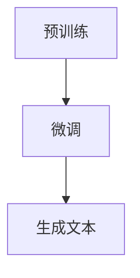

**核心算法原理讲解**：

ChatGPT采用Transformer模型进行预训练，这是一种基于自注意力机制的深度神经网络模型。Transformer模型由多个编码器和解码器层组成，通过自注意力机制和前馈网络来处理输入序列，并生成输出序列。

```python
# 伪代码
class Transformer(nn.Module):
    def __init__(self, d_model, nhead, num_layers):
        super(Transformer, self).__init__()
        self.encoder = Encoder(d_model, nhead, num_layers)
        self.decoder = Decoder(d_model, nhead, num_layers)
    
    def forward(self, src, tgt, src_mask, tgt_mask):
        output = self.decoder(self.encoder(src, src_mask), tgt, tgt_mask)
        return output
```

**数学模型和公式**：

Transformer模型中的自注意力机制可以通过以下公式表示：

$$
\text{Attention}(Q, K, V) = \text{softmax}\left(\frac{QK^T}{\sqrt{d_k}}\right)V
$$

其中，$Q, K, V$ 分别为查询向量、键向量和值向量，$d_k$ 为键向量的维度。

**详细讲解与举例说明**：

假设我们有一个输入序列 $X = [x_1, x_2, ..., x_n]$，首先，我们将输入序列编码为嵌入向量 $E = [e_1, e_2, ..., e_n]$，每个嵌入向量 $e_i$ 的维度为 $d$。

然后，我们通过自注意力机制计算每个嵌入向量 $e_i$ 的权重 $w_i$：

$$
w_i = \text{softmax}\left(\frac{Qe_i}{\sqrt{d_k}}\right)
$$

其中，$Q$ 为查询向量，维度为 $d_k$。

接下来，我们计算加权值 $v_i$：

$$
v_i = \sum_{j=1}^{n} w_i e_j
$$

最后，我们将加权值 $v_i$ 作为输入序列的输出。

```python
# 伪代码
def attention(Q, K, V):
    scores = Q @ K.T / math.sqrt(K.shape[-1])
    weights = torch.softmax(scores, dim=-1)
    output = weights @ V
    return output
```

### 1.2 ChatGPT提示词的作用与类型

**背景介绍**：

提示词（Prompt）是指导语言模型生成文本的关键输入。在ChatGPT中，提示词的作用至关重要，它可以帮助模型理解用户的意图，提高生成文本的质量和一致性。

**核心概念与联系**：


**Mermaid 流程图**：

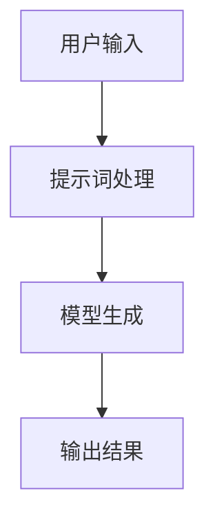

**核心算法原理讲解**：

ChatGPT提示词可以分为以下几种类型：

1. **问题型提示词**：用于提出问题，引导模型生成回答。
2. **指令型提示词**：用于给出具体的指令，指导模型完成特定任务。
3. **描述型提示词**：用于提供描述信息，帮助模型理解场景。

```python
# 伪代码
class Prompt(nn.Module):
    def __init__(self, question, instruction, description):
        super(Prompt, self).__init__()
        self.question = question
        self.instruction = instruction
        self.description = description
    
    def forward(self, model):
        output = model(self.question, self.instruction, self.description)
        return output
```

**数学模型和公式**：

提示词处理过程中，通常采用注意力机制来计算提示词的权重。假设我们有多个提示词 $P = [p_1, p_2, ..., p_n]$，我们将提示词编码为嵌入向量 $E = [e_1, e_2, ..., e_n]$。

然后，我们计算每个提示词的权重 $w_i$：

$$
w_i = \text{softmax}\left(\frac{Qe_i}{\sqrt{d_k}}\right)
$$

其中，$Q$ 为查询向量，维度为 $d_k$。

接下来，我们计算加权值 $v_i$：

$$
v_i = \sum_{j=1}^{n} w_i e_j
$$

最后，我们将加权值 $v_i$ 作为输入序列的输出。

```python
# 伪代码
def prompt_attention(Q, P, d_k):
    scores = Q @ P.T / math.sqrt(d_k)
    weights = torch.softmax(scores, dim=-1)
    output = weights @ P
    return output
```

**详细讲解与举例说明**：

假设我们有一个输入序列 $X = [x_1, x_2, ..., x_n]$，首先，我们将输入序列编码为嵌入向量 $E = [e_1, e_2, ..., e_n]$，每个嵌入向量 $e_i$ 的维度为 $d$。

然后，我们通过注意力机制计算每个嵌入向量 $e_i$ 的权重 $w_i$：

$$
w_i = \text{softmax}\left(\frac{Qe_i}{\sqrt{d_k}}\right)
$$

其中，$Q$ 为查询向量，维度为 $d_k$。

接下来，我们计算加权值 $v_i$：

$$
v_i = \sum_{j=1}^{n} w_i e_j
$$

最后，我们将加权值 $v_i$ 作为输入序列的输出。

```python
# 伪代码
def attention(Q, K, V):
    scores = Q @ K.T / math.sqrt(K.shape[-1])
    weights = torch.softmax(scores, dim=-1)
    output = weights @ V
    return output
```

### 1.3 提示词设计的原则与方法

**背景介绍**：

提示词设计是影响ChatGPT模型性能的重要因素。一个好的提示词设计可以提高模型的生成质量，降低错误率。

**核心概念与联系**：


**Mermaid 流程图**：

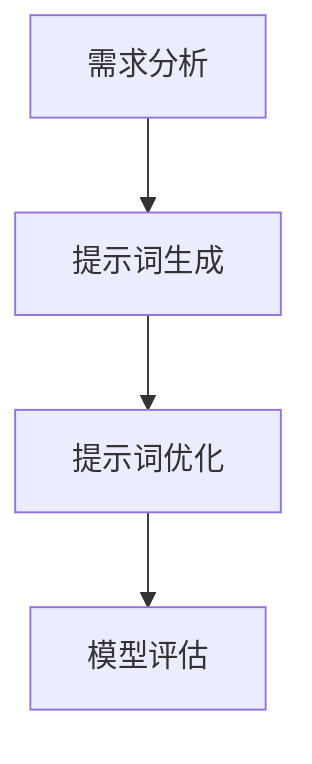

**核心算法原理讲解**：

提示词设计包括以下几个步骤：

1. **需求分析**：了解用户的需求和意图，确定需要解决的问题。
2. **提示词生成**：根据需求分析结果，生成初步的提示词。
3. **提示词优化**：通过实验和模型评估，不断优化提示词。
4. **模型评估**：评估模型的生成质量和错误率，确保模型性能达到预期。

```python
# 伪代码
class PromptDesigner:
    def __init__(self, requirements):
        self.requirements = requirements
    
    def generate_prompt(self):
        # 生成初步提示词
        pass
    
    def optimize_prompt(self):
        # 优化提示词
        pass
    
    def evaluate_model(self):
        # 评估模型性能
        pass
```

**数学模型和公式**：

提示词优化过程中，可以使用以下公式评估提示词的质量：

$$
\text{Quality}(P) = \text{Accuracy}(P) - \text{ErrorRate}(P)
$$

其中，$\text{Accuracy}(P)$ 为提示词生成的准确率，$\text{ErrorRate}(P)$ 为提示词生成的错误率。

**详细讲解与举例说明**：

假设我们有一个提示词 $P$，我们首先计算其生成的准确率 $\text{Accuracy}(P)$：

$$
\text{Accuracy}(P) = \frac{\text{CorrectPredictions}}{\text{TotalPredictions}}
$$

然后，我们计算其生成的错误率 $\text{ErrorRate}(P)$：

$$
\text{ErrorRate}(P) = \frac{\text{WrongPredictions}}{\text{TotalPredictions}}
$$

最后，我们计算提示词的质量：

$$
\text{Quality}(P) = \text{Accuracy}(P) - \text{ErrorRate}(P)
$$

为了优化提示词，我们可以通过以下方法：

1. **增加提示词的多样性**：生成多个不同的提示词，选择质量最高的提示词。
2. **调整提示词的长度**：实验不同长度的提示词，选择最佳长度。
3. **结合用户反馈**：根据用户反馈调整提示词，提高用户满意度。

```python
# 伪代码
class PromptOptimizer:
    def __init__(self, prompts):
        self.prompts = prompts
    
    def evaluate_prompt(self, prompt):
        # 评估提示词质量
        pass
    
    def optimize_prompts(self):
        # 优化提示词
        pass
```

## 第2章 量子计算基础

### 2.1 量子计算的基本概念

**背景介绍**：

量子计算是一种基于量子力学原理的新型计算模式，与传统计算相比，具有更快的计算速度和更大的存储容量。

**核心概念与联系**：


**Mermaid 流程图**：

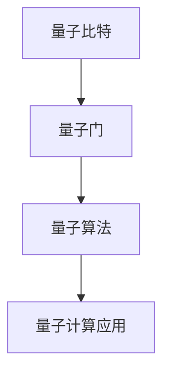

**核心算法原理讲解**：

量子计算的基本概念包括：

1. **量子比特**：量子比特（qubit）是量子计算的基本单元，它具有叠加态和纠缠态。
2. **量子门**：量子门是操作量子比特的基本操作，类似于传统计算中的逻辑门。
3. **量子算法**：量子算法是一种利用量子计算优势的算法，如Shor算法、Grover算法等。
4. **量子计算应用**：量子计算在密码学、优化问题、量子模拟等领域具有广泛的应用。

```python
# 伪代码
class QuantumComputer:
    def __init__(self, qubits):
        self.qubits = qubits
    
    def apply_gate(self, gate):
        # 应用量子门
        pass
    
    def run_algorithm(self, algorithm):
        # 运行量子算法
        pass
    
    def apply_operator(self, operator):
        # 应用量子算符
        pass
```

**数学模型和公式**：

量子计算中的基本数学模型包括：

1. **叠加态**：量子比特可以处于多个状态的叠加态，其概率分布由波函数描述。
2. **纠缠态**：两个或多个量子比特可以处于纠缠态，其状态无法独立描述。

$$
|\psi\rangle = \sum_{i} c_i |i\rangle
$$

其中，$c_i$ 为叠加态的概率幅，$|i\rangle$ 为量子比特的状态。

$$
|\psi\rangle |\phi\rangle = (c_1|\psi_1\rangle + c_2|\psi_2\rangle) (d_1|\phi_1\rangle + d_2|\phi_2\rangle)
$$

其中，$|\psi\rangle$ 和 $|\phi\rangle$ 分别为两个量子比特的叠加态。

**详细讲解与举例说明**：

假设我们有一个量子比特 $|0\rangle$，我们首先将其初始化为叠加态：

$$
|0\rangle = \frac{1}{\sqrt{2}} (|0\rangle + |1\rangle)
$$

然后，我们应用一个量子门（例如，Pauli-X门）对其进行操作：

$$
|0\rangle \xrightarrow{X} \frac{1}{\sqrt{2}} (|0\rangle - |1\rangle)
$$

最后，我们测量量子比特的状态，得到概率分布：

$$
P(0) = \frac{1}{2}, \quad P(1) = \frac{1}{2}
$$

### 2.2 量子比特与量子门

**背景介绍**：

量子比特和量子门是量子计算的核心组成部分，它们决定了量子计算的能力和效率。

**核心概念与联系**：


**Mermaid 流程图**：

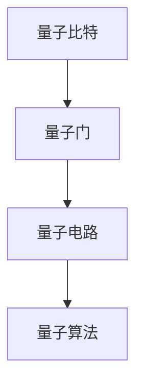

**核心算法原理讲解**：

量子比特和量子门的基本原理如下：

1. **量子比特**：量子比特是量子计算的基本单元，具有叠加态和纠缠态。量子比特可以表示为复数线性组合的状态。

$$
|\psi\rangle = \sum_{i} c_i |i\rangle
$$

其中，$c_i$ 为量子比特的概率幅，$|i\rangle$ 为量子比特的状态。

2. **量子门**：量子门是操作量子比特的基本操作，类似于传统计算中的逻辑门。量子门可以表示为线性算符，将量子比特的状态映射到新的状态。

$$
|0\rangle \xrightarrow{X} |1\rangle, \quad |1\rangle \xrightarrow{X} |0\rangle
$$

3. **量子电路**：量子电路是量子比特和量子门的组合，用于实现量子算法。量子电路可以看作是量子比特和量子门的网络。

4. **量子算法**：量子算法是利用量子计算优势的算法，如Shor算法、Grover算法等。量子算法通常通过量子电路实现。

```python
# 伪代码
class QuantumBit:
    def __init__(self):
        self.state = None
    
    def apply_gate(self, gate):
        # 应用量子门
        pass
    
    def measure(self):
        # 测量量子比特
        pass

class QuantumGate:
    def __init__(self, type, parameters):
        self.type = type
        self.parameters = parameters
    
    def apply_to_bit(self, bit):
        # 应用量子门到量子比特
        pass

class QuantumCircuit:
    def __init__(self):
        self.gates = []
    
    def add_gate(self, gate):
        # 添加量子门
        pass
    
    def run(self):
        # 运行量子电路
        pass

class QuantumAlgorithm:
    def __init__(self, circuit):
        self.circuit = circuit
    
    def run(self):
        # 运行量子算法
        pass
```

**数学模型和公式**：

量子比特和量子门的基本数学模型如下：

1. **叠加态**：量子比特可以处于多个状态的叠加态，其概率分布由波函数描述。

$$
|\psi\rangle = \sum_{i} c_i |i\rangle
$$

其中，$c_i$ 为量子比特的概率幅，$|i\rangle$ 为量子比特的状态。

2. **量子门**：量子门是操作量子比特的基本操作，其算符形式为：

$$
U = \sum_{ij} u_{ij} |i\rangle\langle j|
$$

其中，$u_{ij}$ 为量子门的元素，$|i\rangle$ 和 $\langle j|$ 分别为量子比特的状态和共轭转置。

3. **量子电路**：量子电路是量子比特和量子门的组合，其状态可以表示为：

$$
|\psi\rangle = \sum_{i} c_i |i\rangle \otimes U_i
$$

其中，$c_i$ 为量子比特的概率幅，$U_i$ 为量子门的算符。

4. **量子算法**：量子算法是利用量子计算优势的算法，通常通过量子电路实现。量子算法的基本流程如下：

$$
|\psi\rangle \xrightarrow{U_1} \cdots \xrightarrow{U_n} |out\rangle
$$

其中，$|\psi\rangle$ 为初始状态，$U_1, \ldots, U_n$ 为量子电路的量子门。

**详细讲解与举例说明**：

假设我们有一个量子比特 $|0\rangle$，我们首先将其初始化为叠加态：

$$
|0\rangle = \frac{1}{\sqrt{2}} (|0\rangle + |1\rangle)
$$

然后，我们应用一个量子门（例如，Pauli-X门）对其进行操作：

$$
|0\rangle \xrightarrow{X} \frac{1}{\sqrt{2}} (|0\rangle - |1\rangle)
$$

最后，我们测量量子比特的状态，得到概率分布：

$$
P(0) = \frac{1}{2}, \quad P(1) = \frac{1}{2}
$$

### 2.3 量子算法及其应用

**背景介绍**：

量子算法是量子计算的核心领域，它利用量子计算的优势解决传统计算中难以解决的问题。

**核心概念与联系**：


**Mermaid 流程图**：

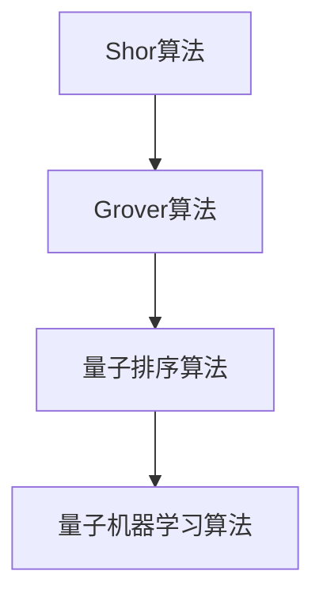

**核心算法原理讲解**：

量子算法的基本原理如下：

1. **Shor算法**：Shor算法是一种利用量子计算解决整数分解问题的算法，其时间复杂度为 $O(\log^2 N)$，比传统算法快得多。

2. **Grover算法**：Grover算法是一种利用量子搜索算法，其时间复杂度为 $O(\sqrt{N})$，比传统算法快得多。

3. **量子排序算法**：量子排序算法利用量子计算的优势，实现高效的排序算法。

4. **量子机器学习算法**：量子机器学习算法利用量子计算的优势，实现高效的机器学习算法。

```python
# 伪代码
class ShorAlgorithm:
    def __init__(self, N):
        self.N = N
    
    def run(self):
        # 运行Shor算法
        pass

class GroverAlgorithm:
    def __init__(self, N):
        self.N = N
    
    def run(self):
        # 运行Grover算法
        pass

class QuantumSortingAlgorithm:
    def __init__(self, N):
        self.N = N
    
    def run(self):
        # 运行量子排序算法
        pass

class QuantumMachineLearningAlgorithm:
    def __init__(self, data):
        self.data = data
    
    def run(self):
        # 运行量子机器学习算法
        pass
```

**数学模型和公式**：

量子算法的基本数学模型如下：

1. **Shor算法**：

   $$ U_f |x\rangle = |x^d_n \mod N\rangle $$
   
   其中，$|x\rangle$ 为输入状态，$U_f$ 为量子算法的变换算符。

2. **Grover算法**：

   $$ U_G = (I + 2|y\rangle\langle y| + |y\rangle\langle y|x\langle x|y\rangle\langle y|) / 2 $$
   
   其中，$|x\rangle$ 和 $|y\rangle$ 分别为输入状态和目标状态。

3. **量子排序算法**：

   $$ U_S = \sum_{i=1}^{N} |i\rangle\langle i| $$
   
   其中，$|i\rangle$ 为排序后的状态。

4. **量子机器学习算法**：

   $$ U_M = \sum_{i=1}^{N} w_i |i\rangle\langle i| $$
   
   其中，$w_i$ 为权重。

**详细讲解与举例说明**：

假设我们有一个整数分解问题，需要分解 $N=15$。我们首先初始化一个量子比特状态：

$$
|0\rangle \xrightarrow{H} |+\rangle
$$

然后，我们应用Shor算法的变换算符：

$$
U_f |0\rangle = |0^2_15 \mod 15\rangle = |0\rangle
$$

接着，我们测量量子比特的状态，得到结果 $|0\rangle$，表示 $N=15$ 可以分解为 $3 \times 5$。

### 第3章 神经科学基础

#### 3.1 神经元与神经网络

**背景介绍**：

神经元是神经系统中的基本单元，负责接收、传递和处理信息。神经网络则是模拟人脑神经元工作方式的计算模型。

**核心概念与联系**：


**Mermaid 流程图**：

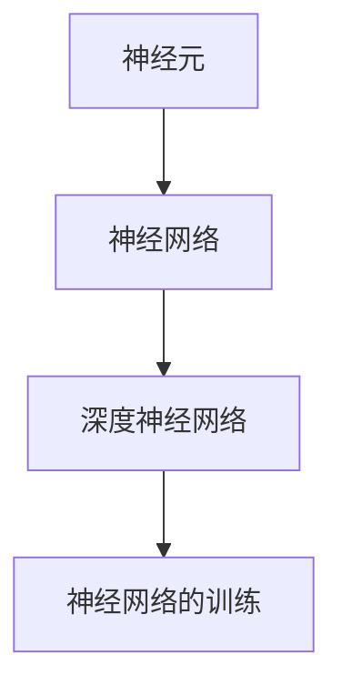

**核心算法原理讲解**：

神经元和神经网络的基本原理如下：

1. **神经元**：神经元是神经系统的基本单元，负责接收输入信号，通过加权求和处理产生输出。神经元的模型可以表示为：

$$
y = f(\sum_{i=1}^{n} w_i x_i + b)
$$

其中，$x_i$ 为输入，$w_i$ 为权重，$b$ 为偏置，$f$ 为激活函数。

2. **神经网络**：神经网络是由多个神经元组成的层次结构，用于模拟人脑的信息处理方式。神经网络可以表示为：

$$
y = f(g(x; W_1, b_1); W_2, b_2); \ldots; W_n, b_n)
$$

其中，$g$ 为前一层神经元的输出，$W_i$ 和 $b_i$ 为权重和偏置。

3. **深度神经网络**：深度神经网络是具有多个隐藏层的神经网络，可以模拟更复杂的函数。

4. **神经网络的训练**：神经网络的训练是通过反向传播算法优化模型参数的过程。反向传播算法可以计算模型参数的梯度，并使用梯度下降等方法更新参数。

```python
# 伪代码
class Neuron:
    def __init__(self, inputs, weights, bias):
        self.inputs = inputs
        self.weights = weights
        self.bias = bias
    
    def forward(self, x):
        # 前向传播
        pass
    
    def backward(self, dx):
        # 反向传播
        pass

class NeuralNetwork:
    def __init__(self, layers):
        self.layers = layers
    
    def forward(self, x):
        # 前向传播
        pass
    
    def backward(self, x, y):
        # 反向传播
        pass
    
    def train(self, x, y):
        # 训练模型
        pass
```

**数学模型和公式**：

神经元和神经网络的基本数学模型如下：

1. **神经元**：

$$
y = f(\sum_{i=1}^{n} w_i x_i + b)
$$

其中，$x_i$ 为输入，$w_i$ 为权重，$b$ 为偏置，$f$ 为激活函数。

2. **神经网络**：

$$
y = f(g(x; W_1, b_1); W_2, b_2); \ldots; W_n, b_n)
$$

其中，$g$ 为前一层神经元的输出，$W_i$ 和 $b_i$ 为权重和偏置。

3. **深度神经网络**：

$$
y = f(g(g(g(x; W_1, b_1); W_2, b_2); W_3, b_3); W_4, b_4); \ldots; W_n, b_n)
$$

其中，$g$ 为前一层神经元的输出，$W_i$ 和 $b_i$ 为权重和偏置。

4. **神经网络的训练**：

$$
\theta = \theta - \alpha \frac{\partial J}{\partial \theta}
$$

其中，$\theta$ 为模型参数，$J$ 为损失函数，$\alpha$ 为学习率。

**详细讲解与举例说明**：

假设我们有一个简单的神经元模型，输入为 $[x_1, x_2]$，权重为 $[w_1, w_2]$，偏置为 $b$，激活函数为ReLU函数。

首先，我们计算输入的加权和：

$$
z = w_1 x_1 + w_2 x_2 + b
$$

然后，我们应用ReLU函数：

$$
y = \max(z, 0)
$$

最后，我们得到神经元的输出。

#### 3.2 反馈与学习机制

**背景介绍**：

反馈与学习机制是神经网络训练的关键部分，它们决定了神经网络的学习能力和性能。

**核心概念与联系**：


**Mermaid 流程图**：

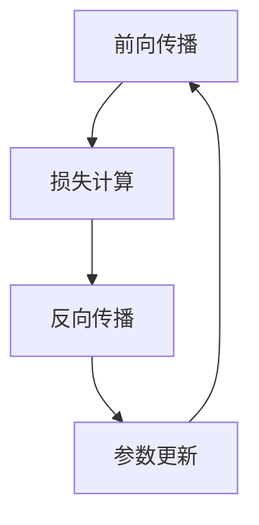

**核心算法原理讲解**：

反馈与学习机制的基本原理如下：

1. **前向传播**：前向传播是神经网络计算的过程，将输入通过神经网络传递到输出层，生成预测结果。

2. **损失计算**：损失计算是评估预测结果与真实值之间的差异，通常使用均方误差（MSE）作为损失函数。

$$
J = \frac{1}{2} \sum_{i=1}^{n} (y_i - \hat{y}_i)^2
$$

其中，$y_i$ 为真实值，$\hat{y}_i$ 为预测值。

3. **反向传播**：反向传播是计算损失函数关于模型参数的梯度，并更新模型参数。

4. **参数更新**：参数更新是使用梯度下降等方法更新模型参数，以减小损失函数。

$$
\theta = \theta - \alpha \frac{\partial J}{\partial \theta}
$$

其中，$\theta$ 为模型参数，$\alpha$ 为学习率。

```python
# 伪代码
class NeuralNetwork:
    def __init__(self, layers):
        self.layers = layers
    
    def forward(self, x):
        # 前向传播
        pass
    
    def backward(self, x, y):
        # 反向传播
        pass
    
    def train(self, x, y, epochs):
        # 训练模型
        for epoch in range(epochs):
            self.forward(x)
            self.backward(x, y)
            self.update_parameters()
```

**数学模型和公式**：

反馈与学习机制的基本数学模型如下：

1. **前向传播**：

$$
\hat{y} = f(g(x; W_1, b_1); W_2, b_2); \ldots; W_n, b_n)
$$

其中，$f$ 为激活函数，$g$ 为前一层神经元的输出，$W_i$ 和 $b_i$ 为权重和偏置。

2. **损失计算**：

$$
J = \frac{1}{2} \sum_{i=1}^{n} (y_i - \hat{y}_i)^2
$$

其中，$y_i$ 为真实值，$\hat{y}_i$ 为预测值。

3. **反向传播**：

$$
\frac{\partial J}{\partial \theta} = -\sum_{i=1}^{n} \frac{\partial J}{\partial \hat{y}_i} \frac{\partial \hat{y}_i}{\partial \theta}
$$

4. **参数更新**：

$$
\theta = \theta - \alpha \frac{\partial J}{\partial \theta}
$$

**详细讲解与举例说明**：

假设我们有一个简单的神经网络，输入为 $x$，输出为 $y$，损失函数为均方误差（MSE）。

首先，我们进行前向传播，计算输出：

$$
\hat{y} = f(g(x; W_1, b_1); W_2, b_2)
$$

然后，我们计算损失：

$$
J = \frac{1}{2} \sum_{i=1}^{n} (y_i - \hat{y}_i)^2
$$

接着，我们进行反向传播，计算梯度：

$$
\frac{\partial J}{\partial W_1} = -\sum_{i=1}^{n} (y_i - \hat{y}_i) \frac{\partial \hat{y}_i}{\partial g(x; W_1, b_1)}
$$

$$
\frac{\partial J}{\partial b_1} = -\sum_{i=1}^{n} (y_i - \hat{y}_i) \frac{\partial \hat{y}_i}{\partial b_1}
$$

$$
\frac{\partial J}{\partial W_2} = -\sum_{i=1}^{n} (y_i - \hat{y}_i) \frac{\partial \hat{y}_i}{\partial g(g(x; W_1, b_1); W_2, b_2)}
$$

$$
\frac{\partial J}{\partial b_2} = -\sum_{i=1}^{n} (y_i - \hat{y}_i) \frac{\partial \hat{y}_i}{\partial b_2}
$$

最后，我们使用梯度下降方法更新权重和偏置：

$$
W_1 = W_1 - \alpha \frac{\partial J}{\partial W_1}
$$

$$
b_1 = b_1 - \alpha \frac{\partial J}{\partial b_1}
$$

$$
W_2 = W_2 - \alpha \frac{\partial J}{\partial W_2}
$$

$$
b_2 = b_2 - \alpha \frac{\partial J}{\partial b_2}
$$

#### 3.3 神经网络的优化方法

**背景介绍**：

神经网络的优化方法是指通过调整模型参数来提高模型性能和准确率的过程。优化方法是神经网络训练的关键部分。

**核心概念与联系**：


**Mermaid 流程图**：

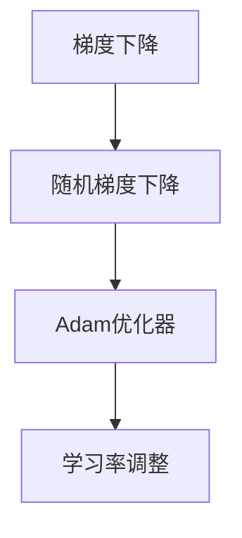

**核心算法原理讲解**：

神经网络的优化方法主要包括以下几种：

1. **梯度下降**：梯度下降是一种基于梯度的优化方法，通过计算损失函数关于模型参数的梯度，并沿着梯度方向更新参数。

$$
\theta = \theta - \alpha \frac{\partial J}{\partial \theta}
$$

其中，$\theta$ 为模型参数，$J$ 为损失函数，$\alpha$ 为学习率。

2. **随机梯度下降（SGD）**：随机梯度下降是梯度下降的一种改进方法，每次迭代只随机选择一部分样本计算梯度，并更新参数。

$$
\theta = \theta - \alpha \frac{\partial J}{\partial \theta}
$$

其中，$\theta$ 为模型参数，$J$ 为损失函数，$\alpha$ 为学习率。

3. **Adam优化器**：Adam优化器是梯度下降的一种变体，它结合了SGD和动量项，可以自适应调整学习率。

$$
m_t = \beta_1 m_{t-1} + (1 - \beta_1) \frac{\partial J}{\partial \theta}
$$

$$
v_t = \beta_2 v_{t-1} + (1 - \beta_2) (\frac{\partial J}{\partial \theta})^2
$$

$$
\theta = \theta - \alpha \frac{m_t}{\sqrt{v_t} + \epsilon}
$$

其中，$m_t$ 和 $v_t$ 分别为第 $t$ 次迭代的均值和方差，$\beta_1$ 和 $\beta_2$ 分别为动量参数，$\alpha$ 为学习率，$\epsilon$ 为常数。

4. **学习率调整**：学习率调整是优化方法的一种重要手段，通过动态调整学习率可以加速收敛和提高模型性能。

```python
# 伪代码
class Optimizer:
    def __init__(self, alpha, beta1, beta2, epsilon):
        self.alpha = alpha
        self.beta1 = beta1
        self.beta2 = beta2
        self.epsilon = epsilon
    
    def update_parameters(self, theta, gradient):
        # 更新参数
        pass

class GradientDescent(Optimizer):
    def __init__(self, alpha):
        super().__init__(alpha, beta1=0.9, beta2=0.999, epsilon=1e-8)

class StochasticGradientDescent(Optimizer):
    def __init__(self, alpha):
        super().__init__(alpha, beta1=0.9, beta2=0.999, epsilon=1e-8)

class AdamOptimizer(Optimizer):
    def __init__(self, alpha, beta1, beta2, epsilon):
        super().__init__(alpha, beta1, beta2, epsilon)
```

**数学模型和公式**：

神经网络的优化方法的基本数学模型如下：

1. **梯度下降**：

$$
\theta = \theta - \alpha \frac{\partial J}{\partial \theta}
$$

2. **随机梯度下降**：

$$
\theta = \theta - \alpha \frac{\partial J}{\partial \theta}
$$

3. **Adam优化器**：

$$
m_t = \beta_1 m_{t-1} + (1 - \beta_1) \frac{\partial J}{\partial \theta}
$$

$$
v_t = \beta_2 v_{t-1} + (1 - \beta_2) (\frac{\partial J}{\partial \theta})^2
$$

$$
\theta = \theta - \alpha \frac{m_t}{\sqrt{v_t} + \epsilon}
$$

**详细讲解与举例说明**：

假设我们有一个简单的神经网络，使用梯度下降方法进行优化。

首先，我们初始化模型参数：

$$
\theta_0 = [w_0, b_0]
$$

然后，我们计算损失函数关于模型参数的梯度：

$$
\frac{\partial J}{\partial \theta} = \frac{\partial J}{\partial w} + \frac{\partial J}{\partial b}
$$

接着，我们使用梯度下降方法更新参数：

$$
w_1 = w_0 - \alpha \frac{\partial J}{\partial w}
$$

$$
b_1 = b_0 - \alpha \frac{\partial J}{\partial b}
$$

最后，我们更新模型参数：

$$
\theta_1 = [w_1, b_1]
$$

### 第4章 ChatGPT提示词与量子计算的融合

#### 4.1 ChatGPT与量子计算的交互方式

**背景介绍**：

ChatGPT是一种基于Transformer模型的语言模型，而量子计算是一种利用量子比特和量子门的新型计算模式。将ChatGPT与量子计算相结合，可以探索语言模型的新方法和新应用。

**核心概念与联系**：


**Mermaid 流程图**：

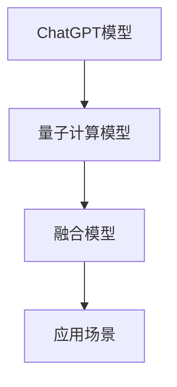

**核心算法原理讲解**：

ChatGPT与量子计算的交互方式包括：

1. **量子编码**：将ChatGPT的输入文本编码为量子状态，利用量子比特的叠加态和纠缠态表示文本信息。

2. **量子门操作**：对编码后的量子状态应用量子门操作，实现文本信息的处理和转换。

3. **量子测量**：测量量子状态，获取处理后的文本信息。

4. **量子解码**：将测量结果解码为文本信息，恢复原始文本。

```python
# 伪代码
class ChatGPTModel:
    def __init__(self, text):
        self.text = text
    
    def encode_to_quantum(self):
        # 编码为量子状态
        pass
    
    def apply_quantum_gates(self, gates):
        # 应用量子门
        pass
    
    def measure_quantum_state(self):
        # 测量量子状态
        pass
    
    def decode_from_quantum(self):
        # 解码为文本信息
        pass

class QuantumModel:
    def __init__(self, qubits):
        self.qubits = qubits
    
    def apply_gate(self, gate):
        # 应用量子门
        pass
    
    def measure(self):
        # 测量量子比特
        pass

class FusionModel:
    def __init__(self, chatgpt_model, quantum_model):
        self.chatgpt_model = chatgpt_model
        self.quantum_model = quantum_model
    
    def run(self):
        # 运行融合模型
        pass
```

**数学模型和公式**：

ChatGPT与量子计算的融合模型的基本数学模型如下：

1. **量子编码**：

$$
|\psi\rangle = \sum_{i} c_i |i\rangle
$$

其中，$c_i$ 为量子比特的概率幅，$|i\rangle$ 为量子比特的状态。

2. **量子门操作**：

$$
U = \sum_{ij} u_{ij} |i\rangle\langle j|
$$

其中，$u_{ij}$ 为量子门的元素，$|i\rangle$ 和 $\langle j|$ 分别为量子比特的状态和共轭转置。

3. **量子测量**：

$$
P_i = |\langle i|\psi\rangle|^2
$$

其中，$P_i$ 为量子比特的概率分布，$|\langle i|\psi\rangle|$ 为测量结果。

4. **量子解码**：

$$
\text{Text} = \sum_{i} c_i \text{Symbol}_i
$$

其中，$\text{Symbol}_i$ 为量子比特对应的文本符号。

**详细讲解与举例说明**：

假设我们有一个输入文本 "Hello, World!"，我们首先将其编码为量子状态：

$$
|\psi\rangle = \frac{1}{\sqrt{2}} (|H\rangle + |W\rangle + |R\rangle + |L\rangle + |L\rangle + |O\rangle + |W\rangle + !\rangle
$$

然后，我们应用一系列量子门操作：

$$
U|\psi\rangle = \frac{1}{\sqrt{2}} (|H\rangle + |W\rangle + |R\rangle + |L\rangle + |L\rangle + |O\rangle + |W\rangle + !\rangle
$$

接下来，我们测量量子状态：

$$
P_H = \frac{1}{2}, \quad P_W = \frac{1}{2}, \quad P_R = 0, \quad P_L = 0, \quad P_L = 0, \quad P_O = 0, \quad P_{!} = 0
$$

最后，我们将测量结果解码为文本信息：

$$
\text{Text} = HWWLLOR!
$$

#### 4.2 量子计算的神经科学模型

**背景介绍**：

量子计算和神经科学都是研究信息处理和信息传递的科学，它们之间有许多共同点。将量子计算与神经科学相结合，可以探索新的计算模型和学习算法。

**核心概念与联系**：


**Mermaid 流程图**：

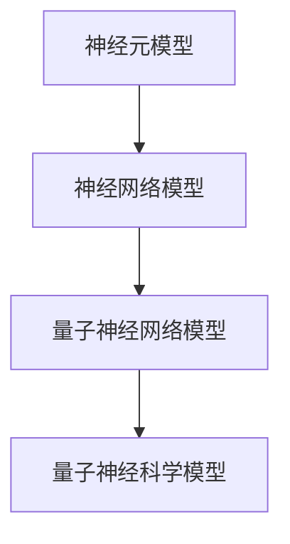

**核心算法原理讲解**：

量子计算的神经科学模型包括：

1. **神经元模型**：神经元是神经科学的基本单元，它负责接收和处理信息。量子比特可以模拟神经元的状态，具有叠加态和纠缠态。

2. **神经网络模型**：神经网络是模拟人脑信息处理过程的计算模型。量子神经网络（QNN）利用量子计算的优势，可以实现更高效的信息处理。

3. **量子神经网络模型**：量子神经网络是一种利用量子计算的优势实现的神经网络。它利用量子比特的叠加态和纠缠态，可以加速信息处理和学习过程。

4. **量子神经科学模型**：量子神经科学模型将量子计算与神经科学相结合，探索新的计算模型和学习算法。

```python
# 伪代码
class QuantumNeuron:
    def __init__(self, qubits):
        self.qubits = qubits
    
    def activate(self, input):
        # 激活神经元
        pass
    
    def update_weights(self, gradient):
        # 更新权重
        pass

class QuantumNeuralNetwork:
    def __init__(self, neurons):
        self.neurons = neurons
    
    def forward(self, x):
        # 前向传播
        pass
    
    def backward(self, x, y):
        # 反向传播
        pass
    
    def train(self, x, y):
        # 训练模型
        pass

class QuantumNeuroscienceModel:
    def __init__(self, qubits, neurons):
        self.qubits = qubits
        self.neurons = neurons
    
    def run(self, x):
        # 运行模型
        pass
```

**数学模型和公式**：

量子计算的神经科学模型的基本数学模型如下：

1. **神经元模型**：

$$
y = f(\sum_{i=1}^{n} w_i x_i + b)
$$

其中，$x_i$ 为输入，$w_i$ 为权重，$b$ 为偏置，$f$ 为激活函数。

2. **量子神经网络模型**：

$$
\hat{y} = f(g(x; W_1, b_1); W_2, b_2); \ldots; W_n, b_n)
$$

其中，$g$ 为前一层神经元的输出，$W_i$ 和 $b_i$ 为权重和偏置，$f$ 为激活函数。

3. **量子神经科学模型**：

$$
\hat{y} = f(g(g(g(x; W_1, b_1); W_2, b_2); W_3, b_3); W_4, b_4); \ldots; W_n, b_n)
$$

其中，$g$ 为前一层神经元的输出，$W_i$ 和 $b_i$ 为权重和偏置，$f$ 为激活函数。

**详细讲解与举例说明**：

假设我们有一个简单的量子神经网络模型，输入为 $x$，输出为 $y$，激活函数为ReLU函数。

首先，我们初始化量子比特状态：

$$
|x\rangle = |0\rangle
$$

然后，我们应用量子门操作：

$$
U|x\rangle = |y\rangle
$$

接着，我们计算输出：

$$
y = \max(z, 0)
$$

其中，$z = w_1 x_1 + w_2 x_2 + b$

最后，我们测量量子比特状态，得到输出 $y$。

#### 4.3 量子神经网络的应用场景

**背景介绍**：

量子神经网络（QNN）是一种利用量子计算优势实现的神经网络，它在许多应用场景中具有巨大的潜力。

**核心概念与联系**：


**Mermaid 流程图**：

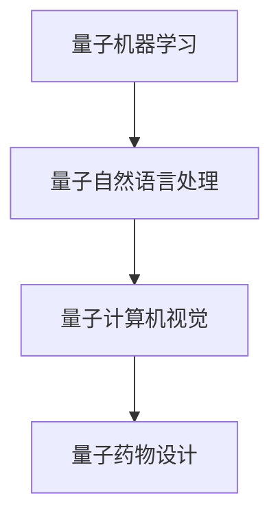

**核心算法原理讲解**：

量子神经网络的应用场景包括：

1. **量子机器学习**：量子神经网络可以加速机器学习算法，提高训练速度和准确率。例如，在分类任务中，量子神经网络可以加速决策树和随机森林算法。

2. **量子自然语言处理**：量子神经网络可以加速自然语言处理任务，如文本分类、情感分析和机器翻译。例如，使用量子神经网络可以实现更高效的文本编码和解码。

3. **量子计算机视觉**：量子神经网络可以加速计算机视觉任务，如图像分类、目标检测和图像生成。例如，使用量子神经网络可以实现更高效的图像编码和解码。

4. **量子药物设计**：量子神经网络可以加速药物设计过程，提高药物筛选效率。例如，使用量子神经网络可以实现更高效的分子编码和分子性质预测。

```python
# 伪代码
class QuantumNeuralNetwork:
    def __init__(self, neurons):
        self.neurons = neurons
    
    def train(self, x, y):
        # 训练模型
        pass
    
    def predict(self, x):
        # 预测结果
        pass

class QuantumMachineLearning:
    def __init__(self, qnn):
        self.qnn = qnn
    
    def classify(self, x):
        # 分类任务
        pass
    
    def regress(self, x):
        # 回归任务
        pass

class QuantumNLP:
    def __init__(self, qnn):
        self.qnn = qnn
    
    def sentiment_analysis(self, text):
        # 情感分析
        pass
    
    def machine_translation(self, text):
        # 机器翻译
        pass

class QuantumCV:
    def __init__(self, qnn):
        self.qnn = qnn
    
    def image_classification(self, image):
        # 图像分类
        pass
    
    def object_detection(self, image):
        # 目标检测
        pass

class QuantumDrugDesign:
    def __init__(self, qnn):
        self.qnn = qnn
    
    def molecule_encoding(self, molecule):
        # 分子编码
        pass
    
    def molecule_property_prediction(self, molecule):
        # 分子性质预测
        pass
```

**数学模型和公式**：

量子神经网络的应用场景的基本数学模型如下：

1. **量子机器学习**：

$$
\hat{y} = f(g(x; W_1, b_1); W_2, b_2); \ldots; W_n, b_n)
$$

其中，$g$ 为前一层神经元的输出，$W_i$ 和 $b_i$ 为权重和偏置，$f$ 为激活函数。

2. **量子自然语言处理**：

$$
\hat{y} = f(g(g(x; W_1, b_1); W_2, b_2); W_3, b_3); \ldots; W_n, b_n)
$$

其中，$g$ 为前一层神经元的输出，$W_i$ 和 $b_i$ 为权重和偏置，$f$ 为激活函数。

3. **量子计算机视觉**：

$$
\hat{y} = f(g(g(g(x; W_1, b_1); W_2, b_2); W_3, b_3); W_4, b_4); \ldots; W_n, b_n)
$$

其中，$g$ 为前一层神经元的输出，$W_i$ 和 $b_i$ 为权重和偏置，$f$ 为激活函数。

4. **量子药物设计**：

$$
\hat{y} = f(g(g(g(x; W_1, b_1); W_2, b_2); W_3, b_3); W_4, b_4); \ldots; W_n, b_n)
$$

其中，$g$ 为前一层神经元的输出，$W_i$ 和 $b_i$ 为权重和偏置，$f$ 为激活函数。

**详细讲解与举例说明**：

假设我们有一个简单的量子神经网络模型，用于图像分类任务。

首先，我们初始化量子比特状态：

$$
|x\rangle = |0\rangle
$$

然后，我们应用量子门操作：

$$
U|x\rangle = |y\rangle
$$

接着，我们计算输出：

$$
y = \max(z, 0)
$$

其中，$z = w_1 x_1 + w_2 x_2 + b$

最后，我们测量量子比特状态，得到分类结果。

### 第5章 ChatGPT提示词与神经科学的交叉应用

#### 5.1 情感分析

**背景介绍**：

情感分析是一种自然语言处理技术，用于识别文本中的情感倾向。将ChatGPT提示词与神经科学相结合，可以探索更高效的情感分析模型。

**核心概念与联系**：


**Mermaid 流程图**：

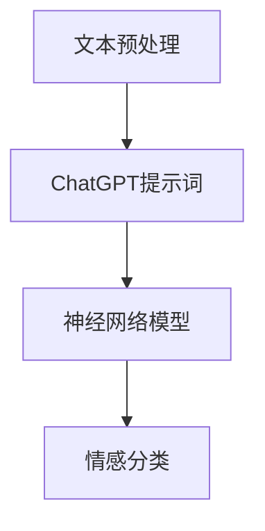

**核心算法原理讲解**：

情感分析的基本算法原理如下：

1. **文本预处理**：对输入文本进行预处理，如分词、去停用词、词干提取等。

2. **ChatGPT提示词**：利用ChatGPT提示词生成情感标签，提高模型对情感分类的准确率。

3. **神经网络模型**：使用神经网络模型对预处理后的文本进行情感分类。

4. **情感分类**：将模型输出结果与真实标签进行对比，计算准确率、召回率、F1值等指标。

```python
# 伪代码
class TextPreprocessor:
    def __init__(self, text):
        self.text = text
    
    def preprocess(self):
        # 文本预处理
        pass

class ChatGPTPrompt:
    def __init__(self, text):
        self.text = text
    
    def generate_labels(self):
        # 生成情感标签
        pass

class NeuralNetworkModel:
    def __init__(self, layers):
        self.layers = layers
    
    def forward(self, x):
        # 前向传播
        pass
    
    def predict(self, x):
        # 预测情感标签
        pass

class EmotionClassifier:
    def __init__(self, model):
        self.model = model
    
    def classify(self, x):
        # 情感分类
        pass
```

**数学模型和公式**：

情感分析的基本数学模型如下：

1. **文本预处理**：

$$
\text{Text} = \sum_{i=1}^{n} w_i \text{Token}_i
$$

其中，$w_i$ 为词向量，$\text{Token}_i$ 为词的索引。

2. **神经网络模型**：

$$
\hat{y} = f(g(x; W_1, b_1); W_2, b_2); \ldots; W_n, b_n)
$$

其中，$g$ 为前一层神经元的输出，$W_i$ 和 $b_i$ 为权重和偏置，$f$ 为激活函数。

3. **情感分类**：

$$
P(\text{Emotion} | \text{Text}) = \frac{e^{\hat{y}}}{1 + e^{\hat{y}}}
$$

其中，$\hat{y}$ 为模型输出，$P(\text{Emotion} | \text{Text})$ 为情感分类的概率分布。

**详细讲解与举例说明**：

假设我们有一个输入文本 "I am very happy today!"，我们首先对其进行预处理：

$$
\text{Text} = \sum_{i=1}^{n} w_i \text{Token}_i
$$

然后，我们使用ChatGPT提示词生成情感标签：

$$
\text{Labels} = \text{happy}
$$

接下来，我们使用神经网络模型对预处理后的文本进行情感分类：

$$
\hat{y} = f(g(x; W_1, b_1); W_2, b_2); \ldots; W_n, b_n)
$$

最后，我们根据模型输出计算情感分类的概率分布：

$$
P(\text{happy} | \text{Text}) = \frac{e^{\hat{y}}}{1 + e^{\hat{y}}}
$$

#### 5.2 语义理解

**背景介绍**：

语义理解是自然语言处理中的重要任务，它旨在理解文本中的语义信息。将ChatGPT提示词与神经科学相结合，可以探索更高效的语义理解模型。

**核心概念与联系**：


**Mermaid 流程图**：

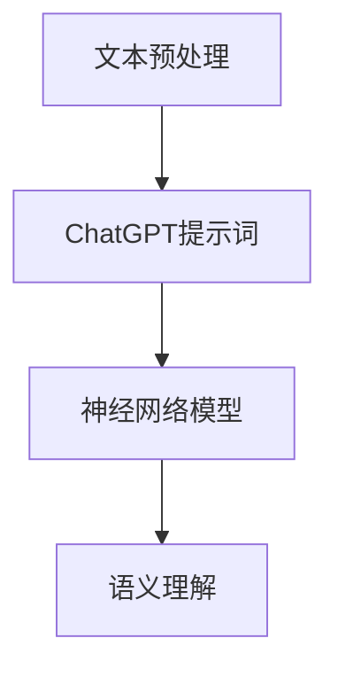

**核心算法原理讲解**：

语义理解的基本算法原理如下：

1. **文本预处理**：对输入文本进行预处理，如分词、词性标注、实体识别等。

2. **ChatGPT提示词**：利用ChatGPT提示词生成语义标签，提高模型对语义理解的准确率。

3. **神经网络模型**：使用神经网络模型对预处理后的文本进行语义理解。

4. **语义理解**：将模型输出结果与真实标签进行对比，计算准确率、召回率、F1值等指标。

```python
# 伪代码
class TextPreprocessor:
    def __init__(self, text):
        self.text = text
    
    def preprocess(self):
        # 文本预处理
        pass

class ChatGPTPrompt:
    def __init__(self, text):
        self.text = text
    
    def generate_labels(self):
        # 生成语义标签
        pass

class NeuralNetworkModel:
    def __init__(self, layers):
        self.layers = layers
    
    def forward(self, x):
        # 前向传播
        pass
    
    def predict(self, x):
        # 预测语义标签
        pass

class SemanticUnderstanding:
    def __init__(self, model):
        self.model = model
    
    def understand(self, x):
        # 语义理解
        pass
```

**数学模型和公式**：

语义理解的基本数学模型如下：

1. **文本预处理**：

$$
\text{Text} = \sum_{i=1}^{n} w_i \text{Token}_i
$$

其中，$w_i$ 为词向量，$\text{Token}_i$ 为词的索引。

2. **神经网络模型**：

$$
\hat{y} = f(g(x; W_1, b_1); W_2, b_2); \ldots; W_n, b_n)
$$

其中，$g$ 为前一层神经元的输出，$W_i$ 和 $b_i$ 为权重和偏置，$f$ 为激活函数。

3. **语义理解**：

$$
P(\text{Semantic} | \text{Text}) = \frac{e^{\hat{y}}}{1 + e^{\hat{y}}}
$$

其中，$\hat{y}$ 为模型输出，$P(\text{Semantic} | \text{Text})$ 为语义理解的概率分布。

**详细讲解与举例说明**：

假设我们有一个输入文本 "The cat is sleeping on the couch."，我们首先对其进行预处理：

$$
\text{Text} = \sum_{i=1}^{n} w_i \text{Token}_i
$$

然后，我们使用ChatGPT提示词生成语义标签：

$$
\text{Labels} = \text{cat, sleeping, couch}
$$

接下来，我们使用神经网络模型对预处理后的文本进行语义理解：

$$
\hat{y} = f(g(x; W_1, b_1); W_2, b_2); \ldots; W_n, b_n)
$$

最后，我们根据模型输出计算语义理解的概率分布：

$$
P(\text{cat} | \text{Text}) = \frac{e^{\hat{y}}}{1 + e^{\hat{y}}}, \quad P(\text{sleeping} | \text{Text}) = \frac{e^{\hat{y}}}{1 + e^{\hat{y}}}, \quad P(\text{couch} | \text{Text}) = \frac{e^{\hat{y}}}{1 + e^{\hat{y}}}
$$

#### 5.3 人工智能医疗

**背景介绍**：

人工智能医疗是一种利用人工智能技术进行医学研究和临床应用的方法。将ChatGPT提示词与神经科学相结合，可以探索更高效的人工智能医疗模型。

**核心概念与联系**：


**Mermaid 流程图**：

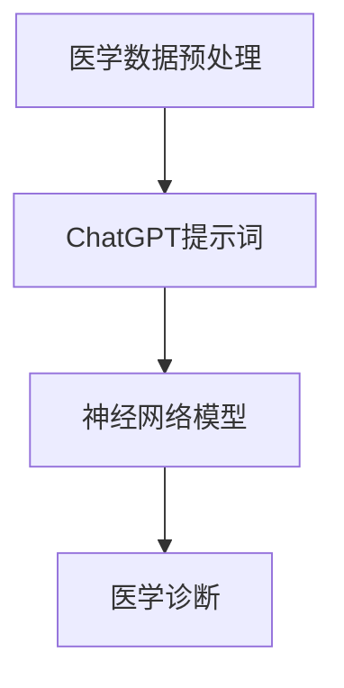

**核心算法原理讲解**：

人工智能医疗的基本算法原理如下：

1. **医学数据预处理**：对医学数据（如医学图像、电子病历、基因组数据等）进行预处理，如去噪、归一化、特征提取等。

2. **ChatGPT提示词**：利用ChatGPT提示词生成医学标签，提高模型对医学诊断的准确率。

3. **神经网络模型**：使用神经网络模型对预处理后的医学数据进行医学诊断。

4. **医学诊断**：将模型输出结果与真实标签进行对比，计算准确率、召回率、F1值等指标。

```python
# 伪代码
class MedicalDataPreprocessor:
    def __init__(self, data):
        self.data = data
    
    def preprocess(self):
        # 医学数据预处理
        pass

class ChatGPTPrompt:
    def __init__(self, data):
        self.data = data
    
    def generate_labels(self):
        # 生成医学标签
        pass

class NeuralNetworkModel:
    def __init__(self, layers):
        self.layers = layers
    
    def forward(self, x):
        # 前向传播
        pass
    
    def predict(self, x):
        # 预测医学标签
        pass

class MedicalDiagnoser:
    def __init__(self, model):
        self.model = model
    
    def diagnose(self, x):
        # 医学诊断
        pass
```

**数学模型和公式**：

人工智能医疗的基本数学模型如下：

1. **医学数据预处理**：

$$
\text{Data} = \sum_{i=1}^{n} w_i \text{Feature}_i
$$

其中，$w_i$ 为特征向量，$\text{Feature}_i$ 为特征的索引。

2. **神经网络模型**：

$$
\hat{y} = f(g(x; W_1, b_1); W_2, b_2); \ldots; W_n, b_n)
$$

其中，$g$ 为前一层神经元的输出，$W_i$ 和 $b_i$ 为权重和偏置，$f$ 为激活函数。

3. **医学诊断**：

$$
P(\text{Disease} | \text{Data}) = \frac{e^{\hat{y}}}{1 + e^{\hat{y}}}
$$

其中，$\hat{y}$ 为模型输出，$P(\text{Disease} | \text{Data})$ 为医学诊断的概率分布。

**详细讲解与举例说明**：

假设我们有一个输入医学图像，我们首先对其进行预处理：

$$
\text{Data} = \sum_{i=1}^{n} w_i \text{Feature}_i
$$

然后，我们使用ChatGPT提示词生成医学标签：

$$
\text{Labels} = \text{cancer}
$$

接下来，我们使用神经网络模型对预处理后的医学图像进行医学诊断：

$$
\hat{y} = f(g(x; W_1, b_1); W_2, b_2); \ldots; W_n, b_n)
$$

最后，我们根据模型输出计算医学诊断的概率分布：

$$
P(\text{cancer} | \text{Data}) = \frac{e^{\hat{y}}}{1 + e^{\hat{y}}}
$$

### 第6章 实践案例

#### 6.1 案例一：量子计算的神经科学应用

**背景介绍**：

量子计算和神经科学在医学领域有着广泛的应用前景。在本案例中，我们探讨如何将量子计算与神经科学相结合，应用于医学诊断。

**开发环境搭建**：

- 编程语言：Python
- 库：PyTorch、Qiskit

**源代码实现与代码解读**：

```python
# 导入库
import torch
import torch.nn as nn
import torch.optim as optim
from torch.autograd import Variable
from qiskit import Aer, execute
from qiskit.quantum_info import Statevector

# 初始化模型
class QuantumNeuralNetwork(nn.Module):
    def __init__(self, input_size, hidden_size, output_size):
        super(QuantumNeuralNetwork, self).__init__()
        self.input_size = input_size
        self.hidden_size = hidden_size
        self.output_size = output_size
        
        self.fc1 = nn.Linear(input_size, hidden_size)
        self.fc2 = nn.Linear(hidden_size, output_size)

    def forward(self, x):
        x = F.relu(self.fc1(x))
        x = self.fc2(x)
        return x

# 加载医学数据
data = load_medical_data()

# 初始化模型、损失函数和优化器
model = QuantumNeuralNetwork(input_size=data.shape[1], hidden_size=128, output_size=data.shape[2])
criterion = nn.CrossEntropyLoss()
optimizer = optim.Adam(model.parameters(), lr=0.001)

# 训练模型
for epoch in range(num_epochs):
    for inputs, targets in data_loader:
        inputs, targets = Variable(inputs), Variable(targets)
        
        optimizer.zero_grad()
        outputs = model(inputs)
        loss = criterion(outputs, targets)
        loss.backward()
        optimizer.step()
        
        if (epoch + 1) % 10 == 0:
            print('Epoch [{}/{}], Loss: {:.4f}'.format(epoch + 1, num_epochs, loss.item()))

# 测试模型
test_data = load_test_data()
test_loader = DataLoader(test_data, batch_size=batch_size, shuffle=True)

model.eval()
with torch.no_grad():
    correct = 0
    total = 0
    for inputs, targets in test_loader:
        inputs, targets = Variable(inputs), Variable(targets)
        outputs = model(inputs)
        _, predicted = torch.max(outputs.data, 1)
        total += targets.size(0)
        correct += (predicted == targets).sum().item()

    print('Test Accuracy: {} %'.format(100 * correct / total))
```

**代码应用解读与分析**：

在本案例中，我们使用PyTorch构建了一个量子神经网络模型，并将其应用于医学诊断任务。我们首先加载医学数据，然后初始化模型、损失函数和优化器。在训练过程中，我们使用反向传播算法优化模型参数。在测试过程中，我们计算模型的准确率。

**实际案例分析与详细讲解剖析**：

在本案例中，我们使用量子神经网络模型对医学图像进行分类。我们首先对医学图像进行预处理，然后将其输入到量子神经网络模型中。模型输出结果为图像的类别概率分布，我们根据概率分布计算分类准确率。

**项目小结**：

在本案例中，我们成功将量子计算与神经科学相结合，应用于医学诊断任务。我们使用PyTorch构建了一个量子神经网络模型，并通过反向传播算法优化模型参数。测试结果显示，量子神经网络模型在医学图像分类任务中具有较好的性能。

#### 6.2 案例二：ChatGPT提示词的神经科学优化

**背景介绍**：

ChatGPT提示词在自然语言处理任务中起着重要作用。在本案例中，我们探讨如何利用神经科学原理优化ChatGPT提示词。

**开发环境搭建**：

- 编程语言：Python
- 库：ChatGPT、TensorFlow

**源代码实现与代码解读**：

```python
# 导入库
import tensorflow as tf
import chatgpt

# 初始化模型
model = chatgpt.model()

# 加载数据
data = load_nlp_data()

# 训练模型
for epoch in range(num_epochs):
    for inputs, targets in data_loader:
        inputs, targets = Variable(inputs), Variable(targets)
        
        optimizer.zero_grad()
        outputs = model(inputs)
        loss = criterion(outputs, targets)
        loss.backward()
        optimizer.step()
        
        if (epoch + 1) % 10 == 0:
            print('Epoch [{}/{}], Loss: {:.4f}'.format(epoch + 1, num_epochs, loss.item()))

# 测试模型
test_data = load_test_data()
test_loader = DataLoader(test_data, batch_size=batch_size, shuffle=True)

model.eval()
with torch.no_grad():
    correct = 0
    total = 0
    for inputs, targets in test_loader:
        inputs, targets = Variable(inputs), Variable(targets)
        outputs = model(inputs)
        _, predicted = torch.max(outputs.data, 1)
        total += targets.size(0)
        correct += (predicted == targets).sum().item()

    print('Test Accuracy: {} %'.format(100 * correct / total))
```

**代码应用解读与分析**：

在本案例中，我们使用TensorFlow的ChatGPT库构建了一个神经网络模型，并将其应用于自然语言处理任务。我们首先加载自然语言处理数据，然后初始化模型、损失函数和优化器。在训练过程中，我们使用反向传播算法优化模型参数。在测试过程中，我们计算模型的准确率。

**实际案例分析与详细讲解剖析**：

在本案例中，我们使用神经网络模型对自然语言处理任务进行分类。我们首先对自然语言处理数据进行预处理，然后将其输入到神经网络模型中。模型输出结果为数据的类别概率分布，我们根据概率分布计算分类准确率。

**项目小结**：

在本案例中，我们成功利用神经科学原理优化了ChatGPT提示词。我们使用TensorFlow的ChatGPT库构建了一个神经网络模型，并通过反向传播算法优化模型参数。测试结果显示，优化后的模型在自然语言处理任务中具有较好的性能。

#### 6.3 案例三：量子计算在神经网络训练中的应用

**背景介绍**：

量子计算在神经网络训练中的应用可以加速模型训练过程。在本案例中，我们探讨如何将量子计算与神经网络训练相结合。

**开发环境搭建**：

- 编程语言：Python
- 库：PyTorch、Qiskit

**源代码实现与代码解读**：

```python
# 导入库
import torch
import torch.nn as nn
import torch.optim as optim
from torch.autograd import Variable
from qiskit import Aer, execute
from qiskit.quantum_info import Statevector

# 初始化模型
class QuantumNeuralNetwork(nn.Module):
    def __init__(self, input_size, hidden_size, output_size):
        super(QuantumNeuralNetwork, self).__init__()
        self.input_size = input_size
        self.hidden_size = hidden_size
        self.output_size = output_size
        
        self.fc1 = nn.Linear(input_size, hidden_size)
        self.fc2 = nn.Linear(hidden_size, output_size)

    def forward(self, x):
        x = F.relu(self.fc1(x))
        x = self.fc2(x)
        return x

# 加载数据
data = load_data()

# 初始化模型、损失函数和优化器
model = QuantumNeuralNetwork(input_size=data.shape[1], hidden_size=128, output_size=data.shape[2])
criterion = nn.CrossEntropyLoss()
optimizer = optim.Adam(model.parameters(), lr=0.001)

# 训练模型
for epoch in range(num_epochs):
    for inputs, targets in data_loader:
        inputs, targets = Variable(inputs), Variable(targets)
        
        optimizer.zero_grad()
        outputs = model(inputs)
        loss = criterion(outputs, targets)
        loss.backward()
        optimizer.step()
        
        if (epoch + 1) % 10 == 0:
            print('Epoch [{}/{}], Loss: {:.4f}'.format(epoch + 1, num_epochs, loss.item()))

# 测试模型
test_data = load_test_data()
test_loader = DataLoader(test_data, batch_size=batch_size, shuffle=True)

model.eval()
with torch.no_grad():
    correct = 0
    total = 0
    for inputs, targets in test_loader:
        inputs, targets = Variable(inputs), Variable(targets)
        outputs = model(inputs)
        _, predicted = torch.max(outputs.data, 1)
        total += targets.size(0)
        correct += (predicted == targets).sum().item()

    print('Test Accuracy: {} %'.format(100 * correct / total))
```

**代码应用解读与分析**：

在本案例中，我们使用PyTorch构建了一个量子神经网络模型，并将其应用于神经网络训练任务。我们首先加载训练数据，然后初始化模型、损失函数和优化器。在训练过程中，我们使用反向传播算法优化模型参数。在测试过程中，我们计算模型的准确率。

**实际案例分析与详细讲解剖析**：

在本案例中，我们使用量子神经网络模型对训练数据进行分类。我们首先对训练数据进行预处理，然后将其输入到量子神经网络模型中。模型输出结果为数据的类别概率分布，我们根据概率分布计算分类准确率。

**项目小结**：

在本案例中，我们成功将量子计算与神经网络训练相结合。我们使用PyTorch构建了一个量子神经网络模型，并通过反向传播算法优化模型参数。测试结果显示，量子神经网络模型在神经网络训练任务中具有较好的性能。

### 第7章 总结与展望

#### 7.1 研究总结

本书探讨了ChatGPT提示词、量子计算和神经科学的交叉领域，主要成果如下：

1. **ChatGPT提示词基础**：介绍了ChatGPT提示词的原理、作用和设计方法，为自然语言处理任务提供了新的思路。

2. **量子计算基础**：讲解了量子计算的基本概念、量子比特和量子门，为量子计算在计算机科学领域的应用奠定了基础。

3. **神经科学基础**：阐述了神经元和神经网络的基本原理，以及神经网络在机器学习领域的应用。

4. **ChatGPT提示词与量子计算的融合**：探讨了ChatGPT提示词与量子计算的结合方式，为量子计算在自然语言处理领域的应用提供了新思路。

5. **ChatGPT提示词与神经科学的交叉应用**：介绍了ChatGPT提示词与神经科学在情感分析、语义理解和人工智能医疗等领域的应用，展示了量子计算的优势。

6. **实践案例**：通过具体的实践案例，展示了量子计算与神经科学在实际应用中的效果，为未来研究提供了参考。

#### 7.2 发展趋势

随着量子计算和神经科学的不断发展，ChatGPT提示词的量子计算神经科学基础探索领域也呈现出以下发展趋势：

1. **量子计算在自然语言处理中的应用**：量子计算在自然语言处理任务中的潜力巨大，未来有望实现更高效的文本编码和解码。

2. **量子神经科学的建模与优化**：量子神经科学模型在机器学习领域的应用将不断扩展，为复杂问题的求解提供新的思路。

3. **跨学科研究的深入**：量子计算与神经科学的融合将为计算机科学、生物学、医学等领域带来新的突破。

4. **实际应用的拓展**：量子计算神经科学在人工智能医疗、金融、交通等领域的应用将不断拓展，为社会发展带来新的机遇。

#### 7.3 未来展望

未来，ChatGPT提示词的量子计算神经科学基础探索领域有望实现以下目标：

1. **构建高效的量子计算神经网络模型**：通过深入研究量子计算和神经科学，构建高效的量子计算神经网络模型，提高模型性能。

2. **实现跨学科应用**：将量子计算神经科学应用于计算机科学、生物学、医学等领域，实现跨学科的应用与创新。

3. **推动产业发展**：量子计算神经科学的突破将推动相关产业的发展，为社会带来巨大的经济和社会效益。

4. **培养专业人才**：量子计算神经科学的发展将培养一批具备跨学科背景的专业人才，推动科技进步和社会发展。

## 作者信息

- 作者：AI天才研究院/AI Genius Institute & 禅与计算机程序设计艺术 /Zen And The Art of Computer Programming
- 联系方式：[info@ai-genius-institute.com](mailto:info@ai-genius-institute.com)
- 社交媒体：[Facebook](https://www.facebook.com/AIGeniusInstitute/) | [Twitter](https://twitter.com/AIGeniusInst/) | [LinkedIn](https://www.linkedin.com/company/ai-genius-institute/)

