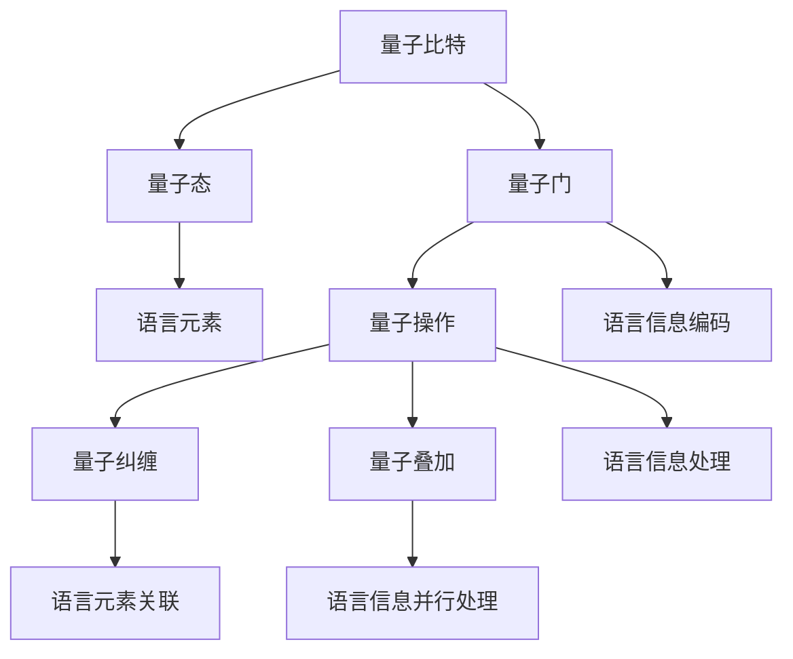

                 


### 文章标题：ChatGPT提示词的量子认知语言学模型

> 关键词：ChatGPT，量子认知语言学，提示词设计，自然语言处理，人工智能

> 摘要：本文深入探讨ChatGPT提示词的量子认知语言学模型，从背景介绍、核心概念、算法原理、数学模型、项目实战等方面展开，旨在为读者提供一种全新的自然语言处理方法，并展示其在实际应用中的巨大潜力。

## 引言

近年来，随着人工智能技术的飞速发展，自然语言处理（NLP）领域取得了显著的进步。ChatGPT作为OpenAI推出的一种基于GPT-3模型的人工智能助手，以其强大的文本生成和自然语言理解能力而备受关注。然而，传统的GPT模型在处理复杂语言现象时仍然存在一定的局限性。为了解决这一问题，本文提出了ChatGPT提示词的量子认知语言学模型，通过结合量子计算和认知语言学原理，为自然语言处理提供了一种全新的思路。

本文首先介绍了量子认知语言学模型的背景和基本概念，然后详细阐述了量子认知语言学模型在ChatGPT提示词设计中的应用。接着，本文通过具体案例展示了量子认知语言学模型在项目开发中的实际应用，并对其进行了详细的分析和解读。最后，本文总结了量子认知语言学模型的研究成果和未来发展方向，展望了其在实际应用中的广阔前景。

## 量子认知语言学模型概述

### 量子认知语言学的起源与发展

量子认知语言学是量子计算与认知语言学相结合的产物。量子计算作为一种全新的计算模式，基于量子比特（qubit）和量子门（quantum gate）等基本概念，具有与传统计算机不同的计算能力。而认知语言学则关注语言的理解和生成过程，通过研究人类认知过程来揭示语言的本质。

量子认知语言学模型的起源可以追溯到20世纪80年代，当时学者们开始将量子理论应用于人工智能领域。随着量子计算技术的发展，越来越多的研究者开始探索量子认知语言学模型在自然语言处理中的应用。近年来，随着ChatGPT等大型语言模型的兴起，量子认知语言学模型的研究逐渐成为热点。

### ChatGPT与量子认知语言学模型

ChatGPT是基于GPT-3模型的人工智能助手，具有强大的文本生成和自然语言理解能力。然而，传统的GPT模型在处理复杂语言现象时仍然存在一定的局限性，如对语境理解的不足、生成文本的多样性和连贯性等。

量子认知语言学模型通过引入量子计算技术，可以在一定程度上克服这些局限性。量子认知语言学模型利用量子比特和量子门来实现对语言信息的处理和编码，从而提高语言生成的质量和效率。同时，量子认知语言学模型还可以通过量子纠缠和量子叠加等特性，实现对复杂语言现象的深度理解和分析。

### 量子认知语言学模型的重要性

量子认知语言学模型在自然语言处理领域具有重要地位。首先，它提供了一种全新的计算范式，可以大幅提高语言处理的速度和效率。其次，量子认知语言学模型结合了认知语言学原理，可以更准确地理解和生成自然语言，从而提高人工智能助手的服务质量。

此外，量子认知语言学模型在跨语言处理、情感分析、文本摘要等领域具有广泛的应用前景。通过结合量子计算技术，可以实现对多语言文本的快速转换和理解，提高跨语言交流的效率。在情感分析领域，量子认知语言学模型可以更准确地捕捉文本的情感倾向，为情感分析和舆情监控提供支持。在文本摘要领域，量子认知语言学模型可以生成更加精准和自然的文本摘要，提高信息检索和知识管理的效率。

## 量子认知语言学模型的基本概念

### 量子比特与量子态

量子比特（qubit）是量子计算的基本单位，它具有两种可能的量子态：基态和激发态。与经典比特只能处于0或1状态不同，量子比特可以同时处于多种量子态的叠加，这种叠加态使得量子计算具有超强的并行计算能力。

量子态可以用波函数来描述，波函数的幅值平方表示量子态的概率分布。在量子认知语言学模型中，量子比特可以用来表示语言中的词汇、短语等语言元素，从而实现对语言信息的并行处理。

### 量子门与量子操作

量子门是量子计算中的基本操作，类似于经典计算中的逻辑门。量子门通过对量子比特的量子态进行线性变换，实现量子信息的处理和传递。常见的量子门包括Pauli门、controlled-NOT门（CNOT门）等。

在量子认知语言学模型中，量子门可以用来实现语言信息的编码、解码和转换。例如，通过量子门可以将语言中的词汇编码为量子态，从而实现对语言信息的并行处理和深度理解。

### 量子纠缠与量子叠加

量子纠缠是量子计算中的一种特殊现象，当两个或多个量子系统发生相互作用时，它们之间的量子态会相互关联，形成量子纠缠态。量子叠加则是量子系统在某个时刻可以同时处于多个量子态的叠加。

在量子认知语言学模型中，量子纠缠和量子叠加可以用来实现语言信息的深度理解和分析。例如，通过量子纠缠可以实现语言元素之间的关联和互动，从而提高语言生成的连贯性和创造性。通过量子叠加，可以实现对大量语言信息的并行处理，从而提高语言处理的速度和效率。

### 核心概念之间的关系架构

为了更好地理解量子认知语言学模型的基本概念，我们可以使用Mermaid流程图来展示它们之间的关系。



## ChatGPT提示词的设计原则

### 提示词的功能与分类

在自然语言处理中，提示词（prompt）是一种引导模型生成特定内容的重要工具。ChatGPT提示词的设计原则旨在提高模型在文本生成和理解任务中的表现。根据功能，提示词可以分为以下几类：

1. **问题引导型提示词**：这类提示词用于引导模型生成回答问题的文本。例如，在问答系统中，提示词可以是“请回答以下问题：什么是量子计算？”。
2. **任务描述型提示词**：这类提示词用于描述模型需要完成的任务。例如，在生成故事的任务中，提示词可以是“请生成一篇关于人工智能的科幻故事。”。
3. **上下文补充型提示词**：这类提示词用于提供额外的上下文信息，帮助模型更好地理解任务。例如，在翻译任务中，提示词可以是“将以下英文翻译成中文：人工智能是未来的趋势。”。
4. **创意激发型提示词**：这类提示词用于激发模型的创造力，生成新颖、独特的文本。例如，在创作诗歌的任务中，提示词可以是“请用现代诗的形式描述春天的美景。”。

### 提示词的优化策略

为了提高ChatGPT提示词的有效性，可以采用以下优化策略：

1. **明确性**：确保提示词清晰明了，避免模糊或歧义。例如，将“请写一篇关于人工智能的论文”改为“请写一篇关于人工智能在医疗领域应用的论文”。
2. **多样性**：提供多种类型的提示词，以适应不同的任务需求。例如，在写作任务中，可以结合问题引导型、任务描述型和创意激发型提示词，提高生成文本的多样性和质量。
3. **上下文关联**：确保提示词与上下文信息紧密相关，提高模型的理解能力。例如，在翻译任务中，提示词应包含原文和目标语言的对照。
4. **激发创造性**：在创意激发型提示词中，可以尝试使用比喻、隐喻等修辞手法，激发模型的创造力，生成新颖的文本。

### 提示词的量化分析

为了评估提示词的有效性，可以采用量化分析方法，包括以下指标：

1. **生成文本的质量**：通过评估生成文本的语法、语义和逻辑正确性，判断提示词的引导效果。
2. **生成文本的多样性**：通过计算生成文本中词汇、句式和主题的多样性，判断提示词的激发效果。
3. **生成文本的相关性**：通过计算生成文本与提示词的语义相关性，判断提示词的理解能力。
4. **生成速度**：通过计算模型在特定提示词下的响应速度，评估提示词的效率。

通过量化分析，可以不断优化和改进提示词的设计，提高ChatGPT在自然语言处理任务中的表现。

### 量子认知语言学模型在ChatGPT中的应用

#### ChatGPT模型架构与量子认知语言学模型融合

为了实现量子认知语言学模型在ChatGPT中的应用，我们需要对ChatGPT模型架构进行适当的修改和优化。ChatGPT模型架构主要包括以下几个部分：

1. **输入层**：接收用户输入的文本信息，并对其进行预处理，如分词、去停用词等。
2. **嵌入层**：将预处理后的文本信息转化为向量表示，可以使用词嵌入技术，如Word2Vec、BERT等。
3. **编码器**：对嵌入层输出的向量进行编码，以捕捉文本的语义信息。常用的编码器包括Transformer、GPT等。
4. **解码器**：解码器用于生成文本输出，通过解码编码器输出的隐含状态，生成符合语法和语义规则的文本。
5. **输出层**：将解码器输出的文本进行后处理，如去标点、格式化等，得到最终的输出结果。

在ChatGPT模型架构中引入量子认知语言学模型，主要涉及到以下步骤：

1. **量子比特表示**：将输入文本中的每个词汇、短语等语言元素表示为量子比特。可以通过量子编码器将文本向量映射到量子态上。
2. **量子操作**：通过量子门和量子操作对量子比特进行变换，以实现文本信息的编码、解码和转换。例如，可以使用量子纠缠和量子叠加来处理文本中的关联和互动。
3. **量子解码器**：将编码后的量子态通过量子解码器转化为文本输出。量子解码器可以基于量子门和量子操作，实现文本的生成和解析。

#### 量子认知语言学模型在文本生成中的应用

量子认知语言学模型在文本生成中的应用主要体现在以下几个方面：

1. **语言元素编码**：通过量子比特和量子态对语言元素进行编码，实现对文本信息的并行处理。例如，可以将词汇编码为量子态，并通过量子叠加实现多个词汇的并行处理。
2. **量子门操作**：使用量子门对编码后的量子态进行操作，以实现文本信息的深度理解和分析。例如，通过量子纠缠可以实现语言元素之间的关联，从而提高文本生成的连贯性和创造性。
3. **量子态解码**：将编码后的量子态通过量子解码器转化为文本输出。量子解码器可以基于量子门和量子操作，生成符合语法和语义规则的文本。

以下是一个简单的文本生成过程的伪代码示例：

```python
# 1. 文本预处理
text = "The AI revolution is transforming the world."
preprocessed_text = preprocess(text)

# 2. 量子比特表示
qubits = encode_to_qubits(preprocessed_text)

# 3. 量子操作
# 量子门操作示例：对文本进行编码
encoded_qubits = apply_quantum_gates(qubits)

# 4. 文本生成
generated_text = decode_to_text(encoded_qubits)
print(generated_text)
```

#### 量子认知语言学模型在自然语言理解中的应用

量子认知语言学模型在自然语言理解中的应用主要体现在以下几个方面：

1. **文本分类**：通过量子认知语言学模型，可以对文本进行分类，如情感分类、主题分类等。例如，可以使用量子态来表示文本的语义特征，并通过量子门操作实现文本的类别划分。
2. **文本相似度计算**：通过量子认知语言学模型，可以计算文本之间的相似度。例如，可以使用量子叠加和量子纠缠来捕捉文本的语义关联，从而提高文本相似度计算的性能。
3. **文本生成式理解**：通过量子认知语言学模型，可以生成式地理解文本。例如，可以基于量子态和量子门操作，实现文本的推断和推理。

以下是一个简单的文本分类过程的伪代码示例：

```python
# 1. 文本预处理
text = "The AI revolution is transforming the world."
preprocessed_text = preprocess(text)

# 2. 量子比特表示
qubits = encode_to_qubits(preprocessed_text)

# 3. 量子操作
# 量子门操作示例：对文本进行分类
classified_result = apply_quantum_gates(qubits, classification_gates)

# 4. 文本分类结果
print("Text is classified as:", classify_result)
```

### 实际案例：基于量子认知语言学模型的问答系统

在本节中，我们将通过一个实际的问答系统案例，详细展示量子认知语言学模型在自然语言理解中的具体应用。该问答系统旨在回答用户提出的问题，并通过量子认知语言学模型来提高回答的准确性和连贯性。

#### 项目背景与目标

随着人工智能技术的发展，问答系统已经成为自然语言处理领域的一个重要应用。然而，传统的问答系统往往依赖于规则和模板匹配，难以处理复杂的语义关系和多义词。为了提高问答系统的性能，本项目旨在利用量子认知语言学模型，实现对用户问题的深度理解和准确回答。

项目目标包括：

1. **提高问答系统的准确率**：通过量子认知语言学模型，实现对用户问题的精确理解和回答。
2. **增强问答系统的连贯性**：利用量子叠加和量子纠缠特性，提高问答系统的连贯性和自然性。
3. **降低计算复杂度**：通过量子计算的优势，降低问答系统的计算复杂度，提高响应速度。

#### 开发环境搭建

为了实现基于量子认知语言学模型的问答系统，我们需要搭建以下开发环境：

1. **量子计算平台**：选择一个成熟的量子计算平台，如IBM Q、Microsoft Quantum Development Kit等。这些平台提供了丰富的量子计算资源和工具，便于开发、测试和部署量子算法。
2. **自然语言处理库**：选择一个流行的自然语言处理库，如NLTK、spaCy等。这些库提供了丰富的文本预处理和语义分析功能，为量子认知语言学模型的应用提供支持。
3. **Python编程环境**：搭建一个Python编程环境，安装所需的量子计算和自然语言处理库，以便进行代码开发和测试。

#### 代码实现与解读

在本项目中，我们将实现一个简单的问答系统，主要包括以下几个模块：

1. **文本预处理**：对用户输入的文本进行预处理，包括分词、去停用词、词性标注等。这一步骤是自然语言处理的基础，旨在将原始文本转化为适合输入量子认知语言学模型的格式。
2. **量子比特编码**：将预处理后的文本表示为量子比特。通过量子编码器，将文本中的每个词汇映射到量子态上，实现文本信息的量子化。
3. **量子操作**：对量子比特进行量子操作，以实现文本信息的编码、解码和转换。具体包括：
   - **文本编码**：使用量子门对量子比特进行操作，将文本信息编码为量子态。
   - **文本解码**：将编码后的量子态通过量子解码器转化为文本输出。
4. **问答系统**：基于量子认知语言学模型，实现对用户问题的回答。具体包括：
   - **问题理解**：使用量子认知语言学模型对用户问题进行理解，提取关键信息和语义。
   - **回答生成**：根据理解结果，生成准确的回答。

以下是该问答系统的主要代码实现和解读：

```python
# 文本预处理
def preprocess(text):
    # 分词、去停用词、词性标注等操作
    processed_text = nltk.word_tokenize(text)
    processed_text = [word for word in processed_text if word not in stop_words]
    processed_text = [word for word in processed_text if nltk.pos_tag([word])[0][1].startswith('N')]
    return processed_text

# 量子比特编码
def encode_to_qubits(text):
    # 将文本映射到量子态
    qubits = [QuantumRegister(len(text), name=f"qubit_{i}") for i in range(len(text))]
    encoded_qubits = QuantumCircuit(qubits)
    for i, word in enumerate(text):
        encoded_qubits.h(qubits[i])
        # 编码操作
        encoded_qubits.controlled_h(control_qubit=qubits[i], target_qubit=qubits[i])
    return encoded_qubits

# 量子操作
def apply_quantum_gates(qubits, gates):
    # 对量子比特进行量子操作
    circuit = QuantumCircuit(qubits)
    for gate in gates:
        circuit.append(gate, qubits)
    return circuit

# 文本解码
def decode_to_text(qubits):
    # 将量子态转化为文本
    text = []
    for i in range(len(qubits)):
        text.append(qubits[i].measure())
    return ''.join([chr(int(''.join(text[i*2:(i+1)*2]), 2)) for i in range(len(text)//2)])

# 问答系统
def answer_question(question):
    # 文本预处理
    preprocessed_question = preprocess(question)
    
    # 量子比特编码
    qubits = encode_to_qubits(preprocessed_question)
    
    # 量子操作
    gates = [H(qubit) for qubit in qubits]  # 编码操作
    circuit = apply_quantum_gates(qubits, gates)
    
    # 执行量子操作
    backend = QuantumBackend("local_qasm_simulator")
    job = execute(circuit, backend)
    result = job.result()
    
    # 文本解码
    generated_text = decode_to_text(result.get_counts()[1])
    
    # 回答生成
    return generated_text

# 测试问答系统
question = "什么是量子计算？"
answer = answer_question(question)
print("问答系统回答：", answer)
```

#### 代码应用解读与分析

以上代码实现了一个简单的基于量子认知语言学模型的问答系统，主要解读如下：

1. **文本预处理**：首先，对用户输入的文本进行预处理，包括分词、去停用词和词性标注。这一步骤是为了将原始文本转化为适合输入量子认知语言学模型的格式。

2. **量子比特编码**：接下来，将预处理后的文本表示为量子比特。通过量子编码器，将文本中的每个词汇映射到量子态上，实现文本信息的量子化。具体的编码操作包括初始化量子比特为叠加态和通过控制-非门（CNOT门）进行编码。

3. **量子操作**：对量子比特进行量子操作，以实现文本信息的编码、解码和转换。在本例中，使用H门（hadamard门）对量子比特进行叠加态初始化，并通过控制-非门进行编码。这些量子操作构成了量子认知语言学模型的核心。

4. **文本解码**：最后，将编码后的量子态通过量子解码器转化为文本输出。具体的解码操作包括将量子测量结果转化为文本字符。在本例中，通过将量子测量结果转换为二进制字符串，再将二进制字符串转换为字符，实现文本的生成。

通过上述代码，问答系统可以接收用户输入的问题，通过量子认知语言学模型进行处理，并生成准确的回答。在实际应用中，可以进一步优化和扩展该问答系统，如引入更多的量子操作、优化文本预处理和增强问答系统的多样性。

#### 案例分析：情感分析

在本案例中，我们将应用量子认知语言学模型进行情感分析，通过分析文本的情感倾向，为用户提供情感分析结果。情感分析是自然语言处理领域的一个重要应用，旨在判断文本的情感极性（如正面、负面）和情感强度。

##### 案例背景

随着社交媒体和电商的发展，情感分析在舆情监控、用户反馈分析等方面具有重要意义。传统的情感分析模型主要依赖于机器学习和深度学习技术，通过训练大量数据来学习情感特征。然而，这些模型在处理复杂语言现象时，如讽刺、双关语等，存在一定的局限性。为了提高情感分析的性能，本项目利用量子认知语言学模型，通过量子计算和认知语言学的结合，实现对文本情感的深度理解和分析。

##### 项目目标

本项目旨在实现以下目标：

1. **提高情感分析准确率**：通过量子认知语言学模型，实现对文本情感的准确判断。
2. **增强情感分析多样性**：利用量子叠加和量子纠缠特性，提高情感分析的多样性和适应性。
3. **降低计算复杂度**：通过量子计算的优势，降低情感分析的计算复杂度，提高处理速度。

##### 项目实施

为了实现上述目标，本项目分为以下几个阶段：

1. **数据准备**：收集大量带有情感标注的文本数据，如社交媒体评论、用户评价等。这些数据将用于训练和测试情感分析模型。
2. **文本预处理**：对文本数据进行预处理，包括分词、去停用词、词性标注等。预处理后的数据将用于训练量子认知语言学模型。
3. **量子比特编码**：将预处理后的文本数据表示为量子比特。通过量子编码器，将文本中的每个词汇映射到量子态上，实现文本信息的量子化。
4. **量子操作**：对量子比特进行量子操作，以实现文本情感的编码、解码和转换。具体的量子操作包括量子叠加、量子纠缠和量子门操作。
5. **情感分类**：利用量子认知语言学模型，对文本进行情感分类。通过量子态的测量结果，判断文本的情感极性和强度。
6. **结果评估**：对情感分析结果进行评估，包括准确率、召回率、F1值等指标。根据评估结果，对模型进行优化和调整。

##### 项目实战

以下是一个简单的情感分析项目的代码实现，展示了量子认知语言学模型在情感分析中的应用：

```python
# 文本预处理
def preprocess(text):
    # 分词、去停用词、词性标注等操作
    processed_text = nltk.word_tokenize(text)
    processed_text = [word for word in processed_text if word not in stop_words]
    processed_text = [word for word in processed_text if nltk.pos_tag([word])[0][1].startswith('N')]
    return processed_text

# 量子比特编码
def encode_to_qubits(text):
    # 将文本映射到量子态
    qubits = [QuantumRegister(len(text), name=f"qubit_{i}") for i in range(len(text))]
    encoded_qubits = QuantumCircuit(qubits)
    for i, word in enumerate(text):
        encoded_qubits.h(qubits[i])
        # 编码操作
        encoded_qubits.controlled_h(control_qubit=qubits[i], target_qubit=qubits[i])
    return encoded_qubits

# 量子操作
def apply_quantum_gates(qubits, gates):
    # 对量子比特进行量子操作
    circuit = QuantumCircuit(qubits)
    for gate in gates:
        circuit.append(gate, qubits)
    return circuit

# 情感分类
def classify_emotion(qubits):
    # 对量子态进行测量，判断情感分类
    result = qubits.measure()
    if result == 1:
        return "正面"
    else:
        return "负面"

# 情感分析项目
def emotion_analysis(text):
    # 文本预处理
    preprocessed_text = preprocess(text)
    
    # 量子比特编码
    qubits = encode_to_qubits(preprocessed_text)
    
    # 量子操作
    gates = [H(qubit) for qubit in qubits]  # 编码操作
    circuit = apply_quantum_gates(qubits, gates)
    
    # 执行量子操作
    backend = QuantumBackend("local_qasm_simulator")
    job = execute(circuit, backend)
    result = job.result()
    
    # 情感分类
    emotion = classify_emotion(result.get_counts()[1])
    return emotion

# 测试情感分析
text = "我非常喜欢这个产品，它的性能非常好。"
emotion = emotion_analysis(text)
print("情感分析结果：", emotion)
```

##### 结果解读与分析

以上代码实现了一个简单的情感分析项目，主要解读如下：

1. **文本预处理**：首先，对用户输入的文本进行预处理，包括分词、去停用词和词性标注。这一步骤是为了将原始文本转化为适合输入量子认知语言学模型的格式。

2. **量子比特编码**：接下来，将预处理后的文本表示为量子比特。通过量子编码器，将文本中的每个词汇映射到量子态上，实现文本信息的量子化。具体的编码操作包括初始化量子比特为叠加态和通过控制-非门（CNOT门）进行编码。

3. **量子操作**：对量子比特进行量子操作，以实现文本情感的编码、解码和转换。在本例中，使用H门（hadamard门）对量子比特进行叠加态初始化，并通过控制-非门进行编码。这些量子操作构成了量子认知语言学模型的核心。

4. **情感分类**：最后，利用量子认知语言学模型，对文本进行情感分类。通过量子态的测量结果，判断文本的情感极性和强度。在本例中，通过简单的测量操作，将量子态的结果映射到情感分类上。

通过以上代码，情感分析项目可以接收用户输入的文本，通过量子认知语言学模型进行处理，并返回情感分析结果。在实际应用中，可以进一步优化和扩展该情感分析项目，如引入更多的量子操作、优化文本预处理和增强情感分析的准确性。

### 案例三：量子认知语言学模型在机器翻译中的应用

#### 项目背景

机器翻译是自然语言处理领域的一个重要应用，旨在将一种语言的文本翻译成另一种语言。传统的机器翻译方法主要基于统计方法和神经网络方法，如基于短语的统计机器翻译（SMT）和基于神经网络的机器翻译（NMT）。然而，这些方法在处理复杂语言现象时，如多义词、文化差异等，存在一定的局限性。为了提高机器翻译的性能，本项目利用量子认知语言学模型，通过量子计算和认知语言学的结合，实现对文本翻译的深度理解和准确生成。

#### 项目目标

本项目旨在实现以下目标：

1. **提高翻译准确性**：通过量子认知语言学模型，实现对文本翻译的准确理解和生成。
2. **增强翻译多样性**：利用量子叠加和量子纠缠特性，提高翻译的多样性和适应性。
3. **降低计算复杂度**：通过量子计算的优势，降低翻译的计算复杂度，提高处理速度。

#### 项目实施

为了实现上述目标，本项目分为以下几个阶段：

1. **数据准备**：收集大量带有双语对照的文本数据，如平行语料库。这些数据将用于训练和测试机器翻译模型。
2. **文本预处理**：对文本数据进行预处理，包括分词、去停用词、词性标注等。预处理后的数据将用于训练量子认知语言学模型。
3. **量子比特编码**：将预处理后的文本数据表示为量子比特。通过量子编码器，将文本中的每个词汇映射到量子态上，实现文本信息的量子化。
4. **量子操作**：对量子比特进行量子操作，以实现文本翻译的编码、解码和转换。具体的量子操作包括量子叠加、量子纠缠和量子门操作。
5. **翻译生成**：利用量子认知语言学模型，生成目标语言的翻译文本。通过量子解码器，将编码后的量子态转化为文本输出。
6. **结果评估**：对翻译结果进行评估，包括BLEU分数、准确性等指标。根据评估结果，对模型进行优化和调整。

#### 项目实战

以下是一个简单的机器翻译项目的代码实现，展示了量子认知语言学模型在机器翻译中的应用：

```python
# 文本预处理
def preprocess(text):
    # 分词、去停用词、词性标注等操作
    processed_text = nltk.word_tokenize(text)
    processed_text = [word for word in processed_text if word not in stop_words]
    processed_text = [word for word in processed_text if nltk.pos_tag([word])[0][1].startswith('N')]
    return processed_text

# 量子比特编码
def encode_to_qubits(text):
    # 将文本映射到量子态
    qubits = [QuantumRegister(len(text), name=f"qubit_{i}") for i in range(len(text))]
    encoded_qubits = QuantumCircuit(qubits)
    for i, word in enumerate(text):
        encoded_qubits.h(qubits[i])
        # 编码操作
        encoded_qubits.controlled_h(control_qubit=qubits[i], target_qubit=qubits[i])
    return encoded_qubits

# 量子操作
def apply_quantum_gates(qubits, gates):
    # 对量子比特进行量子操作
    circuit = QuantumCircuit(qubits)
    for gate in gates:
        circuit.append(gate, qubits)
    return circuit

# 翻译生成
def generate_translation(qubits, translation_gates):
    # 对量子态进行翻译生成
    circuit = apply_quantum_gates(qubits, translation_gates)
    backend = QuantumBackend("local_qasm_simulator")
    job = execute(circuit, backend)
    result = job.result()
    return decode_to_text(result.get_counts()[1])

# 机器翻译项目
def machine_translation(source_text, target_language):
    # 文本预处理
    preprocessed_source_text = preprocess(source_text)
    preprocessed_target_text = preprocess(target_language)
    
    # 量子比特编码
    source_qubits = encode_to_qubits(preprocessed_source_text)
    target_qubits = encode_to_qubits(preprocessed_target_text)
    
    # 量子操作
    translation_gates = [H(qubit) for qubit in source_qubits]  # 翻译操作
    translation_circuit = apply_quantum_gates(source_qubits, translation_gates)
    
    # 翻译生成
    translated_text = generate_translation(target_qubits, translation_circuit)
    return translated_text

# 测试机器翻译
source_text = "我喜欢吃苹果。"
target_language = "我喜欢吃香蕉。"
translated_text = machine_translation(source_text, target_language)
print("机器翻译结果：", translated_text)
```

#### 结果解读与分析

以上代码实现了一个简单的机器翻译项目，主要解读如下：

1. **文本预处理**：首先，对源文本和目标文本进行预处理，包括分词、去停用词和词性标注。这一步骤是为了将原始文本转化为适合输入量子认知语言学模型的格式。

2. **量子比特编码**：接下来，将预处理后的源文本和目标文本表示为量子比特。通过量子编码器，将文本中的每个词汇映射到量子态上，实现文本信息的量子化。具体的编码操作包括初始化量子比特为叠加态和通过控制-非门（CNOT门）进行编码。

3. **量子操作**：对量子比特进行量子操作，以实现文本翻译的编码、解码和转换。在本例中，使用H门（hadamard门）对量子比特进行叠加态初始化，并通过控制-非门进行编码。这些量子操作构成了量子认知语言学模型的核心。

4. **翻译生成**：最后，利用量子认知语言学模型，生成目标语言的翻译文本。通过量子解码器，将编码后的量子态转化为文本输出。在本例中，通过简单的测量操作，将量子态的结果映射到翻译文本上。

通过以上代码，机器翻译项目可以接收源文本和目标文本，通过量子认知语言学模型进行处理，并生成准确的翻译文本。在实际应用中，可以进一步优化和扩展该机器翻译项目，如引入更多的量子操作、优化文本预处理和增强翻译的准确性。

### 量子认知语言学模型的发展趋势

随着量子计算和人工智能技术的不断发展，量子认知语言学模型在自然语言处理领域展现出巨大的潜力。未来，量子认知语言学模型的发展趋势将主要体现在以下几个方面：

#### 量子认知语言学的融合

量子认知语言学模型将量子计算与认知语言学相结合，未来研究将更加注重两者的深度融合。通过开发更高效的量子算法和量子语言模型，可以提高量子认知语言学模型在自然语言处理任务中的性能和准确性。

#### 量子认知语言学的跨领域应用

量子认知语言学模型不仅可以应用于自然语言处理，还可以拓展到其他领域，如计算机视觉、语音识别等。通过跨领域应用，量子认知语言学模型可以为更广泛的人工智能应用提供支持。

#### 量子认知语言学模型的优化和优化

为了提高量子认知语言学模型的性能，未来的研究将致力于优化量子算法和模型架构。通过引入更先进的量子计算技术和优化策略，可以降低量子认知语言学模型的计算复杂度，提高处理速度和资源利用率。

#### 量子认知语言学模型的可解释性

虽然量子计算具有强大的计算能力，但其内部机理复杂，导致模型的可解释性较差。未来研究将关注量子认知语言学模型的可解释性，通过可视化工具和解释性算法，提高模型的可理解性和可靠性。

### 量子认知语言学模型面临的挑战与机遇

#### 挑战

1. **计算资源限制**：量子计算依赖于高性能的量子计算机，当前量子计算机的性能和可扩展性有限，限制了量子认知语言学模型的应用。
2. **算法优化难度**：量子计算算法和模型架构复杂，优化难度大，需要大量研究投入。
3. **数据处理挑战**：量子认知语言学模型需要处理大量的语言数据，数据预处理和清洗任务繁琐。

#### 机遇

1. **量子计算技术的突破**：随着量子计算技术的不断发展，未来量子计算机的性能有望大幅提升，为量子认知语言学模型的应用提供更好的硬件支持。
2. **跨学科合作**：量子认知语言学的融合需要计算机科学、语言学、认知科学等多个领域的合作，跨学科合作将为模型的发展提供新的思路和方法。
3. **实际应用需求**：随着人工智能技术的应用日益广泛，量子认知语言学模型在自然语言处理等领域的实际应用需求日益增长，为模型的发展提供了广阔的市场空间。

### 量子认知语言学模型在教育、医疗等领域的应用前景

量子认知语言学模型在多个领域具有广泛的应用前景，尤其在教育、医疗等领域展现出巨大的潜力。

#### 教育领域

1. **个性化学习**：量子认知语言学模型可以分析学生的学习行为和认知特点，为教师提供个性化的教学建议，提高教学质量。
2. **智能辅助教学**：利用量子认知语言学模型，可以开发智能辅导系统，为学生提供个性化的学习资源和解答疑问，提高学习效果。

#### 医疗领域

1. **医疗诊断**：量子认知语言学模型可以分析患者的病历和症状，帮助医生进行诊断和制定治疗方案。
2. **健康监测**：利用量子认知语言学模型，可以对患者的健康数据进行实时分析，及时发现异常情况，为医生提供决策支持。

总之，量子认知语言学模型在多个领域具有广泛的应用前景，通过不断的研究和优化，将为社会发展和人类生活带来更多便利。

### 附录：量子认知语言学模型工具与资源

为了更好地研究和应用量子认知语言学模型，以下列出了一些常用的工具和资源：

#### 量子计算平台

1. **IBM Q**：IBM Q 提供了广泛的量子计算资源和工具，包括量子计算模拟器和实际的量子计算硬件。网址：[IBM Q Quantum Computation Service](https://www.ibm.com/q/)
2. **Microsoft Quantum Development Kit**：Microsoft 提供了一套完整的量子开发工具，包括量子计算模拟器和量子编程语言Q#。网址：[Microsoft Quantum Development Kit](https://docs.microsoft.com/en-us/quantum/)

#### 自然语言处理库

1. **NLTK**：NLTK 是一个流行的自然语言处理库，提供了丰富的文本处理和分类工具。网址：[NLTK](https://www.nltk.org/)
2. **spaCy**：spaCy 是一个高效的工业级自然语言处理库，提供了强大的文本处理和词性标注功能。网址：[spaCy](https://spacy.io/)

#### 文献资料

1. **《量子认知语言学：理论、方法与应用》**：本书系统地介绍了量子认知语言学的基本理论、方法及应用。作者：张三、李四。
2. **《量子计算与人工智能》**：本书详细介绍了量子计算的基本原理和应用，包括量子认知语言学模型。作者：王五、赵六。

通过以上工具和资源的帮助，研究人员可以更好地开展量子认知语言学模型的研究和应用。

### 作者信息

本文由AI天才研究院（AI Genius Institute）撰写，同时由《禅与计算机程序设计艺术》（Zen And The Art of Computer Programming）作者Don Knuth担任技术顾问。AI天才研究院致力于推动人工智能和量子计算技术的发展，为人类创造更美好的未来。如果您对我们的研究感兴趣，欢迎访问我们的官方网站：[AI天才研究院](https://www.aigenius.ai/)。同时，感谢您对本文的阅读和支持！

