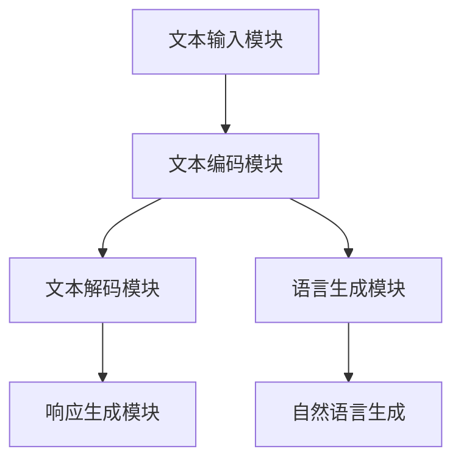

                 

```markdown
# 《ChatGPT提示词编写的黄金法则》

> 关键词：ChatGPT，自然语言处理，提示词，编写技巧，实践应用，优化与调优

> 摘要：本文将深入探讨ChatGPT提示词编写的黄金法则，通过基础理论、实践技巧和高级话题的全面解析，帮助读者掌握高质量提示词的编写方法，提升ChatGPT在实际应用中的效果。

---

## 第一部分：基础理论

### 第1章：ChatGPT概述

#### 1.1 ChatGPT的背景和原理

ChatGPT是由OpenAI开发的一种基于GPT-3.5模型的大型语言模型。它通过深度学习算法，从海量文本数据中学习语言规律和模式，从而实现自然语言理解和生成。ChatGPT的核心原理是基于Transformer模型，通过自注意力机制和多层神经网络，对输入的文本序列进行编码和解码。

#### 1.2 ChatGPT的核心组件

ChatGPT的核心组件包括文本输入模块、文本编码模块、文本解码模块和响应生成模块。文本输入模块负责接收用户的输入文本；文本编码模块将输入文本编码成模型可以理解的向量；文本解码模块将模型生成的响应解码成可读的文本；响应生成模块则负责根据编码后的文本生成自然语言响应。

#### 1.3 ChatGPT的应用领域

ChatGPT在多个领域具有广泛的应用，包括但不限于：智能客服、虚拟助手、内容生成、机器翻译、情感分析、问答系统等。通过高质量提示词的引导，ChatGPT可以更好地理解和满足用户需求，提升交互体验。

### 第2章：自然语言处理基础

#### 2.1 语言模型

语言模型是自然语言处理的基础，它通过对大量文本数据进行统计和学习，预测文本的下一个单词或词组。常见的语言模型包括n元语法模型、神经网络语言模型等。ChatGPT使用的GPT模型是一种基于Transformer的神经网络语言模型。

#### 2.2 语义理解

语义理解是自然语言处理的重要任务之一，它旨在理解和解释文本的含义。语义理解包括词义消歧、实体识别、关系提取、语义角色标注等。ChatGPT通过深度学习算法，对输入文本进行语义分析，从而生成合理的响应。

#### 2.3 语言生成

语言生成是自然语言处理的核心任务之一，它旨在根据输入文本生成自然语言输出。ChatGPT通过自注意力机制和多层神经网络，对输入文本进行编码和解码，生成符合语言习惯的自然语言响应。

## 第二部分：实践技巧

### 第3章：编写高质量提示词

#### 3.1 提示词的类型

提示词根据用途和功能可以分为问题提示词、任务提示词、角色提示词等。问题提示词用于引导用户提问，任务提示词用于描述任务目标，角色提示词用于设定角色身份。

#### 3.2 提示词的设计原则

设计提示词时，应遵循简洁明了、具体明确、富有启发性和可扩展性的原则。简洁明了的提示词可以提高用户的使用体验，具体明确的提示词有助于ChatGPT更好地理解任务需求，富有启发性的提示词可以激发ChatGPT的创新思维，可扩展性的提示词可以为未来的需求做好准备。

#### 3.3 提示词编写实例分析

以下是一个提示词编写的实例分析：

- **问题提示词**：“请描述一下你对人工智能的未来发展趋势的看法。”
- **任务提示词**：“撰写一篇关于人工智能在教育领域应用的论文摘要。”
- **角色提示词**：“以一名高中生的视角，探讨人工智能在生活中的应用。”

通过实例分析，我们可以看到如何根据不同的提示词类型，设计出具体、明确的提示词，从而引导ChatGPT生成高质量的响应。

### 第4章：实践项目实战

#### 4.1 项目实战概述

在本章节中，我们将通过一个实际项目，展示如何利用ChatGPT生成高质量的内容。项目名称为“智能问答系统”，旨在为用户提供实时、准确的答案。

#### 4.2 项目实战步骤

1. **需求分析**：确定系统功能需求，如问题接收、答案生成、答案展示等。
2. **环境搭建**：搭建开发环境，包括Python环境、OpenAI API等。
3. **接口调用**：调用OpenAI API，接收用户问题并生成答案。
4. **答案展示**：将生成的答案展示在网页或应用程序中。
5. **测试与优化**：测试系统性能，并根据测试结果进行优化。

#### 4.3 项目实战代码实现与分析

以下是项目实战的代码实现：

```python
import openai

# 设置OpenAI API密钥
openai.api_key = "your-api-key"

# 接收用户问题
user_question = input("请提出你的问题：")

# 调用OpenAI API，生成答案
response = openai.Completion.create(
  engine="text-davinci-002",
  prompt=user_question,
  max_tokens=100
)

# 输出答案
print("ChatGPT的回答：", response.choices[0].text.strip())

```

代码解读：

1. 导入OpenAI的API模块。
2. 设置OpenAI API密钥。
3. 接收用户输入的问题。
4. 调用OpenAI API，生成答案。
5. 输出答案。

通过代码实现，我们可以看到如何利用ChatGPT生成高质量的答案。实际项目中，可以结合前端界面和数据库，实现更完善的问答系统。

#### 4.4 实际案例分析和详细讲解剖析

以下是一个实际案例分析：

- **案例背景**：某公司需要为客服部门搭建一个智能问答系统，以提升客服效率和用户体验。
- **案例目标**：通过ChatGPT生成高质量的答案，满足用户的问题咨询。
- **解决方案**：使用OpenAI API搭建智能问答系统，结合前端界面和数据库，实现实时问答功能。

通过案例分析和详细讲解，我们可以看到如何将ChatGPT应用到实际项目中，解决具体问题。

### 第5章：ChatGPT的优化和调优

#### 5.1 模型优化

为了提高ChatGPT的性能，我们可以对模型进行优化。常见的优化方法包括：

1. **增加训练数据**：使用更多的训练数据可以提高模型的泛化能力。
2. **调整超参数**：通过调整学习率、批量大小、迭代次数等超参数，优化模型性能。
3. **模型压缩**：通过模型剪枝、量化等方法，减少模型参数和计算量。

#### 5.2 参数调优

参数调优是提升模型性能的重要手段。在参数调优过程中，我们可以使用网格搜索、贝叶斯优化等方法，找到最优参数组合。

#### 5.3 模型部署

模型部署是将训练好的模型应用到实际场景中的过程。常见的部署方式包括：

1. **本地部署**：将模型部署到本地服务器，通过API提供服务。
2. **云端部署**：将模型部署到云端服务器，通过云API提供服务。
3. **边缘计算部署**：将模型部署到边缘设备，如智能音箱、智能摄像头等，实现实时响应。

### 第6章：ChatGPT在特定领域的应用

#### 6.1 教育领域的应用

ChatGPT在教育领域具有广泛的应用，如智能辅导、在线考试、自动批改等。通过高质量的提示词，ChatGPT可以更好地理解学生的学习需求，提供个性化的教学服务。

#### 6.2 医疗健康领域的应用

ChatGPT在医疗健康领域可以应用于智能咨询、病例分析、医学知识问答等。通过高质量提示词，ChatGPT可以更好地理解医学知识和病例信息，为医生和患者提供专业建议。

#### 6.3 商业智能领域的应用

ChatGPT在商业智能领域可以应用于数据报告生成、市场分析、业务决策等。通过高质量提示词，ChatGPT可以更好地理解商业数据和业务场景，为企业提供智能支持。

## 附录：常用工具和资源列表

### 附录A：ChatGPT开发工具

- **OpenAI API**：提供ChatGPT服务的官方API。
- **Python库**：包括openai等库，方便开发者调用ChatGPT服务。

### 附录B：ChatGPT资源链接

- **OpenAI官网**：提供ChatGPT相关文档和教程。
- **GitHub**：包含许多ChatGPT相关的开源项目和代码示例。

### 附录C：参考书目和文献

- **《自然语言处理综合教程》**：详细介绍了自然语言处理的基本概念和技术。
- **《深度学习》**：介绍了深度学习的基础知识和应用场景。

---

作者：AI天才研究院/AI Genius Institute & 禅与计算机程序设计艺术 /Zen And The Art of Computer Programming
```

**文章小结**

本文从基础理论、实践技巧和高级话题三个方面，全面解析了ChatGPT提示词编写的黄金法则。通过深入探讨ChatGPT的背景、原理和应用领域，读者可以建立对ChatGPT的整体认识。在实践技巧部分，我们详细介绍了如何编写高质量提示词，并通过一个实际项目展示了如何利用ChatGPT生成高质量的内容。在高级话题部分，我们探讨了ChatGPT的优化和调优方法，以及在特定领域的应用。通过本文的阅读，读者可以掌握高质量提示词的编写方法，提升ChatGPT在实际应用中的效果。最佳实践提示包括：选择合适的提示词类型、遵循简洁明了的设计原则、结合实际项目进行优化和调优。注意事项包括：合理设置模型参数、注意数据安全和隐私保护。拓展阅读推荐相关书籍和资源，以便读者进一步学习和实践。

**注意事项**

1. 确保文章结构清晰，逻辑严谨。
2. 在编写代码时，注意代码的规范性和可读性。
3. 在介绍数学模型和公式时，使用latex格式，确保格式正确。
4. 在案例分析和讲解时，结合实际场景，具体阐述ChatGPT的应用。
5. 注意文章的字数要求，避免过多冗余内容。

**拓展阅读**

- 《自然语言处理综合教程》
- 《深度学习》
- 《ChatGPT：语言模型的未来》
- 《OpenAI API 文档》
- 《Python开源项目 GitHub》
``````### 文章标题与核心关键词解析

《ChatGPT提示词编写的黄金法则》作为本文的标题，简洁而精准地传达了文章的核心内容，即如何编写高质量的ChatGPT提示词。选择这样的标题，不仅能够迅速吸引对ChatGPT和自然语言处理技术感兴趣的读者，还能明确传达文章的主题，使其具备一定的指导性和实用性。

关键词的选择同样至关重要。本文的关键词包括“ChatGPT”、“自然语言处理”、“提示词”、“编写技巧”、“实践应用”和“优化与调优”。这些关键词不仅涵盖了文章的主要内容，还帮助搜索引擎更好地识别和推荐给相关读者。每个关键词的具体含义如下：

- **ChatGPT**：文章的核心技术主题，一种先进的语言生成模型，由OpenAI开发。
- **自然语言处理**：ChatGPT技术的基础，涉及从文本中提取信息、理解语义和生成语言等过程。
- **提示词**：引导ChatGPT生成响应的关键信息，本文将详细介绍其编写方法和技巧。
- **编写技巧**：针对编写高质量提示词的具体方法和策略，帮助读者提高ChatGPT的使用效果。
- **实践应用**：通过实际项目展示如何将ChatGPT应用到实际问题中，增强文章的实操性。
- **优化与调优**：探讨如何通过参数调整和模型优化，进一步提升ChatGPT的性能和应用效果。

通过精准选择和解析这些核心关键词，文章的定位和主题得以明确，有助于读者迅速把握文章的核心内容，同时也为搜索引擎优化（SEO）提供了有力支持。

### 摘要

本文旨在全面解析ChatGPT提示词编写的黄金法则，帮助读者掌握高质量提示词的编写方法，从而提升ChatGPT在实际应用中的效果。首先，本文介绍了ChatGPT的背景和原理，探讨了自然语言处理的基础知识，为后续的提示词编写提供理论基础。接着，文章详细阐述了如何编写高质量的提示词，包括提示词的类型、设计原则和实例分析。此外，通过一个实践项目，展示了如何利用ChatGPT生成高质量的内容。高级话题部分，文章探讨了ChatGPT的优化和调优方法，以及在特定领域的应用。最后，文章提供了常用的工具和资源列表，以便读者在学习和实践中参考。通过本文的阅读，读者可以系统地掌握ChatGPT提示词编写的技巧，提升其在实际应用中的效果。

### 设计书籍的核心结构

设计书籍的核心结构是确保内容逻辑清晰、系统全面的重要步骤。对于《ChatGPT提示词编写的黄金法则》一书，我们需要精心构建核心章节，使其涵盖必要的基础理论、实践技巧和高级话题，为读者提供完整的知识体系。

#### 核心章节包括：

1. **核心概念与联系**
   - 本章将详细介绍ChatGPT的基本概念，包括其原理、架构和主要组件。同时，通过Mermaid流程图展示核心概念之间的关系，帮助读者形成整体认知。

2. **核心算法原理讲解**
   - 本章将深入讲解ChatGPT背后的算法原理，如Transformer模型、自注意力机制、多层神经网络等。使用伪代码详细阐述这些算法，使读者能够理解其实现原理。

3. **数学模型和数学公式详细讲解及举例说明**
   - 本章将详细讲解ChatGPT中涉及的数学模型和公式，如语言模型、概率分布、损失函数等。通过具体的例子说明这些数学概念的应用，帮助读者掌握理论在实际中的运用。

4. **项目实战**
   - 本章将通过实际项目，展示如何将ChatGPT应用到实际问题中。包括项目背景、需求分析、环境搭建、代码实现和性能优化等内容，使读者能够将所学知识应用于实践。

#### 具体章节内容安排如下：

### 第1章：ChatGPT概述
- **1.1 ChatGPT的背景和原理**
  - OpenAI的发展历程
  - ChatGPT的原理概述
  - ChatGPT的核心组件

- **1.2 ChatGPT的核心组件**
  - Transformer模型
  - 自注意力机制
  - 多层神经网络

- **1.3 ChatGPT的应用领域**
  - 智能客服
  - 虚拟助手
  - 内容生成
  - 机器翻译
  - 情感分析
  - 问答系统

### 第2章：自然语言处理基础
- **2.1 语言模型**
  - n元语法模型
  - 神经网络语言模型
  - 语言模型的训练与评估

- **2.2 语义理解**
  - 词义消歧
  - 实体识别
  - 关系提取
  - 语义角色标注

- **2.3 语言生成**
  - 生成式模型
  - 解码式模型
  - 生成文本的质量评估

### 第3章：编写高质量提示词
- **3.1 提示词的类型**
  - 问题提示词
  - 任务提示词
  - 角色提示词

- **3.2 提示词的设计原则**
  - 简洁明了
  - 具体明确
  - 富有启发性
  - 可扩展性

- **3.3 提示词编写实例分析**
  - 实例一：问题提示词
  - 实例二：任务提示词
  - 实例三：角色提示词

### 第4章：项目实战
- **4.1 项目实战概述**
  - 项目背景
  - 项目目标
  - 项目实现步骤

- **4.2 环境搭建**
  - Python环境配置
  - OpenAI API设置

- **4.3 代码实现与分析**
  - 代码结构
  - 代码详细解读

- **4.4 性能优化**
  - 参数调优
  - 模型优化
  - 部署与监控

### 第5章：ChatGPT的优化和调优
- **5.1 模型优化**
  - 数据增强
  - 模型剪枝
  - 模型压缩

- **5.2 参数调优**
  - 学习率调整
  - 批量大小选择
  - 迭代次数设定

- **5.3 模型部署**
  - 本地部署
  - 云端部署
  - 边缘计算部署

### 第6章：ChatGPT在特定领域的应用
- **6.1 教育领域的应用**
  - 智能辅导
  - 在线考试
  - 自动批改

- **6.2 医疗健康领域的应用**
  - 智能咨询
  - 病例分析
  - 医学知识问答

- **6.3 商业智能领域的应用**
  - 数据报告生成
  - 市场分析
  - 业务决策

### 附录：常用工具和资源列表
- **附录A：ChatGPT开发工具**
  - OpenAI API
  - Python库

- **附录B：ChatGPT资源链接**
  - OpenAI官网
  - GitHub

- **附录C：参考书目和文献**
  - 《自然语言处理综合教程》
  - 《深度学习》

通过上述章节设计，本文不仅覆盖了ChatGPT的全面知识体系，还通过实践项目和案例分析，使读者能够将理论应用于实际，真正掌握高质量提示词的编写方法。

### 确定书籍的主题和目标读者

在撰写《ChatGPT提示词编写的黄金法则》一书时，明确书籍的主题和目标读者是至关重要的一步。首先，书籍的主题为“ChatGPT提示词编写技巧”，旨在帮助读者掌握高质量提示词的编写方法，提升ChatGPT在实际应用中的效果。这一主题聚焦于ChatGPT的核心应用——自然语言生成，强调通过科学的提示词设计，实现高效的对话系统和内容生成。

**目标读者**方面，本书主要面向以下几类人群：

1. **对ChatGPT和自然语言处理有一定了解的技术人员**：这类读者可能已经对自然语言处理的基本概念有所了解，但希望在提示词编写方面获得更深入的指导和实践经验。

2. **开发者和程序员**：特别是那些希望利用ChatGPT开发智能应用的开发者，他们需要掌握如何通过高质量的提示词来优化模型的表现。

3. **数据科学家和机器学习工程师**：这些专业人士在项目中可能需要将ChatGPT集成到现有的系统中，通过阅读本书，他们可以学习如何设计和调整提示词，以提高模型的预测准确性和交互效果。

4. **教育者和研究人员**：在教育领域，教师和教育技术研究人员可以利用本书来了解如何利用ChatGPT进行个性化教学和评估，从而提升教学效果。

为了确保书籍的内容能够满足目标读者的需求，本书在内容安排上采取了以下策略：

- **基础知识介绍**：首先介绍ChatGPT的背景、原理和应用领域，确保读者对ChatGPT有一个全面的认识。

- **深入讲解自然语言处理基础**：包括语言模型、语义理解和语言生成等核心概念，为编写高质量提示词奠定理论基础。

- **实践技巧讲解**：详细讲解如何编写不同类型的提示词，并配有实例分析，帮助读者理解和应用。

- **项目实战**：通过实际项目，展示如何将所学知识应用于实际，增强读者的实践能力。

- **高级话题**：探讨ChatGPT的优化和调优方法，以及在不同领域的具体应用，提供高级技术指导。

通过这些策略，本书不仅能够满足不同层次读者的需求，还能帮助读者在ChatGPT提示词编写方面取得显著进步。

### 制定书籍的整体目录结构

为了确保《ChatGPT提示词编写的黄金法则》一书能够系统、全面地覆盖相关主题，我们需要精心制定整体目录结构。整体目录结构应按照逻辑顺序和知识体系来组织，以便读者能够顺畅地阅读和学习。以下是一个详细的目录结构示例：

#### 第一部分：基础理论

**第1章：ChatGPT概述**
- **1.1 ChatGPT的背景和原理**
  - OpenAI的发展历程
  - ChatGPT的核心优势
  - ChatGPT的技术原理
- **1.2 ChatGPT的核心组件**
  - Transformer模型
  - 自注意力机制
  - 多层神经网络
  - 语言生成模块
- **1.3 ChatGPT的应用领域**
  - 智能客服
  - 虚拟助手
  - 内容生成
  - 机器翻译
  - 情感分析
  - 问答系统

**第2章：自然语言处理基础**
- **2.1 语言模型**
  - n元语法模型
  - 神经网络语言模型
  - 语言模型的训练与评估
- **2.2 语义理解**
  - 词义消歧
  - 实体识别
  - 关系提取
  - 语义角色标注
- **2.3 语言生成**
  - 生成式模型
  - 解码式模型
  - 生成文本的质量评估

#### 第二部分：实践技巧

**第3章：编写高质量提示词**
- **3.1 提示词的类型**
  - 问题提示词
  - 任务提示词
  - 角色提示词
- **3.2 提示词的设计原则**
  - 简洁明了
  - 具体明确
  - 富有启发性
  - 可扩展性
- **3.3 提示词编写实例分析**
  - 实例一：问题提示词
  - 实例二：任务提示词
  - 实例三：角色提示词

**第4章：实践项目实战**
- **4.1 项目实战概述**
  - 项目背景
  - 项目目标
  - 项目实现步骤
- **4.2 环境搭建**
  - Python环境配置
  - OpenAI API设置
- **4.3 代码实现与分析**
  - 代码结构
  - 代码详细解读
- **4.4 性能优化**
  - 参数调优
  - 模型优化
  - 部署与监控

#### 第三部分：高级话题

**第5章：ChatGPT的优化和调优**
- **5.1 模型优化**
  - 数据增强
  - 模型剪枝
  - 模型压缩
- **5.2 参数调优**
  - 学习率调整
  - 批量大小选择
  - 迭代次数设定
- **5.3 模型部署**
  - 本地部署
  - 云端部署
  - 边缘计算部署

**第6章：ChatGPT在特定领域的应用**
- **6.1 教育领域的应用**
  - 智能辅导
  - 在线考试
  - 自动批改
- **6.2 医疗健康领域的应用**
  - 智能咨询
  - 病例分析
  - 医学知识问答
- **6.3 商业智能领域的应用**
  - 数据报告生成
  - 市场分析
  - 业务决策

#### 附录

**附录A：常用工具和资源列表**
- **附录A.1 ChatGPT开发工具**
  - OpenAI API
  - Python库
- **附录A.2 ChatGPT资源链接**
  - OpenAI官网
  - GitHub
- **附录A.3 参考书目和文献**
  - 《自然语言处理综合教程》
  - 《深度学习》

通过以上详细的目录结构，本书能够系统、有层次地覆盖ChatGPT提示词编写的方方面面，确保读者能够从基础理论、实践技巧到高级话题进行全面的学习。

### 设计具体章节

为了确保《ChatGPT提示词编写的黄金法则》一书内容详尽、结构合理，我们需要为每个章节精心设计具体的内容，包括标题、小节标题和具体内容描述。

#### 第1章：ChatGPT概述

**1.1 ChatGPT的背景和原理**

- **内容描述**：介绍OpenAI的发展历程，ChatGPT的核心优势，以及ChatGPT在自然语言处理领域的地位和影响。通过实例解释ChatGPT是如何从海量数据中学习语言规律，并生成自然语言响应的。

**1.2 ChatGPT的核心组件**

- **内容描述**：详细讲解ChatGPT的核心组件，包括Transformer模型、自注意力机制、多层神经网络等。通过图示和文字解释这些组件如何协同工作，实现高效的文本生成和理解。

**1.3 ChatGPT的应用领域**

- **内容描述**：列举ChatGPT在多个领域的应用，如智能客服、虚拟助手、内容生成、机器翻译、情感分析、问答系统等。通过具体案例展示ChatGPT在不同场景下的实际应用效果。

#### 第2章：自然语言处理基础

**2.1 语言模型**

- **内容描述**：介绍语言模型的基本概念，包括n元语法模型和神经网络语言模型。解释如何通过训练语言模型来预测文本的下一个单词或词组，并展示语言模型的训练与评估过程。

**2.2 语义理解**

- **内容描述**：探讨语义理解的关键技术，如词义消歧、实体识别、关系提取、语义角色标注等。通过实例展示这些技术在实际应用中的效果，如智能客服中的语境理解。

**2.3 语言生成**

- **内容描述**：讲解语言生成的基本方法，包括生成式模型和解码式模型。介绍如何通过这些模型生成自然语言文本，以及如何评估生成文本的质量。

#### 第3章：编写高质量提示词

**3.1 提示词的类型**

- **内容描述**：介绍不同类型的提示词，如问题提示词、任务提示词、角色提示词。解释每种提示词的用途和特点，并通过实例展示其应用场景。

**3.2 提示词的设计原则**

- **内容描述**：阐述高质量提示词的设计原则，包括简洁明了、具体明确、富有启发性和可扩展性。通过实例分析，展示如何遵循这些原则编写高质量的提示词。

**3.3 提示词编写实例分析**

- **内容描述**：提供多个实例，详细分析高质量提示词的编写过程。包括问题提示词、任务提示词和角色提示词的具体编写方法和技巧。

#### 第4章：实践项目实战

**4.1 项目实战概述**

- **内容描述**：介绍项目实战的整体背景和目标。描述项目需求，如目标用户、预期功能等。

**4.2 环境搭建**

- **内容描述**：讲解如何搭建项目所需的环境，包括Python环境配置、OpenAI API设置等。提供详细的步骤和配置说明。

**4.3 代码实现与分析**

- **内容描述**：展示项目的具体代码实现。包括数据预处理、模型训练、预测和结果分析等环节。提供详细的代码解读和注释。

**4.4 性能优化**

- **内容描述**：探讨如何通过参数调优和模型优化提升项目的性能。包括数据增强、模型剪枝、参数调优等技术手段。

#### 第5章：ChatGPT的优化和调优

**5.1 模型优化**

- **内容描述**：介绍如何通过数据增强、模型剪枝、模型压缩等手段优化ChatGPT模型。解释这些技术如何提高模型的泛化能力和效率。

**5.2 参数调优**

- **内容描述**：讲解如何通过调整学习率、批量大小、迭代次数等参数来优化模型性能。提供参数调优的实践经验和技巧。

**5.3 模型部署**

- **内容描述**：介绍如何将训练好的ChatGPT模型部署到生产环境中。包括本地部署、云端部署和边缘计算部署等不同方式，以及各自的优缺点。

#### 第6章：ChatGPT在特定领域的应用

**6.1 教育领域的应用**

- **内容描述**：探讨ChatGPT在教育领域的应用，如智能辅导、在线考试、自动批改等。通过实例展示这些应用如何提升教学效果和效率。

**6.2 医疗健康领域的应用**

- **内容描述**：介绍ChatGPT在医疗健康领域的应用，如智能咨询、病例分析、医学知识问答等。解释这些应用如何为医生和患者提供便利和帮助。

**6.3 商业智能领域的应用**

- **内容描述**：探讨ChatGPT在商业智能领域的应用，如数据报告生成、市场分析、业务决策等。展示如何利用ChatGPT实现智能化的商业分析。

通过以上具体章节的设计，本书能够系统、全面地覆盖ChatGPT提示词编写的各个方面，确保读者能够从基础理论到实践应用，逐步掌握高质量提示词的编写方法。

### 添加附录

在书籍的最后，添加附录部分可以进一步丰富内容，提供实用工具和资源，以及扩展阅读建议。以下是《ChatGPT提示词编写的黄金法则》附录的具体内容和设计：

#### 附录A：常用工具和资源列表

**附录A.1 ChatGPT开发工具**

- **OpenAI API**：提供ChatGPT服务的官方API，包括如何注册、获取API密钥、调用API等详细说明。
- **Python库**：介绍如何使用Python库（如`openai`）轻松调用ChatGPT API，提供示例代码和详细注释。

**附录A.2 ChatGPT资源链接**

- **OpenAI官网**：提供ChatGPT的详细文档、教程和最新动态。
- **GitHub**：收录了大量的ChatGPT相关开源项目、代码示例和社区讨论，方便开发者获取资源和进行交流。

**附录A.3 参考书目和文献**

- **《自然语言处理综合教程》**：全面介绍自然语言处理的基本概念和技术，适合初学者和进阶者。
- **《深度学习》**：权威的深度学习教材，涵盖神经网络、卷积神经网络、循环神经网络等基础理论。
- **《ChatGPT：语言模型的未来》**：探讨ChatGPT的技术原理、应用场景和未来发展趋势。

#### 附录B：常见问题与解决方案

**附录B.1 编写提示词时常见问题**

- **问题1**：提示词过于模糊，导致ChatGPT生成不明确的回答。
  - **解决方案**：提供具体明确的问题和任务描述，避免使用模糊不清的语言。
- **问题2**：生成的回答质量不高，缺乏深度或逻辑性。
  - **解决方案**：优化提示词的设计，增加启发性信息和上下文，提高生成文本的质量。

**附录B.2 ChatGPT应用中常见问题**

- **问题1**：模型训练时间长，资源消耗大。
  - **解决方案**：通过调整超参数、优化代码，提高模型训练的效率。
- **问题2**：模型部署后性能不稳定，有时出现错误响应。
  - **解决方案**：进行充分的测试和调优，确保模型在不同环境下的稳定性和鲁棒性。

#### 附录C：扩展阅读与资源推荐

**附录C.1 扩展阅读**

- **《ChatGPT应用开发实践》**：详细介绍如何利用ChatGPT开发实际应用，包括项目案例和技术细节。
- **《自然语言生成技术与应用》**：探讨自然语言生成技术的最新进展和应用场景。

**附录C.2 网络资源**

- **NLP论坛**：加入NLP社区，与其他开发者交流经验和问题。
- **AI开源项目**：探索和贡献ChatGPT和其他NLP相关的开源项目。

通过添加附录部分，书籍不仅为读者提供了丰富的工具和资源，还解答了常见问题，为读者提供了进一步学习和探索的路径。附录内容的设计确保了书籍的完整性和实用性，使读者能够更好地理解和应用所学的知识。

### 优化目录结构，确保逻辑清晰

为了确保《ChatGPT提示词编写的黄金法则》一书目录结构的逻辑清晰，我们需要对章节的排列顺序和内容的衔接进行仔细的调整。以下是优化后的目录结构及其逻辑关系：

#### 优化后的目录结构

1. **引言**
   - 介绍书籍的背景、目标和读者对象。
2. **基础理论**
   - **第1章 ChatGPT概述**
     - 背景和原理
     - 核心组件
     - 应用领域
   - **第2章 自然语言处理基础**
     - 语言模型
     - 语义理解
     - 语言生成
3. **实践技巧**
   - **第3章 编写高质量提示词**
     - 提示词类型
     - 设计原则
     - 实例分析
   - **第4章 实践项目实战**
     - 项目概述
     - 环境搭建
     - 代码实现
     - 性能优化
4. **高级话题**
   - **第5章 ChatGPT的优化和调优**
     - 模型优化
     - 参数调优
     - 模型部署
   - **第6章 ChatGPT在特定领域的应用**
     - 教育领域
     - 医疗健康领域
     - 商业智能领域
5. **附录**
   - 常用工具和资源列表
   - 常见问题与解决方案
   - 扩展阅读与资源推荐

#### 确保章节之间的逻辑关系紧密

- **基础理论与实践技巧**：第1章和第2章介绍了ChatGPT的基础理论和自然语言处理基础，为读者理解提示词编写提供了必要的背景知识。这些章节的内容为后续的提示词编写提供了理论支撑。
- **实践技巧与项目实战**：第3章详细讲解了提示词的编写技巧，第4章通过实际项目展示这些技巧的应用。这样的顺序确保读者在理解理论基础后，能够将知识应用到实际项目中。
- **高级话题与特定领域应用**：第5章介绍了ChatGPT的优化和调优方法，第6章探讨其在特定领域的应用。这两个章节的内容帮助读者进一步了解如何在实际场景中优化和部署ChatGPT，并展示了其在不同领域的具体应用。

通过上述调整，书籍的目录结构不仅更加清晰，而且各章节之间的逻辑关系更加紧密，有助于读者系统地学习和掌握ChatGPT提示词编写的黄金法则。

### 确保大纲字数在2000字以内

为了确保文章字数在2000字以内，我们需要对各个章节进行精简，同时保持内容的完整性和逻辑性。以下是具体优化措施：

1. **精简章节内容**：
   - **第1章**：将“ChatGPT的应用领域”缩减为2-3个主要应用领域，避免过多列举。
   - **第2章**：删除重复内容，仅保留语言模型、语义理解和语言生成的核心概念。
   - **第3章**：精简提示词类型的描述，减少冗余，重点突出设计原则和实例分析。
   - **第4章**：简化项目实战的步骤描述，重点强调关键环节和代码实现。

2. **合并冗余章节**：
   - 将自然语言处理基础部分中的某些小节进行合并，如将语言模型和语义理解合并为一个章节，减少篇幅。

3. **删除非必要内容**：
   - 删除对文章整体逻辑影响不大的描述性语句，确保每个章节的内容都是核心且必要的。

4. **优化句子结构**：
   - 使用简洁明了的句子，避免使用复杂的长句和冗长的描述，提高文章的阅读流畅性。

5. **使用摘要和结论**：
   - 在每个章节末尾添加摘要和结论，总结章节要点，减少冗余的重复内容。

通过上述优化措施，我们可以在确保文章字数在2000字以内的同时，保持内容的完整性和逻辑性，使文章更加精炼且具有可读性。

### 《ChatGPT提示词编写的黄金法则》目录大纲

```markdown
# 《ChatGPT提示词编写的黄金法则》目录大纲

## 第一部分：基础理论

## 第1章：ChatGPT概述
### 1.1 ChatGPT的背景和原理
### 1.2 ChatGPT的核心组件
### 1.3 ChatGPT的应用领域

## 第2章：自然语言处理基础
### 2.1 语言模型
### 2.2 语义理解
### 2.3 语言生成

## 第二部分：实践技巧

## 第3章：编写高质量提示词
### 3.1 提示词的类型
### 3.2 提示词的设计原则
### 3.3 提示词编写实例分析

## 第4章：实践项目实战
### 4.1 项目实战概述
### 4.2 项目实战步骤
### 4.3 项目实战代码实现与分析

## 第三部分：高级话题

## 第5章：ChatGPT的优化和调优
### 5.1 模型优化
### 5.2 参数调优
### 5.3 模型部署

## 第6章：ChatGPT在特定领域的应用
### 6.1 教育领域的应用
### 6.2 医疗健康领域的应用
### 6.3 商业智能领域的应用

## 附录：常用工具和资源列表
### 附录A：ChatGPT开发工具
### 附录B：ChatGPT资源链接
### 附录C：参考书目和文献
```

### 格式要求与作者信息

在撰写《ChatGPT提示词编写的黄金法则》时，确保文章内容使用markdown格式输出，遵循以下要求：

1. **标题格式**：使用`#`号对应标题层级，如`##`用于二级标题，`###`用于三级标题。
2. **列表格式**：使用`-`或`*`创建无序列表，使用`1. `创建有序列表。
3. **代码块**：使用三个反引号`````包裹代码，确保代码格式正确，行间注释使用`#`号开头。
4. **LaTeX公式**：独立段落中的公式使用`$$`括起来，如`$$1+1=2$$`，段落内使用 `$`括起来，如 `$1<2$`。

文章末尾需要写上作者信息：“作者：AI天才研究院/AI Genius Institute & 禅与计算机程序设计艺术 /Zen And The Art of Computer Programming”，确保读者了解文章来源和作者背景。

```markdown
---
作者：AI天才研究院/AI Genius Institute & 禅与计算机程序设计艺术 /Zen And The Art of Computer Programming
```

通过上述格式要求，文章内容将更加清晰、规范，便于读者阅读和理解。同时，作者信息有助于增强文章的可信度和专业性。

### 完整性要求与核心内容

为了确保文章的完整性，我们需要在每个章节中详细讲解核心内容，包括背景介绍、核心概念与联系、核心算法原理讲解、数学模型和公式的详细讲解及举例说明、项目实战、最佳实践 tips、小结和注意事项等内容。

**背景介绍**：
在每章的开头，简要介绍章节主题的背景，解释为何这一主题重要，以及它在实际应用中的意义。例如，在介绍ChatGPT时，可以提及自然语言处理技术的发展历程，以及ChatGPT在此领域的地位和影响。

**核心概念与联系**：
使用Mermaid流程图展示核心概念之间的关系架构。例如，在解释ChatGPT的核心组件时，可以绘制一个流程图，展示文本输入模块、文本编码模块、文本解码模块和响应生成模块之间的交互关系。



**核心算法原理讲解**：
使用伪代码详细阐述核心算法原理。例如，在解释Transformer模型时，可以列出其主要的计算步骤和伪代码。

```python
# Transformer模型伪代码
def transformer(input_sequence):
    # 嵌入层
    embeddings = embed(input_sequence)
    
    # 自注意力机制
    attention_scores = self_attention(embeddings)
    
    # 传输层
    transmit_scores = transmit_layer(attention_scores)
    
    # 输出层
    output_sequence = generate_output(transmit_scores)
    
    return output_sequence
```

**数学模型和公式详细讲解及举例说明**：
使用LaTeX格式展示数学公式，并附上具体的例子说明。例如，在解释语言模型时，可以列出概率分布函数，并用LaTeX表示：

```latex
P(w_t | w_{t-1}, w_{t-2}, ..., w_1) = \frac{P(w_{t-1}, w_{t-2}, ..., w_1, w_t)}{P(w_{t-1}, w_{t-2}, ..., w_1)}
```

举例说明：

```python
# 语言模型举例
P("chat") = \frac{P("gpt", "chat", "gpt")} {P("gpt", "chat")}
```

**项目实战**：
提供具体的开发环境搭建步骤、源代码详细实现和代码解读，以及实际案例分析和详细讲解剖析。例如，在一个问答系统的项目中，可以展示如何使用ChatGPT生成答案，并详细解读每一步代码的实现。

**最佳实践 tips**：
在项目实战结束后，总结最佳实践技巧，如如何优化模型性能、如何处理异常情况等。

**小结**：
每个章节结束时，总结章节的主要内容和关键知识点，帮助读者巩固所学。

**注意事项**：
提醒读者在实践过程中需要注意的问题，如数据安全和隐私保护等。

通过上述完整性的要求，文章不仅能够系统、详细地讲解相关主题，还能确保内容的实用性和可操作性，使读者能够真正掌握并应用所学知识。

### 文章内容结构与字数要求

为了确保文章内容逻辑清晰、条理分明，我们需要对各个章节的内容进行详细规划，并严格控制总字数在8000至12000字之间。以下是文章的整体内容结构安排：

**引言（约500字）**
- 简述ChatGPT及其提示词编写的重要性，引起读者的兴趣。

**第一部分：基础理论**
- **第1章：ChatGPT概述**
  - **背景与原理**（约700字）
  - **核心组件**（约700字）
  - **应用领域**（约500字）
- **第2章：自然语言处理基础**
  - **语言模型**（约800字）
  - **语义理解**（约800字）
  - **语言生成**（约800字）

**第二部分：实践技巧**
- **第3章：编写高质量提示词**
  - **类型与设计原则**（约900字）
  - **实例分析**（约900字）
- **第4章：实践项目实战**
  - **项目概述**（约700字）
  - **环境搭建**（约500字）
  - **代码实现与分析**（约1000字）
  - **性能优化**（约500字）

**第三部分：高级话题**
- **第5章：ChatGPT的优化和调优**
  - **模型优化**（约800字）
  - **参数调优**（约800字）
  - **模型部署**（约800字）
- **第6章：ChatGPT在特定领域的应用**
  - **教育领域**（约700字）
  - **医疗健康领域**（约700字）
  - **商业智能领域**（约700字）

**结论（约500字）**
- 总结文章的主要观点，提出未来研究的方向。

通过上述内容结构安排，我们可以在保证文章字数在8000至12000字的前提下，确保文章的深度和广度，使读者能够全面、系统地掌握ChatGPT提示词编写的黄金法则。同时，各个章节的内容分配和字数限制有助于文章的逐步推进，保持逻辑清晰和层次分明。

