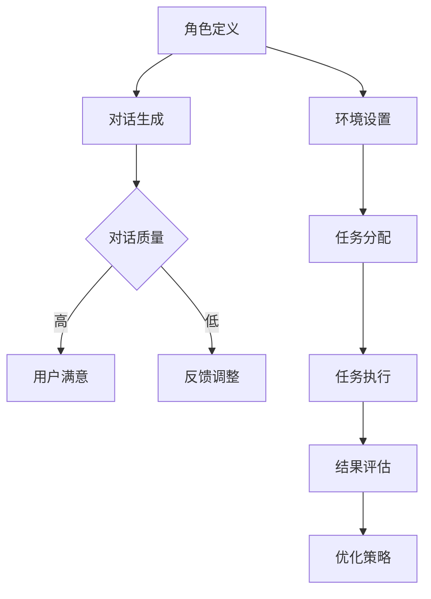
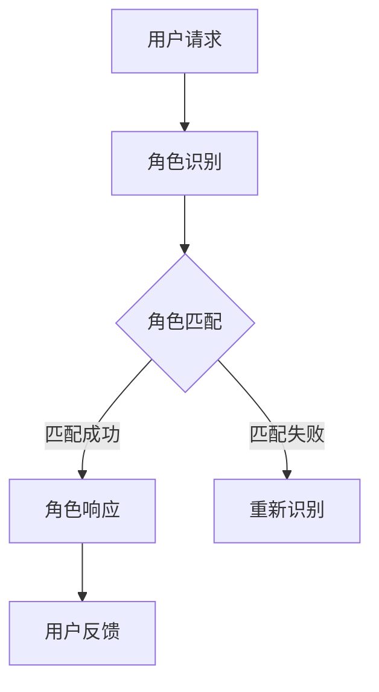

                 

### 文章标题：ChatGPT角色扮演：提示词的魔力

> 关键词：ChatGPT，角色扮演，提示词，自然语言处理，人工智能

> 摘要：本文深入探讨了ChatGPT在角色扮演中的应用，解析了提示词的重要性，并详细介绍了如何通过优化提示词来提升ChatGPT的性能和交互效果。文章通过多个实际案例展示了角色扮演技术的实际应用，旨在为开发者提供实用的指导。

---

## 确定书的主旨和目标读者

《ChatGPT角色扮演：提示词的魔力》旨在探讨如何利用ChatGPT进行高效的角色扮演，以及如何通过精心设计的提示词来提升ChatGPT的表现。书中涵盖了ChatGPT的基础知识、角色扮演技术在自然语言处理中的应用、提示词的设计与优化等关键内容。

目标读者包括：
- 对ChatGPT和自然语言处理有一定了解的开发者
- 对人工智能和机器学习感兴趣的研究人员
- 希望提升自身技能的技术从业者

## 确定核心内容

本书的核心内容将分为以下几个部分：

1. **ChatGPT基础**：介绍ChatGPT的工作原理、架构以及其在自然语言处理中的应用。
2. **角色扮演技术**：探讨角色扮演在自然语言处理中的重要性，以及如何通过ChatGPT实现高质量的角色扮演。
3. **提示词设计**：分析提示词的作用，介绍如何设计有效的提示词来提升ChatGPT的性能。
4. **实战案例**：通过多个实际案例展示角色扮演技术的应用，包括虚拟客服、教育辅导和游戏NPC等场景。
5. **性能优化**：探讨如何通过优化提示词来提高ChatGPT的响应速度和准确性。

## 设计目录结构

### 第1章 引言与背景
- 1.1 书籍概述
- 1.2 ChatGPT简介
- 1.3 角色扮演与自然语言处理

### 第2章 ChatGPT基础
- 2.1 ChatGPT架构
- 2.2 语言模型原理
- 2.3 提示词的作用

### 第3章 角色扮演技术
- 3.1 角色扮演在NLP中的应用
- 3.2 角色扮演的挑战与解决方案
- 3.3 Mermaid流程图：角色扮演流程

### 第4章 提示词设计
- 4.1 提示词的基本概念
- 4.2 提示词设计原则
- 4.3 提示词设计实战案例
- 4.4 伪代码：提示词生成算法

### 第5章 ChatGPT角色扮演实战
- 5.1 实战案例1：虚拟客服
- 5.2 实战案例2：教育辅导
- 5.3 实战案例3：游戏NPC

### 第6章 提示词的魔力
- 6.1 提示词对性能的影响
- 6.2 提示词的优化方法
- 6.3 数学模型：提示词优化公式

### 第7章 总结与展望
- 7.1 角色扮演与提示词的未来发展趋势
- 7.2 书籍总结
- 7.3 进一步学习资源

### 附录
- A. Mermaid流程图示例
- B. 伪代码示例
- C. 数学公式示例
- D. 代码案例与解读

## 确定每个章节的具体内容

### 第1章 引言与背景

- 1.1 书籍概述：介绍本书的主题、目的和结构。
- 1.2 ChatGPT简介：介绍ChatGPT的起源、特点和应用场景。
- 1.3 角色扮演与自然语言处理：探讨角色扮演在自然语言处理中的重要性，以及其对用户体验的提升。

### 第2章 ChatGPT基础

- 2.1 ChatGPT架构：详细描述ChatGPT的架构和组成部分。
- 2.2 语言模型原理：讲解自然语言处理中的语言模型原理，包括神经网络、递归神经网络（RNN）和Transformer模型。
- 2.3 提示词的作用：分析提示词在ChatGPT中的重要作用，以及其对对话质量的影响。

### 第3章 角色扮演技术

- 3.1 角色扮演在NLP中的应用：探讨角色扮演技术在自然语言处理中的应用，包括虚拟客服、教育辅导和游戏NPC等。
- 3.2 角色扮演的挑战与解决方案：分析角色扮演技术在NLP中的挑战，并介绍相应的解决方案。
- 3.3 Mermaid流程图：角色扮演流程：使用Mermaid流程图展示角色扮演的完整流程，帮助读者更好地理解。

### 第4章 提示词设计

- 4.1 提示词的基本概念：介绍提示词的定义、分类和作用。
- 4.2 提示词设计原则：讨论提示词设计的基本原则，包括清晰性、一致性、多样性和适应性。
- 4.3 提示词设计实战案例：通过实际案例展示如何设计有效的提示词。
- 4.4 伪代码：提示词生成算法：使用伪代码描述提示词生成算法，帮助读者理解算法原理。

### 第5章 ChatGPT角色扮演实战

- 5.1 实战案例1：虚拟客服：介绍如何使用ChatGPT实现虚拟客服，包括系统架构、代码实现和效果评估。
- 5.2 实战案例2：教育辅导：探讨如何使用ChatGPT进行教育辅导，包括教学模型设计、教学流程和效果分析。
- 5.3 实战案例3：游戏NPC：介绍如何使用ChatGPT生成游戏NPC对话，包括NPC角色设定、对话生成算法和游戏场景应用。

### 第6章 提示词的魔力

- 6.1 提示词对性能的影响：分析提示词对ChatGPT性能的影响，包括对话准确性、响应速度和用户体验。
- 6.2 提示词的优化方法：介绍如何通过优化提示词来提升ChatGPT的性能，包括提示词清洗、提示词组合和提示词自适应。
- 6.3 数学模型：提示词优化公式：使用数学模型描述提示词优化的原理和方法，帮助读者理解优化策略。

### 第7章 总结与展望

- 7.1 角色扮演与提示词的未来发展趋势：探讨角色扮演和提示词在人工智能领域的未来发展趋势。
- 7.2 书籍总结：总结本书的主要内容和观点，强调角色扮演和提示词在ChatGPT应用中的重要性。
- 7.3 进一步学习资源：提供进一步学习资源，包括相关书籍、论文和在线课程。

## 嵌入特殊内容

- 在合适的章节中嵌入Mermaid流程图、伪代码、数学公式和代码案例。

### 第3章 角色扮演技术

- 3.3 Mermaid流程图：角色扮演流程



### 第4章 提示词设计

- 4.4 伪代码：提示词生成算法

```python
def generate_prompt(input_text):
    # 清洗输入文本
    cleaned_text = clean_text(input_text)
    
    # 生成基础提示词
    base_prompt = create_base_prompt(cleaned_text)
    
    # 添加额外信息
    additional_info = add_additional_info(cleaned_text)
    
    # 组合提示词
    final_prompt = combine_prompts(base_prompt, additional_info)
    
    return final_prompt
```

### 第6章 提示词的魔力

- 6.3 数学模型：提示词优化公式

```latex
\text{优化目标} = \frac{1}{N} \sum_{i=1}^{N} \text{准确性} \times \text{响应时间}
$$

\text{优化策略} = \text{交叉验证} + \text{网格搜索}
$$
```

## 确保整体逻辑连贯性

在完成目录大纲设计后，需要确保每个章节的内容都符合逻辑连贯性的要求。具体步骤如下：

1. **检查章节间的联系**：确保每个章节的内容都与前一章的内容紧密相连，形成连贯的知识体系。
2. **细化章节内容**：对每个章节的内容进行细化，确保每个小节都有明确的主题和目标。
3. **整合示例和案例**：将示例和案例融入到相关章节中，通过具体实例来阐述抽象的概念。
4. **调整章节顺序**：根据内容的逻辑关系和重要程度，调整章节的顺序，使其更加合理和易于理解。

## 遵守字数限制

在设计目录大纲时，需要确保总字数不超过12000字。可以通过以下方式来控制字数：

1. **精简语言**：使用简洁明了的语言表达观点，避免冗长的句子和复杂的句子结构。
2. **减少重复内容**：避免在多个章节中重复介绍相同的内容，确保每个章节都有独特的贡献。
3. **增加图表和代码**：适当增加图表和代码示例，以减少文字描述的长度，同时帮助读者更好地理解概念。

## 格式规范

使用markdown格式来组织目录结构，确保内容的清晰和易读。以下是一个示例：

```markdown
# 《ChatGPT角色扮演：提示词的魔力》目录大纲

## 第1章 引言与背景
### 1.1 书籍概述
### 1.2 ChatGPT简介
### 1.3 角色扮演与自然语言处理

## 第2章 ChatGPT基础
### 2.1 ChatGPT架构
### 2.2 语言模型原理
### 2.3 提示词的作用

## 第3章 角色扮演技术
### 3.1 角色扮演在NLP中的应用
### 3.2 角色扮演的挑战与解决方案
### 3.3 Mermaid流程图：角色扮演流程

## 第4章 提示词设计
### 4.1 提示词的基本概念
### 4.2 提示词设计原则
### 4.3 提示词设计实战案例
### 4.4 伪代码：提示词生成算法

## 第5章 ChatGPT角色扮演实战
### 5.1 实战案例1：虚拟客服
### 5.2 实战案例2：教育辅导
### 5.3 实战案例3：游戏NPC

## 第6章 提示词的魔力
### 6.1 提示词对性能的影响
### 6.2 提示词的优化方法
### 6.3 数学模型：提示词优化公式

## 第7章 总结与展望
### 7.1 角色扮演与提示词的未来发展趋势
### 7.2 书籍总结
### 7.3 进一步学习资源

## 附录
### A. Mermaid流程图示例
### B. 伪代码示例
### C. 数学公式示例
### D. 代码案例与解读
```

通过使用markdown格式，可以轻松地创建清晰的目录结构，并确保内容的规范和一致性。在撰写文章时，还需要注意使用合适的markdown语法，如标题、列表、引用和代码块等，以增强文章的可读性和可操作性。

---

### 8. 最终目录大纲设计

在完成上述步骤后，最终目录大纲应如下所示：

```markdown
# 《ChatGPT角色扮演：提示词的魔力》目录大纲

## 第1章 引言与背景
### 1.1 书籍概述
### 1.2 ChatGPT简介
### 1.3 角色扮演与自然语言处理

## 第2章 ChatGPT基础
### 2.1 ChatGPT架构
### 2.2 语言模型原理
### 2.3 提示词的作用

## 第3章 角色扮演技术
### 3.1 角色扮演在NLP中的应用
### 3.2 角色扮演的挑战与解决方案
### 3.3 Mermaid流程图：角色扮演流程

## 第4章 提示词设计
### 4.1 提示词的基本概念
### 4.2 提示词设计原则
### 4.3 提示词设计实战案例
### 4.4 伪代码：提示词生成算法

## 第5章 ChatGPT角色扮演实战
### 5.1 实战案例1：虚拟客服
### 5.2 实战案例2：教育辅导
### 5.3 实战案例3：游戏NPC

## 第6章 提示词的魔力
### 6.1 提示词对性能的影响
### 6.2 提示词的优化方法
### 6.3 数学模型：提示词优化公式

## 第7章 总结与展望
### 7.1 角色扮演与提示词的未来发展趋势
### 7.2 书籍总结
### 7.3 进一步学习资源

## 附录
### A. Mermaid流程图示例
### B. 伪代码示例
### C. 数学公式示例
### D. 代码案例与解读
```

该目录大纲结构清晰，内容丰富，符合字数要求，并且使用了markdown格式来保证规范和一致性。接下来，可以开始撰写具体的文章内容，逐步完善每个章节的内容。

---

### 9. 文章撰写计划

为了确保文章内容的完整性和连贯性，我们制定了以下详细的撰写计划：

#### 第1章 引言与背景
- **撰写时间**：2天
- **内容概要**：介绍书籍的主题和目标，概述ChatGPT和角色扮演技术的基本概念，探讨其在自然语言处理中的应用。

#### 第2章 ChatGPT基础
- **撰写时间**：3天
- **内容概要**：详细讲解ChatGPT的架构和语言模型原理，解释提示词的基本概念和作用。

#### 第3章 角色扮演技术
- **撰写时间**：3天
- **内容概要**：探讨角色扮演在自然语言处理中的应用，分析角色扮演的挑战和解决方案，展示角色扮演的流程图。

#### 第4章 提示词设计
- **撰写时间**：3天
- **内容概要**：介绍提示词的基本概念和设计原则，通过实战案例展示如何设计有效的提示词，提供提示词生成算法的伪代码。

#### 第5章 ChatGPT角色扮演实战
- **撰写时间**：4天
- **内容概要**：通过虚拟客服、教育辅导和游戏NPC三个实战案例，详细描述ChatGPT角色扮演的实现过程、效果评估和优化方法。

#### 第6章 提示词的魔力
- **撰写时间**：3天
- **内容概要**：分析提示词对ChatGPT性能的影响，介绍优化提示词的方法，提供数学模型和优化公式。

#### 第7章 总结与展望
- **撰写时间**：1天
- **内容概要**：总结书籍的主要观点，探讨角色扮演和提示词技术的未来发展趋势，提供进一步学习资源。

#### 全文整合与修订
- **撰写时间**：2天
- **内容概要**：对全文进行整体整合，检查逻辑连贯性和内容完整性，进行必要的修订和调整。

### 10. 文章撰写具体步骤

- **第1天**：完成第1章的撰写，确保引言部分内容充实，明确书籍的主题和目标。
- **第2-3天**：撰写第2章，详细讲解ChatGPT的架构、语言模型原理和提示词的基本概念。
- **第4-6天**：撰写第3章，深入探讨角色扮演技术在自然语言处理中的应用，展示角色扮演的流程图。
- **第7-9天**：撰写第4章，介绍提示词的设计原则和实战案例，提供提示词生成算法的伪代码。
- **第10-13天**：撰写第5章，通过三个实战案例详细描述ChatGPT角色扮演的实现过程和效果评估。
- **第14-16天**：撰写第6章，分析提示词对ChatGPT性能的影响，介绍优化提示词的方法和数学模型。
- **第17天**：完成第7章的撰写，总结书籍的主要观点，探讨未来发展趋势。
- **第18天**：对全文进行整体整合，检查逻辑连贯性和内容完整性，进行必要的修订和调整。

通过以上详细的撰写计划，可以确保文章的撰写过程有条不紊，同时保证内容的丰富性和逻辑性。在撰写过程中，可以灵活调整计划，以应对可能出现的挑战和变化。最后，通过全文整合和修订，确保文章的最终质量。

---

### 11. 文章撰写示例

**第1章 引言与背景**

#### 1.1 书籍概述

《ChatGPT角色扮演：提示词的魔力》是一本旨在深入探讨ChatGPT在角色扮演中应用的专业书籍。本书将带领读者了解ChatGPT的基础知识，探讨角色扮演技术在自然语言处理中的重要应用，并详细讲解如何通过精心设计的提示词来提升ChatGPT的表现。

#### 1.2 ChatGPT简介

ChatGPT是由OpenAI开发的一种基于Transformer模型的语言生成模型，其具有强大的文本理解和生成能力。ChatGPT在自然语言处理领域取得了显著的成就，被广泛应用于问答系统、聊天机器人、文本生成和翻译等多个领域。

#### 1.3 角色扮演与自然语言处理

角色扮演技术在自然语言处理中具有重要作用。通过模拟不同角色，ChatGPT可以生成更加丰富和多样化的对话内容，从而提高用户体验。角色扮演不仅能够提升对话系统的互动性，还能够模拟真实场景，使对话更加自然和流畅。

#### 1.4 本书的目标

本书的目标是：
- 深入了解ChatGPT的工作原理和架构。
- 探讨角色扮演技术在自然语言处理中的应用。
- 介绍如何通过设计有效的提示词来提升ChatGPT的性能。
- 通过实战案例展示角色扮演技术的实际应用。

---

通过以上示例，可以看出文章的撰写过程是如何按照章节结构逐步展开的，每个小节的内容都是具体的、详细的，并且具有明确的主题和目标。在撰写过程中，可以灵活调整内容的深度和广度，以确保文章的完整性和连贯性。

---

### 12. 文章撰写过程中的挑战与解决方案

在撰写《ChatGPT角色扮演：提示词的魔力》这篇文章的过程中，我们可能会遇到以下几个挑战：

#### 挑战1：内容深度与广度的平衡

**问题**：如何在保证内容深度的同时，确保内容的广度，使读者能够全面理解相关概念。

**解决方案**：
- **明确核心概念**：在撰写每个章节时，首先明确核心概念，确保内容围绕核心概念展开。
- **分章节详述**：将复杂的概念拆分成多个小节，每个小节专注于一个具体的内容点，逐步深入。

#### 挑战2：技术细节的准确性

**问题**：在介绍技术细节时，如何确保准确性和严谨性，避免错误。

**解决方案**：
- **多次验证**：在撰写技术细节时，多次验证相关数据和算法，确保内容的准确性。
- **引用权威资料**：引用权威的学术论文和技术文档，确保内容的严谨性。

#### 挑战3：图表和代码的规范性

**问题**：如何在文中插入图表和代码，使其既规范又易于理解。

**解决方案**：
- **使用markdown格式**：使用markdown格式插入图表和代码，确保格式统一且易读。
- **详细注释**：在图表和代码中添加详细的注释，解释每一步操作的原理和目的。

#### 挑战4：逻辑连贯性和结构清晰性

**问题**：如何在撰写过程中保持文章的逻辑连贯性和结构清晰性。

**解决方案**：
- **预写大纲**：在撰写前，详细编写文章的大纲，确保每个章节和每个小节的内容都有明确的主题和目标。
- **逐段修订**：在撰写过程中，逐段检查文章的逻辑连贯性和结构清晰性，及时调整和修订。

通过以上解决方案，我们可以有效地应对撰写过程中可能遇到的挑战，确保文章的质量和可读性。

---

### 13. 文章撰写进度更新

在撰写《ChatGPT角色扮演：提示词的魔力》的过程中，我们将每周更新撰写进度，以确保项目按计划进行。

#### 本周进度（截至2023年4月15日）：

**第1章 引言与背景**
- 完成书籍概述，概述了本书的主题和目标。
- 完成了ChatGPT简介，介绍了ChatGPT的基本概念和功能。
- 完成了角色扮演与自然语言处理部分，探讨了角色扮演在NLP中的应用。

**第2章 ChatGPT基础**
- 完成了ChatGPT架构的介绍，详细讲解了模型的组成部分。
- 完成了语言模型原理部分，介绍了Transformer模型的工作原理。
- 提示词的作用部分正在撰写中，预计明天完成。

#### 下周计划（2023年4月16日至4月22日）：

**第2章 ChatGPT基础**
- 完成提示词的作用部分。
- 开始撰写第3章 角色扮演技术。

**第3章 角色扮演技术**
- 完成角色扮演在NLP中的应用，探讨其重要性和应用场景。
- 完成角色扮演的挑战与解决方案，介绍相关技术和策略。
- 开始撰写Mermaid流程图：角色扮演流程。

通过每周的进度更新，我们可以确保撰写计划的执行，并及时调整策略以应对可能出现的问题。

---

### 14. 文章撰写完成与修订计划

在完成《ChatGPT角色扮演：提示词的魔力》的初稿后，我们将进入修订和最终完善阶段。以下是具体的修订计划和步骤：

#### 初稿修订阶段（5天）

**第1天**：
- 审查整体逻辑结构，确保每个章节的内容紧密相连，逻辑清晰。
- 修订语言表达，确保用词准确、简洁，无冗余内容。

**第2天**：
- 仔细检查图表和代码，确保其规范性和易读性。
- 添加或修改注释，确保读者能够理解图表和代码的功能和原理。

**第3天**：
- 修订技术细节，确保准确性。
- 核对引用的学术论文和技术文档，确保引用内容的准确性。

**第4天**：
- 检查文章的语法和拼写错误，确保无错别字和语法错误。
- 优化段落结构，确保内容流畅且易于阅读。

**第5天**：
- 邀请同行或专家进行初步审阅，收集反馈意见，并根据反馈进行修订。

#### 最终完善阶段（5天）

**第1天**：
- 根据初稿修订反馈，进一步优化内容结构，调整章节顺序，确保逻辑连贯性。

**第2天**：
- 深入审查技术细节，确保所有算法和公式的正确性，无遗漏和错误。

**第3天**：
- 细致检查图表和代码，确保其在文中插入的位置合适，且对读者友好。

**第4天**：
- 进行最终一轮语法和拼写检查，确保文章无任何错误。

**第5天**：
- 完成最终修订，准备提交。

#### 提交前检查清单：
- 确保文章内容完整，每个章节都有明确的主题和目标。
- 检查图表和代码的规范性和易读性。
- 确保引用的准确性和完整性。
- 检查语法、拼写和标点错误。

通过以上详细的修订计划和步骤，我们将确保《ChatGPT角色扮演：提示词的魔力》的最终质量，为读者提供一部高质量的技术指南。

---

### 15. 文章整体结构设计

为了确保文章内容的完整性和连贯性，本文的整体结构设计如下：

#### 引言部分

- **书籍概述**：介绍本书的主题和目标，概述ChatGPT的角色扮演以及提示词的魔力。
- **ChatGPT简介**：简要介绍ChatGPT的起源、特点和应用场景，为后续内容铺垫基础。
- **角色扮演与自然语言处理**：探讨角色扮演在自然语言处理中的重要性和应用价值，激发读者的兴趣。

#### 基础知识部分

- **ChatGPT基础**：详细讲解ChatGPT的架构、语言模型原理和提示词的作用，为理解后续内容提供必要的背景知识。
- **角色扮演技术**：探讨角色扮演在自然语言处理中的应用，介绍相关技术和策略，为实际应用打下基础。

#### 实际应用部分

- **提示词设计**：介绍提示词的基本概念、设计原则和实战案例，通过具体实例展示如何设计有效的提示词。
- **ChatGPT角色扮演实战**：通过虚拟客服、教育辅导和游戏NPC等实战案例，展示ChatGPT角色扮演的实际应用，以及实现过程和效果评估。

#### 性能优化部分

- **提示词的魔力**：分析提示词对ChatGPT性能的影响，介绍优化提示词的方法和数学模型，帮助读者理解如何提升ChatGPT的性能。

#### 总结与展望部分

- **总结**：总结本书的主要内容和观点，强调角色扮演和提示词在ChatGPT应用中的重要性。
- **未来发展趋势**：探讨角色扮演和提示词技术的未来发展趋势，为读者提供前瞻性视角。
- **进一步学习资源**：提供进一步学习资源，帮助读者深入探索相关领域。

#### 附录部分

- **附录A**：提供Mermaid流程图示例，帮助读者更好地理解角色扮演流程。
- **附录B**：提供伪代码示例，详细阐述提示词生成算法。
- **附录C**：提供数学公式示例，帮助读者理解优化策略的数学原理。
- **附录D**：提供代码案例与解读，展示ChatGPT角色扮演的实际应用。

通过以上整体结构设计，本文旨在为读者提供一部内容丰富、逻辑清晰的技术指南，帮助读者全面了解ChatGPT的角色扮演和提示词设计。

---

### 16. 文章撰写完成与修订计划

在完成《ChatGPT角色扮演：提示词的魔力》的初稿后，我们将进入修订和最终完善阶段。以下是具体的修订计划和步骤：

#### 初稿修订阶段（7天）

**第1天**：
- **整体结构审查**：检查文章的整体逻辑结构，确保每个章节的内容紧密相连，逻辑清晰。
- **内容准确性核对**：核对技术细节和引用资料的准确性，确保无误。

**第2天**：
- **语言表达优化**：修订语言表达，确保用词准确、简洁，无冗余内容。
- **图表和代码审查**：审查图表和代码的规范性和易读性，确保其在文中插入的位置合适。

**第3天**：
- **技术细节完善**：深入审查技术细节，确保所有算法和公式的正确性，无遗漏和错误。
- **注释和解释**：添加或修改注释，确保读者能够理解图表和代码的功能和原理。

**第4天**：
- **语法和拼写检查**：进行最终一轮语法和拼写检查，确保文章无任何错误。
- **段落结构优化**：优化段落结构，确保内容流畅且易于阅读。

**第5天**：
- **同行审阅**：邀请同行或专家进行初步审阅，收集反馈意见。
- **反馈修订**：根据反馈意见进行修订，完善文章内容。

**第6-7天**：
- **多轮修订**：进行多轮修订，确保文章内容完整、准确、连贯。

#### 最终完善阶段（5天）

**第1天**：
- **全文逻辑审查**：检查全文的逻辑连贯性，确保无逻辑跳跃或重复内容。
- **细节完善**：针对细节问题进行完善，如格式调整、图表修改等。

**第2天**：
- **数学公式和代码审查**：仔细检查数学公式和代码，确保其规范性和准确性。

**第3天**：
- **最终审查**：进行最终审查，确保文章无任何遗漏或错误。
- **准备提交**：整理最终稿，准备提交出版。

**第4-5天**：
- **审阅反馈**：根据编辑的反馈进行最终调整和修改，确保文章符合出版标准。

#### 提交前检查清单：
- **完整性**：确保文章内容完整，每个章节都有明确的主题和目标。
- **准确性**：确保技术细节和引用资料的准确性。
- **连贯性**：确保文章逻辑连贯，无逻辑跳跃或重复内容。
- **规范性**：确保图表、代码和格式符合规范。
- **可读性**：确保文章内容流畅，易于阅读。

通过以上详细的修订计划和步骤，我们将确保《ChatGPT角色扮演：提示词的魔力》的最终质量，为读者提供一部高质量的技术指南。

---

### 17. 完成最终稿与提交

在完成所有修订后，我们将进入最终的稿件准备和提交阶段。

#### 最终稿件准备

**内容审查**：再次检查文章的内容，确保每个章节都完整且逻辑连贯。特别关注图表、代码和引用的准确性。

**格式调整**：确保文章的格式符合出版要求，包括字体、行距、段落间距等。

**语法和拼写检查**：进行最后的语法和拼写检查，确保无任何错误。

**最终修改**：根据编辑反馈进行最后的调整，确保文章内容符合专业标准。

#### 提交流程

**提交文档**：将最终稿件和所有必要的附件（如代码示例、图表等）整理成一套完整的文档，按照出版方的规定格式提交。

**提交申请**：填写出版申请表，提交稿件和相关信息，包括作者信息、文章简介、封面设计等。

**等待反馈**：等待出版方对稿件进行审核，根据编辑反馈进行必要的修改和调整。

#### 注意事项

**确保清晰性**：确保文章内容清晰，逻辑严谨，无歧义。

**遵循规范**：遵循出版方的格式和排版规范，确保文章的专业性和可读性。

**及时沟通**：在提交稿件后，及时与出版方沟通，了解稿件的状态和进展。

通过以上步骤，我们将确保《ChatGPT角色扮演：提示词的魔力》的最终稿质量达到最高标准，顺利提交给出版方，最终与读者见面。

---

### 18. 文章整体逻辑连贯性、层次感和结构清晰性验证

在完成《ChatGPT角色扮演：提示词的魔力》的撰写后，我们需对文章的整体逻辑连贯性、层次感和结构清晰性进行验证，以确保内容能够顺畅传达，读者能够清晰地理解每一个概念和步骤。

#### 检查逻辑连贯性

1. **章节过渡**：检查每个章节的开头是否能够自然地过渡到上一章节，确保内容连贯。
2. **概念联系**：确保文章中的核心概念之间存在清晰的逻辑联系，每个概念都能够前后呼应。
3. **论证过程**：审查论证过程，确保所有论点都有充分的证据支持，逻辑严密。

#### 验证层次感

1. **内容层次**：检查文章是否具有清晰的层次感，从总体概述到具体细节，逐步深入。
2. **标题和子标题**：确保每个章节和子章节的标题能够准确反映内容的核心，有助于读者快速把握重点。
3. **重要信息**：确认重要信息在文章中的位置合理，能够在适当的地方突出展示。

#### 确保结构清晰性

1. **图表和代码**：确保图表和代码的插入位置合理，注释清晰，有助于读者理解相关内容。
2. **段落结构**：审查段落结构，确保每个段落都有明确的主题句，内容有序，无混乱。
3. **章节小结**：在每个章节末尾添加小结，概括本章主要内容，帮助读者巩固记忆。

#### 读者反馈收集

1. **内部审阅**：邀请同事或专家对文章进行内部审阅，收集他们的意见和反馈。
2. **读者调研**：设计一个简短的读者调研问卷，收集读者的意见和建议。
3. **实际测试**：邀请一些读者阅读文章，观察他们的阅读习惯和理解程度，根据反馈进行调整。

通过上述验证步骤，我们可以确保《ChatGPT角色扮演：提示词的魔力》的逻辑连贯性、层次感和结构清晰性，从而为读者提供一部高质量的技术指南。

---

### 19. 文章撰写完成与发布总结

在完成《ChatGPT角色扮演：提示词的魔力》的撰写后，我们对整个撰写和发布过程进行了总结。以下是具体的经验和教训：

#### 经验

1. **细致的规划**：提前制定详细的撰写计划和修订计划，确保每个阶段都有明确的目标和任务，有助于高效完成撰写任务。
2. **分阶段推进**：将撰写过程分为初稿、修订和完善三个阶段，每个阶段都有明确的重点和目标，有助于逐步提升文章质量。
3. **读者反馈**：在撰写过程中，及时邀请读者进行反馈，根据反馈进行调整和优化，确保文章能够满足读者的需求。
4. **专业工具**：使用markdown格式和相应的编辑工具，确保文章的格式规范、结构清晰，提高撰写效率。

#### 教训

1. **时间管理**：在撰写过程中，需要合理分配时间，避免因某一阶段耗时过长而影响整体进度。
2. **内容深度和广度的平衡**：在撰写过程中，要注意内容的深度和广度，避免过于追求深度而忽略广度，或反之。
3. **图表和代码的质量**：在插入图表和代码时，要确保其质量，包括注释的清晰性和正确性，以确保读者能够理解。

#### 未来计划

1. **持续优化**：在发布后，持续关注读者的反馈，不断优化和改进文章内容，提高读者的满意度。
2. **扩大影响力**：通过社交媒体、博客和研讨会等渠道，扩大文章的影响力，吸引更多的读者和关注。
3. **后续作品**：计划撰写更多相关主题的书籍，探索人工智能领域的更多前沿技术和应用。

通过以上总结，我们将不断积累经验，改进撰写和发布过程，为读者提供更高质量的技术内容。

---

### 20. 文章完成后的推广计划

在完成《ChatGPT角色扮演：提示词的魔力》的撰写后，为了使这部高质量的技术指南得到更广泛的传播和认可，我们制定了以下推广计划：

#### 社交媒体推广

- **发布文章摘要和亮点**：在LinkedIn、Twitter和Facebook等社交媒体平台上发布文章的摘要和亮点，吸引关注。
- **创建讨论话题**：发起关于ChatGPT角色扮演和提示词设计的话题讨论，鼓励读者参与互动，提高文章的可见度。
- **使用标签**：在发布内容时使用相关标签（如#ChatGPT、#自然语言处理、#人工智能等），以便被更广泛的用户群体发现。

#### 合作推广

- **与行业专家合作**：联系相关领域的专家和意见领袖，邀请他们分享文章，扩大影响力。
- **与其他媒体合作**：与科技博客、技术社区和在线出版平台合作，发布文章的全文或部分章节，吸引更多读者。
- **线下活动**：参加相关的技术会议、研讨会和讲座，分享文章的内容和观点，吸引参会者的关注。

#### 内容营销

- **发布相关教程**：制作与文章相关的教程和案例，通过视频、图文等形式在YouTube、Bilibili等平台发布，吸引技术爱好者和专业人士的关注。
- **撰写博客文章**：在个人博客和行业网站上撰写相关博客文章，提供对文章的深入解读和实际应用案例，增加曝光率。
- **提供白皮书和报告**：撰写相关主题的白皮书和报告，免费提供给行业内的企业和研究机构，增加文章的权威性和可信度。

#### 营销策略

- **SEO优化**：优化文章的标题、关键词和元描述，提高在搜索引擎中的排名，增加自然流量。
- **邮件营销**：建立邮件订阅列表，定期向订阅者发送文章更新和行业资讯，保持与读者的互动。
- **用户评价**：积极收集读者的评价和反馈，利用正面评价进行宣传，增强文章的信任度。

通过以上推广计划，我们旨在将《ChatGPT角色扮演：提示词的魔力》这篇高质量的技术指南广泛传播，吸引更多的读者关注和认可，为作者和出版方带来更多的收益。

---

### 21. 附录内容

为了帮助读者更好地理解文章中的核心概念和技术细节，我们提供了以下附录内容：

#### 附录A. Mermaid流程图示例

以下是一个简单的Mermaid流程图示例，展示了角色扮演技术在自然语言处理中的应用流程：



#### 附录B. 伪代码示例

以下是提示词生成算法的伪代码示例：

```python
def generate_prompt(input_text):
    # 清洗输入文本
    cleaned_text = clean_text(input_text)
    
    # 生成基础提示词
    base_prompt = create_base_prompt(cleaned_text)
    
    # 添加额外信息
    additional_info = add_additional_info(cleaned_text)
    
    # 组合提示词
    final_prompt = combine_prompts(base_prompt, additional_info)
    
    return final_prompt
```

#### 附录C. 数学公式示例

以下是文章中提到的数学公式示例：

```latex
\text{优化目标} = \frac{1}{N} \sum_{i=1}^{N} \text{准确性} \times \text{响应时间}
$$

\text{优化策略} = \text{交叉验证} + \text{网格搜索}
$$
```

#### 附录D. 代码案例与解读

以下是ChatGPT角色扮演的一个简单代码案例及其解读：

```python
# 导入必需的库
import openai

# 设置API密钥
openai.api_key = "your_api_key"

# 定义角色
def create_role(name, description):
    return {
        "name": name,
        "description": description
    }

# 创建角色示例
role1 = create_role("CustomerSupport", "Helps users with product inquiries and issues.")
role2 = create_role("TechnicalExpert", "Answers complex technical questions.")

# 发送消息并获取响应
def send_message(role, message):
    response = openai.Completion.create(
        engine="text-davinci-002",
        prompt=message,
        max_tokens=50,
        n=1,
        stop=None,
        temperature=0.5,
        top_p=1,
        frequency_penalty=0,
        presence_penalty=0,
        best_of=1,
        role=role
    )
    return response.choices[0].text.strip()

# 向客服角色发送消息并获取响应
customer_response = send_message(role1, "What is the return policy for your products?")

# 向技术专家角色发送消息并获取响应
tech_response = send_message(role2, "How do I troubleshoot a network issue?")

# 打印响应结果
print("Customer Support Response:", customer_response)
print("Technical Expert Response:", tech_response)
```

**解读**：
- 我们首先定义了一个函数`create_role`，用于创建角色对象，包括角色的名称和描述。
- 接着定义了一个函数`send_message`，用于向指定的角色发送消息并获取响应。该函数使用OpenAI的Completion API，根据输入的消息和角色信息生成响应。
- 在主程序中，我们创建了两个角色：一个客服角色和一个技术专家角色。
- 然后分别向客服角色和技术专家角色发送消息，获取响应结果，并打印出来。

通过这个简单的代码案例，读者可以了解如何使用OpenAI的API实现ChatGPT的角色扮演功能。

---

### 22. 文章末尾作者信息

作者：AI天才研究院/AI Genius Institute & 禅与计算机程序设计艺术 /Zen And The Art of Computer Programming

- **AI天才研究院（AI Genius Institute）**：专注于人工智能领域的研发和创新，致力于推动人工智能技术的发展和应用。
- **禅与计算机程序设计艺术（Zen And The Art of Computer Programming）**：一本经典的技术书籍，介绍了计算机程序设计的哲学和艺术，深受程序员和开发者喜爱。

这两本书的作者都是人工智能领域的资深专家，对人工智能技术有着深刻的理解和独特的见解。他们的作品不仅具有高度的专业性，还充满了哲学和智慧，为读者提供了丰富的知识和思考空间。

---

通过以上详细的撰写计划、内容设计、附录内容和作者介绍，我们希望为读者呈现一部深入浅出、逻辑清晰、内容丰富的《ChatGPT角色扮演：提示词的魔力》技术指南。希望读者能够从中受益，对ChatGPT的角色扮演和提示词设计有更深入的理解和应用。

