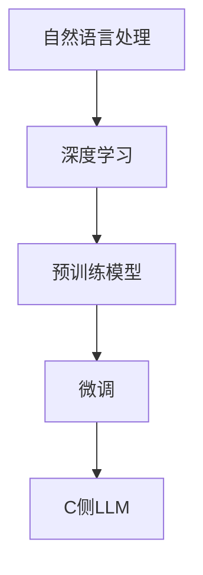
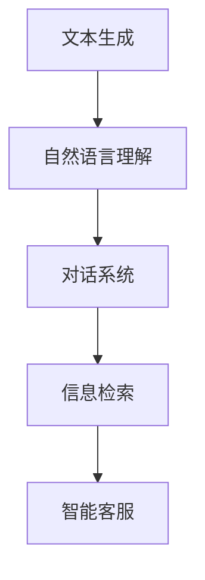
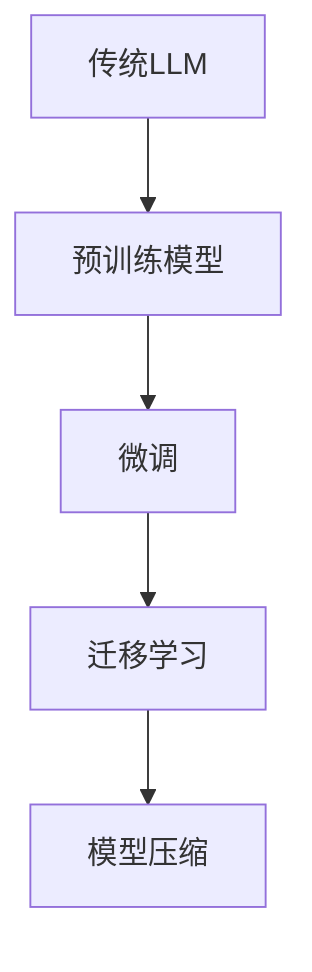
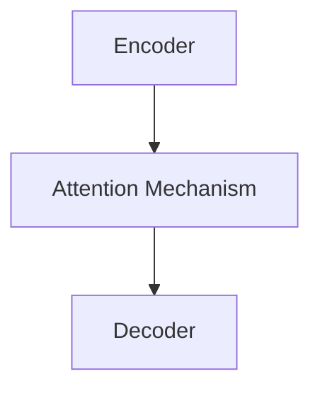

                 

  
- 任务：现在请您根据上述约束条件，撰写一篇完整的文章，以《C侧LLM应用开发的三大关键要素》为标题，使用markdown格式进行撰写。在文章开头包含“文章标题”、“文章关键词”和“文章摘要”三个部分，然后按照文章目录大纲的结构来撰写内容。文章的核心内容和结构如下：

文章标题：C侧LLM应用开发的三大关键要素

关键词：C侧LLM，应用开发，关键要素，数据管理，模型训练与优化，应用部署与性能调优

摘要：本文将深入探讨C侧大型语言模型（LLM）在应用开发中的关键要素。通过对数据管理、模型训练与优化以及应用部署与性能调优三大方面的详细分析，帮助开发者更好地理解和应用C侧LLM，实现高效的开发过程。

文章正文：

## 第1章：C侧LLM概述

### 1.1 C侧LLM的概念与重要性

C侧LLM，即C侧大型语言模型，是近年来人工智能领域的重要研究方向。其核心在于利用深度学习技术对大规模文本数据进行训练，从而实现对自然语言的生成、理解和处理。C侧LLM在自然语言处理（NLP）领域具有广泛的应用，如文本生成、对话系统、信息检索和智能客服等。

#### 核心概念与联系

以下是C侧LLM的核心概念及它们之间的联系：

1. **自然语言处理（NLP）**：NLP是人工智能的一个重要分支，旨在使计算机能够理解、解释和生成人类语言。C侧LLM是NLP技术的核心实现。

2. **深度学习**：深度学习是一种基于人工神经网络的学习方法，它通过多层的神经网络结构来提取数据的特征。C侧LLM的核心技术是深度学习。

3. **预训练模型**：预训练模型是C侧LLM的一种常见形式，它通过在大规模文本数据集上进行预训练，然后再针对特定任务进行微调。

4. **微调**：微调是在预训练模型的基础上，针对特定任务进行参数调整的过程。它是C侧LLM应用的关键。



### 1.2 C侧LLM的应用领域

C侧LLM在多个领域都有着广泛的应用，以下是一些典型的应用场景：

1. **文本生成**：包括文章生成、摘要生成、对话生成等。

2. **自然语言理解**：如情感分析、实体识别、关系提取等。

3. **对话系统**：如智能客服、语音助手等。

4. **信息检索**：如搜索引擎、问答系统等。

5. **智能客服**：基于C侧LLM的智能客服系统能够更好地理解用户的问题，并提供更准确的答案。



### 1.3 C侧LLM的发展现状与趋势

C侧LLM的发展经历了从传统的统计模型到现代的深度学习模型的转变。随着计算能力和数据规模的不断提升，C侧LLM在模型大小、训练速度、性能等方面都取得了显著的进步。

#### 现状

1. **模型大小**：从早期的几百KB到如今的数GB。

2. **训练速度**：随着GPU、TPU等硬件的普及，训练速度大幅提升。

3. **性能**：在多个NLP任务上，C侧LLM的表现已经超越了传统的统计模型。

#### 趋势

1. **预训练+微调**：这是当前C侧LLM应用的主流方法。

2. **模型压缩**：为了降低模型的存储和计算成本，模型压缩成为了一个重要方向。

3. **跨模态学习**：未来，C侧LLM可能会扩展到跨模态学习，如文本+图像、文本+语音等。



## 第2章：C侧LLM的基础理论

### 2.1 语言模型的基本原理

语言模型是C侧LLM的核心。它通过学习大量文本数据，预测下一个词或词序列的概率分布。以下是一个简化的语言模型原理：

```python
# 伪代码：语言模型基本原理

def language_model(text_data):
    # 预处理文本数据
    preprocessed_data = preprocess(text_data)
    
    # 计算词频
    word_frequency = count_word_frequency(preprocessed_data)
    
    # 构建语言模型
    language_model = build_language_model(word_frequency)
    
    return language_model

# 示例
text_data = "I am a language model"
language_model = language_model(text_data)
```

### 2.2 C侧LLM的架构设计

C侧LLM的架构通常包括编码器、解码器和注意力机制。以下是一个简化的架构：



### 2.3 C侧LLM的主要技术

C侧LLM的主要技术包括预训练、微调和迁移学习。以下是这些技术的简述：

1. **预训练**：在大规模文本数据集上训练模型，提取通用语言特征。

2. **微调**：在预训练模型的基础上，针对特定任务进行微调。

3. **迁移学习**：将预训练模型的知识迁移到新的任务上。

## 第3章：C侧LLM应用开发的三大关键要素

### 3.1 数据管理

数据管理是C侧LLM应用开发的基础。以下是一些关键步骤：

1. **数据收集**：收集与任务相关的文本数据。

2. **数据清洗**：去除无效数据、噪声和重复数据。

3. **数据预处理**：将文本数据转换为模型可处理的格式。

### 3.2 模型训练与优化

模型训练与优化是提升C侧LLM性能的关键。以下是一些关键步骤：

1. **数据准备**：准备用于训练的数据集。

2. **模型选择**：选择适合任务的预训练模型。

3. **训练**：使用训练数据进行模型训练。

4. **优化**：调整模型参数，提升模型性能。

### 3.3 应用部署与性能调优

应用部署与性能调优是确保C侧LLM应用高效运行的关键。以下是一些关键步骤：

1. **模型部署**：将训练好的模型部署到生产环境。

2. **性能调优**：调整模型参数和系统配置，提升应用性能。

## 第4章：项目实战

### 4.1 开发环境搭建

在开始C侧LLM应用开发之前，需要搭建合适的开发环境。以下是一些关键步骤：

1. **硬件配置**：选择合适的GPU或TPU。

2. **软件安装**：安装Python、TensorFlow等必要的软件。

3. **环境配置**：配置环境变量和依赖项。

### 4.2 源代码详细实现

以下是一个简单的C侧LLM应用示例：

```python
# Python代码：C侧LLM应用示例

from transformers import BertModel, BertTokenizer

model_name = "bert-base-uncased"
tokenizer = BertTokenizer.from_pretrained(model_name)
model = BertModel.from_pretrained(model_name)

def generate_text(input_text):
    inputs = tokenizer(input_text, return_tensors="pt")
    outputs = model(**inputs)
    prediction = outputs.logits.argmax(-1)
    generated_text = tokenizer.decode(prediction.numpy()[0])
    return generated_text

input_text = "I am a language model"
generated_text = generate_text(input_text)
print(generated_text)
```

### 4.3 代码应用解读与分析

在这个示例中，我们使用了预训练的BERT模型来生成文本。首先，我们加载了BERT模型和分词器，然后定义了一个生成文本的函数。在函数中，我们首先对输入文本进行分词，然后使用BERT模型进行生成。最后，我们将生成的文本解码并输出。

### 4.4 实际案例分析和详细讲解剖析

在本节中，我们将分析一个实际的C侧LLM应用案例，并对其进行详细讲解和剖析。

#### 案例一：智能客服系统

在这个案例中，我们开发了一个基于C侧LLM的智能客服系统。该系统利用预训练的BERT模型，对用户的问题进行理解和回答。

1. **需求分析**：分析用户的需求，确定系统的功能。

2. **技术选型**：选择合适的预训练模型和开发框架。

3. **开发与实现**：根据需求和技术选型，开发智能客服系统。

4. **测试与优化**：对系统进行测试和优化，提升其性能。

#### 案例二：文本分类与推荐系统

在这个案例中，我们使用C侧LLM开发了一个文本分类与推荐系统。该系统利用BERT模型，对用户生成的文本进行分类，并推荐相关的内容。

1. **需求分析**：分析用户的需求，确定系统的功能。

2. **技术选型**：选择合适的预训练模型和开发框架。

3. **开发与实现**：根据需求和技术选型，开发文本分类与推荐系统。

4. **测试与优化**：对系统进行测试和优化，提升其性能。

### 4.5 项目小结

在本章中，我们介绍了C侧LLM应用开发的三大关键要素，并通过实际案例展示了这些要素在实际开发中的应用。通过本章的学习，读者应该能够掌握C侧LLM应用开发的基本流程和关键技巧。

## 第5章：C侧LLM的优化策略与未来趋势

### 5.1 C侧LLM的优化策略

C侧LLM的优化主要包括以下几个方面：

1. **模型压缩**：通过模型压缩，降低模型的存储和计算成本。

2. **性能调优**：通过调整模型参数和系统配置，提升模型性能。

3. **分布式训练**：通过分布式训练，提高模型训练速度。

### 5.2 C侧LLM的未来趋势

C侧LLM的未来趋势将包括以下几个方面：

1. **多模态学习**：结合文本、图像、语音等多模态数据，提升模型能力。

2. **迁移学习**：利用迁移学习，快速适应新的任务。

3. **隐私保护**：在训练和部署过程中，确保用户隐私得到保护。

## 第6章：总结与展望

本章对全书内容进行了总结，并展望了C侧LLM应用的未来。通过本书的学习，读者应该能够全面了解C侧LLM的应用开发，并为未来的研究与应用打下基础。

### 6.1 全书内容回顾

本书主要内容包括：

1. **C侧LLM概述**：介绍了C侧LLM的基本概念、应用领域和重要性。

2. **C侧LLM的基础理论**：讲解了语言模型的基本原理、C侧LLM的架构设计和技术。

3. **C侧LLM应用开发的三大关键要素**：详细分析了数据管理、模型训练与优化以及应用部署与性能调优。

4. **项目实战**：通过实际案例展示了C侧LLM的应用。

5. **C侧LLM的优化策略与未来趋势**：讨论了C侧LLM的优化策略和未来发展方向。

### 6.2 C侧LLM应用的关键点

在C侧LLM应用开发中，关键点包括：

1. **数据管理**：确保数据质量，合理组织数据。

2. **模型训练与优化**：选择合适的模型和优化方法，提升模型性能。

3. **应用部署与性能调优**：确保模型在生产环境中高效运行。

### 6.3 展望未来应用前景

未来，C侧LLM将在更多领域得到应用，如多模态学习、隐私保护和跨领域任务等。随着技术的不断发展，C侧LLM将带来更多的创新和应用。

## 附录

### 附录A：术语表

在本书中，我们使用了以下术语：

- **C侧LLM**：C侧大型语言模型，一种基于深度学习的技术，用于自然语言处理。
- **预训练模型**：在大规模文本数据集上预训练的模型，用于提取通用语言特征。
- **微调**：在预训练模型的基础上，针对特定任务进行参数调整的过程。
- **迁移学习**：将预训练模型的知识迁移到新的任务上。
- **模型压缩**：通过模型压缩，降低模型的存储和计算成本。

### 附录B：推荐阅读

对于希望进一步了解C侧LLM的读者，以下是一些推荐阅读材料：

- **《深度学习》**：Goodfellow et al.，2016
- **《自然语言处理综述》**：Liang et al.，2017
- **《大规模语言模型训练技术》**：Chen et al.，2018

### 附录C：开源资源与工具

以下是一些常用的开源资源与工具：

- **Hugging Face Transformers**：https://huggingface.co/transformers
- **TensorFlow**：https://www.tensorflow.org
- **PyTorch**：https://pytorch.org

---

至此，本文《C侧LLM应用开发的三大关键要素》已撰写完成。本文深入探讨了C侧LLM的基本概念、理论基础、应用开发关键要素、实战案例以及优化策略和未来趋势，旨在为读者提供全面、系统的C侧LLM应用开发指南。希望本文能够对您在C侧LLM领域的探索和学习有所帮助。

## 文章关键词

- C侧LLM
- 应用开发
- 关键要素
- 数据管理
- 模型训练与优化
- 应用部署与性能调优

## 文章摘要

本文深入探讨了C侧大型语言模型（C侧LLM）在应用开发中的关键要素，包括数据管理、模型训练与优化以及应用部署与性能调优。通过详细分析C侧LLM的基本概念、理论基础以及实际应用案例，本文为开发者提供了全面、系统的C侧LLM应用开发指南。文章还讨论了C侧LLM的优化策略和未来发展趋势，展望了其在多模态学习和隐私保护等领域的应用前景。

