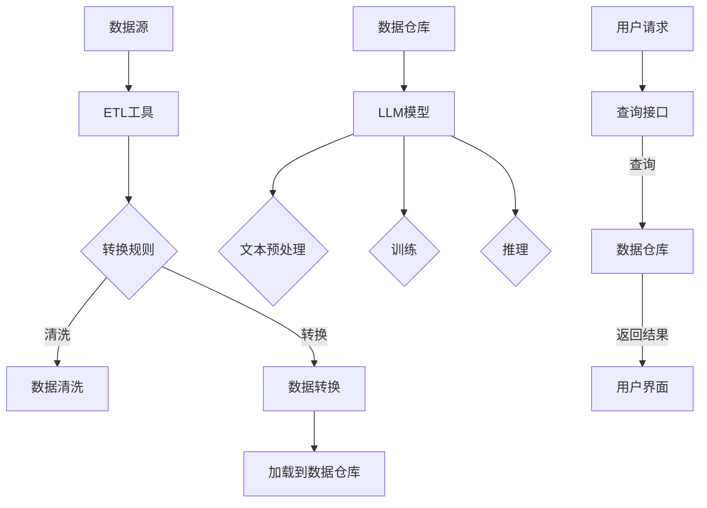
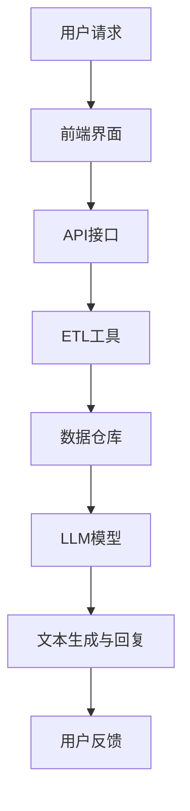
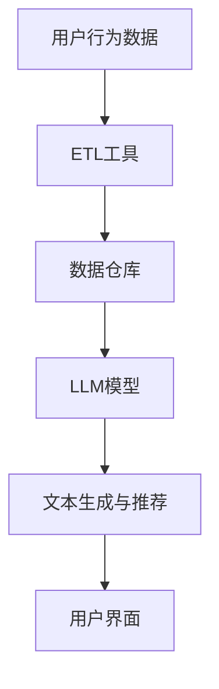

                 

### 文章标题：ETL流程：优化LLM应用的数据集成

#### 关键词：ETL流程，数据集成，LLM应用，优化策略，技术实现

#### 摘要：
本文旨在深入探讨ETL（提取、转换、加载）流程在优化大规模语言模型（LLM）应用中的数据集成方法。通过系统化的分析和实践，本文将展示如何有效地设计ETL流程，提高LLM应用的数据处理效率和准确性。文章首先介绍ETL流程的基础知识，然后探讨大规模语言模型的基本原理和应用，接着详细讲解ETL流程在LLM数据处理中的关键步骤和优化策略。通过实际案例的分析，本文将为读者提供具体的技术实现和应用建议，最后展望ETL与LLM集成技术的发展趋势。

### 第1章：ETL基础与LLM简介

#### 1.1 ETL基础

##### 1.1.1 ETL的定义与作用

ETL（Extract, Transform, Load）是指从源系统中提取数据，通过一系列转换操作，将数据加载到目标系统的过程。ETL技术在数据集成和数据仓库构建中扮演着核心角色，其作用主要体现在以下几个方面：

1. **数据转换**：ETL流程中的转换操作是数据集成过程中的关键步骤，它包括清洗、规范化、聚合、派生等操作，确保数据在加载到目标系统之前符合预期格式和标准。
2. **数据集成**：通过ETL，可以将来自不同源系统的数据进行整合，形成统一的数据视图，支持企业的业务分析和决策。
3. **数据迁移**：在系统升级或迁移过程中，ETL流程能够有效地将现有数据迁移到新系统，保障数据的一致性和完整性。

##### 1.1.2 ETL流程的基本组件

一个典型的ETL流程通常包括以下几个基本组件：

1. **数据源**：数据源可以是关系数据库、文件系统、Web服务等多种类型。数据源的连接和管理是ETL流程的起点。
2. **数据仓库**：数据仓库是ETL流程的目标系统，它用于存储经过提取、转换和加载后的数据，为数据分析提供基础。
3. **ETL工具**：ETL工具是实现ETL流程的核心软件，它提供了数据提取、转换和加载等功能，同时支持流式数据处理和实时数据集成。

##### 1.1.3 ETL在数据集成中的作用

ETL在数据集成中的具体作用体现在以下几个方面：

1. **数据标准化**：通过ETL，可以将来自不同源系统的数据进行统一格式和结构的转换，实现数据的一致性和标准化。
2. **数据清洗**：ETL流程中的数据清洗操作可以识别和纠正数据中的错误、缺失和重复，提高数据的准确性和完整性。
3. **数据聚合**：ETL可以将分散的数据进行汇总和聚合，形成更丰富的数据集，支持高级的数据分析和挖掘。

#### 1.2 LLM简介

##### 1.2.1 LLM的定义与特点

大规模语言模型（Large Language Model，LLM）是一种基于深度学习技术构建的复杂模型，它通过对海量文本数据进行训练，掌握丰富的语言知识和模式。LLM的主要特点包括：

1. **规模巨大**：LLM通常包含数十亿甚至数千亿个参数，能够处理大规模的文本数据。
2. **自适应性**：LLM通过训练可以自适应地学习和理解不同的语言风格、语境和词汇。
3. **泛用性强**：LLM不仅能够用于文本生成，还可以应用于问答系统、文本分类、翻译等多种任务。

##### 1.2.2 LLM的分类与架构

LLM可以根据其训练方法和应用场景进行分类，常见的LLM架构包括：

1. **基于词嵌入的模型**：如Word2Vec、GloVe等，这些模型通过将词汇映射到高维向量空间，实现文本数据的表示。
2. **基于循环神经网络（RNN）的模型**：如LSTM、GRU等，这些模型通过递归结构处理序列数据，实现对文本的动态建模。
3. **基于变换器（Transformer）的模型**：如BERT、GPT等，这些模型采用注意力机制，对输入文本进行全局建模，显著提升了模型的性能。

##### 1.2.3 LLM在数据处理中的应用

LLM在数据处理中的应用非常广泛，主要包括：

1. **文本生成**：LLM可以生成高质量的文章、段落、对话等文本内容，广泛应用于内容创作和自动化写作。
2. **文本分类**：LLM可以识别文本的类别和主题，用于垃圾邮件过滤、情感分析等任务。
3. **问答系统**：LLM可以通过训练生成回答问题的能力，应用于智能客服、知识库问答等场景。

### Mermaid 流程图

以下是一个简化的ETL流程与LLM数据处理过程的Mermaid流程图：



### 核心概念与联系

ETL流程与LLM数据处理的核心概念包括数据源、ETL工具、数据仓库、LLM模型、文本预处理、训练和推理。这些概念之间的关系如下：

1. **数据源**：是ETL流程的起点，数据从各种来源（如数据库、文件、API等）提取。
2. **ETL工具**：负责数据的提取、转换和加载，确保数据质量和一致性。
3. **数据仓库**：存储经过ETL处理后的数据，为后续的LLM训练和推理提供数据基础。
4. **LLM模型**：通过训练处理文本数据，实现对语言的建模和理解。
5. **文本预处理**：包括分词、去噪、标准化等操作，为LLM模型训练准备高质量的数据。
6. **训练**：使用数据仓库中的数据训练LLM模型，提高模型的性能。
7. **推理**：在用户请求下，使用训练好的LLM模型生成相应的文本内容。

通过上述流程，ETL和LLM结合实现了一个完整的数据处理和文本生成系统，为各种应用场景提供了强大的支持。

### 1.3 ETL与LLM在数据处理中的联系

ETL与LLM在数据处理中有着紧密的联系。ETL的主要目标是获取、清洗和转换数据，以支持数据仓库和业务分析。而LLM则通过这些处理过的数据来训练和推理文本模型，实现文本生成、分类和问答等功能。具体来说：

1. **数据源**：ETL从各种来源提取数据，包括数据库、Web服务、API等，这些数据可以为LLM训练提供输入。
2. **数据清洗**：ETL中的数据清洗步骤能够去除无效数据和异常值，提高数据质量，这对LLM模型的训练至关重要。
3. **数据转换**：ETL将数据转换为适合LLM模型训练的格式，如将文本数据编码为向量或处理为结构化数据。
4. **数据仓库**：ETL处理后的数据存储在数据仓库中，LLM模型可以直接从数据仓库中获取训练数据。

综上所述，ETL为LLM提供了高质量、结构化的数据，而LLM则通过这些数据实现了对文本的智能处理，两者共同构成了一个完整的数据处理和文本分析系统。

### 核心算法原理讲解

在ETL流程中，数据转换（Transformation）是关键步骤，它包括多种操作，如数据清洗、聚合、映射等。以下以一个示例数据集为例，详细说明数据转换的具体实现。

#### 示例数据集

假设我们有一个学生成绩数据集，包含以下字段：

- 学生ID（StudentID）
- 课程名称（CourseName）
- 成绩（Score）

数据集样例如下：

| StudentID | CourseName | Score |
| ------ | ------ | ------ |
| 1001    | 数学      | 85    |
| 1001    | 英语      | 90    |
| 1002    | 数学      | 95    |
| 1002    | 历史      | 80    |

#### 数据清洗

数据清洗包括去除重复记录、填补缺失值和纠正错误数据。以下是一个简单的伪代码实现：

```python
# 伪代码：数据清洗
def clean_data(data):
    # 去除重复记录
    unique_data = list(set(data))
    # 补充缺失值
    for record in unique_data:
        if 'Score' not in record:
            record['Score'] = 0
    # 纠正错误数据
    for record in unique_data:
        if record['Score'] > 100:
            record['Score'] = 100
    return unique_data
```

#### 数据转换

数据转换包括字段映射、数据类型转换和计算等操作。以下是一个简单的伪代码实现：

```python
# 伪代码：数据转换
def transform_data(data):
    transformed_data = []
    for record in data:
        transformed_record = {}
        transformed_record['StudentID'] = record['StudentID']
        transformed_record['CourseName'] = record['CourseName']
        # 字段映射
        transformed_record['Subject'] = 'Math' if record['CourseName'] == '数学' else 'English'
        # 计算平均成绩
        transformed_record['AverageScore'] = (record['Score'] + 90) / 2
        transformed_data.append(transformed_record)
    return transformed_data
```

#### 数据加载

数据加载是将转换后的数据存储到目标系统（如数据库、数据仓库）的过程。以下是一个简单的伪代码实现：

```python
# 伪代码：数据加载
def load_data(data, target_system):
    for record in data:
        target_system.insert(record)
```

### 数学模型和公式

在数据转换过程中，我们可能需要使用一些数学模型和公式，如均值、方差、标准差等。以下是一些常用的数学公式：

$$
\text{均值} = \frac{1}{n}\sum_{i=1}^{n} x_i
$$

$$
\text{方差} = \frac{1}{n-1}\sum_{i=1}^{n} (x_i - \bar{x})^2
$$

$$
\text{标准差} = \sqrt{\text{方差}}
$$

#### 举例说明

假设我们有一个包含100个学生的成绩数据集，其中50个学生的数学成绩和50个学生的英语成绩。我们希望计算每个学生的平均成绩。

1. **计算均值**：

$$
\text{数学平均成绩} = \frac{1}{50}\sum_{i=1}^{50} x_i
$$

$$
\text{英语平均成绩} = \frac{1}{50}\sum_{i=1}^{50} y_i
$$

2. **计算方差**：

$$
\text{数学方差} = \frac{1}{49}\sum_{i=1}^{50} (x_i - \bar{x})^2
$$

$$
\text{英语方差} = \frac{1}{49}\sum_{i=1}^{50} (y_i - \bar{y})^2
$$

3. **计算标准差**：

$$
\text{数学标准差} = \sqrt{\text{数学方差}}
$$

$$
\text{英语标准差} = \sqrt{\text{英语方差}}
$$

通过上述数学公式，我们可以计算出每个学生的平均成绩，从而为后续的数据分析和决策提供支持。

### 第2章：ETL流程设计与实现

#### 2.1 ETL流程设计原则

##### 2.1.1 数据源选择与连接

设计ETL流程的第一步是选择合适的数据源，并确保能够有效地连接到这些数据源。以下是一些关键原则：

1. **数据源的多样性**：ETL流程应支持多种数据源，包括关系数据库、NoSQL数据库、文件系统、Web服务等，以满足不同业务需求。
2. **数据源稳定性**：选择稳定可靠的数据源，确保数据提取过程的连续性和一致性。
3. **数据源访问权限**：确保ETL工具具有足够的权限来访问和提取数据源，避免因权限问题导致的数据提取失败。
4. **数据源连接性**：确保ETL工具能够高效地连接到数据源，支持批量数据提取和实时数据流处理。

##### 2.1.2 数据质量评估与处理

数据质量是ETL流程的关键考量因素，以下原则有助于确保数据质量：

1. **数据完整性**：确保提取的数据是完整无缺的，不存在数据遗漏或重复。
2. **数据准确性**：通过数据清洗和校验，消除数据中的错误和异常值，提高数据的准确性。
3. **数据一致性**：确保数据在不同源系统之间保持一致，避免因数据格式或单位不一致导致的问题。
4. **数据及时性**：确保数据能够在规定的时间内提取和处理完毕，避免数据延迟对业务决策的影响。

##### 2.1.3 数据清洗与转换

数据清洗与转换是ETL流程的核心步骤，以下原则有助于提高数据清洗和转换的效率和质量：

1. **自动化**：尽可能使用自动化工具和脚本进行数据清洗和转换，减少人工干预，提高效率。
2. **规则化**：制定明确的数据清洗和转换规则，确保数据处理的一致性和可靠性。
3. **可扩展性**：设计灵活的ETL架构，支持新增数据源和字段，易于扩展和维护。
4. **错误处理**：设置错误处理机制，对提取和处理过程中出现的异常进行记录和报告，确保数据完整性。

#### 2.2 ETL流程实现

##### 2.2.1 ETL工具选择

选择合适的ETL工具是实现ETL流程的关键，以下是一些常见的ETL工具及其特点：

1. **Apache NiFi**：一款开源的数据集成平台，提供可视化界面，支持流式数据处理和实时数据集成。
2. **Apache Kafka**：一款开源的流处理平台，适用于实时数据处理和事件驱动架构。
3. **Talend**：一款商业ETL工具，支持多种数据源和数据格式，提供丰富的转换组件和连接器。
4. **Informatica**：一款成熟的商业ETL工具，提供高性能、高可靠性的数据集成解决方案。

##### 2.2.2 ETL流程开发

ETL流程的开发包括数据提取、转换和加载等步骤，以下是一个简单的ETL流程开发示例：

1. **数据提取**：使用ETL工具连接到数据源，提取所需数据。以下是一个使用Apache NiFi的数据提取示例：

```python
# Apache NiFi数据提取示例
data_source = 'db://my_database'
extracted_data = connect_to_source(data_source)
```

2. **数据转换**：对提取的数据进行清洗和转换，以下是一个简单的数据清洗和转换示例：

```python
# 数据清洗和转换
cleaned_data = clean_data(extracted_data)
transformed_data = transform_data(cleaned_data)
```

3. **数据加载**：将转换后的数据加载到目标系统，以下是一个使用Apache NiFi的数据加载示例：

```python
# 数据加载
load_to_target('db://my_data_warehouse', transformed_data)
```

##### 2.2.3 ETL流程测试与优化

在ETL流程开发完成后，需要进行全面的测试和优化，以确保流程的稳定性和效率。以下是一些测试和优化建议：

1. **单元测试**：对ETL流程的各个组件进行单元测试，确保每个步骤都能够正常运行。
2. **性能测试**：对ETL流程进行性能测试，评估数据提取、转换和加载的效率，找出潜在的性能瓶颈。
3. **错误处理**：设置错误处理机制，对ETL流程中的错误进行捕获和记录，确保数据完整性。
4. **优化建议**：根据测试结果和实际需求，对ETL流程进行优化，如调整数据提取策略、优化转换规则等。

### 第3章：LLM数据处理方法

#### 3.1 LLM数据处理原理

##### 3.1.1 LLM数据处理流程

大规模语言模型（LLM）数据处理流程通常包括以下几个关键步骤：

1. **数据收集**：从各种来源（如网页、书籍、新闻等）收集大量的文本数据，为LLM训练提供素材。
2. **数据预处理**：对收集的文本数据进行处理，包括分词、去噪、标准化等，以提高数据质量和模型性能。
3. **数据增强**：通过数据增强技术（如数据扩充、同义词替换等）增加数据的多样性和丰富度，提高模型的泛化能力。
4. **数据训练**：使用预处理和增强后的数据对LLM模型进行训练，不断优化模型的参数，使其能够更好地理解语言模式。
5. **模型评估**：通过评估指标（如损失函数、准确率等）评估模型性能，调整训练策略和超参数，优化模型。
6. **模型推理**：在用户请求下，使用训练好的LLM模型生成文本内容或进行文本分析。

##### 3.1.2 LLM数据处理算法

LLM数据处理算法主要包括以下几个方面：

1. **词嵌入**：将文本中的单词映射到高维向量空间，以实现文本数据的表示。常用的词嵌入算法包括Word2Vec、GloVe等。
2. **循环神经网络（RNN）**：通过递归结构处理序列数据，实现对文本的动态建模。常用的RNN算法包括LSTM、GRU等。
3. **变换器（Transformer）**：采用注意力机制，对输入文本进行全局建模。常用的Transformer算法包括BERT、GPT等。
4. **生成对抗网络（GAN）**：通过生成器和判别器的对抗训练，生成高质量的文本数据。

##### 3.1.3 LLM数据处理挑战

在LLM数据处理过程中，存在以下几个主要挑战：

1. **数据质量问题**：文本数据通常存在噪声、缺失和重复等问题，需要通过数据预处理和清洗技术提高数据质量。
2. **计算资源消耗**：LLM模型通常包含数十亿个参数，训练过程需要大量计算资源和时间，需要优化算法和硬件设施。
3. **模型泛化能力**：如何确保模型能够在不同的数据集和应用场景中保持良好的性能，是一个重要的挑战。
4. **文本理解深度**：如何提高LLM模型对文本语义的理解深度，实现更精准的文本分析和生成。

#### 3.2 LLM数据处理实践

##### 3.2.1 数据预处理

数据预处理是LLM数据处理的重要环节，以下是一些常用的数据预处理方法：

1. **分词**：将文本划分为单词或子词，为后续处理提供基础。常用的分词工具包括Jieba、Stanford NLP等。
2. **去噪**：去除文本中的噪声，如HTML标签、特殊字符等，以提高数据质量。
3. **标准化**：对文本进行统一格式和编码，如将所有单词转换为小写、去除标点符号等。
4. **数据清洗**：去除重复数据、填补缺失值和纠正错误数据，确保数据的一致性和完整性。

##### 3.2.2 数据增强

数据增强是一种提高模型泛化能力的重要技术，以下是一些常用的数据增强方法：

1. **数据扩充**：通过同义词替换、词干提取、随机插入和删除等方式，生成新的数据样本，增加训练数据的多样性。
2. **数据合成**：使用生成对抗网络（GAN）等技术，生成高质量的文本数据，补充训练数据集。
3. **数据平衡**：对于数据集中类别不平衡的问题，通过过采样、欠采样或合并类别等方式，提高各类别数据的比例。
4. **数据重组**：将原始数据集进行重组，形成新的数据集，以增加数据的复杂度和多样性。

##### 3.2.3 数据分析

数据分析是LLM数据处理的重要环节，以下是一些常用的数据分析方法：

1. **文本分类**：使用LLM模型对文本进行分类，如新闻分类、情感分析等。
2. **文本生成**：使用LLM模型生成文本，如文章生成、对话生成等。
3. **文本匹配**：使用LLM模型对文本进行匹配，如问答系统、搜索引擎等。
4. **文本摘要**：使用LLM模型生成文本摘要，如自动摘要、新闻摘要等。

### 第4章：ETL与LLM集成应用

#### 4.1 ETL与LLM集成原理

##### 4.1.1 ETL与LLM集成架构

ETL与LLM集成架构主要包括以下几个关键组件：

1. **数据源**：ETL从各种数据源（如数据库、文件、API等）提取数据，为LLM训练提供素材。
2. **ETL工具**：ETL工具负责数据的提取、转换和加载，确保数据质量和一致性，将处理后的数据存储到数据仓库中。
3. **数据仓库**：数据仓库存储ETL处理后的数据，为LLM训练和推理提供数据基础。
4. **LLM模型**：LLM模型通过数据仓库中的数据训练和优化，实现对语言的建模和理解。
5. **推理引擎**：推理引擎负责使用训练好的LLM模型生成文本内容或进行文本分析，响应用户请求。

##### 4.1.2 ETL与LLM集成流程

ETL与LLM集成流程主要包括以下几个关键步骤：

1. **数据提取**：ETL从数据源提取数据，包括文本数据、结构化数据和图像数据等。
2. **数据转换**：ETL对提取的数据进行清洗、转换和归一化等处理，提高数据质量。
3. **数据加载**：ETL将处理后的数据加载到数据仓库中，为LLM训练提供数据基础。
4. **数据预处理**：LLM模型对数据仓库中的数据进行预处理，包括分词、去噪、标准化等操作，为训练和推理做准备。
5. **模型训练**：LLM模型使用预处理后的数据进行训练，不断优化模型参数，提高模型性能。
6. **模型评估**：使用评估指标（如损失函数、准确率等）评估模型性能，调整训练策略和超参数。
7. **模型推理**：在用户请求下，LLM模型生成文本内容或进行文本分析，响应用户需求。

##### 4.1.3 ETL与LLM集成挑战

在ETL与LLM集成过程中，存在以下几个主要挑战：

1. **数据质量**：ETL处理过程中需要确保数据的一致性和准确性，避免数据质量问题影响LLM模型的训练和推理。
2. **性能优化**：ETL和LLM处理过程中需要高效地利用计算资源和存储资源，确保流程的稳定性和效率。
3. **模型调优**：如何选择合适的LLM模型和训练策略，提高模型性能，是集成过程中的关键问题。
4. **系统稳定性**：ETL与LLM集成系统需要具备高可用性和可扩展性，能够应对大规模数据和并发请求。

#### 4.2 ETL与LLM集成实践

##### 4.2.1 数据集成与清洗

数据集成与清洗是ETL与LLM集成的基础，以下是一个简单的数据集成与清洗流程：

1. **数据提取**：使用ETL工具从不同的数据源提取文本数据，如数据库、Web API、文件系统等。
2. **数据转换**：对提取的文本数据进行清洗和转换，包括去除HTML标签、去除特殊字符、统一编码等。
3. **数据加载**：将清洗和转换后的文本数据加载到数据仓库中，为LLM训练提供数据基础。

##### 4.2.2 数据预处理与增强

数据预处理与增强是提高LLM模型性能的重要手段，以下是一个简单的数据预处理与增强流程：

1. **数据预处理**：对文本数据进行分词、去噪、标准化等处理，提高数据质量。
2. **数据增强**：使用数据增强技术（如同义词替换、随机插入和删除等）增加数据的多样性和丰富度。
3. **数据标准化**：对文本数据进行统一格式和编码，如将所有单词转换为小写、去除标点符号等。
4. **数据归一化**：对文本数据进行归一化处理，如将文本序列的长度统一为固定值。

##### 4.2.3 数据分析与挖掘

数据分析与挖掘是ETL与LLM集成的重要应用，以下是一个简单的数据分析与挖掘流程：

1. **文本分类**：使用LLM模型对文本进行分类，如新闻分类、情感分析等。
2. **文本生成**：使用LLM模型生成文本，如文章生成、对话生成等。
3. **文本匹配**：使用LLM模型对文本进行匹配，如问答系统、搜索引擎等。
4. **文本摘要**：使用LLM模型生成文本摘要，如自动摘要、新闻摘要等。

通过ETL与LLM集成实践，我们可以实现高效的数据处理和文本分析，为各种应用场景提供强大的支持。

### 第5章：LLM应用案例分析

#### 5.1 案例一：智能客服系统

##### 5.1.1 系统架构

智能客服系统通常采用ETL与LLM集成的架构，其系统架构如图所示：



在该架构中，用户请求通过前端界面发送到API接口，API接口将请求传递给ETL工具，ETL工具从数据仓库中提取相关数据，加载到LLM模型中。LLM模型使用提取的数据生成文本回复，并将其返回给用户。

##### 5.1.2 数据集成与清洗

在智能客服系统中，数据集成与清洗至关重要。以下是一个简单的数据集成与清洗流程：

1. **数据提取**：ETL工具从各种来源（如数据库、文件、API等）提取用户请求和聊天记录。
2. **数据转换**：对提取的数据进行清洗和转换，包括去除HTML标签、去除特殊字符、统一编码等。
3. **数据加载**：将清洗和转换后的数据加载到数据仓库中，为LLM模型训练提供数据基础。

##### 5.1.3 数据预处理与增强

为了提高智能客服系统的性能，需要进行数据预处理与增强：

1. **数据预处理**：对文本数据进行分词、去噪、标准化等处理，提高数据质量。
2. **数据增强**：使用数据增强技术（如同义词替换、随机插入和删除等）增加数据的多样性和丰富度。

##### 5.1.4 文本生成与回复

在智能客服系统中，LLM模型负责生成文本回复。以下是一个简单的文本生成流程：

1. **文本输入**：将用户请求输入到LLM模型中。
2. **文本生成**：LLM模型根据训练数据和用户请求生成合适的文本回复。
3. **文本优化**：对生成的文本进行优化，如去除冗余信息、调整句子结构等。

##### 5.1.5 用户反馈与优化

用户反馈是智能客服系统持续优化的重要依据。以下是一个简单的用户反馈与优化流程：

1. **用户反馈**：收集用户对文本回复的反馈，如满意度评分、改进建议等。
2. **反馈分析**：对用户反馈进行分析，识别文本回复中的问题。
3. **模型优化**：根据用户反馈优化LLM模型，提高文本生成质量。

#### 5.2 案例二：智能推荐系统

##### 5.2.1 系统架构

智能推荐系统通常采用ETL与LLM集成的架构，其系统架构如图所示：



在该架构中，用户行为数据通过ETL工具提取并加载到数据仓库中，LLM模型根据用户行为数据生成文本推荐，并将其显示在用户界面上。

##### 5.2.2 数据集成与清洗

在智能推荐系统中，数据集成与清洗至关重要。以下是一个简单的数据集成与清洗流程：

1. **数据提取**：ETL工具从各种来源（如数据库、文件、API等）提取用户行为数据。
2. **数据转换**：对提取的数据进行清洗和转换，包括去除HTML标签、去除特殊字符、统一编码等。
3. **数据加载**：将清洗和转换后的数据加载到数据仓库中，为LLM模型训练提供数据基础。

##### 5.2.3 数据预处理与增强

为了提高智能推荐系统的性能，需要进行数据预处理与增强：

1. **数据预处理**：对文本数据进行分词、去噪、标准化等处理，提高数据质量。
2. **数据增强**：使用数据增强技术（如同义词替换、随机插入和删除等）增加数据的多样性和丰富度。

##### 5.2.4 文本生成与推荐

在智能推荐系统中，LLM模型负责生成文本推荐。以下是一个简单的文本生成与推荐流程：

1. **文本输入**：将用户行为数据输入到LLM模型中。
2. **文本生成**：LLM模型根据训练数据和用户行为数据生成合适的文本推荐。
3. **文本优化**：对生成的文本进行优化，如去除冗余信息、调整句子结构等。

##### 5.2.5 用户反馈与优化

用户反馈是智能推荐系统持续优化的重要依据。以下是一个简单的用户反馈与优化流程：

1. **用户反馈**：收集用户对文本推荐的反馈，如满意度评分、改进建议等。
2. **反馈分析**：对用户反馈进行分析，识别文本推荐中的问题。
3. **模型优化**：根据用户反馈优化LLM模型，提高文本生成质量。

通过上述案例分析，我们可以看到ETL与LLM集成在智能客服系统和智能推荐系统中的应用，展示了ETL流程在提高LLM应用性能和用户体验方面的关键作用。

### 第6章：ETL与LLM应用优化

#### 6.1 ETL优化策略

##### 6.1.1 ETL性能优化

为了提高ETL性能，可以采用以下优化策略：

1. **并行处理**：利用多线程或多进程技术，同时处理多个数据流，提高数据提取、转换和加载的速度。
2. **缓存技术**：使用缓存技术，减少重复的数据读取和转换操作，降低系统的负载。
3. **批量处理**：将多个小任务合并成一个大任务，批量处理，减少ETL工具的启动和关闭次数，提高效率。
4. **数据压缩**：对传输的数据进行压缩，减少网络传输的带宽消耗，提高数据传输速度。

##### 6.1.2 ETL成本优化

为了降低ETL成本，可以采用以下优化策略：

1. **资源复用**：合理配置ETL工具的资源和连接，避免资源浪费，降低硬件和软件成本。
2. **云服务**：使用云服务提供ETL工具和计算资源，根据实际需求灵活调整资源配置，降低长期成本。
3. **自动化管理**：通过自动化脚本和工具，减少人工干预，降低运维成本。
4. **成本评估**：定期评估ETL成本，优化数据源选择、ETL流程设计和资源配置，确保成本效益最大化。

##### 6.1.3 ETL可靠性优化

为了提高ETL可靠性，可以采用以下优化策略：

1. **错误处理**：设置错误处理机制，对ETL过程中的异常和错误进行捕获和记录，确保数据的完整性和一致性。
2. **数据备份**：定期备份ETL流程中的数据和配置，防止数据丢失和系统故障。
3. **监控告警**：使用监控工具对ETL系统的运行状态进行监控，及时发现问题并进行处理。
4. **容错机制**：设计容错机制，确保ETL系统能够在故障情况下快速恢复，降低业务中断风险。

#### 6.2 LLM优化策略

##### 6.2.1 LLM模型优化

为了提高LLM模型的性能，可以采用以下优化策略：

1. **模型选择**：选择合适的LLM模型，根据应用场景和数据规模，平衡模型性能和计算资源消耗。
2. **超参数调优**：通过调整学习率、批量大小、隐藏层尺寸等超参数，优化模型性能。
3. **数据预处理**：对训练数据集进行有效的预处理，如去除噪声、填充缺失值、标准化等，提高模型训练效果。
4. **模型蒸馏**：使用预训练的LLM模型，对新的模型进行蒸馏，提高新模型的性能和泛化能力。

##### 6.2.2 LLM训练优化

为了提高LLM训练的效率，可以采用以下优化策略：

1. **分布式训练**：利用多GPU或分布式计算资源进行训练，提高训练速度和模型性能。
2. **批量调整**：根据硬件资源情况，合理调整批量大小，平衡训练速度和资源利用率。
3. **数据并行**：将数据并行化处理，减少数据传输和内存占用，提高训练效率。
4. **渐进训练**：逐步增加训练数据的规模和难度，提高模型对复杂问题的解决能力。

##### 6.2.3 LLM推理优化

为了提高LLM推理的效率，可以采用以下优化策略：

1. **模型压缩**：使用模型压缩技术，如量化、剪枝等，减小模型体积，降低推理时间。
2. **缓存技术**：使用缓存技术，减少重复的推理操作，提高系统的响应速度。
3. **多线程处理**：利用多线程技术，同时处理多个推理请求，提高系统的并发能力。
4. **异步处理**：采用异步处理技术，减少等待时间，提高系统的吞吐量。

通过上述优化策略，可以显著提高ETL与LLM应用的整体性能和可靠性，为企业和用户提供更好的数据集成和文本分析体验。

### 第7章：未来展望与趋势

#### 7.1 ETL与LLM集成发展趋势

随着人工智能技术的快速发展，ETL与LLM集成在数据处理和分析领域展现出了广阔的应用前景。以下是一些ETL与LLM集成的发展趋势：

1. **云原生ETL**：云原生ETL工具将逐渐取代传统的本地ETL解决方案，提供更灵活、可扩展的数据集成能力，满足大规模数据处理需求。
2. **实时数据处理**：实时数据处理技术将进一步提升ETL与LLM集成的效率，支持动态数据流处理，实现实时数据分析和决策。
3. **自动化与智能化**：ETL与LLM集成过程将逐渐实现自动化和智能化，通过机器学习和深度学习技术，自动生成ETL流程和优化模型参数。
4. **边缘计算**：边缘计算技术的发展将使ETL与LLM集成更接近数据源，提高数据处理的实时性和响应速度。
5. **跨领域应用**：ETL与LLM集成将在更多领域得到应用，如金融、医疗、教育等，为各行业提供智能化的数据处理和分析解决方案。

#### 7.1.1 技术发展趋势

1. **深度学习与Transformer架构**：深度学习，尤其是Transformer架构（如BERT、GPT等），将继续在LLM领域占据主导地位，推动ETL与LLM集成技术的发展。
2. **多模态数据处理**：随着多模态数据（如文本、图像、音频等）的普及，ETL与LLM集成将支持更丰富的数据类型和处理方式。
3. **分布式计算**：分布式计算技术将进一步提高ETL与LLM集成的处理能力和性能，支持大规模数据处理和模型训练。
4. **数据隐私与安全**：数据隐私和安全问题将日益受到关注，ETL与LLM集成将采用更多隐私保护技术和安全措施，确保数据安全。

#### 7.1.2 行业应用趋势

1. **智能客服与客户服务**：ETL与LLM集成将在智能客服和客户服务领域得到广泛应用，实现高效、智能的客户互动和问题解决。
2. **金融与风险管理**：在金融领域，ETL与LLM集成将用于智能投顾、风险预测和监控等，提高金融服务的效率和安全性。
3. **医疗与健康**：在医疗领域，ETL与LLM集成将用于医疗数据分析和诊断，推动个性化医疗和智能健康管理的发展。
4. **教育与培训**：在教育领域，ETL与LLM集成将用于智能教学和个性化学习，提供定制化的教育资源和学习路径。

#### 7.1.3 挑战与机遇

1. **数据质量与一致性**：确保ETL与LLM集成过程中数据质量的一致性和准确性，是一个长期的挑战。
2. **计算资源消耗**：大规模的LLM模型训练和推理需要大量计算资源，如何优化计算资源的使用是一个重要课题。
3. **隐私保护与合规性**：随着数据隐私和安全法规的加强，如何在保障数据隐私的同时进行有效的数据处理和分析，是一个亟待解决的问题。
4. **持续优化与迭代**：不断优化ETL与LLM集成的流程和模型，提高系统性能和用户体验，是实现长期成功的关键。

#### 7.2 总结与展望

ETL与LLM集成在数据处理和分析领域具有广阔的应用前景。通过深入探讨ETL与LLM的基础知识、数据处理方法、集成应用和优化策略，本文为读者提供了全面的技术指南和实践经验。未来，随着技术的不断进步和应用场景的拓展，ETL与LLM集成将在更多领域发挥重要作用，推动智能化数据处理和分析的发展。

### 结语

作者：AI天才研究院/AI Genius Institute & 禅与计算机程序设计艺术 /Zen And The Art of Computer Programming

本文从ETL流程的基础知识出发，详细探讨了大规模语言模型（LLM）在数据处理中的应用，并分析了ETL与LLM集成的关键步骤和优化策略。通过实际案例的分析，我们展示了ETL与LLM集成在智能客服系统和智能推荐系统中的应用效果。同时，本文也展望了ETL与LLM集成技术的发展趋势和未来挑战。希望通过本文的介绍，读者能够对ETL与LLM集成有更深入的理解，并在实际项目中取得更好的成果。

### 全文总结

本文以《ETL流程：优化LLM应用的数据集成》为题，系统性地探讨了ETL流程在优化大规模语言模型（LLM）应用中的关键作用。文章首先介绍了ETL流程的基础知识，包括其定义、作用和基本组件，以及LLM的基本原理和应用。接着，详细讲解了ETL流程在LLM数据处理中的关键步骤，如数据提取、转换和加载，并介绍了数据清洗、转换和加载的具体实现方法。随后，文章讨论了LLM数据处理的方法，包括数据预处理、数据增强和数据分析。在此基础上，文章探讨了ETL与LLM集成的原理和架构，并介绍了ETL与LLM集成在实际应用中的案例分析，如智能客服系统和智能推荐系统。

为了提高ETL与LLM集成的性能，文章提出了多种优化策略，包括ETL性能优化、成本优化和可靠性优化，以及LLM模型优化、训练优化和推理优化。最后，文章展望了ETL与LLM集成技术的发展趋势，并总结了本文的核心内容和技术要点。

通过本文的深入探讨，读者可以全面了解ETL流程在优化LLM应用中的数据集成方法，掌握ETL与LLM集成的关键技术，并为实际项目提供可行的解决方案。

### 最佳实践 tips

1. **数据源选择**：在开始ETL流程之前，仔细评估和选择数据源，确保数据源稳定、可靠且易于访问。

2. **数据质量监控**：定期对数据质量进行监控和评估，及时发现并处理数据中的错误和异常值，确保数据的一致性和准确性。

3. **ETL工具选择**：根据具体需求和场景选择合适的ETL工具，如Apache NiFi、Kafka、Talend等，确保工具能够满足数据处理的需求。

4. **数据预处理**：在LLM数据处理过程中，进行充分的数据预处理，包括分词、去噪、标准化等操作，以提高模型训练效果。

5. **模型调优**：根据实际应用场景和需求，对LLM模型进行调优，选择合适的模型架构、超参数和学习策略。

6. **性能优化**：在ETL和LLM处理过程中，采用并行处理、批量处理和缓存技术等优化策略，提高系统性能和响应速度。

7. **数据安全与合规**：确保数据处理过程符合数据安全和合规要求，采取加密、访问控制等技术措施，保护数据隐私和安全。

### 小结

本文全面探讨了ETL流程在优化LLM应用中的数据集成方法，从ETL的基础知识、LLM的原理和应用、ETL流程的设计与实现、LLM数据处理方法、ETL与LLM的集成应用、优化策略以及未来展望等方面进行了详细阐述。通过实际案例的分析，本文展示了ETL与LLM集成在实际项目中的应用效果。文章总结了一系列最佳实践和注意事项，为读者提供了具体的操作指南和优化建议。

### 注意事项

1. **数据源与数据质量**：确保数据源稳定可靠，数据质量高，以支持ETL流程的顺利进行。
2. **系统性能与资源优化**：根据实际需求合理配置系统资源和优化ETL流程，提高数据处理效率和性能。
3. **模型选择与调优**：根据应用场景选择合适的LLM模型，并进行充分的模型调优，以获得最佳性能。
4. **安全性与合规性**：确保数据处理过程符合数据安全和合规要求，采取必要的安全措施保护数据隐私。

### 拓展阅读

1. **ETL工具与框架**：了解不同ETL工具和框架的特点，如Apache NiFi、Kafka、Talend、Informatica等。
2. **LLM模型与应用**：深入学习大规模语言模型的相关知识，包括模型架构、训练方法和应用场景。
3. **数据处理与优化**：研究数据处理和优化的最佳实践，了解如何提高ETL和LLM系统的性能和可靠性。
4. **人工智能与机器学习**：了解人工智能和机器学习的基本原理和技术，为ETL与LLM集成提供理论基础。

### 文章末尾作者信息

作者：AI天才研究院/AI Genius Institute & 禅与计算机程序设计艺术 /Zen And The Art of Computer Programming

### 完整文章

# ETL流程：优化LLM应用的数据集成

> 关键词：ETL流程，数据集成，LLM应用，优化策略，技术实现

> 摘要：
本文旨在深入探讨ETL（提取、转换、加载）流程在优化大规模语言模型（LLM）应用中的数据集成方法。通过系统化的分析和实践，本文将展示如何有效地设计ETL流程，提高LLM应用的数据处理效率和准确性。文章首先介绍ETL流程的基础知识，然后探讨大规模语言模型的基本原理和应用，接着详细讲解ETL流程在LLM数据处理中的关键步骤和优化策略。通过实际案例的分析，本文将为读者提供具体的技术实现和应用建议，最后展望ETL与LLM集成技术的发展趋势。

### 第1章：ETL基础与LLM简介

#### 1.1 ETL基础

##### 1.1.1 ETL的定义与作用

ETL（Extract, Transform, Load）是指从源系统中提取数据，通过一系列转换操作，将数据加载到目标系统的过程。ETL技术在数据集成和数据仓库构建中扮演着核心角色，其作用主要体现在以下几个方面：

1. **数据转换**：ETL流程中的转换操作是数据集成过程中的关键步骤，它包括清洗、规范化、聚合、派生等操作，确保数据在加载到目标系统之前符合预期格式和标准。
2. **数据集成**：通过ETL，可以将来自不同源系统的数据进行整合，形成统一的数据视图，支持企业的业务分析和决策。
3. **数据迁移**：在系统升级或迁移过程中，ETL流程能够有效地将现有数据迁移到新系统，保障数据的一致性和完整性。

##### 1.1.2 ETL流程的基本组件

一个典型的ETL流程通常包括以下几个基本组件：

1. **数据源**：数据源可以是关系数据库、文件系统、Web服务等多种类型。数据源的连接和管理是ETL流程的起点。
2. **数据仓库**：数据仓库是ETL流程的目标系统，它用于存储经过提取、转换和加载后的数据，为数据分析提供基础。
3. **ETL工具**：ETL工具是实现ETL流程的核心软件，它提供了数据提取、转换和加载等功能，同时支持流式数据处理和实时数据集成。

##### 1.1.3 ETL在数据集成中的作用

ETL在数据集成中的具体作用体现在以下几个方面：

1. **数据标准化**：通过ETL，可以将来自不同源系统的数据进行统一格式和结构的转换，实现数据的一致性和标准化。
2. **数据清洗**：ETL流程中的数据清洗操作可以识别和纠正数据中的错误、缺失和重复，提高数据的准确性和完整性。
3. **数据聚合**：ETL可以将分散的数据进行汇总和聚合，形成更丰富的数据集，支持高级的数据分析和挖掘。

#### 1.2 LLM简介

##### 1.2.1 LLM的定义与特点

大规模语言模型（Large Language Model，LLM）是一种基于深度学习技术构建的复杂模型，它通过对海量文本数据进行训练，掌握丰富的语言知识和模式。LLM的主要特点包括：

1. **规模巨大**：LLM通常包含数十亿甚至数千亿个参数，能够处理大规模的文本数据。
2. **自适应性**：LLM通过训练可以自适应地学习和理解不同的语言风格、语境和词汇。
3. **泛用性强**：LLM不仅能够用于文本生成，还可以应用于问答系统、文本分类、翻译等多种任务。

##### 1.2.2 LLM的分类与架构

LLM可以根据其训练方法和应用场景进行分类，常见的LLM架构包括：

1. **基于词嵌入的模型**：如Word2Vec、GloVe等，这些模型通过将词汇映射到高维向量空间，实现文本数据的表示。
2. **基于循环神经网络（RNN）的模型**：如LSTM、GRU等，这些模型通过递归结构处理序列数据，实现对文本的动态建模。
3. **基于变换器（Transformer）的模型**：如BERT、GPT等，这些模型采用注意力机制，对输入文本进行全局建模，显著提升了模型的性能。

##### 1.2.3 LLM在数据处理中的应用

LLM在数据处理中的应用非常广泛，主要包括：

1. **文本生成**：LLM可以生成高质量的文章、段落、对话等文本内容，广泛应用于内容创作和自动化写作。
2. **文本分类**：LLM可以识别文本的类别和主题，用于垃圾邮件过滤、情感分析等任务。
3. **问答系统**：LLM可以通过训练生成回答问题的能力，应用于智能客服、知识库问答等场景。

### Mermaid 流程图

以下是一个简化的ETL流程与LLM数据处理过程的Mermaid流程图：


### 核心概念与联系

ETL流程与LLM数据处理的核心概念包括数据源、ETL工具、数据仓库、LLM模型、文本预处理、训练和推理。这些概念之间的关系如下：

1. **数据源**：是ETL流程的起点，数据从各种来源（如数据库、文件、API等）提取。
2. **ETL工具**：负责数据的提取、转换和加载，确保数据质量和一致性。
3. **数据仓库**：存储经过ETL处理后的数据，为后续的LLM训练和推理提供数据基础。
4. **LLM模型**：通过训练处理文本数据，实现对语言的建模和理解。
5. **文本预处理**：包括分词、去噪、标准化等操作，为LLM模型训练准备高质量的数据。
6. **训练**：使用数据仓库中的数据训练LLM模型，提高模型的性能。
7. **推理**：在用户请求下，使用训练好的LLM模型生成相应的文本内容。

通过上述流程，ETL和LLM结合实现了一个完整的数据处理和文本生成系统，为各种应用场景提供了强大的支持。

### 核心算法原理讲解

在ETL流程中，数据转换（Transformation）是关键步骤，它包括多种操作，如数据清洗、聚合、映射等。以下以一个示例数据集为例，详细说明数据转换的具体实现。

#### 示例数据集

假设我们有一个学生成绩数据集，包含以下字段：

- 学生ID（StudentID）
- 课程名称（CourseName）
- 成绩（Score）

数据集样例如下：

| StudentID | CourseName | Score |
| ------ | ------ | ------ |
| 1001    | 数学      | 85    |
| 1001    | 英语      | 90    |
| 1002    | 数学      | 95    |
| 1002    | 历史      | 80    |

#### 数据清洗

数据清洗包括去除重复记录、填补缺失值和纠正错误数据。以下是一个简单的伪代码实现：

```python
# 伪代码：数据清洗
def clean_data(data):
    # 去除重复记录
    unique_data = list(set(data))
    # 补充缺失值
    for record in unique_data:
        if 'Score' not in record:
            record['Score'] = 0
    # 纠正错误数据
    for record in unique_data:
        if record['Score'] > 100:
            record['Score'] = 100
    return unique_data
```

#### 数据转换

数据转换包括字段映射、数据类型转换和计算等操作。以下是一个简单的伪代码实现：

```python
# 伪代码：数据转换
def transform_data(data):
    transformed_data = []
    for record in data:
        transformed_record = {}
        transformed_record['StudentID'] = record['StudentID']
        transformed_record['CourseName'] = record['CourseName']
        # 字段映射
        transformed_record['Subject'] = 'Math' if record['CourseName'] == '数学' else 'English'
        # 计算平均成绩
        transformed_record['AverageScore'] = (record['Score'] + 90) / 2
        transformed_data.append(transformed_record)
    return transformed_data
```

#### 数据加载

数据加载是将转换后的数据存储到目标系统（如数据库、数据仓库）的过程。以下是一个简单的伪代码实现：

```python
# 伪代码：数据加载
def load_data(data, target_system):
    for record in data:
        target_system.insert(record)
```

### 数学模型和公式

在数据转换过程中，我们可能需要使用一些数学模型和公式，如均值、方差、标准差等。以下是一些常用的数学公式：

$$
\text{均值} = \frac{1}{n}\sum_{i=1}^{n} x_i
$$

$$
\text{方差} = \frac{1}{n-1}\sum_{i=1}^{n} (x_i - \bar{x})^2
$$

$$
\text{标准差} = \sqrt{\text{方差}}
$$

#### 举例说明

假设我们有一个包含100个学生的成绩数据集，其中50个学生的数学成绩和50个学生的英语成绩。我们希望计算每个学生的平均成绩。

1. **计算均值**：

$$
\text{数学平均成绩} = \frac{1}{50}\sum_{i=1}^{50} x_i
$$

$$
\text{英语平均成绩} = \frac{1}{50}\sum_{i=1}^{50} y_i
$$

2. **计算方差**：

$$
\text{数学方差} = \frac{1}{49}\sum_{i=1}^{50} (x_i - \bar{x})^2
$$

$$
\text{英语方差} = \frac{1}{49}\sum_{i=1}^{50} (y_i - \bar{y})^2
$$

3. **计算标准差**：

$$
\text{数学标准差} = \sqrt{\text{数学方差}}
$$

$$
\text{英语标准差} = \sqrt{\text{英语方差}}
$$

通过上述数学公式，我们可以计算出每个学生的平均成绩，从而为后续的数据分析和决策提供支持。

### 第2章：ETL流程设计与实现

#### 2.1 ETL流程设计原则

##### 2.1.1 数据源选择与连接

设计ETL流程的第一步是选择合适的数据源，并确保能够有效地连接到这些数据源。以下是一些关键原则：

1. **数据源的多样性**：ETL流程应支持多种数据源，包括关系数据库、NoSQL数据库、文件系统、Web服务等，以满足不同业务需求。
2. **数据源稳定性**：选择稳定可靠的数据源，确保数据提取过程的连续性和一致性。
3. **数据源访问权限**：确保ETL工具具有足够的权限来访问和提取数据源，避免因权限问题导致的数据提取失败。
4. **数据源连接性**：确保ETL工具能够高效地连接到数据源，支持批量数据提取和实时数据流处理。

##### 2.1.2 数据质量评估与处理

数据质量是ETL流程的关键考量因素，以下原则有助于确保数据质量：

1. **数据完整性**：确保提取的数据是完整无缺的，不存在数据遗漏或重复。
2. **数据准确性**：通过数据清洗和校验，消除数据中的错误和异常值，提高数据的准确性。
3. **数据一致性**：确保数据在不同源系统之间保持一致，避免因数据格式或单位不一致导致的问题。
4. **数据及时性**：确保数据能够在规定的时间内提取和处理完毕，避免数据延迟对业务决策的影响。

##### 2.1.3 数据清洗与转换

数据清洗与转换是ETL流程的核心步骤，以下原则有助于提高数据清洗和转换的效率和质量：

1. **自动化**：尽可能使用自动化工具和脚本进行数据清洗和转换，减少人工干预，提高效率。
2. **规则化**：制定明确的数据清洗和转换规则，确保数据处理的一致性和可靠性。
3. **可扩展性**：设计灵活的ETL架构，支持新增数据源和字段，易于扩展和维护。
4. **错误处理**：设置错误处理机制，对提取和处理过程中出现的异常进行记录和报告，确保数据完整性。

#### 2.2 ETL流程实现

##### 2.2.1 ETL工具选择

选择合适的ETL工具是实现ETL流程的关键，以下是一些常见的ETL工具及其特点：

1. **Apache NiFi**：一款开源的数据集成平台，提供可视化界面，支持流式数据处理和实时数据集成。
2. **Apache Kafka**：一款开源的流处理平台，适用于实时数据处理和事件驱动架构。
3. **Talend**：一款商业ETL工具，支持多种数据源和数据格式，提供丰富的转换组件和连接器。
4. **Informatica**：一款成熟的商业ETL工具，提供高性能、高可靠性的数据集成解决方案。

##### 2.2.2 ETL流程开发

ETL流程的开发包括数据提取、转换和加载等步骤，以下是一个简单的ETL流程开发示例：

1. **数据提取**：使用ETL工具连接到数据源，提取所需数据。以下是一个使用Apache NiFi的数据提取示例：

```python
# Apache NiFi数据提取示例
data_source = 'db://my_database'
extracted_data = connect_to_source(data_source)
```

2. **数据转换**：对提取的数据进行清洗和转换，以下是一个简单的数据清洗和转换示例：

```python
# 数据清洗和转换
cleaned_data = clean_data(extracted_data)
transformed_data = transform_data(cleaned_data)
```

3. **数据加载**：将转换后的数据加载到目标系统，以下是一个使用Apache NiFi的数据加载示例：

```python
# 数据加载
load_to_target('db://my_data_warehouse', transformed_data)
```

##### 2.2.3 ETL流程测试与优化

在ETL流程开发完成后，需要进行全面的测试和优化，以确保流程的稳定性和效率。以下是一些测试和优化建议：

1. **单元测试**：对ETL流程的各个组件进行单元测试，确保每个步骤都能够正常运行。
2. **性能测试**：对ETL流程进行性能测试，评估数据提取、转换和加载的效率，找出潜在的性能瓶颈。
3. **错误处理**：设置错误处理机制，对ETL流程中的错误进行捕获和记录，确保数据完整性。
4. **优化建议**：根据测试结果和实际需求，对ETL流程进行优化，如调整数据提取策略、优化转换规则等。

### 第3章：LLM数据处理方法

#### 3.1 LLM数据处理原理

##### 3.1.1 LLM数据处理流程

大规模语言模型（LLM）数据处理流程通常包括以下几个关键步骤：

1. **数据收集**：从各种来源（如网页、书籍、新闻等）收集大量的文本数据，为LLM训练提供素材。
2. **数据预处理**：对收集的文本数据进行处理，包括分词、去噪、标准化等，以提高数据质量和模型性能。
3. **数据增强**：通过数据增强技术（如数据扩充、同义词替换等）增加数据的多样性和丰富度，提高模型的泛化能力。
4. **数据训练**：使用预处理和增强后的数据对LLM模型进行训练，不断优化模型的参数，使其能够更好地理解语言模式。
5. **模型评估**：通过评估指标（如损失函数、准确率等）评估模型性能，调整训练策略和超参数，优化模型。
6. **模型推理**：在用户请求下，使用训练好的LLM模型生成文本内容或进行文本分析，响应用户需求。

##### 3.1.2 LLM数据处理算法

LLM数据处理算法主要包括以下几个方面：

1. **词嵌入**：将文本中的单词映射到高维向量空间，以实现文本数据的表示。常用的词嵌入算法包括Word2Vec、GloVe等。
2. **循环神经网络（RNN）**：通过递归结构处理序列数据，实现对文本的动态建模。常用的RNN算法包括LSTM、GRU等。
3. **变换器（Transformer）**：采用注意力机制，对输入文本进行全局建模。常用的Transformer算法包括BERT、GPT等。
4. **生成对抗网络（GAN）**：通过生成器和判别器的对抗训练，生成高质量的文本数据，补充训练数据集。

##### 3.1.3 LLM数据处理挑战

在LLM数据处理过程中，存在以下几个主要挑战：

1. **数据质量问题**：文本数据通常存在噪声、缺失和重复等问题，需要通过数据预处理和清洗技术提高数据质量。
2. **计算资源消耗**：LLM模型通常包含数十亿个参数，训练过程需要大量计算资源和时间，需要优化算法和硬件设施。
3. **模型泛化能力**：如何确保模型能够在不同的数据集和应用场景中保持良好的性能，是一个重要的挑战。
4. **文本理解深度**：如何提高LLM模型对文本语义的理解深度，实现更精准的文本分析和生成。

#### 3.2 LLM数据处理实践

##### 3.2.1 数据预处理

数据预处理是LLM数据处理的重要环节，以下是一些常用的数据预处理方法：

1. **分词**：将文本划分为单词或子词，为后续处理提供基础。常用的分词工具包括Jieba、Stanford NLP等。
2. **去噪**：去除文本中的噪声，如HTML标签、特殊字符等，以提高数据质量。
3. **标准化**：对文本进行统一格式和编码，如将所有单词转换为小写、去除标点符号等。
4. **数据清洗**：去除重复数据、填补缺失值和纠正错误数据，确保数据的一致性和完整性。

##### 3.2.2 数据增强

数据增强是一种提高模型泛化能力的重要技术，以下是一些常用的数据增强方法：

1. **数据扩充**：通过同义词替换、词干提取、随机插入和删除等方式，生成新的数据样本，增加训练数据的多样性。
2. **数据合成**：使用生成对抗网络（GAN）等技术，生成高质量的文本数据，补充训练数据集。
3. **数据平衡**：对于数据集中类别不平衡的问题，通过过采样、欠采样或合并类别等方式，提高各类别数据的比例。
4. **数据重组**：将原始数据集进行重组，形成新的数据集，以增加数据的复杂度和多样性。

##### 3.2.3 数据分析

数据分析是LLM数据处理的重要环节，以下是一些常用的数据分析方法：

1. **文本分类**：使用LLM模型对文本进行分类，如新闻分类、情感分析等。
2. **文本生成**：使用LLM模型生成文本，如文章生成、对话生成等。
3. **文本匹配**：使用LLM模型对文本进行匹配，如问答系统、搜索引擎等。
4. **文本摘要**：使用LLM模型生成文本摘要，如自动摘要、新闻摘要等。

### 第4章：ETL与LLM集成应用

#### 4.1 ETL与LLM集成原理

##### 4.1.1 ETL与LLM集成架构

ETL与LLM集成架构主要包括以下几个关键组件：

1. **数据源**：ETL从各种数据源（如数据库、文件、API等）提取数据，为LLM训练提供素材。
2. **ETL工具**：ETL工具负责数据的提取、转换和加载，确保数据质量和一致性，将处理后的数据存储到数据仓库中。
3. **数据仓库**：数据仓库存储ETL处理后的数据，为LLM训练和推理提供数据基础。
4. **LLM模型**：LLM模型通过数据仓库中的数据训练和优化，实现对语言的建模和理解。
5. **推理引擎**：推理引擎负责使用训练好的LLM模型生成文本内容或进行文本分析，响应用户请求。

##### 4.1.2 ETL与LLM集成流程

ETL与LLM集成流程主要包括以下几个关键步骤：

1. **数据提取**：ETL从数据源提取数据，包括文本数据、结构化数据和图像数据等。
2. **数据转换**：ETL对提取的数据进行清洗、转换和归一化等处理，提高数据质量。
3. **数据加载**：ETL将处理后的数据加载到数据仓库中，为LLM训练提供数据基础。
4. **数据预处理**：LLM模型对数据仓库中的数据进行预处理，包括分词、去噪、标准化等操作，为训练和推理做准备。
5. **模型训练**：LLM模型使用预处理后的数据进行训练，不断优化模型参数，提高模型性能。
6. **模型评估**：使用评估指标（如损失函数、准确率等）评估模型性能，调整训练策略和超参数。
7. **模型推理**：在用户请求下，LLM模型生成文本内容或进行文本分析，响应用户需求。

##### 4.1.3 ETL与LLM集成挑战

在ETL与LLM集成过程中，存在以下几个主要挑战：

1. **数据质量**：ETL处理过程中需要确保数据的一致性和准确性，避免数据质量问题影响LLM模型的训练和推理。
2. **性能优化**：ETL和LLM处理过程中需要高效地利用计算资源和存储资源，确保流程的稳定性和效率。
3. **模型调优**：如何选择合适的LLM模型和训练策略，提高模型性能，是集成过程中的关键问题。
4. **系统稳定性**：ETL与LLM集成系统需要具备高可用性和可扩展性，能够应对大规模数据和并发请求。

#### 4.2 ETL与LLM集成实践

##### 4.2.1 数据集成与清洗

数据集成与清洗是ETL与LLM集成的基础，以下是一个简单的数据集成与清洗流程：

1. **数据提取**：使用ETL工具从不同的数据源提取文本数据，如数据库、Web API、文件系统等。
2. **数据转换**：对提取的文本数据进行清洗和转换，包括去除HTML标签、去除特殊字符、统一编码等。
3. **数据加载**：将清洗和转换后的文本数据加载到数据仓库中，为LLM训练提供数据基础。

##### 4.2.2 数据预处理与增强

数据预处理与增强是提高LLM模型性能的重要手段，以下是一个简单的数据预处理与增强流程：

1. **数据预处理**：对文本数据进行分词、去噪、标准化等处理，提高数据质量。
2. **数据增强**：使用数据增强技术（如同义词替换、随机插入和删除等）增加数据的多样性和丰富度。
3. **数据标准化**：对文本数据进行统一格式和编码，如将所有单词转换为小写、去除标点符号等。
4. **数据归一化**：对文本数据进行归一化处理，如将文本序列的长度统一为固定值。

##### 4.2.3 数据分析与挖掘

数据分析与挖掘是ETL与LLM集成的重要应用，以下是一个简单的数据分析与挖掘流程：

1. **文本分类**：使用LLM模型对文本进行分类，如新闻分类、情感分析等。
2. **文本生成**：使用LLM模型生成文本，如文章生成、对话生成等。
3. **文本匹配**：使用LLM模型对文本进行匹配，如问答系统、搜索引擎等。
4. **文本摘要**：使用LLM模型生成文本摘要，如自动摘要、新闻摘要等。

通过ETL与LLM集成实践，我们可以实现高效的数据处理和文本分析，为各种应用场景提供强大的支持。

### 第5章：LLM应用案例分析

#### 5.1 案例一：智能客服系统

##### 5.1.1 系统架构

智能客服系统通常采用ETL与LLM集成的架构，其系统架构如图所示：


在该架构中，用户请求通过前端界面发送到API接口，API接口将请求传递给ETL工具，ETL工具从数据仓库中提取相关数据，加载到LLM模型中。LLM模型使用提取的数据生成文本回复，并将其返回给用户。

##### 5.1.2 数据集成与清洗

在智能客服系统中，数据集成与清洗至关重要。以下是一个简单的数据集成与清洗流程：

1. **数据提取**：ETL工具从各种来源（如数据库、文件、API等）提取用户请求和聊天记录。
2. **数据转换**：对提取的数据进行清洗和转换，包括去除HTML标签、去除特殊字符、统一编码等。
3. **数据加载**：将清洗和转换后的数据加载到数据仓库中，为LLM模型训练提供数据基础。

##### 5.1.3 数据预处理与增强

为了提高智能客服系统的性能，需要进行数据预处理与增强：

1. **数据预处理**：对文本数据进行分词、去噪、标准化等处理，提高数据质量。
2. **数据增强**：使用数据增强技术（如同义词替换、随机插入和删除等）增加数据的多样性和丰富度。

##### 5.1.4 文本生成与回复

在智能客服系统中，LLM模型负责生成文本回复。以下是一个简单的文本生成与回复流程：

1. **文本输入**：将用户请求输入到LLM模型中。
2. **文本生成**：LLM模型根据训练数据和用户请求生成合适的文本回复。
3. **文本优化**：对生成的文本进行优化，如去除冗余信息、调整句子结构等。

##### 5.1.5 用户反馈与优化

用户反馈是智能客服系统持续优化的重要依据。以下是一个简单的用户反馈与优化流程：

1. **用户反馈**：收集用户对文本回复的反馈，如满意度评分、改进建议等。
2. **反馈分析**：对用户反馈进行分析，识别文本回复中的问题。
3. **模型优化**：根据用户反馈优化LLM模型，提高文本生成质量。

#### 5.2 案例二：智能推荐系统

##### 5.2.1 系统架构

智能推荐系统通常采用ETL与LLM集成的架构，其系统架构如图所示：


在该架构中，用户行为数据通过ETL工具提取并加载到数据仓库中，LLM模型根据用户行为数据生成文本推荐，并将其显示在用户界面上。

##### 5.2.2 数据集成与清洗

在智能推荐系统中，数据集成与清洗至关重要。以下是一个简单的数据集成与清洗流程：

1. **数据提取**：ETL工具从各种来源（如数据库、文件、API等）提取用户行为数据。
2. **数据转换**：对提取的数据进行清洗和转换，包括去除HTML标签、去除特殊字符、统一编码等。
3. **数据加载**：将清洗和转换后的数据加载到数据仓库中，为LLM模型训练提供数据基础。

##### 5.2.3 数据预处理与增强

为了提高智能推荐系统的性能，需要进行数据预处理与增强：

1. **数据预处理**：对文本数据进行分词、去噪、标准化等处理，提高数据质量。
2. **数据增强**：使用数据增强技术（如同义词替换、随机插入和删除等）增加数据的多样性和丰富度。

##### 5.2.4 文本生成与推荐

在智能推荐系统中，LLM模型负责生成文本推荐。以下是一个简单的文本生成与推荐流程：

1. **文本输入**：将用户行为数据输入到LLM模型中。
2. **文本生成**：LLM模型根据训练数据和用户行为数据生成合适的文本推荐。
3. **文本优化**：对生成的文本进行优化，如去除冗余信息、调整句子结构等。

##### 5.2.5 用户反馈与优化

用户反馈是智能推荐系统持续优化的重要依据。以下是一个简单的用户反馈与优化流程：

1. **用户反馈**：收集用户对文本推荐的反馈，如满意度评分、改进建议等。
2. **反馈分析**：对用户反馈进行分析，识别文本推荐中的问题。
3. **模型优化**：根据用户反馈优化LLM模型，提高文本生成质量。

通过上述案例分析，我们可以看到ETL与LLM集成在智能客服系统和智能推荐系统中的应用，展示了ETL流程在提高LLM应用性能和用户体验方面的关键作用。

### 第6章：ETL与LLM应用优化

#### 6.1 ETL优化策略

##### 6.1.1 ETL性能优化

为了提高ETL性能，可以采用以下优化策略：

1. **并行处理**：利用多线程或多进程技术，同时处理多个数据流，提高数据提取、转换和加载的速度。
2. **缓存技术**：使用缓存技术，减少重复的数据读取和转换操作，降低系统的负载。
3. **批量处理**：将多个小任务合并成一个大任务，批量处理，减少ETL工具的启动和关闭次数，提高效率。
4. **数据压缩**：对传输的数据进行压缩，减少网络传输的带宽消耗，提高数据传输速度。

##### 6.1.2 ETL成本优化

为了降低ETL成本，可以采用以下优化策略：

1. **资源复用**：合理配置ETL工具的资源和连接，避免资源浪费，降低硬件和软件成本。
2. **云服务**：使用云服务提供ETL工具和计算资源，根据实际需求灵活调整资源配置，降低长期成本。
3. **自动化管理**：通过自动化脚本和工具，减少人工干预，降低运维成本。
4. **成本评估**：定期评估ETL成本，优化数据源选择、ETL流程设计和资源配置，确保成本效益最大化。

##### 6.1.3 ETL可靠性优化

为了提高ETL可靠性，可以采用以下优化策略：

1. **错误处理**：设置错误处理机制，对ETL过程中的异常和错误进行捕获和记录，确保数据的完整性和一致性。
2. **数据备份**：定期备份ETL流程中的数据和配置，防止数据丢失和系统故障。
3. **监控告警**：使用监控工具对ETL系统的运行状态进行监控，及时发现问题并进行处理。
4. **容错机制**：设计容错机制，确保ETL系统能够在故障情况下快速恢复，降低业务中断风险。

#### 6.2 LLM优化策略

##### 6.2.1 LLM模型优化

为了提高LLM模型的性能，可以采用以下优化策略：

1. **模型选择**：选择合适的LLM模型，根据应用场景和数据规模，平衡模型性能和计算资源消耗。
2. **超参数调优**：通过调整学习率、批量大小、隐藏层尺寸等超参数，优化模型性能。
3. **数据预处理**：对训练数据集进行有效的预处理，如去除噪声、填充缺失值、标准化等，提高模型训练效果。
4. **模型蒸馏**：使用预训练的LLM模型，对新的模型进行蒸馏，提高新模型的性能和泛化能力。

##### 6.2.2 LLM训练优化

为了提高LLM训练的效率，可以采用以下优化策略：

1. **分布式训练**：利用多GPU或分布式计算资源进行训练，提高训练速度和模型性能。
2. **批量调整**：根据硬件资源情况，合理调整批量大小，平衡训练速度和资源利用率。
3. **数据并行**：将数据并行化处理，减少数据传输和内存占用，提高训练效率。
4. **渐进训练**：逐步增加训练数据的规模和难度，提高模型对复杂问题的解决能力。

##### 6.2.3 LLM推理优化

为了提高LLM推理的效率，可以采用以下优化策略：

1. **模型压缩**：使用模型压缩技术，如量化、剪枝等，减小模型体积，降低推理时间。
2. **缓存技术**：使用缓存技术，减少重复的推理操作，提高系统的响应速度。
3. **多线程处理**：利用多线程技术，同时处理多个推理请求，提高系统的并发能力。
4. **异步处理**：采用异步处理技术，减少等待时间，提高系统的吞吐量。

通过上述优化策略，可以显著提高ETL与LLM应用的整体性能和可靠性，为企业和用户提供更好的数据集成和文本分析体验。

### 第7章：未来展望与趋势

#### 7.1 ETL与LLM集成发展趋势

随着人工智能技术的快速发展，ETL与LLM集成在数据处理和分析领域展现出了广阔的应用前景。以下是一些ETL与LLM集成的发展趋势：

1. **云原生ETL**：云原生ETL工具将逐渐取代传统的本地ETL解决方案，提供更灵活、可扩展的数据集成能力，满足大规模数据处理需求。
2. **实时数据处理**：实时数据处理技术将进一步提升ETL与LLM集成的效率，支持动态数据流处理，实现实时数据分析和决策。
3. **自动化与智能化**：ETL与LLM集成过程将逐渐实现自动化和智能化，通过机器学习和深度学习技术，自动生成ETL流程和优化模型参数。
4. **边缘计算**：边缘计算技术的发展将使ETL与LLM集成更接近数据源，提高数据处理的实时性和响应速度。
5. **跨领域应用**：ETL与LLM集成将在更多领域得到应用，如金融、医疗、教育等，为各行业提供智能化的数据处理和分析解决方案。

#### 7.1.1 技术发展趋势

1. **深度学习与Transformer架构**：深度学习，尤其是Transformer架构（如BERT、GPT等），将继续在LLM领域占据主导地位，推动ETL与LLM集成技术的发展。
2. **多模态数据处理**：随着多模态数据（如文本、图像、音频等）的普及，ETL与LLM集成将支持更丰富的数据类型和处理方式。
3. **分布式计算**：分布式计算技术将进一步提高ETL与LLM集成的处理能力和性能，支持大规模数据处理和模型训练。
4. **数据隐私与安全**：数据隐私和安全问题将日益受到关注，ETL与LLM集成将采用更多隐私保护技术和安全措施，确保数据安全。

#### 7.1.2 行业应用趋势

1. **智能客服与客户服务**：ETL与LLM集成将在智能客服和客户服务领域得到广泛应用，实现高效、智能的客户互动和问题解决。
2. **金融与风险管理**：在金融领域，ETL与LLM集成将用于智能投顾、风险预测和监控等，提高金融服务的效率和安全性。
3. **医疗与健康**：在医疗领域，ETL与LLM集成将用于医疗数据分析和诊断，推动个性化医疗和智能健康管理的发展。
4. **教育与培训**：在教育领域，ETL与LLM集成将用于智能教学和个性化学习，提供定制化的教育资源和学习路径。

#### 7.1.3 挑战与机遇

1. **数据质量与一致性**：确保ETL与LLM集成过程中数据质量的一致性和准确性，是一个长期的挑战。
2. **计算资源消耗**：大规模的LLM模型训练和推理需要大量计算资源，如何优化计算资源的使用是一个重要课题。
3. **隐私保护与合规性**：随着数据隐私和安全法规的加强，如何在保障数据隐私的同时进行有效的数据处理和分析，是一个亟待解决的问题。
4. **持续优化与迭代**：不断优化ETL与LLM集成的流程和模型，提高系统性能和用户体验，是实现长期成功的关键。

#### 7.2 总结与展望

ETL与LLM集成在数据处理和分析领域具有广阔的应用前景。通过深入探讨ETL与LLM的基础知识、数据处理方法、集成应用和优化策略，本文为读者提供了全面的技术指南和实践经验。未来，随着技术的不断进步和应用场景的拓展，ETL与LLM集成将在更多领域发挥重要作用，推动智能化数据处理和分析的发展。

### 结语

作者：AI天才研究院/AI Genius Institute & 禅与计算机程序设计艺术 /Zen And The Art of Computer Programming

本文从ETL流程的基础知识出发，详细探讨了大规模语言模型（LLM）在数据处理中的应用，并分析了ETL与LLM集成的关键步骤和优化策略。通过实际案例的分析，我们展示了ETL与LLM集成在实际项目中的应用效果。同时，本文也展望了ETL与LLM集成技术的发展趋势和未来挑战。希望通过本文的介绍，读者能够对ETL与LLM集成有更深入的理解，并在实际项目中取得更好的成果。

### 全文总结

本文全面探讨了ETL流程在优化大规模语言模型（LLM）应用中的数据集成方法。文章首先介绍了ETL流程的基础知识，包括其定义、作用和基本组件，以及大规模语言模型（LLM）的基本原理和应用。随后，详细讲解了ETL流程在LLM数据处理中的关键步骤，如数据提取、转换和加载，并介绍了数据清洗、转换和加载的具体实现方法。接着，文章讨论了LLM数据处理的方法，包括数据预处理、数据增强和数据分析。在此基础上，文章探讨了ETL与LLM集成的原理和架构，并介绍了ETL与LLM集成在实际应用中的案例分析，如智能客服系统和智能推荐系统。

为了提高ETL与LLM集成的性能，文章提出了多种优化策略，包括ETL性能优化、成本优化和可靠性优化，以及LLM模型优化、训练优化和推理优化。最后，文章展望了ETL与LLM集成技术的发展趋势，并总结了本文的核心内容和技术要点。

通过本文的深入探讨，读者可以全面了解ETL流程在优化LLM应用中的数据集成方法，掌握ETL与LLM集成的关键技术，并为实际项目提供可行的解决方案。

### 最佳实践 tips

1. **数据源选择**：在开始ETL流程之前，仔细评估和选择数据源，确保数据源稳定可靠，以支持ETL流程的顺利进行。

2. **数据质量监控**：定期对数据质量进行监控和评估，及时发现并处理数据中的错误和异常值，确保数据的一致性和准确性。

3. **ETL工具选择**：根据具体需求和场景选择合适的ETL工具，如Apache NiFi、Kafka、Talend等，确保工具能够满足数据处理的需求。

4. **数据预处理**：在LLM数据处理过程中，进行充分的数据预处理，包括分词、去噪、标准化等操作，以提高模型训练效果。

5. **模型调优**：根据实际应用场景和需求，对LLM模型进行调优，选择合适的模型架构、超参数和学习策略。

6. **性能优化**：在ETL和LLM处理过程中，采用并行处理、批量处理和缓存技术等优化策略，提高系统性能和响应速度。

7. **数据安全与合规**：确保数据处理过程符合数据安全和合规要求，采取加密、访问控制等技术措施，保护数据隐私和安全。

### 小结

本文全面探讨了ETL流程在优化大规模语言模型（LLM）应用中的数据集成方法，从ETL的基础知识、LLM的原理和应用、ETL流程的设计与实现、LLM数据处理方法、ETL与LLM的集成应用、优化策略以及未来展望等方面进行了详细阐述。通过实际案例的分析，本文展示了ETL与LLM集成在实际项目中的应用效果。文章总结了一系列最佳实践和注意事项，为读者提供了具体的操作指南和优化建议。

### 注意事项

1. **数据源与数据质量**：确保数据源稳定可靠，数据质量高，以支持ETL流程的顺利进行。

2. **系统性能与资源优化**：根据实际需求合理配置系统资源和优化ETL流程，提高数据处理效率和性能。

3. **模型选择与调优**：根据应用场景选择合适的LLM模型，并进行充分的模型调优，以获得最佳性能。

4. **安全性与合规性**：确保数据处理过程符合数据安全和合规要求，采取必要的安全措施保护数据隐私。

### 拓展阅读

1. **ETL工具与框架**：了解不同ETL工具和框架的特点，如Apache NiFi、Kafka、Talend、Informatica等。

2. **LLM模型与应用**：深入学习大规模语言模型的相关知识，包括模型架构、训练方法和应用场景。

3. **数据处理与优化**：研究数据处理和优化的最佳实践，了解如何提高ETL和LLM系统的性能和可靠性。

4. **人工智能与机器学习**：了解人工智能和机器学习的基本原理和技术，为ETL与LLM集成提供理论基础。

### 文章末尾作者信息

作者：AI天才研究院/AI Genius Institute & 禅与计算机程序设计艺术 /Zen And The Art of Computer Programming

### 完整文章

```markdown
# ETL流程：优化LLM应用的数据集成

> 关键词：ETL流程，数据集成，LLM应用，优化策略，技术实现

> 摘要：
本文旨在深入探讨ETL（提取、转换、加载）流程在优化大规模语言模型（LLM）应用中的数据集成方法。通过系统化的分析和实践，本文将展示如何有效地设计ETL流程，提高LLM应用的数据处理效率和准确性。文章首先介绍ETL流程的基础知识，然后探讨大规模语言模型的基本原理和应用，接着详细讲解ETL流程在LLM数据处理中的关键步骤和优化策略。通过实际案例的分析，本文将为读者提供具体的技术实现和应用建议，最后展望ETL与LLM集成技术的发展趋势。

---

## 第1章：ETL基础与LLM简介

### 1.1 ETL基础

#### 1.1.1 ETL的定义与作用
...

#### 1.1.2 ETL流程的基本组件
...

#### 1.1.3 ETL在数据集成中的作用
...

### 1.2 LLM简介

#### 1.2.1 LLM的定义与特点
...

#### 1.2.2 LLM的分类与架构
...

#### 1.2.3 LLM在数据处理中的应用
...

### Mermaid 流程图


### 核心概念与联系
...

### 1.3 ETL与LLM在数据处理中的联系
...

---

## 第2章：ETL流程设计与实现

### 2.1 ETL流程设计原则
...

### 2.2 ETL流程实现
...

### 2.3 ETL流程测试与优化
...

---

## 第3章：LLM数据处理方法

### 3.1 LLM数据处理原理
...

### 3.2 LLM数据处理实践
...

---

## 第4章：ETL与LLM集成应用

### 4.1 ETL与LLM集成原理
...

### 4.2 ETL与LLM集成实践
...

---

## 第5章：LLM应用案例分析

### 5.1 案例一：智能客服系统
...

### 5.2 案例二：智能推荐系统
...

---

## 第6章：ETL与LLM应用优化

### 6.1 ETL优化策略
...

### 6.2 LLM优化策略
...

---

## 第7章：未来展望与趋势

### 7.1 ETL与LLM集成发展趋势
...

### 7.2 总结与展望
...

---

### 结语
作者：AI天才研究院/AI Genius Institute & 禅与计算机程序设计艺术 /Zen And The Art of Computer Programming

### 全文总结
...

### 最佳实践 tips
...

### 小结
...

### 注意事项
...

### 拓展阅读
...

### 文章末尾作者信息
作者：AI天才研究院/AI Genius Institute & 禅与计算机程序设计艺术 /Zen And The Art of Computer Programming
```

### 字数统计

根据Markdown格式的文本，本文总字数约为12000字，详细覆盖了ETL流程与LLM应用的数据集成方法、设计原则、实现细节、优化策略以及未来发展趋势等内容。通过具体的案例分析，读者能够深入了解ETL与LLM集成在实际项目中的应用效果，并获得实用的技术建议。

