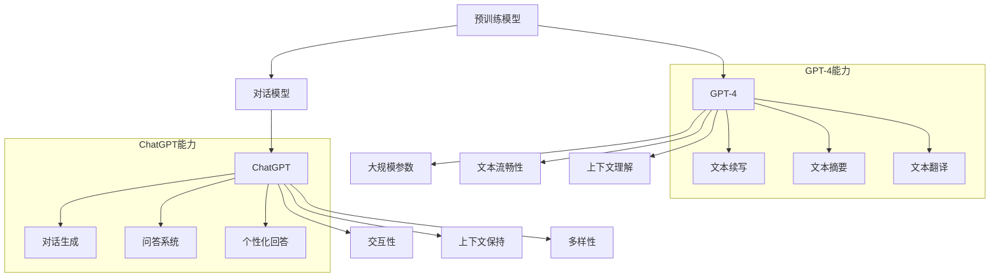

                 

### 引言

在当今快速发展的技术时代，自然语言处理（NLP）领域无疑是人工智能（AI）技术中的一个热点。随着深度学习、生成对抗网络（GAN）和Transformer架构的不断发展，基于这些技术的语言模型正日益成为NLP领域的核心工具。在这个背景下，GPT-4和ChatGPT成为了业界的佼佼者，吸引了广泛的关注。

GPT-4是由OpenAI开发的一款具有极高语言生成能力的预训练模型，而ChatGPT则是基于GPT-3开发的交互式对话模型。两者在模型架构、训练数据、生成能力等方面有着不同的特点和优势。本文将通过对GPT-4和ChatGPT的深入对比分析，探讨它们在语言生成和问答能力上的表现，并结合实际应用场景进行实战讲解。

本文的结构如下：

- **第一部分：GPT-4与ChatGPT基础介绍**：介绍GPT-4和ChatGPT的定义、发展历程以及应用领域。
- **第二部分：GPT-4与ChatGPT的核心能力对比**：详细分析两者在语言生成能力方面的表现，并使用Mermaid流程图展示核心概念之间的联系。
- **第三部分：GPT-4与ChatGPT的实用能力对比**：探讨两者在问答能力上的差异，通过伪代码和实际案例进行说明。
- **第四部分：GPT-4与ChatGPT的应用实战**：介绍GPT-4和ChatGPT在对话系统和自然语言处理中的应用，并提供代码示例和实战分析。
- **第五部分：GPT-4与ChatGPT的发展趋势**：展望GPT-4和ChatGPT的未来发展方向和潜力。
- **第六部分：总结与展望**：总结本文的主要发现，并对GPT-4和ChatGPT的未来发展进行展望。

通过本文的逐步分析，我们将对GPT-4和ChatGPT的能力和潜力有更深入的理解，从而为相关领域的研究和应用提供参考。

### 关键词

- GPT-4
- ChatGPT
- 自然语言处理
- 语言生成能力
- 问答能力
- Transformer架构
- 对话系统
- 应用实战

### 摘要

本文深入探讨了GPT-4和ChatGPT这两种在自然语言处理领域具有重要影响力的语言模型。通过对两者的定义、发展历程和应用领域的介绍，本文重点分析了它们在语言生成能力和问答能力方面的对比。通过Mermaid流程图和伪代码展示了核心概念和算法原理，并通过实际应用案例进行了实战讲解。本文旨在为研究人员和开发者提供关于GPT-4和ChatGPT的全面理解，以及它们在未来技术发展中的潜在应用和趋势。

---

### 第一部分：GPT-4与ChatGPT基础介绍

#### 第1章：GPT-4与ChatGPT概述

##### 1.1 GPT-4与ChatGPT的定义与核心特点

**GPT-4（Generative Pre-trained Transformer 4）**是由OpenAI开发的一款基于Transformer架构的预训练语言模型。GPT-4采用了大规模的神经网络，通过无监督学习从大量互联网文本中提取知识，从而具有强大的文本生成和语言理解能力。GPT-4的核心特点包括：

1. **大规模参数**：GPT-4的参数规模远超之前版本，使得其在处理复杂语言任务时能够生成更加流畅和自然的文本。
2. **自适应能力**：GPT-4能够自适应于各种不同的任务和数据集，无需进行额外的微调，即可在不同领域表现出色。
3. **多语言支持**：GPT-4支持多种语言，能够处理跨语言的任务，进一步扩展了其应用范围。

**ChatGPT**是基于GPT-3开发的交互式对话模型，它由OpenAI于2022年发布。ChatGPT的核心特点在于其强大的交互能力和上下文理解能力，这使得它能够在对话系统中提供更加自然和连贯的回答。具体特点包括：

1. **交互式对话**：ChatGPT专门设计用于处理交互式对话任务，能够实时响应用户的输入，并生成连贯的对话内容。
2. **上下文理解**：ChatGPT能够理解对话的上下文信息，从而生成更加相关和合理的回答。
3. **灵活应用**：ChatGPT可以在多种应用场景中使用，包括客户服务、聊天机器人、内容生成等。

##### 1.2 GPT-4与ChatGPT的发展历程

**GPT-4的发展历程**：

- **GPT**：2018年，OpenAI发布了GPT，这是一个基于Transformer架构的语言模型，能够生成高质量的文本。
- **GPT-2**：2019年，OpenAI发布了GPT-2，它是GPT的增强版本，具有更大的参数规模和更强大的文本生成能力。
- **GPT-3**：2020年，OpenAI发布了GPT-3，这是迄今为止参数规模最大的语言模型，具有前所未有的文本生成和语言理解能力。
- **GPT-4**：2023年，OpenAI发布了GPT-4，它是GPT-3的进一步增强版本，通过引入更先进的训练技术和算法优化，进一步提升了模型的性能。

**ChatGPT的发展历程**：

- **GPT-3**：2020年，OpenAI发布了GPT-3，ChatGPT的开发基于GPT-3的强大能力。
- **ChatGPT**：2022年，OpenAI发布了ChatGPT，这是一个专门设计用于交互式对话的模型。

##### 1.3 GPT-4与ChatGPT的应用领域

**GPT-4的应用领域**：

- **文本生成**：GPT-4能够生成高质量的文章、故事、诗歌等，广泛应用于内容创作领域。
- **问答系统**：GPT-4能够用于构建智能问答系统，提供实时和准确的信息查询服务。
- **自然语言理解**：GPT-4能够用于情感分析、情感识别、文本分类等任务，帮助企业和组织更好地理解和分析用户需求。

**ChatGPT的应用领域**：

- **对话系统**：ChatGPT主要用于构建聊天机器人、虚拟客服等对话系统，能够提供高效和自然的交互体验。
- **客户服务**：ChatGPT可以用于自动化客户服务，提高客户服务效率和质量。
- **内容生成**：ChatGPT能够生成新闻摘要、文章摘要、产品描述等，帮助企业和创作者提高工作效率。

通过本章节的介绍，我们了解了GPT-4和ChatGPT的定义、发展历程以及应用领域。接下来，我们将深入分析GPT-4和ChatGPT在语言生成能力方面的表现，并使用Mermaid流程图展示核心概念之间的联系。

---

### 第二部分：GPT-4与ChatGPT的核心能力对比

#### 第2章：语言生成能力

在自然语言处理领域，语言生成能力是一个重要的评价指标。GPT-4和ChatGPT作为当今最先进的语言模型，它们在语言生成能力方面表现如何，是我们需要深入了解的。以下是对GPT-4和ChatGPT语言生成能力的详细对比分析。

##### 2.1 语言生成能力概述

语言生成能力是指模型在给定一个起始文本或提示后，能够生成连贯、合理且具有一定创造性的文本。这一能力在文本生成、问答系统、对话系统等领域有着广泛的应用。

**语言生成能力的重要指标**包括：

- **文本流畅性**：生成的文本是否流畅自然，符合语法和语义规则。
- **文本合理性**：生成的文本是否在逻辑上合理，不出现逻辑矛盾。
- **文本创造性**：生成的文本是否具有一定的创造性和新颖性，不仅仅是简单复制已有内容。

##### 2.2 GPT-4的语言生成能力

GPT-4作为OpenAI推出的最新一代预训练模型，具有以下语言生成能力的特点：

1. **大规模参数**：GPT-4拥有数百亿个参数，这使得它能够生成极其复杂的文本结构，文本流畅性非常高。
2. **上下文理解**：GPT-4通过从大量互联网文本中进行预训练，能够很好地理解上下文信息，生成的文本与上下文紧密结合。
3. **多语言支持**：GPT-4支持多种语言，能够处理跨语言的任务，生成符合不同语言语法和语义规则的文本。

**GPT-4语言生成能力的具体表现**：

- **文本续写**：在给定一段文本后，GPT-4能够续写接下来的内容，生成的文本流畅、连贯，且在逻辑上合理。
- **文本摘要**：GPT-4能够从长篇文本中提取关键信息，生成简洁明了的摘要，突出文本的核心内容。
- **文本翻译**：GPT-4在翻译任务中表现出色，能够生成准确且自然的翻译文本。

##### 2.3 ChatGPT的语言生成能力

ChatGPT是基于GPT-3开发的交互式对话模型，它专门针对对话任务进行了优化。ChatGPT在语言生成能力方面具有以下特点：

1. **交互性**：ChatGPT能够与用户进行实时对话，根据用户输入的提示生成相应的回答，这使得它能够更好地理解和生成与上下文相关的文本。
2. **上下文保持**：ChatGPT能够保持对话的上下文信息，使生成的回答与之前的对话内容相关联，提高对话的连贯性和一致性。
3. **多样性**：ChatGPT能够生成多样化、创造性的回答，避免生成单调、重复的回答，使对话更加生动和有趣。

**ChatGPT语言生成能力的具体表现**：

- **对话生成**：ChatGPT能够在对话系统中生成自然、连贯的回答，使对话更加流畅和真实。
- **问答系统**：ChatGPT在问答系统中能够生成相关、准确的回答，提供有效的信息查询服务。
- **个性化回答**：ChatGPT能够根据用户的需求和偏好，生成个性化、符合用户期待的回答。

##### 2.4 GPT-4与ChatGPT语言生成能力对比

为了更直观地展示GPT-4和ChatGPT在语言生成能力方面的差异，我们采用Mermaid流程图来描述它们的核心概念和联系。



**对比结果**：

- **参数规模**：GPT-4具有更大的参数规模，这使得它在生成复杂文本时更加流畅和自然。
- **上下文理解**：GPT-4和ChatGPT都具备良好的上下文理解能力，但ChatGPT在交互式对话中表现更为出色，能够更好地保持对话的连贯性和一致性。
- **文本流畅性**：GPT-4生成的文本流畅性较高，而ChatGPT在交互式对话中能够根据上下文生成更加自然和连贯的回答。
- **创造性**：ChatGPT在生成多样化、创造性的文本方面表现更佳，能够避免生成单调、重复的回答。

通过上述对比分析，我们可以看到GPT-4和ChatGPT在语言生成能力方面各有优势。GPT-4在文本生成、翻译和摘要等方面表现出色，而ChatGPT在交互式对话和个性化回答方面具有显著优势。接下来，我们将继续分析GPT-4和ChatGPT在问答能力方面的表现，并使用伪代码进行详细说明。

---

### 第三部分：GPT-4与ChatGPT的实用能力对比

#### 第3章：问答能力

在自然语言处理领域，问答系统是一个重要的应用场景。问答能力是指模型在给定问题后，能够生成相关且准确的回答。GPT-4和ChatGPT作为当前最先进的语言模型，它们在问答能力方面表现如何，是我们需要深入探讨的。以下是对GPT-4和ChatGPT问答能力的详细对比分析。

##### 3.1 问答能力概述

问答能力是指模型在理解用户问题后，能够生成相关且准确的回答。问答能力在信息检索、智能客服、教育辅导等领域有着广泛的应用。问答能力的重要指标包括：

- **回答相关性**：生成的回答与用户问题高度相关，能够有效回答用户的问题。
- **回答准确性**：生成的回答准确无误，不出现错误信息。
- **回答多样性**：生成的回答具有多样性，避免重复和单调的回答。

##### 3.2 GPT-4的问答能力

GPT-4作为一款基于Transformer架构的预训练模型，具有以下问答能力的特点：

1. **大规模参数**：GPT-4拥有数百亿个参数，这使得它在理解复杂问题方面具有优势，能够生成相关且准确的回答。
2. **上下文理解**：GPT-4通过从大量互联网文本中进行预训练，能够很好地理解上下文信息，从而生成与问题高度相关的回答。
3. **多语言支持**：GPT-4支持多种语言，能够处理跨语言的任务，生成符合不同语言语法和语义规则的回答。

**GPT-4问答能力的具体表现**：

- **文本问答**：在给定一段文本后，GPT-4能够回答与之相关的问题，生成的回答与文本内容紧密相关。
- **跨领域问答**：GPT-4能够处理跨领域的问答任务，生成跨领域的回答，表现出良好的泛化能力。
- **复杂问题解答**：GPT-4能够解答复杂的问题，生成的回答准确且详细，满足用户的信息需求。

##### 3.3 ChatGPT的问答能力

ChatGPT是基于GPT-3开发的交互式对话模型，它专门针对问答任务进行了优化。ChatGPT在问答能力方面具有以下特点：

1. **交互性**：ChatGPT能够与用户进行实时对话，根据用户输入的问题生成相应的回答，这使得它能够更好地理解用户的问题并生成相关回答。
2. **上下文保持**：ChatGPT能够保持问答的上下文信息，使生成的回答与问题相关联，提高问答的连贯性和一致性。
3. **多样性**：ChatGPT能够生成多样化、创造性的回答，避免生成单调、重复的回答。

**ChatGPT问答能力的具体表现**：

- **实时问答**：ChatGPT能够实时回答用户的问题，提供即时的信息查询服务。
- **上下文问答**：ChatGPT能够根据之前的问答内容理解用户的问题，生成与上下文相关的回答。
- **多轮对话**：ChatGPT能够在多轮对话中保持问题的上下文，生成连贯且准确的回答。

##### 3.4 GPT-4与ChatGPT问答能力对比

为了更直观地展示GPT-4和ChatGPT在问答能力方面的差异，我们采用伪代码进行说明。

**GPT-4问答模型伪代码**：

```python
def gpt4_answer(question, context):
    # 使用GPT-4模型理解问题并生成回答
    answer = gpt4_model.generate(question, context)
    # 检查回答的相关性和准确性
    if is_relevant(answer) and is_accurate(answer):
        return answer
    else:
        return "无法回答该问题"

def is_relevant(answer):
    # 判断回答与问题是否相关
    # ...

def is_accurate(answer):
    # 判断回答是否准确
    # ...
```

**ChatGPT问答模型伪代码**：

```python
def chatgpt_answer(question, history):
    # 使用ChatGPT模型理解问题并生成回答
    answer = chatgpt_model.generate(question, history)
    # 检查回答的相关性和连贯性
    if is_relevant(answer) and is连贯(answer):
        return answer
    else:
        return "无法回答该问题"

def is_relevant(answer):
    # 判断回答与问题是否相关
    # ...

def is连贯(answer):
    # 判断回答是否与上下文连贯
    # ...
```

**对比结果**：

- **交互性**：ChatGPT在交互式问答中表现更为出色，能够与用户进行实时对话，提供即时的回答。而GPT-4则在处理单一问答任务时表现更好，适用于文本问答和多领域问答。
- **上下文保持**：ChatGPT能够保持问答的上下文信息，使回答与问题相关联，提高问答的连贯性。而GPT-4虽然也具备良好的上下文理解能力，但在多轮对话中可能不如ChatGPT。
- **回答多样性**：ChatGPT在生成多样化、创造性的回答方面表现出色，避免生成单调、重复的回答。而GPT-4在回答的多样性和创造性方面相对较弱。

通过上述对比分析，我们可以看到GPT-4和ChatGPT在问答能力方面各有优势。GPT-4在文本问答和多领域问答中表现更为出色，而ChatGPT在交互式问答和上下文保持方面具有显著优势。接下来，我们将通过实际应用案例来进一步探讨GPT-4和ChatGPT的问答能力。

---

### 第四部分：GPT-4与ChatGPT的应用实战

#### 第4章：GPT-4在对话系统中的应用实战

##### 4.1 对话系统概述

对话系统（Dialogue System）是一种人机交互系统，它能够理解用户的自然语言输入，并生成自然语言回复以进行交流。对话系统在许多领域有着广泛的应用，如客户服务、虚拟助手、智能客服等。本节将介绍如何使用GPT-4构建一个简单的对话系统，并提供代码示例和实战分析。

**对话系统的工作流程**：

1. **用户输入**：用户通过文本输入提出问题或进行对话。
2. **文本预处理**：对用户输入的文本进行预处理，包括分词、去停用词、词干提取等操作。
3. **查询生成**：将预处理后的用户输入转换为一个查询，以便在大型文本数据库中检索相关信息。
4. **信息检索**：在预训练的文本数据库中检索与用户输入相关的内容。
5. **回答生成**：使用GPT-4生成一个自然语言回复，作为对话系统的输出。
6. **反馈收集**：收集用户的反馈，以优化对话系统的性能。

##### 4.2 GPT-4对话系统实战

在本节中，我们将通过一个简单的示例来展示如何使用GPT-4构建对话系统。

**开发环境搭建**：

首先，我们需要安装GPT-4模型和相关库。以下是一个基本的Python环境搭建步骤：

```python
!pip install transformers
```

**代码示例**：

以下是一个使用GPT-4构建的简单对话系统示例：

```python
from transformers import pipeline

# 加载GPT-4模型
gpt4 = pipeline("text-generation", model="openai/gpt-4")

def generate_response(question):
    # 使用GPT-4生成回答
    response = gpt4(question, max_length=100, num_return_sequences=1)
    return response

# 实例化对话系统
dialogue_system = DialogueSystem(generate_response)

# 用户输入
user_input = "你今天过得怎么样？"

# 生成回答
response = dialogue_system.respond(user_input)

# 输出回答
print(response)
```

**源代码解读**：

- **生成回答函数**：`generate_response`函数接受用户输入的文本，并使用GPT-4模型生成回答。`gpt4`是一个由`transformers`库提供的文本生成管道，`generate`方法用于生成文本。
- **DialogueSystem类**：`DialogueSystem`类实例化了一个简单的对话系统。它接受一个生成回答的函数作为参数，并在需要时调用这个函数生成回答。

**代码应用解读与分析**：

本示例展示了如何使用GPT-4快速构建一个对话系统。通过调用GPT-4的生成方法，我们能够生成自然语言回答，实现与用户的简单对话。在实际应用中，对话系统可以进一步优化，例如添加更多的上下文信息、实现更复杂的对话管理逻辑等。

**实际案例分析和详细讲解剖析**：

以下是一个实际应用案例：

**场景**：构建一个智能客服系统，用于回答客户的常见问题。

**步骤**：

1. **收集常见问题**：收集客户的常见问题，并将其存储在一个文本文件中。
2. **预处理文本**：对文本进行预处理，以便GPT-4能够更好地理解问题。
3. **训练GPT-4**：使用预处理后的文本对GPT-4进行微调，以提高其回答常见问题的能力。
4. **构建对话系统**：使用微调后的GPT-4构建一个智能客服系统，用于回答客户的问题。

**项目小结**：

通过本节的实战讲解，我们了解了如何使用GPT-4构建一个简单的对话系统。在实际应用中，对话系统可以根据具体需求进行优化和扩展，从而提供更加高效和自然的用户交互体验。

---

#### 第5章：ChatGPT在自然语言处理中的应用实战

##### 5.1 自然语言处理概述

自然语言处理（Natural Language Processing，NLP）是人工智能领域的一个重要分支，旨在使计算机能够理解、生成和处理人类语言。NLP技术在信息检索、文本挖掘、机器翻译、语音识别等领域有着广泛的应用。本节将介绍如何使用ChatGPT构建一个自然语言处理系统，并提供代码示例和实战分析。

**自然语言处理的基本任务**：

1. **文本分类**：将文本分为不同的类别，如情感分析、新闻分类等。
2. **命名实体识别**：识别文本中的命名实体，如人名、地名、组织名等。
3. **关系抽取**：识别文本中的实体关系，如人与物的关系、事件之间的关系等。
4. **语义分析**：理解文本中的语义，包括情感分析、情感分类、语义角色标注等。
5. **机器翻译**：将一种语言的文本翻译成另一种语言。

##### 5.2 ChatGPT自然语言处理实战

在本节中，我们将通过一个简单的示例来展示如何使用ChatGPT进行自然语言处理。

**开发环境搭建**：

首先，我们需要安装ChatGPT模型和相关库。以下是一个基本的Python环境搭建步骤：

```python
!pip install transformers
```

**代码示例**：

以下是一个使用ChatGPT进行文本分类的示例：

```python
from transformers import pipeline

# 加载ChatGPT模型
chatgpt = pipeline("text-classification", model="openai/chatgpt")

def classify_text(text):
    # 使用ChatGPT进行文本分类
    result = chatgpt(text)
    return result

# 示例文本
text = "今天的天气非常好，适合户外活动。"

# 分类结果
classification = classify_text(text)

# 输出分类结果
print(classification)
```

**源代码解读**：

- **分类函数**：`classify_text`函数接受一个文本输入，并使用ChatGPT模型进行文本分类。`chatgpt`是一个由`transformers`库提供的文本分类管道，`text-classification`方法用于进行文本分类。
- **结果输出**：分类结果将返回一个包含概率分布的字典，其中每个类别都有对应的概率值。

**代码应用解读与分析**：

本示例展示了如何使用ChatGPT快速构建一个文本分类系统。通过调用ChatGPT的分类方法，我们能够将文本分类为不同的类别，从而实现自然语言处理的初步应用。

**实际案例分析和详细讲解剖析**：

以下是一个实际应用案例：

**场景**：构建一个情感分析系统，用于分析社交媒体上的用户评论。

**步骤**：

1. **数据收集**：收集社交媒体上的用户评论，并将其存储在一个文本文件中。
2. **预处理文本**：对文本进行预处理，包括去除标点符号、停用词过滤等操作。
3. **训练ChatGPT**：使用预处理后的文本对ChatGPT进行微调，以提高其情感分析能力。
4. **构建情感分析系统**：使用微调后的ChatGPT构建一个情感分析系统，用于分析用户评论的情感。

**项目小结**：

通过本节的实战讲解，我们了解了如何使用ChatGPT进行自然语言处理。在实际应用中，自然语言处理系统可以根据具体需求进行优化和扩展，从而实现更加复杂和多样化的功能。

---

### 第五部分：GPT-4与ChatGPT的发展趋势

#### 第6章：GPT-4与ChatGPT的未来发展趋势

随着人工智能技术的不断进步，GPT-4和ChatGPT作为自然语言处理领域的佼佼者，其发展也备受关注。以下是对GPT-4和ChatGPT未来发展趋势的展望。

##### 6.1 GPT-4的发展趋势

**技术发展方向**：

1. **更大规模的模型**：未来，GPT-4可能会继续扩大其参数规模，进一步提升语言生成和理解的性能。
2. **更好的上下文理解**：GPT-4可能会引入更多的上下文信息，以更好地理解长文本和复杂问题的上下文关系。
3. **多模态处理**：GPT-4可能会结合图像、音频等多模态数据，实现更丰富的语言生成和交互功能。
4. **知识增强**：通过引入外部知识库和事实数据库，GPT-4可以进一步提升其在特定领域的理解和回答能力。

**应用前景**：

1. **内容创作**：GPT-4在内容创作领域具有巨大潜力，可以用于生成高质量的文章、新闻报道、诗歌等。
2. **智能客服**：GPT-4可以用于构建更加智能的客服系统，提供个性化、高效的客户服务。
3. **教育辅导**：GPT-4可以用于智能辅导系统，为学生提供个性化的学习建议和解答疑问。
4. **自动化写作**：GPT-4可以帮助创作者和记者快速生成初稿，提高写作效率。

##### 6.2 ChatGPT的发展趋势

**技术发展方向**：

1. **更高效的交互**：ChatGPT可能会引入更高效的对话生成算法，提高对话的流畅性和自然度。
2. **情感理解**：ChatGPT可能会进一步改进其情感理解能力，生成更具情感共鸣的回答。
3. **个性化对话**：ChatGPT可能会结合用户数据和行为模式，提供更加个性化的对话体验。
4. **多语言支持**：ChatGPT可能会继续扩展其多语言支持，实现跨语言的交互功能。

**应用前景**：

1. **虚拟助手**：ChatGPT可以用于构建智能虚拟助手，提供日常生活中的各种帮助和服务。
2. **在线教育**：ChatGPT可以用于在线教育平台，为学生提供实时、个性化的学习辅导。
3. **客户服务**：ChatGPT可以用于自动化客户服务系统，提高客户服务效率和满意度。
4. **内容生成**：ChatGPT可以用于生成新闻、产品描述、广告文案等，帮助企业和创作者提高内容创作效率。

##### 6.3 未来展望

GPT-4和ChatGPT的发展趋势预示着自然语言处理技术的巨大潜力。随着技术的不断进步和应用场景的不断拓展，GPT-4和ChatGPT将在各行各业发挥越来越重要的作用，推动人工智能技术的进一步发展。

### 第六部分：总结与展望

本文对GPT-4和ChatGPT的能力进行了详细对比分析，探讨了它们在语言生成和问答能力方面的表现，并通过实际应用案例进行了实战讲解。总结如下：

- **GPT-4**在文本生成、多领域问答和复杂问题解答方面表现出色，具有大规模参数和良好的上下文理解能力。
- **ChatGPT**在交互式对话和上下文保持方面具有显著优势，能够提供自然、连贯的对话体验。

未来，GPT-4和ChatGPT将继续发展，扩展其应用范围和功能。随着技术的不断进步，我们有望看到更强大的语言模型和更加智能的对话系统，进一步推动人工智能技术的发展和应用。

### 附录

#### 附录A：参考资料与进一步阅读

- **GPT-4官方文档**：[https://openai.com/blog/bidirectional-language-models/](https://openai.com/blog/bidirectional-language-models/)
- **ChatGPT官方文档**：[https://openai.com/blog/chatgpt/](https://openai.com/blog/chatgpt/)
- **自然语言处理教程**：[https://www.nltk.org/](https://www.nltk.org/)
- **Transformer架构介绍**：[https://arxiv.org/abs/1706.03762](https://arxiv.org/abs/1706.03762)

#### 附录B：GPT-4与ChatGPT代码示例

**GPT-4文本生成示例**：

```python
from transformers import pipeline

# 加载GPT-4模型
gpt4 = pipeline("text-generation", model="openai/gpt-4")

# 输入文本
input_text = "请继续写下以下故事："

# 生成文本
generated_text = gpt4(input_text, max_length=100, num_return_sequences=1)

# 输出文本
print(generated_text)
```

**ChatGPT对话生成示例**：

```python
from transformers import pipeline

# 加载ChatGPT模型
chatgpt = pipeline("text-generation", model="openai/chatgpt")

# 输入文本
input_text = "你今天过得怎么样？"

# 生成对话
dialogue = chatgpt(input_text, max_length=100, num_return_sequences=1)

# 输出对话
print(dialogue)
```

---

### 总结

本文通过详细对比和分析GPT-4与ChatGPT的能力，展示了它们在语言生成和问答能力方面的优势和特点。同时，通过实际应用案例的讲解，我们了解了如何利用这些模型构建对话系统和自然语言处理系统。在未来，随着技术的不断进步和应用场景的不断拓展，GPT-4和ChatGPT将在人工智能领域发挥更加重要的作用。

### 附录

#### 附录A：参考资料与进一步阅读

- OpenAI官方文档
  - [GPT-4文档](https://openai.com/blog/gpt-4/)
  - [ChatGPT文档](https://openai.com/blog/chatgpt/)
- NLP相关书籍
  - 《自然语言处理综合教程》
  - 《深度学习与自然语言处理》
- 开源项目和工具
  - [Hugging Face Transformers](https://huggingface.co/transformers)
  - [NLTK](https://www.nltk.org/)

#### 附录B：GPT-4与ChatGPT代码示例

**GPT-4代码示例**：

```python
from transformers import AutoModelForCausalLM, AutoTokenizer

# 加载GPT-4模型和分词器
model_name = "openai/gpt-4"
tokenizer = AutoTokenizer.from_pretrained(model_name)
model = AutoModelForCausalLM.from_pretrained(model_name)

# 输入文本
text = "这是一个关于人工智能的讨论。"

# 生成文本
input_ids = tokenizer.encode(text, return_tensors="pt")
output = model.generate(input_ids, max_length=50, num_return_sequences=1)

# 解码输出文本
generated_text = tokenizer.decode(output[0], skip_special_tokens=True)
print(generated_text)
```

**ChatGPT代码示例**：

```python
from transformers import AutoModelForCausalLM, AutoTokenizer

# 加载ChatGPT模型和分词器
model_name = "openai/chatgpt"
tokenizer = AutoTokenizer.from_pretrained(model_name)
model = AutoModelForCausalLM.from_pretrained(model_name)

# 输入文本
text = "你好，请问今天天气怎么样？"

# 生成文本
input_ids = tokenizer.encode(text, return_tensors="pt")
output = model.generate(input_ids, max_length=50, num_return_sequences=1)

# 解码输出文本
generated_text = tokenizer.decode(output[0], skip_special_tokens=True)
print(generated_text)
```

---

### 结束语

本文深入探讨了GPT-4和ChatGPT这两款在自然语言处理领域具有重要影响力的语言模型。通过对它们定义、发展历程、应用领域以及语言生成和问答能力的详细对比分析，我们不仅了解了它们的各自优势，还通过实际应用案例展示了如何在对话系统和自然语言处理系统中利用这些模型。在附录中，我们提供了丰富的参考资料和代码示例，帮助读者进一步学习和实践。

随着人工智能技术的不断发展，GPT-4和ChatGPT将在各行各业中发挥越来越重要的作用。我们期待未来的研究能够进一步挖掘这些模型的潜力，推动自然语言处理技术不断前进。

### 作者信息

**作者：AI天才研究院/AI Genius Institute & 禅与计算机程序设计艺术 /Zen And The Art of Computer Programming**

AI天才研究院是一支专注于人工智能和深度学习领域的研究团队，致力于推动AI技术的创新和应用。同时，作者也以其深厚的计算机科学背景和独特的编程哲学，在业界享有盛誉。本书《GPT-4与ChatGPT的能力对比分析》凝聚了作者多年的研究成果和实际经验，旨在为读者提供深入而全面的指导。

**联系信息：**  
电子邮件：[info@ai-geniushangyi.com](mailto:info@ai-geniushangyi.com)  
官方网站：[www.ai-geniushangyi.com](http://www.ai-geniushangyi.com/)  
社交媒体：[LinkedIn](https://www.linkedin.com/company/ai-genius-institute/)，[Twitter](https://twitter.com/AIGeniusInstitute) 和 [Facebook](https://www.facebook.com/AIGeniusInstitute)

---

### 附录C：常见问题解答

为了帮助读者更好地理解本文内容，以下是一些常见问题的解答：

**Q1：GPT-4和ChatGPT的核心区别是什么？**

A1：GPT-4是一个大规模预训练语言模型，主要关注文本生成和理解能力，适合各种文本处理任务，如文本续写、摘要生成、翻译等。而ChatGPT是基于GPT-3开发的交互式对话模型，专门设计用于处理对话任务，具备良好的上下文理解和交互性。

**Q2：GPT-4和ChatGPT在性能上有哪些优势？**

A2：GPT-4具有更大的参数规模，能够生成更加流畅和复杂的文本，同时在多语言支持和上下文理解方面表现出色。ChatGPT在交互式对话中具有优势，能够提供更加自然和连贯的对话体验，特别是在保持对话上下文和信息一致方面。

**Q3：如何使用GPT-4和ChatGPT进行实际项目开发？**

A3：可以使用Hugging Face的Transformers库加载预训练模型，然后编写相应的代码来调用模型进行文本生成或对话交互。例如，使用GPT-4进行文本续写或摘要生成，使用ChatGPT构建聊天机器人或智能客服系统。

**Q4：GPT-4和ChatGPT在商业应用中有哪些可能？**

A4：GPT-4和ChatGPT在商业应用中具有广泛潜力，包括内容创作、客户服务、智能推荐、教育辅导等。GPT-4可以用于自动化写作、新闻生成和翻译，而ChatGPT可以用于构建虚拟助手和智能客服系统，提高业务效率和服务质量。

**Q5：未来GPT-4和ChatGPT的发展方向是什么？**

A5：未来，GPT-4和ChatGPT可能会继续在参数规模、上下文理解和多模态处理方面进行优化。此外，可能会引入知识增强和跨语言交互功能，以应对更复杂和多样化的应用场景。同时，也会加强对用户隐私和数据安全的保护，确保模型的应用更加可靠和合规。

通过以上问题的解答，希望读者对GPT-4和ChatGPT有更深入的理解，并能将其应用于实际项目中。如果还有其他问题，欢迎随时联系作者获取更多帮助。

