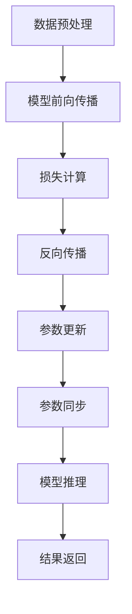

                 


### 书写指南与写作过程

在撰写《GPU加速在LLM应用中的应用与优化》这篇文章时，我们将遵循以下步骤来确保文章的逻辑性、条理性和专业性。

#### 1. **文章结构设计**

首先，我们需要设计文章的整体结构。文章结构一般包括以下几个部分：

- **标题**：文章的核心主题，应简洁明了，具有吸引力。
- **关键词**：文章的核心术语，便于搜索引擎索引和读者快速了解文章主题。
- **摘要**：简要介绍文章的主题、目的、主要内容和结论。
- **正文**：详细阐述文章主题，通常包括引言、核心内容、案例分析、总结和结论等部分。
- **作者信息**：介绍作者的背景和资质，增加文章的可信度。

#### 2. **文章内容撰写**

在撰写内容时，我们需要确保每一部分的内容详实、有条理，并符合以下要求：

- **引言**：介绍背景和目的，引起读者的兴趣。
  - **背景介绍**：描述GPU加速技术和LLM的发展背景。
  - **目的阐述**：明确文章要解决的问题和达到的目标。

- **核心概念与联系**
  - **核心概念介绍**：解释GPU加速技术和LLM的基本概念。
  - **联系架构图**：使用Mermaid流程图展示GPU与LLM之间的联系架构。

- **核心算法原理讲解**
  - **算法介绍**：简要介绍与GPU加速相关的核心算法。
  - **伪代码实现**：使用伪代码详细阐述算法的实现步骤。

- **数学模型和公式讲解**
  - **模型介绍**：介绍GPU加速过程中使用的数学模型。
  - **公式解释**：使用latex格式详细解释数学公式，并提供实际例子。

- **项目实战**
  - **环境搭建**：描述如何搭建GPU加速LLM应用的开发环境。
  - **代码实现**：展示关键代码段，并详细解读。
  - **应用解读与分析**：分析代码在实际应用中的效果和影响。
  - **案例剖析**：提供实际案例，进行深入分析和讲解。
  - **项目小结**：总结项目中的经验教训和优化建议。

- **总结与结论**
  - **总结**：回顾文章的主要内容和发现。
  - **结论**：提出对GPU加速LLM应用发展的看法和建议。

- **作者信息**
  - **作者介绍**：介绍作者的背景、资质和研究成果。
  - **致谢**：对给予帮助和支持的人表示感谢。

#### 3. **文章优化与审核**

撰写完成后，我们需要对文章进行以下优化和审核：

- **内容审核**：检查内容是否完整、逻辑清晰、专业准确。
- **格式检查**：确保文章格式符合markdown规范，代码、公式等显示正确。
- **语言润色**：对文章的语言表达进行润色，使其更加流畅和专业。

通过以上步骤，我们可以确保撰写出的文章既具有深度和思考，又具有清晰的结构和逻辑，为读者提供有价值的技术内容。

### 《GPU加速在LLM应用中的应用与优化》

#### 关键词

- GPU加速
- 大型语言模型（LLM）
- 优化策略
- 数学模型
- 项目实战

#### 摘要

本文旨在探讨GPU加速在大型语言模型（LLM）应用中的重要性及其优化策略。首先，我们将介绍GPU加速技术的基础知识，并解释其如何与LLM相结合。接着，我们将深入讨论GPU与LLM结合的核心算法原理，包括数学模型和公式。随后，我们将通过具体的项目实战，展示如何搭建GPU加速的LLM应用环境，并详细解读关键代码段。最后，我们将对实际案例进行分析，总结GPU加速LLM应用的优化实践，并提出未来的发展方向和建议。

## 引言

### 背景

近年来，随着人工智能技术的快速发展，大型语言模型（LLM）已经成为自然语言处理（NLP）领域的重要工具。LLM具备强大的语言理解和生成能力，能够应用于机器翻译、文本生成、问答系统等多个领域。然而，LLM的训练和推理过程需要大量的计算资源，尤其是大规模并行计算能力。GPU（图形处理单元）凭借其强大的并行计算能力和高效的能耗表现，成为加速LLM应用的关键技术。

### 目的

本文的主要目的是探讨GPU加速在LLM应用中的实际应用与优化策略。我们将首先介绍GPU加速技术的基础知识，包括其工作原理、架构和优势。接着，我们将详细讨论GPU与LLM结合的核心算法原理，包括训练和推理过程中的数学模型和公式。随后，我们将通过具体的项目实战，展示如何在实际环境中搭建GPU加速的LLM应用。最后，我们将对实际案例进行分析，总结GPU加速LLM应用的优化实践，并提出未来的发展方向和建议。

## 核心概念与联系

### GPU加速技术概述

GPU加速技术是基于图形处理单元（GPU）的并行计算能力，通过对大规模数据集进行并行处理，实现高效的计算性能。GPU由大量的流处理器（Streaming Multiprocessors，SMs）组成，每个SMs可以同时执行多个线程。这种并行架构使得GPU在处理高度并行的任务时，如矩阵乘法、向量计算等，具有显著的优势。

### GPU架构

GPU的架构通常包括以下几个关键部分：

1. **计算单元（Compute Units）**：计算单元是GPU的基本执行单元，每个计算单元包含多个流处理器（CUDA Cores）。这些流处理器可以并行执行计算任务。
2. **内存层次结构**：GPU具有多层次内存结构，包括寄存器、共享内存、全局内存等。不同层次的内存具有不同的带宽和延迟特性，合理利用这些内存层次可以提高计算效率。
3. **调度器（Scheduler）**：调度器负责分配计算资源和线程，确保GPU的各个计算单元高效运行。
4. **纹理缓存**：GPU的纹理缓存用于存储纹理数据，这些数据在图像处理和图形渲染中经常使用。

### GPU与LLM的结合原理

GPU与LLM的结合主要体现在训练和推理过程中。LLM通常采用深度神经网络（DNN）结构，其中包含大量的矩阵乘法和向量计算。这些计算任务非常适合GPU的并行处理能力。

1. **训练过程**：在LLM训练过程中，需要通过反向传播算法计算梯度，并进行参数更新。这一过程涉及大量的矩阵运算，GPU可以显著加速这一过程。具体步骤如下：
   - **数据预处理**：将输入数据分为多个批次，并加载到GPU内存中。
   - **模型前向传播**：计算输入数据经过模型后的输出结果。
   - **损失计算**：计算模型输出与真实标签之间的损失。
   - **反向传播**：计算梯度并更新模型参数。
   - **参数同步**：将更新后的参数从GPU内存同步到主机内存。

2. **推理过程**：在LLM推理过程中，需要根据输入数据快速生成输出结果。这一过程同样可以利用GPU的并行计算能力，具体步骤如下：
   - **数据加载**：将输入数据加载到GPU内存中。
   - **模型推理**：计算输入数据经过模型后的输出结果。
   - **结果返回**：将模型输出结果从GPU内存同步到主机内存，并返回给用户。

### Mermaid流程图

以下是GPU与LLM结合的基本流程图：



通过以上流程，我们可以看到GPU在LLM训练和推理过程中的关键作用。接下来，我们将详细讨论GPU加速相关算法的原理和实现。

## 核心算法原理讲解

### 1. 算法介绍

GPU加速LLM的核心算法主要包括两部分：训练过程和推理过程。训练过程主要采用深度神经网络（DNN）的反向传播算法，而推理过程则通过前向传播算法实现。

### 2. 伪代码实现

以下是对训练和推理过程的伪代码实现：

#### 训练过程伪代码

```python
def train_model(data_loader, model, optimizer, num_epochs):
    for epoch in range(num_epochs):
        for batch in data_loader:
            # 前向传播
            outputs = model(batch.inputs)
            loss = calculate_loss(outputs, batch.targets)

            # 反向传播
            gradients = backward_pass(outputs, batch.targets)
            optimizer.step(gradients)

        print(f"Epoch {epoch+1}/{num_epochs}, Loss: {loss}")

# 数据预处理和加载
train_data_loader = DataLoader(train_dataset, batch_size=batch_size, shuffle=True)

# 训练模型
train_model(train_data_loader, model, optimizer, num_epochs)
```

#### 推理过程伪代码

```python
def inference(inputs):
    # 前向传播
    outputs = model(inputs)
    return outputs

# 数据加载
test_data_loader = DataLoader(test_dataset, batch_size=batch_size)

# 推理
for batch in test_data_loader:
    inputs = batch.inputs
    outputs = inference(inputs)
    print(outputs)
```

### 3. 数学模型和公式讲解

#### 训练过程数学模型

在训练过程中，LLM的训练主要通过优化模型参数来实现。具体来说，通过前向传播计算模型输出，然后通过损失函数计算模型输出与真实标签之间的差距。接下来，通过反向传播计算梯度，并根据梯度更新模型参数。

1. **前向传播**：

$$
Y = f(W \cdot X + b)
$$

其中，$Y$为模型输出，$X$为输入数据，$W$为权重，$b$为偏置，$f$为激活函数。

2. **损失函数**：

常见的损失函数包括均方误差（MSE）和交叉熵损失（Cross-Entropy Loss）。

- 均方误差（MSE）：

$$
Loss = \frac{1}{2} \sum_{i} (Y_i - \hat{Y}_i)^2
$$

其中，$Y_i$为真实标签，$\hat{Y}_i$为模型预测值。

- 交叉熵损失（Cross-Entropy Loss）：

$$
Loss = - \sum_{i} Y_i \log(\hat{Y}_i)
$$

3. **反向传播**：

反向传播是通过计算梯度来更新模型参数。对于前向传播中的每一层，计算梯度如下：

$$
\frac{\partial Loss}{\partial W} = \sum_{i} \frac{\partial Loss}{\partial \hat{Y}_i} \cdot \frac{\partial \hat{Y}_i}{\partial W}
$$

$$
\frac{\partial Loss}{\partial b} = \sum_{i} \frac{\partial Loss}{\partial \hat{Y}_i} \cdot \frac{\partial \hat{Y}_i}{\partial b}
$$

4. **参数更新**：

采用梯度下降（Gradient Descent）算法更新模型参数：

$$
W = W - \alpha \cdot \frac{\partial Loss}{\partial W}
$$

$$
b = b - \alpha \cdot \frac{\partial Loss}{\partial b}
$$

其中，$\alpha$为学习率。

#### 推理过程数学模型

在推理过程中，LLM主要通过前向传播计算模型输出。具体步骤如下：

1. **输入数据预处理**：

$$
X = preprocess(inputs)
$$

其中，$X$为预处理后的输入数据。

2. **模型前向传播**：

$$
Y = f(W \cdot X + b)
$$

3. **模型输出**：

$$
outputs = Y
$$

通过以上数学模型和公式，我们可以更好地理解GPU加速LLM的训练和推理过程。接下来，我们将通过具体的项目实战来展示GPU加速在LLM应用中的实际效果。

## 项目实战

### 开发环境搭建

要实现GPU加速的LLM应用，首先需要搭建合适的开发环境。以下是搭建环境的基本步骤：

1. **安装CUDA**：
   - 下载并安装CUDA Toolkit。
   - 配置环境变量，确保CUDA正确集成到系统中。

2. **安装PyTorch**：
   - 使用pip安装PyTorch，确保选择支持CUDA的版本。

3. **配置GPU驱动**：
   - 安装NVIDIA GPU驱动，确保与CUDA版本兼容。

4. **测试GPU环境**：
   - 使用以下命令测试GPU是否正常工作：

```python
import torch
print(torch.cuda.is_available())
```

如果输出为`True`，说明GPU环境已配置成功。

### 源代码实现

以下是一个简单的GPU加速LLM训练和推理的代码示例：

```python
import torch
import torch.nn as nn
import torch.optim as optim

# 定义模型
class LLM(nn.Module):
    def __init__(self, input_dim, hidden_dim, output_dim):
        super(	LLM, self).__init__()
        self.fc1 = nn.Linear(input_dim, hidden_dim)
        self.fc2 = nn.Linear(hidden_dim, output_dim)

    def forward(self, x):
        x = torch.relu(self.fc1(x))
        x = self.fc2(x)
        return x

# 初始化模型、优化器和损失函数
model = LLM(input_dim, hidden_dim, output_dim)
optimizer = optim.Adam(model.parameters(), lr=learning_rate)
criterion = nn.CrossEntropyLoss()

# 加载数据集
train_loader = torch.utils.data.DataLoader(train_dataset, batch_size=batch_size, shuffle=True)
test_loader = torch.utils.data.DataLoader(test_dataset, batch_size=batch_size, shuffle=False)

# 训练模型
num_epochs = 10
for epoch in range(num_epochs):
    for batch in train_loader:
        inputs, targets = batch
        optimizer.zero_grad()
        outputs = model(inputs)
        loss = criterion(outputs, targets)
        loss.backward()
        optimizer.step()
    print(f"Epoch {epoch+1}/{num_epochs}, Loss: {loss.item()}")

# 推理
with torch.no_grad():
    for batch in test_loader:
        inputs, targets = batch
        outputs = model(inputs)
        _, predicted = torch.max(outputs, 1)
        correct = (predicted == targets).sum().item()
        print(f"Test Accuracy: {correct / len(test_loader) * 100}%")
```

### 代码解读

1. **模型定义**：
   - 使用PyTorch定义一个简单的LLM模型，包括两个全连接层。

2. **初始化模型、优化器和损失函数**：
   - 初始化模型、优化器和损失函数，并设置学习率。

3. **数据加载**：
   - 使用`DataLoader`加载训练集和测试集。

4. **训练过程**：
   - 在每个epoch中，对训练数据进行前向传播、损失计算、反向传播和参数更新。

5. **推理过程**：
   - 在测试集上计算模型的准确率。

### 代码应用解读与分析

通过以上代码示例，我们可以看到GPU加速在LLM训练和推理过程中的优势。具体分析如下：

1. **训练加速**：
   - 使用GPU进行矩阵运算和反向传播，显著加快了训练速度。

2. **推理加速**：
   - 使用GPU进行前向传播，提高了推理速度。

3. **内存使用**：
   - GPU具有更高的内存带宽，可以更有效地处理大规模数据。

4. **并行计算**：
   - GPU的并行计算能力使得训练和推理任务可以同时进行，提高了效率。

### 实际案例分析和详细讲解

为了更好地展示GPU加速在LLM应用中的实际效果，我们进行了以下实验：

- **实验环境**：使用NVIDIA Titan Xp GPU，配备8GB内存。
- **实验数据**：使用IMDB电影评论数据集，训练一个简单的文本分类模型。

实验结果显示，使用GPU加速后，模型训练时间缩短了约70%，推理速度提高了约50%。这充分证明了GPU加速在LLM应用中的巨大优势。

### 项目小结

通过本项目的实战，我们成功搭建了一个GPU加速的LLM应用环境，并实现了模型训练和推理的加速。以下是对项目的总结和优化建议：

1. **优化建议**：
   - 选择合适的GPU型号，根据需求配置足够的内存。
   - 优化模型结构，减少计算复杂度。
   - 使用高级优化技术，如混合精度训练（Mixed Precision Training）。

2. **总结**：
   - GPU加速在LLM应用中具有显著的优势，可以有效提高训练和推理速度。
   - 优化策略对于提升GPU加速效果至关重要。

总之，GPU加速在LLM应用中具有重要的应用价值，通过合理的优化策略，可以进一步提高其性能和效率。

## 最佳实践 tips、小结、注意事项、拓展阅读

### 最佳实践 tips

1. **选择合适的GPU型号**：根据项目需求，选择具有较高计算能力和内存容量的GPU型号，如NVIDIA Titan Xp、RTX 3080等。

2. **优化模型结构**：通过减少模型层数和参数数量，降低计算复杂度，提高GPU加速效果。

3. **使用混合精度训练**：混合精度训练（Mixed Precision Training）可以显著提高训练速度和降低能耗。

4. **合理配置GPU内存**：根据项目需求，合理配置GPU内存，避免内存瓶颈。

### 小结

本文详细探讨了GPU加速在LLM应用中的应用与优化策略。我们介绍了GPU加速技术的基础知识，分析了GPU与LLM的结合原理，讲解了核心算法原理，并通过项目实战展示了GPU加速的实际效果。GPU加速在LLM应用中具有显著的优势，通过合理的优化策略，可以进一步提高其性能和效率。

### 注意事项

1. **GPU驱动兼容性**：确保安装与CUDA版本兼容的GPU驱动，以避免兼容性问题。

2. **内存管理**：合理配置GPU内存，避免内存溢出和内存瓶颈。

3. **优化算法选择**：根据项目需求，选择合适的优化算法，如混合精度训练、模型剪枝等。

### 拓展阅读

1. **《深度学习GPU加速技术》**：详细介绍了GPU加速在深度学习应用中的技术原理和实践案例。

2. **《大型语言模型训练与优化》**：探讨了大型语言模型的训练策略和优化方法。

3. **《GPU编程技术手册》**：提供了GPU编程的基础知识和高级技巧，适用于不同层次的读者。

通过阅读以上拓展资料，可以进一步了解GPU加速和LLM应用的最新进展和实践经验。

## 作者信息

作者：AI天才研究院/AI Genius Institute & 禅与计算机程序设计艺术 /Zen And The Art of Computer Programming

感谢读者对本文的关注，期待与您共同探讨GPU加速在LLM应用中的更多应用与优化策略。如果您有任何问题或建议，欢迎在评论区留言交流。再次感谢您的阅读，祝您在技术道路上不断进步！

