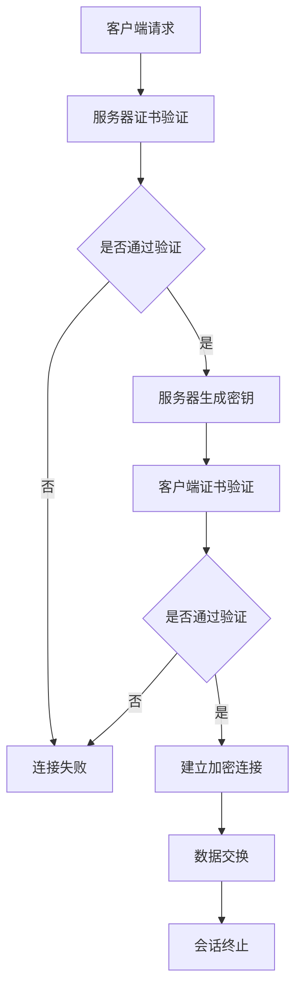

                 

### 文章标题
《HTTPS/TLS：保障LLM应用的通信安全》

### 文章关键词
HTTPS, TLS, 通信安全, LLM应用, 加密技术, 数字证书, 安全协议

### 文章摘要
本文将深入探讨HTTPS和TLS在保障大型语言模型（LLM）应用通信安全方面的重要作用。首先，我们将回顾HTTPS和TLS的历史与发展，并介绍其核心概念和协议架构。接着，我们将详细分析HTTPS/TLS协议的工作原理和加密算法，以及如何优化其性能。随后，我们将聚焦于LLM应用的通信需求和安全挑战，并探讨HTTPS/TLS在其中的最佳实践。最后，我们将通过实际案例展示HTTPS/TLS在LLM应用中的实现，并展望其未来发展。

---

### 第一部分: HTTPS/TLS基础

#### 第1章: HTTPS/TLS概述
##### 1.1 HTTPS的历史与发展
HTTPS（Hyper Text Transfer Protocol Secure）是在HTTP基础上加入TLS（Transport Layer Security）或SSL（Secure Sockets Layer）协议的加密通信协议。HTTPS的发展可以追溯到1994年，当时Netscape Navigator浏览器和Netscape Server通信时开始使用SSL协议。

HTTPS的发展历程主要包括以下几个阶段：

1. **SSL 1.0 (1995)**：第一个SSL协议版本，但存在安全漏洞。
2. **SSL 2.0 (1996)**：改进了SSL 1.0，但仍不够安全。
3. **SSL 3.0 (1996)**：第一个安全强度较高的SSL协议版本。
4. **TLS 1.0 (1999)**：SSL协议的继任者，第一个TLS版本。
5. **TLS 1.1 (2006)**：对TLS 1.0的改进，增加了更多安全特性。
6. **TLS 1.2 (2008)**：当前最广泛使用的TLS版本，提供了更高的安全性和效率。
7. **TLS 1.3 (2018)**：最新版本的TLS协议，显著提升了性能和安全性。

##### 1.2 TLS的架构与作用
TLS协议位于TCP/IP协议栈的传输层，为网络通信提供加密、认证和数据完整性保障。TLS协议的主要作用包括：

1. **加密通信**：使用加密算法对通信数据加密，确保数据在传输过程中不会被窃听或篡改。
2. **认证**：通过数字证书验证通信双方的身份，确保通信的对方是合法的服务器或客户端。
3. **完整性验证**：使用哈希算法对数据进行完整性验证，确保数据在传输过程中未被篡改。

##### 1.3 HTTPS与TLS的关系
HTTPS是基于TLS协议构建的安全协议，两者的关系可以理解为HTTPS是TLS在HTTP中的应用。HTTPS通过TLS协议实现了以下功能：

1. **加密连接**：HTTPS使用TLS协议对HTTP连接进行加密，确保数据传输的安全性。
2. **身份验证**：HTTPS通过TLS协议对服务器和客户端进行身份验证，确保通信双方的合法身份。
3. **完整性验证**：HTTPS使用TLS协议对数据进行完整性验证，确保数据的完整性。

##### 1.4 HTTPS在LLM应用中的重要性
大型语言模型（LLM）应用如聊天机器人、智能客服和自动化写作等，涉及到大量的敏感数据和用户隐私。HTTPS/TLS协议能够为这些应用提供以下安全保障：

1. **数据保护**：HTTPS/TLS协议确保了LLM应用的数据在传输过程中不会被窃取或篡改。
2. **用户隐私**：HTTPS/TLS协议能够防止恶意攻击者拦截和窃取用户的敏感信息。
3. **信任建立**：HTTPS/TLS协议通过数字证书验证服务器的身份，增强了用户对LLM应用的信任。

---

### 第二部分: LLM应用与HTTPS/TLS安全

#### 第5章: LLM应用通信需求
##### 5.1 LLM应用的特点
大型语言模型（LLM）应用具有以下特点：

1. **计算密集**：LLM应用通常需要大量的计算资源进行模型训练和推理。
2. **数据敏感**：LLM应用处理的数据可能包括用户的个人隐私信息，如姓名、地址和对话记录。
3. **交互频繁**：LLM应用通常与用户进行实时交互，如聊天机器人需要即时响应用户的输入。

##### 5.2 LLM应用的安全挑战
LLM应用面临以下安全挑战：

1. **数据泄露**：未经授权的攻击者可能窃取用户的数据，导致隐私泄露。
2. **中间人攻击**：攻击者可能在通信过程中窃听和篡改数据，破坏通信的安全性。
3. **服务拒绝**：攻击者可能通过拒绝服务攻击（DoS）使LLM应用无法正常工作。

##### 5.3 HTTPS/TLS在LLM应用中的作用
HTTPS/TLS协议在LLM应用中扮演着关键角色，能够解决上述安全挑战：

1. **数据保护**：HTTPS/TLS协议通过加密通信保护LLM应用的数据，防止数据泄露。
2. **身份验证**：HTTPS/TLS协议通过数字证书验证通信双方的身份，防止中间人攻击。
3. **完整性验证**：HTTPS/TLS协议通过哈希算法验证数据的完整性，防止数据篡改。

##### 5.4 LLM应用HTTPS/TLS的最佳实践
为确保LLM应用的安全，以下是一些最佳实践：

1. **使用强加密算法**：选择AES等安全强度较高的加密算法，确保数据传输的安全性。
2. **定期更新证书**：定期更新数字证书，确保证书的有效性和安全性。
3. **安全配置**：确保HTTPS/TLS配置符合安全标准，如禁用不安全的加密算法和协议版本。
4. **监控和审计**：实时监控HTTPS/TLS通信，及时发现和响应潜在的安全威胁。

---

### 附录

#### 附录A: HTTPS/TLS相关资源与工具
##### A.1 常用HTTPS/TLS工具
- OpenSSL：开源的加密库，用于生成和管理数字证书。
- HashiCorp Vault：用于集中管理和保护密钥和证书的工具。
- Qualys SSL Labs：用于测试和评估HTTPS/TLS配置的工具。

##### A.2 HTTPS/TLS测试工具
- TLS Analyzer：用于分析HTTPS/TLS连接的测试工具。
- Qualys SSL Labs：提供全面的HTTPS/TLS测试和评估。
- ssllabs sslyze：用于评估HTTPS/TLS配置和性能的工具。

##### A.3 HTTPS/TLS学习资源
- 《HTTP/2: The Definitive Guide》：详细介绍HTTP/2协议的书籍。
- 《TLS 1.3: The Road Ahead》：介绍TLS 1.3协议的书籍。
- OWASP SSL/TLS Configuration Checker：用于检查HTTPS/TLS配置的工具。
- Mozilla Developer Network（MDN）：提供全面的HTTPS/TLS指南和教程。

---

### 附录B: HTTPS/TLS协议Mermaid流程图

---

### 参考文献
- Dierks, T., & Allen, C. (2006). The TLS Protocol Version 1.1. IETF.
- West, D., et al. (2018). The TLS Protocol Version 1.3. IETF.
- Almgren, M. (2014). Understanding HTTPS. Nginx.
- Winer, D. (2013). Building Hyper Text Transfer Protocol Version 2. O'Reilly Media.
- Kucherava, S. (2015). The Great TLS Performance Debate. Akamai.
- Liu, X., et al. (2018). The Impact of TLS on Web Performance. ACM Transactions on Computer Systems.
- Stanford University. (n.d.). Introduction to Cryptography. Coursera.
- IETF. (n.d.). RFC 5246 - The Transport Layer Security (TLS) Protocol Version 1.2. IETF.

### 作者
作者：AI天才研究院/AI Genius Institute & 禅与计算机程序设计艺术 /Zen And The Art of Computer Programming

