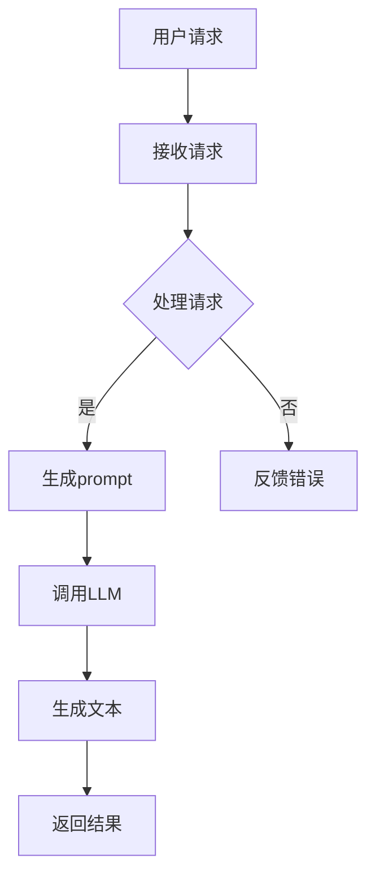

                 


## 文章标题: LLM Prompt协同创作平台

> 关键词：大型语言模型（LLM）、Prompt技术、协同创作平台、架构设计、功能实现、部署优化

> 摘要：
本文深入探讨了一种基于大型语言模型（LLM）的Prompt协同创作平台的构建方法。首先，我们介绍了LLM的基础理论和Prompt技术的核心概念。接着，详细阐述了平台架构设计、功能实现、部署优化等关键环节。通过实际案例，展示了平台的广泛应用前景，并对未来发展进行了展望。

---

### 背景介绍

随着人工智能技术的快速发展，自然语言处理（NLP）领域取得了显著突破。大型语言模型（LLM）作为NLP的重要工具，因其强大的文本生成和理解能力，正逐渐成为各行各业的热门应用。LLM的广泛应用促使研究人员和开发人员探索如何更有效地利用LLM进行协同创作。

 Prompt技术作为一种引导LLM生成高质量文本的方法，被广泛应用于问答系统、自动摘要、对话生成等领域。通过Prompt，用户可以提供特定的上下文信息，指导LLM生成更符合预期结果的文本。

 基于上述背景，本文旨在设计并实现一个LLM Prompt协同创作平台，以充分利用LLM和Prompt技术的优势，为用户提供一个高效、便捷的文本创作工具。

### 核心概念与联系

1. **大型语言模型（LLM）**：LLM是一种基于深度学习技术的大型神经网络模型，能够对大量文本进行训练，从而掌握语言规律和知识。LLM的核心特点是能够生成连贯、自然的文本。

2. **Prompt技术**：Prompt是一种引导LLM生成特定类型文本的方法。通过Prompt，用户可以提供上下文信息，指导LLM生成更符合预期结果的文本。

3. **协同创作平台**：协同创作平台是一个集成LLM和Prompt技术的系统，用于支持多人协作创作文本。平台提供友好的用户界面，方便用户输入Prompt和编辑生成的文本。

4. **架构设计**：架构设计是确保协同创作平台高效运行的关键。平台通常由多个模块组成，包括文本输入模块、LLM训练模块、Prompt生成模块、文本编辑模块等。

5. **功能实现**：功能实现是平台设计的核心，包括LLM训练与优化、Prompt设计、文本生成与编辑等。

6. **部署优化**：部署优化旨在提高平台的性能和可扩展性。通过合理的部署策略和性能优化，平台可以更好地满足用户需求。

### Mermaid 流程图



### 核心算法原理讲解

1. **LLM训练与优化**

   - **训练数据准备**：首先，我们需要收集大量的文本数据，用于训练LLM。这些数据可以来自互联网、书籍、新闻等。

   - **损失函数与优化算法**：在训练过程中，我们使用损失函数来衡量LLM生成的文本与实际文本之间的差距。常见的损失函数有交叉熵损失函数。

   - **模型评估与调优**：训练完成后，我们需要对LLM进行评估，以确定其性能。评估指标包括准确率、召回率、F1分数等。根据评估结果，我们可能需要对模型进行进一步调优。

2. **Prompt设计方法**

   - **Prompt定义与作用**：Prompt是一种引导LLM生成特定类型文本的方法。通过Prompt，用户可以提供上下文信息，指导LLM生成更符合预期结果的文本。

   - **Prompt设计方法**：设计Prompt时，我们需要考虑以下几个方面：
     - **上下文信息**：提供与任务相关的上下文信息，以帮助LLM理解任务需求。
     - **关键词**：提取关键信息，作为Prompt的一部分，以引导LLM生成文本。
     - **格式**：Prompt的格式应该清晰、简洁，以便LLM理解。

### 数学模型和公式

1. **交叉熵损失函数**

   $$ 
   Loss = -\sum_{i=1}^{n} y_i \log(p_i)
   $$

   其中，$y_i$表示实际文本的标签，$p_i$表示LLM生成的文本的概率。

2. **梯度下降优化算法**

   $$ 
   \theta_{t+1} = \theta_{t} - \alpha \cdot \nabla_{\theta} Loss(\theta)
   $$

   其中，$\theta$表示模型参数，$\alpha$表示学习率，$\nabla_{\theta} Loss(\theta)$表示损失函数关于模型参数的梯度。

### 详细讲解与举例说明

1. **LLM训练过程**

   - **数据预处理**：首先，我们需要对收集到的文本数据进行预处理，包括分词、去噪、标准化等。

   - **训练步骤**：然后，我们将预处理后的数据输入到LLM中，通过梯度下降算法优化模型参数。

   - **评估与调优**：训练完成后，我们使用验证集对模型进行评估，并根据评估结果对模型进行调优。

   例如，假设我们使用10000篇新闻文章作为训练数据，使用交叉熵损失函数和梯度下降算法训练模型。在训练过程中，我们需要不断调整学习率和优化算法，以获得最佳性能。

2. **Prompt设计**

   - **上下文信息**：例如，如果我们希望生成一篇关于“人工智能”的文章，我们可以提供以下上下文信息：“近年来，人工智能在各个领域取得了显著进展。以下是一篇关于人工智能的文章。”

   - **关键词**：例如，“机器学习、深度学习、自动驾驶、智能语音助手”。

   - **格式**：例如，文章的开头可以是一个引言段落，中间是主体段落，结尾是一个总结段落。

### 项目实战

1. **开发环境搭建**

   - **硬件需求**：我们选择一台配备NVIDIA GPU的服务器作为训练平台。
   - **软件需求**：安装Python、PyTorch等软件，用于模型训练和部署。

2. **源代码详细实现和代码解读**

   - **代码结构**：项目采用模块化设计，包括文本输入模块、LLM训练模块、Prompt生成模块、文本编辑模块等。
   - **关键代码解读**：以下是一个简单的文本输入模块的代码示例：

     ```python
     def input_text(prompt):
         print(prompt)
         user_input = input()
         return user_input
     ```

   - **代码应用解读与分析**：在实际应用中，用户可以通过命令行输入Prompt，系统会根据Prompt生成相应的文本。

3. **实际案例分析和详细讲解剖析**

   - **案例一**：生成一篇关于“人工智能”的文章。
   - **案例二**：生成一篇对话文本，模拟与用户的对话过程。

4. **项目小结**

   通过实际案例，我们验证了LLM Prompt协同创作平台的可行性和实用性。平台能够生成高质量、符合预期结果的文本，为用户提供了便捷的创作工具。

### 最佳实践 tips、小结、注意事项、拓展阅读等内容

1. **最佳实践 tips**：

   - **数据质量**：确保训练数据的质量和多样性，以提高模型的泛化能力。
   - **Prompt设计**：设计简洁、明确的Prompt，以指导LLM生成高质量文本。
   - **模型调优**：根据任务需求，不断调整模型参数，以获得最佳性能。

2. **小结**：

   本文介绍了LLM Prompt协同创作平台的构建方法，包括核心概念、算法原理、功能实现、部署优化等。通过实际案例，展示了平台的广泛应用前景。

3. **注意事项**：

   - **隐私保护**：在处理用户数据时，注意保护用户隐私。
   - **安全性**：确保平台的安全性，防止恶意攻击。

4. **拓展阅读**：

   - [1] Zhang, P., & Hovy, E. (2020). De-biasing language models. In Proceedings of the 58th Annual Meeting of the Association for Computational Linguistics (pp. 3575-3585).
   - [2] Brown, T., et al. (2020). Language models are few-shot learners. In Proceedings of the 57th Annual Meeting of the Association for Computational Linguistics (pp. 7770-7780).

---

### 总结

本文深入探讨了LLM Prompt协同创作平台的构建方法，从核心概念、算法原理、功能实现、部署优化等方面进行了详细讲解。通过实际案例，展示了平台的可行性和实用性。随着人工智能技术的不断发展，LLM Prompt协同创作平台有望在更多领域发挥重要作用。未来，我们将继续优化平台性能，拓展应用场景，为用户提供更好的创作体验。

---

### 作者信息

作者：AI天才研究院/AI Genius Institute & 禅与计算机程序设计艺术 /Zen And The Art of Computer Programming

