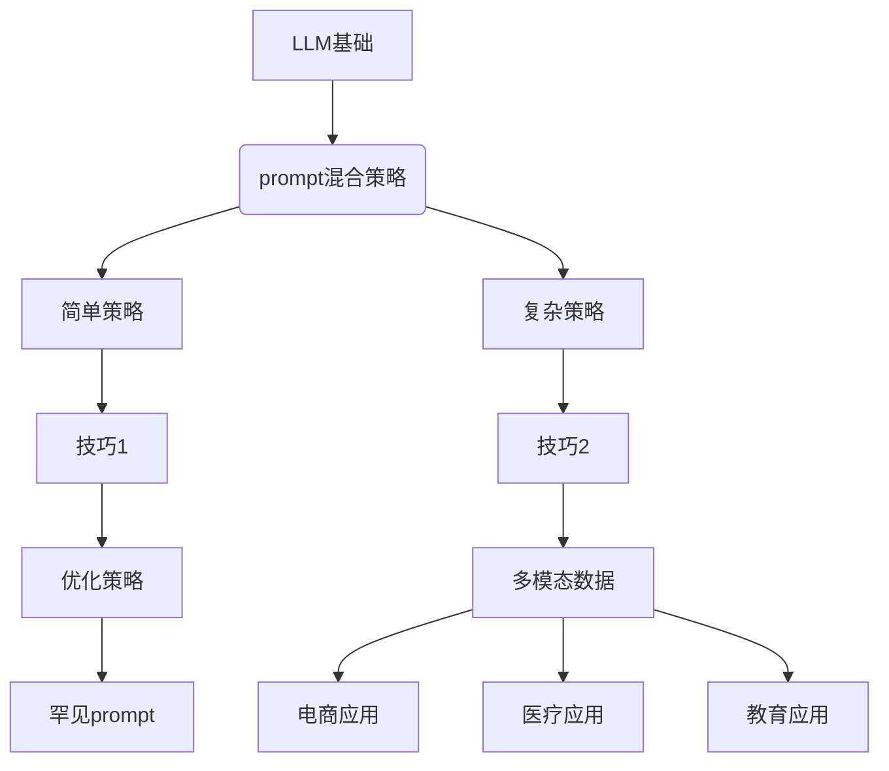

                 


### 确定文章的核心内容

1. **文章标题**：《LLM prompt混合策略：combining多种技巧》

   - 标题概述：文章将讨论如何将不同的prompt混合策略应用于大语言模型（LLM）中。

2. **关键词**

   - 关键词清单：LLM，prompt混合策略，多种技巧，大语言模型，应用。

3. **摘要**

   - 摘要内容：本文将探讨如何将多种技巧结合应用于LLM的prompt混合策略中，以提高模型性能和适应性。文章将介绍LLM的基础知识、prompt混合策略的概述、具体策略、多种技巧的应用以及实战案例，并总结未来研究方向。

### 文章结构设计

根据确定的核心内容和摘要，设计文章的基本结构：

1. **引言**

   - 概述LLM和prompt混合策略的背景。
   - 介绍文章的结构和目标。

2. **LLM基础**

   - 定义和分类。
   - 核心原理和架构。
   - 训练和优化。

3. **prompt混合策略概述**

   - 定义和作用。
   - 分类和比较。

4. **具体prompt混合策略**

   - 简单和复杂策略。
   - 设计与实现。

5. **多种技巧的应用**

   - 技巧1：优化策略。
   - 技巧2：处理多模态数据。
   - 技巧3：应对罕见prompt。

6. **实战案例**

   - 电商、医疗、教育等领域的应用。
   - 案例实现和解读。

7. **总结与展望**

   - 现状与趋势。
   - 未来研究方向。

8. **参考文献**

   - 引用相关文献。

### 核心概念与联系

为了清晰展示核心概念之间的关系，我们将使用Mermaid流程图来表示：



### 核心算法原理讲解

为了详细阐述核心算法原理，我们将使用伪代码来表示一个简单的prompt混合策略：

```python
def mix_prompts(prompt1, prompt2, prompt3):
    # 初始化混合prompt列表
    mixed_prompt = []

    # 添加三个prompt的权重
    weight1 = 0.3
    weight2 = 0.5
    weight3 = 0.2

    # 根据权重添加prompt到混合prompt列表
    for i in range(len(prompt1)):
        mixed_prompt.append(prompt1[i] * weight1 + prompt2[i] * weight2 + prompt3[i] * weight3)

    return mixed_prompt
```

### 数学模型和公式

为了更深入地理解prompt混合策略的效果，我们将使用以下数学公式来表示损失函数：

$$
\text{LLM损失函数} = \frac{1}{N}\sum_{i=1}^{N} (-\log P(y_i | x_i))
$$

### 项目实战

1. **开发环境搭建**

   - 搭建一个用于测试的LLM开发环境，包括所需依赖库和工具的安装。

2. **源代码实现**

   - 实现上述混合prompt的伪代码。

3. **代码解读**

   - 详细解读源代码中的每个部分，解释其工作原理。

4. **应用解读与分析**

   - 在实际项目中应用混合prompt策略，分析其效果。

5. **案例剖析**

   - 选择一个实际案例，详细剖析其实现过程和效果。

6. **项目小结**

   - 总结项目中的收获和不足，提出改进建议。

### 最佳实践 Tips、小结、注意事项、拓展阅读

- **最佳实践 Tips**：在实际应用中，应根据具体需求调整prompt混合策略的权重。
- **小结**：本文介绍了LLM prompt混合策略的核心概念、算法原理、应用技巧和实战案例。
- **注意事项**：在实现prompt混合策略时，需考虑数据集的多样性和模型的适应性。
- **拓展阅读**：推荐进一步学习相关文献，以深入了解LLM和prompt混合策略的最新研究进展。

通过以上步骤，我们完成了文章的核心内容规划和结构设计。接下来，我们将按照这个结构详细撰写每个章节的内容，确保文章的逻辑清晰、内容丰富、讲解透彻。最终，我们将形成一个完整、高质量的技术博客文章。

