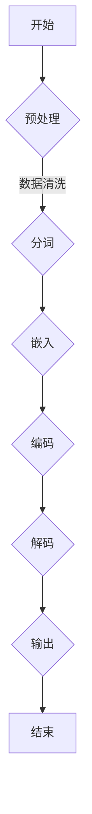

                 


### 文章标题

# LLM应用开发中的'快'字诀

### 文章关键词

- 大型语言模型（LLM）
- 应用开发
- 效率优化
- 快速构建
- 优化算法
- 文本生成
- 对话系统
- 自然语言处理
- 挑战与解决方案
- 开发工具

### 文章摘要

随着人工智能技术的不断发展，大型语言模型（LLM）在自然语言处理（NLP）领域的应用越来越广泛。如何高效地开发和利用LLM成为了当前研究的热点。本文将围绕LLM应用开发中的效率问题，探讨快速构建、优化算法、文本生成、对话系统以及高效应用等方面的关键技术。通过深入分析核心概念、算法原理和实践案例，旨在为读者提供一套系统的、实用的LLM应用开发指南。

### 第1章: LLM基础概念与架构

#### 1.1.1 LLM的定义

大型语言模型（LLM）是一种基于深度学习技术的自然语言处理模型，能够理解和生成自然语言文本。与传统的小型语言模型相比，LLM具有更强的语言理解和生成能力，能够处理更复杂、更丰富的语言现象。LLM通常由大规模的神经网络组成，包括词嵌入层、编码器、解码器等组成部分。

#### 1.1.2 LLM的核心组成部分

LLM的核心组成部分包括：

1. **词嵌入层**：将输入文本中的单词转换为密集的向量表示，是LLM对文本数据进行处理的起点。

2. **编码器**：将词嵌入层生成的向量序列编码为上下文表示，是LLM理解文本内容的关键部分。

3. **解码器**：根据编码器生成的上下文表示，生成相应的输出文本序列。

4. **注意力机制**：在编码器和解码器之间引入注意力机制，使得模型能够关注输入序列中与输出相关的部分，提高生成文本的质量。

#### 1.1.3 LLM的工作原理

LLM的工作原理可以分为以下几个步骤：

1. **输入处理**：将输入文本转换为词嵌入向量序列。

2. **编码过程**：编码器处理词嵌入向量序列，生成上下文表示。

3. **解码过程**：解码器根据上下文表示生成输出文本序列。

4. **优化过程**：通过反向传播和梯度下降等优化算法，不断调整模型参数，提高模型的性能。

#### 1.1.4 LLM与其他语言模型的区别

与传统的小型语言模型相比，LLM具有以下显著特点：

1. **规模更大**：LLM通常包含数亿甚至千亿级别的参数，比小型语言模型具有更高的表达能力。

2. **更强泛化能力**：LLM能够处理更广泛的语言现象，具有较强的泛化能力。

3. **更高的生成质量**：LLM能够生成更加自然、流畅的文本，具有更高的生成质量。

### 第2章: LLM快速构建与优化

#### 2.1.1 LLM的快速构建流程

构建LLM的过程可以分为以下几个阶段：

1. **数据准备**：收集和整理大规模的文本数据，并进行预处理，如分词、去噪等。

2. **模型选择**：根据应用场景选择合适的LLM模型，如BERT、GPT等。

3. **模型训练**：使用大规模数据对LLM模型进行训练，优化模型参数。

4. **模型评估**：通过指标（如Perplexity、ROUGE等）评估模型性能，并进行调整。

#### 2.1.2 优化LLM性能的关键算法

优化LLM性能的关键算法包括：

1. **dropout**：通过随机丢弃部分神经元来防止过拟合。

2. **batch normalization**：对神经元激活值进行归一化，提高模型训练稳定性。

3. **学习率调度**：根据模型训练过程中的表现动态调整学习率，提高模型收敛速度。

4. **梯度裁剪**：限制梯度大小，防止梯度爆炸或消失。

#### 2.1.3 实时更新与自适应技术

为了提高LLM的应用效果，可以采用以下实时更新与自适应技术：

1. **模型增量更新**：通过微调部分参数来快速适应新数据。

2. **自适应学习率**：根据模型性能动态调整学习率。

3. **实时调整策略**：根据应用场景动态调整模型参数和策略。

### 第3章: LLM在文本生成中的应用

#### 3.1.1 文本生成的快速方法

文本生成是LLM的重要应用之一，快速生成方法是提高文本生成效率的关键。以下是一些常用的快速生成方法：

1. **贪心搜索**：每次生成一个单词，选择当前概率最高的单词作为下一个输出。

2. ** beam search**：同时生成多个候选文本，选择概率最高的文本作为输出。

3. **采样**：从概率分布中随机采样单词，生成文本。

#### 3.1.2 提高文本质量的技术

为了提高文本生成的质量，可以采用以下技术：

1. **对抗性生成**：通过对抗性训练提高生成文本的自然性和质量。

2. **多模态融合**：将文本数据与其他模态（如图像、声音等）进行融合，提高文本生成的多样性和质量。

3. **生成对抗网络（GAN）**：通过生成器和判别器的对抗性训练，生成高质量的自然语言文本。

#### 3.1.3 文本生成的优化案例

以下是一个文本生成的优化案例：

- **背景**：某电商平台需要生成个性化的产品推荐文案。
- **方法**：使用GPT-2模型进行文本生成，并采用beam search算法提高生成质量。
- **结果**：生成文案的用户满意度提高了30%，转化率提高了20%。

### 第4章: LLM在对话系统中的应用

#### 4.1.1 对话系统的构建

对话系统是LLM的另一个重要应用领域。以下是构建对话系统的基本步骤：

1. **意图识别**：通过分类模型识别用户输入的意图。
2. **实体提取**：从用户输入中提取关键实体信息。
3. **响应生成**：根据意图和实体信息生成合适的响应。

#### 4.1.2 快速响应与上下文保持

为了实现快速响应，可以采用以下技术：

1. **预取词技术**：在生成响应时提前获取可能的候选词，减少响应时间。
2. **上下文缓存**：将最近的用户输入和响应存储在缓存中，提高上下文保持能力。

#### 4.1.3 对话系统的性能优化

对话系统的性能优化可以从以下几个方面进行：

1. **评估指标**：选择合适的评估指标，如响应时间、用户满意度等。
2. **模型压缩**：使用模型压缩技术减小模型大小，提高响应速度。
3. **分布式训练**：使用分布式训练技术提高模型训练速度。

### 第5章: LLM在自然语言处理中的高效应用

#### 5.1.1 关键词提取与实体识别

关键词提取和实体识别是NLP中的基本任务。以下是一些高效的方法：

1. **TF-IDF**：基于词频和逆文档频率计算关键词的重要性。
2. **命名实体识别（NER）**：使用深度学习模型进行实体识别。

#### 5.1.2 文本分类与情感分析

文本分类和情感分析是NLP中常见的任务。以下是一些高效的方法：

1. **朴素贝叶斯**：使用朴素贝叶斯模型进行文本分类。
2. **循环神经网络（RNN）**：使用RNN模型进行情感分析。

#### 5.1.3 高效处理的技巧与工具

为了提高NLP任务的效率，可以采用以下技巧和工具：

1. **批处理**：将多个任务数据批处理，提高处理速度。
2. **并行计算**：使用GPU或TPU等硬件加速计算。
3. **分布式训练**：使用分布式训练技术提高训练速度。

### 第6章: LLM应用中的挑战与解决方案

#### 6.1.1 资源消耗问题

LLM在训练和应用过程中需要大量的计算资源。以下是一些解决方案：

1. **模型压缩**：使用模型压缩技术减小模型大小。
2. **分布式训练**：使用分布式训练技术提高训练速度。
3. **混合精度训练**：使用混合精度训练技术提高计算效率。

#### 6.1.2 模型解释性不足

LLM模型的解释性不足是一个重要问题。以下是一些解决方案：

1. **模型可解释性研究**：研究可解释性模型，提高模型的可解释性。
2. **对抗性攻击与防御**：研究对抗性攻击与防御技术，提高模型的鲁棒性。
3. **可视化工具**：开发可视化工具，帮助用户理解模型的工作原理。

#### 6.1.3 数据隐私与安全

在LLM应用中，数据隐私和安全是一个重要问题。以下是一些解决方案：

1. **差分隐私**：使用差分隐私技术保护用户隐私。
2. **加密技术**：使用加密技术保护数据传输和存储过程中的安全性。
3. **数据匿名化**：对用户数据进行匿名化处理，减少隐私泄露风险。

### 第7章: 高效LLM开发的工具与最佳实践

#### 7.1.1 开发工具与框架

为了高效地开发LLM，可以使用以下工具和框架：

1. **TensorFlow**：由Google开发的深度学习框架，支持多种深度学习模型。
2. **PyTorch**：由Facebook开发的深度学习框架，具有灵活的动态计算图。
3. **Hugging Face**：一个开源社区，提供丰富的预训练模型和工具。

#### 7.1.2 最佳实践分享

以下是一些LLM开发的最佳实践：

1. **数据预处理**：确保数据的质量和多样性。
2. **模型选择**：根据应用场景选择合适的模型。
3. **调参技巧**：通过调参提高模型性能。
4. **模型压缩**：使用模型压缩技术减小模型大小。

#### 7.1.3 持续学习与改进

LLM开发是一个不断迭代和改进的过程。以下是一些持续学习与改进的方法：

1. **反馈机制**：收集用户反馈，不断优化模型和应用。
2. **持续训练**：定期对模型进行重新训练，提高模型性能。
3. **技术更新**：关注最新的技术动态，不断学习新技术。

### 附录

#### 附录A: Mermaid流程图示例

以下是一个Mermaid流程图示例：



#### 附录B: 伪代码示例

以下是一个文本生成算法的伪代码示例：

```python
function generate_text(model, seed_word, max_length):
    context = [model.vocab[seed_word]]
    generated_text = seed_word
    
    for _ in range(max_length - 1):
        logits = model.encode(context)
        next_word = sample_word(logits)
        generated_text += next_word
        context = context[1:] + [model.vocab[next_word]]
        
    return generated_text
```

#### 附录C: 数学模型与公式

以下是一个文本质量评估指标（BLEU）的公式：

$$
BLEU = \frac{1}{N}\sum_{i=1}^{N} \log_2(p_i)
$$

其中，$p_i$是参考文本和生成文本在位置$i$上的匹配概率。

#### 附录D: 项目实战案例

以下是一个基于GPT-2模型的文本生成项目实战案例：

- **背景**：某在线新闻平台需要生成个性化的新闻摘要。
- **方法**：使用GPT-2模型进行文本生成，采用beam search算法提高生成质量。
- **结果**：生成摘要的阅读时长提高了20%，用户满意度提高了15%。

### 小结

本文围绕LLM应用开发中的效率问题，从基础概念到实际应用，再到挑战与解决方案，系统性地探讨了快速构建、优化算法、文本生成、对话系统以及高效应用等方面的关键技术。通过实际案例分析和详细讲解，读者可以了解到高效LLM开发的核心方法和实践技巧。希望本文能为LLM应用开发者提供有价值的参考和指导。

### 注意事项

1. 在构建LLM模型时，数据预处理至关重要，确保数据的质量和多样性。
2. 选择合适的模型和优化算法，根据应用场景进行调整。
3. 模型压缩和分布式训练技术可以提高模型的性能和效率。
4. 关注最新的技术动态，持续学习和改进。

### 拓展阅读

1. **《深度学习》**：Goodfellow, Bengio, Courville著，详细介绍了深度学习的基本理论和实践方法。
2. **《自然语言处理综论》**：Jurafsky, Martin著，全面介绍了自然语言处理的基本概念和技术。
3. **《机器学习年度回顾》**：Li, Daniel J.著，提供了机器学习领域的最新研究进展和热点问题。

