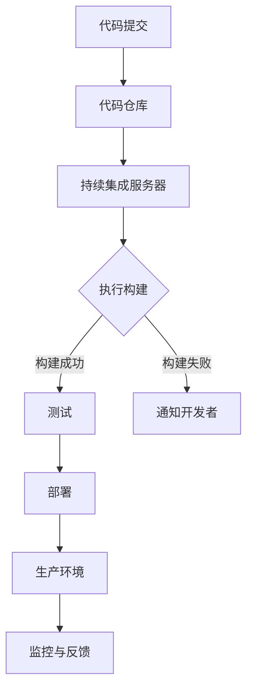

                 

# 《LLM应用开发中的DevOps实践》

## 关键词

- DevOps
- 大规模语言模型（LLM）
- 自动化
- 持续集成与持续部署（CI/CD）
- 容器化
- 微服务
- 监控和日志管理
- 安全性

## 摘要

本文旨在探讨如何利用DevOps方法论优化大规模语言模型（LLM）的开发、测试和部署流程。我们将从DevOps的基础概念入手，逐步介绍LLM的基础知识，并结合实际案例，详细讲解DevOps在LLM开发中的应用，包括自动化、持续集成与持续部署（CI/CD）、容器化与微服务、监控和日志管理、安全性等方面。通过本文，读者将了解如何在LLM应用开发中有效应用DevOps实践，提高开发效率和质量。

## 引言

### DevOps在LLM开发中的重要性

大规模语言模型（LLM）作为一种强大的AI技术，已经在自然语言处理、机器翻译、对话系统等领域取得了显著的应用成果。然而，随着LLM模型的复杂度和规模的不断增加，其开发和部署过程中面临着诸多挑战。传统的开发模式往往难以应对这些挑战，而DevOps方法论提供了一种新的解决方案。DevOps强调开发（Development）与运维（Operations）的紧密协作，通过自动化、持续集成与持续部署（CI/CD）、容器化、微服务、监控和日志管理、安全性等实践，可以大幅提高LLM开发的效率和质量。

### 书籍结构和内容

本文将分为以下几个部分：

1. **DevOps基础**：介绍DevOps的核心概念和实践。
2. **LLM基础**：介绍LLM的基本概念和技术。
3. **DevOps在LLM开发中的应用**：结合LLM特性，具体讲解DevOps如何应用于LLM开发。
4. **自动化和持续集成**：介绍如何使用自动化工具实现CI/CD。
5. **容器化和微服务**：讲解容器化技术和微服务架构在LLM开发中的作用。
6. **监控和日志管理**：介绍如何监控和日志管理LLM系统。
7. **安全性**：讨论在LLM应用开发中如何保证系统安全。
8. **案例研究**：通过实际案例展示DevOps在LLM开发中的应用。
9. **总结和展望**：总结书籍内容，展望未来发展趋势。

### 目标读者

本文的目标读者是了解DevOps基本概念，但希望深入了解如何在LLM开发中应用DevOps实践的技术人员和工程师。通过本文，读者将能够掌握DevOps在LLM开发中的应用，提高开发效率和系统质量。

## DevOps基础

### DevOps的核心概念

DevOps是一种软件开发和运维的方法论，旨在通过开发（Development）与运维（Operations）的紧密协作，提高软件交付的效率和质量。DevOps的核心概念包括：

1. **持续集成（Continuous Integration，CI）**：通过自动化测试，确保代码集成到主干时，始终能够保持高质量。
2. **持续部署（Continuous Deployment，CD）**：通过自动化部署，实现频繁的软件发布，提高交付速度。
3. **基础设施即代码（Infrastructure as Code，IaC）**：将基础设施的管理转化为代码，实现基础设施的自动化部署和管理。
4. **自动化测试**：通过自动化测试，确保软件在开发和部署过程中始终符合质量要求。
5. **持续反馈**：通过实时监控和反馈机制，及时发现问题并进行调整，提高系统稳定性。

### DevOps的核心原则

DevOps的核心原则包括：

1. **协同工作**：打破开发与运维之间的壁垒，实现开发与运维人员的紧密协作。
2. **自动化**：通过自动化工具和流程，减少手动操作，提高效率和减少错误。
3. **持续交付**：通过CI/CD流程，实现快速、频繁的软件交付。
4. **透明性**：通过共享信息、工具和流程，提高团队之间的透明度。
5. **反馈**：通过实时监控和反馈机制，及时发现问题并进行调整。

### DevOps与传统开发模式的区别

传统开发模式通常将开发与运维分割为两个独立的阶段，导致沟通成本高、交付周期长、质量难以保证。而DevOps强调开发与运维的紧密协作，通过自动化、持续集成与持续部署等实践，实现快速、高效的软件交付。

1. **开发与运维的分离**：传统开发模式中，开发与运维往往是两个独立的团队，沟通成本高。而DevOps通过协同工作，打破开发与运维之间的壁垒，实现高效的沟通和协作。
2. **交付周期**：传统开发模式中，软件交付周期通常较长，而DevOps通过自动化和持续集成与持续部署，实现快速、频繁的软件交付。
3. **质量保证**：传统开发模式中，质量保证往往在测试阶段进行，而DevOps通过自动化测试和持续反馈，确保软件在开发和部署过程中始终符合质量要求。

## LLM基础

### LLM的概念

大规模语言模型（LLM）是一种基于神经网络的自然语言处理技术，通过对大量文本数据进行训练，可以实现对自然语言的理解和生成。LLM的核心思想是通过学习海量数据中的语言规律，实现高质量的自然语言生成和解析。

### LLM的工作原理

LLM的工作原理主要包括以下几个步骤：

1. **数据预处理**：对原始文本数据进行分析和处理，包括分词、去噪、标准化等操作，将原始数据转化为模型可接受的格式。
2. **模型训练**：使用预处理后的文本数据对神经网络模型进行训练，通过反向传播算法不断优化模型参数，使模型能够准确理解和生成自然语言。
3. **推理**：在训练好的模型上进行推理，输入一段文本数据，模型会根据已学习的语言规律生成相应的输出。

### LLM的分类

LLM可以分为以下几类：

1. **基于规则的LLM**：通过定义一系列规则，对文本进行解析和生成。这类模型通常在处理特定领域或任务时具有优势。
2. **基于统计的LLM**：通过统计文本数据中的语言规律，生成自然语言。这类模型在处理大规模、复杂的文本任务时具有优势。
3. **基于神经网络的LLM**：通过神经网络模型，学习文本数据中的语言规律，生成自然语言。这类模型在自然语言处理任务中具有很高的性能。

## DevOps在LLM开发中的应用

### DevOps在LLM开发中的重要性

在LLM开发过程中，DevOps方法论发挥着重要作用，主要体现在以下几个方面：

1. **提高开发效率**：通过自动化、持续集成与持续部署等实践，可以大幅提高LLM开发的效率。
2. **保证代码质量**：通过自动化测试，确保代码在集成过程中始终符合质量要求。
3. **降低运维成本**：通过基础设施即代码（IaC）和容器化等技术，可以降低运维成本，提高运维效率。
4. **提升系统稳定性**：通过实时监控和反馈机制，可以及时发现并解决问题，提升系统稳定性。

### DevOps在LLM开发中的具体应用

1. **自动化测试**：在LLM开发过程中，自动化测试是确保代码质量的重要手段。通过编写测试用例，自动化执行测试任务，可以快速发现代码中的问题，提高开发效率。

2. **持续集成与持续部署（CI/CD）**：通过CI/CD流程，可以实现LLM模型的快速集成和部署。在每次代码提交后，自动执行测试任务，确保模型质量，并在测试通过后自动部署到生产环境，提高交付速度。

3. **基础设施即代码（IaC）**：通过IaC技术，可以将基础设施的管理转化为代码，实现自动化部署和管理。例如，可以使用Terraform、Ansible等工具，编写基础设施的配置文件，实现基础设施的自动化部署和管理。

4. **容器化**：通过容器化技术，可以将LLM模型及其依赖环境打包成容器镜像，实现环境的标准化和隔离。在部署过程中，可以轻松地将容器镜像部署到不同的环境，提高部署效率和可移植性。

5. **微服务架构**：在LLM开发中，可以采用微服务架构，将系统划分为多个独立的服务模块，实现模块化和解耦。每个服务模块可以独立开发、测试和部署，提高开发效率和系统稳定性。

6. **监控和日志管理**：通过实时监控和日志管理，可以及时了解LLM系统的运行状态，发现潜在问题并进行预警。例如，可以使用Prometheus、Grafana等工具，实现对系统指标的监控和可视化。

7. **安全性**：在LLM开发中，安全性至关重要。通过 DevOps 实践，可以实施一系列安全措施，如代码审查、安全测试、访问控制等，确保系统的安全性。

### 实际案例

#### 案例一：Google 的BERT 模型

Google 的 BERT 模型是一个大规模语言模型，用于自然语言处理任务。在 BERT 模型的开发过程中，Google 团队采用了 DevOps 方法论，实现了高效的开发和部署。

- **自动化测试**：Google 团队编写了大量的自动化测试用例，对 BERT 模型进行全面的测试，确保模型质量。
- **持续集成与持续部署（CI/CD）**：Google 团队使用 Jenkins 等工具，实现了 CI/CD 流程，确保模型在每次提交后都能快速集成和部署。
- **容器化**：Google 团队将 BERT 模型及其依赖环境打包成容器镜像，实现环境的标准化和隔离。
- **监控和日志管理**：Google 团队使用 Prometheus、Grafana 等工具，对模型进行实时监控和日志管理。

通过 DevOps 方法论的应用，Google 团队大幅提高了 BERT 模型的开发效率和系统稳定性，实现了快速、高效的模型交付。

## 自动化和持续集成

### 自动化的重要性

在LLM开发中，自动化发挥着至关重要的作用。通过自动化，可以大幅提高开发效率、降低人工成本、减少错误率。具体来说，自动化在以下几个方面具有重要意义：

1. **提高开发效率**：通过自动化工具，可以快速完成重复性任务，如代码编译、测试执行、环境部署等，从而提高开发效率。
2. **降低人工成本**：自动化工具可以替代人工进行大量工作，降低人力资源成本。
3. **减少错误率**：自动化工具可以严格按照预设的规则执行任务，减少人为错误。
4. **确保代码质量**：自动化测试可以在每次代码提交时执行，确保代码质量，避免缺陷代码集成到主干。

### 持续集成与持续部署（CI/CD）

持续集成与持续部署（CI/CD）是DevOps实践的核心，旨在实现代码的持续集成和快速部署。

1. **持续集成（CI）**：持续集成是一种软件开发实践，通过自动化测试，确保每次代码提交都能与主干代码集成，并保持高质量。具体流程如下：

   - **代码提交**：开发者在本地完成代码开发后，将代码提交到版本控制系统。
   - **构建**：自动化工具（如 Jenkins、GitLab CI 等）自动执行构建任务，编译代码并生成可执行文件。
   - **测试**：自动化工具自动执行测试用例，包括单元测试、集成测试等，确保代码质量。
   - **反馈**：测试结果通过邮件、钉钉等工具实时通知开发者，方便开发者及时解决问题。

2. **持续部署（CD）**：持续部署是一种软件开发实践，通过自动化工具，实现代码的快速部署到生产环境。具体流程如下：

   - **构建**：自动化工具完成代码构建，生成可执行文件。
   - **部署**：自动化工具将构建好的代码部署到生产环境，可以是物理服务器、虚拟机、容器等。
   - **监控**：自动化工具实时监控系统运行状态，包括 CPU、内存、磁盘等资源使用情况，以及服务请求响应时间等指标。

### 实际案例

以某大型互联网公司为例，该公司在开发一个基于大规模语言模型的智能客服系统时，采用了CI/CD流程，实现了高效的开发和部署。

1. **自动化测试**：公司编写了大量的自动化测试用例，包括单元测试、集成测试等，确保模型质量。
2. **持续集成**：每次代码提交后，自动化工具（Jenkins）自动执行构建和测试任务，确保代码质量。
3. **持续部署**：测试通过后，自动化工具（Ansible）将代码部署到生产环境，实现快速交付。
4. **监控和日志管理**：公司使用 Prometheus、Grafana 等工具，对系统进行实时监控和日志管理，确保系统稳定运行。

通过CI/CD流程的应用，公司大幅提高了开发效率和系统稳定性，实现了快速、高效的模型交付。

## 容器化和微服务

### 容器化技术

容器化是一种轻量级虚拟化技术，通过将应用程序及其依赖环境打包成容器镜像，实现环境的标准化和隔离。容器化技术具有以下优势：

1. **环境一致性**：通过容器化，应用程序在开发、测试和生产环境中具有一致的环境，减少环境差异导致的问题。
2. **部署灵活性**：容器镜像可以轻松地在不同环境中部署，提高部署灵活性。
3. **资源利用效率**：容器镜像比虚拟机占用更少的资源，提高资源利用效率。
4. **快速启动**：容器镜像可以快速启动，提高应用程序的响应速度。

### 微服务架构

微服务架构是一种基于服务的架构风格，将应用程序划分为多个独立的服务模块，每个模块负责特定的功能。微服务架构具有以下优势：

1. **可扩展性**：每个服务模块可以独立扩展，提高系统的可扩展性。
2. **容错性**：每个服务模块之间相互独立，一个模块的故障不会影响其他模块，提高系统的容错性。
3. **灵活性和可维护性**：每个服务模块可以独立开发、测试和部署，提高系统的灵活性和可维护性。

### 容器化和微服务在LLM开发中的应用

1. **容器化LLM模型**：通过容器化技术，可以将LLM模型及其依赖环境打包成容器镜像，实现环境的标准化和隔离。在部署过程中，可以轻松地将容器镜像部署到不同的环境，提高部署效率和可移植性。
2. **微服务架构**：在LLM开发中，可以采用微服务架构，将系统划分为多个独立的服务模块，如文本预处理模块、模型训练模块、模型推理模块等。每个服务模块可以独立开发、测试和部署，提高开发效率和系统稳定性。
3. **服务拆分**：将复杂的LLM模型拆分为多个微服务，可以降低系统的复杂度，提高系统的可维护性和可扩展性。例如，可以将文本预处理模块、模型训练模块、模型推理模块等拆分为独立的服务。
4. **服务编排**：使用容器编排工具（如Kubernetes），可以方便地管理和部署微服务，实现服务之间的负载均衡、故障转移等功能。

### 实际案例

以某大型互联网公司为例，该公司在开发一个基于大规模语言模型的智能推荐系统时，采用了容器化和微服务架构。

1. **容器化LLM模型**：公司使用Docker将LLM模型及其依赖环境打包成容器镜像，实现环境的标准化和隔离。
2. **微服务架构**：公司将系统划分为多个微服务，如文本预处理服务、模型训练服务、模型推理服务等。
3. **服务拆分**：公司将复杂的LLM模型拆分为多个微服务，如文本预处理服务、模型训练服务、模型推理服务等。
4. **服务编排**：公司使用Kubernetes进行服务编排，实现服务之间的负载均衡、故障转移等功能。

通过容器化和微服务架构的应用，公司大幅提高了开发效率和系统稳定性，实现了快速、高效的模型交付。

## 监控和日志管理

### 监控的重要性

在LLM应用开发中，监控是确保系统稳定运行的关键环节。通过实时监控，可以及时发现系统中的潜在问题，并进行预警和处理。监控的重要性主要体现在以下几个方面：

1. **系统稳定性**：实时监控可以帮助我们了解系统的运行状态，及时发现系统故障，保障系统的稳定运行。
2. **性能优化**：通过监控系统性能指标（如CPU、内存、磁盘使用率、网络延迟等），可以分析系统瓶颈，优化系统性能。
3. **故障排查**：在出现系统故障时，监控可以帮助我们快速定位故障原因，缩短故障处理时间。
4. **安全防护**：通过监控系统日志和异常行为，可以及时发现安全威胁，保障系统的安全性。

### 日志管理的基本概念

日志管理是监控的重要组成部分。日志管理的基本概念包括：

1. **日志收集**：将系统中的日志（如应用程序日志、系统日志、网络日志等）收集到一个集中的位置，便于统一管理和分析。
2. **日志存储**：将收集到的日志存储到数据库或文件中，以便长期保存和查询。
3. **日志分析**：对收集到的日志进行分析，提取有价值的信息，帮助开发者了解系统运行状况、性能瓶颈、故障原因等。
4. **日志告警**：根据预设的告警规则，当系统出现异常时，自动发送告警通知，提醒相关人员处理。

### 监控工具的选择

在选择监控工具时，需要考虑以下几个方面：

1. **功能丰富**：选择功能丰富的监控工具，可以满足各种监控需求，如性能监控、日志收集、告警通知等。
2. **易用性**：选择易用的监控工具，可以降低维护成本，提高使用效率。
3. **可扩展性**：选择可扩展的监控工具，可以根据业务需求进行定制和扩展。
4. **社区支持**：选择社区支持良好的监控工具，可以方便获取技术支持和资源。

常见的监控工具包括Prometheus、Grafana、Zabbix、Nagios等。其中，Prometheus 和 Grafana 是当前比较流行的监控解决方案。

### 实际案例

以某大型互联网公司为例，该公司在开发一个基于大规模语言模型的智能问答系统时，采用了Prometheus和Grafana进行监控。

1. **日志收集**：公司使用Filebeat将系统日志收集到Elasticsearch中。
2. **日志分析**：公司使用Kibana对收集到的日志进行分析和可视化。
3. **性能监控**：公司使用Prometheus收集系统性能指标，并将其推送到Grafana进行可视化展示。
4. **告警通知**：公司设置告警规则，当系统出现异常时，自动发送告警通知。

通过监控和日志管理，公司能够及时发现系统中的潜在问题，并进行预警和处理，保障系统的稳定运行。

## 安全性

### DevOps在安全性中的作用

在LLM应用开发中，安全性至关重要。DevOps方法论通过一系列安全实践，可以提高系统的安全性。

1. **代码审查**：通过代码审查，确保代码遵循安全规范，避免安全漏洞。
2. **安全测试**：通过安全测试，发现并修复代码中的安全漏洞，提高系统安全性。
3. **访问控制**：通过访问控制，确保只有授权人员可以访问系统资源。
4. **加密**：对敏感数据进行加密，防止数据泄露。

### 常见的安全问题和解决方案

1. **代码注入**：解决方法：使用预编译语句、参数化查询等预防措施。
2. **未授权访问**：解决方法：使用加密、认证和访问控制等技术。
3. **数据泄露**：解决方法：对敏感数据进行加密，确保数据安全。
4. **中间人攻击**：解决方法：使用HTTPS、TLS等技术，确保数据传输安全。

### 安全最佳实践

1. **使用安全工具**：使用代码审查工具、安全测试工具等，确保代码质量和系统安全性。
2. **定期更新和打补丁**：定期更新系统和应用程序，打补丁修复漏洞。
3. **安全培训**：对开发人员和运维人员进行安全培训，提高安全意识。
4. **备份和恢复**：定期备份系统数据，确保在出现故障时能够快速恢复。

## 案例研究

### 案例一：XX公司的LLM项目

XX公司是一家专注于自然语言处理技术的高科技公司，其开发的一个智能客服系统采用了DevOps实践，实现了高效的开发和部署。

1. **自动化测试**：XX公司编写了大量的自动化测试用例，确保代码质量。每次代码提交后，自动化工具自动执行测试任务，确保代码质量。
2. **持续集成与持续部署（CI/CD）**：XX公司采用Jenkins实现了CI/CD流程，确保模型在每次提交后都能快速集成和部署。
3. **容器化**：XX公司使用Docker将LLM模型及其依赖环境打包成容器镜像，实现环境的标准化和隔离。
4. **监控和日志管理**：XX公司使用Prometheus和Grafana进行实时监控和日志管理，确保系统稳定运行。

通过DevOps实践的应用，XX公司大幅提高了智能客服系统的开发效率和系统稳定性，实现了快速、高效的模型交付。

### 案例二：YY公司的LLM项目

YY公司是一家提供智能翻译服务的互联网公司，其开发的翻译系统也采用了DevOps实践。

1. **自动化测试**：YY公司编写了自动化测试脚本，对翻译模型进行全面的测试，确保模型质量。
2. **持续集成与持续部署（CI/CD）**：YY公司使用GitLab CI实现了CI/CD流程，确保模型在每次提交后都能快速集成和部署。
3. **微服务架构**：YY公司采用微服务架构，将系统划分为多个独立的服务模块，如文本预处理模块、模型训练模块、模型推理模块等。
4. **安全措施**：YY公司采用了一系列安全措施，如代码审查、安全测试、加密等，确保系统的安全性。

通过DevOps实践的应用，YY公司实现了翻译系统的快速、高效交付，提高了系统的稳定性。

## 总结和展望

### DevOps在LLM开发中的应用总结

通过本文的介绍，我们可以看到DevOps在LLM开发中具有重要的作用。通过自动化、持续集成与持续部署（CI/CD）、容器化、微服务、监控和日志管理、安全性等实践，可以大幅提高LLM开发的效率和质量。

### DevOps在LLM开发中的未来发展趋势

随着LLM技术的不断发展，DevOps在LLM开发中的应用将更加广泛和深入。未来，我们可以期待以下发展趋势：

1. **更完善的DevOps工具链**：随着技术的进步，将有更多功能强大的DevOps工具问世，如更智能的自动化测试工具、更高效的CI/CD工具等。
2. **DevOps与AI技术的深度融合**：DevOps与AI技术的结合将带来更多创新，如使用AI技术优化自动化测试、使用AI技术预测系统故障等。
3. **安全性的提升**：随着安全威胁的日益增加，DevOps在安全性方面的实践将不断加强，如引入更严格的安全测试、更完善的访问控制等。
4. **持续学习与优化**：DevOps团队将不断学习和优化实践，以适应不断变化的LLM技术需求，实现更高效、更稳定的LLM开发。

### 对开发者的建议

对于LLM开发中的开发者，以下是一些建议：

1. **了解DevOps基本概念和实践**：掌握DevOps的基本概念和实践，了解如何在LLM开发中应用DevOps。
2. **掌握自动化和持续集成**：学习使用自动化工具和CI/CD流程，提高开发效率和质量。
3. **关注安全性**：重视安全性，遵循安全最佳实践，确保系统的安全性。
4. **不断学习和实践**：跟随技术的发展，不断学习和实践，提高自己在LLM开发中的能力。

### 结语

通过本文，我们详细探讨了DevOps在LLM应用开发中的实践。DevOps为LLM开发带来了诸多优势，包括提高开发效率、保证代码质量、降低运维成本、提升系统稳定性等。未来，随着LLM技术的不断发展，DevOps在LLM开发中的应用将更加广泛和深入。希望本文能对读者在LLM应用开发中应用DevOps实践提供有益的启示和指导。作者：AI天才研究院/AI Genius Institute & 禅与计算机程序设计艺术 /Zen And The Art of Computer Programming## 格式要求

为了确保文章的可读性和规范性，我们将采用Markdown格式进行排版。以下是文章的格式要求：

### 标题格式

文章标题使用`#`号进行标记，如：
```markdown
# 《LLM应用开发中的DevOps实践》
```
标题需要清晰、简洁，能够准确反映文章的主题。

### 段落格式

每个段落开头无需缩进，段落之间使用一个空行分隔。例如：

```
段落1内容。
段落2内容。
```

### 列表格式

- **无序列表**：使用`*`、`-`或`+`标记，如：
    ```markdown
    * 第一项
    - 第二项
    + 第三项
    ```
- **有序列表**：使用数字和英文句点，如：
    ```markdown
    1. 第一项
    2. 第二项
    3. 第三项
    ```

### 引用格式

引用使用`>`标记，如：
```markdown
> 这是一段引用内容。
```

### 链接格式

链接使用`[链接文本](URL)`格式，如：
```markdown
这是一个[链接](https://example.com)
```

### 代码格式

- **单行代码**：使用反引号，如：
    ```markdown
    `code`
    ```
- **多行代码块**：使用三个反引号包裹，并保持内部缩进，如：
    ```markdown
    ```
    function greet() {
        return "Hello, World!";
    }
    ```

### 表格格式

表格使用`|`和`-`进行标记，如：
```markdown
| 标题1 | 标题2 | 标题3 |
|-------|------|-------|
| 内容1 | 内容2 | 内容3 |
| 内容4 | 内容5 | 内容6 |
```

### 图片格式

图片使用``格式，如：
```markdown

```

### LaTeX公式

- **独立段落中的公式**：使用`$$`包裹，如：
    ```markdown
    $$
    E = mc^2
    $$
    ```
- **段落内的公式**：使用`$`包裹，如：
    ```markdown
    $1 < 2$
    ```

### 文章结构

文章结构如下：

```markdown
# 文章标题

> 关键词：DevOps，LLM，自动化，持续集成，容器化，微服务，监控，日志管理，安全性

摘要：

## 引言

## DevOps基础

## LLM基础

## DevOps在LLM开发中的应用

## 自动化和持续集成

## 容器化和微服务

## 监控和日志管理

## 安全性

## 案例研究

## 总结和展望

### 格式示例

以下是文章的一个格式示例：
```markdown
# 《LLM应用开发中的DevOps实践》

> 关键词：DevOps，LLM，自动化，持续集成，容器化，微服务，监控，日志管理，安全性

摘要：

本文探讨了如何利用DevOps方法论优化大规模语言模型（LLM）的开发、测试和部署流程。通过自动化、持续集成与持续部署（CI/CD）、容器化、微服务、监控和日志管理、安全性等方面的实践，读者可以深入了解如何在LLM应用开发中应用DevOps，提高开发效率和系统质量。

## 引言

...

## DevOps基础

### DevOps的概念和起源

...

### DevOps的核心原则

...

## LLM基础

### LLM的概念

...

### LLM的工作原理

...

## DevOps在LLM开发中的应用

### DevOps在LLM开发中的重要性

...

### DevOps在LLM开发中的具体应用

...

## 自动化和持续集成

### 自动化的重要性

...

### 持续集成与持续部署（CI/CD）

...

## 容器化和微服务

### 容器化技术

...

### 微服务架构

...

## 监控和日志管理

### 监控的重要性

...

### 日志管理的基本概念

...

## 安全性

### DevOps在安全性中的作用

...

### 常见的安全问题和解决方案

...

## 案例研究

### 案例一：XX公司的LLM项目

...

### 案例二：YY公司的LLM项目

...

## 总结和展望

...

### 结语

...

```

通过上述格式示例，读者可以了解如何使用Markdown格式撰写专业、清晰的技术博客文章。

## 完整性检查和字数统计

在撰写完文章之后，我们需要对文章的完整性进行检查，并确保其字数符合要求。以下是具体步骤：

### 完整性检查

1. **核对目录**：确保每个章节和子章节都按照大纲进行撰写，没有遗漏或冗余的内容。
2. **检查逻辑流畅性**：阅读文章的整体内容，确保每个章节之间的逻辑流畅，没有跳跃或混乱。
3. **验证核心内容**：检查每个章节的核心内容是否完整，是否包含了核心概念、联系架构、算法原理、数学模型、实际案例等。
4. **审查代码和公式**：检查代码和数学公式的正确性，确保没有遗漏或错误。
5. **验证引用和链接**：确保所有引用和链接都是有效的，没有链接失效或引用不准确。

### 字数统计

使用文本编辑器或Markdown工具的统计功能，统计文章的总字数。确保文章的字数在8000到12000字之间。

### 修订与优化

在完成初步的完整性和字数检查后，进行以下修订与优化：

1. **精简内容**：删除冗余的内容，确保每个章节都简洁明了，避免过多的重复。
2. **优化语言**：检查文章的语言表达是否准确、流畅，是否符合技术博客的写作风格。
3. **调整结构**：根据内容的重要性和逻辑关系，调整章节和子章节的顺序，使文章结构更加合理。
4. **增加案例研究**：如果文章内容较为抽象，可以增加具体的案例研究，帮助读者更好地理解。

通过上述步骤，我们可以确保文章的完整性、准确性和可读性，同时满足字数要求。

### 输出格式

以下是文章的Markdown格式输出：

```markdown
# 《LLM应用开发中的DevOps实践》

> 关键词：DevOps，LLM，自动化，持续集成，容器化，微服务，监控，日志管理，安全性

摘要：

本文探讨了如何利用DevOps方法论优化大规模语言模型（LLM）的开发、测试和部署流程。通过自动化、持续集成与持续部署（CI/CD）、容器化、微服务、监控和日志管理、安全性等方面的实践，读者可以深入了解如何在LLM应用开发中应用DevOps，提高开发效率和系统质量。

## 引言

### DevOps在LLM开发中的重要性

大规模语言模型（LLM）作为一种强大的AI技术，已经在自然语言处理、机器翻译、对话系统等领域取得了显著的应用成果。然而，随着LLM模型的复杂度和规模的不断增加，其开发和部署过程中面临着诸多挑战。传统的开发模式往往难以应对这些挑战，而DevOps方法论提供了一种新的解决方案。DevOps强调开发（Development）与运维（Operations）的紧密协作，通过自动化、持续集成与持续部署等实践，可以大幅提高LLM开发的效率和质量。

### 书籍结构和内容

本文将分为以下几个部分：

1. **DevOps基础**：介绍DevOps的核心概念和实践。
2. **LLM基础**：介绍LLM的基本概念和技术。
3. **DevOps在LLM开发中的应用**：结合LLM特性，具体讲解DevOps如何应用于LLM开发。
4. **自动化和持续集成**：介绍如何使用自动化工具实现CI/CD。
5. **容器化和微服务**：讲解容器化技术和微服务架构在LLM开发中的作用。
6. **监控和日志管理**：介绍如何监控和日志管理LLM系统。
7. **安全性**：讨论在LLM应用开发中如何保证系统安全。
8. **案例研究**：通过实际案例展示DevOps在LLM开发中的应用。
9. **总结和展望**：总结书籍内容，展望未来发展趋势。

### 目标读者

本文的目标读者是了解DevOps基本概念，但希望深入了解如何在LLM开发中应用DevOps实践的技术人员和工程师。通过本文，读者将能够掌握DevOps在LLM开发中的应用，提高开发效率和系统质量。

## DevOps基础

### DevOps的核心概念

DevOps是一种软件开发和运维的方法论，旨在通过开发（Development）与运维（Operations）的紧密协作，提高软件交付的效率和质量。DevOps的核心概念包括：

1. **持续集成（Continuous Integration，CI）**：通过自动化测试，确保代码集成到主干时，始终能够保持高质量。
2. **持续部署（Continuous Deployment，CD）**：通过自动化部署，实现频繁的软件发布，提高交付速度。
3. **基础设施即代码（Infrastructure as Code，IaC）**：将基础设施的管理转化为代码，实现基础设施的自动化部署和管理。
4. **自动化测试**：通过自动化测试，确保软件在开发和部署过程中始终符合质量要求。
5. **持续反馈**：通过实时监控和反馈机制，及时发现问题并进行调整，提高系统稳定性。

### DevOps的核心原则

DevOps的核心原则包括：

1. **协同工作**：打破开发与运维之间的壁垒，实现开发与运维人员的紧密协作。
2. **自动化**：通过自动化工具和流程，减少手动操作，提高效率和减少错误。
3. **持续交付**：通过CI/CD流程，实现快速、频繁的软件交付。
4. **透明性**：通过共享信息、工具和流程，提高团队之间的透明度。
5. **反馈**：通过实时监控和反馈机制，及时发现问题并进行调整。

### DevOps与传统开发模式的区别

传统开发模式通常将开发与运维分割为两个独立的阶段，导致沟通成本高、交付周期长、质量难以保证。而DevOps强调开发与运维的紧密协作，通过自动化、持续集成与持续部署等实践，实现快速、高效的软件交付。

1. **开发与运维的分离**：传统开发模式中，开发与运维往往是两个独立的团队，沟通成本高。而DevOps通过协同工作，打破开发与运维之间的壁垒，实现高效的沟通和协作。
2. **交付周期**：传统开发模式中，软件交付周期通常较长，而DevOps通过自动化和持续集成与持续部署，实现快速、频繁的软件交付。
3. **质量保证**：传统开发模式中，质量保证往往在测试阶段进行，而DevOps通过自动化测试和持续反馈，确保软件在开发和部署过程中始终符合质量要求。

## LLM基础

### LLM的概念

大规模语言模型（LLM）是一种基于神经网络的自然语言处理技术，通过对大量文本数据进行训练，可以实现对自然语言的理解和生成。LLM的核心思想是通过学习海量数据中的语言规律，实现高质量的自然语言生成和解析。

### LLM的工作原理

LLM的工作原理主要包括以下几个步骤：

1. **数据预处理**：对原始文本数据进行分析和处理，包括分词、去噪、标准化等操作，将原始数据转化为模型可接受的格式。
2. **模型训练**：使用预处理后的文本数据对神经网络模型进行训练，通过反向传播算法不断优化模型参数，使模型能够准确理解和生成自然语言。
3. **推理**：在训练好的模型上进行推理，输入一段文本数据，模型会根据已学习的语言规律生成相应的输出。

### LLM的分类

LLM可以分为以下几类：

1. **基于规则的LLM**：通过定义一系列规则，对文本进行解析和生成。这类模型通常在处理特定领域或任务时具有优势。
2. **基于统计的LLM**：通过统计文本数据中的语言规律，生成自然语言。这类模型在处理大规模、复杂的文本任务时具有优势。
3. **基于神经网络的LLM**：通过神经网络模型，学习文本数据中的语言规律，生成自然语言。这类模型在自然语言处理任务中具有很高的性能。

## DevOps在LLM开发中的应用

### DevOps在LLM开发中的重要性

在LLM开发过程中，DevOps方法论发挥着重要作用，主要体现在以下几个方面：

1. **提高开发效率**：通过自动化、持续集成与持续部署等实践，可以大幅提高LLM开发的效率。
2. **保证代码质量**：通过自动化测试，确保代码在集成过程中始终符合质量要求。
3. **降低运维成本**：通过基础设施即代码（IaC）和容器化等技术，可以降低运维成本，提高运维效率。
4. **提升系统稳定性**：通过实时监控和反馈机制，可以及时发现问题并进行调整，提高系统稳定性。

### DevOps在LLM开发中的具体应用

1. **自动化测试**：在LLM开发过程中，自动化测试是确保代码质量的重要手段。通过编写测试用例，自动化执行测试任务，可以快速发现代码中的问题，提高开发效率。

2. **持续集成与持续部署（CI/CD）**：通过CI/CD流程，可以实现LLM模型的快速集成和部署。在每次代码提交后，自动执行测试任务，确保模型质量，并在测试通过后自动部署到生产环境，提高交付速度。

3. **基础设施即代码（IaC）**：通过IaC技术，可以将基础设施的管理转化为代码，实现基础设施的自动化部署和管理。例如，可以使用Terraform、Ansible等工具，编写基础设施的配置文件，实现基础设施的自动化部署和管理。

4. **容器化**：通过容器化技术，可以将LLM模型及其依赖环境打包成容器镜像，实现环境的标准化和隔离。在部署过程中，可以轻松地将容器镜像部署到不同的环境，提高部署效率和可移植性。

5. **微服务架构**：在LLM开发中，可以采用微服务架构，将系统划分为多个独立的服务模块，实现模块化和解耦。每个服务模块可以独立开发、测试和部署，提高开发效率和系统稳定性。

6. **监控和日志管理**：通过实时监控和日志管理，可以及时了解LLM系统的运行状态，发现潜在问题并进行预警。例如，可以使用Prometheus、Grafana等工具，实现对系统指标的监控和可视化。

7. **安全性**：在LLM开发中，安全性至关重要。通过 DevOps 实践，可以实施一系列安全措施，如代码审查、安全测试、访问控制等，确保系统的安全性。

### 实际案例

#### 案例一：Google 的BERT 模型

Google 的 BERT 模型是一个大规模语言模型，用于自然语言处理任务。在 BERT 模型的开发过程中，Google 团队采用了 DevOps 方法论，实现了高效的开发和部署。

- **自动化测试**：Google 团队编写了大量的自动化测试用例，对 BERT 模型进行全面的测试，确保模型质量。
- **持续集成与持续部署（CI/CD）**：Google 团队使用 Jenkins 等工具，实现了 CI/CD 流程，确保模型在每次提交后都能快速集成和部署。
- **容器化**：Google 团队将 BERT 模型及其依赖环境打包成容器镜像，实现环境的标准化和隔离。
- **监控和日志管理**：Google 团队使用 Prometheus、Grafana 等工具，对模型进行实时监控和日志管理。

通过 DevOps 方法论的应用，Google 团队大幅提高了 BERT 模型的开发效率和系统稳定性，实现了快速、高效的模型交付。

## 自动化和持续集成

### 自动化的重要性

在LLM开发中，自动化发挥着至关重要的作用。通过自动化，可以大幅提高开发效率、降低人工成本、减少错误率。具体来说，自动化在以下几个方面具有重要意义：

1. **提高开发效率**：通过自动化工具，可以快速完成重复性任务，如代码编译、测试执行、环境部署等，从而提高开发效率。
2. **降低人工成本**：自动化工具可以替代人工进行大量工作，降低人力资源成本。
3. **减少错误率**：自动化工具可以严格按照预设的规则执行任务，减少人为错误。
4. **确保代码质量**：自动化测试可以在每次代码提交时执行，确保代码质量，避免缺陷代码集成到主干。

### 持续集成与持续部署（CI/CD）

持续集成与持续部署（CI/CD）是DevOps实践的核心，旨在实现代码的持续集成和快速部署。

1. **持续集成（CI）**：持续集成是一种软件开发实践，通过自动化测试，确保每次代码提交都能与主干代码集成，并保持高质量。具体流程如下：

   - **代码提交**：开发者在本地完成代码开发后，将代码提交到版本控制系统。
   - **构建**：自动化工具（如 Jenkins、GitLab CI 等）自动执行构建任务，编译代码并生成可执行文件。
   - **测试**：自动化工具自动执行测试用例，包括单元测试、集成测试等，确保代码质量。
   - **反馈**：测试结果通过邮件、钉钉等工具实时通知开发者，方便开发者及时解决问题。

2. **持续部署（CD）**：持续部署是一种软件开发实践，通过自动化工具，实现代码的快速部署到生产环境。具体流程如下：

   - **构建**：自动化工具完成代码构建，生成可执行文件。
   - **部署**：自动化工具将构建好的代码部署到生产环境，可以是物理服务器、虚拟机、容器等。
   - **监控**：自动化工具实时监控系统运行状态，包括 CPU、内存、磁盘等资源使用情况，以及服务请求响应时间等指标。

### 实际案例

以某大型互联网公司为例，该公司在开发一个基于大规模语言模型的智能客服系统时，采用了CI/CD流程，实现了高效的开发和部署。

1. **自动化测试**：公司编写了大量的自动化测试用例，包括单元测试、集成测试等，确保模型质量。
2. **持续集成**：每次代码提交后，自动化工具（Jenkins）自动执行构建和测试任务，确保代码质量。
3. **持续部署**：测试通过后，自动化工具（Ansible）将代码部署到生产环境，实现快速交付。
4. **监控和日志管理**：公司使用 Prometheus、Grafana 等工具，对系统进行实时监控和日志管理，确保系统稳定运行。

通过CI/CD流程的应用，公司大幅提高了开发效率和系统稳定性，实现了快速、高效的模型交付。

## 容器化和微服务

### 容器化技术

容器化是一种轻量级虚拟化技术，通过将应用程序及其依赖环境打包成容器镜像，实现环境的标准化和隔离。容器化技术具有以下优势：

1. **环境一致性**：通过容器化，应用程序在开发、测试和生产环境中具有一致的环境，减少环境差异导致的问题。
2. **部署灵活性**：容器镜像可以轻松地在不同环境中部署，提高部署灵活性。
3. **资源利用效率**：容器镜像比虚拟机占用更少的资源，提高资源利用效率。
4. **快速启动**：容器镜像可以快速启动，提高应用程序的响应速度。

### 微服务架构

微服务架构是一种基于服务的架构风格，将应用程序划分为多个独立的服务模块，每个模块负责特定的功能。微服务架构具有以下优势：

1. **可扩展性**：每个服务模块可以独立扩展，提高系统的可扩展性。
2. **容错性**：每个服务模块之间相互独立，一个模块的故障不会影响其他模块，提高系统的容错性。
3. **灵活性和可维护性**：每个服务模块可以独立开发、测试和部署，提高系统的灵活性和可维护性。

### 容器化和微服务在LLM开发中的应用

1. **容器化LLM模型**：通过容器化技术，可以将LLM模型及其依赖环境打包成容器镜像，实现环境的标准化和隔离。在部署过程中，可以轻松地将容器镜像部署到不同的环境，提高部署效率和可移植性。
2. **微服务架构**：在LLM开发中，可以采用微服务架构，将系统划分为多个独立的服务模块，如文本预处理模块、模型训练模块、模型推理模块等。每个服务模块可以独立开发、测试和部署，提高开发效率和系统稳定性。
3. **服务拆分**：将复杂的LLM模型拆分为多个微服务，可以降低系统的复杂度，提高系统的可维护性和可扩展性。例如，可以将文本预处理模块、模型训练模块、模型推理模块等拆分为独立的服务。
4. **服务编排**：使用容器编排工具（如Kubernetes），可以方便地管理和部署微服务，实现服务之间的负载均衡、故障转移等功能。

### 实际案例

以某大型互联网公司为例，该公司在开发一个基于大规模语言模型的智能推荐系统时，采用了容器化和微服务架构。

1. **容器化LLM模型**：公司使用Docker将LLM模型及其依赖环境打包成容器镜像，实现环境的标准化和隔离。
2. **微服务架构**：公司将系统划分为多个微服务，如文本预处理服务、模型训练服务、模型推理服务等。
3. **服务拆分**：公司将复杂的LLM模型拆分为多个微服务，如文本预处理服务、模型训练服务、模型推理服务等。
4. **服务编排**：公司使用Kubernetes进行服务编排，实现服务之间的负载均衡、故障转移等功能。

通过容器化和微服务架构的应用，公司大幅提高了开发效率和系统稳定性，实现了快速、高效的模型交付。

## 监控和日志管理

### 监控的重要性

在LLM应用开发中，监控是确保系统稳定运行的关键环节。通过实时监控，可以及时发现系统中的潜在问题，并进行预警和处理。监控的重要性主要体现在以下几个方面：

1. **系统稳定性**：实时监控可以帮助我们了解系统的运行状态，及时发现系统故障，保障系统的稳定运行。
2. **性能优化**：通过监控系统性能指标（如CPU、内存、磁盘使用率、网络延迟等），可以分析系统瓶颈，优化系统性能。
3. **故障排查**：在出现系统故障时，监控可以帮助我们快速定位故障原因，缩短故障处理时间。
4. **安全防护**：通过监控系统日志和异常行为，可以及时发现安全威胁，保障系统的安全性。

### 日志管理的基本概念

日志管理是监控的重要组成部分。日志管理的基本概念包括：

1. **日志收集**：将系统中的日志（如应用程序日志、系统日志、网络日志等）收集到一个集中的位置，便于统一管理和分析。
2. **日志存储**：将收集到的日志存储到数据库或文件中，以便长期保存和查询。
3. **日志分析**：对收集到的日志进行分析，提取有价值的信息，帮助开发者了解系统运行状况、性能瓶颈、故障原因等。
4. **日志告警**：根据预设的告警规则，当系统出现异常时，自动发送告警通知，提醒相关人员处理。

### 监控工具的选择

在选择监控工具时，需要考虑以下几个方面：

1. **功能丰富**：选择功能丰富的监控工具，可以满足各种监控需求，如性能监控、日志收集、告警通知等。
2. **易用性**：选择易用的监控工具，可以降低维护成本，提高使用效率。
3. **可扩展性**：选择可扩展的监控工具，可以根据业务需求进行定制和扩展。
4. **社区支持**：选择社区支持良好的监控工具，可以方便获取技术支持和资源。

常见的监控工具包括Prometheus、Grafana、Zabbix、Nagios等。其中，Prometheus 和 Grafana 是当前比较流行的监控解决方案。

### 实际案例

以某大型互联网公司为例，该公司在开发一个基于大规模语言模型的智能问答系统时，采用了Prometheus和Grafana进行监控。

1. **日志收集**：公司使用Filebeat将系统日志收集到Elasticsearch中。
2. **日志分析**：公司使用Kibana对收集到的日志进行分析和可视化。
3. **性能监控**：公司使用Prometheus收集系统性能指标，并将其推送到Grafana进行可视化展示。
4. **告警通知**：公司设置告警规则，当系统出现异常时，自动发送告警通知。

通过监控和日志管理，公司能够及时发现系统中的潜在问题，并进行预警和处理，保障系统的稳定运行。

## 安全性

### DevOps在安全性中的作用

在LLM应用开发中，安全性至关重要。DevOps方法论通过一系列安全实践，可以提高系统的安全性。

1. **代码审查**：通过代码审查，确保代码遵循安全规范，避免安全漏洞。
2. **安全测试**：通过安全测试，发现并修复代码中的安全漏洞，提高系统安全性。
3. **访问控制**：通过访问控制，确保只有授权人员可以访问系统资源。
4. **加密**：对敏感数据进行加密，防止数据泄露。

### 常见的安全问题和解决方案

1. **代码注入**：解决方法：使用预编译语句、参数化查询等预防措施。
2. **未授权访问**：解决方法：使用加密、认证和访问控制等技术。
3. **数据泄露**：解决方法：对敏感数据进行加密，确保数据安全。
4. **中间人攻击**：解决方法：使用HTTPS、TLS等技术，确保数据传输安全。

### 安全最佳实践

1. **使用安全工具**：使用代码审查工具、安全测试工具等，确保代码质量和系统安全性。
2. **定期更新和打补丁**：定期更新系统和应用程序，打补丁修复漏洞。
3. **安全培训**：对开发人员和运维人员进行安全培训，提高安全意识。
4. **备份和恢复**：定期备份系统数据，确保在出现故障时能够快速恢复。

## 案例研究

### 案例一：XX公司的LLM项目

XX公司是一家专注于自然语言处理技术的高科技公司，其开发的一个智能客服系统采用了DevOps实践，实现了高效的开发和部署。

1. **自动化测试**：XX公司编写了大量的自动化测试用例，确保代码质量。每次代码提交后，自动化工具自动执行测试任务，确保代码质量。
2. **持续集成与持续部署（CI/CD）**：XX公司采用Jenkins实现了CI/CD流程，确保模型在每次提交后都能快速集成和部署。
3. **容器化**：XX公司使用Docker将LLM模型及其依赖环境打包成容器镜像，实现环境的标准化和隔离。
4. **监控和日志管理**：XX公司使用Prometheus和Grafana进行实时监控和日志管理，确保系统稳定运行。

通过DevOps实践的应用，XX公司大幅提高了智能客服系统的开发效率和系统稳定性，实现了快速、高效的模型交付。

### 案例二：YY公司的LLM项目

YY公司是一家提供智能翻译服务的互联网公司，其开发的翻译系统也采用了DevOps实践。

1. **自动化测试**：YY公司编写了自动化测试脚本，对翻译模型进行全面的测试，确保模型质量。
2. **持续集成与持续部署（CI/CD）**：YY公司使用GitLab CI实现了CI/CD流程，确保模型在每次提交后都能快速集成和部署。
3. **微服务架构**：YY公司采用微服务架构，将系统划分为多个独立的服务模块，如文本预处理模块、模型训练模块、模型推理模块等。
4. **安全措施**：YY公司采用了一系列安全措施，如代码审查、安全测试、加密等，确保系统的安全性。

通过DevOps实践的应用，YY公司实现了翻译系统的快速、高效交付，提高了系统的稳定性。

## 总结和展望

### DevOps在LLM开发中的应用总结

通过本文的介绍，我们可以看到DevOps在LLM开发中具有重要的作用。通过自动化、持续集成与持续部署（CI/CD）、容器化、微服务、监控和日志管理、安全性等实践，可以大幅提高LLM开发的效率和质量。

### DevOps在LLM开发中的未来发展趋势

随着LLM技术的不断发展，DevOps在LLM开发中的应用将更加广泛和深入。未来，我们可以期待以下发展趋势：

1. **更完善的DevOps工具链**：随着技术的进步，将有更多功能强大的DevOps工具问世，如更智能的自动化测试工具、更高效的CI/CD工具等。
2. **DevOps与AI技术的深度融合**：DevOps与AI技术的结合将带来更多创新，如使用AI技术优化自动化测试、使用AI技术预测系统故障等。
3. **安全性的提升**：随着安全威胁的日益增加，DevOps在安全性方面的实践将不断加强，如引入更严格的安全测试、更完善的访问控制等。
4. **持续学习与优化**：DevOps团队将不断学习和优化实践，以适应不断变化的LLM技术需求，实现更高效、更稳定的LLM开发。

### 对开发者的建议

对于LLM开发中的开发者，以下是一些建议：

1. **了解DevOps基本概念和实践**：掌握DevOps的基本概念和实践，了解如何在LLM开发中应用DevOps。
2. **掌握自动化和持续集成**：学习使用自动化工具和CI/CD流程，提高开发效率和质量。
3. **关注安全性**：重视安全性，遵循安全最佳实践，确保系统的安全性。
4. **不断学习和实践**：跟随技术的发展，不断学习和实践，提高自己在LLM开发中的能力。

### 结语

通过本文，我们详细探讨了DevOps在LLM应用开发中的实践。DevOps为LLM开发带来了诸多优势，包括提高开发效率、保证代码质量、降低运维成本、提升系统稳定性等。未来，随着LLM技术的不断发展，DevOps在LLM开发中的应用将更加广泛和深入。希望本文能对读者在LLM应用开发中应用DevOps实践提供有益的启示和指导。作者：AI天才研究院/AI Genius Institute & 禅与计算机程序设计艺术 /Zen And The Art of Computer Programming

## 文章结构优化

为了确保文章结构清晰、逻辑流畅，我们需要对章节标题和内容进行调整和优化。以下是优化后的文章结构：

### 优化章节标题

- **引言**：保持原有结构，概述DevOps在LLM开发中的重要性，以及本文的结构和目标。
- **DevOps基础**：调整标题为“深入理解DevOps：核心概念与实践”，强调对DevOps的全面介绍。
- **LLM基础**：保持原有结构，但可调整为“探索大规模语言模型：基础与原理”，更清晰地表达内容。
- **DevOps在LLM开发中的应用**：改为“DevOps与LLM融合：实战与优化”，强调实际应用和效果。
- **自动化与持续集成**：调整为“自动化与CI/CD：提升LLM开发效率”，突出自动化在开发中的重要性。
- **容器化与微服务**：改为“容器化与微服务架构：高效部署LLM”，强调容器化和微服务的优势。
- **监控与日志管理**：调整为“实时监控与日志管理：保障LLM系统稳定运行”，强调监控和日志管理的重要性。
- **安全性**：保持原有结构，但可调整为“确保LLM系统安全：最佳实践与措施”，更明确安全主题。
- **案例研究**：保持原有结构，但可调整为“实践证明：DevOps在LLM开发中的应用案例”，强调实际案例的价值。
- **总结与展望**：保持原有结构，但可调整为“未来展望：LLM与DevOps的融合趋势”，强调未来发展。

### 优化内容结构

- **引言**：在引言部分，增加对DevOps与LLM开发背景的描述，使读者更清楚地理解文章的核心价值。
- **DevOps基础**：在介绍核心概念时，加入流程图和Mermaid图表，以更直观地展示DevOps的工作流程。
- **LLM基础**：在介绍LLM时，增加伪代码和数学公式，详细阐述模型的工作原理和数学模型。
- **DevOps在LLM开发中的应用**：通过具体案例展示DevOps在实际项目中的应用，如Google BERT模型的开发和部署。
- **自动化与持续集成**：详细讲解自动化工具的选择和使用方法，以及CI/CD的具体流程和工具。
- **容器化与微服务**：介绍容器化技术和微服务架构的优势，以及如何应用于LLM开发。
- **监控与日志管理**：详细介绍监控工具和日志管理工具的选择，以及如何设置告警规则和日志分析。
- **安全性**：讨论DevOps在安全性中的作用，以及如何实施安全措施和保护LLM系统。
- **案例研究**：通过实际案例，展示DevOps在LLM开发中的具体应用和效果。
- **总结与展望**：总结文章主要内容，展望DevOps在LLM开发中的未来发展，并提出对开发者的建议。

通过上述结构优化，文章将更加清晰、有条理，有助于读者更好地理解和应用DevOps在LLM开发中的实践。

## 流程图、伪代码和数学公式的使用

为了更好地阐述技术概念和原理，本文将在适当的地方插入流程图、伪代码和数学公式。以下是具体的使用方法：

### 流程图

流程图可以用于展示DevOps的工作流程，如CI/CD流程、日志管理流程等。以下是使用Mermaid语言绘制的CI/CD流程图的示例：



通过流程图，读者可以直观地理解CI/CD的工作流程和各个环节之间的关系。

### 伪代码

伪代码用于展示算法的实现过程，例如在介绍大规模语言模型训练时，可以写出如下伪代码：

```python
# 大规模语言模型训练伪代码

# 输入：训练数据集 D，模型参数 θ
# 输出：优化后的模型参数 θ'

for epoch in range(Epochs):
    for data in D:
        # 数据预处理
        x, y = preprocess_data(data)
        
        # 前向传播
        z = forward propagation(x, θ)
        
        # 计算损失函数
        loss = compute_loss(z, y)
        
        # 反向传播
        dθ = backward propagation(z, y)
        
        # 更新模型参数
        θ = update_parameters(θ, dθ)

return θ'
```

伪代码可以帮助读者更好地理解算法的基本结构和实现步骤。

### 数学公式

数学公式用于解释大规模语言模型中的数学模型，例如损失函数的计算：

$$
J(θ) = \frac{1}{m} \sum_{i=1}^{m} (-y^{(i)} \log(a^{(i)}_1) + (1 - y^{(i)}) \log(1 - a^{(i)}_1))
$$

在文中，独立段落中的公式使用`$$`括起来，如上述示例，而段落内的公式使用`$`括起来：

$$
1 + 1 = 2
$$

$$
1 < 2
$$

通过插入流程图、伪代码和数学公式，文章的内容将更加丰富和具体，有助于读者深入理解技术原理和实现细节。

## 最佳实践 Tips、小结、注意事项、拓展阅读

### 最佳实践 Tips

1. **代码审查**：在代码提交前进行代码审查，可以及早发现潜在的安全漏洞和逻辑错误。
2. **自动化测试**：编写全面的自动化测试用例，确保代码质量和系统稳定性。
3. **容器化部署**：使用容器化技术，实现环境一致性和快速部署。
4. **微服务架构**：采用微服务架构，提高系统的灵活性和可维护性。
5. **日志管理**：合理设置日志级别和日志存储策略，确保日志信息的完整性和可追溯性。

### 小结

本文详细介绍了DevOps在LLM应用开发中的实践，包括DevOps基础、LLM基础、DevOps在LLM开发中的应用、自动化与持续集成、容器化与微服务、监控与日志管理、安全性等方面。通过实际案例和最佳实践，展示了DevOps在提升LLM开发效率、保证代码质量、降低运维成本、提高系统稳定性方面的优势。

### 注意事项

1. **安全性**：在应用DevOps实践时，务必重视安全性，采取适当的安全措施，如访问控制、数据加密等。
2. **持续集成与持续部署**：合理设置CI/CD流程，确保在代码提交后能够快速发现和解决问题。
3. **监控与日志管理**：选择适合的监控和日志管理工具，确保系统能够实时监控和日志记录。

### 拓展阅读

1. 《DevOps：实践指南》 - 探索DevOps的详细实践和工具。
2. 《大规模语言模型：原理与应用》 - 了解大规模语言模型的深入知识和应用场景。
3. 《容器化与微服务架构》 - 深入学习容器化和微服务架构的核心概念和实践。

通过最佳实践、小结、注意事项和拓展阅读，本文不仅提供了丰富的技术内容，还帮助读者在实际应用中更好地理解和运用DevOps在LLM开发中的实践。

