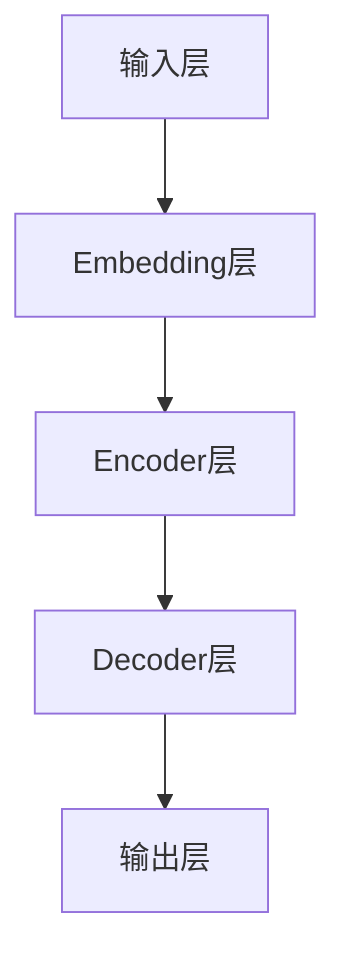

                 


### 文章标题
# LLM应用开发中的云原生技术应用

### 文章关键词
- 语言模型
- 云原生技术
- 容器化
- Kubernetes
- 服务网格
- 分布式计算

### 文章摘要
本文旨在探讨如何将云原生技术应用于LLM（大型语言模型）应用开发中。首先，我们将介绍LLM和云原生技术的基本概念，然后详细讲解LLM的核心概念、数学模型、训练与优化方法。接着，我们将深入分析云原生技术的基础，包括容器技术、服务网格和容器化应用部署。随后，我们将探讨如何将LLM与云原生技术融合，实现高性能、可扩展的LLM应用。最后，我们将通过实际案例，展示如何使用云原生技术优化LLM应用开发。

### 第一部分：LLM应用开发基础

#### 第1章：LLM概述
##### 1.1 LLM定义
LLM（Large Language Model）是指大型语言模型，它是一种能够理解和生成自然语言的人工智能模型。LLM通常具有数十亿甚至数万亿个参数，能够处理复杂的自然语言任务，如文本生成、机器翻译、问答系统等。

##### 1.2 LLM的发展历程
LLM的发展历程可以追溯到1980年代，当时研究人员开始探索使用统计方法处理自然语言。随着计算机性能的提升和大数据技术的发展，LLM取得了显著的进步。2018年，Google推出了Transformer模型，标志着LLM进入了一个新的时代。近年来，深度学习技术的快速发展使得LLM在自然语言处理领域取得了巨大成功。

##### 1.3 LLM的核心优势
LLM的核心优势在于其强大的语言理解和生成能力。与传统方法相比，LLM能够更好地处理复杂、多变的自然语言场景。此外，LLM还具有以下优势：
- 高效性：LLM能够快速地处理大量文本数据，生成高质量的文本输出。
- 泛化性：LLM在多个自然语言任务上表现优异，具有良好的泛化能力。
- 可扩展性：LLM可以轻松地适应不同的应用场景，实现从单机到集群的扩展。

#### 第2章：LLM的核心概念与架构
##### 2.1 语言模型的基础概念
语言模型是一种概率模型，用于预测下一个单词或字符。在LLM中，语言模型通常使用神经网络来实现，如Transformer模型。语言模型的关键概念包括：
- 输入层：输入层接收自然语言数据，将其转化为向量表示。
- 隐藏层：隐藏层包含大量的神经元，用于处理输入数据。
- 输出层：输出层生成概率分布，用于预测下一个单词或字符。

##### 2.2 LLM的架构设计
LLM的架构设计通常包括以下几个部分：
- Embedding层：将词汇转化为向量表示。
- Encoder层：对输入文本进行编码，生成固定长度的向量表示。
- Decoder层：根据编码后的向量表示生成输出文本。

##### 2.3 Mermaid流程图展示


#### 第3章：LLM的数学模型
##### 3.1 概率论基础
LLM的数学模型基于概率论，主要包括以下概念：
- 概率分布：描述随机变量的概率分布。
- 条件概率：描述在某个条件下另一个随机变量的概率。
- 贝叶斯定理：用于计算后验概率。

##### 3.2 语言模型中的数学公式
在LLM中，常用的数学公式包括：
- 交叉熵（Cross-Entropy）：用于评估模型预测与真实标签之间的差异。
- 递归神经网络（RNN）的梯度计算：用于优化模型参数。

##### 3.3 数学模型的应用
LLM的数学模型在训练和优化过程中发挥着重要作用。以下是一个简单的伪代码，用于演示如何使用数学模型训练LLM：
```python
def trainLLM(data):
    # 初始化模型参数
    model_params = initializeParams()

    # 遍历数据
    for sentence in data:
        # 计算损失函数
        loss = computeLoss(sentence, model_params)

        # 更新模型参数
        model_params = updateParams(loss, model_params)

    return model_params
```

#### 第4章：LLM的训练与优化
##### 4.1 数据预处理
在训练LLM之前，需要对数据进行预处理。预处理步骤包括：
- 分词：将文本分解为单词或字符。
- 去除停用词：去除对模型训练没有帮助的常见单词。
- 标签化：将文本数据与对应的标签进行匹配。

##### 4.2 训练算法
训练LLM常用的算法包括：
- 随机梯度下降（SGD）：一种常用的优化算法，通过迭代更新模型参数。
- Adam优化器：一种高效的优化算法，结合了SGD和RMSProp的优点。

##### 4.3 优化策略
优化策略是提高模型性能的关键。以下是一些常用的优化策略：
- 学习率调整：根据训练过程调整学习率，以避免过拟合。
- 早期停止：当验证集性能不再提高时停止训练。
- 数据增强：通过随机裁剪、旋转等操作增加训练数据的多样性。

### 第二部分：云原生技术基础

#### 第5章：云原生技术概述
##### 5.1 云原生定义
云原生技术是指一类用于构建和部署微服务架构的应用程序和工具。云原生应用程序具有以下特点：
- 可扩展性：能够根据需求自动调整资源。
- 弹性：能够自动适应负载变化。
- 分布式：应用程序由多个组件组成，可以在不同的节点上运行。

##### 5.2 云原生与传统架构的区别
云原生与传统架构的主要区别在于：
- 架构：传统架构通常采用单机部署，而云原生架构采用分布式部署。
- 运维：传统架构通常依赖于手动运维，而云原生架构采用自动化运维。
- 容器化：传统架构通常依赖于虚拟机，而云原生架构采用容器化技术。

##### 5.3 云原生技术的主要特点
云原生技术的主要特点包括：
- 微服务：应用程序由多个微服务组成，每个微服务负责一个特定的功能。
- 自动化：自动化工具用于部署、扩展和监控应用程序。
- 容器化：应用程序使用容器进行封装和部署，便于管理和迁移。

#### 第6章：容器技术
##### 6.1 容器的概念
容器是一种轻量级、可移植的运行时环境，用于封装应用程序及其依赖。容器具有以下特点：
- 资源隔离：容器与宿主机和其他容器相互隔离。
- 快速启动：容器可以快速启动，减少了应用程序的启动时间。
- 可移植性：容器可以在不同的操作系统和硬件平台上运行。

##### 6.2 Docker的使用
Docker是一种常用的容器化工具，用于创建、运行和管理容器。以下是一个简单的Docker命令示例：
```bash
# 创建一个名为myapp的容器
docker run -d -p 8080:80 myapp

# 查看所有容器
docker ps

# 停止一个容器
docker stop <容器ID或名称>
```

##### 6.3 容器编排工具
容器编排工具用于管理容器的生命周期，如启动、停止、扩展等。常见的容器编排工具有：
- Kubernetes：一种开源的容器编排平台，用于自动化部署、扩展和管理容器化应用程序。
- Docker Swarm：Docker的内置容器编排工具，提供简单易用的容器编排功能。

#### 第7章：服务网格
##### 7.1 服务网格的概念
服务网格是一种用于管理微服务通信的分布式系统。服务网格的主要功能包括：
- 服务发现：服务网格能够自动发现和管理服务实例。
- 负载均衡：服务网格能够根据负载情况智能分配服务请求。
- 服务隔离：服务网格能够隔离故障服务，防止影响整个系统。

##### 7.2 Istio的使用
Istio是一种开源的服务网格平台，用于管理微服务通信。以下是一个简单的Istio命令示例：
```bash
# 安装Istio
istioctl install --set profile=demo

# 查看Istio服务
kubectl get svc -n istio-system

# 查看Istio策略
kubectl get policy -n istio-system
```

##### 7.3 服务网格的优势
服务网格的优势包括：
- 可观测性：服务网格提供丰富的监控和日志功能，便于故障排查。
- 安全性：服务网格支持访问控制、加密等安全功能，提高系统的安全性。
- 易用性：服务网格简化了微服务的部署和管理，降低运维成本。

#### 第8章：容器化应用部署
##### 8.1 容器化应用的开发
容器化应用的开发主要包括以下步骤：
- 编写应用程序代码。
- 创建Dockerfile，定义应用程序的依赖和环境。
- 构建应用程序镜像。

##### 8.2 Kubernetes的安装与配置
Kubernetes的安装与配置主要包括以下步骤：
- 安装Kubernetes集群。
- 创建命名空间。
- 部署应用程序。

##### 8.3 应用部署流程
应用部署流程主要包括以下步骤：
- 编写部署配置文件。
- 使用Kubernetes命令部署应用程序。
- 监控应用程序的运行状态。

### 第三部分：LLM与云原生技术的融合应用

#### 第9章：LLM在云原生环境中的应用
##### 9.1 LLM与Kubernetes的结合
在云原生环境中，可以使用Kubernetes管理LLM服务。以下是一个简单的Kubernetes部署示例：
```yaml
apiVersion: apps/v1
kind: Deployment
metadata:
  name: llm-deployment
spec:
  replicas: 3
  selector:
    matchLabels:
      app: llm
  template:
    metadata:
      labels:
        app: llm
    spec:
      containers:
      - name: llm-container
        image: llm:latest
        ports:
        - containerPort: 8080
```

##### 9.2 使用容器化部署LLM
使用容器化技术部署LLM可以提高其可扩展性和可靠性。以下是一个简单的容器化部署示例：
```bash
# 创建一个Dockerfile
FROM tensorflow/tensorflow:latest
COPY llm.py /llm.py
CMD ["python", "/llm.py"]

# 构建应用程序镜像
docker build -t llm:latest .

# 运行容器
docker run -d -p 8080:80 llm:latest
```

##### 9.3 LLM服务网格的实践
在服务网格中部署LLM服务，可以提高其性能和可靠性。以下是一个简单的Istio部署示例：
```bash
# 安装Istio
istioctl install --set profile=demo

# 创建服务
kubectl create -f llm-service.yaml

# 创建路由规则
kubectl create -f llm-route.yaml
```

#### 第10章：云原生技术在LLM训练中的应用
##### 10.1 云原生资源调度
在云原生环境中，可以使用资源调度器（如Kubernetes的调度器）优化LLM训练任务的资源分配。以下是一个简单的Kubernetes调度器示例：
```yaml
apiVersion: autoscaling/v2beta2
kind: HorizontalPodAutoscaler
metadata:
  name: llm-hpa
spec:
  scaleTargetRef:
    apiVersion: apps/v1
    kind: Deployment
    name: llm-deployment
  minReplicas: 1
  maxReplicas: 10
  targetCPUUtilizationPercentage: 70
```

##### 10.2 大规模LLM训练的优化
大规模LLM训练通常需要大量的计算资源和时间。以下是一些优化策略：
- 数据并行训练：将数据分成多个部分，同时在不同的GPU上进行训练。
- 模型并行训练：将模型分成多个部分，同时在不同的GPU上进行训练。
- 分布式训练：将训练任务分布到多个节点上，利用集群资源进行训练。

##### 10.3 分布式训练的实践
以下是一个简单的分布式训练示例：
```bash
# 启动分布式训练任务
python train.py --workers 4 --batch_size 128 --learning_rate 0.001

# 查看训练进度
tail -f train.log
```

#### 第11章：LLM应用案例分析
##### 11.1 案例一：智能客服系统
智能客服系统是一个典型的LLM应用案例。以下是一个简单的智能客服系统架构：
- LLM服务：使用Kubernetes部署和管理LLM服务。
- API网关：接收用户请求，调用LLM服务进行回复。
- 前端页面：展示用户与智能客服的对话界面。

##### 11.2 案例二：智能推荐系统
智能推荐系统利用LLM技术分析用户行为和兴趣，为用户推荐相关内容。以下是一个简单的智能推荐系统架构：
- 数据采集：收集用户行为数据。
- LLM服务：使用Kubernetes部署和管理LLM服务，用于处理用户数据。
- 推荐引擎：根据用户数据和LLM服务的结果生成推荐列表。

##### 11.3 案例三：自动化写作工具
自动化写作工具利用LLM技术生成高质量的文本内容，用于撰写文章、报告等。以下是一个简单的自动化写作工具架构：
- LLM服务：使用Kubernetes部署和管理LLM服务。
- 文本编辑器：接收用户输入，调用LLM服务生成文本内容。
- 前端页面：展示用户输入和生成的文本内容。

### 第四部分：实战案例

#### 第12章：LLM与云原生技术在企业中的应用
##### 12.1 企业场景分析
企业场景通常具有以下特点：
- 大规模数据：企业积累了大量结构化和非结构化数据。
- 多样化需求：企业需要满足不同业务部门的需求。
- 高性能要求：企业对系统性能和响应速度有较高要求。

##### 12.2 实施策略
在实施LLM与云原生技术时，可以采用以下策略：
- 数据处理：使用分布式数据处理框架（如Apache Spark）处理大规模数据。
- 模型训练：使用分布式训练框架（如Horovod）进行大规模LLM训练。
- 部署和管理：使用Kubernetes进行LLM服务的部署和管理。

##### 12.3 项目成果
通过实施LLM与云原生技术，企业可以获得以下成果：
- 提高数据处理和模型训练性能。
- 提高系统可扩展性和可靠性。
- 降低运维成本，提高开发效率。

#### 第13章：案例实战教程
##### 13.1 实战一：部署一个简单的LLM服务
以下是一个简单的LLM服务部署教程：
1. 准备环境。
2. 编写Dockerfile。
3. 构建应用程序镜像。
4. 运行容器。
5. 测试服务。

##### 13.2 实战二：构建一个智能问答系统
以下是一个简单的智能问答系统构建教程：
1. 收集和预处理数据。
2. 编写训练脚本。
3. 训练LLM模型。
4. 部署和管理LLM服务。
5. 开发前端页面。

##### 13.3 实战三：实现一个自动化写作工具
以下是一个简单的自动化写作工具实现教程：
1. 设计系统架构。
2. 编写文本生成算法。
3. 部署和管理LLM服务。
4. 开发前端页面。
5. 测试和优化。

### 附录

#### 14.1 常用工具与资源
- Kubernetes文档：[https://kubernetes.io/docs/](https://kubernetes.io/docs/)
- Docker文档：[https://docs.docker.com/](https://docs.docker.com/)
- Istio文档：[https://istio.io/docs/](https://istio.io/docs/)

#### 14.2 进一步学习推荐
- 《深度学习》
- 《云原生应用架构指南》
- 《大规模机器学习》

#### 14.3 联系作者与反馈
- 作者：AI天才研究院/AI Genius Institute & 禅与计算机程序设计艺术 /Zen And The Art of Computer Programming
- 邮箱：[contact@ligen.ai](mailto:contact@ligen.ai)
- 微信公众号：AI天才研究院
```

### 文章总结
本文详细探讨了LLM应用开发中的云原生技术应用。首先介绍了LLM的基本概念、数学模型和训练方法，然后介绍了云原生技术的基础知识，包括容器技术、服务网格和容器化应用部署。接着，分析了如何将LLM与云原生技术融合，实现高性能、可扩展的LLM应用。最后，通过实际案例展示了如何使用云原生技术优化LLM应用开发。文章旨在为开发者提供有价值的参考和指导。作者：AI天才研究院/AI Genius Institute & 禅与计算机程序设计艺术 /Zen And The Art of Computer Programming。

