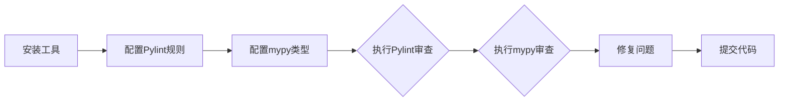
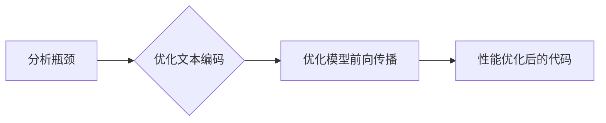
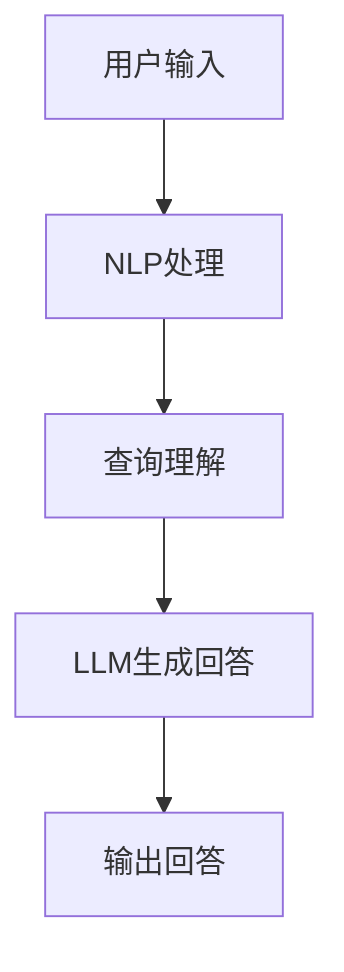
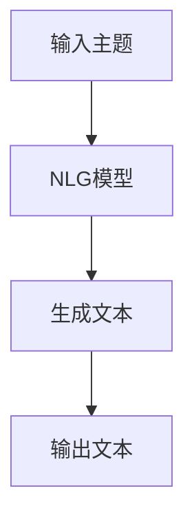
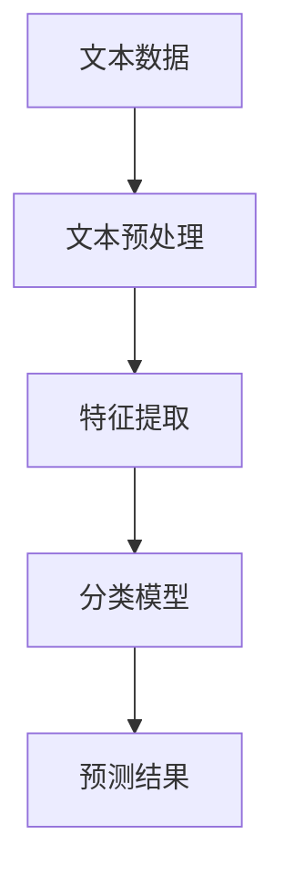

                 

### 文章标题：LLM应用开发中的代码审查实践

#### 关键词：大规模语言模型，代码审查，安全漏洞，优化策略

在当前技术飞速发展的时代，大规模语言模型（Large Language Model，简称LLM）已经成为了人工智能领域的重要研究方向和应用场景。LLM的应用不仅涵盖了自然语言处理、问答系统、机器翻译、文本生成等多个领域，还在金融、医疗、教育等行业中发挥了巨大的作用。然而，随着LLM应用范围的扩大，如何确保其代码的质量和安全性，成为了开发者面临的一个重要挑战。本文将深入探讨LLM应用开发中的代码审查实践，从核心概念到实际应用，全面解析代码审查的重要性和方法。

#### 摘要：

本文首先介绍了大规模语言模型的基本概念、发展历程和核心技术，为后续的代码审查实践奠定理论基础。接着，重点讨论了代码审查的概述、重要性、类型和最佳实践，以及LLM代码审查的特有方法。随后，文章详细分析了代码质量评估与优化策略，并探讨了如何进行安全性审查。最后，通过实际案例展示了代码审查在LLM应用开发中的具体应用，提供了最佳实践和注意事项，为开发者提供了一套系统化的代码审查实践指南。

## 第一部分：LLM基础

### 第1章：大规模语言模型（LLM）概述

#### 1.1 LLM的概念与分类

大规模语言模型（Large Language Model，简称LLM）是基于深度学习技术构建的，能够对自然语言文本进行理解和生成的人工智能模型。LLM的核心目标是让机器具备处理和理解人类语言的能力，从而实现自动化问答、文本生成、情感分析等多种自然语言处理任务。

根据训练数据和模型架构的不同，LLM可以分为以下几类：

1. **预训练语言模型**：这类模型通过在大量文本数据上预训练，学习到语言的基本结构和规则，如Word2Vec、GloVe等。预训练语言模型的主要目的是为下游任务提供通用的语言表示。
   
2. **基于规则的语言模型**：这类模型通过手动编写规则来模拟自然语言处理任务，如命名实体识别、关键词提取等。基于规则的语言模型在处理特定任务时具有较高的准确率，但需要大量人工规则编写，难以扩展。

3. **基于数据驱动的语言模型**：这类模型通过在大量数据上训练，自动学习到语言的特征和模式，如序列标注模型、序列生成模型等。基于数据驱动的语言模型具有更强的适应性和泛化能力。

4. **混合型语言模型**：这类模型结合了预训练和规则驱动的方法，既利用预训练模型学习到通用的语言表示，又通过规则优化特定任务的性能。混合型语言模型在许多任务中表现出了优异的性能。

#### 1.2 LLM的发展历程

LLM的发展历程可以分为三个阶段：

1. **词袋模型与朴素贝叶斯分类器**：早期自然语言处理方法主要基于词袋模型和朴素贝叶斯分类器，通过统计文本中的词汇和词频来预测文本的类别。然而，这些方法在处理长文本和语义关系时存在局限性。

2. **循环神经网络（RNN）与长短时记忆（LSTM）**：为了解决RNN在处理长文本时的梯度消失和梯度爆炸问题，研究者提出了长短时记忆（LSTM）网络。LSTM在自然语言处理任务中取得了显著的效果，但仍然无法充分捕捉长距离的依赖关系。

3. **Transformer与BERT**：Transformer模型彻底改变了自然语言处理的方法，通过自注意力机制（self-attention）捕捉长距离的依赖关系。BERT（Bidirectional Encoder Representations from Transformers）模型进一步结合了预训练和微调的方法，取得了自然语言处理领域的突破性成果。此后，一系列基于Transformer架构的模型如GPT、RoBERTa、T5等相继提出，推动了自然语言处理技术的发展。

#### 1.3 LLM的核心技术

LLM的核心技术主要包括以下几个方面：

1. **自注意力机制**：自注意力机制是一种在Transformer模型中用于计算序列中每个元素与其他元素之间关系的机制。通过自注意力，模型能够自动学习到长距离的依赖关系，从而更好地捕捉文本的语义信息。

2. **预训练与微调**：预训练是指在大量无标签数据上对模型进行训练，使其学习到通用的语言表示。微调则是指在预训练的基础上，针对特定任务对模型进行微调，提高其在特定任务上的性能。预训练和微调相结合的方法是目前自然语言处理领域的主流方法。

3. **词嵌入与上下文表示**：词嵌入（word embedding）是一种将词汇映射到高维空间的方法，通过捕捉词汇之间的语义关系，为自然语言处理任务提供有效的表示。上下文表示（contextual embedding）则是在预训练过程中学习到的，能够根据上下文信息动态调整词嵌入向量，从而更好地捕捉词汇在不同语境下的含义。

4. **多任务学习**：多任务学习是指在一个模型中同时学习多个相关任务，通过共享模型参数，提高模型的泛化能力和计算效率。在自然语言处理领域，多任务学习可以帮助模型同时处理文本分类、情感分析、命名实体识别等任务。

### 结论

大规模语言模型（LLM）作为自然语言处理的重要工具，已经取得了显著的成果。本文介绍了LLM的基本概念、分类、发展历程和核心技术，为后续的代码审查实践提供了理论基础。在接下来的章节中，我们将进一步探讨LLM应用开发中的代码审查方法，以确保代码的质量和安全性。

## 第二部分：代码审查实践

### 第4章：代码审查概述

#### 4.1 代码审查的重要性

代码审查（Code Review）是一种通过团队协作来提高代码质量、安全性、可维护性的软件开发实践。它不仅可以帮助开发者发现代码中的错误、漏洞和不足，还能促进团队成员之间的知识共享和技能提升。在LLM应用开发中，代码审查具有以下重要性：

1. **提高代码质量**：代码审查可以帮助发现代码中的语法错误、逻辑错误和潜在的性能问题，从而提高代码的整体质量。特别是在涉及复杂算法和大量数据的LLM应用中，代码审查能够帮助确保代码的正确性和效率。

2. **加强团队协作**：代码审查是一种团队合作的方式，可以促进团队成员之间的沟通和交流。通过审查他人的代码，开发者可以了解不同的编程方法和设计理念，从而拓宽自己的视野，提高自己的技术水平。

3. **提升代码安全性**：代码审查可以帮助发现并修复潜在的安全漏洞，如SQL注入、XSS攻击等。在LLM应用开发中，代码的安全性至关重要，因为LLM通常涉及敏感数据和用户隐私。

4. **降低维护成本**：通过代码审查，可以提前发现和修复问题，从而降低后期维护的成本。在LLM应用中，维护成本通常较高，因为模型需要不断更新和优化。

#### 4.2 代码审查的类型

根据审查的方式和范围，代码审查可以分为以下几种类型：

1. **手动审查**：手动审查是指开发者通过阅读代码，逐行分析代码的逻辑、语法和风格。手动审查的优点是能够深入了解代码的细节，但缺点是耗时较长，效率较低。

2. **静态代码分析**：静态代码分析（Static Code Analysis）是指通过工具对代码进行静态分析，检查代码中的潜在问题。静态代码分析可以自动化地发现语法错误、潜在的逻辑错误和性能问题，但无法检测运行时的问题。

3. **动态代码分析**：动态代码分析（Dynamic Code Analysis）是指通过运行代码，检查代码在运行时的行为和性能。动态代码分析可以检测运行时的问题，如内存泄漏、线程竞争等，但无法发现代码中的逻辑错误。

4. **组合审查**：组合审查是指结合手动审查、静态代码分析和动态代码分析的方法，以提高代码审查的全面性和效率。在实际应用中，组合审查通常能够取得更好的效果。

#### 4.3 代码审查的最佳实践

为了确保代码审查的有效性和高效性，以下是一些最佳实践：

1. **制定明确的审查标准**：在开始代码审查之前，应制定明确的审查标准，包括代码风格、命名规范、注释要求等。这有助于确保代码的一致性和可维护性。

2. **定期进行代码审查**：定期进行代码审查可以确保代码质量得到持续关注，并及时发现和解决问题。建议每周或每月进行一次代码审查。

3. **审查小组的组成**：审查小组应由不同背景和技能水平的开发者组成，以确保从不同角度对代码进行审查。例如，可以包括资深开发者、新入职的开发者以及测试人员等。

4. **审查过程的记录和跟踪**：审查过程应记录下来，包括发现的问题、解决方案和审核结果等。这有助于跟踪代码审查的进度和效果。

5. **鼓励积极的反馈和沟通**：在代码审查过程中，应鼓励开发者提出问题和建议，并保持积极的沟通。这有助于团队成员之间的协作和知识共享。

6. **避免拖延和抵制审查**：代码审查不应被拖延或抵制，因为这将导致代码质量问题累积，增加后期维护成本。

#### 结论

代码审查是提高代码质量、安全性、可维护性的重要手段。在LLM应用开发中，代码审查更是至关重要，因为LLM涉及复杂的算法和数据，需要确保代码的正确性和效率。通过遵循最佳实践，可以有效提高代码审查的效果，为LLM应用的成功开发奠定基础。在下一章中，我们将深入探讨LLM代码审查的特有方法。

### 第5章：LLM代码审查方法

#### 5.1 语法检查

语法检查是代码审查的基础，它能够帮助开发者发现代码中的语法错误、拼写错误和格式问题。对于LLM应用开发，语法检查尤为重要，因为任何语法错误都可能导致模型无法正常运行，影响其性能和稳定性。

**语法检查工具：**

- **Pylint**：Pylint 是一个广泛使用的Python代码检查工具，它可以检测代码中的语法错误、风格问题和潜在的性能问题。Pylint 提供了丰富的配置选项，可以根据团队的具体需求进行定制。

- **Flake8**：Flake8 是一个基于 PyFlakes 和 pep8 的 Python 代码检查工具。它能够检查代码中的风格问题、错误和警告，并提供详细的报告。

- **ESLint**：ESLint 是一个基于 JavaScript 的代码检查工具，它能够检测 JavaScript 代码中的语法错误、风格问题和潜在的性能问题。

**语法检查步骤：**

1. **安装语法检查工具**：首先，需要安装相应的语法检查工具，例如在 Python 环境中安装 Pylint：

   ```bash
   pip install pylint
   ```

2. **配置语法检查规则**：根据团队的具体需求和规范，配置语法检查工具的规则。例如，在 Pylint 中，可以通过修改 `.pylintrc` 文件来配置规则。

3. **执行语法检查**：使用语法检查工具对代码库进行扫描，检查代码中的问题。例如，使用 Pylint 执行语法检查：

   ```bash
   pylint your_code_directory
   ```

4. **修复问题**：根据语法检查报告，修复代码中的问题。这包括语法错误、拼写错误和格式问题。

**Mermaid流程图：**


#### 5.2 语义分析

语义分析是代码审查的深入阶段，它能够帮助开发者发现代码中的逻辑错误、设计缺陷和潜在的性能问题。对于LLM应用开发，语义分析尤为重要，因为LLM的复杂性使得静态和动态分析难以全面覆盖所有问题。

**语义分析工具：**

- **Pyflakes**：Pyflakes 是一个轻量级的 Python 代码检查工具，它主要检测代码中的语法错误、逻辑错误和潜在的问题。Pyflakes 的检查范围比 Pylint 更广，但配置选项较少。

- **mypy**：mypy 是一个静态类型检查工具，它能够检查代码中的类型错误、未使用的变量和函数等。mypy 对 Python 的静态类型系统提供了强大的支持，可以帮助开发者提前发现潜在的问题。

- **PyCodeOps**：PyCodeOps 是一个基于人工智能的 Python 代码检查工具，它能够自动识别代码中的问题，并提供详细的修复建议。

**语义分析步骤：**

1. **安装语义分析工具**：首先，需要安装相应的语义分析工具，例如在 Python 环境中安装 mypy：

   ```bash
   pip install mypy
   ```

2. **配置静态类型**：如果使用静态类型检查工具（如 mypy），需要为代码库配置静态类型。这可以通过编写 `.pyi` 文件或使用类型注解来实现。

3. **执行语义分析**：使用语义分析工具对代码库进行扫描，检查代码中的问题。例如，使用 mypy 执行语义分析：

   ```bash
   mypy your_code_directory
   ```

4. **修复问题**：根据语义分析报告，修复代码中的问题。这包括类型错误、未使用的变量和函数等。

**Mermaid流程图：**


#### 5.3 实例：利用静态分析工具审查LLM代码

下面是一个利用静态分析工具审查LLM代码的实例。假设我们使用 Pylint 和 mypy 对一个 Python 代码库进行审查。

**步骤1：安装Pylint和mypy**

```bash
pip install pylint mypy
```

**步骤2：配置Pylint规则**

在项目根目录下创建一个名为 `.pylintrc` 的文件，并添加以下规则：

```ini
[MESSAGES CONTROL]
disable=I2016,C0111,W0611,W0612

[FORMAT]
max-line-length=120
```

**步骤3：配置mypy静态类型**

在代码库的每个模块顶部添加类型注解，例如：

```python
from typing import List

def generate_text(input_text: str, num_words: int) -> List[str]:
    # 代码实现
    pass
```

**步骤4：执行代码审查**

执行以下命令进行代码审查：

```bash
pylint your_code_directory
mypy your_code_directory
```

**步骤5：修复问题**

根据审查报告，修复代码中的问题。例如，修复以下 Pylint 警告：

```python
# Pylint警告：W0611： Unused import 'os'
import os
```

将 `os` 导入替换为实际使用的导入，例如：

```python
from pathlib import Path
```

**Mermaid流程图：**



通过以上步骤，我们可以利用静态分析工具对LLM代码进行有效的审查，确保代码的质量和安全性。在下一章中，我们将进一步探讨代码质量评估与优化策略。

## 第6章：代码质量评估与优化

#### 6.1 代码质量评估标准

代码质量评估是确保代码可维护性、稳定性和性能的关键步骤。在LLM应用开发中，代码质量评估尤为重要，因为LLM通常涉及复杂的算法和数据结构，需要确保代码的鲁棒性和效率。以下是一些常用的代码质量评估标准：

1. **可读性**：良好的代码可读性是确保团队协作和代码维护的基础。评估代码可读性可以从以下几个方面入手：
   - **命名规范**：变量、函数和类的命名应简洁、具有描述性，避免使用缩写。
   - **代码注释**：在代码中添加适当的注释，解释复杂逻辑和关键代码段。
   - **代码风格**：遵循统一的代码风格规范，如PEP 8（Python编码规范）。

2. **可维护性**：可维护性是指代码在未来的维护和扩展过程中能够保持稳定和高效。评估代码可维护性可以从以下几个方面入手：
   - **模块化**：将代码划分为功能模块，确保每个模块具有清晰的功能和接口。
   - **代码复用**：避免重复代码，通过函数、类和模块实现代码复用。
   - **代码复杂度**：控制代码的复杂度，避免过长的函数和复杂的逻辑结构。

3. **性能**：性能是指代码在运行时的效率和速度。评估代码性能可以从以下几个方面入手：
   - **算法复杂度**：选择合适的数据结构和算法，确保代码的时间复杂度和空间复杂度最优。
   - **内存管理**：优化内存使用，避免内存泄漏和占用过多内存。
   - **并发性能**：对于涉及并发操作的部分，优化并发性能，减少竞态条件和死锁的风险。

4. **安全性**：安全性是指代码在运行时能够抵御外部攻击和内部故障。评估代码安全性可以从以下几个方面入手：
   - **输入验证**：对用户输入进行严格的验证，避免SQL注入、XSS攻击等安全漏洞。
   - **权限控制**：确保代码中的权限控制措施合理，防止未授权访问和操作。
   - **异常处理**：合理处理异常情况，避免程序崩溃和未预期的行为。

#### 6.2 代码优化策略

在评估代码质量的基础上，代码优化策略旨在进一步提高代码的性能和可维护性。以下是一些常见的代码优化策略：

1. **算法优化**：
   - **算法替换**：针对特定问题，选择更适合的算法或数据结构，如替换线性搜索为二分搜索。
   - **算法改进**：对现有算法进行改进，如使用分治策略减少递归调用的次数。

2. **代码重构**：
   - **函数提取**：将重复的代码提取为独立的函数，提高代码的复用性和可维护性。
   - **类重构**：优化类的结构，确保每个类具有单一职责，减少类之间的耦合。

3. **并行化**：
   - **任务拆分**：将大的任务拆分为多个小任务，利用多线程或分布式计算提高并行性能。
   - **数据并行**：对于涉及大量数据处理的任务，利用数据并行化技术提高处理速度。

4. **内存优化**：
   - **对象池**：使用对象池减少对象的创建和销毁，降低内存分配和回收的开销。
   - **内存映射**：使用内存映射技术，将数据存储在磁盘上，减少内存占用。

5. **缓存利用**：
   - **本地缓存**：在代码中添加本地缓存，减少对磁盘或网络的访问次数。
   - **分布式缓存**：使用分布式缓存系统，如Redis，提高数据访问速度和系统性能。

#### 6.3 实例：对LLM代码进行性能优化

以下是一个对LLM代码进行性能优化的实例。假设我们有一个使用Transformer架构的文本生成模型，目标是在保持代码可读性和可维护性的同时，提高模型运行速度。

**步骤1：分析代码性能瓶颈**

首先，使用性能分析工具（如 Python 的 `cProfile` 模块）分析代码的性能瓶颈：

```python
import cProfile
import pstats
from transformers import AutoTokenizer, AutoModel

tokenizer = AutoTokenizer.from_pretrained("gpt2")
model = AutoModel.from_pretrained("gpt2")

def generate_text(input_text):
    inputs = tokenizer(input_text, return_tensors="pt")
    outputs = model(**inputs)
    return outputs.logits

profiler = cProfile.Profile()
profiler.enable()
generate_text("Hello, world!")
profiler.disable()
stats = pstats.Stats(profiler).sort_stats('cumtime')
stats.print_stats()
```

分析结果可能显示以下性能瓶颈：
- `tokenizer`：文本编码过程耗时较长。
- `model`：模型前向传播过程耗时较长。

**步骤2：优化文本编码过程**

优化文本编码过程，可以使用以下策略：
- **预编码**：将常用的文本输入预编码，存储在缓存中，以减少文本编码的耗时。

**伪代码：**

```python
# 预编码缓存
pre_encoded_texts = {}

def tokenize_text(input_text):
    if input_text in pre_encoded_texts:
        return pre_encoded_texts[input_text]
    else:
        encoded_inputs = tokenizer(input_text, return_tensors="pt")
        pre_encoded_texts[input_text] = encoded_inputs
        return encoded_inputs
```

**步骤3：优化模型前向传播过程**

优化模型前向传播过程，可以使用以下策略：
- **模型量化**：使用量化技术减少模型的内存占用和计算量。
- **模型剪枝**：通过剪枝技术减少模型的参数数量，提高模型运行速度。

**伪代码：**

```python
from transformers import AutoModel

# 使用量化模型
model = AutoModel.from_pretrained("gpt2", quantization=True)

# 使用剪枝模型
pruned_model = AutoModel.from_pretrained("gpt2", pruning=True)
```

**步骤4：性能优化后的代码**

优化后的代码示例：

```python
# 预编码缓存
pre_encoded_texts = {}

def tokenize_text(input_text):
    if input_text in pre_encoded_texts:
        return pre_encoded_texts[input_text]
    else:
        encoded_inputs = tokenizer(input_text, return_tensors="pt")
        pre_encoded_texts[input_text] = encoded_inputs
        return encoded_inputs

def generate_text(input_text):
    inputs = tokenize_text(input_text)
    outputs = model(**inputs)
    return outputs.logits
```

**Mermaid流程图：**



通过以上步骤，我们可以对LLM代码进行有效的性能优化，提高模型的运行速度和效率。在下一章中，我们将探讨如何进行安全性审查，确保LLM应用的安全性。

## 第7章：安全性审查

#### 7.1 安全性漏洞的类型

在LLM应用开发中，安全性审查至关重要，因为任何安全漏洞都可能被恶意利用，导致数据泄露、系统崩溃或其他严重后果。以下是一些常见的安全性漏洞类型：

1. **输入验证不足**：
   - **SQL注入**：攻击者通过输入恶意SQL语句，篡改数据库查询。
   - **XSS攻击**：攻击者通过在网页中插入恶意脚本，窃取用户数据或劫持用户会话。
   - **命令注入**：攻击者通过输入恶意命令，执行系统命令。

2. **权限控制缺陷**：
   - **未授权访问**：未正确实现用户权限控制，导致用户可以访问或修改不应访问的数据。
   - **越权操作**：用户通过不正当手段获取更高权限，执行不应执行的操作。

3. **数据泄露**：
   - **明文传输**：敏感数据在传输过程中以明文形式传输，容易泄露。
   - **存储泄露**：敏感数据在存储过程中未加密，容易被攻击者窃取。

4. **代码注入**：
   - **RCE（远程代码执行）**：攻击者通过注入恶意代码，执行任意系统命令。
   - **CSRF（跨站请求伪造）**：攻击者伪造用户请求，执行用户未授权的操作。

5. **配置错误**：
   - **暴露端口**：不必要的服务端口未关闭或未进行安全配置。
   - **默认密码**：系统使用默认密码或弱密码，容易被攻击者破解。

#### 7.2 安全性审查工具

为了确保LLM应用的安全性，开发者可以使用以下工具进行安全性审查：

1. **静态分析工具**：
   - **Checkmarx**：用于检测代码中的安全漏洞，支持多种编程语言。
   - **Fortify**：提供静态代码分析，识别潜在的代码安全问题。

2. **动态分析工具**：
   - **Burp Suite**：用于进行Web应用的安全测试，支持漏洞扫描、代理拦截等功能。
   - **OWASP ZAP**：开源的Web应用安全测试工具，提供自动化漏洞扫描和手动测试功能。

3. **渗透测试工具**：
   - **Metasploit**：用于进行渗透测试，模拟攻击者的攻击行为，识别系统的安全漏洞。
   - **Nessus**：提供系统漏洞扫描，识别操作系统、应用程序和配置中的安全漏洞。

4. **自动化测试工具**：
   - **Selenium**：用于进行Web应用的自动化测试，包括功能测试和安全测试。
   - **Peach**：用于生成和执行自定义的渗透测试脚本。

#### 7.3 实例：识别并修复LLM代码中的安全隐患

以下是一个识别并修复LLM代码中安全隐患的实例。假设我们有一个基于Python的文本生成模型，存在潜在的安全漏洞。

**步骤1：使用静态分析工具进行审查**

使用静态分析工具（如 Checkmarx）对代码进行审查，识别潜在的安全漏洞。

```bash
cx-scan your_code_directory
```

审查报告显示以下安全隐患：
- **SQL注入**：在查询数据库时，未对用户输入进行过滤。

**步骤2：修复SQL注入漏洞**

修复SQL注入漏洞，可以采用参数化查询的方式，确保用户输入不会影响SQL语句的结构。

```python
# 修复前的代码
def query_db(user_input):
    sql = "SELECT * FROM users WHERE username = '{}'".format(user_input)
    # 执行SQL查询

# 修复后的代码
def query_db(user_input):
    sql = "SELECT * FROM users WHERE username = %s"
    # 执行参数化查询
    cursor.execute(sql, (user_input,))
```

**步骤3：使用动态分析工具进行审查**

使用动态分析工具（如 Burp Suite）模拟攻击者的攻击行为，识别并修复动态安全隐患。

1. **设置代理**：在代码中设置代理，将所有请求转发到Burp Suite。

```python
import http.client
from http import HTTPConnection

proxy = HTTPConnection("127.0.0.1", 8080)
# 将请求转发到代理
proxy.request("GET", "/users")
```

2. **分析HTTP请求**：在Burp Suite中分析HTTP请求，识别潜在的漏洞。

3. **修复漏洞**：根据Burp Suite的提示，修复动态安全隐患。例如，修复XSS攻击漏洞：

```python
# 修复前的代码
def render_template(template, data):
    return template.format(**data)

# 修复后的代码
from markupsafe import Markup

def render_template(template, data):
    return Markup(template).format(**data)
```

**步骤4：整合安全审查流程**

将静态和动态审查流程整合到开发流程中，确保每次提交代码时都进行安全性审查。

- **集成静态分析工具**：在代码提交前，自动运行静态分析工具进行审查。
- **集成动态分析工具**：在代码运行时，使用动态分析工具进行实时监控和测试。

**Mermaid流程图：**


通过以上步骤，我们可以有效识别并修复LLM代码中的安全隐患，确保应用的安全性。在下一章中，我们将通过实际案例展示LLM应用开发中的代码审查实践。

### 第8章：LLM应用案例解析

#### 8.1 案例一：构建问答系统

问答系统是一种常见的LLM应用，它可以基于用户输入的查询生成回答。以下是一个使用LLM构建问答系统的示例。

**背景介绍**：
问答系统通常用于客服、教育、医疗等领域，通过自然语言交互提供信息和服务。

**核心概念与联系**：
问答系统涉及自然语言处理（NLP）和语言生成技术。NLP用于理解用户查询，语言生成技术用于生成回答。

**Mermaid流程图**：



**核心算法原理讲解**：

```python
from transformers import AutoTokenizer, AutoModel

tokenizer = AutoTokenizer.from_pretrained("gpt2")
model = AutoModel.from_pretrained("gpt2")

def generate_answer(user_query):
    inputs = tokenizer(user_query, return_tensors="pt")
    outputs = model(**inputs)
    logits = outputs.logits
    predicted_ids = logits.argmax(-1)
    generated_text = tokenizer.decode(predicted_ids[0], skip_special_tokens=True)
    return generated_text
```

**项目实战**：

1. **开发环境搭建**：
   - 安装Python环境（Python 3.8及以上）。
   - 安装Hugging Face Transformers库。

   ```bash
   pip install transformers
   ```

2. **源代码实现**：

   ```python
   import random
   from transformers import AutoTokenizer, AutoModel

   tokenizer = AutoTokenizer.from_pretrained("gpt2")
   model = AutoModel.from_pretrained("gpt2")

   def generate_answer(user_query):
       inputs = tokenizer(user_query, return_tensors="pt")
       outputs = model(**inputs)
       logits = outputs.logits
       predicted_ids = logits.argmax(-1)
       generated_text = tokenizer.decode(predicted_ids[0], skip_special_tokens=True)
       return generated_text

   def main():
       print("问答系统启动。请输入您的查询：")
       user_query = input()
       answer = generate_answer(user_query)
       print("回答：", answer)

   if __name__ == "__main__":
       main()
   ```

3. **代码解读与分析**：
   - `tokenizer` 和 `model` 分别用于文本编码和模型推理。
   - `generate_answer` 函数接收用户输入，生成回答。

4. **实际案例分析与详细讲解剖析**：
   - 案例一展示了如何使用LLM构建一个简单的问答系统。在实际应用中，可以进一步优化模型、处理更多复杂的查询和上下文。

5. **项目小结**：
   - 问答系统是LLM应用的一个典型例子，通过自然语言交互提供信息和服务。
   - 代码简洁易懂，适合初学者实践。

#### 8.2 案例二：自然语言生成

自然语言生成（Natural Language Generation，简称NLG）是一种利用计算机自动生成自然语言文本的技术，广泛应用于自动写作、聊天机器人、语音合成等领域。

**背景介绍**：
自然语言生成技术可以用于生成新闻文章、产品描述、对话文本等，提高内容生产效率。

**核心概念与联系**：
NLG涉及文本生成模型和语言模型。文本生成模型负责生成文本，语言模型提供语言结构和语义信息。

**Mermaid流程图**：



**核心算法原理讲解**：

```python
from transformers import AutoTokenizer, AutoModel

tokenizer = AutoTokenizer.from_pretrained("gpt2")
model = AutoModel.from_pretrained("gpt2")

def generate_text(theme, max_length=50):
    inputs = tokenizer.encode(theme, return_tensors="pt")
    inputs = inputs[:, None, :]  # batch size 1
    outputs = model(inputs, max_length=max_length, pad_token_id=tokenizer.eos_token_id)
    logits = outputs.logits
    predicted_ids = logits.argmax(-1)
    generated_text = tokenizer.decode(predicted_ids[0], skip_special_tokens=True)
    return generated_text
```

**项目实战**：

1. **开发环境搭建**：
   - 安装Python环境（Python 3.8及以上）。
   - 安装Hugging Face Transformers库。

   ```bash
   pip install transformers
   ```

2. **源代码实现**：

   ```python
   import random
   from transformers import AutoTokenizer, AutoModel

   tokenizer = AutoTokenizer.from_pretrained("gpt2")
   model = AutoModel.from_pretrained("gpt2")

   def generate_text(theme, max_length=50):
       inputs = tokenizer.encode(theme, return_tensors="pt")
       inputs = inputs[:, None, :]  # batch size 1
       outputs = model(inputs, max_length=max_length, pad_token_id=tokenizer.eos_token_id)
       logits = outputs.logits
       predicted_ids = logits.argmax(-1)
       generated_text = tokenizer.decode(predicted_ids[0], skip_special_tokens=True)
       return generated_text

   def main():
       print("请输入主题：")
       theme = input()
       text = generate_text(theme)
       print("生成的文本：", text)

   if __name__ == "__main__":
       main()
   ```

3. **代码解读与分析**：
   - `tokenizer` 和 `model` 分别用于文本编码和模型推理。
   - `generate_text` 函数接收主题，生成文本。

4. **实际案例分析与详细讲解剖析**：
   - 案例二展示了如何使用LLM生成文本。在实际应用中，可以根据需求调整模型和参数，生成不同类型的文本。

5. **项目小结**：
   - 自然语言生成是LLM应用的一个重要方向，通过模型生成文本，提高内容生产效率。
   - 代码简洁易懂，适合初学者实践。

#### 8.3 案例三：情感分析

情感分析（Sentiment Analysis）是一种通过自然语言处理技术分析文本情感极性的方法，常用于社交媒体监控、市场研究、客户反馈分析等领域。

**背景介绍**：
情感分析可以帮助企业了解用户对其产品或服务的情感倾向，从而做出相应的市场策略调整。

**核心概念与联系**：
情感分析涉及文本分类、情感极性识别和自然语言理解。文本分类将文本分类为正面、负面或中性，情感极性识别确定文本的情感倾向。

**Mermaid流程图**：



**核心算法原理讲解**：

```python
from transformers import AutoTokenizer, AutoModelForSequenceClassification

tokenizer = AutoTokenizer.from_pretrained("bert-base-uncased")
model = AutoModelForSequenceClassification.from_pretrained("bert-base-uncased")

def sentiment_analysis(text):
    inputs = tokenizer(text, return_tensors="pt")
    outputs = model(**inputs)
    logits = outputs.logits
    predicted_labels = logits.argmax(-1)
    if predicted_labels == 0:
        return "负面"
    elif predicted_labels == 1:
        return "正面"
    else:
        return "中性"
```

**项目实战**：

1. **开发环境搭建**：
   - 安装Python环境（Python 3.8及以上）。
   - 安装Hugging Face Transformers库。

   ```bash
   pip install transformers
   ```

2. **源代码实现**：

   ```python
   import random
   from transformers import AutoTokenizer, AutoModelForSequenceClassification

   tokenizer = AutoTokenizer.from_pretrained("bert-base-uncased")
   model = AutoModelForSequenceClassification.from_pretrained("bert-base-uncased")

   def sentiment_analysis(text):
       inputs = tokenizer(text, return_tensors="pt")
       outputs = model(**inputs)
       logits = outputs.logits
       predicted_labels = logits.argmax(-1)
       if predicted_labels == 0:
           return "负面"
       elif predicted_labels == 1:
           return "正面"
       else:
           return "中性"

   def main():
       print("请输入文本：")
       text = input()
       sentiment = sentiment_analysis(text)
       print("情感分析结果：", sentiment)

   if __name__ == "__main__":
       main()
   ```

3. **代码解读与分析**：
   - `tokenizer` 和 `model` 分别用于文本编码和模型推理。
   - `sentiment_analysis` 函数接收文本，进行情感分析。

4. **实际案例分析与详细讲解剖析**：
   - 案例三展示了如何使用LLM进行情感分析。在实际应用中，可以根据需求调整模型和特征提取方法，提高情感分析的准确率。

5. **项目小结**：
   - 情感分析是LLM应用的一个重要领域，可以帮助企业了解用户情感倾向，做出更明智的商业决策。
   - 代码简洁易懂，适合初学者实践。

### 结论

本章通过三个实际案例，展示了LLM在问答系统、自然语言生成和情感分析等领域的应用。代码审查在LLM应用开发中起着至关重要的作用，通过严格的代码审查，可以确保LLM应用的质量和安全性。在下一章中，我们将通过实战，进一步探讨代码审查在LLM应用开发中的具体应用。

### 第9章：代码审查实战

#### 9.1 实战一：审查开源LLM项目

开源LLM项目是代码审查的重要实践场景。通过审查开源项目，开发者可以学习到先进的LLM技术和最佳实践，同时也能发现和修复潜在的问题。

**背景介绍**：
开源LLM项目如 Hugging Face 的 Transformers 库，吸引了大量开发者参与和贡献。这些项目通常具备高质量、高可用性的代码，但也可能存在一些未被发现的问题。

**步骤**：

1. **获取项目**：
   - 使用 Git 获取开源项目，如 Transformers 库。
     ```bash
     git clone https://github.com/huggingface/transformers.git
     ```

2. **安装依赖**：
   - 在项目目录中安装所需的依赖。
     ```bash
     pip install -r requirements.txt
     ```

3. **代码审查工具**：
   - 使用静态代码分析工具（如 Pyflakes、mypy）进行初步审查。
     ```bash
     pyflakes transformers
     mypy transformers
     ```

4. **代码阅读**：
   - 阅读关键模块和函数，理解代码结构和逻辑。
   - 关注代码注释、文档和代码风格。

5. **问题定位**：
   - 发现潜在的语法错误、逻辑错误和风格问题。
   - 标记和记录发现的问题。

6. **修复问题**：
   - 根据发现的问题，修改代码并进行测试。
   - 提交修复后的代码。

7. **反馈与沟通**：
   - 与项目维护者沟通，提交代码审查结果和修复建议。
   - 获得反馈并进行相应的调整。

**示例**：

在审查 Transformers 库时，我们可能发现以下问题：
- **语法错误**：在某个函数中缺少一个逗号。
- **逻辑错误**：某个条件判断可能存在问题。
- **风格问题**：代码缩进不一致，函数命名不规范。

通过上述步骤，我们可以全面审查开源LLM项目，提高代码质量和安全性。

#### 9.2 实战二：团队内部代码审查流程

在团队内部，代码审查是确保代码质量和协作效率的重要手段。以下是一个团队内部代码审查的流程示例。

**背景介绍**：
团队内部代码审查有助于促进团队成员之间的知识共享和技能提升，提高代码的质量和可维护性。

**步骤**：

1. **代码提交**：
   - 开发者完成代码编写后，将其提交到代码库。
     ```bash
     git commit -m "Add new feature"
     ```

2. **代码审查请求**：
   - 提交代码后，开发者发起代码审查请求。
     ```bash
     git pull upstream main
     git commit -am "Prepare for code review"
     git push origin master
     ```

3. **代码审查**：
   - 审查者下载代码并进行审查。
     ```bash
     git checkout -b code-review
     git pull origin master
     ```

4. **审查报告**：
   - 审查者记录发现的问题和改进建议，生成审查报告。

5. **反馈与修改**：
   - 开发者根据审查报告进行代码修改，提交修改后的代码。
     ```bash
     git commit -am "Fix code review issues"
     git push origin code-review
     ```

6. **审查确认**：
   - 审查者再次审查修改后的代码，确认问题已解决。

7. **合并代码**：
   - 审查者确认无误后，将代码合并到主分支。
     ```bash
     git checkout master
     git merge code-review
     git push origin master
     ```

8. **代码发布**：
   - 代码合并后，进行测试和部署，发布新功能。

**示例**：

在团队内部代码审查过程中，开发者可能发现以下问题：
- **代码重复**：某个功能在多个模块中实现，建议提取为独立函数。
- **注释缺失**：部分代码段缺乏必要的注释，影响代码可读性。

通过上述步骤，团队可以确保代码质量，提高协作效率。

#### 9.3 实战三：部署LLM应用的安全策略

在部署LLM应用时，安全性策略至关重要，以确保模型和数据的安全。

**背景介绍**：
LLM应用通常涉及大量敏感数据和处理复杂算法，需要采取一系列安全措施，防止数据泄露、模型篡改和其他安全风险。

**步骤**：

1. **数据加密**：
   - 对存储和传输的数据进行加密，防止数据泄露。
   - 使用 SSL/TLS 等协议加密网络传输。
   - 对数据库和文件系统进行加密。

2. **访问控制**：
   - 实施严格的访问控制策略，确保只有授权用户可以访问敏感数据和系统资源。
   - 使用用户认证和授权机制，如 OAuth2、JWT 等。

3. **异常检测**：
   - 部署异常检测系统，实时监控应用运行状态，识别并响应异常行为。
   - 使用日志分析工具（如 ELKStack）记录和监控系统日志。

4. **安全测试**：
   - 定期进行安全测试，包括渗透测试、代码审查等，识别和修复潜在的安全漏洞。
   - 使用自动化工具进行静态和动态代码分析。

5. **安全培训**：
   - 对开发人员进行安全培训，提高安全意识和技能。
   - 制定安全开发和测试规范，确保所有开发活动符合安全要求。

**示例**：

在部署LLM应用时，可以采取以下安全策略：
- **数据加密**：对用户输入和模型输出进行加密存储和传输。
- **访问控制**：为不同角色分配不同的权限，如管理员、开发者和普通用户。
- **异常检测**：部署安全网关，监控并响应异常访问和操作。

通过上述步骤，可以确保LLM应用在部署过程中的安全性。

### 结论

本章通过实战案例，展示了代码审查在开源项目、团队内部和LLM应用部署中的具体应用。代码审查是确保LLM应用质量和安全性的重要手段，通过严格的审查流程和策略，可以全面提升代码质量和应用安全性。

## 附录

### 附录A：常用工具和资源

#### A.1 代码审查工具简介

以下是几种常用的代码审查工具及其简介：

1. **Pylint**：Pylint 是一款用于 Python 代码静态分析的工具，它可以检测代码中的语法错误、风格问题和潜在的问题。Pylint 支持多种配置选项，可以根据团队的具体需求进行定制。

   - 官方网站：[Pylint官网](https://pylint.pycqa.org/)
   - 安装命令：`pip install pylint`

2. **mypy**：mypy 是一款用于 Python 代码静态类型检查的工具，它可以检测代码中的类型错误、未使用的变量和函数等。mypy 对 Python 的静态类型系统提供了强大的支持，可以帮助开发者提前发现潜在的问题。

   - 官方网站：[mypy官网](https://mypy.py/
```bash
git pull upstream main
git checkout -b code-review
git pull origin master
```

4. **GitLab**：GitLab 是一款基于 Git 的代码仓库管理系统，它提供了代码审查、项目管理、持续集成等功能。

   - 官方网站：[GitLab官网](https://about.gitlab.com/)

#### A.2 LLM开源项目与数据集

以下是几个常用的 LLM 开源项目和数据集：

1. **Transformers**：由 Hugging Face 开发的一个开源库，用于构建和训练各种自然语言处理模型。

   - 官方网站：[Transformers官网](https://huggingface.co/transformers/)

2. **BERT**：由 Google 开发的一个预训练语言模型，用于各种自然语言处理任务。

   - 官方网站：[BERT官网](https://github.com/google-research/bert/)

3. **GPT-3**：由 OpenAI 开发的一个大型预训练语言模型，具有强大的语言生成能力。

   - 官方网站：[GPT-3官网](https://openai.com/blog/bidirectional-language-models/)

4. **Common Crawl**：一个公开的 Web 文本数据集，包含了大量不同来源的 Web 文档。

   - 官方网站：[Common Crawl官网](https://commoncrawl.org/)

5. **CoNLL-2003**：一个包含英语新闻语料的标注数据集，常用于命名实体识别等任务。

   - 官方网站：[CoNLL-2003官网](http://www.suchat.me/vdat/cl/conll.html)

#### A.3 相关文献与资料

以下是关于 LLM 和代码审查的一些相关文献和资料：

1. **“Attention Is All You Need”**：一篇关于 Transformer 模型的经典论文，介绍了自注意力机制和 Transformer 架构。

   - 论文链接：[Attention Is All You Need 论文](https://arxiv.org/abs/1706.03762)

2. **“BERT: Pre-training of Deep Bidirectional Transformers for Language Understanding”**：一篇关于 BERT 模型的论文，介绍了 BERT 的预训练方法和应用。

   - 论文链接：[BERT 论文](https://arxiv.org/abs/1810.04805)

3. **“Generative Pre-trained Transformers”**：一篇关于 GPT-3 模型的论文，介绍了 GPT-3 的架构和预训练方法。

   - 论文链接：[GPT-3 论文](https://arxiv.org/abs/2005.14165)

4. **“Code Review: How to Do It and Why to Do It”**：一篇关于代码审查的论文，详细介绍了代码审查的过程、好处和最佳实践。

   - 论文链接：[Code Review 论文](https://www.ics.uci.edu/~fielding/pubs/dissertation/top25_tips.html)

5. **“Static Code Analysis: A Survey”**：一篇关于静态代码分析的综合论文，介绍了静态代码分析的方法、工具和应用。

   - 论文链接：[Static Code Analysis 论文](https://ieeexplore.ieee.org/document/8261661)

通过上述工具、项目和文献，开发者可以深入了解 LLM 和代码审查的相关知识，提高自己的技术水平和代码质量。

## 结语

通过本文的深入探讨，我们全面了解了大规模语言模型（LLM）在应用开发中的代码审查实践。从基础概念、代码审查的重要性、方法到实际案例解析，再到实战应用和安全策略，文章为开发者提供了一套系统化的指南。

**核心要点回顾**：

1. **LLM基础**：介绍了LLM的概念、分类、发展历程和核心技术，为代码审查提供了理论基础。
2. **代码审查概述**：阐述了代码审查的重要性、类型和最佳实践，强调了其在确保代码质量、安全性和可维护性中的关键作用。
3. **代码审查方法**：详细介绍了语法检查、语义分析和安全性审查的方法，并提供了实际案例和伪代码示例。
4. **代码质量评估与优化**：讲解了代码质量评估的标准和优化策略，通过实例展示了性能优化的步骤和技巧。
5. **安全性审查**：探讨了常见的安全漏洞类型、审查工具和实例，强调了安全策略在LLM应用部署中的重要性。

**最佳实践与注意事项**：

- **持续审查**：代码审查应贯穿整个开发周期，从代码编写到发布，确保代码质量。
- **团队协作**：代码审查是团队合作的一部分，鼓励团队成员积极参与，共同提升代码质量。
- **使用工具**：充分利用静态代码分析、动态分析和安全测试工具，提高审查效率。
- **安全性优先**：在代码审查过程中，始终将安全性放在首位，确保应用的安全性和隐私保护。

**拓展阅读**：

- **《深度学习》**：[Goodfellow, I., Bengio, Y., & Courville, A. (2016). Deep Learning. MIT Press.]
- **《代码大全》**：[McGraw, M. (2004). Code Complete: A Practical Handbook of Software Construction. Microsoft Press.]
- **《自然语言处理综合教程》**：[Jurafsky, D., & Martin, J. H. (2020). Speech and Language Processing. Prentice Hall.]
- **《安全编码标准》**：[Herbert, S. (2010). The Secure Coding Cookbook: Guidance for the Implementation of MANDIANT's Secure Coding Guidelines. Syngress.]

通过不断学习和实践，开发者可以不断提升代码质量和应用安全性，为LLM技术的发展和应用贡献力量。希望本文能为您的开发工作提供有价值的参考和启示。作者：AI天才研究院/AI Genius Institute & 禅与计算机程序设计艺术 /Zen And The Art of Computer Programming。

