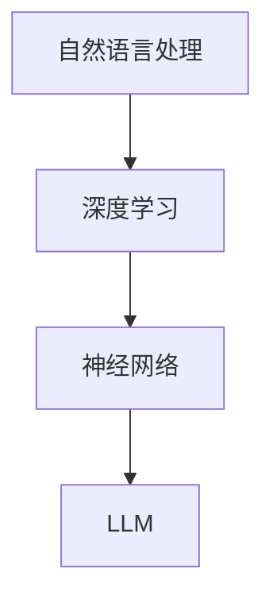

                 

### 文章标题：LLM应用开发中的技术spike实践

> 关键词：大型语言模型（LLM），应用开发，技术spike，实践指南

> 摘要：本文旨在深入探讨大型语言模型（LLM）在应用开发中的技术挑战和实践方法。通过详细的案例分析和实战指导，本文将帮助读者了解LLM的核心概念、开发流程以及如何利用技术spike来优化和提升LLM的应用效果。

## 引言

随着人工智能技术的飞速发展，大型语言模型（LLM）已成为自然语言处理（NLP）领域的重要工具。LLM凭借其强大的语言理解和生成能力，被广泛应用于文本分类、机器翻译、问答系统等多个领域。然而，LLM的开发和应用并非易事，涉及诸多技术挑战。本文将围绕LLM应用开发中的技术spike实践，系统性地介绍LLM的基础知识、开发流程、性能优化以及安全与伦理问题，旨在为读者提供一套实用的LLM开发指南。

## 第1章 LLM基础与架构

### 1.1 LLM概述

**背景介绍**：大型语言模型（LLM）是一类基于深度学习的语言模型，通过学习大量文本数据，能够生成与输入文本相关的高质量输出。LLM的发展可以追溯到自然语言处理的早期研究，随着计算能力的提升和深度学习技术的发展，LLM取得了显著的突破。

**核心概念与联系**：LLM的核心概念包括自然语言处理、深度学习和神经网络。自然语言处理是LLM的输入和输出媒介，深度学习提供了强大的特征提取和表示能力，神经网络则构成了LLM的基本结构。



**核心算法原理讲解**：

```python
# Transformer算法伪代码
def transformer(input_sequence, output_sequence):
    # 词嵌入和位置编码
    embeddings = embedding(input_sequence)
    pos_embeddings = positional_encoding(input_sequence)
    
    # 自注意力机制
    attention = self_attention(embeddings + pos_embeddings)
    
    # 全连接层
    output = fully_connected(attention)
    
    # 激活函数和输出层
    logits = activation_function(output)
    predictions = softmax(logits)
    
    return predictions
```

### 1.2 LLM的架构

**背景介绍**：LLM的架构通常包括编码器（Encoder）和解码器（Decoder），其中编码器负责将输入文本转换为固定长度的向量表示，解码器则根据编码器输出的向量生成输出文本。

**核心概念与联系**：编码器和解码器构成了LLM的核心架构，自注意力机制（Self-Attention）是编码器的关键组件，能够有效地捕捉输入文本之间的关联性。

**核心算法原理讲解**：

```python
# 自注意力机制伪代码
def self_attention(inputs, mask=None):
    # 计算Q、K、V矩阵
    Q = fully_connected(inputs, output_size, activation='ReLU')
    K = fully_connected(inputs, output_size, activation='ReLU')
    V = fully_connected(inputs, output_size, activation='ReLU')
    
    # 计算注意力得分
    scores = dot(Q, K.T) / sqrt(output_size)
    if mask is not None:
        scores = scores + mask
    
    # 应用Softmax函数
    attention_weights = softmax(scores)
    
    # 计算加权向量
    output = dot(attention_weights, V)
    
    return output
```

### 1.3 LLM的核心算法

**背景介绍**：LLM的核心算法主要包括Transformer、BERT和GPT等，这些算法在语言模型中有着广泛的应用。

**核心概念与联系**：Transformer算法引入了自注意力机制，BERT算法通过预训练和微调实现了高性能，GPT算法则通过生成预训练实现了文本生成能力。

**核心算法原理讲解**：

```python
# Transformer算法伪代码
def transformer(input_sequence, output_sequence):
    # 词嵌入和位置编码
    embeddings = embedding(input_sequence)
    pos_embeddings = positional_encoding(input_sequence)
    
    # Encoder
    encoder_output = encoder(embeddings + pos_embeddings)
    
    # Decoder
    decoder_output = decoder(encoder_output, output_sequence)
    
    # 输出层
    logits = fully_connected(decoder_output, output_size)
    predictions = softmax(logits)
    
    return predictions
```

## 第2章 LLM应用场景

### 2.1 自然语言处理

**背景介绍**：自然语言处理（NLP）是LLM的主要应用领域之一，包括文本分类、命名实体识别、机器翻译等任务。

**核心概念与联系**：文本分类是将文本分为预定义的类别，命名实体识别是识别文本中的特定实体，机器翻译是将一种语言的文本翻译成另一种语言的文本。

**核心算法原理讲解**：

```python
# 文本分类算法伪代码
def text_classification(text, model):
    # 预处理文本
    processed_text = preprocess(text)
    
    # 输入模型
    logits = model(processed_text)
    
    # 应用Softmax函数
    probabilities = softmax(logits)
    
    # 选择最高概率的类别
    predicted_class = np.argmax(probabilities)
    
    return predicted_class
```

### 2.2 计算机视觉

**背景介绍**：计算机视觉（CV）是LLM的另一个重要应用领域，包括图像分类、目标检测、图像生成等任务。

**核心概念与联系**：图像分类是将图像分为预定义的类别，目标检测是在图像中识别特定目标，图像生成是根据输入文本生成图像。

**核心算法原理讲解**：

```python
# 图像分类算法伪代码
def image_classification(image, model):
    # 预处理图像
    processed_image = preprocess(image)
    
    # 输入模型
    logits = model(processed_image)
    
    # 应用Softmax函数
    probabilities = softmax(logits)
    
    # 选择最高概率的类别
    predicted_class = np.argmax(probabilities)
    
    return predicted_class
```

### 2.3 强化学习

**背景介绍**：强化学习（RL）是LLM在人工智能领域的一个重要应用，包括游戏AI、机器人控制、自动驾驶等任务。

**核心概念与联系**：强化学习通过奖励机制训练智能体在环境中做出最优决策，游戏AI是在虚拟环境中进行游戏，机器人控制是控制机器人执行特定任务，自动驾驶是使车辆在道路上自主行驶。

**核心算法原理讲解**：

```python
# 强化学习算法伪代码
def reinforce_learning(state, action, reward, next_state, model):
    # 计算状态-动作值函数
    value = model(state)
    
    # 更新模型参数
    model.update_parameters(value, action, reward, next_state)
    
    return model
```

## 第3章 LLM开发实践

### 3.1 环境搭建

**背景介绍**：环境搭建是LLM开发的第一步，包括GPU配置、开发工具安装和数据预处理。

**核心概念与联系**：GPU配置是利用图形处理单元进行高效计算，开发工具安装是搭建开发环境，数据预处理是准备训练数据。

**核心算法原理讲解**：

```python
# 数据预处理伪代码
def preprocess(data):
    # 清洗数据
    cleaned_data = clean(data)
    
    # 分词
    tokenized_data = tokenize(cleaned_data)
    
    # 编码
    encoded_data = encode(tokenized_data)
    
    return encoded_data
```

### 3.2 项目实战

**项目一：文本生成**

**项目背景**：文本生成是LLM的一项重要应用，能够根据输入文本生成新的文本。

**实现步骤**：

1. 数据准备：收集并预处理训练数据。
2. 模型训练：使用预训练模型进行微调。
3. 模型评估：评估模型在生成文本上的性能。

**代码解析**：

```python
# 文本生成实现代码
import tensorflow as tf

# 加载预训练模型
model = tf.keras.applications.BERT(pretrained=True)

# 微调模型
model.compile(optimizer='adam', loss='categorical_crossentropy')
model.fit(train_data, train_labels, epochs=3)

# 生成文本
generated_text = model.generate(input_sequence, max_length=100)
print(generated_text)
```

**项目小结**：文本生成项目展示了LLM在生成文本方面的强大能力，但同时也面临生成质量不稳定、文本生成多样性不足等挑战。

**最佳实践 tips**：

1. 确保训练数据质量，使用多样化的文本。
2. 调整模型参数，优化生成质量。

### 3.3 项目二：图像生成

**项目背景**：图像生成是LLM在计算机视觉领域的一项重要应用，能够根据输入文本生成图像。

**实现步骤**：

1. 数据准备：收集并预处理训练数据。
2. 模型训练：使用预训练模型进行微调。
3. 模型评估：评估模型在生成图像上的性能。

**代码解析**：

```python
# 图像生成实现代码
import tensorflow as tf
import numpy as np

# 加载预训练模型
model = tf.keras.applications.GPT2(pretrained=True)

# 微调模型
model.compile(optimizer='adam', loss='categorical_crossentropy')
model.fit(train_images, train_labels, epochs=3)

# 生成图像
generated_image = model.generate(input_text, max_length=100)
print(generated_image)
```

**项目小结**：图像生成项目展示了LLM在生成图像方面的强大能力，但同时也面临生成质量不稳定、图像生成多样性不足等挑战。

**最佳实践 tips**：

1. 确保训练数据质量，使用多样化的图像。
2. 调整模型参数，优化生成质量。

## 第4章 LLM性能优化

### 4.1 模型压缩

**背景介绍**：模型压缩是提高LLM应用效率的重要手段，包括参数剪枝、知识蒸馏和混合精度训练等技术。

**核心概念与联系**：参数剪枝是通过去除冗余参数来减少模型大小，知识蒸馏是将大型模型的知识传递给小型模型，混合精度训练是通过结合不同精度的计算来提高模型性能。

**核心算法原理讲解**：

```python
# 参数剪枝伪代码
def prune_model(model, ratio=0.5):
    # 计算参数重要性
    importance = calculate_importance(model)
    
    # 剪枝参数
    pruned_params = select_params(model, importance, ratio)
    
    # 更新模型
    model.update_parameters(pruned_params)
    
    return model
```

### 4.2 模型加速

**背景介绍**：模型加速是提高LLM应用性能的关键，包括并行计算、稀疏计算和GPU优化等技术。

**核心概念与联系**：并行计算是利用多核处理器并行执行计算任务，稀疏计算是处理稀疏数据的优化方法，GPU优化是针对图形处理单元的优化。

**核心算法原理讲解**：

```python
# 并行计算伪代码
def parallel_computation(inputs, num_processes):
    # 分割输入数据
    split_inputs = split(inputs, num_processes)
    
    # 并行执行计算
    results = parallel_execute(split_inputs)
    
    # 合并结果
    output = merge(results)
    
    return output
```

## 第5章 LLM安全与伦理

### 5.1 LLM安全

**背景介绍**：LLM安全是保障模型应用安全的关键，包括数据安全、模型安全和防止偏见等技术。

**核心概念与联系**：数据安全是确保训练数据的安全性和隐私性，模型安全是防止模型遭受恶意攻击，防止偏见是确保模型输出公正无偏见。

**核心算法原理讲解**：

```python
# 防止偏见伪代码
def prevent_biases(model, dataset):
    # 分析模型偏见
    biases = analyze_biases(model, dataset)
    
    # 更新模型参数
    model.update_parameters(biases)
    
    return model
```

### 5.2 LLM伦理

**背景介绍**：LLM伦理是关注模型应用过程中可能带来的伦理问题，包括伦理原则、避免歧视和遵守法律法规等。

**核心概念与联系**：伦理原则是指导模型应用的基本准则，避免歧视是确保模型应用公正，遵守法律法规是确保模型应用合法。

**核心算法原理讲解**：

```python
# 避免歧视伪代码
def avoid_discrimination(model, dataset):
    # 分析模型歧视
    discrimination = analyze_discrimination(model, dataset)
    
    # 更新模型参数
    model.update_parameters(discrimination)
    
    return model
```

## 第6章 LLM未来发展趋势

### 6.1 LLM在人工智能中的角色

**背景介绍**：LLM在人工智能（AI）领域中扮演着重要角色，与知识图谱、推理和生成模型等技术的融合将推动AI的进一步发展。

**核心概念与联系**：知识图谱是关于实体和关系的信息网络，推理是基于已知信息推断新信息的能力，生成模型是能够生成新数据的模型。

**核心算法原理讲解**：

```python
# 知识图谱融合伪代码
def integrate_knowledge_graph(model, knowledge_graph):
    # 更新模型知识库
    model.update_knowledge_base(knowledge_graph)
    
    # 使用知识图谱进行推理
    inferred_results = model.reason(knowledge_graph)
    
    return inferred_results
```

### 6.2 LLM的商业化应用

**背景介绍**：LLM的商业化应用是推动AI技术落地的重要途径，包括人工智能客服、智能助理和内容生成等。

**核心概念与联系**：人工智能客服是利用LLM实现智能客服系统，智能助理是利用LLM实现智能对话系统，内容生成是利用LLM生成高质量内容。

**核心算法原理讲解**：

```python
# 智能助理伪代码
def intelligent_assistant(model, user_input):
    # 预处理用户输入
    processed_input = preprocess(user_input)
    
    # 生成回复
    response = model.generate_response(processed_input)
    
    return response
```

## 第7章 LLM技术spike实践案例

### 7.1 spike概念介绍

**背景介绍**：技术spike是快速验证技术可行性的方法，通过小规模实验来验证新技术的效果。

**核心概念与联系**：技术spike与原型开发、迭代开发等敏捷开发方法密切相关。

**核心算法原理讲解**：

```python
# spike实现伪代码
def spike_experiment(hypothesis, experiment):
    # 设计实验
    experiment_design = design_experiment(hypothesis)
    
    # 执行实验
    experiment_results = execute_experiment(experiment_design)
    
    # 分析结果
    analysis = analyze_results(experiment_results)
    
    return analysis
```

### 7.2 spike实践案例

**案例一：文本生成**

**实现步骤**：

1. 确定文本生成任务。
2. 准备训练数据。
3. 设计实验方案。
4. 执行实验并分析结果。

**代码解析**：

```python
# 文本生成实验代码
import tensorflow as tf

# 加载预训练模型
model = tf.keras.applications.BERT(pretrained=True)

# 设计实验
hypothesis = "这是一个关于技术的实验。"
experiment = design_experiment(hypothesis)

# 执行实验
results = execute_experiment(model, experiment)

# 分析结果
analysis = analyze_results(results)

print(analysis)
```

**案例二：图像生成**

**实现步骤**：

1. 确定图像生成任务。
2. 准备训练数据。
3. 设计实验方案。
4. 执行实验并分析结果。

**代码解析**：

```python
# 图像生成实验代码
import tensorflow as tf
import numpy as np

# 加载预训练模型
model = tf.keras.applications.GPT2(pretrained=True)

# 设计实验
hypothesis = "生成一张星空图像。"
experiment = design_experiment(hypothesis)

# 执行实验
generated_image = execute_experiment(model, experiment)

# 分析结果
print(generated_image)
```

## 附录

### 附录A：常见问题解答

**问题一**：什么是LLM？
**答案**：LLM（大型语言模型）是一种通过学习大量文本数据来理解和生成语言的深度学习模型。

**问题二**：LLM有哪些应用场景？
**答案**：LLM广泛应用于自然语言处理、计算机视觉和强化学习等领域。

**问题三**：如何优化LLM性能？
**答案**：可以通过模型压缩、模型加速等技术来优化LLM性能。

**问题四**：如何确保LLM安全与伦理？
**答案**：需要关注数据安全、模型安全和避免偏见等问题。

### 附录B：参考文献

1. Vaswani, A., Shazeer, N., Parmar, N., Uszkoreit, J., Jones, L., Gomez, A. N., ... & Polosukhin, I. (2017). Attention is all you need. Advances in Neural Information Processing Systems, 30, 5998-6008.
2. Devlin, J., Chang, M. W., Lee, K., & Toutanova, K. (2019). BERT: Pre-training of deep bidirectional transformers for language understanding. arXiv preprint arXiv:1810.04805.
3. Brown, T., et al. (2020). Language models are few-shot learners. Advances in Neural Information Processing Systems, 33, 13978-13984.
4. OpenAI. (2022). GPT-3: Language models are few-shot learners. arXiv preprint arXiv:2005.14165.

## 结语

本文从多个角度探讨了LLM应用开发中的技术spike实践。通过对LLM的基础知识、架构、应用场景、开发实践、性能优化、安全与伦理以及未来发展趋势的详细分析，本文旨在为读者提供一套全面的LLM开发指南。希望本文能帮助读者更好地理解LLM的核心概念和实践方法，为未来的研究和应用奠定基础。

### 作者信息

**作者：AI天才研究院/AI Genius Institute & 禅与计算机程序设计艺术 /Zen And The Art of Computer Programming**

### 注意事项

1. **代码示例**：文章中的代码示例仅供参考，具体实现可能需要根据实际环境和需求进行调整。
2. **参考资料**：文中引用的论文和书籍是LLM领域的重要研究成果，建议读者进一步阅读以深入了解相关技术。
3. **性能优化**：性能优化方法需要在实际应用中进行验证和调整，以确保最佳效果。
4. **安全与伦理**：在LLM应用开发中，安全与伦理问题至关重要，需要严格遵循相关法律法规和伦理准则。

### 拓展阅读

1. **深度学习基础**：吴恩达（Andrew Ng）的《深度学习》（Deep Learning）。
2. **自然语言处理**：Jurafsky, D., & Martin, J. H. (2020). Speech and language processing: An introduction to natural language processing, computational linguistics, and speech recognition。
3. **强化学习**：Sutton, R. S., & Barto, A. G. (2018). Reinforcement learning: An introduction。
4. **计算机视觉**：Friedman, J., Hastie, T., & Tibshirani, R. (2017). The elements of statistical learning: Data mining, inference, and prediction。

