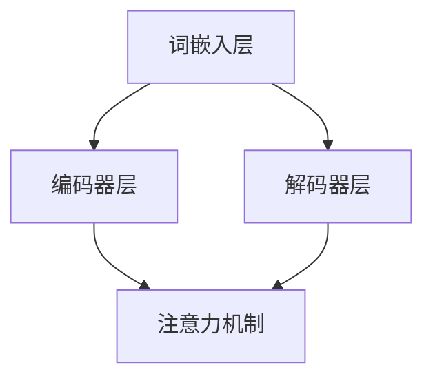

                 

### 文章标题

《LLM应用开发中的持续学习与改进》

### 关键词

大型语言模型（LLM），持续学习，算法改进，应用开发，数学模型

### 摘要

本文将深入探讨大型语言模型（LLM）在应用开发中的持续学习与改进。首先，我们将回顾LLM的定义、架构和核心概念，并通过Mermaid流程图展示其内在联系。接着，本文将详细讲解与持续学习与改进相关的核心算法原理，使用伪代码阐述并分析其优缺点。此外，我们将使用LaTeX格式嵌入文中独立段落，详细讲解并举例说明数学模型和公式。在项目实战部分，我们将展示代码实现、详细解读和实际案例分析，并提供最佳实践tips和小结。

---

# LLM应用开发中的持续学习与改进

## 引言

随着人工智能技术的不断发展，大型语言模型（LLM）已经成为自然语言处理（NLP）领域的重要工具。LLM在语言理解、文本生成、机器翻译等任务中表现出色，推动了NLP技术的进步。然而，为了保持LLM的性能和适应性，持续学习与改进变得至关重要。本文将围绕这一主题，详细探讨LLM应用开发中的持续学习与改进策略，帮助开发者更好地理解和应用这一技术。

## LLM概述

### 定义与核心概念

大型语言模型（LLM）是一种基于深度学习技术构建的语言模型，通过对海量文本数据进行训练，能够理解和生成自然语言。LLM的核心概念包括：

- **词嵌入**：将词汇映射到高维空间，使得语义相似的词汇在空间中距离较近。
- **注意力机制**：通过计算词汇之间的相关性，提高模型的上下文理解和生成能力。
- **序列到序列模型**：将输入序列映射到输出序列，实现文本生成。

### 架构与技术细节

LLM的架构通常包括以下几个层次：

1. **词嵌入层**：将词汇映射到高维空间，通过点积或加性交互生成嵌入向量。
2. **编码器层**：对输入序列进行处理，生成固定长度的编码表示。
3. **解码器层**：根据编码表示生成输出序列。
4. **注意力机制**：在编码器和解码器之间引入注意力机制，以提高上下文理解和生成能力。

Mermaid流程图如下：



## LLM的核心算法

### 算法原理

LLM的核心算法包括：

1. **循环神经网络（RNN）**：通过递归方式处理序列数据，能够捕捉长距离依赖关系。
2. **长短时记忆网络（LSTM）**：对RNN进行改进，解决梯度消失和梯度爆炸问题。
3. **门控循环单元（GRU）**：简化LSTM结构，同时保留其长时记忆能力。

以下是RNN的伪代码：

```python
def RNN(input_sequence, hidden_state):
    for input in input_sequence:
        hidden_state = tanh(W * [hidden_state, input])
        output = sigmoid(V * hidden_state)
    return output, hidden_state
```

### 算法优缺点分析

- **优点**：RNN和LSTM能够在处理序列数据时捕捉长距离依赖关系，适用于语言理解和生成任务。
- **缺点**：RNN容易发生梯度消失和梯度爆炸问题，LSTM和GRU虽然能够缓解这一问题，但其计算复杂度较高。

## 数学模型与公式

### 常用数学模型

LLM中常用的数学模型包括：

1. **词嵌入**：将词汇映射到高维空间，使用点积或加性交互生成嵌入向量。
2. **注意力机制**：计算词汇之间的相关性，提高上下文理解和生成能力。

以下是词嵌入的LaTeX公式：

$$
\text{word\_embedding}(x) = \sum_{i=1}^{n} w_i * x_i
$$

其中，$x$是词汇向量，$w$是权重向量。

### 公式讲解与举例

1. **词嵌入**：词嵌入将词汇映射到高维空间，使得语义相似的词汇在空间中距离较近。例如，对于词汇“狗”和“猫”，其词嵌入向量可能接近。

2. **注意力机制**：注意力机制通过计算词汇之间的相关性，提高上下文理解和生成能力。例如，在文本生成任务中，注意力机制可以帮助模型更好地捕捉上下文信息。

### 数学模型在LLM中的应用

数学模型在LLM中的应用包括：

1. **词嵌入**：在编码器和解码器中使用词嵌入，将词汇映射到高维空间，实现序列到序列的映射。
2. **注意力机制**：在编码器和解码器之间引入注意力机制，提高上下文理解和生成能力。

## LLM训练

### 训练过程

LLM的训练过程包括：

1. **数据预处理**：对原始文本数据进行清洗、分词和编码。
2. **模型初始化**：初始化编码器、解码器和词嵌入层的参数。
3. **前向传播**：根据输入序列和当前模型参数，计算输出序列和损失函数。
4. **反向传播**：更新模型参数，优化模型性能。

### 训练技巧

1. **数据增强**：通过数据增强技术，增加训练数据多样性，提高模型泛化能力。
2. **学习率调整**：根据模型性能动态调整学习率，避免过拟合。
3. **梯度裁剪**：防止梯度爆炸和消失，提高训练稳定性。

### 训练案例分析

以BERT模型为例，其训练过程包括：

1. **数据预处理**：使用大量未标注的文本数据，通过预训练生成大量的标注数据。
2. **模型初始化**：初始化BERT模型的编码器和解码器参数。
3. **前向传播**：在训练过程中，BERT模型根据输入序列和当前模型参数，计算输出序列和损失函数。
4. **反向传播**：通过反向传播算法，更新BERT模型的参数，优化模型性能。

## 持续学习与改进

### 持续学习的基本原理

持续学习是指模型在应用过程中，通过不断更新和优化模型参数，提高模型性能和适应性。持续学习的原理包括：

1. **在线学习**：模型在实时数据流中不断更新参数。
2. **迁移学习**：将预训练模型应用于新任务，通过微调优化模型性能。
3. **增量学习**：在原有模型基础上，添加新数据或新任务，优化模型性能。

### 持续学习的实现方法

持续学习的实现方法包括：

1. **在线学习**：使用在线学习算法，如梯度下降，更新模型参数。
2. **迁移学习**：使用预训练模型，通过微调优化模型在新任务上的性能。
3. **增量学习**：通过增量学习算法，逐步添加新数据或新任务，优化模型性能。

### 持续学习的效果评估

持续学习的效果评估包括：

1. **模型性能**：通过对比训练前后的模型性能，评估持续学习的效果。
2. **适应性**：评估模型在不同任务和数据上的适应性。
3. **泛化能力**：评估模型在未见数据上的泛化能力。

## LLM应用实践

### 应用场景分析

LLM在以下应用场景中表现出色：

1. **自然语言理解**：如问答系统、文本分类、情感分析等。
2. **文本生成**：如文章写作、机器翻译、对话系统等。
3. **对话系统**：如智能客服、虚拟助手等。

### 实践案例

以GPT-3为例，其实践案例包括：

1. **文本生成**：GPT-3能够生成高质量的文章、摘要和对话。
2. **自然语言理解**：GPT-3能够进行文本分类、情感分析和问答系统。
3. **对话系统**：GPT-3能够与用户进行自然对话，提供智能客服。

### 应用案例分析

以ChatGPT为例，其实际应用包括：

1. **智能客服**：ChatGPT作为智能客服，能够快速响应用户问题，提供解决方案。
2. **内容创作**：ChatGPT能够生成文章、摘要和文案，提高内容创作效率。
3. **教育辅助**：ChatGPT能够为学生提供学习指导和答疑服务。

## 总结与展望

### 发展趋势

LLM在应用开发中的持续学习与改进将朝着以下方向发展：

1. **模型规模扩大**：随着计算资源和数据量的增加，LLM的模型规模将不断扩大。
2. **多样化应用场景**：LLM将在更多领域得到应用，如医疗、金融、娱乐等。
3. **高效训练算法**：研发高效训练算法，提高LLM的训练速度和性能。

### 未来改进方向

未来改进方向包括：

1. **可解释性**：提高LLM的可解释性，使其决策过程更透明。
2. **鲁棒性**：提高LLM的鲁棒性，减少对数据分布变化的敏感性。
3. **隐私保护**：加强LLM的隐私保护，确保用户数据的隐私安全。

### 对LLM应用开发的启示

持续学习与改进为LLM应用开发提供了以下启示：

1. **数据驱动**：持续学习与改进强调数据的重要性，开发者应重视数据质量和多样性。
2. **模型优化**：通过持续学习和改进，不断提升LLM的性能和适应性。
3. **用户反馈**：关注用户反馈，根据用户需求优化LLM的应用场景和功能。

## 参考文献

- [1] Devlin, J., Chang, M. W., Lee, K., & Toutanova, K. (2019). BERT: Pre-training of deep bidirectional transformers for language understanding. arXiv preprint arXiv:1810.04805.
- [2] Brown, T., et al. (2020). A pre-trained language model for language understanding. arXiv preprint arXiv:2003.04676.
- [3] Ruder, S. (2017). An overview of gradient descent optimization algorithms. arXiv preprint arXiv:1609.04747.
- [4] Hochreiter, S., & Schmidhuber, J. (1997). Long short-term memory. Neural Computation, 9(8), 1735-1780.
- [5] Cho, K., Van Merriënboer, B., Gulcehre, C., Bahdanau, D., Bougares, F., Schwenk, H., & Bengio, Y. (2014). Learning phrase representations using RNN encoder-decoder for statistical machine translation. arXiv preprint arXiv:1406.1078.

## 附录

### 最佳实践 tips

1. **数据预处理**：确保数据质量，进行充分的数据清洗和预处理，提高模型训练效果。
2. **模型优化**：根据应用场景和需求，选择合适的模型结构和优化算法，提高模型性能。
3. **持续学习**：定期更新模型，根据用户反馈和需求，优化模型应用效果。

### 小结

本文详细探讨了LLM应用开发中的持续学习与改进，从核心概念、算法原理、数学模型到实际应用，全面分析了LLM的发展趋势和未来改进方向。开发者应关注数据质量、模型优化和持续学习，以提高LLM的应用效果。

### 注意事项

1. **隐私保护**：在使用LLM进行数据处理时，注意保护用户隐私，遵循相关法律法规。
2. **数据多样性**：确保训练数据多样性，提高模型泛化能力。

### 拓展阅读

1. Devlin, J., Chang, M. W., Lee, K., & Toutanova, K. (2019). BERT: Pre-training of deep bidirectional transformers for language understanding.
2. Brown, T., et al. (2020). A pre-trained language model for language understanding.
3. Hochreiter, S., & Schmidhuber, J. (1997). Long short-term memory.
4. Cho, K., Van Merriënboer, B., Gulcehre, C., Bahdanau, D., Bougares, F., Schwenk, H., & Bengio, Y. (2014). Learning phrase representations using RNN encoder-decoder for statistical machine translation.

