                 

### 文章标题

# LLM应用开发中的持续集成与持续部署

### 关键词

- 持续集成
- 持续部署
- 大型语言模型
- 自动化测试
- 持续交付
- DevOps

### 摘要

本文将深入探讨在大型语言模型（LLM）应用开发过程中，持续集成（CI）与持续部署（CD）的重要性及其具体实践。首先，我们将回顾LLM的基础知识，包括其基本概念、架构和原理。接着，我们将详细阐述持续集成与持续部署的核心概念、工作流程和常用工具。在此基础上，本文将分析LLM与持续集成、持续部署之间的紧密关系，并探讨在实际应用开发中的具体策略和最佳实践。通过一系列实战案例的解析，读者将全面了解如何在LLM开发过程中实现高效的持续集成与持续部署，从而提升开发效率和系统稳定性。

### 1. 提取核心概念

首先，我们需要从书名《LLM应用开发中的持续集成与持续部署》中提取核心概念，这些概念将作为本文讨论的基础。书名中的“LLM”指的是“大型语言模型”，这是本文的核心主题之一。此外，“持续集成”和“持续部署”是软件开发过程中重要的概念，它们也是本文的核心内容。

- **大型语言模型（LLM）**：指具有强大语言理解和生成能力的人工智能模型，如GPT系列、BERT等。
- **持续集成（CI）**：一种软件开发实践，通过自动化构建和测试，确保代码的持续整合，减少集成错误。
- **持续部署（CD）**：一种软件开发实践，通过自动化部署和回滚，确保代码的持续交付和部署，提高交付速度和质量。

### 2. LL大模型基础

#### 2.1 LL大模型概述

**核心概念与联系：**

**Mermaid 流程图：**

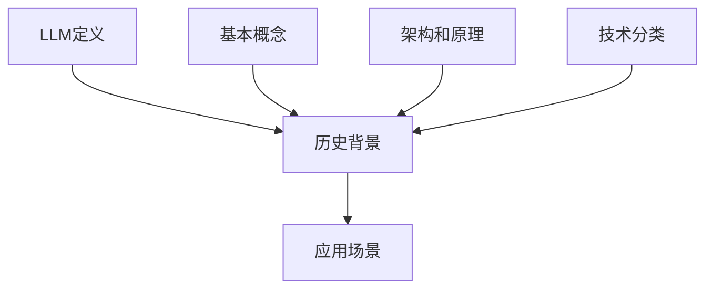

**核心概念讲解：**

- **LLM定义**：大型语言模型是一种能够理解和生成自然语言的人工智能模型，通常通过深度学习和自然语言处理技术训练而成。
- **历史背景**：LLM的发展历程，包括早期的统计模型、现代深度学习模型以及近年来的大型预训练模型。
- **应用场景**：LLM在文本生成、机器翻译、对话系统等领域的广泛应用。
- **基本概念**：包括词汇嵌入、上下文理解、序列生成等。
- **架构和原理**：介绍LLM的基本架构和核心原理，如多层神经网络、注意力机制等。
- **技术分类**：根据训练数据和任务类型，对LLM进行分类。

#### 2.2 LL大模型技术基础

**核心概念与联系：**

**Mermaid 流程图：**

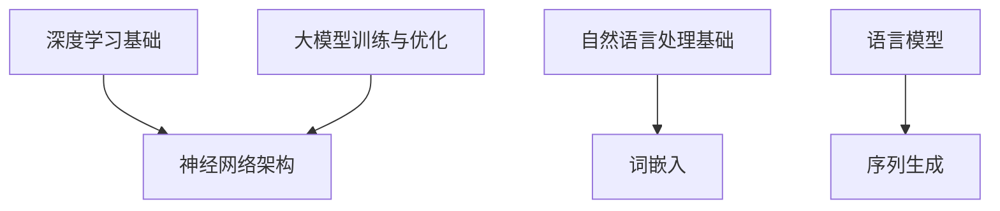

**核心概念讲解：**

- **深度学习基础**：介绍深度学习的概念、历史背景和基本原理，包括多层感知机、反向传播算法等。
- **神经网络架构**：介绍神经网络的构成、工作原理和常见架构，如卷积神经网络（CNN）和循环神经网络（RNN）。
- **自然语言处理基础**：介绍自然语言处理（NLP）的基本概念、技术和应用，包括词嵌入、词性标注、句法分析等。
- **词嵌入**：介绍词嵌入的概念、方法和技术，如Word2Vec、GloVe等。
- **语言模型**：介绍语言模型的概念、分类和原理，如n-gram模型、神经网络语言模型等。
- **序列生成**：介绍序列生成的概念、方法和应用，如RNN、LSTM、GRU等。
- **大模型训练与优化**：介绍大模型训练的过程、策略和优化方法，如数据预处理、模型调优、分布式训练等。

#### 2.3 LL大模型的应用场景

**核心概念与联系：**

**Mermaid 流程图：**

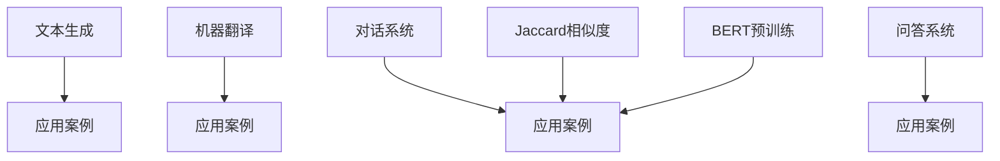

**核心概念讲解：**

- **文本生成**：介绍文本生成的基本概念、方法和应用，如自动摘要、诗歌创作等。
- **机器翻译**：介绍机器翻译的基本概念、流程和技术，如基于规则的翻译、统计机器翻译、神经机器翻译等。
- **对话系统**：介绍对话系统的基本概念、架构和实现方法，如基于规则的方法、基于模板的方法、基于数据的方法等。
- **问答系统**：介绍问答系统的基本概念、分类和实现方法，如基于知识库的方法、基于机器学习的方法等。
- **Jaccard相似度**：介绍Jaccard相似度的概念、计算方法和应用，如文本相似性度量、实体匹配等。
- **BERT预训练**：介绍BERT预训练的概念、原理和实现方法，如大规模预训练、上下文感知等。

### 3. 持续集成与持续部署

#### 3.1 持续集成概述

**核心概念与联系：**

**Mermaid 流程图：**

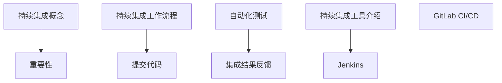

**核心概念讲解：**

- **持续集成概念**：持续集成是一种软件开发实践，通过自动化构建和测试，确保代码的持续整合，减少集成错误。
- **重要性**：持续集成能够提高代码质量、减少集成错误、提高开发效率。
- **持续集成工作流程**：包括提交代码、自动化测试、集成结果反馈等步骤。
- **提交代码**：开发人员将代码提交到版本控制系统中。
- **自动化测试**：运行自动化测试脚本，检测代码的可行性和正确性。
- **集成结果反馈**：将测试结果反馈给开发人员，以便及时修复问题。
- **持续集成工具介绍**：介绍常用的持续集成工具，如Jenkins、GitLab CI/CD等。

#### 3.2 持续集成与LL大模型

**核心概念与联系：**

**Mermaid 流程图：**

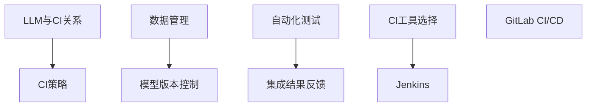

**核心概念讲解：**

- **LLM与CI关系**：持续集成在LLM开发中的应用和作用。
- **CI策略**：根据LLM的特点，设计合适的持续集成策略。
- **数据管理**：确保训练数据的质量和安全，包括数据预处理、数据清洗等。
- **模型版本控制**：管理模型的版本，包括版本记录、版本更新等。
- **自动化测试**：对LLM进行自动化测试，包括模型准确性、稳定性等。
- **集成结果反馈**：将测试结果反馈给开发人员，以便及时优化模型。
- **CI工具选择**：选择适合LLM开发的持续集成工具，如Jenkins、GitLab CI/CD等。

#### 3.3 持续集成与LL大模型的实际案例

**核心概念与联系：**

**Mermaid 流程图：**

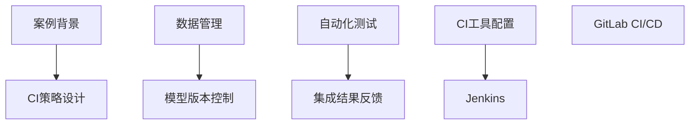

**核心概念讲解：**

- **案例背景**：介绍实际应用的背景和目标。
- **CI策略设计**：根据案例背景，设计合适的持续集成策略。
- **数据管理**：确保训练数据的质量和安全，包括数据预处理、数据清洗等。
- **模型版本控制**：管理模型的版本，包括版本记录、版本更新等。
- **自动化测试**：对LLM进行自动化测试，包括模型准确性、稳定性等。
- **集成结果反馈**：将测试结果反馈给开发人员，以便及时优化模型。
- **CI工具配置**：配置持续集成工具，如Jenkins、GitLab CI/CD等。

### 4. 持续部署概述

#### 4.1 持续部署的概念和重要性

**核心概念与联系：**

**Mermaid 流程图：**

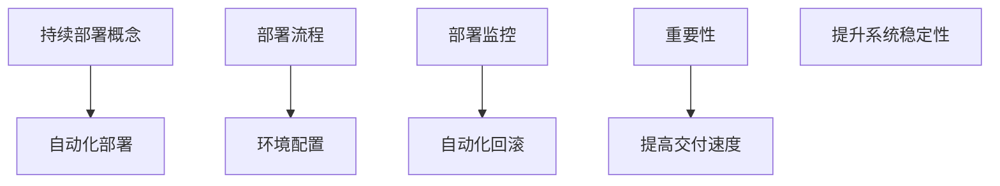

**核心概念讲解：**

- **持续部署概念**：持续部署是一种软件开发实践，通过自动化部署和回滚，确保代码的持续交付和部署，提高交付速度和质量。
- **自动化部署**：自动化部署能够提高部署效率，减少人为干预，降低部署风险。
- **部署流程**：包括环境配置、代码部署、部署监控等步骤。
- **环境配置**：确保部署环境的正确配置，包括服务器、数据库、网络等。
- **部署监控**：实时监控部署过程和部署后的系统性能，及时发现和处理问题。
- **自动化回滚**：在部署失败时，自动回滚到上一个稳定版本，确保系统的稳定性。
- **重要性**：持续部署能够提高交付速度、提升系统稳定性、降低运维成本。

#### 4.2 持续部署的工作流程

**核心概念与联系：**

**Mermaid 流程图：**

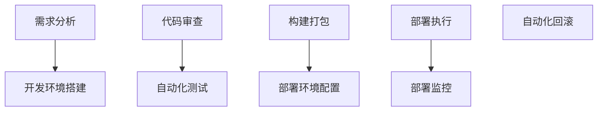

**核心概念讲解：**

- **需求分析**：明确项目需求和目标，为后续开发提供指导。
- **开发环境搭建**：搭建开发环境，确保开发过程中能够顺利进行。
- **代码审查**：对代码进行审查，确保代码质量和一致性。
- **自动化测试**：运行自动化测试脚本，检测代码的可行性和正确性。
- **构建打包**：将代码构建成可部署的包，为部署做准备。
- **部署环境配置**：配置部署环境，包括服务器、数据库、网络等。
- **部署执行**：执行部署操作，将代码部署到生产环境。
- **部署监控**：实时监控部署过程和部署后的系统性能，及时发现和处理问题。
- **自动化回滚**：在部署失败时，自动回滚到上一个稳定版本，确保系统的稳定性。

#### 4.3 持续部署工具介绍

**核心概念与联系：**

**Mermaid 流程图：**

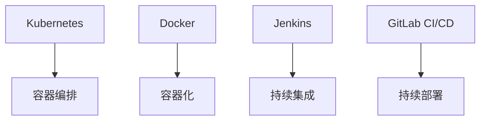

**核心概念讲解：**

- **Kubernetes**：一种容器编排工具，用于管理容器的部署、扩展和自动化。
- **Docker**：一种容器化技术，用于将应用程序及其依赖打包成独立的容器。
- **Jenkins**：一种持续集成工具，用于自动化构建、测试和部署。
- **GitLab CI/CD**：一种持续集成/持续部署工具，集成在GitLab中，支持自动化构建、测试和部署。

### 5. 持续部署与LL大模型

#### 5.1 LL大模型与持续部署的关系

**核心概念与联系：**

**Mermaid 流程图：**

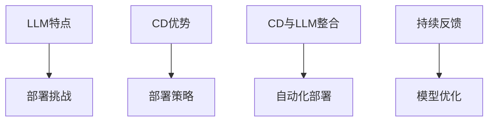

**核心概念讲解：**

- **LLM特点**：介绍LLM的特点，如大规模、高复杂性、数据依赖等。
- **部署挑战**：分析LLM在部署过程中面临的挑战，如数据同步、模型版本控制、部署效率等。
- **CD优势**：介绍持续部署的优势，如自动化、高效、稳定等。
- **部署策略**：根据LLM的特点和持续部署的优势，设计合适的部署策略。
- **CD与LLM整合**：将持续部署与LLM进行整合，实现自动化部署和持续反馈。
- **自动化部署**：通过自动化部署，提高部署效率和质量。
- **持续反馈**：通过持续反馈，及时优化模型和部署过程。

#### 5.2 LL大模型的持续部署策略

**核心概念与联系：**

**Mermaid 流程图：**

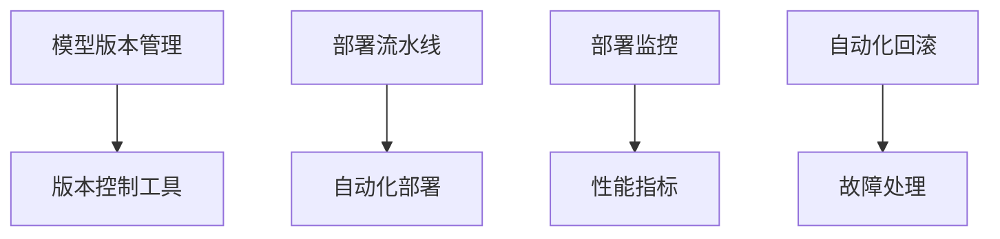

**核心概念讲解：**

- **模型版本管理**：介绍模型版本管理的概念和方法，包括版本控制工具、版本记录等。
- **部署流水线**：设计部署流水线，包括构建、测试、部署等步骤。
- **部署监控**：实时监控部署过程和部署后的系统性能，包括性能指标、故障处理等。
- **自动化部署**：通过自动化部署，提高部署效率和质量。
- **自动化回滚**：在部署失败时，自动回滚到上一个稳定版本，确保系统的稳定性。

#### 5.3 LL大模型持续部署的实际案例

**核心概念与联系：**

**Mermaid 流程图：**

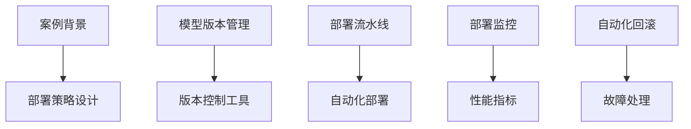

**核心概念讲解：**

- **案例背景**：介绍实际应用的背景和目标。
- **部署策略设计**：根据案例背景，设计合适的部署策略。
- **模型版本管理**：管理模型的版本，包括版本记录、版本更新等。
- **部署流水线**：设计部署流水线，包括构建、测试、部署等步骤。
- **部署监控**：实时监控部署过程和部署后的系统性能，包括性能指标、故障处理等。
- **自动化部署**：通过自动化部署，提高部署效率和质量。
- **自动化回滚**：在部署失败时，自动回滚到上一个稳定版本，确保系统的稳定性。
- **故障处理**：处理部署过程中的故障和问题，确保系统稳定运行。

### 6. 综合应用与实践

#### 6.1 LL大模型应用开发实战

**核心概念与联系：**

**Mermaid 流程图：**

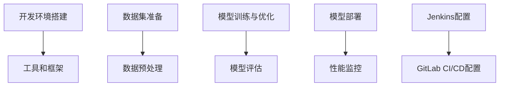

**核心概念讲解：**

- **开发环境搭建**：介绍搭建LLM开发环境所需的基本工具和框架，如Python、TensorFlow、PyTorch等。
- **数据集准备**：准备用于训练和评估的数据集，包括文本数据、标签数据等。
- **数据预处理**：对数据进行清洗、预处理，以提高模型训练效果。
- **模型训练与优化**：介绍模型训练的过程，包括数据加载、模型搭建、训练策略等。
- **模型评估**：评估模型性能，包括准确性、召回率、F1分数等指标。
- **模型部署**：将训练好的模型部署到生产环境中，提供实时服务。
- **性能监控**：实时监控模型性能和系统资源使用情况，确保系统稳定运行。
- **Jenkins配置**：配置Jenkins，实现自动化构建、测试和部署。
- **GitLab CI/CD配置**：配置GitLab CI/CD，实现自动化部署和持续监控。

#### 6.2 持续集成与持续部署实战

**核心概念与联系：**

**Mermaid 流程图：**

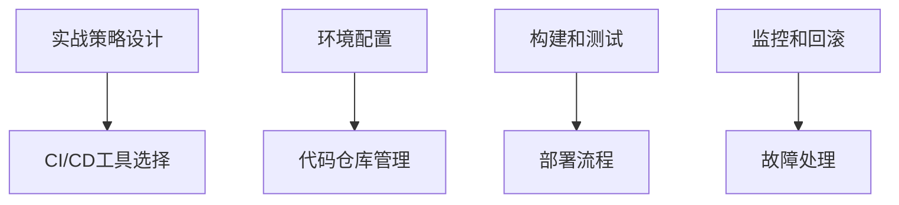

**核心概念讲解：**

- **实战策略设计**：根据项目需求和特点，设计合适的持续集成与持续部署策略。
- **CI/CD工具选择**：选择适合项目的持续集成与持续部署工具，如Jenkins、GitLab CI/CD等。
- **环境配置**：配置开发、测试和生产环境，确保环境的一致性和稳定性。
- **代码仓库管理**：管理代码仓库，包括分支管理、合并请求等。
- **构建和测试**：自动化构建和测试代码，确保代码的质量和可行性。
- **部署流程**：设计部署流程，包括构建、测试、部署等步骤。
- **监控和回滚**：实时监控部署过程和部署后的系统性能，自动化回滚处理异常情况。
- **故障处理**：处理部署过程中的故障和问题，确保系统稳定运行。

#### 6.3 持续集成与持续部署最佳实践

**核心概念与联系：**

**Mermaid 流程图：**

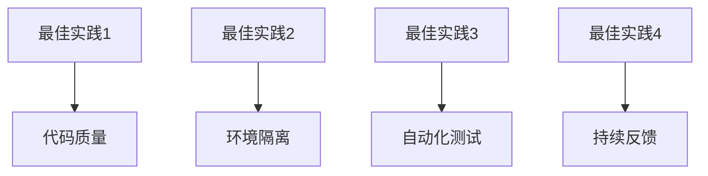

**核心概念讲解：**

- **最佳实践1：代码质量**：确保代码的可读性、可维护性和可扩展性，避免代码冗余和重复。
- **最佳实践2：环境隔离**：确保开发、测试和生产环境之间的隔离，避免环境不一致导致的问题。
- **最佳实践3：自动化测试**：编写自动化测试脚本，覆盖关键功能和边界情况，确保代码的稳定性和可靠性。
- **最佳实践4：持续反馈**：建立反馈机制，及时收集和解决问题，持续优化开发过程和系统性能。

### 结论

本文详细探讨了LLM应用开发中的持续集成与持续部署，从基础概念、技术原理到实际应用，全面分析了持续集成与持续部署在LLM开发中的重要作用。通过一系列实战案例的解析，读者可以深入了解如何在LLM开发过程中实现高效的持续集成与持续部署，从而提升开发效率和系统稳定性。随着LLM技术的不断发展和应用场景的拓展，持续集成与持续部署将越来越重要，本文的研究将为相关领域的研究者和开发者提供有价值的参考。

### 参考文献

1. DevOps Handbook, J. Humble & D. Kim, IT Revolution Press, 2016.
2. Accelerate: The Science of Lean Software and DevOps: Building and Scaling High Performing Technology Organizations, J. D. Dougl

