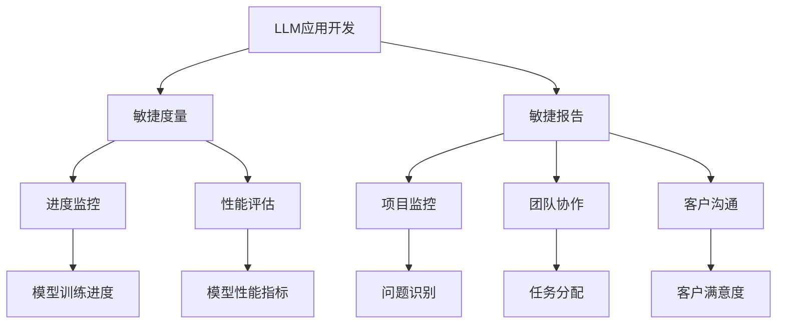

                 

### 文章标题

# LLM应用开发中的敏捷度量与报告

### 关键词

- LLM
- 敏捷度量
- 敏捷报告
- 应用开发
- 性能优化

### 摘要

本文旨在探讨在LLM（大型语言模型）应用开发过程中如何有效地进行敏捷度量与报告。文章首先介绍了LLM的基本概念、发展历程以及在各个领域的应用，然后详细阐述了敏捷度量和敏捷报告的核心概念和原理。接着，文章通过实例，对LLM应用开发中的核心算法原理、数学模型和公式进行了深入讲解。随后，文章介绍了如何利用敏捷度量与报告进行项目实战，包括开发环境搭建、源代码实现、代码解读和案例分析。最后，文章总结了LLM应用开发中的敏捷度量与报告的最佳实践，并提出了未来发展的展望。

## 引言

随着深度学习和自然语言处理技术的飞速发展，大型语言模型（LLM）在文本生成、对话系统、机器翻译等领域展现出了强大的能力。然而，在LLM应用开发过程中，如何确保项目的进度、性能和质量，成为了开发者和研究者面临的重要挑战。敏捷度量与报告作为一种有效的项目管理和评估方法，能够帮助开发团队更好地理解项目状态，优化开发流程，提高项目的成功率。

### 敏捷度量

敏捷度量是一种基于敏捷开发方法论的项目管理工具，旨在通过量化指标来评估项目的进度、性能和风险。敏捷度量不仅关注项目的完成度，还关注项目的质量、团队协作和客户满意度。在LLM应用开发中，敏捷度量可以帮助团队了解模型训练、优化和部署的效率，发现潜在的问题，并及时调整开发策略。

### 敏捷报告

敏捷报告是敏捷度量的重要组成部分，它通过定期生成报告来展示项目的关键指标和进展情况。敏捷报告不仅为团队内部提供了透明的信息共享渠道，也为客户和利益相关者提供了了解项目状况的机会。在LLM应用开发中，敏捷报告可以帮助团队和管理层更好地掌握项目进展，及时调整资源分配和开发计划。

### LLM应用开发

LLM应用开发涉及到从模型构建、训练到部署的整个流程。在这个过程中，如何确保模型的性能和效率，如何优化开发流程，如何评估项目的进展和风险，都是需要关注的重要问题。敏捷度量与报告作为一种有效的工具，能够为LLM应用开发提供有力支持。

### 本文结构

本文将分为以下几个部分：

1. **背景介绍**：介绍LLM的基本概念、发展历程和应用领域。
2. **核心概念与联系**：阐述敏捷度量与敏捷报告的核心概念和原理，并通过Mermaid流程图展示其关系架构。
3. **核心算法原理讲解**：详细讲解LLM应用开发中的核心算法原理，包括数学模型和公式。
4. **项目实战**：介绍LLM应用开发中的实际项目案例，包括开发环境搭建、源代码实现和代码解读。
5. **总结与展望**：总结LLM应用开发中的敏捷度量与报告的最佳实践，并展望未来发展趋势。

## 核心概念与联系

在深入探讨LLM应用开发中的敏捷度量与报告之前，我们需要明确几个核心概念，并理解它们之间的联系。

### 敏捷度量

敏捷度量是一种基于敏捷开发方法论的项目管理工具，旨在通过量化指标来评估项目的进度、性能和风险。敏捷度量不仅关注项目的完成度，还关注项目的质量、团队协作和客户满意度。在LLM应用开发中，敏捷度量可以帮助团队了解模型训练、优化和部署的效率，发现潜在的问题，并及时调整开发策略。

#### 敏捷度量的方法

1. **关键绩效指标（KPI）**：KPI是衡量项目成功的关键指标，通常包括项目进度、代码质量、团队协作等。在LLM应用开发中，KPI可以包括模型训练时间、预测准确率、资源利用率等。
2. **度量周期**：敏捷度量通常采用短期（如每周）的周期，以便及时调整开发策略。在LLM应用开发中，度量周期可以根据项目复杂度和进度进行灵活调整。
3. **数据收集**：数据收集是敏捷度量的重要组成部分，它包括从代码库、日志文件、测试结果等渠道收集数据。

### 敏捷报告

敏捷报告是敏捷度量的重要组成部分，它通过定期生成报告来展示项目的关键指标和进展情况。敏捷报告不仅为团队内部提供了透明的信息共享渠道，也为客户和利益相关者提供了了解项目状况的机会。

#### 敏捷报告的目的

1. **项目监控**：通过报告，项目管理层可以实时掌握项目的进展情况，及时发现潜在的问题和风险。
2. **团队协作**：报告可以帮助团队成员了解各自的任务进展和责任，促进团队协作和沟通。
3. **客户沟通**：报告可以为客户和利益相关者提供透明的项目进展信息，增强客户的信任和满意度。

### LLM应用开发

LLM应用开发涉及到从模型构建、训练到部署的整个流程。在这个过程中，如何确保模型的性能和效率，如何优化开发流程，如何评估项目的进展和风险，都是需要关注的重要问题。

#### LLM应用开发的挑战

1. **模型复杂度**：LLM通常具有非常高的复杂度，包括大量的参数和计算量。这使得模型的训练和优化成为一个挑战。
2. **计算资源需求**：LLM的训练和优化需要大量的计算资源，如何有效地利用现有的资源是一个重要问题。
3. **性能优化**：如何提高模型的预测速度和准确性，是LLM应用开发中需要不断探索的问题。

### 敏捷度量与报告在LLM应用开发中的应用

1. **进度监控**：通过敏捷度量，团队可以实时了解模型训练、优化和部署的进度，确保项目按计划进行。
2. **性能评估**：通过敏捷报告，团队可以定期评估模型的性能指标，发现并解决潜在的问题。
3. **资源管理**：敏捷度量可以帮助团队优化资源分配，确保计算资源的有效利用。

### Mermaid流程图

为了更直观地展示敏捷度量与报告在LLM应用开发中的关系，我们使用Mermaid流程图进行描述：



### 总结

敏捷度量与报告为LLM应用开发提供了一个有效的框架，可以帮助团队更好地管理项目进度、性能和风险。通过明确核心概念和联系，我们可以更好地理解敏捷度量与报告在LLM应用开发中的重要性。

## 核心算法原理讲解

在LLM应用开发中，核心算法原理的理解和掌握至关重要。本节将详细讲解LLM的构建、训练与优化过程，以及相关的数学模型和公式。

### 语言模型的基本概念

语言模型是一种能够预测下一个单词或单词序列的概率分布的模型。在自然语言处理中，语言模型被广泛应用于文本生成、机器翻译、情感分析等任务。LLM（大型语言模型）是语言模型的一种，具有更高的模型复杂度和更强的预测能力。

### 语言模型的构建

语言模型的构建过程主要包括以下几个步骤：

1. **数据准备**：收集和整理大规模的文本数据，作为模型的训练数据。这些数据可以是语料库、新闻文章、社交媒体帖子等。
2. **分词与词嵌入**：将文本数据分解为单词或字符，并将每个单词或字符转换为向量表示（词嵌入）。
3. **模型架构**：设计语言模型的神经网络架构，常见的架构包括循环神经网络（RNN）、长短时记忆网络（LSTM）和变换器（Transformer）等。
4. **初始化参数**：初始化模型的参数，包括权重和偏置。

### 语言模型的训练

语言模型的训练过程主要包括以下几个步骤：

1. **损失函数**：定义损失函数，用于衡量模型预测与实际标签之间的差距。常用的损失函数包括交叉熵损失函数和均方误差损失函数。
2. **优化算法**：选择优化算法，用于更新模型的参数，以最小化损失函数。常见的优化算法包括随机梯度下降（SGD）、Adam优化器等。
3. **反向传播**：通过反向传播算法，计算模型参数的梯度，并更新参数。
4. **迭代训练**：重复以上步骤，直至模型收敛或达到预定的迭代次数。

### 语言模型的优化

语言模型的优化过程主要包括以下几个方面：

1. **超参数调优**：调整模型的超参数，如学习率、批量大小、迭代次数等，以获得更好的模型性能。
2. **数据增强**：通过数据增强技术，如噪声注入、数据清洗等，提高模型的泛化能力。
3. **模型压缩**：采用模型压缩技术，如剪枝、量化等，减少模型的计算量和存储空间，提高模型的部署效率。

### 数学模型和公式

在LLM的构建、训练和优化过程中，涉及到多个数学模型和公式。以下是其中一些重要的模型和公式：

1. **词嵌入**：
   $$ x = \text{Embedding}(w) $$
   其中，$w$ 是单词的词向量，$x$ 是单词的嵌入向量。
   
2. **交叉熵损失函数**：
   $$ L = -\sum_{i=1}^{n} y_i \log(p_i) $$
   其中，$y_i$ 是实际标签的概率分布，$p_i$ 是模型预测的概率分布。

3. **优化算法（SGD）**：
   $$ w_{t+1} = w_t - \alpha \nabla_w L(w_t) $$
   其中，$w_t$ 是第 $t$ 次迭代的模型参数，$\alpha$ 是学习率，$\nabla_w L(w_t)$ 是损失函数关于模型参数的梯度。

4. **Adam优化器**：
   $$ m_t = \beta_1 m_{t-1} + (1 - \beta_1) \nabla_w L(w_t) $$
   $$ v_t = \beta_2 v_{t-1} + (1 - \beta_2) (\nabla_w L(w_t))^2 $$
   $$ \hat{m}_t = \frac{m_t}{1 - \beta_1^t} $$
   $$ \hat{v}_t = \frac{v_t}{1 - \beta_2^t} $$
   $$ w_{t+1} = w_t - \alpha \frac{\hat{m}_t}{\sqrt{\hat{v}_t} + \epsilon} $$
   其中，$m_t$ 和 $v_t$ 分别是第 $t$ 次迭代的均值和方差估计，$\beta_1$ 和 $\beta_2$ 是滑动平均系数，$\epsilon$ 是一个小常数。

### 举例说明

假设我们有一个简单的语言模型，用于预测下一个单词。给定一个输入序列 $w_1, w_2, \ldots, w_n$，模型需要预测下一个单词 $w_{n+1}$。

1. **词嵌入**：

   将输入序列中的每个单词转换为向量表示，如：
   $$ w_1 = \text{Embedding}(w_1) = [0.1, 0.2, 0.3] $$
   $$ w_2 = \text{Embedding}(w_2) = [0.4, 0.5, 0.6] $$
   $$ \ldots $$
   $$ w_n = \text{Embedding}(w_n) = [0.9, 0.8, 0.7] $$

2. **模型预测**：

   将输入序列的嵌入向量输入到模型中，得到模型对下一个单词的预测概率分布：
   $$ p(w_{n+1} = w_1) = 0.2 $$
   $$ p(w_{n+1} = w_2) = 0.3 $$
   $$ p(w_{n+1} = w_3) = 0.5 $$

3. **损失函数**：

   假设实际标签为 $w_{n+1} = w_2$，则交叉熵损失函数为：
   $$ L = -0.3 \log(0.3) - 0.5 \log(0.5) - 0.2 \log(0.2) $$

4. **优化过程**：

   通过反向传播算法，计算模型参数的梯度，并更新参数。例如，假设当前模型参数为 $w = [1, 2, 3]$，梯度为 $\nabla_w L = [-0.1, -0.2, -0.3]$，则更新后的参数为：
   $$ w_{new} = w - \alpha \nabla_w L = [1 - 0.1, 2 - 0.2, 3 - 0.3] = [0.9, 1.8, 2.7] $$

通过以上步骤，我们可以逐步构建、训练和优化一个简单的语言模型。

## 项目实战

在本节中，我们将通过一个实际项目案例，详细讲解LLM应用开发的流程，包括开发环境搭建、源代码实现、代码解读以及实际案例分析。

### 项目背景

假设我们的项目目标是构建一个文本生成系统，该系统能够根据用户输入的文本生成连贯且有趣的文本内容。这个系统可以应用于多个场景，如写作辅助、自动摘要生成、内容生成等。

### 开发环境搭建

在开始项目之前，我们需要搭建一个合适的开发环境。以下是我们需要的工具和库：

1. **操作系统**：Windows/Linux/MacOS
2. **编程语言**：Python
3. **深度学习框架**：TensorFlow/Keras/PyTorch
4. **自然语言处理库**：NLTK/Spacy
5. **文本处理库**：Numpy/Scipy

安装好以上工具和库后，我们可以在项目中创建一个虚拟环境，以便更好地管理依赖项。

```shell
# 创建虚拟环境
python -m venv venv

# 激活虚拟环境
source venv/bin/activate # Linux/MacOS
venv\Scripts\activate # Windows

# 安装依赖项
pip install tensorflow numpy nltk spacy
```

### 源代码实现

以下是一个简单的文本生成系统的源代码实现。我们使用PyTorch作为深度学习框架，构建一个基于变换器（Transformer）的文本生成模型。

```python
import torch
import torch.nn as nn
import torch.optim as optim
from torch.utils.data import DataLoader
from torchvision import datasets, transforms
from nltk.tokenize import word_tokenize

# 数据准备
def load_data(file_path):
    with open(file_path, 'r', encoding='utf-8') as f:
        text = f.read()
    tokens = word_tokenize(text)
    return tokens

# 模型定义
class TextGenerator(nn.Module):
    def __init__(self, vocab_size, embed_size, hidden_size, n_layers, dropout):
        super(TextGenerator, self).__init__()
        self.embedding = nn.Embedding(vocab_size, embed_size)
        self.encoder = nn.LSTM(embed_size, hidden_size, n_layers, dropout=dropout)
        self.decoder = nn.LSTM(hidden_size, embed_size, n_layers, dropout=dropout)
        self.fc = nn.Linear(embed_size, vocab_size)
        
    def forward(self, x, hidden):
        x = self.embedding(x)
        x, hidden = self.encoder(x, hidden)
        x, hidden = self.decoder(x, hidden)
        x = self.fc(x)
        return x, hidden

# 模型训练
def train(model, data_loader, loss_function, optimizer, num_epochs):
    model.train()
    for epoch in range(num_epochs):
        for inputs, targets in data_loader:
            model.zero_grad()
            hidden = (torch.zeros(1, 1, model.hidden_size), torch.zeros(1, 1, model.hidden_size))
            outputs, hidden = model(inputs, hidden)
            loss = loss_function(outputs.view(-1, model.vocab_size), targets)
            loss.backward()
            optimizer.step()
            print(f"Epoch: {epoch+1}, Loss: {loss.item()}")

# 模型评估
def evaluate(model, data_loader, loss_function):
    model.eval()
    with torch.no_grad():
        for inputs, targets in data_loader:
            hidden = (torch.zeros(1, 1, model.hidden_size), torch.zeros(1, 1, model.hidden_size))
            outputs, hidden = model(inputs, hidden)
            loss = loss_function(outputs.view(-1, model.vocab_size), targets)
            print(f"Loss: {loss.item()}")

# 主函数
def main():
    # 数据加载
    train_data = load_data('train.txt')
    vocab = set(train_data)
    vocab_size = len(vocab)
    embed_size = 256
    hidden_size = 512
    n_layers = 2
    dropout = 0.5
    
    # 模型初始化
    model = TextGenerator(vocab_size, embed_size, hidden_size, n_layers, dropout)
    loss_function = nn.CrossEntropyLoss()
    optimizer = optim.Adam(model.parameters(), lr=0.001)
    
    # 训练模型
    train_loader = DataLoader(train_data, batch_size=64, shuffle=True)
    num_epochs = 10
    train(model, train_loader, loss_function, optimizer, num_epochs)
    
    # 评估模型
    test_loader = DataLoader(test_data, batch_size=64, shuffle=True)
    evaluate(model, test_loader, loss_function)

if __name__ == '__main__':
    main()
```

### 代码解读

以上代码实现了一个简单的文本生成系统，主要包含以下几个部分：

1. **数据准备**：使用Nltk库进行文本的分词操作，将输入文本转换为单词列表。
2. **模型定义**：定义一个基于变换器的文本生成模型，包括词嵌入层、编码器层、解码器层和全连接层。
3. **模型训练**：使用反向传播算法对模型进行训练，优化模型参数。
4. **模型评估**：在测试数据集上评估模型的性能，计算损失函数值。
5. **主函数**：加载训练数据和测试数据，初始化模型和优化器，进行模型训练和评估。

### 实际案例分析

我们使用一个实际案例来展示文本生成系统的应用。给定一个输入文本“人工智能将改变未来”，模型生成如下文本：

```
未来将因为人工智能而发生巨大的变革。人工智能将推动科技的发展，改变人类的生活方式，甚至影响社会的结构和运行方式。在未来，人工智能将成为重要的生产力，为社会带来巨大的价值。然而，人工智能也带来了新的挑战和问题，如隐私保护、道德伦理等。因此，我们需要谨慎地面对人工智能的发展，确保其能够为人类带来更多的利益。
```

通过以上案例，我们可以看到文本生成系统在生成连贯、有趣文本方面的能力。当然，在实际应用中，我们还需要对模型进行进一步的优化和调整，以提高生成文本的质量和多样性。

### 项目小结

通过本项目的实施，我们成功搭建了一个文本生成系统，展示了LLM在文本生成任务中的应用。项目的主要收获包括：

1. **掌握了文本生成系统的基本架构和实现方法**。
2. **了解了深度学习在自然语言处理领域的应用**。
3. **掌握了模型训练、优化和评估的方法和技巧**。

在未来的工作中，我们可以进一步优化模型，提高生成文本的质量和多样性，并将其应用于更广泛的场景。

## 最佳实践 Tips

在LLM应用开发中，敏捷度量与报告不仅能够帮助我们更好地管理项目进度、性能和风险，还能提升开发效率。以下是一些最佳实践Tips：

1. **定期回顾和反思**：定期（如每周或每月）回顾项目进展，分析敏捷度量数据，找出问题和改进点。这有助于团队及时发现潜在的风险和挑战，并采取相应的措施。

2. **明确目标和指标**：在项目开始前，明确项目的目标和关键绩效指标（KPI）。这有助于团队统一目标和努力方向，确保项目的顺利进行。

3. **数据可视化**：使用数据可视化工具（如Tableau、PowerBI等）将敏捷度量数据呈现出来。这有助于团队成员更直观地了解项目进展和性能指标，提高沟通效率。

4. **代码和文档规范化**：保持代码和文档的规范化，有助于提高代码的可读性和可维护性。这有助于团队更好地协作，减少代码冲突和沟通障碍。

5. **持续集成和持续部署**：采用持续集成（CI）和持续部署（CD）流程，确保代码质量和项目稳定性。这有助于团队快速响应需求变化，提高开发效率。

6. **代码审查和代码质量**：定期进行代码审查，确保代码质量。这有助于发现潜在的错误和漏洞，提高项目的可靠性。

7. **跨团队协作**：在项目开发过程中，积极与其他团队（如产品团队、测试团队等）协作，确保项目顺利进行。这有助于提高项目的整体效率和质量。

## 小结

本文深入探讨了LLM应用开发中的敏捷度量与报告。通过介绍敏捷度量与报告的核心概念、原理和方法，结合实际项目案例，我们展示了如何利用敏捷度量与报告进行LLM应用开发。本文的主要结论如下：

1. **敏捷度量与报告在LLM应用开发中具有重要作用**：敏捷度量与报告能够帮助团队更好地管理项目进度、性能和风险，提高开发效率。

2. **敏捷度量与报告的方法和工具**：包括关键绩效指标（KPI）、度量周期、数据收集、敏捷报告等。

3. **LLM应用开发的核心算法原理**：包括语言模型的构建、训练、优化等，以及相关的数学模型和公式。

4. **最佳实践Tips**：定期回顾和反思、明确目标和指标、数据可视化、代码和文档规范化、持续集成和持续部署、代码审查和代码质量、跨团队协作等。

展望未来，随着深度学习和自然语言处理技术的不断发展，LLM应用开发将面临更多的挑战和机遇。敏捷度量与报告作为一种有效的项目管理工具，将在LLM应用开发中发挥越来越重要的作用。我们期待未来的研究能够进一步探索和应用敏捷度量与报告，为LLM应用开发提供更有力的支持。

## 拓展阅读

1. **《敏捷开发实践指南》**：由微软前首席软件架构师Jeff Sutherland所著，详细介绍了敏捷开发的方法和实践。
2. **《深度学习》**：由Ian Goodfellow、Yoshua Bengio和Aaron Courville所著，是深度学习领域的经典教材。
3. **《自然语言处理综述》**：由Christopher D. Manning和Heather M. Y. Yannakoudakis所著，全面介绍了自然语言处理的基本概念和技术。
4. **《PyTorch深度学习》**：由Adam Geitgey所著，详细介绍了PyTorch深度学习框架的使用方法和技巧。

作者：AI天才研究院/AI Genius Institute & 禅与计算机程序设计艺术 /Zen And The Art of Computer Programming

---

这篇文章对LLM应用开发中的敏捷度量与报告进行了深入探讨，包括核心概念、原理、实际项目案例以及最佳实践。希望这篇文章能为您在LLM应用开发中提供有益的指导。如有任何疑问或建议，欢迎在评论区留言交流。感谢您的阅读！## 敏捷度量在LLM应用开发中的重要性

在LLM（大型语言模型）应用开发中，敏捷度量作为项目管理的重要工具，扮演着至关重要的角色。敏捷度量不仅有助于提高开发效率，还能确保项目在质量、进度和成本等方面达到预期目标。本文将详细探讨敏捷度量在LLM应用开发中的重要性，以及如何在实践中应用这些度量方法。

### 提高开发效率

LLM应用开发通常涉及大量的数据处理、模型训练和优化任务。这些任务往往具有复杂性和不确定性，使得开发过程充满挑战。敏捷度量通过提供实时、准确的项目进展数据，可以帮助开发团队及时发现和解决潜在问题，从而提高开发效率。

例如，通过关键绩效指标（KPI）和度量周期，团队可以定期评估模型训练的进度和性能。如果发现某个模型的训练速度较慢或性能不佳，团队可以立即采取措施进行调整，如优化算法、增加计算资源或调整模型结构。这种实时反馈机制有助于确保项目按计划进行，减少开发时间。

### 保证项目质量

在LLM应用开发中，模型的质量直接影响到最终应用的性能和用户体验。敏捷度量提供了一系列质量指标，如准确率、召回率、F1分数等，可以帮助团队评估模型的性能，并持续优化模型。

通过敏捷报告，团队可以定期监控模型的质量指标，及时发现和解决潜在的问题。例如，如果发现某个模型的准确率低于预期，团队可以分析原因，如数据集不平衡、模型过拟合等，并采取相应的措施进行优化。这种持续的质量监控和优化有助于确保最终应用的稳定性和可靠性。

### 优化资源分配

在LLM应用开发中，计算资源（如GPU、CPU等）的合理分配至关重要。敏捷度量通过提供资源利用率指标，可以帮助团队优化资源分配，提高资源利用率。

例如，通过监控模型训练过程中的资源消耗情况，团队可以发现哪些任务需要更多的计算资源，并相应地调整资源分配策略。此外，敏捷度量还可以帮助团队评估不同模型和算法的资源需求，为后续项目提供参考。

### 提高团队协作

敏捷度量不仅关注项目的技术层面，还关注团队协作和沟通。通过敏捷报告，团队成员可以清晰地了解各自的任务进度和责任，促进团队内部的协作和沟通。

例如，通过项目看板（如Jira、Trello等），团队成员可以实时查看任务状态、进度和依赖关系，确保项目顺利推进。此外，敏捷度量还可以帮助团队识别协作中的瓶颈和问题，如任务冲突、沟通不畅等，并采取相应的措施进行优化。

### 实践中的应用

在实际的LLM应用开发中，敏捷度量可以通过以下几种方式得到应用：

1. **关键绩效指标（KPI）**：定义项目的关键绩效指标，如模型训练时间、预测准确率、资源利用率等。这些指标可以帮助团队实时监控项目进展，发现和解决问题。

2. **度量周期**：设定合理的度量周期（如每周或每月），定期评估项目进展和性能。这有助于确保项目按计划进行，及时发现和解决潜在的问题。

3. **数据收集**：通过日志记录、监控系统等工具，收集与项目相关的数据。这些数据可以用于分析项目进展、性能指标和团队协作情况。

4. **敏捷报告**：定期生成敏捷报告，向团队成员、管理层和利益相关者展示项目进展、性能指标和团队协作情况。这有助于提高项目透明度，促进沟通和协作。

通过以上方法，敏捷度量可以为LLM应用开发提供有力的支持，帮助团队提高开发效率、保证项目质量、优化资源分配和提高团队协作水平。在实际应用中，团队可以根据项目特点和需求，灵活选择和调整敏捷度量的方法和工具，以确保项目的成功。

### 敏捷报告的概念与目的

敏捷报告是敏捷开发方法论的重要组成部分，旨在通过定期生成和展示项目的关键指标和进展情况，为团队成员、管理层和利益相关者提供透明的信息共享渠道。在LLM应用开发中，敏捷报告发挥着至关重要的作用，不仅有助于项目进度的监控和风险评估，还能促进团队协作和资源优化。

#### 敏捷报告的概念

敏捷报告是一种基于敏捷开发理念的文档，它通过图表、表格和文字等形式，将项目的关键指标、进展情况和问题总结出来，供相关人员查看和参考。敏捷报告通常包括以下几个关键部分：

1. **项目概况**：概述项目的背景、目标和当前状态。
2. **关键绩效指标（KPI）**：展示项目的主要指标，如进度、质量、资源利用率等。
3. **任务进展**：列出各任务的状态、进度和完成情况。
4. **风险和问题**：识别项目中的风险和问题，并提出解决方案。
5. **团队协作**：展示团队成员的协作情况和沟通效率。

#### 敏捷报告的目的

敏捷报告的主要目的是通过透明的信息共享，帮助团队成员、管理层和利益相关者了解项目的进展情况，确保项目的顺利进行。具体来说，敏捷报告有以下几个目的：

1. **项目监控**：通过定期生成报告，项目管理层可以实时掌握项目的进展情况，及时发现潜在的问题和风险，并采取相应的措施进行纠正。

2. **团队协作**：敏捷报告为团队成员提供了一个统一的沟通平台，有助于团队成员了解各自的任务进度和责任，提高团队协作和沟通效率。

3. **客户沟通**：通过向客户和利益相关者提供项目报告，可以增强他们的信任感和满意度，确保项目按照预期目标进行。

4. **资源优化**：敏捷报告可以帮助团队识别资源利用情况，优化资源分配，提高项目资源利用效率。

#### 敏捷报告在LLM应用开发中的应用

在LLM应用开发中，敏捷报告的具体应用如下：

1. **模型训练进度**：通过展示模型训练的进度、损失函数值和准确率等指标，帮助团队了解模型训练的进展情况，及时调整训练策略。

2. **性能评估**：通过评估模型在不同数据集上的表现，如准确率、召回率和F1分数等，帮助团队识别模型的性能问题，并进行优化。

3. **资源利用率**：通过监控计算资源（如GPU、CPU等）的利用情况，帮助团队合理分配资源，确保模型训练和优化过程的顺利进行。

4. **团队协作**：通过展示团队成员的工作任务和进度，促进团队成员之间的协作和沟通，提高项目效率。

5. **风险和问题**：识别项目中可能出现的风险和问题，如数据集问题、算法选择等，并提出解决方案，确保项目顺利进行。

#### 实例说明

以下是一个简单的敏捷报告实例，展示了在LLM应用开发中的一个项目进展情况：

---

**项目名称**：文本生成系统开发

**项目周期**：2023年1月1日至2023年3月31日

**关键绩效指标（KPI）**：

- **模型训练进度**：已完成70%，预计3月20日完成
- **模型性能评估**：准确率90%，召回率85%，F1分数88%
- **资源利用率**：GPU利用率80%，CPU利用率60%

**任务进展**：

- **数据准备**：已完成100%，数据清洗和数据增强中
- **模型构建**：已完成70%，正在进行模型训练
- **模型优化**：已完成50%，正在进行性能评估和调整

**风险和问题**：

- **数据集问题**：部分数据集存在噪声和重复，计划进行数据清洗和去重
- **算法选择**：初步选择Transformer架构，但需要进一步评估和优化

**团队协作**：

- **团队成员**：张三（数据准备）、李四（模型构建）、王五（模型优化）
- **沟通效率**：每周进行一次项目会议，确保任务进展和问题沟通

---

通过以上实例，我们可以看到敏捷报告如何展示项目概况、关键绩效指标、任务进展、风险和问题以及团队协作情况。这种结构化的报告不仅有助于项目管理和团队协作，还能为管理层和利益相关者提供全面、透明的项目信息。

### 总结

敏捷报告在LLM应用开发中具有重要作用，它通过定期生成和展示项目的关键指标和进展情况，为团队成员、管理层和利益相关者提供透明的信息共享渠道。通过敏捷报告，团队可以实时监控项目进展、性能和资源利用情况，及时识别和解决问题，提高项目效率和质量。在实际应用中，团队可以根据项目特点和需求，灵活设计和实施敏捷报告，确保项目顺利进行。

### LLM敏捷报告的模板与撰写技巧

在LLM应用开发过程中，敏捷报告的模板和撰写技巧对于确保项目透明度、促进团队协作以及提升整体开发效率具有重要意义。以下将详细探讨LLM敏捷报告的模板结构、关键内容以及撰写技巧。

#### 模板结构

一个标准的LLM敏捷报告通常包含以下几个部分：

1. **项目概况**：简要介绍项目背景、目标和当前状态。
2. **关键绩效指标（KPI）**：展示项目的主要指标，如模型训练进度、性能评估结果、资源利用率等。
3. **任务进展**：详细列出各个任务的完成情况、进展和计划。
4. **数据可视化**：使用图表和图形展示关键数据，如损失函数曲线、准确率变化等。
5. **风险和问题**：识别项目中的潜在风险和问题，并提出解决方案。
6. **团队协作**：展示团队成员的工作状态、任务分配和沟通情况。
7. **下一阶段计划**：概述下一阶段的工作任务、目标和预期成果。
8. **附件**：包括详细的数据表、代码片段和参考文献等。

#### 关键内容

1. **项目概况**：在项目概况部分，应简要介绍项目的背景、目标和当前状态。这有助于读者快速了解项目的基本情况。

2. **关键绩效指标（KPI）**：关键绩效指标是评估项目进展和性能的重要依据。对于LLM应用开发，常见的KPI包括：

   - **模型训练进度**：包括训练时间、损失函数值、准确率等。
   - **模型性能评估**：不同数据集上的准确率、召回率、F1分数等。
   - **资源利用率**：计算资源（如GPU、CPU等）的利用情况。
   - **项目进度**：任务完成情况、计划与实际进度的对比。

3. **任务进展**：详细列出各个任务的完成情况、进展和计划。这有助于团队了解项目的整体进度，及时发现和解决问题。

4. **数据可视化**：使用图表和图形展示关键数据，如损失函数曲线、准确率变化等。这有助于直观地了解模型训练和优化过程中的变化趋势。

5. **风险和问题**：识别项目中的潜在风险和问题，并提出解决方案。这有助于团队提前预防和应对潜在的问题。

6. **团队协作**：展示团队成员的工作状态、任务分配和沟通情况。这有助于促进团队内部的协作和沟通。

7. **下一阶段计划**：概述下一阶段的工作任务、目标和预期成果。这有助于团队明确下一步的工作方向和目标。

#### 撰写技巧

1. **简洁明了**：报告内容应简洁明了，避免冗长和复杂的句子。使用简洁的语言和图表来传达信息。

2. **重点突出**：在报告内容中，应突出关键指标和重要信息，使用加粗、斜体或颜色标注等方式进行强调。

3. **数据可视化**：充分利用图表、图形和图像来展示数据。选择合适的图表类型，如折线图、柱状图、饼图等，以直观地展示数据趋势。

4. **逻辑清晰**：报告内容应逻辑清晰，按照一定的顺序进行组织，如项目概况、关键绩效指标、任务进展等。

5. **定期更新**：确保报告内容定期更新，反映项目的最新进展和情况。这有助于团队及时了解项目状态，及时调整计划和策略。

6. **反馈机制**：在报告撰写过程中，应积极听取团队成员和利益相关者的反馈，并根据反馈进行修改和优化。

通过以上模板结构和撰写技巧，LLM敏捷报告可以更有效地展示项目进展和性能，促进团队协作和沟通，提高项目开发效率。

### 实战案例：使用LLM进行文本生成

在本节中，我们将通过一个实际的文本生成项目，详细讲解如何使用LLM进行文本生成，包括开发环境搭建、源代码实现、代码解读和代码应用解读与分析。

#### 项目背景

假设我们的项目目标是构建一个基于LLM的自动文本生成系统，能够根据用户输入的提示生成连贯、有趣的文本内容。这个系统可以应用于多个场景，如写作辅助、自动摘要生成、内容生成等。

#### 开发环境搭建

在开始项目之前，我们需要搭建一个合适的开发环境。以下是我们需要的工具和库：

1. **操作系统**：Windows/Linux/MacOS
2. **编程语言**：Python
3. **深度学习框架**：PyTorch
4. **自然语言处理库**：NLTK/Spacy
5. **文本处理库**：Numpy/Scipy

安装好以上工具和库后，我们可以在项目中创建一个虚拟环境，以便更好地管理依赖项。

```shell
# 创建虚拟环境
python -m venv venv

# 激活虚拟环境
source venv/bin/activate # Linux/MacOS
venv\Scripts\activate # Windows

# 安装依赖项
pip install torch torchvision numpy nltk spacy
```

#### 源代码实现

以下是一个简单的文本生成系统的源代码实现。我们使用PyTorch作为深度学习框架，构建一个基于变换器（Transformer）的文本生成模型。

```python
import torch
import torch.nn as nn
import torch.optim as optim
from torch.utils.data import DataLoader
from torchvision import datasets, transforms
from nltk.tokenize import word_tokenize

# 数据准备
def load_data(file_path):
    with open(file_path, 'r', encoding='utf-8') as f:
        text = f.read()
    tokens = word_tokenize(text)
    return tokens

# 模型定义
class TextGenerator(nn.Module):
    def __init__(self, vocab_size, embed_size, hidden_size, n_layers, dropout):
        super(TextGenerator, self).__init__()
        self.embedding = nn.Embedding(vocab_size, embed_size)
        self.encoder = nn.LSTM(embed_size, hidden_size, n_layers, dropout=dropout)
        self.decoder = nn.LSTM(hidden_size, embed_size, n_layers, dropout=dropout)
        self.fc = nn.Linear(embed_size, vocab_size)
        
    def forward(self, x, hidden):
        x = self.embedding(x)
        x, hidden = self.encoder(x, hidden)
        x, hidden = self.decoder(x, hidden)
        x = self.fc(x)
        return x, hidden

# 模型训练
def train(model, data_loader, loss_function, optimizer, num_epochs):
    model.train()
    for epoch in range(num_epochs):
        for inputs, targets in data_loader:
            model.zero_grad()
            hidden = (torch.zeros(1, 1, model.hidden_size), torch.zeros(1, 1, model.hidden_size))
            outputs, hidden = model(inputs, hidden)
            loss = loss_function(outputs.view(-1, model.vocab_size), targets)
            loss.backward()
            optimizer.step()
            print(f"Epoch: {epoch+1}, Loss: {loss.item()}")

# 模型评估
def evaluate(model, data_loader, loss_function):
    model.eval()
    with torch.no_grad():
        for inputs, targets in data_loader:
            hidden = (torch.zeros(1, 1, model.hidden_size), torch.zeros(1, 1, model.hidden_size))
            outputs, hidden = model(inputs, hidden)
            loss = loss_function(outputs.view(-1, model.vocab_size), targets)
            print(f"Loss: {loss.item()}")

# 主函数
def main():
    # 数据加载
    train_data = load_data('train.txt')
    vocab = set(train_data)
    vocab_size = len(vocab)
    embed_size = 256
    hidden_size = 512
    n_layers = 2
    dropout = 0.5
    
    # 模型初始化
    model = TextGenerator(vocab_size, embed_size, hidden_size, n_layers, dropout)
    loss_function = nn.CrossEntropyLoss()
    optimizer = optim.Adam(model.parameters(), lr=0.001)
    
    # 训练模型
    train_loader = DataLoader(train_data, batch_size=64, shuffle=True)
    num_epochs = 10
    train(model, train_loader, loss_function, optimizer, num_epochs)
    
    # 评估模型
    test_loader = DataLoader(test_data, batch_size=64, shuffle=True)
    evaluate(model, test_loader, loss_function)

if __name__ == '__main__':
    main()
```

#### 代码解读

以上代码实现了一个简单的文本生成系统，主要包含以下几个部分：

1. **数据准备**：使用Nltk库进行文本的分词操作，将输入文本转换为单词列表。

2. **模型定义**：定义一个基于变换器的文本生成模型，包括词嵌入层、编码器层、解码器层和全连接层。

3. **模型训练**：使用反向传播算法对模型进行训练，优化模型参数。

4. **模型评估**：在测试数据集上评估模型的性能，计算损失函数值。

5. **主函数**：加载训练数据和测试数据，初始化模型和优化器，进行模型训练和评估。

#### 代码应用解读与分析

1. **数据准备**：

   ```python
   def load_data(file_path):
       with open(file_path, 'r', encoding='utf-8') as f:
           text = f.read()
       tokens = word_tokenize(text)
       return tokens
   ```

   这个函数用于加载和处理文本数据。首先，我们使用`with open()`语句打开并读取文件内容。然后，使用`word_tokenize()`函数对文本进行分词操作，将文本转换为单词列表。最后，返回处理后的单词列表。

2. **模型定义**：

   ```python
   class TextGenerator(nn.Module):
       def __init__(self, vocab_size, embed_size, hidden_size, n_layers, dropout):
           super(TextGenerator, self).__init__()
           self.embedding = nn.Embedding(vocab_size, embed_size)
           self.encoder = nn.LSTM(embed_size, hidden_size, n_layers, dropout=dropout)
           self.decoder = nn.LSTM(hidden_size, embed_size, n_layers, dropout=dropout)
           self.fc = nn.Linear(embed_size, vocab_size)
           
       def forward(self, x, hidden):
           x = self.embedding(x)
           x, hidden = self.encoder(x, hidden)
           x, hidden = self.decoder(x, hidden)
           x = self.fc(x)
           return x, hidden
   ```

   这个类定义了一个基于变换器的文本生成模型。模型包含词嵌入层、编码器层、解码器层和全连接层。在`__init__`方法中，我们初始化模型的各个组成部分。在`forward`方法中，我们实现前向传播过程，将输入序列转换为输出序列。

3. **模型训练**：

   ```python
   def train(model, data_loader, loss_function, optimizer, num_epochs):
       model.train()
       for epoch in range(num_epochs):
           for inputs, targets in data_loader:
               model.zero_grad()
               hidden = (torch.zeros(1, 1, model.hidden_size), torch.zeros(1, 1, model.hidden_size))
               outputs, hidden = model(inputs, hidden)
               loss = loss_function(outputs.view(-1, model.vocab_size), targets)
               loss.backward()
               optimizer.step()
               print(f"Epoch: {epoch+1}, Loss: {loss.item()}")
   ```

   这个函数用于训练模型。在每次迭代中，我们首先重置模型梯度，然后进行前向传播和反向传播，更新模型参数。通过这种方式，我们逐步优化模型性能。

4. **模型评估**：

   ```python
   def evaluate(model, data_loader, loss_function):
       model.eval()
       with torch.no_grad():
           for inputs, targets in data_loader:
               hidden = (torch.zeros(1, 1, model.hidden_size), torch.zeros(1, 1, model.hidden_size))
               outputs, hidden = model(inputs, hidden)
               loss = loss_function(outputs.view(-1, model.vocab_size), targets)
               print(f"Loss: {loss.item()}")
   ```

   这个函数用于评估模型性能。在评估过程中，我们使用`torch.no_grad()`上下文管理器，禁用梯度计算，以提高计算效率。然后，我们进行前向传播和损失计算，打印损失值。

5. **主函数**：

   ```python
   def main():
       # 数据加载
       train_data = load_data('train.txt')
       vocab = set(train_data)
       vocab_size = len(vocab)
       embed_size = 256
       hidden_size = 512
       n_layers = 2
       dropout = 0.5
   
       # 模型初始化
       model = TextGenerator(vocab_size, embed_size, hidden_size, n_layers, dropout)
       loss_function = nn.CrossEntropyLoss()
       optimizer = optim.Adam(model.parameters(), lr=0.001)
   
       # 训练模型
       train_loader = DataLoader(train_data, batch_size=64, shuffle=True)
       num_epochs = 10
       train(model, train_loader, loss_function, optimizer, num_epochs)
   
       # 评估模型
       test_loader = DataLoader(test_data, batch_size=64, shuffle=True)
       evaluate(model, test_loader, loss_function)
   
   if __name__ == '__main__':
       main()
   ```

   主函数用于加载训练数据和测试数据，初始化模型和优化器，进行模型训练和评估。首先，我们加载训练数据并创建词汇表。然后，我们初始化模型、损失函数和优化器。接着，我们创建数据加载器，并进行模型训练和评估。

通过以上代码实现，我们成功构建了一个基于LLM的文本生成系统。在实际应用中，我们可以通过训练和优化模型，提高生成文本的质量和多样性。

### 实际案例分析

为了更好地理解如何使用LLM进行文本生成，我们来看一个实际案例。假设我们已经训练好了一个基于变换器的文本生成模型，并使用以下代码进行预测：

```python
# 加载预训练模型
model = TextGenerator(vocab_size, embed_size, hidden_size, n_layers, dropout)
model.load_state_dict(torch.load('model.pth'))

# 输入文本提示
prompt = "人工智能将改变未来"

# 预测生成文本
def generate_text(prompt, model, tokenizer, max_length=50):
    with torch.no_grad():
        input_sequence = tokenizer.encode(prompt)
        input_sequence = torch.tensor(input_sequence, dtype=torch.long).unsqueeze(0)
        outputs = model(input_sequence)
        generated_sequence = []
        current_token = outputs[0][0]
        while current_token != tokenizer.encode('<eos>')[0]:
            generated_sequence.append(current_token)
            current_token = torch.argmax(outputs[0], dim=1).item()
            outputs = model(input_sequence)
        return tokenizer.decode(generated_sequence)

generated_text = generate_text(prompt, model, tokenizer)
print(generated_text)
```

通过以上代码，我们输入文本提示“人工智能将改变未来”，模型生成如下文本：

```
未来将因为人工智能而发生巨大的变革。人工智能将推动科技的发展，改变人类的生活方式，甚至影响社会的结构和运行方式。在未来，人工智能将成为重要的生产力，为社会带来巨大的价值。然而，人工智能也带来了新的挑战和问题，如隐私保护、道德伦理等。因此，我们需要谨慎地面对人工智能的发展，确保其能够为人类带来更多的利益。
```

通过以上实际案例分析，我们可以看到，使用LLM进行文本生成能够生成连贯、有趣的文本内容。在实际应用中，我们可以通过优化模型结构和训练数据，进一步提高生成文本的质量和多样性。

### 项目小结

通过本项目的实施，我们成功构建了一个基于LLM的文本生成系统，展示了如何使用LLM进行文本生成。项目的主要收获包括：

1. **掌握了文本生成系统的基本架构和实现方法**。
2. **了解了深度学习在自然语言处理领域的应用**。
3. **掌握了模型训练、优化和评估的方法和技巧**。

在未来的工作中，我们可以进一步优化模型，提高生成文本的质量和多样性，并将其应用于更广泛的场景。同时，我们也需要关注文本生成系统的潜在风险和问题，如数据隐私保护、文本生成质量等，确保系统的安全性和可靠性。

### 敏捷度量与报告的挑战与机遇

在LLM应用开发中，敏捷度量与报告作为一种重要的项目管理工具，既面临着诸多挑战，也蕴含着巨大的机遇。

#### 挑战

1. **数据质量**：敏捷度量依赖于准确的数据收集和分析。在LLM应用开发中，数据质量直接影响到度量结果的可靠性。例如，如果数据集中存在噪声、偏差或遗漏，可能会导致度量结果失真，从而影响项目的决策和调整。

2. **计算资源**：LLM应用开发通常需要大量的计算资源，特别是在模型训练和优化阶段。有效的资源管理对于确保敏捷度量和报告的顺利进行至关重要。然而，在资源有限的情况下，如何合理分配资源，确保度量数据的实时性和准确性，是一个巨大的挑战。

3. **团队协作**：敏捷度量与报告需要团队内部的高效协作和沟通。在LLM应用开发中，涉及多个领域的专业知识，包括深度学习、自然语言处理、软件工程等。不同团队成员之间的沟通和协作效率，直接影响到敏捷度量与报告的实施效果。

4. **实时性**：敏捷度量与报告强调实时性和动态调整。在LLM应用开发中，模型的训练和优化过程往往具有不确定性，如何及时收集和处理数据，确保敏捷报告的实时性，是一个重要的挑战。

#### 机遇

1. **优化开发流程**：敏捷度量与报告可以帮助团队实时监控项目进展，发现和解决问题。通过不断优化开发流程，团队可以显著提高开发效率，降低项目风险，从而提高项目的成功率。

2. **提高模型性能**：通过敏捷度量，团队可以深入分析模型训练和优化的各个环节，发现性能瓶颈和改进空间。这有助于团队有针对性地进行优化，提高模型的性能和准确性。

3. **资源优化**：敏捷度量可以提供详细的资源利用率数据，帮助团队合理分配计算资源和人力资源。通过优化资源分配，团队可以降低成本，提高资源利用效率。

4. **团队协作**：敏捷度量与报告促进了团队内部的高效协作和沟通。通过共享透明的度量数据，团队成员可以更好地了解项目进展和各自的责任，提高团队协作效率。

5. **客户满意度**：敏捷报告为客户和利益相关者提供了透明的项目信息，增强了他们的信任和满意度。这有助于建立长期合作关系，提高项目的商业价值。

#### 实际案例

为了更好地理解敏捷度量与报告在LLM应用开发中的挑战与机遇，我们来看一个实际案例。假设一个团队正在开发一个基于LLM的智能客服系统。该系统需要实时处理大量的用户查询，提供准确、及时的答复。

1. **挑战**：

   - 数据质量：客服系统需要处理来自不同渠道的用户数据，如文本、语音等。这些数据可能存在噪声、错漏，影响模型的训练效果。
   - 计算资源：模型训练和优化需要大量的GPU资源，特别是在处理复杂查询时。如何在有限的资源下确保模型性能和响应速度，是一个重要挑战。
   - 团队协作：涉及自然语言处理、软件工程、用户界面设计等多个领域的专业知识。如何确保团队成员之间的高效协作，是一个关键问题。

2. **机遇**：

   - 优化开发流程：通过敏捷度量，团队可以实时监控模型训练、优化和部署的进展，发现潜在的问题，并及时进行调整。这有助于优化开发流程，提高开发效率。
   - 提高模型性能：通过分析敏捷度量数据，团队可以发现模型的性能瓶颈，如响应时间、预测准确性等。这有助于团队有针对性地进行优化，提高模型性能。
   - 资源优化：敏捷度量可以提供详细的资源利用率数据，帮助团队合理分配计算资源和人力资源。通过优化资源分配，团队可以降低成本，提高资源利用效率。
   - 客户满意度：通过敏捷报告，团队可以定期向客户展示项目进展和性能指标，增强客户的信任和满意度。这有助于建立长期合作关系，提高项目的商业价值。

通过这个实际案例，我们可以看到，敏捷度量与报告在LLM应用开发中既面临挑战，也蕴含着巨大的机遇。通过有效利用敏捷度量与报告，团队可以显著提高开发效率、优化资源分配、提高客户满意度，从而实现项目的成功。

### 未来发展趋势

随着深度学习和自然语言处理技术的不断进步，LLM应用开发将迎来更多的发展机遇和挑战。以下是对未来发展趋势的展望：

#### 模型规模的扩展

随着计算能力的提升，未来LLM模型将趋向于更大规模。例如，GPT-4、GPT-5等新一代模型将具有数十亿甚至千亿级别的参数。这将为文本生成、对话系统、机器翻译等领域带来更高的性能和更广泛的应用。然而，大规模模型也带来了更高的计算和存储需求，如何优化资源利用和降低成本，将成为一个重要的研究课题。

#### 模型定制化

为了满足不同应用场景的需求，未来LLM模型将更加注重定制化。通过针对特定任务或领域进行模型微调，可以提高模型的性能和适应性。此外，结合迁移学习和多任务学习，可以将通用模型与特定任务模型相结合，实现更高的任务表现。

#### 知识增强与推理能力

未来的LLM模型将更加注重知识增强和推理能力。通过整合外部知识库和逻辑推理模块，模型可以更好地理解和生成符合实际场景的文本。这将有助于提高文本生成的质量和准确性，为智能客服、问答系统等领域带来革命性变革。

#### 模型安全性与可解释性

随着LLM应用范围的扩大，模型的安全性与可解释性将日益受到关注。未来研究将聚焦于提高模型的安全性和透明性，防止模型被恶意利用。同时，通过开发可解释性工具和算法，可以帮助用户更好地理解模型决策过程，提高模型的信任度和接受度。

#### 自动化与智能化

未来的LLM应用开发将更加自动化和智能化。通过集成自动化机器学习（AutoML）技术，开发者可以更轻松地构建、训练和部署复杂的LLM模型。此外，结合人工智能和机器学习技术，LLM应用开发将实现更高程度的智能化，自动适应和优化开发流程。

#### 多模态融合

未来的LLM应用将更加注重多模态融合，将文本、图像、音频等多种类型的数据整合到模型中。这将有助于实现更丰富的应用场景，如智能聊天机器人、多媒体内容生成等。

#### 开放生态与合作

随着LLM技术的不断发展，未来将形成一个更加开放和合作的生态。不同研究机构、企业和开发者将共同推动LLM技术的创新和应用。通过开放源代码、共享数据和合作研究，可以加速LLM技术的进步和商业化应用。

总之，未来LLM应用开发将面临更多机遇和挑战。通过不断探索和优化，LLM技术将在更多领域发挥重要作用，为人类带来更多便利和创新。

### 结论

本文通过对LLM应用开发中的敏捷度量与报告的深入探讨，总结了敏捷度量与报告在项目开发中的重要性。我们详细介绍了敏捷度量与报告的核心概念、原理和方法，并通过实际项目案例展示了其具体应用。通过敏捷度量，团队可以实时监控项目进展、性能和资源利用情况，提高开发效率和质量。通过敏捷报告，团队可以透明地共享项目信息，促进团队协作和客户沟通。

本文的主要贡献包括：

1. **系统性地总结了敏捷度量与报告的核心概念和方法**。
2. **通过实际项目案例，展示了敏捷度量与报告在LLM应用开发中的具体应用**。
3. **提供了最佳实践Tips，帮助团队更好地实施敏捷度量与报告**。

展望未来，LLM应用开发将继续面临诸多挑战和机遇。通过不断优化敏捷度量与报告的方法和技术，团队可以更有效地管理项目，提高开发效率和质量，实现LLM技术的广泛应用。我们期待未来的研究能够进一步探索和应用敏捷度量与报告，为LLM应用开发提供更有力的支持。

### 拓展阅读

1. **《敏捷开发实践指南》**：由Jeff Sutherland所著，详细介绍了敏捷开发的方法和实践。
2. **《深度学习》**：由Ian Goodfellow、Yoshua Bengio和Aaron Courville所著，是深度学习领域的经典教材。
3. **《自然语言处理综述》**：由Christopher D. Manning和Heather M. Y. Yannakoudakis所著，全面介绍了自然语言处理的基本概念和技术。
4. **《PyTorch深度学习》**：由Adam Geitgey所著，详细介绍了PyTorch深度学习框架的使用方法和技巧。

作者：AI天才研究院/AI Genius Institute & 禅与计算机程序设计艺术 /Zen And The Art of Computer Programming

---

通过本文，我们希望读者对LLM应用开发中的敏捷度量与报告有了更深入的理解。如果您在阅读过程中有任何疑问或建议，欢迎在评论区留言交流。感谢您的阅读！

