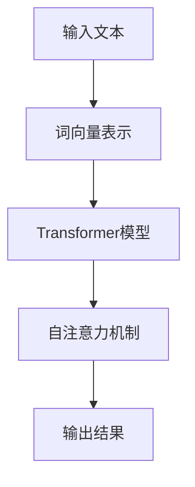
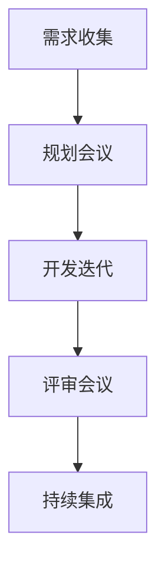

                 


### 第一部分：LLM基础

#### 第1章：LLM概述

LLM，即大型语言模型（Large Language Model），是一种基于深度学习的自然语言处理（NLP）技术，能够对自然语言文本进行理解和生成。LLM的应用范围广泛，从文本生成、翻译、问答系统到对话系统，都有着显著的成效。

**1.1 LLM的定义**

LLM是由大量神经网络参数组成的复杂模型，通过学习大量文本数据，能够捕捉到语言的内在规律和语义信息。LLM的核心在于其能够生成连贯、有意义的文本，并且具备较强的泛化能力。

**1.2 LLM的发展历程**

LLM的发展可以追溯到20世纪80年代，最早的模型如ELMO和WordNet。然而，由于计算资源和数据量的限制，LLM的发展一度陷入停滞。随着深度学习技术的兴起和计算资源的提升，LLM迎来了新的发展机遇。2018年，Google的BERT模型标志着LLM进入了一个新的时代。随后，GPT-3、T5等大型LLM相继推出，进一步推动了NLP领域的发展。

**1.3 LLM的关键技术**

LLM的关键技术包括：

- **预训练**：LLM通过在大规模文本数据上进行预训练，学习到语言的统计特性和语义信息。
- **微调**：在预训练的基础上，LLM通过在小规模的有监督数据集上进行微调，以适应特定的任务需求。
- **注意力机制**：注意力机制使得LLM能够捕捉到文本中的关键信息，提高模型的理解和生成能力。

#### 第2章：LLM架构分析

**2.1 LLM的基本组成部分**

LLM的基本组成部分包括：

- **词向量表示**：将自然语言文本转换为向量表示，以便模型进行学习和处理。
- **神经网络结构**：LLM通常采用多层神经网络结构，如Transformer、GRU、LSTM等。
- **损失函数**：常用的损失函数包括交叉熵损失、均方误差等。

**2.2 LLM的核心算法**

LLM的核心算法基于深度学习，尤其是基于Transformer架构。Transformer架构通过自注意力机制，使得模型能够捕捉到文本中的长距离依赖关系。

**2.3 Mermaid流程图：LLM架构**

下面是一个简单的Mermaid流程图，展示LLM的架构：



#### 第3章：LLM应用场景

LLM在多个领域都有广泛的应用，以下是几个典型的应用场景：

**3.1 语言理解与生成**

语言理解与生成是LLM最基本的应用场景，包括文本摘要、机器翻译、问答系统等。

**3.2 情感分析**

情感分析是利用LLM对文本中的情感倾向进行判断，常用于社交媒体监测、市场调研等领域。

**3.3 文本分类与信息检索**

文本分类与信息检索是利用LLM对文本进行分类和检索，如新闻分类、搜索引擎等。

---

### 第二部分：敏捷开发方法

#### 第4章：敏捷开发原理

敏捷开发是一种以人为核心、迭代、增量的软件开发方法。它强调团队协作、客户反馈和持续交付。

**4.1 敏捷开发的基本概念**

- **敏捷开发**：一种软件开发方法，强调适应性、灵活性和快速迭代。
- **Scrum**：一种流行的敏捷开发框架，强调短期迭代和持续改进。
- **Kanban**：一种可视化管理工具，用于监控项目进度和优化工作流程。

**4.2 敏捷开发与传统开发模式的区别**

- **开发周期**：敏捷开发采用短周期迭代，而传统开发模式通常采用长周期开发。
- **需求管理**：敏捷开发强调需求的变化和适应性，而传统开发模式则倾向于固定需求。
- **团队协作**：敏捷开发强调团队协作和自组织，而传统开发模式则强调分工和职责明确。

**4.3 敏捷开发的核心原则**

- **客户优先**：以满足客户需求为核心。
- **迭代开发**：通过短期迭代快速交付产品。
- **持续改进**：不断优化开发流程和产品质量。
- **团队协作**：鼓励团队成员之间的协作和知识共享。

#### 第5章：敏捷开发流程

敏捷开发流程通常包括以下阶段：

- **需求收集**：与客户沟通，收集和整理需求。
- **规划会议**：确定迭代目标和任务分配。
- **开发迭代**：按照迭代计划进行开发。
- **评审会议**：评估迭代成果和反馈。
- **持续集成**：将迭代成果合并到主分支，并进行测试。

**5.1 敏捷开发的核心流程**

下面是一个简单的Mermaid流程图，展示敏捷开发的核心流程：



**5.2 敏捷开发工具介绍**

常见的敏捷开发工具有Jira、Trello、Asana等，这些工具可以帮助团队管理任务、跟踪进度和协作沟通。

**5.3 Mermaid流程图：敏捷开发流程**


---

### 第三部分：文档管理最佳实践

#### 第6章：文档管理最佳实践

文档管理是软件开发过程中至关重要的一环，良好的文档管理可以提高开发效率，降低沟通成本，确保项目顺利进行。

**6.1 文档的重要性**

- **知识传递**：文档可以帮助团队成员理解和掌握项目细节。
- **代码可维护性**：详细的文档可以提高代码的可维护性，便于后续的代码更新和维护。
- **项目追踪**：文档可以作为项目进展的记录，便于项目管理和评估。

**6.2 敏捷文档管理的挑战**

- **文档更新滞后**：在敏捷开发中，需求经常发生变化，导致文档更新不及时。
- **文档分散**：团队成员可能在不同的平台或工具中保存文档，导致查找困难。
- **文档质量参差不齐**：团队成员的文档编写能力不同，导致文档质量参差不齐。

**6.3 敏捷文档管理最佳实践**

- **版本控制**：使用版本控制工具（如Git）管理文档，确保文档的版本一致性。
- **自动化生成**：使用自动化工具（如Sphinx、Mkdocs）生成文档，减少人工编写的工作量。
- **文档规范化**：制定文档编写规范，确保文档的质量和一致性。
- **文档评审**：定期进行文档评审，确保文档的准确性和完整性。

---

### 第四部分：文档自动化工具与框架

#### 第7章：文档自动化的原理

文档自动化是提高软件开发效率的重要手段，通过自动化工具，可以简化文档的生成、更新和维护过程。

**7.1 文档自动化的需求**

- **快速迭代**：在敏捷开发中，需求变化频繁，文档需要及时更新。
- **团队协作**：团队成员分布在不同的地点，文档自动化可以提高协作效率。
- **文档维护**：自动化工具可以减少文档维护的工作量，提高开发效率。

**7.2 文档自动化的方法**

- **模板生成**：使用模板生成文档，可以根据项目配置动态生成文档内容。
- **数据驱动**：使用数据驱动文档生成，可以根据代码和配置文件生成文档。
- **静态站点生成器**：使用静态站点生成器（如Jekyll、Hexo）生成静态文档网站。

**7.3 伪代码：文档自动化的算法**

```python
# 文档自动化的伪代码

# 步骤1：读取项目配置
config = read_config()

# 步骤2：获取代码和文档源文件
code_files = get_code_files()
doc_files = get_doc_files()

# 步骤3：生成文档
for file in code_files:
    doc_content = generate_doc(file)
    write_doc(file, doc_content)

for file in doc_files:
    doc_content = generate_doc(file)
    write_doc(file, doc_content)
```

---

#### 第8章：常用文档自动化工具

在软件开发中，常用的文档自动化工具有Sphinx、Mkdocs、Read the Docs等。

**8.1 Sphinx**

Sphinx是一个基于Python的文档生成工具，能够生成HTML、PDF、EPUB等多种格式的文档。Sphinx使用ReST（ReStructuredText）作为标记语言，具有强大的文档生成能力和扩展性。

**8.2 Mkdocs**

Mkdocs是一个基于Markdown的文档生成工具，简单易用，适用于生成Markdown格式的文档。Mkdocs支持自定义主题和插件，可以灵活地配置文档样式和功能。

**8.3 Read the Docs**

Read the Docs是一个在线文档托管平台，支持多种文档生成工具，如Sphinx、Mkdocs等。Read the Docs可以自动检测文档源文件的变化，并生成更新后的文档，方便团队成员查看和使用。

---

#### 第9章：自定义文档生成框架

在实际项目中，可能需要根据项目特点定制文档生成框架，以满足特定的文档需求。

**9.1 文档生成框架的设计**

文档生成框架的设计应考虑以下几个方面：

- **模块化**：将文档生成过程分解为多个模块，便于维护和扩展。
- **配置化**：通过配置文件定义文档生成规则，提高灵活性。
- **可扩展性**：支持自定义插件和扩展功能，满足多样化的需求。

**9.2 伪代码：文档生成框架的核心算法**

```python
# 文档生成框架的伪代码

# 步骤1：加载配置
config = load_config()

# 步骤2：初始化文档生成器
generator = DocumentGenerator(config)

# 步骤3：生成文档
for file in source_files:
    content = generator.generate(file)
    save_document(file, content)

# 步骤4：生成静态站点
static_site = generator.generate_site()
save_site(static_site)
```

**9.3 实践案例：使用自定义框架生成文档**

在实际项目中，可以使用自定义文档生成框架来生成文档。以下是一个简单的实践案例：

- **项目背景**：假设我们需要为一个开源项目生成文档，包括代码文档、用户手册和开发指南。
- **环境搭建**：搭建自定义文档生成框架的开发环境，包括Python环境、文档生成工具和配置文件。
- **代码实现**：编写自定义文档生成器的代码，实现文档生成功能。
- **文档生成**：运行自定义文档生成框架，生成项目文档。
- **文档发布**：将生成的文档发布到项目网站上，便于团队成员查看和使用。

---

### 第五部分：文档版本控制

#### 第10章：版本控制的基本概念

版本控制是文档管理的重要一环，通过版本控制工具，可以有效地管理文档的版本和历史。

**10.1 版本控制的必要性**

- **文档更新**：随着项目的发展，文档需要不断更新。
- **历史记录**：版本控制可以记录文档的历史版本，便于追溯和审计。
- **协作开发**：版本控制可以确保团队成员之间的文档同步和协作。

**10.2 版本控制工具概述**

常见的版本控制工具有Git、Subversion（SVN）、Mercurial（Hg）等。其中，Git是目前最流行的版本控制工具，具有强大的分支管理、分布式存储和协作功能。

**10.3 伪代码：版本控制算法**

```python
# 版本控制的伪代码

# 步骤1：初始化版本库
repo = initialize_repo()

# 步骤2：添加文件
repo.add_file(file)

# 步骤3：提交变更
repo.commit_changes()

# 步骤4：创建分支
branch = repo.create_branch("feature/xxx")

# 步骤5：合并分支
repo.merge(branch)

# 步骤6：推送变更
repo.push_changes()
```

---

#### 第11章：Git版本控制系统

Git是一个开源的分布式版本控制系统，广泛用于软件项目和文档的版本控制。

**11.1 Git的基本操作**

- **初始化仓库**：`git init`
- **添加文件**：`git add file`
- **提交变更**：`git commit -m "commit message"`
- **查看日志**：`git log`
- **创建分支**：`git branch branch_name`
- **切换分支**：`git checkout branch_name`
- **合并分支**：`git merge branch_name`
- **推送变更**：`git push`

**11.2 Git分支管理**

分支管理是Git的核心功能之一，通过分支管理，可以有效地实现代码的并行开发和合并。

- **创建分支**：`git branch feature/xxx`
- **切换分支**：`git checkout feature/xxx`
- **合并分支**：`git merge feature/xxx`
- **删除分支**：`git branch -d feature/xxx`

**11.3 Git与文档管理的结合**

在文档管理中，Git可以用来管理文档的版本和历史，确保文档的更新和同步。

- **初始化仓库**：将文档文件添加到Git仓库，进行版本控制。
- **提交变更**：每次文档更新后，使用Git提交变更，记录版本历史。
- **分支管理**：创建分支来管理不同版本的文档，实现文档的并行更新和协作。

---

#### 第12章：文档版本控制实践

在实际项目中，文档版本控制是确保项目顺利进行的重要保障。以下是一些实践经验和最佳实践。

**12.1 文档版本控制的挑战**

- **文档更新滞后**：文档更新滞后可能导致团队成员无法及时查看最新文档。
- **文档分散**：文档分散在不同地方，导致查找和同步困难。
- **文档冲突**：多个团队成员同时修改同一份文档，可能导致版本冲突。

**12.2 版本控制最佳实践**

- **集中管理**：将文档集中存放在版本控制系统中，便于管理和同步。
- **定期备份**：定期备份文档，确保文档的安全性。
- **分支管理**：使用分支管理不同版本的文档，避免版本冲突。
- **文档评审**：定期进行文档评审，确保文档的质量和准确性。

**12.3 实践案例：使用Git管理文档版本**

以下是一个简单的实践案例，展示如何使用Git管理文档版本。

- **项目背景**：假设我们需要为一个开源项目管理文档，包括用户手册、开发指南和代码文档。
- **环境搭建**：搭建Git仓库，将文档文件添加到Git仓库中。
- **文档更新**：每次文档更新后，使用Git提交变更，记录版本历史。
- **分支管理**：创建分支来管理不同版本的文档，实现文档的并行更新和协作。
- **文档发布**：将生成的新版本文档发布到项目网站上，便于团队成员查看和使用。

---

### 第六部分：代码与文档同步

#### 第13章：代码与文档同步的重要性

在软件开发过程中，代码与文档的同步至关重要。良好的代码与文档同步可以提高代码的可读性、可维护性和项目的整体质量。

**13.1 代码与文档同步的目标**

- **保持一致性**：确保代码和文档描述的内容一致，避免出现矛盾和误解。
- **减少重复工作**：通过自动同步，减少重复编写文档的工作量，提高开发效率。
- **便于维护**：确保文档能够及时更新，反映最新的代码状态。

**13.2 代码与文档同步的挑战**

- **文档编写与代码修改不同步**：文档编写和代码修改可能不同步，导致文档描述与代码不一致。
- **文档更新不及时**：文档更新不及时，可能导致文档过时，影响项目进展。
- **文档分散**：文档分散在不同地方，导致查找和同步困难。

**13.3 伪代码：代码与文档同步算法**

```python
# 代码与文档同步的伪代码

# 步骤1：读取代码库
code_repo = read_code_repo()

# 步骤2：读取文档库
doc_repo = read_doc_repo()

# 步骤3：比较代码和文档的差异
diffs = compare_repos(code_repo, doc_repo)

# 步骤4：更新文档
for diff in diffs:
    update_doc(doc_repo, diff)

# 步骤5：提交文档更新
doc_repo.commit_changes()
```

---

#### 第14章：代码与文档同步工具

为了实现代码与文档的同步，可以使用一些专门的工具来辅助开发。

**14.1 Doxygen**

Doxygen是一个文档生成工具，主要用于生成代码的文档。Doxygen支持多种编程语言，可以自动提取代码中的注释，生成详细的文档。

**14.2 Swagger**

Swagger是一个用于生成、描述和可视化RESTful API的文档的工具。Swagger可以将API接口描述转换为文档，方便开发者查看和使用。

**14.3 AsciiDoc**

AsciiDoc是一种简单的文本标记语言，用于编写文档。AsciiDoc生成的文档格式多样，包括HTML、PDF、Word等。

---

#### 第15章：实践案例：实现代码与文档的同步

以下是一个简单的实践案例，展示如何实现代码与文档的同步。

**15.1 环境搭建**

- **安装Doxygen**：安装Doxygen，配置环境变量。
- **安装Swagger**：安装Swagger，配置API接口描述文件。
- **安装AsciiDoc**：安装AsciiDoc，配置文档生成工具。

**15.2 源代码详细实现**

- **代码注释**：在代码中添加必要的注释，确保注释与代码内容一致。
- **接口文档**：使用Swagger生成API接口文档，描述接口的请求和响应。
- **文档模板**：编写AsciiDoc文档模板，用于生成项目文档。

**15.3 文档生成与同步**

- **生成代码文档**：使用Doxygen生成代码文档，更新项目文档。
- **生成接口文档**：使用Swagger生成API接口文档，更新项目文档。
- **文档发布**：将生成的文档发布到项目网站上，方便团队成员查看和使用。

**15.4 代码与文档同步分析**

- **一致性分析**：比较代码和文档的差异，确保文档描述与代码一致。
- **更新策略**：制定文档更新的策略，确保文档能够及时更新。
- **自动化同步**：使用自动化工具实现代码与文档的同步，减少人工干预。

---

### 附录

#### 附录A：相关工具与资源

- **Doxygen官方文档**：[https://www.doxygen.org/doc.html](https://www.doxygen.org/doc.html)
- **Swagger官方文档**：[https://swagger.io/docs/](https://swagger.io/docs/)
- **AsciiDoc官方文档**：[https://asciidoc.org/doc.html](https://asciidoc.org/doc.html)
- **Git官方文档**：[https://git-scm.com/docs](https://git-scm.com/docs)
- **敏捷开发资料**：[https://www.agilealliance.org/resources/](https://www.agilealliance.org/resources/)

---

### 总结

本文从LLM基础、敏捷开发方法、文档管理最佳实践、文档自动化工具与框架、文档版本控制、代码与文档同步等方面，全面介绍了LLM应用开发中的敏捷文档管理。通过本文的阐述，读者可以了解到如何在实际项目中高效地管理文档，提高开发效率，确保项目顺利进行。

---

**作者：AI天才研究院/AI Genius Institute & 禅与计算机程序设计艺术 /Zen And The Art of Computer Programming**

