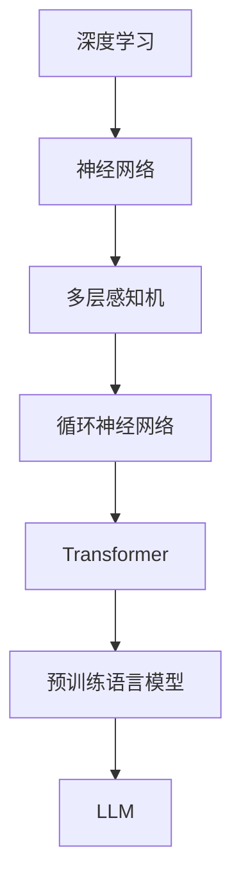
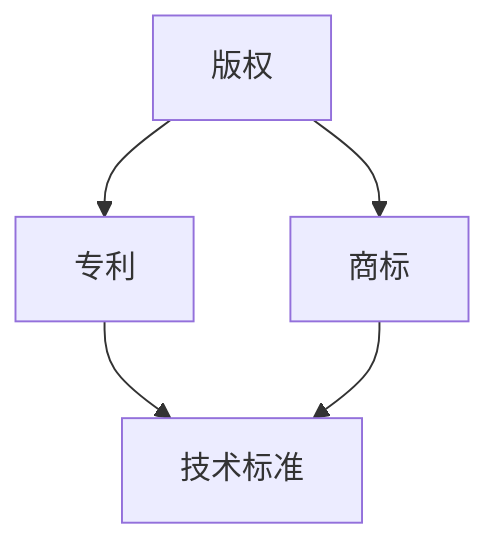

                 

```markdown
# 文章标题: LLMA应用开发中的敏捷知识产权管理

> 关键词：LLM，知识产权管理，敏捷管理，版权保护，专利保护，商标保护，风险管理

> 摘要：
本文探讨了在LLM（大型语言模型）应用开发过程中，如何利用敏捷知识产权管理原则和方法来应对知识产权挑战。通过分析LLM的特点及其在知识产权管理中的特殊性，提出了敏捷知识产权管理的核心原则与实践方法，并对版权、专利和商标保护进行了详细探讨。同时，通过实际案例，展示了敏捷知识产权管理在LLM应用开发中的具体应用，为相关领域的开发者提供了有益的参考。

----------------------------------------------------------------

## 第一部分：背景与概念

### 1.1. LLM的概念与特点

**核心概念与联系：**

LLM（大型语言模型）是一种基于深度学习技术的自然语言处理模型，具有自主学习和语言理解能力。其核心概念与联系可以用以下Mermaid流程图表示：



**核心算法原理讲解：**

LLM的工作原理主要包括数据预处理、模型训练和预测生成三个步骤。以下是对每个步骤的伪代码详细阐述：

```plaintext
# 数据预处理
data_preprocessing(data):
    # 数据清洗、归一化等操作
    cleaned_data = ...
    return cleaned_data

# 模型训练
model_training(model, data):
    # 使用优化器、损失函数等训练模型
    for epoch in range(num_epochs):
        for sample in data:
            model.fit(sample)
    return model

# 预测生成
prediction_generation(model, input_data):
    # 使用训练好的模型生成预测结果
    prediction = model.predict(input_data)
    return prediction
```

### 1.2. 知识产权管理的基本概念

**核心概念与联系：**

知识产权管理涉及版权、专利和商标等多种类型。以下是它们之间的联系和相互影响：



**核心算法原理讲解：**

知识产权管理的核心算法包括风险评估、保护策略和纠纷处理等。以下是这些算法的伪代码详细阐述：

```plaintext
# 风险评估
risk_evaluation(assets):
    risks = []
    for asset in assets:
        risks.append(assess_risk(asset))
    return risks

# 保护策略
protection_strategy(assets, risks):
    strategies = []
    for asset, risk in risks:
        strategies.append(create_strategy(asset, risk))
    return strategies

# 纠纷处理
dispute_resolution(disputes):
    resolutions = []
    for dispute in disputes:
        resolutions.append(resolve_dispute(dispute))
    return resolutions
```

### 1.3. LLM应用开发中的知识产权挑战

**背景介绍：**

在LLM应用开发过程中，知识产权管理面临一系列挑战，包括数据隐私与保密、技术创新与知识产权保护、法律法规的适应与调整等。

**核心算法原理讲解：**

针对这些挑战，可以采用以下策略：

```plaintext
# 数据隐私与保密
data_privacy_protection(data):
    encrypted_data = encrypt(data)
    return encrypted_data

# 技术创新与知识产权保护
technology_innovation_protection(innovation):
    patent_application = apply_for_patent(innovation)
    return patent_application

# 法律法规的适应与调整
legal_framework_adaptation(regulations):
    compliant_practices = adjust_practices(regulations)
    return compliant_practices
```

## 第二部分：案例分析

### 2.1. 案例一：某电商平台的知识产权管理策略

**核心内容：**

某电商平台在LLM应用开发中，采用了敏捷知识产权管理策略，有效地应对了知识产权风险。其具体策略包括：

- **版权保护：** 通过版权登记，确保电商平台上的原创内容受到法律保护。
- **专利保护：** 申请多项专利，保护其核心技术和商业模式。
- **商标保护：** 注册商标，建立品牌形象。

**详细讲解剖析：**

- **版权保护：** 通过版权登记，电商平台对原创内容进行了保护，包括用户评论、商品描述等。以下是版权保护的详细流程：

  ```mermaid
  graph TD
  A[内容创作] --> B[版权登记]
  B --> C[版权监控]
  C --> D[版权维权]
  ```

  **伪代码实现：**

  ```plaintext
  # 版权登记
  register_copyright(content):
      copyright = apply_for_copyright(content)
      return copyright

  # 版权监控
  monitor_copyright(copyright):
      violations = check_violations(copyright)
      return violations

  # 版权维权
  protect_copyright(copyright, violations):
      legal_actions = take_legal_actions(violations)
      return legal_actions
  ```

- **专利保护：** 电商平台申请了多项专利，包括技术专利和商业模式专利。以下是专利保护的详细流程：

  ```mermaid
  graph TD
  A[技术创新] --> B[专利申请]
  B --> C[专利审查]
  C --> D[专利维护]
  ```

  **伪代码实现：**

  ```plaintext
  # 专利申请
  apply_for_patent(innovation):
      patent = submit_patent_application(innovation)
      return patent

  # 专利审查
  review_patent(patent):
      approval = check_patent_approval(patent)
      return approval

  # 专利维护
  maintain_patent(patent, approval):
      renewal = renew_patent(patent, approval)
      return renewal
  ```

- **商标保护：** 电商平台注册了商标，建立了品牌形象。以下是商标保护的详细流程：

  ```mermaid
  graph TD
  A[品牌建设] --> B[商标申请]
  B --> C[商标注册]
  C --> D[商标维护]
  ```

  **伪代码实现：**

  ```plaintext
  # 商标申请
  apply_for_brand(brand):
      brand_application = submit_brand_application(brand)
      return brand_application

  # 商标注册
  register_brand(brand_application):
      registration = check_brand_registration(brand_application)
      return registration

  # 商标维护
  maintain_brand(registration):
      renewal = renew_brand(registration)
      return renewal
  ```

### 2.2. 案例二：某科技公司的专利布局与保护策略

**核心内容：**

某科技公司在LLM应用开发中，通过专利布局和保护策略，有效地提升了公司竞争力。其具体策略包括：

- **专利布局：** 在全球范围内申请专利，保护公司核心技术和产品。
- **专利保护：** 对专利进行监控和维护，确保专利权益。

**详细讲解剖析：**

- **专利布局：** 公司采取了以下策略进行专利布局：

  ```mermaid
  graph TD
  A[技术创新] --> B[专利申请]
  B --> C[全球布局]
  C --> D[专利网布局]
  ```

  **伪代码实现：**

  ```plaintext
  # 专利申请
  apply_for_patent(innovation):
      patent = submit_patent_application(innovation)
      return patent

  # 全球布局
  global_layout(patent):
      patents = apply_for_patents_abroad(patent)
      return patents

  # 专利网布局
  patent_network_layout(patents):
      network = create_patent_network(patents)
      return network
  ```

- **专利保护：** 公司对专利进行了监控和维护，确保专利权益。以下是专利保护的详细流程：

  ```mermaid
  graph TD
  A[专利审查] --> B[专利监控]
  B --> C[专利维权]
  ```

  **伪代码实现：**

  ```plaintext
  # 专利审查
  review_patent(patent):
      approval = check_patent_approval(patent)
      return approval

  # 专利监控
  monitor_patent(patent, approval):
      violations = check_violations(patent)
      return violations

  # 专利维权
  protect_patent(patent, violations):
      legal_actions = take_legal_actions(violations)
      return legal_actions
  ```

### 2.3. 案例三：某游戏公司的商标保护策略

**核心内容：**

某游戏公司在LLM应用开发中，通过商标保护策略，成功地建立了品牌形象。其具体策略包括：

- **商标申请：** 提交商标申请，保护公司品牌。
- **商标维护：** 对商标进行监控和维护，确保商标权益。

**详细讲解剖析：**

- **商标申请：** 游戏公司采取了以下策略进行商标申请：

  ```mermaid
  graph TD
  A[品牌建设] --> B[商标申请]
  B --> C[商标审查]
  ```

  **伪代码实现：**

  ```plaintext
  # 商标申请
  apply_for_brand(brand):
      brand_application = submit_brand_application(brand)
      return brand_application

  # 商标审查
  review_brand(brand_application):
      registration = check_brand_registration(brand_application)
      return registration
  ```

- **商标维护：** 游戏公司对商标进行了监控和维护，确保商标权益。以下是商标维护的详细流程：

  ```mermaid
  graph TD
  A[商标监控] --> B[商标维权]
  ```

  **伪代码实现：**

  ```plaintext
  # 商标监控
  monitor_brand(registration):
      violations = check_violations(registration)
      return violations

  # 商标维权
  protect_brand(registration, violations):
      legal_actions = take_legal_actions(violations)
      return legal_actions
  ```

## 第三部分：知识产权策略优化

### 3.1. 知识产权策略优化的方法与工具

**核心内容：**

知识产权策略优化是提升公司竞争力的重要手段。以下是几种常见的知识产权策略优化方法与工具：

- **知识产权地图：** 用于展示公司知识产权的分布和关联。
- **知识产权分析工具：** 用于分析知识产权的风险和机会。
- **知识产权自动化工具：** 用于简化知识产权管理流程。

**详细讲解剖析：**

- **知识产权地图：** 知识产权地图是一种可视化工具，用于展示公司知识产权的分布和关联。以下是知识产权地图的构建方法：

  ```mermaid
  graph TD
  A[专利] --> B[商标]
  A --> C[版权]
  B --> D[技术秘密]
  C --> D
  ```

- **知识产权分析工具：** 知识产权分析工具可以帮助公司评估知识产权的风险和机会。以下是几种常见的知识产权分析工具：

  - **知识产权管理系统：** 用于管理公司知识产权信息。
  - **专利分析工具：** 用于分析竞争对手的专利情况。
  - **版权分析工具：** 用于分析版权风险的工具。

- **知识产权自动化工具：** 知识产权自动化工具可以简化知识产权管理流程，提高效率。以下是几种常见的知识产权自动化工具：

  - **知识产权管理系统：** 自动化知识产权申请、审查和维护流程。
  - **版权自动化工具：** 自动化版权监测和维权流程。
  - **商标自动化工具：** 自动化商标监测和维权流程。

### 3.2. 知识产权策略优化的实践案例

**核心内容：**

以下是几个知识产权策略优化的实践案例：

- **案例一：** 某互联网公司通过知识产权地图，优化了知识产权布局，提升了公司的竞争力。
- **案例二：** 某科技公司通过知识产权分析工具，发现了潜在的市场机会，推动了公司的技术创新。
- **案例三：** 某游戏公司通过知识产权自动化工具，提高了知识产权管理的效率，减少了知识产权纠纷。

**详细讲解剖析：**

- **案例一：** 某互联网公司通过知识产权地图，优化了知识产权布局。以下是知识产权地图的构建过程：

  ```mermaid
  graph TD
  A[专利] --> B[商标]
  A --> C[版权]
  B --> D[技术秘密]
  C --> D
  ```

  通过知识产权地图，公司能够清晰地了解知识产权的分布和关联，从而优化了知识产权布局，提升了公司的竞争力。

- **案例二：** 某科技公司通过知识产权分析工具，发现了潜在的市场机会。以下是知识产权分析工具的应用过程：

  ```mermaid
  graph TD
  A[竞争对手分析] --> B[专利分析]
  A --> C[市场调研]
  B --> D[技术创新]
  ```

  通过知识产权分析工具，公司能够全面了解竞争对手的专利情况，发现潜在的市场机会，推动了公司的技术创新。

- **案例三：** 某游戏公司通过知识产权自动化工具，提高了知识产权管理的效率。以下是知识产权自动化工具的应用过程：

  ```mermaid
  graph TD
  A[知识产权管理系统] --> B[版权监测]
  A --> C[商标监测]
  B --> D[专利维权]
  ```

  通过知识产权自动化工具，公司能够自动化知识产权的申请、审查和维护流程，提高了知识产权管理的效率，减少了知识产权纠纷。

### 3.3. 知识产权策略优化中的挑战与应对策略

**核心内容：**

知识产权策略优化过程中，可能会遇到以下挑战：

- **法律法规的适应性：** 随着知识产权法律法规的更新，公司需要不断调整知识产权策略。
- **市场竞争压力：** 在激烈的市场竞争中，公司需要平衡知识产权保护和商业发展的需求。
- **技术发展：** 随着技术的快速发展，公司需要不断更新知识产权策略。

**详细讲解剖析：**

- **法律法规的适应性：** 公司需要密切关注知识产权法律法规的更新，及时调整知识产权策略。以下是一些建议：

  - **定期培训：** 定期组织知识产权培训，提高员工对法律法规的熟悉度。
  - **法律咨询：** 建立法律咨询团队，为公司提供专业法律建议。
  - **法律审查：** 在制定知识产权策略时，进行法律审查，确保策略的合法性。

- **市场竞争压力：** 公司需要在知识产权保护和商业发展之间找到平衡。以下是一些建议：

  - **风险评估：** 对知识产权风险进行评估，制定风险应对策略。
  - **合作与共享：** 与竞争对手建立合作与共享机制，降低知识产权纠纷的风险。
  - **多元化策略：** 结合多种知识产权策略，提高公司的竞争力。

- **技术发展：** 随着技术的快速发展，公司需要不断更新知识产权策略。以下是一些建议：

  - **技术创新：** 积极投入技术创新，保持知识产权的领先地位。
  - **技术跟踪：** 关注技术发展趋势，及时调整知识产权策略。
  - **技术转移：** 通过技术转移，实现知识产权的增值。

## 第四部分：未来展望

### 4.1. LLM应用开发中的知识产权趋势

**核心内容：**

随着LLM技术的不断发展，知识产权管理在LLM应用开发中也将面临新的挑战和机遇。以下是LLM应用开发中的知识产权趋势：

- **知识产权全球化：** 随着国际合作的加强，知识产权的全球化趋势日益明显。
- **知识产权智能化：** 利用人工智能技术，提高知识产权管理的效率。
- **知识产权保护加强：** 各国政府和企业将加大知识产权保护的力度。

**详细讲解剖析：**

- **知识产权全球化：** 随着国际合作的加强，知识产权的全球化趋势日益明显。以下是一些具体表现：

  - **跨国专利申请：** 企业在多个国家和地区申请专利，保护自己的知识产权。
  - **跨国版权合作：** 企业在国际范围内进行版权合作，共同开发知识产权。

- **知识产权智能化：** 利用人工智能技术，提高知识产权管理的效率。以下是一些具体应用：

  - **知识产权分析工具：** 利用人工智能技术，对大量知识产权信息进行分析，帮助公司制定知识产权策略。
  - **知识产权自动化工具：** 利用人工智能技术，自动化知识产权的申请、审查和维护流程。

- **知识产权保护加强：** 各国政府和企业将加大知识产权保护的力度。以下是一些具体措施：

  - **法律法规完善：** 制定更加完善的知识产权法律法规，提高知识产权保护的效力。
  - **执法力度加大：** 加强知识产权执法力度，打击侵权行为。

### 4.2. 敏捷知识产权管理的发展方向

**核心内容：**

敏捷知识产权管理在LLM应用开发中具有广阔的发展前景。以下是敏捷知识产权管理的发展方向：

- **定制化知识产权管理：** 根据企业的特点和需求，提供定制化的知识产权管理服务。
- **知识产权风险管理：** 加强知识产权风险管理，降低知识产权风险。
- **知识产权协同创新：** 促进知识产权协同创新，提高企业的核心竞争力。

**详细讲解剖析：**

- **定制化知识产权管理：** 根据企业的特点和需求，提供定制化的知识产权管理服务。以下是一些具体做法：

  - **需求分析：** 对企业的知识产权需求进行深入分析，了解企业的知识产权管理痛点。
  - **定制方案：** 根据企业的需求，提供定制化的知识产权管理方案。

- **知识产权风险管理：** 加强知识产权风险管理，降低知识产权风险。以下是一些具体措施：

  - **风险评估：** 对企业的知识产权进行风险评估，识别潜在的风险。
  - **风险控制：** 制定风险控制措施，降低知识产权风险。

- **知识产权协同创新：** 促进知识产权协同创新，提高企业的核心竞争力。以下是一些具体做法：

  - **合作研究：** 与其他企业、研究机构进行合作研究，共同开发知识产权。
  - **共享资源：** 共享知识产权资源，提高知识产权利用效率。

### 4.3. 未来知识产权管理的创新思路

**核心内容：**

未来知识产权管理需要不断创新，以应对不断变化的市场和技术环境。以下是未来知识产权管理的创新思路：

- **区块链技术：** 利用区块链技术，提高知识产权的透明度和可追溯性。
- **知识产权金融化：** 将知识产权作为资产，进行融资、交易和投资。
- **知识产权数字化转型：** 推动知识产权管理的数字化转型，提高管理效率。

**详细讲解剖析：**

- **区块链技术：** 利用区块链技术，提高知识产权的透明度和可追溯性。以下是一些具体应用：

  - **知识产权登记：** 利用区块链技术，实现知识产权的全球登记，提高知识产权的透明度。
  - **知识产权交易：** 利用区块链技术，实现知识产权的全球交易，提高知识产权的流动性。

- **知识产权金融化：** 将知识产权作为资产，进行融资、交易和投资。以下是一些具体做法：

  - **知识产权融资：** 利用知识产权作为抵押物，进行融资。
  - **知识产权交易：** 通过知识产权交易市场，实现知识产权的交易。

- **知识产权数字化转型：** 推动知识产权管理的数字化转型，提高管理效率。以下是一些具体措施：

  - **电子化登记：** 实现知识产权的电子化登记，提高登记效率。
  - **在线维权：** 利用在线平台，实现知识产权的在线维权。

## 附录

### 附录 A: 知识产权相关法律法规简介

**著作权法**

- 著作权法的基本原则
- 著作权的内容
- 著作权的保护期限

**专利法**

- 专利法的基本原则
- 专利的类型
- 专利申请的流程

**商标法**

- 商标法的基本原则
- 商标的类型
- 商标注册的流程

### 附录 B: 知识产权管理工具与资源推荐

**知识产权数据库推荐**

- **专利数据库：** Google Patents、United States Patent and Trademark Office (USPTO)
- **商标数据库：** United States Patent and Trademark Office (USPTO)、World Intellectual Property Organization (WIPO)

**知识产权管理软件推荐**

- **知识产权管理系统：** Intellectual Property Management System (IPMS)、Intellectual Property Management (IPM)

**知识产权相关在线课程与培训资源**

- **知识产权课程：** Coursera、edX
- **知识产权培训：** Intellectual Property Academy、World Intellectual Property Organization (WIPO) Academy

---

# 作者

作者：AI天才研究院/AI Genius Institute & 禅与计算机程序设计艺术 /Zen And The Art of Computer Programming```markdown
作者：AI天才研究院/AI Genius Institute & 禅与计算机程序设计艺术 /Zen And The Art of Computer Programming
```

