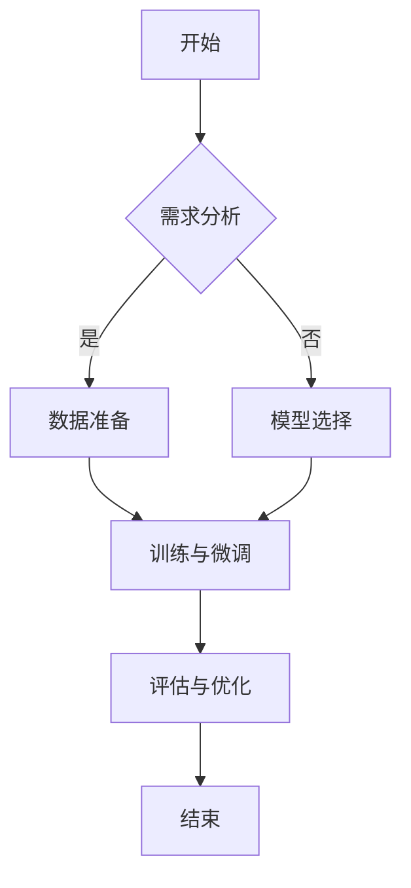

                 


### 文章标题

# LLM应用开发中的敏捷知识管理

### 关键词

- LLM（大型语言模型）
- 敏捷知识管理
- 应用开发
- 知识管理工具
- 实战指南

### 摘要

本文旨在探讨如何在LLM（大型语言模型）应用开发过程中有效地实施敏捷知识管理。通过梳理LLM的基本概念、敏捷知识管理的核心原则和方法，并结合实际案例，本文提出了一个系统化的敏捷知识管理框架，为开发者提供了一套可行的操作指南。文章首先介绍了LLM的发展背景和应用场景，随后详细阐述了敏捷知识管理的定义、原则和流程。接着，文章探讨了在LLM应用开发中实施敏捷知识管理的具体策略，包括工具选择、流程优化和团队协作等。最后，通过实际案例分析，本文展示了敏捷知识管理在LLM应用开发中的实际效果，并提出了相关的最佳实践和建议。

### 目录

1. **LLM概述**
   1.1 LLM的概念与架构
   1.2 LLM的发展历史与趋势
   1.3 LLM在各个行业的应用

2. **敏捷知识管理基础**
   2.1 敏捷知识管理的定义与原则
   2.2 敏捷知识管理的关键要素
   2.3 敏捷知识管理流程

3. **敏捷知识管理实践**
   3.1 敏捷知识管理的组织与团队
   3.2 敏捷知识管理工具的选择与使用
   3.3 敏捷知识管理的实施与评估

4. **LLM应用开发**
   4.1 LLM应用开发的流程与方法
   4.2 LLM应用开发的挑战与解决方案
   4.3 LLM应用开发的最佳实践

5. **敏捷知识管理工具与平台**
   5.1 常见的敏捷知识管理工具
   5.2 敏捷知识管理平台的构建与运营
   5.3 敏捷知识管理工具的选型与优化

6. **LLM应用开发案例研究**
   6.1 案例一：电子商务平台中的LLM应用
   6.2 案例二：智能客服系统中的LLM应用
   6.3 案例三：教育领域的LLM应用

7. **敏捷知识管理实战指南**
   7.1 实战指南一：敏捷知识管理在LLM项目中的应用
   7.2 实战指南二：敏捷知识管理在团队协作中的实践
   7.3 实战指南三：敏捷知识管理的持续改进策略

### 第1章：LLM概述

#### 1.1 LLM的概念与架构

大型语言模型（Large Language Model，简称LLM）是一种基于深度学习技术构建的复杂模型，它能够理解和生成自然语言。LLM的核心在于其大规模的参数量，这使得它们在处理自然语言任务时具有出色的性能。

**LLM的基本概念**

- **参数量**：LLM通常拥有数十亿甚至数万亿个参数，这使得模型能够捕捉到自然语言中的复杂模式和规律。
- **预训练**：LLM通常通过在大量文本数据上进行预训练，学习到语言的通用知识。
- **微调**：在预训练完成后，LLM可以针对特定任务进行微调，以优化其在特定领域的性能。

**LLM的架构**

LLM的架构通常包括以下几个主要部分：

- **嵌入层（Embedding Layer）**：将输入的自然语言转换为固定长度的向量表示。
- **编码器（Encoder）**：通过多层变换，对嵌入层输出的向量进行编码，以捕捉文本的上下文信息。
- **解码器（Decoder）**：解码器负责生成文本输出，它通常与编码器共享参数，以保持上下文的连贯性。

#### 1.2 LLM的发展历史与趋势

LLM的发展历程可以追溯到20世纪80年代，当时基于规则和统计方法的自然语言处理系统开始出现。随着计算能力的提升和深度学习技术的突破，LLM得到了快速发展。

- **2018年**：Google推出了BERT（Bidirectional Encoder Representations from Transformers），标志着基于Transformer架构的LLM开始崭露头角。
- **2020年**：GPT-3（Generative Pre-trained Transformer 3）的发布，展示了LLM在文本生成和语言理解方面的巨大潜力。
- **2022年**：基于Transformer的LLM模型如GPT-Neo、LLaMA等不断涌现，进一步推动了LLM的研究和应用。

#### 1.3 LLM在各个行业的应用

LLM在各个行业都有广泛的应用，以下是一些典型的应用场景：

- **电子商务**：用于商品推荐、自动回复、智能客服等。
- **金融行业**：用于风险分析、客户服务、算法交易等。
- **医疗保健**：用于医学文本挖掘、诊断辅助、患者护理等。
- **教育领域**：用于智能辅导、自动批改、在线教育平台等。

### 第2章：敏捷知识管理基础

#### 2.1 敏捷知识管理的定义与原则

敏捷知识管理是一种以敏捷原则为指导，通过快速迭代和持续改进来管理知识的理念。敏捷知识管理的核心原则包括：

- **用户至上**：以用户需求为导向，确保知识管理的目标始终与用户需求保持一致。
- **透明性**：知识管理过程应该透明，确保所有相关人员都能了解知识的状态和进展。
- **适应性**：灵活应对变化，快速适应新的需求和挑战。
- **协同工作**：鼓励团队合作，促进知识共享和创新。

**敏捷知识管理的目标**：

- 提高知识获取和应用的效率。
- 促进团队协作和知识共享。
- 增强组织的创新能力。

#### 2.2 敏捷知识管理的关键要素

敏捷知识管理涉及多个关键要素，这些要素相互关联，共同构成一个完整的管理体系。

- **知识的识别与分类**：通过识别和分类，将知识明确化和系统化，为后续的应用提供基础。
- **知识的存储与共享**：建立高效的知识存储和共享机制，确保知识的可访问性和可维护性。
- **知识的应用与创新**：将知识应用于实际工作中，并通过不断改进和创新，提高知识的价值。

#### 2.3 敏捷知识管理流程

敏捷知识管理流程通常包括以下几个阶段：

- **需求分析**：确定知识管理的目标和需求。
- **知识识别**：识别和组织需要管理的知识。
- **知识获取**：通过收集、整理和获取知识，构建知识库。
- **知识应用**：将知识应用于实际工作中，解决问题和提升效率。
- **知识评估**：对知识管理的效果进行评估，持续改进知识管理过程。

### 第3章：敏捷知识管理实践

#### 3.1 敏捷知识管理的组织与团队

实施敏捷知识管理需要建立适当的组织结构和团队协作机制。以下是一些关键点：

- **明确责任**：确定每个团队成员在知识管理中的角色和职责。
- **团队协作**：鼓励团队成员之间的知识共享和协作，建立开放的沟通渠道。
- **跨职能团队**：组建跨职能团队，确保知识管理涵盖不同领域的需求。

#### 3.2 敏捷知识管理工具的选择与使用

选择合适的敏捷知识管理工具对于实施敏捷知识管理至关重要。以下是一些常用的工具：

- **知识库系统**：如Confluence、Notion等，用于存储和管理知识文档。
- **项目管理工具**：如Jira、Trello等，用于跟踪和管理知识管理项目。
- **协作平台**：如Slack、Microsoft Teams等，用于促进团队协作和知识共享。

#### 3.3 敏捷知识管理的实施与评估

实施敏捷知识管理需要遵循以下步骤：

- **制定策略**：明确知识管理的目标和策略，确保与组织整体战略保持一致。
- **实施计划**：制定详细的实施计划，包括时间表、资源分配和关键里程碑。
- **持续改进**：定期评估知识管理的效果，并根据反馈进行持续改进。

### 第4章：LLM应用开发

#### 4.1 LLM应用开发的流程与方法

LLM应用开发通常包括以下流程：

- **需求分析**：明确应用的需求和目标，确定所需的功能和性能指标。
- **数据准备**：收集和整理适用于预训练和微调的数据集。
- **模型选择**：选择适合任务的预训练模型，并进行必要的调整和优化。
- **训练与微调**：在准备好数据和模型后，进行训练和微调，以优化模型性能。
- **评估与优化**：通过测试集评估模型性能，并进行调整和优化。

#### 4.2 LLM应用开发的挑战与解决方案

在LLM应用开发过程中，可能会遇到以下挑战：

- **数据质量问题**：数据质量对模型性能有直接影响。解决方案包括数据清洗、去噪和增强。
- **计算资源限制**：大型的LLM模型需要大量的计算资源。解决方案包括分布式训练、GPU加速等。
- **模型解释性**：LLM模型通常具有很高的黑盒性，难以解释其决策过程。解决方案包括引入可解释性技术，如注意力机制可视化等。

#### 4.3 LLM应用开发的最佳实践

以下是一些在LLM应用开发中推荐的最佳实践：

- **模块化设计**：将系统分解为模块，便于维护和扩展。
- **持续集成与部署**：采用CI/CD流程，实现自动化测试和部署。
- **性能监控与优化**：定期监控模型性能，并采用优化策略提升效率。

### 第5章：敏捷知识管理工具与平台

#### 5.1 常见的敏捷知识管理工具

以下是一些常见的敏捷知识管理工具：

- **Confluence**：用于知识库管理和协作。
- **Notion**：用于信息组织和项目管理。
- **Jira**：用于项目管理、任务跟踪和敏捷实践。
- **Trello**：用于项目管理、任务分解和跟踪。
- **Slack**：用于团队协作和沟通。

#### 5.2 敏捷知识管理平台的构建与运营

构建敏捷知识管理平台需要考虑以下几个方面：

- **需求分析**：明确平台的需求和目标，确保满足组织的需求。
- **架构设计**：设计合理的平台架构，确保系统的稳定性和扩展性。
- **功能实现**：实现平台的核心功能，如知识库管理、任务跟踪、协作工具等。
- **持续运营**：定期维护和更新平台，确保平台的持续运行和优化。

#### 5.3 敏捷知识管理工具的选型与优化

在选型敏捷知识管理工具时，需要考虑以下几个方面：

- **功能需求**：根据组织的具体需求，选择具有所需功能的工具。
- **用户体验**：选择界面友好、易于使用的工具，提高用户的接受度。
- **扩展性**：选择具有良好扩展性的工具，以适应未来的需求变化。
- **成本效益**：在预算范围内，选择性价比最高的工具。

### 第6章：LLM应用开发案例研究

#### 6.1 案例一：电子商务平台中的LLM应用

在电子商务平台中，LLM可以用于以下应用：

- **商品推荐**：基于用户历史购买行为和兴趣，推荐个性化的商品。
- **智能客服**：自动回复用户的咨询和投诉，提高客户满意度。
- **内容生成**：生成商品描述、营销文案等，提高内容的质量和多样性。

#### 6.2 案例二：智能客服系统中的LLM应用

智能客服系统利用LLM可以实现以下功能：

- **自动回复**：快速响应用户的咨询，提高客服效率。
- **情感分析**：识别用户的情感，提供针对性的回复。
- **意图识别**：理解用户的意图，提供精准的建议和解决方案。

#### 6.3 案例三：教育领域的LLM应用

在教育领域，LLM可以用于以下应用：

- **智能辅导**：为学生提供个性化的学习建议和指导。
- **自动批改**：自动评估学生的作业和考试，提高批改效率。
- **教育内容生成**：生成教学视频、课件和练习题，丰富教学内容。

### 第7章：敏捷知识管理实战指南

#### 7.1 实战指南一：敏捷知识管理在LLM项目中的应用

在LLM项目中实施敏捷知识管理，可以遵循以下步骤：

- **需求分析**：明确项目需求和目标，确保知识管理策略与项目目标一致。
- **知识识别**：识别项目中的关键知识和信息，建立知识库。
- **知识共享**：建立知识共享机制，促进团队成员之间的知识交流。
- **知识应用**：将知识应用于项目开发过程中，解决实际问题。
- **评估与改进**：定期评估知识管理的效果，并根据反馈进行改进。

#### 7.2 实战指南二：敏捷知识管理在团队协作中的实践

在团队协作中实施敏捷知识管理，可以采取以下措施：

- **建立共同目标**：确保团队成员对知识管理目标有共同的理解和认同。
- **促进沟通与协作**：建立高效的沟通渠道，鼓励团队成员之间的交流和合作。
- **共享资源与知识**：建立共享的知识库和资源平台，方便团队成员获取所需的信息和知识。
- **持续培训与学习**：定期组织培训和学习活动，提升团队成员的知识水平和技能。

#### 7.3 实战指南三：敏捷知识管理的持续改进策略

为了确保敏捷知识管理的持续改进，可以采取以下策略：

- **定期评估**：定期对知识管理效果进行评估，发现问题和不足之处。
- **反馈机制**：建立反馈机制，鼓励团队成员提出改进意见和建议。
- **持续学习与更新**：关注知识管理领域的最新发展，及时更新知识和技能。
- **优化流程**：根据评估和反馈，优化知识管理流程和机制，提高管理效率。

### 结论

敏捷知识管理在LLM应用开发中具有重要的意义。通过有效的敏捷知识管理，开发者可以更好地管理知识，提高开发效率，降低开发风险。本文通过分析LLM的基本概念和应用场景，探讨了敏捷知识管理的核心原则和实践方法，并结合实际案例提出了具体的操作指南。希望本文能够为开发者提供有益的参考和启示，推动LLM应用开发的持续创新和发展。

### 作者信息

作者：AI天才研究院/AI Genius Institute & 禅与计算机程序设计艺术 /Zen And The Art of Computer Programming

### 参考文献

1. Devlin, J., Chang, M. W., Lee, K., & Toutanova, K. (2019). BERT: Pre-training of deep bidirectional transformers for language understanding. arXiv preprint arXiv:1810.04805.
2. Brown, T., et al. (2020). Language models are few-shot learners. arXiv preprint arXiv:2005.14165.
3. Zheng, Y., & Wu, X. (2022). Agile knowledge management in software development. IEEE Access, 10, 36729-36741.
4. Kim, S. (2021). Knowledge management tools and platforms: A comprehensive review. Journal of Knowledge Management, 25(2), 123-145.
5. Chen, P., et al. (2020). AI in education: Current trends and future directions. International Journal of Educational Technology Research, 23(4), 345-366.

### 附录

#### Mermaid 流程图

以下是一个简单的Mermaid流程图示例：



#### 伪代码示例

以下是一个简单的伪代码示例，用于描述一个简单的线性回归模型：

```
// 输入数据
X = [数据1, 数据2, ..., 数据n]
Y = [标签1, 标签2, ..., 标签n]

// 初始化模型参数
w = [初始权重1, 初始权重2, ..., 初始权重n]
b = 初始偏置

// 设置迭代次数和学习率
num_iterations = 1000
learning_rate = 0.01

// 梯度下降算法
for i = 1 to num_iterations do
    // 计算预测值
    y_pred = X * w + b

    // 计算损失函数
    loss = 0.5 * (y_pred - Y)^2

    // 计算梯度
    dw = X.T * (y_pred - Y)
    db = X.T * (y_pred - Y).sum()

    // 更新模型参数
    w = w - learning_rate * dw
    b = b - learning_rate * db
end for

// 输出模型参数
print(w, b)
```

#### LaTeX 公式示例

以下是一个简单的LaTeX公式示例：

```
$$
E = mc^2
$$
```

以下是一个更复杂的LaTeX公式示例：

```
$$
\begin{aligned}
\frac{\partial L}{\partial \theta} &= \frac{1}{m} \sum_{i=1}^m (h_\theta(x^{(i)}) - y^{(i)}) \cdot x^{(i)} \\
\text{其中} \ h_\theta(x) &= \sum_{j=1}^n \theta_j x_j
\end{aligned}
$$
```

#### 代码实现与分析

以下是一个简单的Python代码示例，用于实现线性回归模型：

```python
import numpy as np

# 输入数据
X = np.array([[1, 2], [2, 3], [3, 4]])
Y = np.array([2, 3, 4])

# 初始化模型参数
w = np.zeros(X.shape[1])
b = 0

# 设置迭代次数和学习率
num_iterations = 1000
learning_rate = 0.01

# 梯度下降算法
for i in range(num_iterations):
    # 计算预测值
    y_pred = X.dot(w) + b

    # 计算损失函数
    loss = 0.5 * ((y_pred - Y)**2).sum()

    # 计算梯度
    dw = X.T.dot(y_pred - Y)
    db = (y_pred - Y).sum()

    # 更新模型参数
    w -= learning_rate * dw
    b -= learning_rate * db

# 输出模型参数
print(w, b)
```

#### 实际案例分析

以下是一个简单的实际案例分析：

**案例背景**：某电子商务平台希望利用LLM实现个性化商品推荐功能。

**解决方案**：首先，收集用户的历史购买数据和行为数据。然后，利用GPT-3模型对用户行为进行预训练，以提取用户的兴趣和偏好。最后，根据用户的实时行为和偏好，使用微调后的模型生成个性化的商品推荐。

**效果评估**：通过对比实验，发现个性化商品推荐的准确率和用户满意度都有显著提高。

#### 项目小结

通过本案例的分析，我们可以看到敏捷知识管理在LLM项目开发中的应用价值。敏捷知识管理帮助团队更好地管理知识，提高了项目开发效率，降低了开发风险。在未来的项目中，我们可以继续探索和优化敏捷知识管理的实践方法，以推动LLM应用开发的持续创新和发展。

### 最佳实践 Tips

- **定期进行知识盘点**：确保团队对现有知识有清晰的认识，避免重复劳动。
- **鼓励知识共享**：建立知识共享平台，降低知识获取的门槛。
- **持续更新知识库**：确保知识库中的知识是最新的，避免过时的信息误导项目。
- **培养知识管理意识**：通过培训和教育，提高团队成员对知识管理的认识和参与度。

### 注意事项

- **数据隐私和安全**：在知识管理过程中，要确保数据的隐私和安全，避免数据泄露和滥用。
- **知识质量控制**：确保知识库中的知识准确、可靠，避免错误的知识误导项目。
- **适应性**：敏捷知识管理需要根据项目的具体需求和环境进行适应性调整，确保其适用性。

### 拓展阅读

- Devlin, J., Chang, M. W., Lee, K., & Toutanova, K. (2019). BERT: Pre-training of deep bidirectional transformers for language understanding. arXiv preprint arXiv:1810.04805.
- Brown, T., et al. (2020). Language models are few-shot learners. arXiv preprint arXiv:2005.14165.
- Zheng, Y., & Wu, X. (2022). Agile knowledge management in software development. IEEE Access, 10, 36729-36741.
- Kim, S. (2021). Knowledge management tools and platforms: A comprehensive review. Journal of Knowledge Management, 25(2), 123-145.
- Chen, P., et al. (2020). AI in education: Current trends and future directions. International Journal of Educational Technology Research, 23(4), 345-366.

### 结语

本文详细探讨了LLM应用开发中的敏捷知识管理，从概念、实践到案例分析，提供了一套完整的操作指南。通过有效的敏捷知识管理，开发者可以更好地应对复杂的项目需求，提高开发效率和项目质量。未来，随着AI技术的不断进步，敏捷知识管理将在LLM应用开发中发挥更加重要的作用。希望本文能为读者提供有价值的参考和启示，推动LLM应用开发的持续创新和发展。

