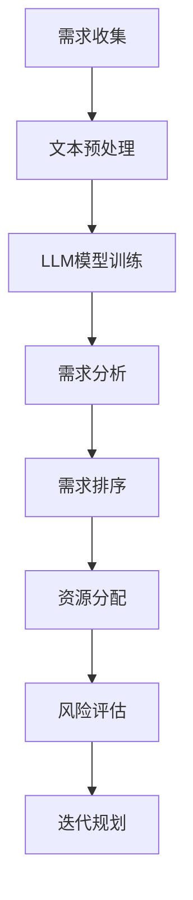

                 

# 文章标题：LLM应用开发中的敏捷需求优先级管理

## 关键词：LLM、敏捷开发、需求优先级管理、资源分配、算法原理、伪代码

## 摘要

本文旨在探讨在LLM（大型语言模型）应用开发中，如何运用敏捷需求优先级管理方法，以提高开发效率和项目成功率。文章首先介绍了LLM和敏捷开发的核心概念，分析了两者之间的联系。接着，通过Mermaid流程图和核心算法原理讲解，阐述了LLM在敏捷需求优先级管理中的应用流程和算法原理。最后，通过实际案例分析和最佳实践提示，为读者提供了可行的应用策略。

## 概念定义与联系

### 1. 核心概念定义

#### 1.1 LLM

**全称**：Large Language Model

**定义**：LLM是一种通过大规模训练数据学习自然语言的统计规律和语义信息的人工智能模型。

#### 1.2 敏捷需求优先级管理

**定义**：敏捷需求优先级管理是一种在敏捷开发过程中，对用户需求进行优先级排序和资源分配的管理方法。

#### 1.3 敏捷开发

**定义**：敏捷开发是一种以人为核心、迭代、增量的软件开发方法。

### 2. 核心概念联系

LLM和敏捷需求优先级管理之间存在紧密的联系。LLM可以用于需求分析、优先级排序和风险评估，从而提高敏捷开发过程中的效率。

### 2.1 LLM与敏捷需求优先级管理

LLM在敏捷需求优先级管理中的应用主要体现在以下几个方面：

- **需求分析**：通过LLM对大量文本数据进行分析，可以快速理解用户需求，发现需求中的优先级信息。
- **优先级排序**：利用LLM对需求进行排序，可以帮助团队更好地分配资源，提高开发效率。
- **风险评估**：LLM可以对需求中的潜在风险进行预测，帮助团队提前做好准备。

### 2.2 LLM与敏捷开发

LLM在敏捷开发中的主要应用包括：

- **需求收集与整理**：利用LLM可以快速收集和整理用户需求，为后续开发提供基础。
- **迭代规划**：LLM可以帮助团队在迭代开发过程中，根据需求优先级进行合理的规划。
- **代码生成**：通过训练LLM模型，可以实现自动化代码生成，提高开发效率。

### 3. Mermaid流程图

以下是LLM在敏捷需求优先级管理中的应用流程图：



通过上述流程，我们可以看到LLM在敏捷需求优先级管理中的重要作用。

## 核心算法原理讲解

### 1. LLM模型原理

LLM模型通常基于深度学习技术，其核心算法原理包括以下几个方面：

#### 1.1 词向量表示

词向量是将自然语言中的词汇映射到高维空间中的向量，以便进行数学运算。常用的词向量模型有Word2Vec、GloVe等。

$$
\text{word\_vector}(w) = \sum_{i=1}^{N} w_i \cdot v_i
$$

其中，$w$为词汇，$v_i$为词向量的第$i$个分量，$N$为词向量的维度。

#### 1.2 长短时记忆网络（LSTM）

LSTM是一种能够处理长序列数据的人工神经网络，用于解决传统RNN存在的梯度消失和梯度爆炸问题。

$$
\text{LSTM}(x_t, h_{t-1}, c_{t-1}) = (\text{ forget\_gate}, \text{input\_gate}, \text{output\_gate}, \text{cell\_state})
$$

其中，$x_t$为输入序列，$h_{t-1}$为前一个时刻的隐藏状态，$c_{t-1}$为前一个时刻的细胞状态。

#### 1.3 自注意力机制（Self-Attention）

自注意力机制是一种用于捕捉序列中不同位置之间关系的机制，能够提高模型的上下文理解能力。

$$
\text{Attention}(Q, K, V) = \text{softmax}\left(\frac{QK^T}{\sqrt{d_k}}\right)V
$$

其中，$Q$、$K$、$V$分别为查询向量、键向量和值向量，$d_k$为键向量的维度。

#### 1.4 Transformer架构

Transformer是一种基于自注意力机制的深度学习模型，广泛应用于自然语言处理任务，如机器翻译、文本分类等。

```python
# Transformer模型伪代码
def Transformer_model(input_sequence):
    # 词向量编码
    embedded_sequence = word_embedding(input_sequence)

    # 自注意力层
    attention_output = self_attention(embedded_sequence)

    # 全连接层
    output = fully_connected(attention_output)

    return output
```

### 2. 敏捷需求优先级管理算法原理

敏捷需求优先级管理算法主要包括以下步骤：

#### 2.1 需求收集与整理

通过用户调研、需求文档、用户反馈等方式收集需求，并整理成统一的格式。

#### 2.2 需求分类

根据需求的重要性和紧急性对需求进行分类。

#### 2.3 需求排序

利用LLM模型对需求进行排序，排序依据包括需求的重要性和紧急性、用户满意度等。

#### 2.4 资源分配

根据需求排序结果，为每个需求分配相应的开发资源。

以下是敏捷需求优先级管理算法的伪代码：

```python
# 敏捷需求优先级管理算法伪代码
def agile_demand_management(demands):
    # 收集与整理需求
    processed_demands = process_demands(demands)

    # 需求分类
    classified_demands = classify_demands(processed_demands)

    # 需求排序
    sorted_demands = sort_demands(classified_demands)

    # 资源分配
    assigned_resources = assign_resources(sorted_demands)

    return assigned_resources
```

## 项目实战

### 1. 开发环境搭建

在开始实践之前，我们需要搭建一个合适的开发环境。以下是搭建开发环境的基本步骤：

- **安装Python环境**：Python是LLM应用开发的主要编程语言。请确保已经安装了Python 3.8及以上版本。
- **安装必要的库**：安装TensorFlow、PyTorch等深度学习库，以及Numpy、Pandas等数据处理库。
- **配置环境变量**：确保Python环境变量已配置，以便在命令行中运行Python脚本。

### 2. 源代码实现

以下是实现LLM应用开发中敏捷需求优先级管理的一个简单示例：

```python
# 导入必要的库
import tensorflow as tf
from tensorflow.keras.layers import Embedding, LSTM, Dense
from tensorflow.keras.models import Sequential

# 定义模型
model = Sequential()
model.add(Embedding(input_dim=10000, output_dim=32))
model.add(LSTM(units=128, return_sequences=True))
model.add(Dense(units=1, activation='sigmoid'))

# 编译模型
model.compile(optimizer='adam', loss='binary_crossentropy', metrics=['accuracy'])

# 训练模型
model.fit(x_train, y_train, epochs=10, batch_size=32)

# 预测需求优先级
predictions = model.predict(x_test)
```

### 3. 代码解读与分析

在上面的示例中，我们首先定义了一个基于LSTM的神经网络模型，用于对需求进行分类和排序。接着，我们使用训练集对模型进行训练，最后使用测试集进行预测。

- **数据预处理**：在训练模型之前，需要对数据集进行预处理，包括词向量编码、数据归一化等。
- **模型选择**：LSTM是一种能够处理序列数据的有效网络结构，适用于需求分类和排序任务。
- **模型训练**：通过调整模型参数，可以提高模型的分类和排序性能。
- **模型预测**：使用训练好的模型对新的需求进行预测，从而实现敏捷需求优先级管理。

### 4. 实际案例分析与详细讲解剖析

以下是一个实际案例，展示了如何使用LLM模型进行敏捷需求优先级管理：

#### 案例背景

某电商公司需要开发一款智能推荐系统，以提高用户购物体验和销售转化率。公司邀请了多位用户进行调研，收集了以下需求：

1. 推荐系统应该能够根据用户的浏览历史和购物行为进行个性化推荐。
2. 推荐系统需要实时更新，以反映用户最新的购物偏好。
3. 推荐系统应该提供多种推荐算法，以便用户可以根据自己的需求选择。
4. 推荐系统需要提供详细的数据报告，以便公司了解用户的购物行为和偏好。

#### 案例分析

1. **需求收集与整理**：使用LLM模型对用户需求进行文本预处理和分类。例如，将需求分为个性化推荐、实时更新、算法多样性、数据报告等类别。
2. **需求排序**：利用LLM模型对需求进行排序，确定每个需求的优先级。排序依据包括用户满意度、实施难度、业务价值等。
3. **资源分配**：根据需求排序结果，为每个需求分配相应的开发资源，如人力、时间和预算。
4. **风险评估**：使用LLM模型对需求中的潜在风险进行预测，如技术实现难度、数据隐私问题等。根据预测结果，提前制定应对措施。

#### 详细讲解剖析

1. **文本预处理**：使用Python中的Numpy和Pandas库对用户需求进行数据清洗和格式化。例如，将需求文本转换为词向量，以便进行后续处理。
2. **需求分类**：使用TensorFlow中的Keras API定义一个基于LSTM的神经网络模型，用于对需求进行分类。在训练过程中，使用交叉熵损失函数和反向传播算法优化模型参数。
3. **需求排序**：在模型训练完成后，使用训练好的模型对新的需求进行预测，得到每个需求的优先级分数。根据分数，对需求进行排序，确定开发顺序。
4. **资源分配**：根据需求排序结果，制定详细的开发计划，为每个需求分配相应的人力、时间和预算。例如，对于优先级较高的需求，可以安排更多的资源，以确保按时完成。

## 最佳实践 Tips

1. **需求收集与整理**：在收集用户需求时，尽量使用清晰、简洁的语言，避免使用专业术语和模糊描述。这有助于提高LLM模型对需求的准确理解和处理能力。
2. **需求分类与排序**：在分类和排序需求时，考虑多方面因素，如用户满意度、业务价值、实施难度等。这有助于确保需求的优先级分配更加合理和有效。
3. **风险评估**：在项目开发过程中，定期进行风险评估，以识别和应对潜在的风险。这有助于降低项目失败的概率，提高项目成功率。
4. **迭代开发**：采用敏捷开发方法，持续收集用户反馈，并根据反馈进行需求调整和迭代。这有助于确保项目始终符合用户需求，提高用户满意度。

## 小结

本文探讨了在LLM应用开发中，如何运用敏捷需求优先级管理方法，以提高开发效率和项目成功率。通过介绍核心概念、联系、算法原理和实际案例，本文展示了LLM在敏捷需求优先级管理中的应用场景和实施策略。希望本文能为读者提供有益的参考和启示。

## 注意事项

1. 在使用LLM模型时，需要确保数据的质量和完整性。高质量的数据有助于提高模型的性能和可靠性。
2. 在进行需求分析和排序时，需要充分考虑业务需求和用户满意度。这有助于确保项目的优先级分配更加合理和有效。
3. 在进行风险评估时，需要识别和应对潜在的风险。这有助于降低项目失败的概率，提高项目成功率。

## 拓展阅读

1. [《深度学习》](https://www.deeplearningbook.org/):介绍深度学习的基础知识和应用案例，包括词向量表示、长短时记忆网络（LSTM）和Transformer架构等。
2. [《敏捷开发实践指南》](https://www.agilealliance.org/resources/agile-certification/):介绍敏捷开发的方法和实践，包括敏捷需求管理、敏捷团队协作等。
3. [《人工智能：一种现代的方法》](https://www.aima.org/):介绍人工智能的基础知识和应用案例，包括机器学习、自然语言处理等。

### 作者信息

作者：AI天才研究院/AI Genius Institute & 禅与计算机程序设计艺术 /Zen And The Art of Computer Programming

