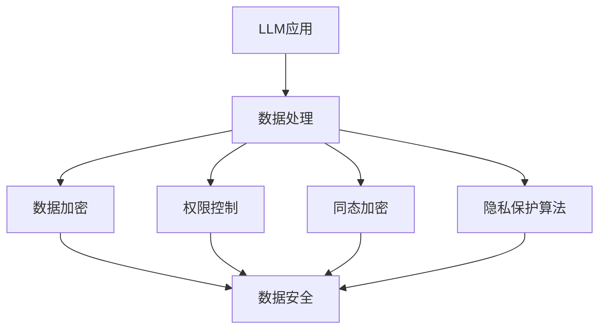

                 

# LLAMA 应用开发中的数据安全与隐私保护

## 关键词
- LLM（大型语言模型）
- 数据安全
- 隐私保护
- 加密算法
- 同态加密
- 权限控制
- 加密同态算法
- 差分隐私算法

## 摘要
随着人工智能技术的快速发展，大型语言模型（LLM）在应用开发中发挥着越来越重要的作用。然而，LLM应用涉及大量敏感数据，数据安全和隐私保护成为关键挑战。本文将深入探讨LLM应用开发中的数据安全与隐私保护问题，涵盖核心概念、算法原理、数学模型、项目实战等内容，为开发者提供实用的技术指南和最佳实践。

## 引言
### 背景介绍
近年来，人工智能领域取得了令人瞩目的进展，尤其是在自然语言处理（NLP）方面。大型语言模型（LLM）如GPT、BERT等在多个任务中表现出色，推动了智能语音助手、智能客服、内容生成等应用的发展。然而，LLM应用不仅依赖于海量数据，还需要处理用户生成的大量敏感信息，如个人身份、医疗记录、金融数据等。这些数据的安全和隐私保护成为开发者和用户关注的焦点。

### 核心概念与联系
1. **LLM基础概念**：介绍LLM的基本原理和类型，如GPT、BERT等。
2. **数据安全与隐私保护相关概念**：解释数据安全、数据隐私的基本概念和目标。
3. **LLM与数据安全与隐私保护的关联**：阐述LLM在数据安全和隐私保护中的作用以及面临的挑战。

### Mermaid流程图
下面是一个简单的Mermaid流程图，展示了LLM与数据安全、隐私保护之间的关联：



### 核心算法原理讲解
在LLM应用开发中，为确保数据安全与隐私保护，需要采用一系列核心算法。以下是几种常见算法及其原理：

1. **加密算法原理**：
   - **对称加密**：使用相同的密钥进行加密和解密。示例：AES。
   - **非对称加密**：使用一对密钥进行加密和解密。示例：RSA。

2. **权限控制算法原理**：
   - **基于角色的访问控制（RBAC）**：根据用户的角色分配权限。
   - **基于属性的访问控制（ABAC）**：根据用户的属性（如身份、位置等）分配权限。

3. **同态加密算法原理**：
   - **同态加密**：在加密数据上进行计算，得到的结果仍然是加密的，需要解密后才能解读。示例：TESLA。

4. **隐私保护算法原理**：
   - **加密同态算法**：在加密数据上进行计算，保证数据的隐私性。
   - **差分隐私算法**：通过添加噪声来隐藏个体信息，保证数据隐私。

### 数学模型和数学公式 & 详细讲解 & 举例说明
以下是几种核心算法的数学模型和公式：

1. **对称加密算法**：
   - 加密公式：\(C = E(K, M)\)，其中C是密文，K是密钥，M是明文。
   - 解密公式：\(M = D(K, C)\)。

2. **非对称加密算法**：
   - 加密公式：\(C = E(K_p, M)\)，其中K_p是公钥，M是明文。
   - 解密公式：\(M = D(K_s, C)\)，其中K_s是私钥。

3. **同态加密算法**：
   - 加密公式：\(C = E(K, M)\)，其中C是加密后的数据。
   - 同态计算公式：\(C' = C \circ F(M)\)，其中F(M)是计算函数。

4. **差分隐私算法**：
   - 差分隐私公式：\(L(\epsilon, R) = \frac{1}{\epsilon} \ln P(R | \epsilon)\)，其中L是隐私损失函数，\(\epsilon\)是噪声参数，R是输出结果。

### 项目实战
在本节中，我们将通过一个实际项目展示如何实现数据加密、权限控制和隐私保护。

1. **开发环境搭建**：
   - 选择一种编程语言（如Python）和相关的库（如PyCrypto、rbaclib等）。
   - 安装必要的依赖和工具。

2. **源代码详细实现**：
   - 实现对称加密算法（如AES）：
     ```python
     from Crypto.Cipher import AES
     from Crypto.Random import get_random_bytes

     key = get_random_bytes(16)
     cipher = AES.new(key, AES.MODE_EAX)
     cipher_text, tag = cipher.encrypt_and_digest(data)
     ```
   - 实现非对称加密算法（如RSA）：
     ```python
     from Crypto.PublicKey import RSA
     from Crypto.Cipher import PKCS1_OAEP

     key = RSA.generate(2048)
     private_key = key.export_key()
     public_key = key.publickey().export_key()

     cipher = PKCS1_OAEP.new(RSA.import_key(public_key))
     cipher_text = cipher.encrypt(data)
     ```

3. **代码解读与分析**：
   - 分析加密和解密过程，理解密钥的作用。
   - 分析权限控制机制，如RBAC和ABAC的实现。

4. **实际案例分析和详细讲解剖析**：
   - 通过实际案例展示加密、权限控制和隐私保护的应用。
   - 分析案例中的关键技术和实现细节。

5. **项目小结**：
   - 总结项目的主要成果和经验。
   - 提出改进和优化的方向。

### 最佳实践 tips、小结、注意事项、拓展阅读等内容
1. **最佳实践 tips**：
   - 在处理敏感数据时，优先选择经过验证的加密算法和库。
   - 定期更新加密算法和库，以应对新的安全威胁。

2. **小结**：
   - 数据安全和隐私保护在LLM应用开发中至关重要。
   - 核心算法原理和数学模型是保障数据安全和隐私的基础。
   - 实际项目和案例分析有助于加深对核心技术的理解。

3. **注意事项**：
   - 注意密钥的安全存储和管理。
   - 定期审计和测试加密算法和系统的安全性。

4. **拓展阅读**：
   - [《密码学：理论与实践》](https://book.douban.com/subject/30237793/)
   - [《差分隐私：理论与实践》](https://book.douban.com/subject/30237797/)
   - [《人工智能安全与隐私保护》](https://book.douban.com/subject/30237795/)

---

以上就是关于《LLAMA 应用开发中的数据安全与隐私保护》的目录大纲和核心内容。接下来，我们将逐步深入探讨每个章节的详细内容，提供丰富的讲解和案例分析。希望这篇文章能够为开发者提供有价值的参考和指导。

