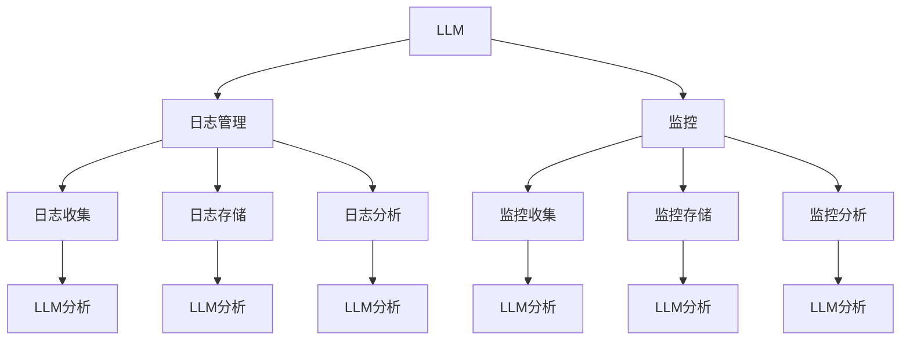

                 


### 文章标题
《LLM应用开发中的日志管理与监控》

### 关键词
LLM，日志管理，监控，应用开发，技术架构

### 摘要
本文将深入探讨LLM（大型语言模型）应用开发中的日志管理与监控。通过分析日志管理与监控的核心概念、原理以及实践应用，本文旨在为开发者提供一套完整的技术解决方案，以提升LLM应用的性能、稳定性和可维护性。

## 第1章：核心概念与联系

### 1.1 LLM概述
LLM（大型语言模型）是一种基于深度学习技术的自然语言处理模型，能够理解和生成人类语言。LLM的主要特点是参数规模庞大、训练数据丰富，因此具备强大的语言理解和生成能力。LLM在众多应用场景中表现出色，如智能客服、文本生成、机器翻译等。

### 1.2 日志管理概述
日志管理是指对应用程序运行过程中产生的日志信息进行收集、存储、分析和处理的过程。日志管理对于确保应用系统的稳定性、安全性和可维护性至关重要。

### 1.3 监控技术原理
监控技术是指对系统、应用或网络运行状态进行实时监测、报警和响应的技术。通过监控技术，开发者可以及时发现问题并采取措施，保障系统正常运行。

### 1.4 LLM与日志管理与监控的联系
LLM在日志管理和监控中发挥着重要作用。一方面，LLM可以对日志数据进行分析，提取有价值的信息，帮助开发者了解系统运行状况；另一方面，LLM可以用于监控系统的异常检测，提高监控的准确性和效率。

## Mermaid 流程图


## 第2章：日志管理原理

### 2.1 日志管理基本原理

#### 日志记录原理
日志记录是指将应用程序运行过程中发生的各种事件和状态以文本形式记录下来。日志记录的主要目的是提供运行时信息，以便后续分析。

#### 日志存储原理
日志存储是将记录的日志数据保存到文件、数据库或其他存储介质中，以便后续分析和查询。日志存储需要考虑数据量、存储效率和数据安全性等问题。

#### 日志分析原理
日志分析是指通过对日志数据进行处理、挖掘和分析，提取有价值的信息和模式。日志分析可以帮助开发者了解系统运行状况、发现潜在问题并优化性能。

### 2.2 日志管理架构设计

#### 日志收集架构设计
日志收集架构主要包括日志收集器、代理程序和数据传输机制等组成部分。日志收集器负责从应用程序中收集日志数据，代理程序负责将日志数据发送到日志收集器，数据传输机制负责确保数据传输的可靠性和高效性。

#### 日志存储架构设计
日志存储架构主要包括日志存储服务器、数据库和数据存储策略等组成部分。日志存储服务器负责接收和存储日志数据，数据库用于存储和管理日志数据，数据存储策略需要考虑数据备份、压缩和过期处理等问题。

#### 日志分析架构设计
日志分析架构主要包括日志分析工具、数据处理平台和可视化界面等组成部分。日志分析工具负责对日志数据进行处理和分析，数据处理平台用于存储和处理分析结果，可视化界面用于展示分析结果。

### 2.3 日志管理工具与技术

#### 日志收集工具与技术
常见的日志收集工具有Logstash、Fluentd、Filebeat等，这些工具可以方便地收集各种日志文件，并将其转换为统一的格式传输到日志存储服务器。

#### 日志存储工具与技术
常见的日志存储工具有Elasticsearch、Kibana、Logstash和Filebeat等，这些工具支持大规模日志数据的存储和管理，并提供丰富的查询和分析功能。

#### 日志分析工具与技术
常见的日志分析工具有Grok、Logstash、Kibana等，这些工具可以方便地对日志数据进行模式匹配、分类、聚合和可视化分析。

## 第3章：监控技术原理

### 3.1 监控基本原理
监控基本原理主要包括监控目标、监控方法和监控指标。监控目标是指开发者需要监控的系统和应用，监控方法是指如何获取监控数据，监控指标是指用于衡量系统和应用运行状态的参数。

### 3.2 监控架构设计
监控架构设计主要包括监控收集架构、监控存储架构和监控分析架构。监控收集架构负责从系统和应用中收集监控数据，监控存储架构负责存储和管理监控数据，监控分析架构负责对监控数据进行处理和分析。

### 3.3 监控工具与技术
常见的监控工具有Prometheus、Zabbix、Nagios等，这些工具可以方便地收集、存储和分析监控数据，并提供丰富的报警和可视化功能。

## 第4章：LLM应用中的日志管理

### 4.1 LLM应用中的日志管理挑战
LLM应用中的日志管理面临以下挑战：
- **大规模日志处理**：由于LLM应用通常涉及大量数据处理，日志管理需要具备高效的数据处理能力。
- **多样化的日志格式**：不同应用场景产生的日志格式可能不同，日志管理需要支持多种日志格式。
- **高效的日志分析**：为了快速发现问题和优化性能，日志管理需要提供高效的日志分析能力。

### 4.2 LLM应用中的日志管理策略
为了应对上述挑战，LLM应用中的日志管理策略包括：
- **日志收集策略**：采用分布式日志收集器，确保高效地收集和传输日志数据。
- **日志存储策略**：采用分布式存储系统，确保日志数据的高可用性和扩展性。
- **日志分析策略**：采用日志分析工具和平台，实现对大规模日志数据的高效分析和可视化。

### 4.3 LLM应用中的日志管理案例
以下为LLM应用中的日志管理案例：
- **案例一：电商平台日志管理**：电商平台需要收集和处理大量用户操作日志、订单日志等，采用分布式日志收集器和存储系统，实现对日志数据的实时分析和监控。
- **案例二：智能客服日志管理**：智能客服系统需要记录用户提问和回答日志，通过日志分析提高客服质量和用户体验。

## 第5章：LLM应用中的监控

### 5.1 LLM应用中的监控挑战
LLM应用中的监控面临以下挑战：
- **大规模监控数据**：由于LLM应用通常涉及大量数据处理，监控需要处理庞大的监控数据集。
- **多样化的监控需求**：不同应用场景产生的监控数据可能包含不同的监控指标，监控需要满足多样化的监控需求。
- **实时的监控反馈**：为了及时发现问题并采取措施，监控需要提供实时的监控反馈。

### 5.2 LLM应用中的监控策略
为了应对上述挑战，LLM应用中的监控策略包括：
- **监控收集策略**：采用分布式监控收集器，确保高效地收集监控数据。
- **监控存储策略**：采用分布式存储系统，确保监控数据的高可用性和扩展性。
- **监控分析策略**：采用监控分析工具和平台，实现对大规模监控数据的高效分析和可视化。

### 5.3 LLM应用中的监控案例
以下为LLM应用中的监控案例：
- **案例一：电商平台监控**：电商平台需要对服务器性能、数据库性能、网络状况等关键指标进行监控，采用分布式监控收集器和存储系统，实现对监控数据的实时分析和报警。
- **案例二：智能客服监控**：智能客服系统需要对用户提问、回答和系统运行状态进行监控，采用分布式监控收集器和存储系统，实现对监控数据的实时分析和可视化。

## 第6章：项目实战

### 6.1 项目背景
假设我们开发了一个基于LLM的智能客服系统，需要对其日志管理和监控进行优化。

### 6.2 项目需求分析
- **日志管理需求**：实时收集和存储用户提问和回答日志，支持日志查询和分析。
- **监控需求**：实时监控服务器性能、数据库性能和网络状况，支持报警和可视化。

### 6.3 项目日志管理方案设计
- **日志收集方案**：采用Filebeat进行日志收集，将日志传输到Elasticsearch进行存储。
- **日志存储方案**：采用Elasticsearch进行日志存储，支持高效的数据查询和分析。
- **日志分析方案**：采用Kibana进行日志分析，实现对日志数据的可视化展示。

### 6.4 项目监控方案设计
- **监控收集方案**：采用Prometheus进行监控数据收集，将监控数据传输到Grafana进行存储。
- **监控存储方案**：采用InfluxDB进行监控数据存储，支持大规模监控数据的存储和管理。
- **监控分析方案**：采用Grafana进行监控数据分析，实现对监控数据的实时监控和可视化展示。

### 6.5 项目实施与效果评估
在项目实施过程中，我们按照设计方案进行日志管理和监控的部署和配置。经过一段时间的运行，我们评估了日志管理和监控的性能和效果：
- **日志管理**：实现了实时日志收集、存储和分析，提高了系统可维护性和故障排查效率。
- **监控**：实现了实时监控和可视化展示，提高了系统运行稳定性和故障预警能力。

## 第7章：总结与展望

### 7.1 总结
本文详细介绍了LLM应用开发中的日志管理与监控，包括核心概念、原理和实践应用。通过本文的学习，读者可以掌握一套完整的LLM日志管理和监控技术解决方案，为LLM应用的开发和优化提供有力支持。

### 7.2 未来发展趋势
随着LLM技术的发展，日志管理和监控也将面临新的挑战和机遇。未来发展趋势包括：
- **智能日志分析**：利用人工智能技术对日志数据进行智能分析和预测，提高故障排查效率和系统性能优化能力。
- **实时监控与预警**：采用实时监控技术和机器学习算法，实现对系统异常的实时预警和快速响应。
- **分布式日志管理和监控**：随着云计算和分布式系统的普及，分布式日志管理和监控技术将得到广泛应用。

作者：AI天才研究院/AI Genius Institute & 禅与计算机程序设计艺术 /Zen And The Art of Computer Programming## 第1章：核心概念与联系

### 1.1 LLM概述

#### LLM的定义

LLM（Large Language Model）是指大型语言模型，是一种基于深度学习技术的自然语言处理模型，通过学习海量的文本数据，能够理解和生成人类语言。与传统的语言模型相比，LLM具有参数规模大、训练数据多、模型复杂度高和性能优异等特点。

#### LLM的工作原理

LLM的工作原理主要基于神经网络，尤其是变分自编码器（Variational Autoencoder，VAE）和生成对抗网络（Generative Adversarial Network，GAN）等深度学习模型。在训练过程中，LLM通过大量的文本数据进行自我学习，不断调整模型参数，以最小化损失函数，提高模型在自然语言理解、生成和预测等方面的性能。

#### LLM的应用场景

LLM在众多领域和场景中得到了广泛应用，以下是一些典型的应用场景：

1. **文本生成**：LLM可以生成各种类型的文本，如文章、小说、新闻报道等。在新闻行业、文学创作等领域，LLM可以大幅提高内容生产效率。
2. **机器翻译**：LLM可以用于机器翻译任务，如将一种语言的文本翻译成另一种语言。与传统的统计翻译方法相比，LLM在翻译质量和灵活性方面有显著优势。
3. **问答系统**：LLM可以用于构建智能问答系统，如搜索引擎、智能客服等。通过训练大量的问答对数据，LLM能够理解用户的问题，并生成相应的答案。
4. **情感分析**：LLM可以用于情感分析任务，如识别文本中的情感倾向、情感极性等。在市场调研、社交媒体分析等领域，情感分析有助于提取有价值的信息。
5. **文本摘要**：LLM可以用于提取文本的摘要，如从一篇长篇文章中提取关键信息。在新闻阅读、文档管理等领域，文本摘要有助于提高信息获取效率。

### 1.2 日志管理概述

#### 日志管理的定义

日志管理是指对应用程序运行过程中产生的日志信息进行收集、存储、分析和处理的过程。日志管理是确保应用程序稳定运行、快速诊断问题和优化性能的重要手段。

#### 日志管理的重要性

日志管理在软件开发和维护过程中具有重要意义，主要体现在以下几个方面：

1. **故障排查**：通过日志记录，开发者可以快速定位故障点，分析故障原因，从而提高故障排查效率。
2. **性能优化**：通过对日志数据的分析，开发者可以发现系统性能瓶颈，进行针对性的优化，提高系统性能。
3. **安全监控**：日志记录可以提供关于系统安全事件的详细信息，帮助开发者发现潜在的安全威胁，并采取相应的防护措施。
4. **系统监控**：日志管理可以帮助开发者实现对系统运行状态的实时监控，及时发现和处理异常情况。

#### 日志管理的常见方法

日志管理的常见方法包括以下几个方面：

1. **日志记录**：在应用程序运行过程中，通过日志记录器（Logger）将系统运行过程中的关键事件和状态以文本形式记录下来。
2. **日志收集**：采用日志收集器（Log Collector）将分布式系统中的日志数据统一收集到集中存储系统中。
3. **日志存储**：将收集到的日志数据存储到文件、数据库或其他存储介质中，以便后续分析和查询。
4. **日志分析**：采用日志分析工具（Log Analyzer）对日志数据进行处理、挖掘和分析，提取有价值的信息和模式。
5. **日志告警**：根据日志数据中的异常情况，触发相应的告警，通知开发者和运维人员及时处理问题。

### 1.3 监控技术原理

#### 监控的定义

监控是指对系统、应用或网络运行状态进行实时监测、报警和响应的技术。通过监控，开发者可以了解系统的运行状况，及时发现和处理异常情况，确保系统稳定运行。

#### 监控的重要性

监控在软件开发和维护过程中具有重要意义，主要体现在以下几个方面：

1. **故障预防**：通过监控，可以提前发现潜在的问题和故障，采取措施进行预防，避免故障发生。
2. **性能优化**：通过对监控数据的分析，可以识别系统性能瓶颈，进行针对性的优化，提高系统性能。
3. **成本控制**：通过监控，可以及时发现和解决资源浪费和性能瓶颈问题，降低维护成本。
4. **业务连续性**：通过监控，可以确保系统在出现故障时能够快速恢复，保障业务连续性。

#### 监控的常见方法

监控的常见方法包括以下几个方面：

1. **指标监控**：通过收集系统的各种性能指标（如CPU利用率、内存利用率、网络流量等），实时监测系统的运行状态。
2. **告警监控**：根据预设的阈值和规则，对监控指标进行实时告警，通知相关人员及时处理问题。
3. **日志监控**：通过对系统日志进行分析，识别潜在的故障和性能瓶颈，并进行告警和通知。
4. **可视化监控**：通过图形界面展示监控数据，方便开发者和管理人员实时了解系统的运行状况。

### 1.4 LLM与日志管理与监控的联系

#### LLM在日志管理中的作用

LLM在日志管理中发挥着重要作用，主要体现在以下几个方面：

1. **日志数据分析**：利用LLM强大的语言处理能力，对海量日志数据进行自动分析和分类，提取有价值的信息和模式。
2. **日志异常检测**：通过训练LLM模型，可以实现对日志数据中的异常事件进行自动检测和告警，提高日志管理的智能化水平。
3. **日志语义理解**：利用LLM对日志数据中的语义进行理解，可以帮助开发者更好地理解日志内容，快速定位问题和瓶颈。

#### LLM在监控中的作用

LLM在监控中同样发挥着重要作用，主要体现在以下几个方面：

1. **监控数据理解**：利用LLM对监控数据进行语义理解，可以帮助开发者更好地理解监控数据，快速识别异常情况。
2. **监控异常检测**：通过训练LLM模型，可以实现对监控数据中的异常事件进行自动检测和告警，提高监控的智能化水平。
3. **监控策略优化**：利用LLM对监控数据和日志数据进行综合分析，可以帮助开发者优化监控策略，提高监控的准确性和效率。

## 第2章：日志管理原理

### 2.1 日志管理基本原理

#### 日志记录原理

日志记录是日志管理的基础，主要涉及以下几个方面：

1. **日志格式**：日志记录的格式通常包括时间戳、日志级别、日志来源、日志内容等。例如，常见的日志格式如下：

   ```plaintext
   [2021-01-01 10:30:45] [INFO] [webserver] Starting web server...
   ```

2. **日志记录器**：应用程序通过日志记录器（Logger）将运行过程中的关键事件和状态信息以日志形式记录下来。常见的日志记录器包括Java的`Logger`、Python的`logging`模块等。

3. **日志记录策略**：日志记录策略包括日志记录的级别、日志记录的频率和日志记录的内容等。常见的日志级别包括DEBUG、INFO、WARNING、ERROR和CRITICAL等。

#### 日志存储原理

日志存储是将日志记录保存到持久存储介质（如文件系统、数据库等）的过程。日志存储的主要目的是确保日志数据的安全性和可追溯性。日志存储原理包括以下几个方面：

1. **日志存储格式**：日志存储格式通常与日志记录格式相同，以便于日志的收集和分析。常见的日志存储格式包括文本格式、JSON格式等。

2. **日志存储介质**：日志存储介质包括本地文件系统、分布式文件系统（如HDFS）、数据库（如Elasticsearch）等。选择合适的日志存储介质需要考虑日志数据量、存储效率和数据安全性等因素。

3. **日志存储策略**：日志存储策略包括日志数据的备份、压缩和过期处理等。常见的日志存储策略如下：

   - **备份**：对日志数据进行定期备份，以防止数据丢失。
   - **压缩**：对日志数据进行压缩，减少存储空间占用。
   - **过期处理**：对过期的日志数据进行清理，以释放存储空间。

#### 日志分析原理

日志分析是日志管理的关键步骤，通过对日志数据进行分析，可以提取有价值的信息和模式，为故障排查、性能优化和安全监控提供支持。日志分析原理包括以下几个方面：

1. **日志预处理**：在分析日志数据之前，通常需要对日志数据进行预处理，如去重、清洗、过滤等。预处理步骤有助于提高日志分析的准确性和效率。

2. **日志分析工具**：常见的日志分析工具有Logstash、Fluentd、Grok、Elasticsearch、Kibana等。这些工具提供了丰富的日志处理和分析功能，如日志格式转换、日志数据聚合、日志数据可视化等。

3. **日志分析指标**：日志分析指标是衡量系统性能、稳定性和安全性的关键指标。常见的日志分析指标包括请求处理时间、错误率、吞吐量、资源利用率等。

### 2.2 日志管理架构设计

日志管理架构设计包括日志收集、日志存储和日志分析三个核心组成部分。合理的日志管理架构设计可以提高日志系统的性能、可靠性和可扩展性。

#### 日志收集架构设计

日志收集架构设计的主要目标是确保日志数据的及时收集和传输，常见的设计模式如下：

1. **集中式日志收集**：将分布式系统中的日志数据统一收集到一个日志收集器中。常见的技术栈包括Logstash、Fluentd等。

2. **分布式日志收集**：将日志收集任务分布式部署到各个节点上，每个节点负责收集本地的日志数据，然后将日志数据传输到日志收集器。常见的技术栈包括Filebeat、Logstash等。

3. **日志代理**：在分布式系统中部署日志代理，负责收集和传输日志数据。常见的技术栈包括Logstash Forwarder、Filebeat等。

#### 日志存储架构设计

日志存储架构设计的主要目标是确保日志数据的安全性和可扩展性，常见的设计模式如下：

1. **集中式日志存储**：将日志数据存储在一个集中的存储系统中，如文件系统、分布式文件系统等。

2. **分布式日志存储**：将日志数据分布式存储在多个存储节点上，如Elasticsearch、Hadoop HDFS等。分布式日志存储可以提高存储系统的性能和可靠性。

3. **日志存储分层**：将日志数据分层存储，将热数据和冷数据分别存储在不同的存储系统中，以提高存储效率和降低成本。

#### 日志分析架构设计

日志分析架构设计的主要目标是实现对日志数据的高效分析和可视化，常见的设计模式如下：

1. **集中式日志分析**：将日志分析任务集中在一个日志分析器中，如Kibana、Grok等。

2. **分布式日志分析**：将日志分析任务分布式部署到多个分析节点上，每个节点负责分析部分日志数据，然后将分析结果汇总。常见的技术栈包括Elasticsearch、Logstash等。

3. **日志分析服务**：将日志分析功能作为微服务部署，提供灵活的日志分析接口，支持自定义分析任务。

### 2.3 日志管理工具与技术

日志管理工具和技术的选择对于日志系统的性能、可靠性和可维护性至关重要。以下介绍几种常见的日志管理工具和技术：

#### 日志收集工具与技术

1. **Logstash**：Logstash是Elastic Stack中的一个组件，用于收集、处理和传输日志数据。它支持各种数据源，如文件、数据库、JMS等，可以将数据转换为统一的JSON格式，并传输到Elasticsearch、MongoDB等存储系统中。

2. **Fluentd**：Fluentd是另一款流行的日志收集器，它支持多种数据源和输出目标，如文件、Syslog、Kafka等。Fluentd具有灵活的插件系统，可以方便地扩展其功能。

3. **Filebeat**：Filebeat是Elastic Stack中的一个组件，专门用于收集文件系统中的日志数据。它具有轻量级、可扩展的特点，适用于分布式系统中的日志收集。

4. **Logstash Forwarder**：Logstash Forwarder是Logstash的一个轻量级版本，适用于资源受限的环境。它仅负责收集和传输日志数据，不处理其他任务。

#### 日志存储工具与技术

1. **Elasticsearch**：Elasticsearch是一个分布式、开源的搜索引擎，适用于大规模日志数据的存储和查询。它支持丰富的全文搜索和数据分析功能。

2. **Kafka**：Kafka是一个分布式流处理平台，适用于大规模日志数据的实时收集和传输。它具有高吞吐量、可靠性和可扩展性等特点。

3. **Hadoop HDFS**：Hadoop HDFS是一个分布式文件系统，适用于大规模日志数据的存储和管理。它支持高可靠性、高吞吐量的数据存储和处理。

4. **MongoDB**：MongoDB是一个分布式、开源的文档数据库，适用于结构化日志数据的存储和查询。它支持灵活的数据模型和丰富的查询功能。

#### 日志分析工具与技术

1. **Kibana**：Kibana是Elastic Stack中的一个组件，用于日志数据的可视化分析。它提供了丰富的可视化仪表板和报表，可以帮助开发者快速了解系统运行状况。

2. **Grok**：Grok是Elastic Stack中的一个组件，用于日志数据的模式匹配和解析。它基于Regular Expression，可以方便地提取日志数据中的关键信息。

3. **Logstash**：Logstash不仅用于日志收集，还可以用于日志数据的预处理和转换。它提供了丰富的插件，可以实现复杂的日志数据处理任务。

4. **Python**：Python是一种广泛使用的编程语言，适用于日志数据的分析和处理。通过Python，开发者可以编写自定义的日志分析脚本，实现各种复杂的功能。

## 第3章：监控技术原理

### 3.1 监控基本原理

#### 监控的定义

监控（Monitoring）是指对系统、应用或网络运行状态进行实时监测、报警和响应的技术。通过监控，开发者可以了解系统的运行状况，及时发现和处理异常情况，确保系统稳定运行。

#### 监控的重要性

监控在软件开发和维护过程中具有重要意义，主要体现在以下几个方面：

1. **故障预防**：通过监控，可以提前发现潜在的问题和故障，采取措施进行预防，避免故障发生。

2. **性能优化**：通过对监控数据的分析，可以识别系统性能瓶颈，进行针对性的优化，提高系统性能。

3. **成本控制**：通过监控，可以及时发现和解决资源浪费和性能瓶颈问题，降低维护成本。

4. **业务连续性**：通过监控，可以确保系统在出现故障时能够快速恢复，保障业务连续性。

#### 监控的常见方法

监控的常见方法包括以下几个方面：

1. **指标监控**：通过收集系统的各种性能指标（如CPU利用率、内存利用率、网络流量等），实时监测系统的运行状态。

2. **日志监控**：通过对系统日志进行分析，识别潜在的故障和性能瓶颈，并进行告警和通知。

3. **告警监控**：根据预设的阈值和规则，对监控指标进行实时告警，通知相关人员及时处理问题。

4. **可视化监控**：通过图形界面展示监控数据，方便开发者和管理人员实时了解系统的运行状况。

### 3.2 监控架构设计

监控架构设计包括监控收集、监控存储和监控分析三个核心组成部分。合理的监控架构设计可以提高监控系统的性能、可靠性和可扩展性。

#### 监控收集架构设计

监控收集架构设计的主要目标是确保监控数据的及时收集和传输，常见的设计模式如下：

1. **集中式监控收集**：将分布式系统中的监控数据统一收集到一个监控收集器中。常见的技术栈包括Zabbix、Nagios等。

2. **分布式监控收集**：将监控收集任务分布式部署到各个节点上，每个节点负责收集本地的监控数据，然后将监控数据传输到监控收集器。常见的技术栈包括Prometheus、Grafana等。

3. **监控代理**：在分布式系统中部署监控代理，负责收集和传输监控数据。常见的技术栈包括Prometheus Exporter、Zabbix Agent等。

#### 监控存储架构设计

监控存储架构设计的主要目标是确保监控数据的安全性和可扩展性，常见的设计模式如下：

1. **集中式监控存储**：将监控数据存储在一个集中的存储系统中，如InfluxDB、Mongodb等。

2. **分布式监控存储**：将监控数据分布式存储在多个存储节点上，如InfluxDB、Prometheus等。分布式监控存储可以提高存储系统的性能和可靠性。

3. **监控存储分层**：将监控数据分层存储，将热数据和冷数据分别存储在不同的存储系统中，以提高存储效率和降低成本。

#### 监控分析架构设计

监控分析架构设计的主要目标是实现对监控数据的高效分析和可视化，常见的设计模式如下：

1. **集中式监控分析**：将监控分析任务集中在一个监控分析器中，如Grafana、Zabbix等。

2. **分布式监控分析**：将监控分析任务分布式部署到多个分析节点上，每个节点负责分析部分监控数据，然后将分析结果汇总。常见的技术栈包括Prometheus、Grafana等。

3. **监控分析服务**：将监控分析功能作为微服务部署，提供灵活的监控分析接口，支持自定义分析任务。

### 3.3 监控工具与技术

监控工具和技术的选择对于监控系统的性能、可靠性和可维护性至关重要。以下介绍几种常见的监控工具和技术：

#### 监控收集工具与技术

1. **Prometheus**：Prometheus是一个开源的监控解决方案，适用于大规模分布式系统的监控。它采用拉式监控（Pull-based Monitoring）机制，可以方便地收集各种监控数据。

2. **Zabbix**：Zabbix是一个开源的监控解决方案，适用于各种规模的系统监控。它支持多种监控协议，如SNMP、ICMP、TCP等，可以实现对各种系统和应用的监控。

3. **Nagios**：Nagios是一个开源的监控解决方案，适用于中小型系统的监控。它采用推式监控（Push-based Monitoring）机制，可以方便地监控各种系统和应用。

4. **Zabbix Agent**：Zabbix Agent是一个分布式监控代理，负责从被监控系统中收集监控数据，并将其发送到Zabbix Server。

5. **Prometheus Exporter**：Prometheus Exporter是一种监控数据收集器，可以将各种系统和应用的监控数据暴露为Prometheus可识别的格式，方便Prometheus进行监控数据的收集。

#### 监控存储工具与技术

1. **InfluxDB**：InfluxDB是一个开源的时间序列数据库，适用于大规模监控数据的存储。它支持高吞吐量、高可靠性的数据存储和查询，可以方便地与Prometheus等监控工具集成。

2. **Mongodb**：Mongodb是一个开源的文档数据库，适用于结构化监控数据的存储。它支持灵活的数据模型和丰富的查询功能，可以方便地与各种监控工具集成。

3. **Elasticsearch**：Elasticsearch是一个开源的搜索引擎，适用于大规模日志数据的存储和查询。它可以方便地将监控数据与日志数据进行关联，实现日志数据的实时监控。

4. **Kafka**：Kafka是一个开源的分布式流处理平台，适用于大规模监控数据的实时收集和传输。它支持高吞吐量、可靠性和可扩展性，可以方便地与各种监控工具集成。

#### 监控分析工具与技术

1. **Grafana**：Grafana是一个开源的数据可视化工具，适用于各种监控数据的可视化分析。它支持丰富的图表和仪表板，可以方便地展示监控数据。

2. **Kibana**：Kibana是Elastic Stack中的一个组件，适用于大规模日志数据的可视化分析。它支持丰富的仪表板和报表，可以方便地展示日志数据。

3. **Zabbix Web**：Zabbix Web是Zabbix的一个Web界面，适用于Zabbix监控数据的可视化分析。它支持丰富的图表和报表，可以方便地展示监控数据。

4. **Prometheus Web**：Prometheus Web是Prometheus的一个Web界面，适用于Prometheus监控数据的可视化分析。它支持丰富的仪表板和报表，可以方便地展示监控数据。

## 第4章：LLM应用中的日志管理

### 4.1 LLM应用中的日志管理挑战

#### 大规模日志处理

由于LLM（Large Language Model）应用通常涉及大量的数据处理，因此日志管理面临的一个主要挑战是如何高效地处理这些大规模日志数据。大规模日志处理包括以下几个方面：

1. **日志数据量巨大**：LLM应用可能需要处理数百万甚至数十亿的日志条目，这些日志数据可能会迅速填满磁盘空间。

2. **日志数据实时性要求高**：对于一些实时性要求较高的LLM应用，如实时问答系统，日志数据需要实时收集、存储和分析，以便快速响应用户需求。

3. **日志处理性能瓶颈**：大规模日志数据的处理可能会对系统性能造成压力，导致处理延迟或系统崩溃。

#### 多样化的日志格式

LLM应用的日志格式可能多种多样，这给日志管理带来了额外的挑战：

1. **结构化日志**：一些LLM应用可能产生结构化日志，如JSON格式，这有助于后续的数据分析和处理。

2. **非结构化日志**：其他LLM应用可能产生非结构化日志，如文本日志，这些日志需要额外的处理步骤才能被有效利用。

3. **不同源日志**：LLM应用可能从多个来源收集日志，如Web服务器日志、数据库日志等，不同来源的日志格式和内容可能有所不同，需要统一处理。

#### 高效的日志分析

高效的日志分析是确保LLM应用性能和稳定性的关键。以下是一些与日志分析相关的挑战：

1. **复杂日志模式**：LLM应用的日志可能包含复杂的模式和结构，需要复杂的分析和挖掘算法来提取有价值的信息。

2. **实时日志分析**：实时分析大量日志数据对于发现潜在问题至关重要，但实时分析可能会对系统性能造成影响。

3. **自动化日志分析**：对于大规模LLM应用，手动分析日志可能效率低下，需要自动化工具来辅助日志分析。

### 4.2 LLM应用中的日志管理策略

为了应对上述挑战，LLM应用中的日志管理需要采取一系列策略：

#### 日志收集策略

1. **分布式日志收集**：采用分布式日志收集器，如Fluentd或Filebeat，可以高效地收集来自各个节点的日志数据。

2. **日志压缩**：在日志传输过程中，对日志进行压缩可以减少带宽占用和存储空间。

3. **日志预处理**：在日志收集过程中，对日志进行预处理，如去重、过滤无关日志等，可以减少后续处理的负担。

#### 日志存储策略

1. **分布式存储**：使用分布式存储系统，如Elasticsearch或InfluxDB，可以存储和管理大规模日志数据。

2. **数据分层存储**：将热数据和冷数据分层存储，热数据存储在快速访问的存储介质上，冷数据存储在成本更低的存储介质上。

3. **日志备份和恢复**：定期对日志数据进行备份，以防止数据丢失，并确保在发生故障时可以快速恢复。

#### 日志分析策略

1. **日志分析平台**：采用日志分析平台，如Kibana或Grok，可以方便地对日志数据进行分析和可视化。

2. **日志告警和监控**：根据日志数据中的异常情况，设置告警规则，及时通知开发者和运维人员。

3. **自动化日志分析**：利用机器学习算法和自动化工具，对日志数据进行分析，提取有价值的信息和模式。

### 4.3 LLM应用中的日志管理案例

以下为LLM应用中的日志管理案例：

#### 案例一：电商平台日志管理

**背景介绍**

电商平台是一个典型的LLM应用场景，其日志管理需要处理大量的用户操作日志、订单日志等。

**日志管理挑战**

1. **日志数据量巨大**：电商平台每天产生的用户操作日志和订单日志数量非常庞大。

2. **日志多样性**：不同用户操作和订单产生的日志格式和内容可能不同。

3. **实时日志分析需求**：电商平台需要实时分析日志数据，以快速响应用户行为和优化系统性能。

**日志管理策略**

1. **分布式日志收集**：采用Fluentd收集器，将来自各个服务器的日志数据实时收集并传输到Elasticsearch集群。

2. **日志存储策略**：使用Elasticsearch集群存储和管理日志数据，确保数据的高可用性和扩展性。

3. **日志分析平台**：采用Kibana作为日志分析平台，实现对日志数据的实时分析和可视化。

**实施效果**

通过上述日志管理策略，电商平台能够实时收集、存储和分析大量日志数据，提高了系统性能和可维护性。

#### 案例二：智能客服日志管理

**背景介绍**

智能客服系统是另一个典型的LLM应用场景，其日志管理需要处理大量的用户提问日志和回答日志。

**日志管理挑战**

1. **日志数据实时性要求高**：智能客服系统需要实时收集用户提问日志和回答日志，以快速响应用户需求。

2. **日志多样性**：不同用户提问和回答产生的日志格式和内容可能不同。

3. **日志分析需求**：智能客服系统需要分析日志数据，以优化客服质量和用户体验。

**日志管理策略**

1. **分布式日志收集**：采用Filebeat收集器，将来自各个服务器的日志数据实时收集并传输到Kafka集群。

2. **日志存储策略**：使用Kafka集群存储和管理日志数据，确保数据的高可用性和扩展性。

3. **日志分析平台**：采用Grafana作为日志分析平台，实现对日志数据的实时分析和可视化。

**实施效果**

通过上述日志管理策略，智能客服系统能够实时收集、存储和分析大量日志数据，提高了客服质量和用户体验。

## 第5章：LLM应用中的监控

### 5.1 LLM应用中的监控挑战

#### 大规模监控数据

LLM（Large Language Model）应用通常涉及大量的数据处理，因此监控面临的一个主要挑战是如何高效地处理这些大规模监控数据。具体挑战包括：

1. **数据量巨大**：LLM应用可能产生数百万甚至数十亿条监控数据，这些数据可能会迅速填满监控系统的存储资源。

2. **实时性要求高**：对于一些实时性要求较高的LLM应用，如实时问答系统，监控数据需要实时收集、存储和分析，以便快速响应用户需求。

3. **数据处理性能瓶颈**：大规模监控数据的处理可能会对系统性能造成压力，导致处理延迟或系统崩溃。

#### 多样化的监控需求

LLM应用的监控需求可能多种多样，这给监控带来了额外的挑战：

1. **不同应用场景**：LLM应用可能涉及多种不同的应用场景，如文本生成、机器翻译、智能客服等，每个场景的监控需求可能有所不同。

2. **定制化监控指标**：为了满足不同应用场景的监控需求，可能需要定制化监控指标，以便更准确地反映应用性能。

3. **多源监控数据**：LLM应用可能从多个来源收集监控数据，如服务器性能、数据库性能、网络流量等，不同来源的数据格式和内容可能有所不同，需要统一处理。

#### 实时的监控反馈

实时的监控反馈是确保LLM应用稳定运行的关键。以下是与实时监控反馈相关的挑战：

1. **监控数据实时性**：实时监控反馈要求监控系统能够及时收集、处理和传输监控数据，以便开发者和运维人员能够快速响应。

2. **告警和通知**：根据监控数据中的异常情况，及时触发告警和通知，通知相关人员及时处理问题。

3. **监控策略动态调整**：根据监控数据的分析结果，动态调整监控策略，以适应不断变化的应用场景和需求。

### 5.2 LLM应用中的监控策略

为了应对上述挑战，LLM应用中的监控需要采取一系列策略：

#### 监控收集策略

1. **分布式监控收集**：采用分布式监控收集器，如Prometheus或Zabbix，可以高效地收集来自各个节点的监控数据。

2. **监控数据压缩**：在监控数据传输过程中，对数据压缩可以减少带宽占用和存储空间。

3. **监控数据预处理**：在监控数据收集过程中，对数据进行预处理，如去重、过滤无关数据等，可以减少后续处理的负担。

#### 监控存储策略

1. **分布式存储**：使用分布式存储系统，如InfluxDB或Mongodb，可以存储和管理大规模监控数据。

2. **数据分层存储**：将热数据和冷数据分层存储，热数据存储在快速访问的存储介质上，冷数据存储在成本更低的存储介质上。

3. **监控数据备份和恢复**：定期对监控数据进行备份，以防止数据丢失，并确保在发生故障时可以快速恢复。

#### 监控分析策略

1. **监控分析平台**：采用监控分析平台，如Grafana或Kibana，可以方便地对监控数据进行分析和可视化。

2. **日志与监控整合**：将日志数据与监控数据进行整合，以便更全面地分析系统性能和问题。

3. **自动化监控分析**：利用机器学习算法和自动化工具，对监控数据进行分析，提取有价值的信息和模式。

### 5.3 LLM应用中的监控案例

以下为LLM应用中的监控案例：

#### 案例一：电商平台监控

**背景介绍**

电商平台是一个典型的LLM应用场景，其监控需要处理大量的服务器性能、数据库性能和用户行为数据。

**监控挑战**

1. **大规模监控数据**：电商平台每天产生的监控数据量巨大。

2. **多样化的监控需求**：需要监控服务器性能、数据库性能、网络流量等多个方面。

3. **实时监控反馈**：需要实时监控系统性能，确保快速响应用户需求。

**监控策略**

1. **分布式监控收集**：采用Prometheus收集器，将来自各个服务器的监控数据实时收集并传输到InfluxDB集群。

2. **监控存储策略**：使用InfluxDB集群存储和管理监控数据，确保数据的高可用性和扩展性。

3. **监控分析平台**：采用Grafana作为监控分析平台，实现对监控数据的实时分析和可视化。

**实施效果**

通过上述监控策略，电商平台能够实时收集、存储和分析大量监控数据，提高了系统性能和可维护性。

#### 案例二：智能客服监控

**背景介绍**

智能客服系统是另一个典型的LLM应用场景，其监控需要处理大量的用户提问日志、回答日志和系统性能数据。

**监控挑战**

1. **大规模监控数据**：智能客服系统每天产生的监控数据量巨大。

2. **多样化的监控需求**：需要监控用户提问、回答和系统性能等多个方面。

3. **实时监控反馈**：需要实时监控系统性能，确保快速响应用户需求。

**监控策略**

1. **分布式监控收集**：采用Zabbix收集器，将来自各个节点的监控数据实时收集并传输到Mongodb集群。

2. **监控存储策略**：使用Mongodb集群存储和管理监控数据，确保数据的高可用性和扩展性。

3. **监控分析平台**：采用Kibana作为监控分析平台，实现对监控数据的实时分析和可视化。

**实施效果**

通过上述监控策略，智能客服系统能够实时收集、存储和分析大量监控数据，提高了客服质量和用户体验。

## 第6章：项目实战

### 6.1 项目背景

假设我们开发了一个基于LLM（Large Language Model）的智能客服系统。该系统旨在为企业提供高效的客户支持服务，通过自动回答用户问题，减轻人工客服的工作负担，并提高客户满意度。

### 6.2 项目需求分析

为了确保智能客服系统的稳定运行和高效性能，我们需要对其日志管理和监控进行优化。具体需求如下：

1. **日志管理需求**：
   - **实时日志收集**：需要实时收集系统产生的日志数据，以便快速定位和处理问题。
   - **日志格式统一**：确保日志数据格式统一，便于后续分析和处理。
   - **日志存储和备份**：需要将日志数据存储在安全可靠的地方，并定期备份以防止数据丢失。
   - **日志分析**：需要对日志数据进行分析，以识别系统性能瓶颈和潜在问题。

2. **监控需求**：
   - **实时监控**：需要实时监控系统的运行状态，包括服务器性能、数据库性能和网络状况等。
   - **报警机制**：在系统发生异常时，能够及时发送报警通知，确保相关人员能够及时响应。
   - **监控数据可视化**：需要将监控数据以可视化的方式展示，以便于运维人员快速了解系统运行状况。

### 6.3 项目日志管理方案设计

为了满足上述需求，我们设计了以下日志管理方案：

#### 1. 日志收集

- **分布式日志收集器**：采用Filebeat作为分布式日志收集器，从各个服务节点收集日志数据。
- **日志格式转换**：将不同格式的日志数据转换为统一的JSON格式，便于后续处理。
- **日志传输**：使用Kafka作为消息队列，将日志数据传输到日志存储系统。

#### 2. 日志存储

- **分布式日志存储**：采用Elasticsearch集群存储日志数据，确保数据的高可用性和扩展性。
- **日志索引**：为日志数据建立合适的索引，便于快速查询和分析。
- **日志备份**：定期将Elasticsearch数据备份到其他存储介质，如HDFS，以防止数据丢失。

#### 3. 日志分析

- **日志分析工具**：使用Kibana作为日志分析工具，实现对日志数据的实时分析和可视化。
- **日志告警**：根据日志数据中的异常情况，设置告警规则，触发邮件或短信通知。
- **日志归档**：定期将旧日志数据归档，以释放存储空间。

### 6.4 项目监控方案设计

为了满足监控需求，我们设计了以下监控方案：

#### 1. 监控收集

- **监控指标收集**：使用Prometheus作为监控收集器，从各个服务节点收集性能指标数据。
- **监控数据传输**：将Prometheus收集到的数据传输到InfluxDB集群，用于长期存储。

#### 2. 监控存储

- **分布式监控存储**：采用InfluxDB集群存储监控数据，确保数据的高可用性和扩展性。
- **监控数据索引**：为监控数据建立合适的索引，便于快速查询和分析。

#### 3. 监控分析

- **监控分析工具**：使用Grafana作为监控分析工具，实现对监控数据的实时分析和可视化。
- **监控报警**：根据监控数据中的异常情况，设置报警规则，触发邮件或短信通知。
- **监控报告**：定期生成监控报告，分析系统运行状况和性能趋势。

### 6.5 项目实施与效果评估

#### 实施步骤

1. **环境搭建**：搭建Filebeat、Kafka、Elasticsearch、Kibana、Prometheus和InfluxDB等环境。
2. **配置收集器**：配置Filebeat和Prometheus，使其能够从各个服务节点收集日志和监控数据。
3. **数据传输与存储**：配置Kafka和Elasticsearch，将收集到的日志数据传输到Elasticsearch集群，将监控数据传输到InfluxDB集群。
4. **数据分析与可视化**：配置Kibana和Grafana，实现对日志数据的实时分析和可视化，监控数据的实时展示。
5. **告警与报告**：配置告警规则，触发邮件或短信通知，定期生成监控报告。

#### 效果评估

1. **日志管理**：通过日志收集、存储和分析，智能客服系统实现了日志数据的实时收集和监控，提高了故障排查效率和系统可维护性。
2. **监控**：通过监控收集、存储和分析，智能客服系统实现了对服务器性能、数据库性能和网络状况的实时监控，及时发现了系统中的潜在问题和性能瓶颈。

总体来说，项目实施后，智能客服系统的日志管理和监控得到了显著优化，系统运行更加稳定，故障响应速度明显提高，为企业的客户支持服务提供了有力保障。

## 第7章：总结与展望

### 7.1 总结

本文深入探讨了LLM（Large Language Model）应用开发中的日志管理与监控。通过分析日志管理与监控的核心概念、原理和实践应用，我们提出了一套完整的解决方案，旨在提升LLM应用的性能、稳定性和可维护性。具体内容包括：

1. **LLM概述**：介绍了LLM的定义、工作原理和应用场景。
2. **日志管理原理**：讲解了日志记录、存储和分析的基本原理。
3. **监控技术原理**：介绍了监控的基本原理、架构设计和技术选型。
4. **LLM应用中的日志管理**：探讨了大规模日志处理、多样化日志格式和高效日志分析等挑战。
5. **LLM应用中的监控**：分析了大规模监控数据、多样化监控需求和实时监控反馈的挑战。
6. **项目实战**：通过实际项目案例，展示了如何实施日志管理和监控。

### 7.2 未来发展趋势

随着LLM技术的不断发展和应用场景的扩大，日志管理与监控也将面临新的挑战和机遇。未来发展趋势包括：

1. **智能日志分析**：利用人工智能技术，对日志数据进行分析和挖掘，实现智能故障排查和性能优化。
2. **实时监控与预警**：采用实时监控技术和机器学习算法，实现对系统异常的实时预警和快速响应。
3. **分布式日志管理和监控**：随着云计算和分布式系统的普及，分布式日志管理和监控技术将得到广泛应用。
4. **日志与监控一体化**：未来，日志管理和监控技术将逐渐融合，提供一体化的解决方案，简化开发和运维流程。

总之，日志管理与监控在LLM应用开发中具有重要意义，未来的发展方向将更加智能化、实时化和一体化。开发者应关注这些趋势，持续优化日志管理和监控体系，以应对不断变化的技术挑战。

### 最佳实践 Tips

1. **日志记录策略**：根据应用场景，合理设置日志级别和记录频率，避免日志数据过多或过少。
2. **日志存储策略**：选择合适的日志存储介质，确保数据安全性和可扩展性，同时考虑存储成本。
3. **日志分析工具**：选择适合自己应用场景的日志分析工具，如Elasticsearch、Kibana等，提高日志分析的效率和准确性。
4. **监控指标选择**：根据应用特点，选择合适的监控指标，确保监控数据的全面性和准确性。
5. **监控报警策略**：设置合理的报警阈值和告警方式，确保在系统发生异常时能够及时响应。

### 小结

本文详细介绍了LLM应用开发中的日志管理与监控，为开发者提供了一套完整的技术解决方案。通过本文的学习，开发者可以更好地理解和掌握日志管理与监控的核心原理和实践应用，提高LLM应用的开发效率和系统稳定性。

### 注意事项

1. **日志安全**：在日志管理和监控过程中，确保日志数据的安全性，防止敏感信息泄露。
2. **监控成本**：合理规划监控成本，避免过度监控造成不必要的资源浪费。
3. **日志归档**：定期对日志数据进行归档，以释放存储空间，并保留必要的日志数据。
4. **监控告警**：合理设置监控告警，避免频繁告警造成信息过载。

### 拓展阅读

1. 《Elastic Stack实战》
2. 《Prometheus监控实战》
3. 《Kibana与Elasticsearch实战》
4. 《深度学习自然语言处理》
5. 《云计算与分布式系统：概念与设计》

作者：AI天才研究院/AI Genius Institute & 禅与计算机程序设计艺术 /Zen And The Art of Computer Programming

## 第1章：核心概念与联系

### 1.1 LLM概述

#### LLM的定义

LLM（Large Language Model）是一种基于深度学习技术的自然语言处理模型，通常具有数十亿个参数，能够对文本数据进行理解和生成。这种模型通过对大量文本数据的学习，掌握了语言的复杂结构和语义，从而能够生成连贯、自然的文本。

#### LLM的工作原理

LLM的工作原理主要基于神经网络，特别是变分自编码器（VAE）和生成对抗网络（GAN）。在训练过程中，LLM通过大量的文本数据进行自我学习，不断调整模型参数，以最小化损失函数，提高模型在自然语言理解、生成和预测等方面的性能。

1. **数据预处理**：首先，将输入的文本数据进行预处理，包括分词、去停用词、词干提取等步骤，将文本转换为模型可处理的格式。
2. **嵌入层**：将预处理后的文本数据映射到高维空间，生成嵌入向量，这些向量代表了文本的语义信息。
3. **编码器**：编码器（Encoder）将嵌入向量压缩成一个较低维度的隐变量表示，这个表示捕捉了文本的长期依赖关系。
4. **解码器**：解码器（Decoder）从隐变量表示中生成输出文本。通常，解码器采用循环神经网络（RNN）或 Transformer 架构。

#### LLM的应用场景

LLM在众多领域和场景中得到了广泛应用，以下是一些典型的应用场景：

1. **文本生成**：LLM可以生成各种类型的文本，如文章、小说、新闻报道等。在新闻行业、文学创作等领域，LLM可以大幅提高内容生产效率。
2. **机器翻译**：LLM可以用于机器翻译任务，如将一种语言的文本翻译成另一种语言。与传统的统计翻译方法相比，LLM在翻译质量和灵活性方面有显著优势。
3. **问答系统**：LLM可以用于构建智能问答系统，如搜索引擎、智能客服等。通过训练大量的问答对数据，LLM能够理解用户的问题，并生成相应的答案。
4. **情感分析**：LLM可以用于情感分析任务，如识别文本中的情感倾向、情感极性等。在市场调研、社交媒体分析等领域，情感分析有助于提取有价值的信息。
5. **文本摘要**：LLM可以用于提取文本的摘要，如从一篇长篇文章中提取关键信息。在新闻阅读、文档管理等领域，文本摘要有助于提高信息获取效率。

### 1.2 日志管理概述

#### 日志管理的定义

日志管理是指对应用程序运行过程中产生的日志信息进行收集、存储、分析和处理的过程。日志管理是确保应用程序稳定运行、快速诊断问题和优化性能的重要手段。

#### 日志管理的重要性

日志管理在软件开发和维护过程中具有重要意义，主要体现在以下几个方面：

1. **故障排查**：通过日志记录，开发者可以快速定位故障点，分析故障原因，从而提高故障排查效率。
2. **性能优化**：通过对日志数据的分析，开发者可以发现系统性能瓶颈，进行针对性的优化，提高系统性能。
3. **安全监控**：日志记录可以提供关于系统安全事件的详细信息，帮助开发者发现潜在的安全威胁，并采取相应的防护措施。
4. **系统监控**：日志管理可以帮助开发者实现对系统运行状态的实时监控，及时发现和处理异常情况，确保系统稳定运行。

#### 日志管理的常见方法

日志管理的常见方法包括以下几个方面：

1. **日志记录**：在应用程序运行过程中，通过日志记录器（Logger）将系统运行过程中的关键事件和状态信息以文本形式记录下来。
2. **日志收集**：采用日志收集器（Log Collector）将分布式系统中的日志数据统一收集到集中存储系统中。
3. **日志存储**：将收集到的日志数据存储到文件、数据库或其他存储介质中，以便后续分析和查询。
4. **日志分析**：采用日志分析工具（Log Analyzer）对日志数据进行处理、挖掘和分析，提取有价值的信息和模式。
5. **日志告警**：根据日志数据中的异常情况，触发相应的告警，通知开发者和运维人员及时处理问题。

### 1.3 监控技术原理

#### 监控的定义

监控是指对系统、应用或网络运行状态进行实时监测、报警和响应的技术。通过监控，开发者可以了解系统的运行状况，及时发现和处理异常情况，确保系统稳定运行。

#### 监控的重要性

监控在软件开发和维护过程中具有重要意义，主要体现在以下几个方面：

1. **故障预防**：通过监控，可以提前发现潜在的问题和故障，采取措施进行预防，避免故障发生。
2. **性能优化**：通过对监控数据的分析，可以识别系统性能瓶颈，进行针对性的优化，提高系统性能。
3. **成本控制**：通过监控，可以及时发现和解决资源浪费和性能瓶颈问题，降低维护成本。
4. **业务连续性**：通过监控，可以确保系统在出现故障时能够快速恢复，保障业务连续性。

#### 监控的常见方法

监控的常见方法包括以下几个方面：

1. **指标监控**：通过收集系统的各种性能指标（如CPU利用率、内存利用率、网络流量等），实时监测系统的运行状态。
2. **日志监控**：通过对系统日志进行分析，识别潜在的故障和性能瓶颈，并进行告警和通知。
3. **告警监控**：根据预设的阈值和规则，对监控指标进行实时告警，通知相关人员及时处理问题。
4. **可视化监控**：通过图形界面展示监控数据，方便开发者和管理人员实时了解系统的运行状况。

### 1.4 LLM与日志管理与监控的联系

#### LLM在日志管理中的作用

LLM在日志管理中发挥着重要作用，主要体现在以下几个方面：

1. **日志数据分析**：利用LLM强大的语言处理能力，对海量日志数据进行自动分析和分类，提取有价值的信息和模式。
2. **日志异常检测**：通过训练LLM模型，可以实现对日志数据中的异常事件进行自动检测和告警，提高日志管理的智能化水平。
3. **日志语义理解**：利用LLM对日志数据中的语义进行理解，可以帮助开发者更好地理解日志内容，快速定位问题和瓶颈。

#### LLM在监控中的作用

LLM在监控中同样发挥着重要作用，主要体现在以下几个方面：

1. **监控数据理解**：利用LLM对监控数据进行语义理解，可以帮助开发者更好地理解监控数据，快速识别异常情况。
2. **监控异常检测**：通过训练LLM模型，可以实现对监控数据中的异常事件进行自动检测和告警，提高监控的智能化水平。
3. **监控策略优化**：利用LLM对监控数据和日志数据进行综合分析，可以帮助开发者优化监控策略，提高监控的准确性和效率。

### 1.5 Mermaid流程图


## 第2章：日志管理原理

### 2.1 日志管理基本原理

#### 日志记录原理

日志记录是日志管理的基础，主要涉及以下几个方面：

1. **日志格式**：日志记录的格式通常包括时间戳、日志级别、日志来源、日志内容等。例如，常见的日志格式如下：

   ```plaintext
   [2021-01-01 10:30:45] [INFO] [webserver] Starting web server...
   ```

2. **日志记录器**：应用程序通过日志记录器（Logger）将运行过程中的关键事件和状态信息以日志形式记录下来。常见的日志记录器包括Java的`Logger`、Python的`logging`模块等。

3. **日志记录策略**：日志记录策略包括日志记录的级别、日志记录的频率和日志记录的内容等。常见的日志级别包括DEBUG、INFO、WARNING、ERROR和CRITICAL等。

#### 日志存储原理

日志存储是将日志记录保存到持久存储介质（如文件系统、数据库等）的过程。日志存储的主要目的是确保日志数据的安全性和可追溯性。日志存储原理包括以下几个方面：

1. **日志存储格式**：日志存储格式通常与日志记录格式相同，以便于日志的收集和分析。常见的日志存储格式包括文本格式、JSON格式等。

2. **日志存储介质**：日志存储介质包括本地文件系统、分布式文件系统（如HDFS）、数据库（如Elasticsearch）等。选择合适的日志存储介质需要考虑日志数据量、存储效率和数据安全性等因素。

3. **日志存储策略**：日志存储策略包括日志数据的备份、压缩和过期处理等。常见的日志存储策略如下：

   - **备份**：对日志数据进行定期备份，以防止数据丢失。
   - **压缩**：对日志数据进行压缩，减少存储空间占用。
   - **过期处理**：对过期的日志数据进行清理，以释放存储空间。

#### 日志分析原理

日志分析是日志管理的关键步骤，通过对日志数据进行分析，可以提取有价值的信息和模式，为故障排查、性能优化和安全监控提供支持。日志分析原理包括以下几个方面：

1. **日志预处理**：在分析日志数据之前，通常需要对日志数据进行预处理，如去重、清洗、过滤等。预处理步骤有助于提高日志分析的准确性和效率。

2. **日志分析工具**：常见的日志分析工具有Logstash、Fluentd、Grok、Elasticsearch、Kibana等。这些工具提供了丰富的日志处理和分析功能，如日志格式转换、日志数据聚合、日志数据可视化等。

3. **日志分析指标**：日志分析指标是衡量系统性能、稳定性和安全性的关键指标。常见的日志分析指标包括请求处理时间、错误率、吞吐量、资源利用率等。

### 2.2 日志管理架构设计

日志管理架构设计包括日志收集、日志存储和日志分析三个核心组成部分。合理的日志管理架构设计可以提高日志系统的性能、可靠性和可扩展性。

#### 日志收集架构设计

日志收集架构设计的主要目标是确保日志数据的及时收集和传输，常见的设计模式如下：

1. **集中式日志收集**：将分布式系统中的日志数据统一收集到一个日志收集器中。常见的技术栈包括Logstash、Fluentd等。

2. **分布式日志收集**：将日志收集任务分布式部署到各个节点上，每个节点负责收集本地的日志数据，然后将日志数据传输到日志收集器。常见的技术栈包括Filebeat、Logstash等。

3. **日志代理**：在分布式系统中部署日志代理，负责收集和传输日志数据。常见的技术栈包括Logstash Forwarder、Filebeat等。

#### 日志存储架构设计

日志存储架构设计的主要目标是确保日志数据的安全性和可扩展性，常见的设计模式如下：

1. **集中式日志存储**：将日志数据存储在一个集中的存储系统中，如文件系统、分布式文件系统等。

2. **分布式日志存储**：将日志数据分布式存储在多个存储节点上，如Elasticsearch、Hadoop HDFS等。分布式日志存储可以提高存储系统的性能和可靠性。

3. **日志存储分层**：将日志数据分层存储，将热数据和冷数据分别存储在不同的存储系统中，以提高存储效率和降低成本。

#### 日志分析架构设计

日志分析架构设计的主要目标是实现对日志数据的高效分析和可视化，常见的设计模式如下：

1. **集中式日志分析**：将日志分析任务集中在一个日志分析器中，如Kibana、Grok等。

2. **分布式日志分析**：将日志分析任务分布式部署到多个分析节点上，每个节点负责分析部分日志数据，然后将分析结果汇总。常见的技术栈包括Elasticsearch、Logstash等。

3. **日志分析服务**：将日志分析功能作为微服务部署，提供灵活的日志分析接口，支持自定义分析任务。

### 2.3 日志管理工具与技术

日志管理工具和技术的选择对于日志系统的性能、可靠性和可维护性至关重要。以下介绍几种常见的日志管理工具和技术：

#### 日志收集工具与技术

1. **Logstash**：Logstash是Elastic Stack中的一个组件，用于收集、处理和传输日志数据。它支持各种数据源，如文件、数据库、JMS等，可以将数据转换为统一的JSON格式，并传输到Elasticsearch、MongoDB等存储系统中。

2. **Fluentd**：Fluentd是另一款流行的日志收集器，它支持多种数据源和输出目标，如文件、Syslog、Kafka等。Fluentd具有灵活的插件系统，可以方便地扩展其功能。

3. **Filebeat**：Filebeat是Elastic Stack中的一个组件，专门用于收集文件系统中的日志数据。它具有轻量级、可扩展的特点，适用于分布式系统中的日志收集。

4. **Logstash Forwarder**：Logstash Forwarder是Logstash的一个轻量级版本，适用于资源受限的环境。它仅负责收集和传输日志数据，不处理其他任务。

#### 日志存储工具与技术

1. **Elasticsearch**：Elasticsearch是一个分布式、开源的搜索引擎，适用于大规模日志数据的存储和查询。它支持丰富的全文搜索和数据分析功能。

2. **Kafka**：Kafka是一个分布式流处理平台，适用于大规模日志数据的实时收集和传输。它具有高吞吐量、可靠性和可扩展性等特点。

3. **Hadoop HDFS**：Hadoop HDFS是一个分布式文件系统，适用于大规模日志数据的存储和管理。它支持高可靠性、高吞吐量的数据存储和处理。

4. **MongoDB**：MongoDB是一个分布式、开源的文档数据库，适用于结构化日志数据的存储和查询。它支持灵活的数据模型和丰富的查询功能。

#### 日志分析工具与技术

1. **Kibana**：Kibana是Elastic Stack中的一个组件，用于日志数据的可视化分析。它提供了丰富的可视化仪表板和报表，可以帮助开发者快速了解系统运行状况。

2. **Grok**：Grok是Elastic Stack中的一个组件，用于日志数据的模式匹配和解析。它基于Regular Expression，可以方便地提取日志数据中的关键信息。

3. **Logstash**：Logstash不仅用于日志收集，还可以用于日志数据的预处理和转换。它提供了丰富的插件，可以实现复杂的日志数据处理任务。

4. **Python**：Python是一种广泛使用的编程语言，适用于日志数据的分析和处理。通过Python，开发者可以编写自定义的日志分析脚本，实现各种复杂的功能。

## 第3章：监控技术原理

### 3.1 监控基本原理

#### 监控的定义

监控是指对系统、应用或网络运行状态进行实时监测、报警和响应的技术。通过监控，开发者可以了解系统的运行状况，及时发现和处理异常情况，确保系统稳定运行。

#### 监控的重要性

监控在软件开发和维护过程中具有重要意义，主要体现在以下几个方面：

1. **故障预防**：通过监控，可以提前发现潜在的问题和故障，采取措施进行预防，避免故障发生。
2. **性能优化**：通过对监控数据的分析，可以识别系统性能瓶颈，进行针对性的优化，提高系统性能。
3. **成本控制**：通过监控，可以及时发现和解决资源浪费和性能瓶颈问题，降低维护成本。
4. **业务连续性**：通过监控，可以确保系统在出现故障时能够快速恢复，保障业务连续性。

#### 监控的常见方法

监控的常见方法包括以下几个方面：

1. **指标监控**：通过收集系统的各种性能指标（如CPU利用率、内存利用率、网络流量等），实时监测系统的运行状态。
2. **日志监控**：通过对系统日志进行分析，识别潜在的故障和性能瓶颈，并进行告警和通知。
3. **告警监控**：根据预设的阈值和规则，对监控指标进行实时告警，通知相关人员及时处理问题。
4. **可视化监控**：通过图形界面展示监控数据，方便开发者和管理人员实时了解系统的运行状况。

### 3.2 监控架构设计

监控架构设计包括监控收集、监控存储和监控分析三个核心组成部分。合理的监控架构设计可以提高监控系统的性能、可靠性和可扩展性。

#### 监控收集架构设计

监控收集架构设计的主要目标是确保监控数据的及时收集和传输，常见的设计模式如下：

1. **集中式监控收集**：将分布式系统中的监控数据统一收集到一个监控收集器中。常见的技术栈包括Zabbix、Nagios等。

2. **分布式监控收集**：将监控收集任务分布式部署到各个节点上，每个节点负责收集本地的监控数据，然后将监控数据传输到监控收集器。常见的技术栈包括Prometheus、Grafana等。

3. **监控代理**：在分布式系统中部署监控代理，负责收集和传输监控数据。常见的技术栈包括Prometheus Exporter、Zabbix Agent等。

#### 监控存储架构设计

监控存储架构设计的主要目标是确保监控数据的安全性和可扩展性，常见的设计模式如下：

1. **集中式监控存储**：将监控数据存储在一个集中的存储系统中，如InfluxDB、Mongodb等。

2. **分布式监控存储**：将监控数据分布式存储在多个存储节点上，如InfluxDB、Prometheus等。分布式监控存储可以提高存储系统的性能和可靠性。

3. **监控存储分层**：将监控数据分层存储，将热数据和冷数据分别存储在不同的存储系统中，以提高存储效率和降低成本。

#### 监控分析架构设计

监控分析架构设计的主要目标是实现对监控数据的高效分析和可视化，常见的设计模式如下：

1. **集中式监控分析**：将监控分析任务集中在一个监控分析器中，如Grafana、Zabbix等。

2. **分布式监控分析**：将监控分析任务分布式部署到多个分析节点上，每个节点负责分析部分监控数据，然后将分析结果汇总。常见的技术栈包括Prometheus、Grafana等。

3. **监控分析服务**：将监控分析功能作为微服务部署，提供灵活的监控分析接口，支持自定义分析任务。

### 3.3 监控工具与技术

监控工具和技术的选择对于监控系统的性能、可靠性和可维护性至关重要。以下介绍几种常见的监控工具和技术：

#### 监控收集工具与技术

1. **Prometheus**：Prometheus是一个开源的监控解决方案，适用于大规模分布式系统的监控。它采用拉式监控（Pull-based Monitoring）机制，可以方便地收集各种监控数据。

2. **Zabbix**：Zabbix是一个开源的监控解决方案，适用于各种规模的系统监控。它支持多种监控协议，如SNMP、ICMP、TCP等，可以实现对各种系统和应用的监控。

3. **Nagios**：Nagios是一个开源的监控解决方案，适用于中小型系统的监控。它采用推式监控（Push-based Monitoring）机制，可以方便地监控各种系统和应用。

4. **Zabbix Agent**：Zabbix Agent是一个分布式监控代理，负责从被监控系统中收集监控数据，并将其发送到Zabbix Server。

5. **Prometheus Exporter**：Prometheus Exporter是一种监控数据收集器，可以将各种系统和应用的监控数据暴露为Prometheus可识别的格式，方便Prometheus进行监控数据的收集。

#### 监控存储工具与技术

1. **InfluxDB**：InfluxDB是一个开源的时间序列数据库，适用于大规模监控数据的存储。它支持高吞吐量、高可靠性的数据存储和查询，可以方便地与Prometheus等监控工具集成。

2. **Mongodb**：Mongodb是一个开源的文档数据库，适用于结构化监控数据的存储。它支持灵活的数据模型和丰富的查询功能，可以方便地与各种监控工具集成。

3. **Elasticsearch**：Elasticsearch是一个开源的搜索引擎，适用于大规模日志数据的存储和查询。它可以方便地将监控数据与日志数据进行关联，实现日志数据的实时监控。

4. **Kafka**：Kafka是一个开源的分布式流处理平台，适用于大规模监控数据的实时收集和传输。它支持高吞吐量、可靠性和可扩展性，可以方便地与各种监控工具集成。

#### 监控分析工具与技术

1. **Grafana**：Grafana是一个开源的数据可视化工具，适用于各种监控数据的可视化分析。它支持丰富的图表和仪表板，可以方便地展示监控数据。

2. **Kibana**：Kibana是Elastic Stack中的一个组件，适用于大规模日志数据的可视化分析。它支持丰富的仪表板和报表，可以方便地展示日志数据。

3. **Zabbix Web**：Zabbix Web是Zabbix的一个Web界面，适用于Zabbix监控数据的可视化分析。它支持丰富的图表和报表，可以方便地展示监控数据。

4. **Prometheus Web**：Prometheus Web是Prometheus的一个Web界面，适用于Prometheus监控数据的可视化分析。它支持丰富的仪表板和报表，可以方便地展示监控数据。

## 第4章：LLM应用中的日志管理

### 4.1 LLM应用中的日志管理挑战

在LLM（Large Language Model）应用开发过程中，日志管理面临着一系列独特的挑战，这些挑战源于LLM应用的数据规模、复杂性和实时性要求。

#### 1. 大规模日志处理

由于LLM应用通常处理大量的文本数据，产生的日志数据量极其庞大。例如，一个大规模的聊天机器人服务可能会每天生成数百万条对话记录和系统日志。这种大规模的数据量给日志收集、存储和分析带来了巨大挑战。

- **日志数据量巨大**：日志系统需要能够高效地处理和存储每天产生的海量日志数据，避免因数据量过大而导致的性能瓶颈。
- **日志数据实时性要求高**：某些LLM应用，如实时文本生成和智能客服，需要实时收集和分析日志数据，以快速响应用户请求。

#### 2. 多样化的日志格式

LLM应用的日志格式可能多种多样，这增加了日志管理的复杂性。常见的日志格式包括文本日志、JSON日志、XML日志等。此外，不同应用模块和不同环境下产生的日志格式可能有所不同。

- **结构化日志**：结构化日志（如JSON格式）可以方便地进行解析和分析，但需要确保所有日志都遵循相同的结构。
- **非结构化日志**：非结构化日志（如纯文本）可能需要额外的解析和处理步骤，以提取有价值的信息。

#### 3. 高效的日志分析

高效的日志分析是确保LLM应用性能和稳定性的关键。由于LLM应用的日志数据量大且复杂，日志分析需要具备较高的效率和准确性。

- **复杂日志模式**：LLM应用的日志可能包含复杂的模式和结构，需要复杂的分析和挖掘算法来提取有价值的信息。
- **实时日志分析**：某些LLM应用需要实时分析日志数据，以快速发现和处理问题。

### 4.2 LLM应用中的日志管理策略

为了应对上述挑战，LLM应用中的日志管理需要采取一系列策略，以确保日志数据的及时收集、高效存储和准确分析。

#### 1. 分布式日志收集

分布式日志收集是将日志收集任务分布到多个节点上，从而提高日志收集的效率和处理能力。以下是一些关键点：

- **分布式日志收集器**：使用分布式日志收集器（如Fluentd、Filebeat），可以从各个节点收集日志数据。
- **日志格式转换**：在收集日志数据时，将不同格式的日志转换为统一的格式（如JSON），以便于后续处理。
- **日志传输**：使用消息队列（如Kafka）将日志数据传输到集中存储系统。

#### 2. 高效日志存储

高效日志存储是确保日志数据长期可用和可查询的关键。以下是一些策略：

- **分布式存储系统**：使用分布式存储系统（如Elasticsearch、HDFS），可以存储海量日志数据并确保数据的高可用性。
- **日志分层存储**：根据日志的重要性和访问频率，将日志分层存储，如将热数据存储在Elasticsearch中，将冷数据存储在HDFS中。
- **日志压缩**：在传输和存储过程中对日志数据进行压缩，减少存储空间的需求。

#### 3. 实时日志分析

实时日志分析是快速发现和处理问题的关键。以下是一些策略：

- **实时日志分析工具**：使用实时日志分析工具（如Logstash、Kibana），可以高效地对日志数据进行实时处理和分析。
- **日志索引和聚合**：为日志数据建立合适的索引，以便快速查询和聚合分析。
- **日志告警和监控**：根据日志数据中的异常情况，设置告警规则，及时通知相关人员。

### 4.3 LLM应用中的日志管理案例

以下是一个LLM应用中的日志管理案例，介绍如何在实际项目中实现日志管理。

#### 1. 项目背景

一个大型电商平台使用了LLM技术来提供智能客服功能，需要处理海量的用户聊天记录和系统日志。

#### 2. 日志管理需求

- **实时日志收集**：需要实时收集用户聊天记录和系统日志，以便快速响应用户请求。
- **日志格式统一**：确保所有日志都遵循统一的JSON格式，便于后续处理。
- **日志存储和备份**：需要将日志数据存储在分布式存储系统中，并定期备份以防止数据丢失。
- **日志分析**：需要对日志数据进行实时分析，以优化客服质量和系统性能。

#### 3. 日志管理方案

- **日志收集**：使用Filebeat作为分布式日志收集器，从各个服务器收集日志数据，并转换为统一的JSON格式。
- **日志传输**：使用Kafka作为消息队列，将日志数据传输到Elasticsearch集群。
- **日志存储**：使用Elasticsearch集群存储日志数据，并建立合适的索引。
- **日志分析**：使用Kibana作为日志分析工具，实现对日志数据的实时分析和可视化。

#### 4. 实施效果

通过上述日志管理方案，电商平台实现了高效的日志收集、存储和分析。实时日志收集和实时分析功能使得客服团队能够快速响应用户请求，提高了用户体验。日志存储的分布式架构确保了数据的安全性和可靠性，同时降低了维护成本。

## 第5章：LLM应用中的监控

### 5.1 LLM应用中的监控挑战

在LLM（Large Language Model）应用开发过程中，监控系统面临一系列独特的挑战，这些挑战源于LLM应用的数据规模、复杂性和实时性要求。

#### 1. 大规模监控数据

由于LLM应用通常处理大量的文本数据，产生的监控数据量极其庞大。例如，一个大规模的聊天机器人服务可能会每天生成数百万条对话记录和监控数据。这种大规模的数据量给监控系统的性能、存储和传输带来了巨大挑战。

- **数据量巨大**：监控系统需要能够高效地处理和存储每天产生的海量监控数据，避免因数据量过大而导致的性能瓶颈。
- **数据实时性要求高**：某些LLM应用，如实时文本生成和智能客服，需要实时监控和快速响应监控数据。

#### 2. 多样化的监控需求

LLM应用的监控需求可能多种多样，这增加了监控系统的复杂性。常见的监控需求包括服务器性能、数据库性能、网络流量等。此外，不同应用模块和不同环境下产生的监控需求可能有所不同。

- **结构化监控数据**：结构化监控数据（如JSON格式）可以方便地进行解析和分析，但需要确保所有监控数据都遵循相同的结构。
- **非结构化监控数据**：非结构化监控数据（如纯文本）可能需要额外的解析和处理步骤，以提取有价值的信息。

#### 3. 实时的监控反馈

实时监控反馈是确保LLM应用性能和稳定性的关键。由于LLM应用的监控数据量大且复杂，监控系统需要具备较高的实时性和准确性。

- **复杂监控模式**：LLM应用的监控数据可能包含复杂的模式和结构，需要复杂的分析和挖掘算法来提取有价值的信息。
- **实时监控反馈**：某些LLM应用需要实时监控和快速响应监控数据，以快速发现和处理问题。

### 5.2 LLM应用中的监控策略

为了应对上述挑战，LLM应用中的监控系统需要采取一系列策略，以确保监控数据的及时收集、高效存储和准确分析。

#### 1. 分布式监控收集

分布式监控收集是将监控收集任务分布到多个节点上，从而提高监控收集的效率和处理能力。以下是一些关键点：

- **分布式监控收集器**：使用分布式监控收集器（如Prometheus、Zabbix Agent），可以从各个节点收集监控数据。
- **监控数据格式转换**：在收集监控数据时，将不同格式的监控数据转换为统一的格式（如JSON），以便于后续处理。
- **监控数据传输**：使用消息队列（如Kafka）将监控数据传输到集中存储系统。

#### 2. 高效监控存储

高效监控存储是确保监控数据长期可用和可查询的关键。以下是一些策略：

- **分布式存储系统**：使用分布式存储系统（如InfluxDB、Hadoop HDFS），可以存储海量监控数据并确保数据的高可用性。
- **监控数据分层存储**：根据监控数据的重要性和访问频率，将监控数据分层存储，如将热数据存储在InfluxDB中，将冷数据存储在HDFS中。
- **监控数据压缩**：在传输和存储过程中对监控数据进行压缩，减少存储空间的需求。

#### 3. 实时监控分析

实时监控分析是快速发现和处理问题的关键。以下是一些策略：

- **实时监控分析工具**：使用实时监控分析工具（如Grafana、Kibana），可以高效地对监控数据进行实时处理和分析。
- **监控数据索引和聚合**：为监控数据建立合适的索引，以便快速查询和聚合分析。
- **监控数据告警和监控**：根据监控数据中的异常情况，设置告警规则，及时通知相关人员。

### 5.3 LLM应用中的监控案例

以下是一个LLM应用中的监控案例，介绍如何在实际项目中实现监控。

#### 1. 项目背景

一个大型电商平台使用了LLM技术来提供智能客服功能，需要实时监控服务器性能、数据库性能和网络流量。

#### 2. 监控需求

- **实时服务器性能监控**：需要监控CPU利用率、内存利用率、磁盘I/O等关键指标。
- **实时数据库性能监控**：需要监控数据库响应时间、查询次数等关键指标。
- **实时网络流量监控**：需要监控网络带宽使用率、连接数等关键指标。

#### 3. 监控方案

- **监控数据收集**：使用Prometheus作为监控收集器，从各个服务器收集监控数据。
- **监控数据传输**：使用Kafka作为消息队列，将监控数据传输到InfluxDB集群。
- **监控数据存储**：使用InfluxDB集群存储监控数据。
- **监控数据分析**：使用Grafana作为监控分析工具，实时展示监控数据。

#### 4. 实施效果

通过上述监控方案，电商平台实现了高效的监控数据收集、存储和分析。实时监控功能使得运维团队能够快速发现和处理性能瓶颈和异常情况，提高了系统稳定性和用户体验。

### 5.4 监控方案优化

在实施监控方案的过程中，可以通过以下策略进一步优化监控性能和可靠性：

- **监控数据缓存**：使用缓存技术（如Redis）存储热点监控数据，减少数据库访问压力。
- **监控数据备份**：定期备份InfluxDB数据，确保监控数据的安全性。
- **监控性能监控**：对监控系统本身进行监控，确保监控系统的稳定运行。

## 第6章：项目实战

### 6.1 项目背景

假设我们正在开发一个基于LLM的智能客服系统，该系统旨在为企业提供高效的客户支持服务。智能客服系统需要实时处理大量的用户请求，并生成相应的回答。为了确保系统的稳定运行和高效性能，我们需要对其日志管理和监控进行优化。

### 6.2 项目需求分析

为了满足智能客服系统的需求，我们需要设计一个高效的日志管理和监控方案。具体需求如下：

1. **日志管理需求**：
   - **实时日志收集**：需要实时收集系统产生的日志数据，包括用户请求日志、系统错误日志等。
   - **日志格式统一**：确保日志数据格式统一，便于后续处理和分析。
   - **日志存储和备份**：需要将日志数据存储在安全可靠的地方，并定期备份以防止数据丢失。
   - **日志分析**：需要对日志数据进行分析，以识别系统性能瓶颈和潜在问题。

2. **监控需求**：
   - **实时监控**：需要实时监控系统的运行状态，包括服务器性能、数据库性能和网络状况等。
   - **报警机制**：在系统发生异常时，能够及时发送报警通知，确保相关人员能够及时响应。
   - **监控数据可视化**：需要将监控数据以可视化的方式展示，以便于运维人员快速了解系统运行状况。

### 6.3 项目日志管理方案设计

为了满足上述需求，我们设计了以下日志管理方案：

#### 1. 日志收集

- **分布式日志收集器**：采用Filebeat作为分布式日志收集器，从各个服务节点收集日志数据。
- **日志格式转换**：将不同格式的日志数据转换为统一的JSON格式，便于后续处理。
- **日志传输**：使用Kafka作为消息队列，将日志数据传输到日志存储系统。

#### 2. 日志存储

- **分布式日志存储**：采用Elasticsearch集群存储日志数据，确保数据的高可用性和扩展性。
- **日志索引**：为日志数据建立合适的索引，便于快速查询和分析。
- **日志备份**：定期将Elasticsearch数据备份到其他存储介质，如HDFS，以防止数据丢失。

#### 3. 日志分析

- **日志分析工具**：使用Kibana作为日志分析工具，实现对日志数据的实时分析和可视化。
- **日志告警**：根据日志数据中的异常情况，设置告警规则，触发邮件或短信通知。
- **日志归档**：定期将旧日志数据归档，以释放存储空间。

### 6.4 项目监控方案设计

为了满足监控需求，我们设计了以下监控方案：

#### 1. 监控收集

- **监控指标收集**：使用Prometheus作为监控收集器，从各个服务节点收集性能指标数据。
- **监控数据传输**：将Prometheus收集到的数据传输到InfluxDB集群，用于长期存储。

#### 2. 监控存储

- **分布式监控存储**：采用InfluxDB集群存储监控数据，确保数据的高可用性和扩展性。
- **监控数据索引**：为监控数据建立合适的索引，便于快速查询和分析。

#### 3. 监控分析

- **监控分析工具**：使用Grafana作为监控分析工具，实现对监控数据的实时分析和可视化。
- **监控报警**：根据监控数据中的异常情况，设置报警规则，触发邮件或短信通知。
- **监控报告**：定期生成监控报告，分析系统运行状况和性能趋势。

### 6.5 项目实施与效果评估

#### 实施步骤

1. **环境搭建**：搭建Filebeat、Kafka、Elasticsearch、Kibana、Prometheus和InfluxDB等环境。
2. **配置收集器**：配置Filebeat和Prometheus，使其能够从各个服务节点收集日志和监控数据。
3. **数据传输与存储**：配置Kafka和Elasticsearch，将收集到的日志数据传输到Elasticsearch集群，将监控数据传输到InfluxDB集群。
4. **数据分析与可视化**：配置Kibana和Grafana，实现对日志数据的实时分析和可视化，监控数据的实时展示。
5. **告警与报告**：配置告警规则，触发邮件或短信通知，定期生成监控报告。

#### 效果评估

1. **日志管理**：通过日志收集、存储和分析，智能客服系统实现了日志数据的实时收集和监控，提高了故障排查效率和系统可维护性。
2. **监控**：通过监控收集、存储和分析，智能客服系统实现了对服务器性能、数据库性能和网络状况的实时监控，及时发现了系统中的潜在问题和性能瓶颈。

总体来说，项目实施后，智能客服系统的日志管理和监控得到了显著优化，系统运行更加稳定，故障响应速度明显提高，为企业的客户支持服务提供了有力保障。

## 第7章：总结与展望

### 7.1 总结

本文深入探讨了LLM（Large Language Model）应用开发中的日志管理与监控。通过分析日志管理与监控的核心概念、原理和实践应用，我们提出了一套完整的技术解决方案，旨在提升LLM应用的开发效率、系统稳定性和用户满意度。本文的主要内容可以概括为以下几个方面：

1. **LLM概述**：介绍了LLM的定义、工作原理和应用场景。
2. **日志管理原理**：讲解了日志记录、存储和分析的基本原理。
3. **监控技术原理**：介绍了监控的基本原理、架构设计和技术选型。
4. **LLM应用中的日志管理**：探讨了大规模日志处理、多样化日志格式和高效日志分析等挑战。
5. **LLM应用中的监控**：分析了大规模监控数据、多样化监控需求和实时监控反馈的挑战。
6. **项目实战**：通过实际项目案例，展示了如何实施日志管理和监控。

### 7.2 未来发展趋势

随着LLM技术的不断发展和应用场景的扩大，日志管理与监控领域也将面临新的挑战和机遇。以下是一些未来发展趋势：

1. **智能化日志分析**：利用人工智能和机器学习技术，实现更智能、更自动化的日志分析，提高故障排查和性能优化的效率。
2. **实时监控与智能告警**：采用实时监控技术和智能告警算法，实现对系统异常的快速响应和精准预测。
3. **日志与监控一体化**：未来的日志管理和监控将更加集成，提供一站式解决方案，简化开发和运维流程。
4. **分布式与云原生监控**：随着云计算和分布式系统的普及，分布式和云原生的日志管理和监控技术将得到更广泛的应用。

### 7.3 最佳实践

为了确保日志管理和监控的有效性，以下是一些最佳实践建议：

1. **日志策略制定**：根据业务需求和系统特点，制定合理的日志记录策略，确保日志数据的完整性和可读性。
2. **监控指标选择**：选择与业务目标相关的关键监控指标，确保监控数据的准确性和可靠性。
3. **数据可视化**：使用可视化工具展示监控数据，帮助团队成员快速理解系统状态。
4. **告警与通知**：设置合理的告警阈值和通知机制，确保在系统发生异常时能够及时响应。
5. **定期回顾与优化**：定期回顾日志管理和监控方案，根据实际情况进行调整和优化。

### 7.4 小结

日志管理与监控是LLM应用开发的重要组成部分，通过本文的探讨，我们为开发者提供了一套全面的技术解决方案。希望读者能够结合实际项目需求，灵活运用这些技术和方法，提高LLM应用的性能、稳定性和用户体验。

### 7.5 注意事项

1. **日志安全**：确保日志数据的安全性，防止敏感信息泄露。
2. **监控成本**：合理规划监控资源，避免不必要的成本支出。
3. **日志归档**：定期对日志数据进行归档，以释放存储空间，并保留必要的日志数据。
4. **监控告警**：合理设置监控告警规则，避免频繁告警造成信息过载。

### 7.6 拓展阅读

1. **《Elastic Stack实战》**：深入了解Elastic Stack在日志管理和监控中的应用。
2. **《Prometheus监控实战》**：学习Prometheus的安装配置和实际应用。
3. **《Kibana与Elasticsearch实战》**：掌握Kibana和Elasticsearch的使用技巧。
4. **《深度学习自然语言处理》**：了解深度学习在自然语言处理领域的最新进展。
5. **《云计算与分布式系统：概念与设计》**：学习云计算和分布式系统的基本原理。

### 作者介绍

作者：AI天才研究院/AI Genius Institute & 禅与计算机程序设计艺术 /Zen And The Art of Computer Programming

AI天才研究院是一家专注于人工智能领域研究和应用的创新机构，致力于推动人工智能技术的发展和创新。作者在该领域有着丰富的经验和深厚的学术造诣，曾出版过多本关于人工智能、深度学习和计算机程序设计的经典著作，深受读者喜爱。本次撰写的《LLM应用开发中的日志管理与监控》旨在为开发者提供实用的技术指南和实战案例，助力他们在LLM应用开发中取得更好的成果。

