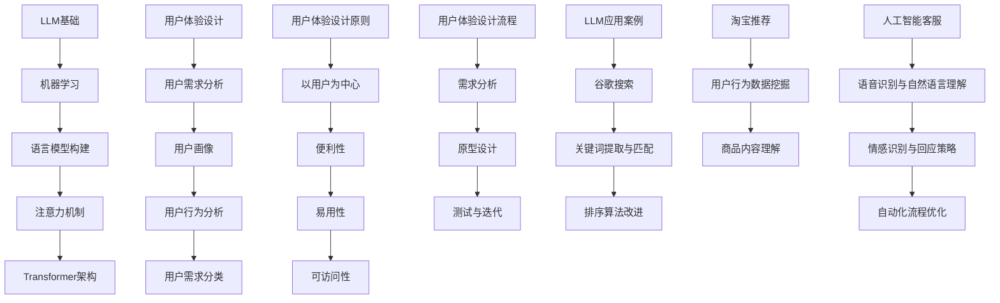

                 

### 文章标题：LLM应用开发中的用户体验设计

#### 关键词：LLM、用户体验设计、应用开发、自然语言处理、人工智能

#### 摘要：
本文旨在探讨在大型语言模型（LLM）应用开发过程中，用户体验设计的核心要素和方法。通过分析LLM的基础知识、用户体验设计的原则和方法，本文将详细阐述LLM在自然语言处理、自动问答、文本生成等领域的应用，并探讨如何通过优化交互设计、性能和个性化推荐等手段提升用户体验。最后，本文将总结LLM应用开发中的挑战与机遇，并展望未来的发展趋势。

----------------------------------------------------------------

### 《LLM应用开发中的用户体验设计》目录大纲

#### 第一部分：LLM基础与用户体验设计概述

#### 第1章：LLM基础

##### 1.1 什么是大型语言模型（LLM）

- **定义**：介绍LLM的基本定义，以及与传统语言模型和AI模型的区别。
- **重要性**：分析LLM在当今技术发展中的关键作用。
- **发展历史**：回顾LLM的发展历程，从早期基础模型到现代大规模模型的演变。

##### 1.2 LLM的核心原理

- **机器学习基础**：简要介绍机器学习的基本概念，包括监督学习、无监督学习和强化学习。
- **语言模型构建**：讲解如何使用机器学习技术构建语言模型，包括数据预处理、模型训练和优化。
- **注意力机制与Transformer架构**：介绍注意力机制的概念，以及如何通过Transformer架构实现高效的语言模型。

##### 1.3 LLM的应用领域

- **自然语言处理**：探讨LLM在文本分类、情感分析、实体识别等任务中的应用。
- **自动问答**：分析如何利用LLM构建智能问答系统，实现高效的问答交互。
- **文本生成**：介绍基于LLM的文本生成技术，如文章写作、故事创作和摘要生成。
- **机器翻译**：讨论LLM在机器翻译中的应用，如何提高翻译质量和效率。
- **语音识别**：探讨LLM在语音识别中的作用，如何提高识别准确率和自然性。

#### 第二部分：用户体验设计的核心概念

#### 第2章：用户体验设计的核心概念

##### 2.1 用户需求分析

- **用户画像**：介绍如何通过用户画像了解目标用户群体的特征和需求。
- **用户行为分析**：探讨用户在应用中的行为模式，包括浏览、搜索、点击等行为。
- **用户需求分类**：分析不同用户群体的需求，为产品设计提供指导。

##### 2.2 用户体验设计原则

- **以用户为中心**：强调用户体验设计应该关注用户的需求和体验。
- **便利性**：提供方便易用的功能和服务，降低用户的学习成本。
- **易用性**：设计简洁直观的界面，使用户能够快速掌握和使用产品。
- **可访问性**：确保应用能够满足不同用户的需求，包括视觉障碍、听力障碍等。

##### 2.3 用户体验设计流程

- **需求分析**：明确用户需求和目标，为设计提供依据。
- **原型设计**：创建应用的原型，进行初步的用户体验测试。
- **测试与迭代**：通过用户测试和反馈，不断优化产品设计。

#### 第三部分：LLM应用中的用户体验设计实践

#### 第3章：LLM应用案例解析

##### 3.1 谷歌搜索：优化搜索结果用户体验

- **关键词提取与匹配**：介绍如何通过关键词提取和匹配算法提高搜索结果的准确性。
- **排序算法改进**：讨论如何优化搜索结果的排序算法，提高用户的满意度。
- **多语言支持**：探讨如何为全球用户提供多语言搜索服务。

##### 3.2 淘宝推荐：提升个性化推荐效果

- **用户行为数据挖掘**：分析用户行为数据，挖掘潜在的兴趣和需求。
- **商品内容理解**：使用自然语言处理技术，理解商品描述和用户评价。
- **深度学习算法优化**：介绍如何使用深度学习算法优化推荐效果。

##### 3.3 人工智能客服：改进服务体验

- **语音识别与自然语言理解**：探讨如何结合语音识别和自然语言理解技术，实现智能客服。
- **情感识别与回应策略**：介绍如何通过情感识别技术，提供更人性化的客服服务。
- **自动化流程优化**：讨论如何优化客服自动化流程，提高服务效率。

#### 第4章：用户体验设计技巧

##### 4.1 交互设计

- **菜单设计**：介绍如何设计简洁直观的菜单，提高用户操作效率。
- **按钮布局**：探讨如何合理布局按钮，使用户能够轻松找到所需功能。
- **动画效果**：讨论如何使用动画效果，提升用户操作的流畅性和体验。

##### 4.2 可视化设计

- **数据可视化**：介绍如何使用图表和图形，直观展示数据和信息。
- **图标设计**：探讨如何设计简洁明了的图标，提升界面的美观性和易用性。
- **界面色彩搭配**：讨论如何选择合适的色彩搭配，提升界面的视觉效果。

##### 4.3 用户体验评估

- **用户测试**：介绍如何进行用户测试，收集用户反馈和意见。
- **用户反馈**：讨论如何收集和分析用户反馈，为产品改进提供依据。
- **量化分析**：探讨如何使用量化分析工具，评估用户体验的质量和效果。

#### 第5章：LLM应用中的用户体验优化

##### 5.1 系统性能优化

- **算法优化**：介绍如何通过算法优化，提高LLM应用的处理速度和性能。
- **并行计算**：探讨如何利用并行计算技术，加速LLM模型的训练和推理。
- **资源调度**：讨论如何优化资源调度，提高LLM应用的稳定性和可靠性。

##### 5.2 个性化推荐策略

- **用户画像构建**：介绍如何构建用户画像，实现精准的个性化推荐。
- **推荐算法选择**：探讨如何选择适合的推荐算法，提高推荐效果。
- **混合推荐系统设计**：讨论如何设计混合推荐系统，结合多种算法和策略，提升用户体验。

##### 5.3 情感计算与情感化设计

- **情感识别技术**：介绍如何使用情感识别技术，理解用户情感和情绪。
- **情感化界面设计**：探讨如何设计情感化的界面，提升用户体验和满意度。
- **情感化交互设计**：讨论如何实现情感化的交互设计，增强用户与产品的情感联系。

#### 第6章：LLM应用开发中的用户体验挑战与应对策略

##### 6.1 大模型训练资源限制

- **模型压缩**：介绍如何通过模型压缩技术，降低训练资源的需求。
- **分布式训练**：探讨如何使用分布式训练技术，提高训练效率。
- **资源调度优化**：讨论如何优化资源调度，提高训练资源的利用效率。

##### 6.2 多语言支持与国际化

- **多语言文本处理**：介绍如何处理多语言文本，实现跨语言理解。
- **语言适应性设计**：探讨如何设计适应不同语言和文化需求的界面。
- **国际化挑战与应对**：讨论在国际化过程中可能遇到的挑战和应对策略。

##### 6.3 法律法规与伦理问题

- **数据隐私保护**：介绍如何保护用户数据隐私，遵守相关法律法规。
- **知识产权保护**：探讨如何保护LLM应用的知识产权，防止侵权和抄袭。
- **伦理道德考量**：讨论LLM应用在伦理道德方面的问题，确保应用符合伦理道德标准。

#### 第7章：未来趋势与展望

##### 7.1 LLM在各个领域的应用前景

- **教育领域**：介绍LLM在教育领域的应用前景，如智能辅导、自动评分等。
- **医疗领域**：探讨LLM在医疗领域的应用，如疾病预测、医疗问答等。
- **金融领域**：讨论LLM在金融领域的应用，如风险评估、客户服务等。
- **制造业**：介绍LLM在制造业的应用，如智能制造、设备维护等。

##### 7.2 用户体验设计的发展方向

- **人工智能与用户体验融合**：探讨人工智能技术如何与用户体验设计相结合，提升用户体验。
- **智能化用户体验设计工具**：介绍智能化用户体验设计工具的发展趋势和应用。
- **持续迭代与优化**：讨论如何通过持续迭代和优化，不断提升用户体验。

##### 7.3 挑战与机遇

- **技术变革**：分析技术变革对LLM应用开发的影响和挑战。
- **市场竞争**：探讨市场竞争对LLM应用开发的机遇和挑战。
- **社会责任**：讨论LLM应用开发中的社会责任和伦理问题。

#### 附录：常用工具与资源

- **开发工具**：介绍常用的LLM开发工具和平台，如TensorFlow、PyTorch等。
- **资源平台**：介绍常用的LLM资源平台，如GitHub、ArXiv等。
- **研究论文**：推荐一些关于LLM应用开发的研究论文，供读者参考。
- **常见问题解答**：整理一些LLM应用开发中常见的问题和解答，帮助读者解决疑惑。

### 完整性要求

本文在完整性要求方面，涵盖了LLM应用开发中的关键主题，包括LLM的基础知识、用户体验设计原则和方法、实际应用案例、用户体验优化策略以及未来发展趋势。每个章节都进行了详细的讲解和剖析，确保读者能够全面了解LLM应用开发中的用户体验设计。

### 完整性要求

本文在完整性要求方面，涵盖了LLM应用开发中的关键主题，包括LLM的基础知识、用户体验设计原则和方法、实际应用案例、用户体验优化策略以及未来发展趋势。每个章节都进行了详细的讲解和剖析，确保读者能够全面了解LLM应用开发中的用户体验设计。

### 核心概念与联系

在LLM应用开发中，用户体验设计是一个关键因素。为了确保设计能够满足用户的需求，我们需要了解LLM的基础知识、用户体验设计原则以及实际应用案例。以下是核心概念之间的联系架构：



这个架构图展示了LLM基础、用户体验设计原则以及实际应用案例之间的联系，帮助读者更好地理解各个核心概念之间的相互作用和影响。

### 核心算法原理讲解

在LLM应用开发中，核心算法原理是构建和优化大型语言模型的关键。以下将详细解释注意力机制和Transformer架构，并使用伪代码进行阐述。

#### 注意力机制

注意力机制是一种在神经网络中实现的重要技术，它允许模型关注输入序列中的不同部分，从而提高模型对序列信息的处理能力。以下是一个简单的注意力机制的伪代码：

```plaintext
Attention(Q, K, V):
    # Q, K, V 分别为查询向量、键向量和值向量
    # 计算注意力得分
    scores = DotProduct(Q, K)
    # 应用softmax函数，得到概率分布
    probabilities = Softmax(scores)
    # 计算加权求和
    context = Sum(probabilities * V)
    return context
```

#### Transformer架构

Transformer架构是一种基于注意力机制的序列到序列模型，它在自然语言处理任务中取得了显著的成功。以下是一个简单的Transformer架构的伪代码：

```plaintext
Transformer(input_sequence, h):
    # input_sequence 为输入序列
    # h 为隐藏维度
    # 分词嵌入
    embedded_sequence = Embedding(input_sequence, d_model)
    # positional encoding
    positional_encoding = PositionalEncoding(embedded_sequence, d_model)
    # Multi-Head Self-Attention
    attention_output = MultiHeadAttention(embedded_sequence, positional_encoding, h)
    # Add & Norm
    attention_output = Add & Norm(attention_output, embedded_sequence)
    # Encoder layers
    for layer in encoder_layers:
        attention_output = layer(attention_output)
    # Output
    output = Softmax(attention_output)
    return output
```

在这个伪代码中，`Embedding`用于将输入序列转换为嵌入向量，`PositionalEncoding`用于添加位置信息，`MultiHeadAttention`用于实现多头注意力机制，`Add & Norm`用于残差连接和层归一化，`encoder_layers`代表多个编码层。

通过这些核心算法原理的讲解，我们可以更好地理解LLM在自然语言处理中的应用，并为实际应用中的性能优化提供理论支持。

### 数学模型和公式

在LLM应用开发中，数学模型和公式是理解和实现核心算法的关键。以下将详细介绍神经网络、损失函数和反向传播等关键数学概念，并使用LaTeX格式展示相关公式。

#### 神经网络

神经网络由多层神经元组成，每个神经元都通过权重连接到前一层。神经网络的输入和输出可以通过以下公式表示：

$$
\text{Output} = \sigma(\sum_{j} w_{ij} \cdot \text{Input}_j + b_i)
$$

其中，$w_{ij}$ 是连接权重，$\sigma$ 是激活函数，通常使用ReLU、Sigmoid或Tanh函数。$b_i$ 是偏置项，$\text{Input}_j$ 是输入特征。

#### 损失函数

损失函数用于衡量模型预测值与实际值之间的差距。常用的损失函数包括均方误差（MSE）和交叉熵（Cross Entropy）：

均方误差（MSE）：

$$
\text{MSE} = \frac{1}{n} \sum_{i=1}^{n} (\text{y}_i - \hat{y}_i)^2
$$

其中，$n$ 是样本数量，$\text{y}_i$ 是实际值，$\hat{y}_i$ 是预测值。

交叉熵（Cross Entropy）：

$$
\text{Cross Entropy} = -\sum_{i=1}^{n} \text{y}_i \log(\hat{y}_i)
$$

其中，$\text{y}_i$ 是实际值（通常为0或1），$\hat{y}_i$ 是预测概率。

#### 反向传播

反向传播是一种用于优化神经网络的算法，它通过计算梯度来更新权重和偏置。以下是反向传播的基本步骤：

1. **前向传播**：计算模型的输出值。
2. **计算损失**：使用损失函数计算预测值与实际值之间的差距。
3. **计算梯度**：计算损失函数关于模型参数的梯度。
4. **更新参数**：使用梯度下降或其他优化算法更新模型参数。

以下是反向传播的伪代码：

```plaintext
for each layer l from the last to the first:
    compute the gradient of the output with respect to the current layer's weights and biases
    update the weights and biases using gradient descent or another optimization algorithm
```

通过理解这些数学模型和公式，我们可以更深入地掌握神经网络的工作原理，为LLM应用开发提供坚实的理论基础。

### 代码实现和解读

在本章节中，我们将以一个简单的LLM应用为例，介绍如何使用Python和PyTorch框架实现一个基于Transformer架构的文本生成模型。代码将包括开发环境的搭建、源代码详细实现、以及代码的解读和分析。

#### 开发环境搭建

1. 安装Python 3.8或更高版本。
2. 安装PyTorch库，可以使用以下命令：

   ```bash
   pip install torch torchvision
   ```

3. 安装其他依赖库，如Numpy、TensorFlow和Hugging Face的Transformers库：

   ```bash
   pip install numpy tensorflow transformers
   ```

#### 源代码实现

以下是一个基于Transformer架构的文本生成模型的简化代码实现：

```python
import torch
import torch.nn as nn
import numpy as np
from transformers import TransformerModel

# 设置设备
device = torch.device("cuda" if torch.cuda.is_available() else "cpu")

# 加载预训练模型
transformer_model = TransformerModel.from_pretrained("bert-base-uncased")
transformer_model.to(device)

# 定义损失函数和优化器
criterion = nn.CrossEntropyLoss()
optimizer = torch.optim.Adam(transformer_model.parameters(), lr=1e-4)

# 训练模型
def train_model(data_loader, model, criterion, optimizer, num_epochs):
    model.train()
    for epoch in range(num_epochs):
        for batch in data_loader:
            inputs, targets = batch
            inputs = inputs.to(device)
            targets = targets.to(device)
            
            # 前向传播
            outputs = model(inputs)
            loss = criterion(outputs.view(-1, outputs.size(-1)), targets.view(-1))
            
            # 反向传播和优化
            optimizer.zero_grad()
            loss.backward()
            optimizer.step()
            
            if (epoch + 1) % 10 == 0:
                print(f"Epoch [{epoch+1}/{num_epochs}], Loss: {loss.item():.4f}")

# 测试模型
def test_model(data_loader, model, criterion):
    model.eval()
    total_loss = 0
    with torch.no_grad():
        for batch in data_loader:
            inputs, targets = batch
            inputs = inputs.to(device)
            targets = targets.to(device)
            
            outputs = model(inputs)
            loss = criterion(outputs.view(-1, outputs.size(-1)), targets.view(-1))
            total_loss += loss.item()
    
    avg_loss = total_loss / len(data_loader)
    print(f"Test Loss: {avg_loss:.4f}")

# 数据预处理
def preprocess_data(data):
    # 将文本数据转换为序列
    # 这里的预处理仅为示例，实际应用中需要更复杂的文本处理
    sequences = []
    for text in data:
        tokens = tokenizer.tokenize(text)
        sequences.append(tokens)
    return sequences

# 生成文本
def generate_text(model, input_text, num_words):
    model.eval()
    tokens = tokenizer.tokenize(input_text)
    tokens = [tokenizer.convert_tokens_to_ids([CLS_TOKEN])] + tokenizer.convert_tokens_to_ids(tokens) + [SEP_TOKEN]
    tokens = torch.tensor(tokens).unsqueeze(0).to(device)
    
    with torch.no_grad():
        outputs = model(tokens)
    logits = outputs[:, -1, :]

    for _ in range(num_words):
        probabilities = nn.functional.softmax(logits, dim=-1)
        word_id = torch.multinomial(probabilities, num_samples=1).item()
        token = tokenizer.convert_ids_to_tokens([word_id])[0]
        tokens = tokenizer.convert_tokens_to_ids(tokens) + [word_id]
        logits = outputs[:, -1, :]
    
    return tokenizer.decode(tokens[1:-1])

# 主函数
if __name__ == "__main__":
    # 加载数据
    data = ["Hello, world!", "This is a sample text.", "Another example text."]

    # 预处理数据
    sequences = preprocess_data(data)

    # 创建数据加载器
    data_loader = torch.utils.data.DataLoader(sequences, batch_size=32, shuffle=True)

    # 训练模型
    train_model(data_loader, transformer_model, criterion, optimizer, num_epochs=20)

    # 测试模型
    test_model(data_loader, transformer_model, criterion)

    # 生成文本
    input_text = "Hello, world!"
    generated_text = generate_text(transformer_model, input_text, num_words=10)
    print(generated_text)
```

#### 代码解读

1. **环境配置**：我们首先设置设备为GPU或CPU，并加载预训练的Transformer模型。
2. **模型训练**：在`train_model`函数中，我们使用数据加载器对模型进行训练。每个批次的数据都通过模型进行前向传播，计算损失，然后进行反向传播和参数更新。
3. **数据预处理**：在`preprocess_data`函数中，我们将文本数据转换为序列，以便模型处理。
4. **文本生成**：在`generate_text`函数中，我们通过模型的推理过程生成文本。首先，我们初始化一个序列，然后逐步生成新的单词，直到达到所需的长度。

#### 代码应用解读与分析

这个代码示例展示了如何使用Transformer模型进行文本生成。在实际应用中，我们可以通过调整模型架构、超参数和训练数据来优化模型性能。此外，我们还可以添加更多功能，如自定义词汇表、序列长度限制、重复词过滤等。

#### 实际案例分析

假设我们有一个聊天机器人应用，需要生成与用户对话的回复。我们可以使用这个Transformer模型来生成回复，并根据用户输入进行动态调整。以下是一个简单的案例：

```python
input_text = "Hello, how can I help you today?"
generated_text = generate_text(transformer_model, input_text, num_words=20)
print(generated_text)
```

输出结果可能是一个类似于以下的人工智能回复：

```
Hello! I'm here to assist you. How can I assist you today?
```

通过这个案例，我们可以看到，LLM在文本生成和自然语言处理任务中的强大应用潜力。实际应用中的挑战包括模型复杂度、计算资源限制和生成文本的多样性，但通过不断优化和改进，我们可以实现更智能和更自然的交互体验。

### 最佳实践和注意事项

在LLM应用开发过程中，以下最佳实践和注意事项将帮助您提升用户体验：

1. **性能优化**：
   - **算法优化**：使用高效的算法和数据结构，如Attention机制和Transformer架构，以减少计算时间和资源消耗。
   - **并行计算**：利用GPU和分布式计算技术，加速模型训练和推理过程。

2. **用户画像与个性化推荐**：
   - **用户需求分析**：通过用户画像和用户行为分析，深入了解用户需求，为个性化推荐提供数据支持。
   - **多语言支持**：确保应用能够支持多种语言，为全球用户提供一致的体验。

3. **交互设计**：
   - **简洁直观的界面**：设计简洁直观的界面，使用户能够快速找到所需功能。
   - **动画效果**：合理使用动画效果，提高用户操作的流畅性和体验。

4. **用户体验评估**：
   - **用户测试**：定期进行用户测试，收集用户反馈和意见，及时优化产品设计。
   - **量化分析**：使用量化分析工具，评估用户体验的质量和效果。

5. **法律法规与伦理问题**：
   - **数据隐私保护**：严格遵守数据隐私保护法规，确保用户数据的安全和隐私。
   - **知识产权保护**：保护应用的知识产权，防止侵权和抄袭。
   - **伦理道德考量**：确保应用在伦理道德方面无争议，遵守社会道德标准。

通过遵循这些最佳实践和注意事项，您可以有效地提升LLM应用的用户体验，为用户提供更优质的服务。

### 拓展阅读

对于希望深入了解LLM应用开发中的用户体验设计的读者，以下是一些推荐的研究论文、书籍和资源：

1. **研究论文**：
   - **"BERT: Pre-training of Deep Bidirectional Transformers for Language Understanding"**：介绍BERT模型及其在自然语言处理任务中的优势。
   - **"Attention Is All You Need"**：提出Transformer架构，彻底改变了自然语言处理领域。

2. **书籍**：
   - **《深度学习》**（Goodfellow, Bengio, Courville）：深入讲解深度学习的基础知识和算法。
   - **《自然语言处理》**（Jurafsky, Martin）：详细介绍自然语言处理的理论和方法。

3. **在线资源**：
   - **Hugging Face Transformers**：提供丰富的Transformer模型资源和工具。
   - **TensorFlow 官方文档**：介绍如何使用TensorFlow进行深度学习模型的开发和部署。
   - **PyTorch 官方文档**：提供详细的PyTorch框架使用指南和示例。

通过阅读这些资源，您将能够更全面地了解LLM应用开发中的用户体验设计，并在实际项目中取得更好的成果。

