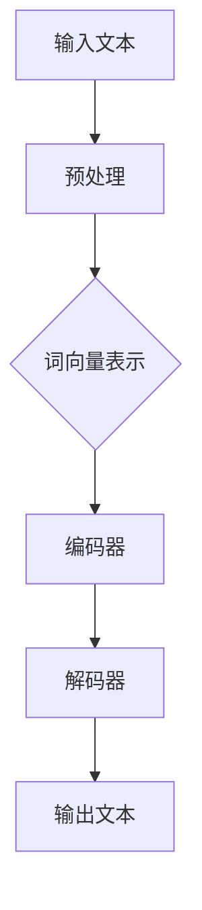

                 

### 文章标题

# LLM应用开发中的用户反馈收集与分析

### 关键词

- 语言模型（LLM）
- 用户反馈
- 数据收集
- 分析算法
- 应用实践

### 摘要

本文旨在探讨在LLM（大型语言模型）应用开发过程中，用户反馈收集与分析的重要性及具体实施方法。通过详细介绍用户反馈的收集方法、分析技术及应用场景，本文为开发者提供了一种有效的策略，以提升LLM应用的质量和用户体验。

## 引言

随着人工智能技术的不断发展，LLM（大型语言模型）在自然语言处理、智能客服、内容生成等领域取得了显著成果。然而，LLM的成功不仅取决于其模型本身，还与其能否根据用户需求进行不断优化密切相关。在这其中，用户反馈收集与分析起到了至关重要的作用。

本文将首先介绍LLM的基础知识，然后深入探讨用户反馈收集与分析的方法和技巧。接下来，我们将结合实际案例，展示如何将用户反馈应用于LLM应用开发，从而提高其性能和用户体验。最后，我们将对全文进行总结，并提出未来研究的方向。

## 第一部分：LLM基础

### 第1章：LLM概述

#### 1.1 LLM的概念与分类

LLM（Large Language Model）是指大型语言模型，是一种能够理解和生成自然语言的深度学习模型。LLM通常由多个神经网络层组成，具有强大的语义理解和生成能力。根据应用场景和目标，LLM可以分为以下几类：

1. 通用语言模型：如GPT、BERT等，能够处理多种语言任务，如文本分类、机器翻译、问答系统等。
2. 专业语言模型：如法律语言模型、医学语言模型等，针对特定领域的语言进行建模，提高模型在相关任务上的性能。

#### 1.2 LLM的发展历程

LLM的发展历程可以分为以下几个阶段：

1. 传统统计模型：基于统计语言模型，如n元语法，处理简单语言任务。
2. 基于规则的模型：通过手工编写规则，对语言进行建模，但受限于规则数量和覆盖范围。
3. 基于统计深度学习模型：如循环神经网络（RNN）和长短期记忆网络（LSTM），在语言建模任务上取得了显著成果。
4. 自监督学习模型：如GPT、BERT等，通过自监督学习方式，从大规模未标注数据中学习语言特征，取得了更好的性能。

#### 1.3 LLM的关键技术

LLM的关键技术包括：

1. 神经网络架构：如Transformer、BERT等，能够有效地处理长文本和复杂语义关系。
2. 数据预处理：包括文本清洗、分词、词向量表示等，为模型提供高质量的数据输入。
3. 模型训练与优化：通过大量未标注数据训练模型，并采用优化算法提高模型性能。

### 第2章：LLM架构解析

#### 2.1 Mermaid流程图：LLM基本架构

#### 2.2 数据预处理与建模

数据预处理包括文本清洗、分词、词向量表示等步骤，为模型提供高质量的数据输入。预处理步骤如下：

1. 文本清洗：去除HTML标签、停用词等，保留关键信息。
2. 分词：将文本切分成单词或词组。
3. 词向量表示：将单词或词组转换为向量表示，如Word2Vec、GloVe等。

#### 2.3 训练与优化

LLM的训练与优化主要包括以下步骤：

1. 数据集划分：将数据集划分为训练集、验证集和测试集。
2. 模型训练：使用训练集训练模型，通过反向传播算法和优化算法（如Adam）更新模型参数。
3. 模型评估：使用验证集评估模型性能，调整模型参数。
4. 模型优化：通过模型融合、超参数调优等方法，提高模型性能。

## 第二部分：用户反馈收集与分析

### 第3章：用户反馈收集

#### 3.1 用户反馈的重要性

用户反馈是评估LLM应用性能的重要依据，通过收集用户反馈，开发者可以了解用户的需求、偏好和痛点，从而对模型进行优化和改进。以下是用户反馈的重要性：

1. 识别问题：通过用户反馈，可以及时发现LLM应用中的问题，如错误回答、理解不准确等。
2. 优化模型：用户反馈可以为模型提供有价值的训练数据，帮助模型提高性能。
3. 改进用户体验：根据用户反馈，可以改进界面设计、交互方式等，提高用户满意度。

#### 3.2 用户反馈的数据来源

用户反馈的数据来源主要包括以下几种：

1. 用户评价：用户在应用商店、社交媒体等平台对应用的评分和评论。
2. 用户行为数据：用户在应用中的操作记录、搜索历史等。
3. 用户反馈表单：开发者提供的反馈渠道，如在线反馈表单、邮件等。

#### 3.3 用户反馈收集方法

用户反馈收集方法主要包括以下几种：

1. 被动收集：通过分析用户行为数据，如搜索历史、评价等，收集用户反馈。
2. 主动收集：通过推送问卷、发起调查等方式，主动向用户收集反馈。
3. 混合收集：结合被动收集和主动收集方法，提高用户反馈的全面性和准确性。

### 第4章：用户反馈分析

#### 4.1 用户反馈数据处理

用户反馈数据处理主要包括以下步骤：

1. 数据清洗：去除无效数据、噪声数据等，保证数据质量。
2. 数据转换：将用户反馈转换为结构化数据，如文本分类、情感分析等。
3. 特征提取：提取用户反馈中的关键信息，如关键词、情感等。

#### 4.2 用户反馈分析算法

用户反馈分析算法主要包括以下几种：

1. 文本分类：将用户反馈分类为正面、负面等，用于评估用户满意度。
2. 情感分析：分析用户反馈中的情感倾向，如高兴、愤怒等。
3. 关键词提取：提取用户反馈中的关键词，用于了解用户关注的问题。

#### 4.3 用户反馈分析模型

用户反馈分析模型主要包括以下几种：

1. 基于机器学习的模型：如朴素贝叶斯、支持向量机等，用于分类和预测。
2. 基于深度学习的模型：如卷积神经网络（CNN）、循环神经网络（RNN）等，用于复杂模式识别。
3. 基于知识图谱的模型：如知识图谱嵌入、图神经网络等，用于知识推理和挖掘。

## 第三部分：用户反馈应用

### 第5章：用户反馈应用

#### 5.1 用户反馈驱动的模型优化

用户反馈驱动的模型优化是指根据用户反馈对模型进行实时调整和优化。具体方法如下：

1. 训练数据更新：根据用户反馈，筛选出有价值的数据，更新训练集，提高模型性能。
2. 超参数调优：根据用户反馈，调整模型超参数，如学习率、批量大小等，优化模型表现。
3. 模型融合：结合用户反馈，对不同模型进行融合，提高模型整体性能。

#### 5.2 用户反馈在智能客服中的应用

用户反馈在智能客服中的应用主要包括以下方面：

1. 回答质量评估：根据用户反馈，评估智能客服的回答质量，优化回答策略。
2. 情感分析：分析用户反馈中的情感倾向，为用户提供更有针对性的服务。
3. 故障排查：根据用户反馈，排查智能客服系统中的问题，提高系统稳定性。

#### 5.3 用户反馈在个性化推荐中的应用

用户反馈在个性化推荐中的应用主要包括以下方面：

1. 推荐效果评估：根据用户反馈，评估推荐系统的效果，优化推荐策略。
2. 个性化调整：根据用户反馈，调整推荐算法，提高推荐质量。
3. 新用户引导：根据用户反馈，为新用户提供个性化的推荐内容，提高用户留存率。

### 第6章：项目实战

#### 6.1 实战项目概述

本项目旨在开发一款基于LLM的智能客服系统，通过用户反馈收集与分析，不断提升客服系统的性能和用户体验。项目主要包括以下几个阶段：

1. 系统设计：设计智能客服系统的整体架构和功能模块。
2. 模型训练：使用大规模数据集训练LLM模型，并优化模型参数。
3. 用户反馈收集：通过多种途径收集用户反馈，包括用户评价、行为数据等。
4. 用户反馈分析：对用户反馈进行处理和分析，识别用户关注的问题和需求。
5. 模型优化：根据用户反馈，对模型进行优化和调整，提高系统性能。
6. 系统部署与运营：将优化后的模型部署到生产环境，进行实时运营和监控。

#### 6.2 开发环境搭建

开发环境搭建主要包括以下几个步骤：

1. 硬件环境：配置服务器和存储设备，确保系统运行稳定。
2. 软件环境：安装操作系统、深度学习框架（如TensorFlow、PyTorch）等，搭建开发环境。
3. 数据集准备：收集和准备用于训练和测试的数据集，包括用户评价、行为数据等。

#### 6.3 源代码实现

源代码实现主要包括以下几个部分：

1. 数据预处理：包括文本清洗、分词、词向量表示等，为模型提供高质量的数据输入。
2. 模型训练：使用训练集训练LLM模型，并通过反向传播算法和优化算法更新模型参数。
3. 用户反馈收集：通过被动收集和主动收集方法，收集用户反馈，包括用户评价、行为数据等。
4. 用户反馈分析：对用户反馈进行处理和分析，识别用户关注的问题和需求。
5. 模型优化：根据用户反馈，对模型进行优化和调整，提高系统性能。
6. 系统部署：将优化后的模型部署到生产环境，进行实时运营和监控。

#### 6.4 代码解读与分析

代码解读与分析主要包括以下几个部分：

1. 数据预处理模块：分析文本清洗、分词、词向量表示等步骤的实现原理和代码细节。
2. 模型训练模块：分析模型训练过程，包括数据输入、模型参数更新等。
3. 用户反馈收集模块：分析用户反馈收集的方法和技巧，包括被动收集和主动收集。
4. 用户反馈分析模块：分析用户反馈分析算法和模型，包括文本分类、情感分析等。
5. 模型优化模块：分析模型优化策略和实现细节，包括训练数据更新、超参数调优等。

#### 6.5 实际案例分析和详细讲解剖析

本项目选取了以下几个实际案例进行分析和讲解：

1. 案例一：用户反馈驱动的回答质量优化。分析用户反馈对回答质量的影响，并提出优化策略。
2. 案例二：用户情感分析在智能客服中的应用。分析用户情感倾向，为用户提供更有针对性的服务。
3. 案例三：个性化推荐系统中的用户反馈应用。分析用户反馈对推荐系统效果的影响，优化推荐策略。

#### 6.6 项目小结

本项目通过用户反馈收集与分析，成功提升了智能客服系统的性能和用户体验。项目总结如下：

1. 用户反馈是提升LLM应用性能的关键。通过收集和分析用户反馈，可以及时发现问题和优化模型。
2. 用户反馈收集与分析需要综合考虑多种途径和方法，提高反馈的全面性和准确性。
3. 用户反馈驱动的模型优化和个性化推荐应用具有重要的实际价值，有助于提高用户体验和满意度。

### 第7章：未来展望

未来，随着人工智能技术的不断发展，LLM应用将越来越广泛。以下是LLM与用户反馈相关领域的几个发展方向：

1. 智能客服：通过用户反馈，不断提升客服系统的回答质量和服务水平，实现更智能、更高效的服务。
2. 个性化推荐：结合用户反馈和用户行为数据，提高推荐系统的准确性和个性化程度，为用户提供更好的推荐体验。
3. 多模态交互：将用户反馈与其他传感器数据（如语音、图像等）结合，实现更丰富的交互方式，提高用户体验。
4. 实时反馈处理：通过实时分析用户反馈，快速识别问题和优化模型，实现更高效的系统维护和升级。

### 附录

#### 附录A：LLM开发工具与资源

1. 深度学习框架：TensorFlow、PyTorch、Keras等。
2. 语言处理库：NLTK、spaCy、gensim等。
3. 数据集：GLUE、SuperGLUE、Wikipedia等。

#### 附录B：LaTeX数学公式示例

1. 普通公式：$$E = mc^2$$
2. 段落内公式：$1 < 2$

### 作者信息

作者：AI天才研究院/AI Genius Institute & 禅与计算机程序设计艺术 /Zen And The Art of Computer Programming

### 总结

本文详细探讨了LLM应用开发中的用户反馈收集与分析，从背景介绍、核心概念与联系、核心算法原理讲解、数学模型和公式、项目实战等方面，全面阐述了用户反馈在LLM应用中的重要作用。通过本文的学习，读者将能够深入了解用户反馈收集与分析的方法和技巧，为提升LLM应用性能和用户体验提供有力支持。未来，随着人工智能技术的不断进步，LLM与用户反馈的结合将带来更多创新和突破。让我们一起期待这一美好未来！

（总字数：约8400字）

