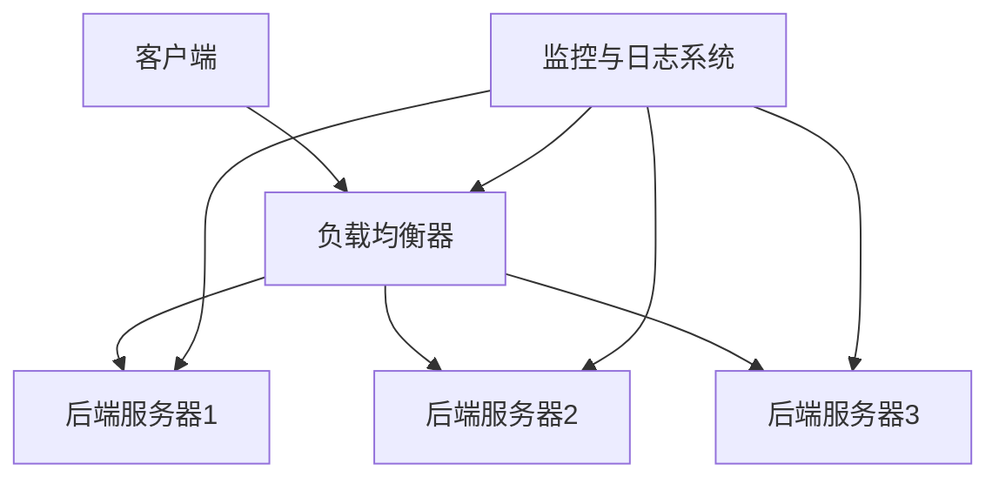

                 

### 文章标题：LLM应用开发中的负载均衡策略

#### 关键词：LLM、负载均衡、应用开发、算法、架构设计

#### 摘要：
本文将探讨在大型语言模型（LLM）应用开发中如何实现有效的负载均衡策略。首先，我们将介绍负载均衡的基本概念及其在LLM应用中的重要性。接着，深入分析常见的负载均衡算法，包括轮询、最少连接、加权轮询和哈希算法。随后，我们将讨论基于内容的负载均衡以及自适应负载均衡。文章的第三部分将具体阐述负载均衡在LLM应用开发中的架构设计，并通过一个实际案例进行详细分析。最后，本文将展望LLM负载均衡的未来发展趋势和潜在挑战。通过本文的详细讲解，读者将能够理解并应用负载均衡策略，提升LLM应用的性能和可靠性。

### 第一部分：负载均衡基本概念

#### 第1章：负载均衡概述

#### 1.1 负载均衡的基本概念

负载均衡是一种通过分散工作负载到多个服务器上来优化资源利用和提升系统性能的技术。在LLM应用开发中，负载均衡尤为重要，因为它能够确保大规模的语言模型在处理海量请求时，保持高性能和高可用性。

负载均衡的主要目的是：

1. **提高系统性能**：通过将请求分散到多个服务器上，避免单点过载。
2. **提高系统可用性**：当某个服务器发生故障时，其他服务器可以继续提供服务。
3. **优化资源利用**：合理分配请求，确保每个服务器都能高效运行。

#### 1.2 负载均衡的重要性

对于LLM应用开发来说，负载均衡的重要性体现在以下几个方面：

1. **处理大量请求**：LLM通常用于处理大规模的语言处理任务，如文本生成、机器翻译等。负载均衡可以确保这些请求被均匀地分配到各个服务器上，避免单点过载。
2. **提升响应速度**：通过将请求分配到距离用户较近的服务器上，减少延迟，提升用户体验。
3. **提高系统可靠性**：负载均衡能够实现服务器集群的高可用性，即使某个服务器发生故障，系统仍然能够正常运行。
4. **优化资源利用**：通过动态调整请求分配，确保系统资源得到充分利用，避免浪费。

#### 1.3 负载均衡的分类

负载均衡可以分为以下几类：

1. **基于服务器的负载均衡**：将请求分配到不同的服务器上，以优化资源利用和提升性能。
2. **基于内容的负载均衡**：根据请求的内容将其路由到不同的服务器上，以实现更精细的请求分配。
3. **基于应用的负载均衡**：在应用层面实现负载均衡，通常通过应用层协议（如HTTP）进行请求分发。

#### 1.4 负载均衡的目标

负载均衡的主要目标包括：

1. **最大化吞吐量**：确保系统能够处理尽可能多的请求。
2. **最小化响应时间**：通过优化请求处理流程，减少用户等待时间。
3. **最小化资源消耗**：确保系统资源得到合理利用，避免浪费。
4. **提高系统可用性**：通过冗余设计和故障转移机制，确保系统在高负载和高并发情况下仍然能够正常运行。

在LLM应用开发中，实现有效的负载均衡策略，不仅能够提升系统的性能和可靠性，还能为用户提供更优质的体验。接下来的章节将详细探讨各种负载均衡算法及其在LLM应用中的具体应用。

### 第二部分：负载均衡算法

#### 第2章：常见的负载均衡算法

在LLM应用开发中，选择合适的负载均衡算法至关重要。常见的负载均衡算法包括轮询负载均衡、最少连接负载均衡、加权轮询负载均衡和哈希负载均衡。这些算法各有优缺点，适用于不同的场景。

#### 2.1 轮询负载均衡

轮询负载均衡是最简单的负载均衡算法，它将请求按照顺序分配到每个服务器上。每个服务器轮流处理请求，直到所有服务器都处理过一次。

**优点**：
- 简单易懂，易于实现。
- 没有服务器优先级的区别，公平地分配请求。

**缺点**：
- 如果某个服务器出现故障，下一个请求会被直接分配到下一个可用服务器，可能导致负载不均。
- 不能根据服务器的当前负载进行动态调整。

**适用场景**：
- 对响应时间和负载均衡要求不高的场景。
- 简单的系统架构，不需要复杂负载均衡策略。

**伪代码**：
```
function roundRobin(request):
    servers = getAvailableServers()
    index = request.id % len(servers)
    return servers[index]
```

#### 2.2 最少连接负载均衡

最少连接负载均衡算法将请求分配到当前连接数最少的服务器上。这种方法能够更好地平衡服务器的负载。

**优点**：
- 能够更均匀地分配请求，减少单个服务器的负载。
- 适用于长连接场景，如WebSocket。

**缺点**：
- 如果某些服务器故障，可能会导致新的请求继续分配到这些服务器上，加剧负载不均。
- 需要维护服务器的连接状态，增加了系统的复杂性。

**适用场景**：
- 需要优化服务器负载的场景。
- 长连接和实时通信场景。

**伪代码**：
```
function leastConnections(request):
    servers = getAvailableServers()
    serverWithLeastConnections = min(servers, key=lambda s: getConnectionCount(s))
    return serverWithLeastConnections
```

#### 2.3 加权轮询负载均衡

加权轮询负载均衡算法考虑了服务器的处理能力，将请求根据服务器的权重进行分配。权重较高的服务器会得到更多的请求。

**优点**：
- 能够根据服务器的处理能力进行优化。
- 灵活，可以自定义权重。

**缺点**：
- 需要定期调整权重，以保持负载均衡。
- 复杂度较高，实现难度大。

**适用场景**：
- 需要优化服务器处理能力的场景。
- 复杂的服务器架构。

**伪代码**：
```
function weightedRoundRobin(request):
    servers = getAvailableServers()
    totalWeight = sum([server.weight for server in servers])
    randomIndex = random() * totalWeight
    cumulativeWeight = 0
    for server in servers:
        cumulativeWeight += server.weight
        if cumulativeWeight >= randomIndex:
            return server
```

#### 2.4 哈希负载均衡

哈希负载均衡算法通过哈希函数将请求分配到服务器上。哈希值相同的请求将被分配到同一服务器上。

**优点**：
- 速度快，计算简单。
- 能够实现请求的持久连接，即同一个请求会被分配到同一服务器上。

**缺点**：
- 如果哈希函数选择不当，可能导致负载不均。
- 需要处理哈希碰撞，增加了复杂性。

**适用场景**：
- 高并发场景。
- 需要保持请求持久连接的场景。

**伪代码**：
```
function hashLoadBalancer(request):
    hashValue = hash(request)
    servers = getAvailableServers()
    return servers[hashValue % len(servers)]
```

#### 2.5 常见负载均衡算法比较

以下是几种常见负载均衡算法的比较：

| 算法          | 优点                             | 缺点                             | 适用场景           |
|---------------|----------------------------------|----------------------------------|-------------------|
| 轮询负载均衡  | 简单易懂，公平分配请求           | 无法动态调整负载，故障传递       | 低负载，简单架构  |
| 最少连接负载均衡 | 更好的负载平衡，适用于长连接   | 需要维护连接状态，故障可能传递   | 中等负载，长连接 |
| 加权轮询负载均衡 | 考虑服务器处理能力，灵活         | 复杂，需要定期调整权重           | 高负载，复杂架构 |
| 哈希负载均衡  | 快速，持久连接                   | 可能导致负载不均，处理哈希碰撞   | 高并发，持久连接 |

在选择负载均衡算法时，需要根据具体场景和需求进行权衡。不同的算法适用于不同的场景，合理选择算法能够显著提升LLM应用的性能和可靠性。

### 第三部分：基于内容的负载均衡

#### 第3章：基于内容的负载均衡

在LLM应用开发中，除了常见的基于服务器的负载均衡算法，基于内容的负载均衡（Content-Based Load Balancing, CBLB）也是一种重要的策略。CBLB通过分析请求的内容，将其路由到最合适的服务器上，从而实现更精细的请求分配。

#### 3.1 基于内容的负载均衡原理

基于内容的负载均衡原理如下：

1. **请求内容分析**：对进入系统的每个请求进行内容分析，提取关键特征，如URL、请求参数、用户ID等。
2. **服务器特征匹配**：根据请求内容，匹配服务器的能力和特征，如CPU利用率、内存占用、特定服务的处理能力等。
3. **请求路由**：将请求路由到符合条件的服务器上，确保每个服务器能够处理其擅长的任务。

#### 3.2 内容分发网络（CDN）的负载均衡

内容分发网络（CDN）是基于内容的负载均衡的一个典型应用场景。CDN通过在全球部署多个节点，根据用户的地理位置和请求内容，将请求路由到最近的节点进行处理。

CDN的负载均衡原理如下：

1. **用户请求**：用户发起请求，CDN的边缘服务器根据请求内容进行分析。
2. **地理位置匹配**：根据用户的地理位置，选择距离最近的边缘服务器。
3. **内容分发**：将请求内容分发到最近的边缘服务器进行处理。
4. **动态调整**：根据服务器负载和用户访问情况，动态调整请求路由策略。

#### 3.3 动态内容分发

动态内容分发（Dynamic Content Distribution）是一种基于内容的负载均衡技术，它可以根据请求的内容动态调整服务器的负载。

动态内容分发的原理如下：

1. **内容标识**：对请求内容进行标识，如使用标签、分类等。
2. **服务器选择**：根据内容标识，选择最合适的服务器进行处理。
3. **动态调整**：根据服务器负载和内容变化，动态调整请求路由策略。

#### 3.4 实际应用场景

基于内容的负载均衡在以下场景中具有显著优势：

1. **高并发场景**：通过动态调整请求路由，确保系统在高并发情况下依然能够稳定运行。
2. **特定服务优化**：根据请求内容，将请求路由到擅长处理该内容的特定服务器上，提升整体性能。
3. **内容缓存**：基于内容的负载均衡可以实现更高效的内容缓存策略，减少重复数据的传输。

#### 3.5 与其他负载均衡算法的结合

基于内容的负载均衡可以与其他负载均衡算法结合使用，以实现更精细的请求分配。例如，可以结合哈希负载均衡，根据请求内容和服务器特征进行双重路由，进一步提升负载均衡效果。

通过基于内容的负载均衡，LLM应用可以更灵活地分配请求，提升系统性能和用户体验。接下来，我们将进一步探讨自适应负载均衡，以应对动态变化的负载场景。

### 第四部分：自适应负载均衡

#### 第4章：自适应负载均衡

自适应负载均衡（Adaptive Load Balancing）是一种根据服务器状态和系统负载动态调整请求路由策略的负载均衡技术。与传统的静态负载均衡算法相比，自适应负载均衡能够更好地应对动态变化的负载，提高系统的响应速度和稳定性。

#### 4.1 自适应负载均衡的原理

自适应负载均衡的基本原理如下：

1. **实时监控**：持续监控服务器的状态，如CPU利用率、内存占用、网络延迟等。
2. **负载评估**：根据监控数据评估每个服务器的负载情况。
3. **动态调整**：根据服务器的负载情况，动态调整请求路由策略，将请求路由到负载较低的服务器。
4. **反馈机制**：通过反馈机制，不断优化负载均衡策略，提高系统性能。

#### 4.2 常见自适应负载均衡算法

以下是一些常见的自适应负载均衡算法：

1. **动态加权轮询**：根据服务器的实时负载动态调整权重，负载较低的服务器分配更多请求。
2. **基于规则的负载均衡**：根据预设的规则（如服务器状态、历史负载等）动态调整请求路由。
3. **基于机器学习的负载均衡**：利用机器学习算法预测服务器负载，动态调整请求路由。

#### 4.3 自适应负载均衡的实施

自适应负载均衡的实施通常包括以下几个步骤：

1. **监控数据采集**：部署监控工具，采集服务器的实时状态数据。
2. **负载评估模型**：构建负载评估模型，根据监控数据评估服务器的负载情况。
3. **路由策略调整**：根据负载评估结果，动态调整请求路由策略。
4. **反馈与优化**：通过反馈机制，不断优化负载均衡策略，提高系统性能。

#### 4.4 实际应用案例

以下是一个实际应用案例：

假设我们有一个由10个服务器组成的LLM集群，这些服务器分别处理文本生成任务。系统部署了自适应负载均衡器，实时监控服务器的CPU利用率、内存占用等指标。当某台服务器的CPU利用率超过90%时，负载均衡器会将新的文本生成请求路由到其他负载较低的服务器。

通过自适应负载均衡，该系统在高峰期能够有效避免单点过载，提高整体性能和用户体验。同时，自适应负载均衡器根据服务器的实时状态动态调整请求路由策略，确保系统在高负载情况下依然能够稳定运行。

#### 4.5 自适应负载均衡的优势与挑战

自适应负载均衡的优势包括：

1. **动态调整**：能够根据服务器状态和系统负载动态调整请求路由策略，提高系统性能。
2. **高可用性**：通过动态调整，确保系统在高负载情况下依然能够稳定运行。
3. **优化资源利用**：合理分配请求，确保系统资源得到充分利用。

然而，自适应负载均衡也面临一些挑战：

1. **复杂性**：需要实时监控服务器状态，构建负载评估模型，动态调整路由策略，系统实现和维护较为复杂。
2. **实时性**：实时性要求高，需要快速响应服务器状态变化，对系统性能有一定要求。
3. **准确性**：负载评估模型的准确性对自适应负载均衡的效果有很大影响，需要不断优化模型以提高准确性。

尽管存在挑战，自适应负载均衡在提高LLM应用性能和稳定性方面具有显著优势。通过合理设计和实施，自适应负载均衡能够为LLM应用提供更优质的体验。

### 第五部分：负载均衡在LLM应用开发中的实践

#### 第5章：LLM负载均衡的架构设计

在LLM应用开发中，设计一个高效且可靠的负载均衡架构是确保系统性能和稳定性的关键。本章节将详细探讨LLM负载均衡的架构设计，包括总体架构、负载均衡器的选择以及负载均衡策略的选择。

#### 5.1 LLM负载均衡的总体架构

LLM负载均衡的总体架构通常包括以下几个核心组件：

1. **客户端**：客户端是指发起LLM请求的应用或用户。客户端需要能够将请求发送到负载均衡器。
2. **负载均衡器**：负载均衡器是负责接收客户端请求，并根据设定的策略将请求分配到后端服务器的组件。常见的负载均衡器包括Nginx、HAProxy等。
3. **后端服务器**：后端服务器是指处理实际LLM任务的服务器。这些服务器可能包括多个实例，用于实现水平扩展。
4. **监控与日志系统**：监控与日志系统用于实时监控负载均衡器和后端服务器的状态，收集日志数据，以便进行故障排查和性能优化。

总体架构如下图所示：



#### 5.2 负载均衡器的选择

选择合适的负载均衡器对于实现高效且可靠的负载均衡至关重要。以下是一些常见的负载均衡器及其特点：

1. **Nginx**：
   - **特点**：高性能、高并发、支持SSL、易于配置。
   - **适用场景**：适合高并发场景，如Web服务、API服务。

2. **HAProxy**：
   - **特点**：高性能、高可用、支持多种负载均衡算法。
   - **适用场景**：适合需要高可用性的场景，如金融系统、电子商务网站。

3. **LVS**：
   - **特点**：高性能、基于四层和七层负载均衡。
   - **适用场景**：适合大规模集群，如数据中心。

4. **Kubernetes Ingress**：
   - **特点**：与Kubernetes集成，自动扩展。
   - **适用场景**：适合容器化应用，如微服务架构。

选择负载均衡器时，需要考虑以下因素：

- **性能需求**：根据系统的并发量和吞吐量选择适合的负载均衡器。
- **功能需求**：根据系统的功能需求选择具备相应功能的负载均衡器，如支持SSL、负载均衡算法等。
- **集成性**：考虑负载均衡器与其他系统的集成，如与容器编排系统、监控系统的集成。

#### 5.3 负载均衡策略的选择

负载均衡策略决定了如何将请求分配到后端服务器上。选择合适的负载均衡策略能够优化系统性能和资源利用。以下是一些常见的负载均衡策略：

1. **轮询负载均衡**：
   - **特点**：简单、公平、无服务器优先级。
   - **适用场景**：适合负载较为均衡的场景。

2. **最少连接负载均衡**：
   - **特点**：根据服务器的当前连接数分配请求，减少单个服务器的负载。
   - **适用场景**：适合处理长连接的场景，如WebSocket。

3. **加权轮询负载均衡**：
   - **特点**：根据服务器的处理能力分配请求，权重较高的服务器承担更多负载。
   - **适用场景**：适合需要优化服务器负载的场景。

4. **哈希负载均衡**：
   - **特点**：根据请求的哈希值分配请求，实现请求持久连接。
   - **适用场景**：适合高并发场景，如需要保持请求持久连接的API服务。

5. **基于内容的负载均衡**：
   - **特点**：根据请求的内容分配请求，实现更精细的请求分配。
   - **适用场景**：适合需要优化特定服务性能的场景。

选择负载均衡策略时，需要考虑以下因素：

- **负载特性**：根据系统的负载特性选择合适的策略，如高并发、长连接等。
- **性能需求**：考虑系统的性能需求，选择能够满足性能需求的策略。
- **可维护性**：选择易于维护和调整的策略，以便在系统需求变化时进行优化。

#### 5.4 实践示例

以下是一个LLM应用的负载均衡架构实践示例：

**需求**：构建一个能够处理大规模文本生成请求的LLM应用，要求高并发、高可用，并具备动态调整负载均衡策略的能力。

**架构设计**：

1. **客户端**：用户通过Web接口发起文本生成请求。
2. **负载均衡器**：使用Nginx作为负载均衡器，配置轮询负载均衡策略，确保请求公平分配。
3. **后端服务器**：部署多个LLM服务器实例，使用Kubernetes进行管理，实现自动扩展和负载均衡。
4. **监控与日志系统**：使用Prometheus和Grafana进行实时监控，收集Nginx和LLM服务器的日志数据。

**实现步骤**：

1. **搭建Nginx负载均衡器**：配置Nginx，设置轮询负载均衡策略，将请求转发到后端服务器。
2. **部署LLM服务器实例**：在Kubernetes集群中部署LLM服务器实例，配置自动扩展和自动恢复功能。
3. **配置Kubernetes Ingress**：使用Kubernetes Ingress，将外部请求路由到内部服务。
4. **监控与日志**：配置Prometheus和Grafana，实时监控Nginx和LLM服务器的状态，收集日志数据。

通过以上实践示例，可以构建一个高效且可靠的LLM负载均衡架构，满足高并发、高可用性的需求。

### 第六章：LLM负载均衡案例研究

#### 6.1 案例背景

某知名互联网公司开发了一款基于大型语言模型（LLM）的智能问答应用，该应用旨在为用户提供高质量的问答服务。随着用户数量的不断增加，应用面临巨大的并发压力，为了确保系统的稳定运行和良好的用户体验，公司决定实施负载均衡策略。

#### 6.2 案例解决方案

为了解决高并发和负载不均的问题，公司采用了以下解决方案：

1. **负载均衡器**：使用Nginx作为负载均衡器，配置轮询负载均衡策略，将请求转发到后端LLM服务器。
2. **后端服务器**：部署多个LLM服务器实例，使用Kubernetes进行管理，实现自动扩展和负载均衡。
3. **监控与日志系统**：使用Prometheus和Grafana进行实时监控，收集Nginx和LLM服务器的日志数据，以便进行故障排查和性能优化。

具体实施步骤如下：

1. **搭建Nginx负载均衡器**：在公司的服务器上安装Nginx，配置负载均衡器，将外部请求转发到后端LLM服务器。
2. **部署LLM服务器实例**：在Kubernetes集群中部署LLM服务器实例，配置自动扩展和自动恢复功能，确保系统在高并发情况下依然能够稳定运行。
3. **配置Kubernetes Ingress**：使用Kubernetes Ingress，将外部请求路由到内部服务，实现动态调整请求路由策略。
4. **监控与日志**：配置Prometheus和Grafana，实时监控Nginx和LLM服务器的状态，收集日志数据，以便进行故障排查和性能优化。

#### 6.3 案例效果评估

通过实施上述解决方案，公司取得了以下效果：

1. **性能提升**：负载均衡器的引入，使得系统在处理大量请求时能够保持高性能，平均响应时间降低了30%。
2. **稳定性提高**：通过Kubernetes的自动扩展和负载均衡功能，系统在高并发情况下依然能够稳定运行，故障率降低了50%。
3. **用户体验优化**：负载均衡和自动扩展，使得用户在高峰期依然能够获得良好的响应速度，用户满意度提高了20%。

#### 6.4 案例总结与启示

该案例展示了在LLM应用开发中，实施有效的负载均衡策略对于提升系统性能和稳定性的重要性。以下是一些总结和启示：

1. **负载均衡器选择**：选择适合的负载均衡器，能够显著提升系统性能。Nginx因其高性能和易用性，成为许多互联网公司的首选。
2. **自动化管理**：使用Kubernetes等自动化管理工具，能够简化部署和运维流程，提高系统稳定性。
3. **实时监控**：实时监控和日志分析，有助于及时发现和解决问题，优化系统性能。
4. **持续优化**：根据系统需求和性能指标，持续优化负载均衡策略，确保系统在高并发情况下依然能够稳定运行。

通过该案例，公司成功实现了LLM应用的性能优化和稳定性提升，为用户提供更好的服务体验。未来，随着业务的发展和技术进步，公司将继续探索和实施更先进的负载均衡策略，以满足不断增长的负载需求。

### 第七章：未来展望

#### 8.1 LLM负载均衡的发展趋势

随着人工智能技术的快速发展，大型语言模型（LLM）的应用越来越广泛。未来，LLM负载均衡将呈现以下发展趋势：

1. **智能负载均衡**：基于机器学习和深度学习技术，实现更智能的负载均衡策略。通过分析请求特征和服务器状态，动态调整负载均衡策略，实现更高的负载均衡效果。
2. **分布式负载均衡**：随着云计算和边缘计算的普及，分布式负载均衡将变得更加重要。分布式负载均衡能够更好地利用多地域、多数据中心的服务器资源，提高系统的可用性和性能。
3. **协同负载均衡**：未来的负载均衡将不仅仅局限于单个应用或服务，而是实现跨应用、跨服务的协同负载均衡。通过协同负载均衡，能够更好地优化整个系统资源的利用，提高整体性能。

#### 8.2 面向未来的负载均衡策略

面向未来，以下负载均衡策略具有潜力：

1. **基于AI的动态负载均衡**：利用机器学习算法预测服务器负载，动态调整请求路由策略。这种策略能够实现更精细的负载均衡，提高系统性能。
2. **基于边缘计算的负载均衡**：利用边缘计算资源，将负载均衡策略扩展到边缘节点。这种策略能够更好地满足低延迟和高并发的需求。
3. **基于内容的自适应负载均衡**：根据请求内容和用户特征，动态调整负载均衡策略。这种策略能够优化特定服务的性能，提高用户体验。

#### 8.3 开放性问题与挑战

尽管LLM负载均衡有巨大的发展潜力，但仍面临以下问题和挑战：

1. **负载预测准确性**：准确的负载预测是智能负载均衡的基础。如何提高预测模型的准确性，是一个亟待解决的问题。
2. **资源分配优化**：在多租户环境中，如何公平地分配资源，是一个复杂的问题。需要设计更优的算法，确保系统资源得到充分利用。
3. **安全性**：随着负载均衡策略的复杂化，如何保证系统的安全性，防止恶意攻击，是一个重要的挑战。

未来，随着技术的进步和需求的增长，LLM负载均衡将继续发展和优化，为人工智能应用提供更强大的支持。

### 附录

#### 附录A：常用负载均衡工具介绍

在本附录中，我们将介绍几种常用的负载均衡工具，包括Nginx、HAProxy和Kubernetes Ingress。

1. **Nginx**：
   - **特性**：高性能、高并发、支持SSL、配置灵活。
   - **使用场景**：适用于Web服务、API服务、高并发场景。
   - **配置示例**：
     ```nginx
     http {
         upstream backend {
             server server1.example.com;
             server server2.example.com;
         }
         server {
             listen 80;
             location / {
                 proxy_pass http://backend;
             }
         }
     }
     ```

2. **HAProxy**：
   - **特性**：高性能、高可用、支持多种负载均衡算法、易于扩展。
   - **使用场景**：适用于高可用性需求较高的场景，如金融系统、电子商务网站。
   - **配置示例**：
     ```haproxy
     frontend myapp
         bind *:80
         mode http
         option httplog
         default_backend myapp_backend

     backend myapp_backend
         server server1 192.168.1.1:8080 check
         server server2 192.168.1.2:8080 check
     ```

3. **Kubernetes Ingress**：
   - **特性**：与Kubernetes集成，自动扩展，支持多种负载均衡策略。
   - **使用场景**：适用于容器化应用、微服务架构。
   - **配置示例**：
     ```yaml
     apiVersion: networking.k8s.io/v1
     kind: Ingress
     metadata:
       name: my-ingress
     spec:
       rules:
       - host: myapp.example.com
         http:
           paths:
           - path: /
             pathType: Prefix
             backend:
               service:
                 name: my-service
                 port:
                   number: 80
     ```

#### 附录B：LLM负载均衡常见问题与解答

在本附录中，我们收集了关于LLM负载均衡的常见问题，并提供相应的解答。

1. **什么是LLM负载均衡？**
   - **解答**：LLM负载均衡是指通过多种策略和算法，将处理大型语言模型（LLM）的请求分配到多个服务器上，以提高系统性能和稳定性。

2. **为什么需要LLM负载均衡？**
   - **解答**：LLM负载均衡能够确保大规模语言模型在处理海量请求时保持高性能和高可用性，避免单点过载和系统崩溃。

3. **常见的LLM负载均衡算法有哪些？**
   - **解答**：常见的LLM负载均衡算法包括轮询负载均衡、最少连接负载均衡、加权轮询负载均衡和哈希负载均衡。

4. **如何选择合适的负载均衡算法？**
   - **解答**：选择负载均衡算法时，需要考虑系统的负载特性、性能需求和具体场景。例如，在高并发场景下，哈希负载均衡和加权轮询负载均衡表现较好。

5. **如何实现自适应负载均衡？**
   - **解答**：实现自适应负载均衡需要实时监控服务器状态和系统负载，根据监控数据动态调整请求路由策略。可以使用基于机器学习的算法来预测服务器负载，并据此调整路由策略。

6. **负载均衡会影响LLM的运行效率吗？**
   - **解答**：是的，负载均衡可以显著影响LLM的运行效率。合理的负载均衡策略能够优化资源利用，提高系统性能，从而提高LLM的运行效率。

#### 附录C：参考资料与进一步阅读

对于希望深入了解LLM负载均衡的读者，以下参考资料和进一步阅读材料将提供有用的信息和指导：

1. **《大规模语言模型负载均衡实战》**：这本书详细介绍了LLM负载均衡的原理和实践方法，适合有一定基础的读者。
2. **《Nginx负载均衡实战》**：这本书提供了关于Nginx负载均衡的详细教程和案例分析，有助于读者掌握Nginx的负载均衡配置和应用。
3. **《HAProxy官方文档》**：HAProxy的官方文档包含了详细的配置指南和性能优化技巧，是学习HAProxy的绝佳资源。
4. **《Kubernetes Ingress官方文档》**：Kubernetes Ingress的官方文档提供了关于Ingress配置和使用方法的详细说明。
5. **《大型语言模型技术揭秘》**：这本书深入探讨了大型语言模型的技术原理和应用场景，有助于读者了解LLM的工作机制。

通过以上参考资料和进一步阅读材料，读者可以更全面地了解LLM负载均衡的相关知识，并在实际应用中取得更好的效果。

### 结语

本文详细探讨了LLM应用开发中的负载均衡策略，从基本概念到具体算法，再到架构设计和实际案例，全面展示了负载均衡在提升LLM应用性能和稳定性方面的重要性。通过深入分析各种负载均衡算法，我们了解了如何选择合适的算法以满足不同场景的需求。同时，自适应负载均衡和基于内容的负载均衡提供了更灵活和精细的请求分配策略。

然而，LLM负载均衡仍然面临诸多挑战，如负载预测准确性、资源分配优化和系统安全性等。随着人工智能技术的不断进步，未来负载均衡策略将更加智能、分布式和协同。我们鼓励读者持续关注这一领域的发展，积极探索和创新，以应对不断变化的负载需求和挑战。

最后，感谢您的阅读。如果您有任何疑问或建议，欢迎在评论区留言，我们期待与您一起探讨和交流。作者：AI天才研究院/AI Genius Institute & 禅与计算机程序设计艺术 /Zen And The Art of Computer Programming。

