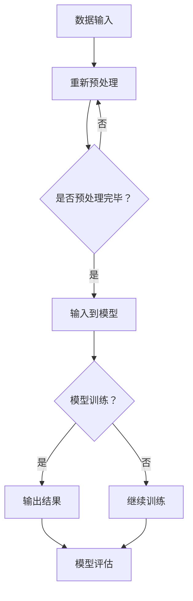
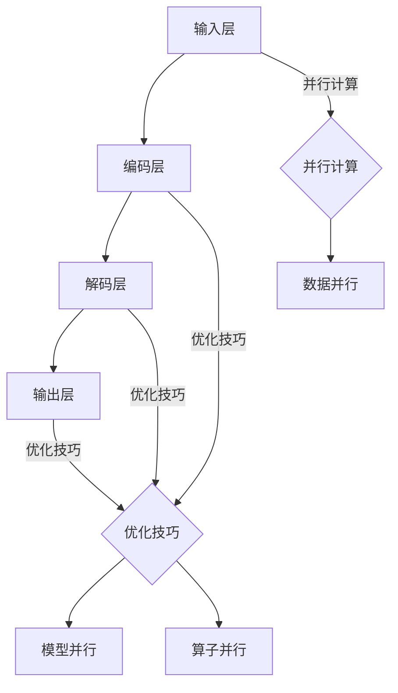

                 

### 文章标题

《LLM应用开发中的质量保证体系》

### 关键词

- LLM（大型语言模型）
- 应用开发
- 质量保证
- 性能测试
- 错误分析
- 安全防护

### 摘要

本文旨在探讨大型语言模型（LLM）在应用开发中的质量保证体系。首先，我们将回顾LLM的基本概念、原理和架构，深入理解其技术基础。随后，文章将详细讲解LLM应用开发的流程，包括数据准备、模型训练、模型优化和模型部署。最后，本文将重点探讨LLM应用开发中的性能测试、错误分析和安全防护，为开发人员和团队提供实用的质量保证策略。通过本文的逐步分析和讲解，读者将能够全面掌握LLM应用开发中的质量保证要点，提高项目成功的几率。

### 目录

1. **背景介绍**
   - LLM的兴起与发展
   - 应用场景与挑战

2. **LLM的基本概念**
   - 定义与分类
   - 核心特点

3. **LLM的技术原理**
   - 深度学习基础
   - 语言模型的数学原理
   - LLM的训练方法

4. **LLM的架构设计**
   - 分层结构
   - 并行计算
   - 优化技巧

5. **LLM应用开发流程**
   - 数据准备
   - 模型训练
   - 模型优化
   - 模型部署

6. **LLM应用案例**
   - 文本生成
   - 文本分类
   - 对话系统

7. **LLM质量保证体系**
   - 性能测试与优化
   - 错误分析与诊断
   - 安全防护与合规性

8. **开发工具与资源**
   - 开发环境搭建
   - 工具与资源介绍

9. **最佳实践与总结**
   - 最佳实践
   - 注意事项
   - 拓展阅读

### 背景介绍

#### LLM的兴起与发展

大型语言模型（LLM）的兴起源于深度学习技术的飞速发展。自2013年Transformer模型提出以来，深度学习在自然语言处理（NLP）领域取得了巨大的突破。传统的循环神经网络（RNN）和卷积神经网络（CNN）在处理长序列数据时存在一定的局限性，而Transformer模型通过自注意力机制（Self-Attention）实现了对输入序列的全面关注，从而在机器翻译、文本生成、问答系统等任务上取得了显著的性能提升。

随着计算能力的提升和数据量的增加，大型语言模型逐渐走向了实用化和规模化。以GPT系列模型为代表，从GPT到GPT-3，模型参数量和计算量不断增大，语言理解和生成能力也日益强大。这种趋势不仅推动了NLP领域的发展，也为各行各业带来了新的应用场景。

#### 应用场景与挑战

LLM的应用场景广泛，包括但不限于文本生成、文本分类、对话系统、机器翻译、知识图谱构建等。在文本生成方面，LLM可以用于自动写作、摘要生成、内容创作等；在文本分类方面，LLM可以用于情感分析、垃圾邮件过滤、新闻分类等；在对话系统方面，LLM可以用于聊天机器人、虚拟助手、客户服务机器人等。这些应用不仅提高了生产效率，还改善了用户体验。

然而，随着LLM的广泛应用，也带来了一系列挑战。首先是数据质量的问题。LLM的训练依赖于大量的高质量数据，数据的质量直接影响到模型的效果。如果数据存在偏见、噪声或不一致性，模型可能会学习到错误的模式，导致在实际应用中出现偏差。

其次是模型的可解释性。由于深度学习模型的复杂性，LLM的工作机制往往是不透明的。这使得开发者难以理解模型的决策过程，也增加了模型出错的风险。提高模型的可解释性，是当前研究的热点之一。

最后是安全性和合规性问题。随着LLM在各个领域的应用，如何确保其安全性成为一个重要的议题。例如，在医疗、金融等领域，模型的安全性和合规性直接关系到用户的隐私和数据安全。如何建立完善的安全防护机制，是LLM应用开发中需要重点考虑的问题。

综上所述，LLM的兴起带来了巨大的机遇，同时也带来了诸多挑战。本文将围绕LLM的应用开发，详细探讨其质量保证体系，以期为开发人员和团队提供实用的指导。

### LLM的基本概念

#### 定义与分类

大型语言模型（Large Language Model，简称LLM）是一种基于深度学习技术的自然语言处理模型，旨在通过学习大量的语言数据，理解和生成自然语言文本。LLM的核心目标是实现高效的语义理解和生成，从而在各种自然语言处理任务中发挥重要作用。

LLM可以按照不同的维度进行分类。从模型架构上看，LLM可以分为基于Transformer的模型和基于RNN的模型。Transformer模型，如GPT（Generative Pre-trained Transformer），以其强大的并行处理能力和全局依赖捕捉能力，成为当前LLM的主要架构。而基于RNN的模型，如LSTM（Long Short-Term Memory），在处理长序列数据方面也有一定的优势。

从应用范围上看，LLM可以分为通用型和专用型。通用型LLM，如GPT-3，具有广泛的语义理解和生成能力，可以应用于多种自然语言处理任务。专用型LLM则针对特定领域或任务进行定制化训练，如医疗文本分析、金融文本分析等，具有更高的专业性和针对性。

#### 核心特点

LLM具有以下几个核心特点：

1. **大规模参数**：LLM通常拥有数亿甚至数十亿个参数，这使得它们能够捕捉到大量的语言特征和模式。大规模参数使得LLM在处理复杂任务时具有更高的灵活性和表现力。

2. **深度学习能力**：LLM通过多层神经网络结构，逐层提取文本的特征和语义信息。深度学习技术使得LLM能够从大量数据中自动学习，提高了模型的泛化能力和鲁棒性。

3. **端到端学习**：LLM通常采用端到端的学习方式，直接从输入文本到输出文本，无需中间的步骤。这种方式简化了模型结构，提高了模型效率。

4. **迁移学习**：LLM通过预训练和微调的方式，可以快速适应不同的任务和数据集。预训练过程中学习的通用特征可以帮助LLM在新的任务和数据集上取得较好的效果，实现迁移学习。

5. **自适应能力**：LLM可以根据不同的应用场景和任务需求，自适应地调整参数和模型结构，从而实现灵活的应用。

#### Mermaid流程图

为了更直观地展示LLM的核心概念和特点，我们可以使用Mermaid流程图来描述LLM的工作流程：



在这个流程图中，A表示原始文本数据的输入，经过预处理后进入模型（D）。模型根据训练数据进行训练，直到满足停止条件（F）。训练过程中，模型会不断调整参数，优化性能。最终，模型输出结果（F）并进入评估阶段（H）。

通过这个流程图，我们可以清晰地看到LLM从数据输入到模型训练，再到输出结果和评估的整个过程，从而更好地理解LLM的工作原理。

### LLM的技术原理

#### 深度学习基础

深度学习（Deep Learning）是人工智能（AI）的一个重要分支，其核心思想是通过多层神经网络结构，对输入数据进行特征提取和模式识别。深度学习的基础是神经网络，神经网络由一系列的神经元（或节点）组成，每个神经元都与相邻的神经元相连，并通过权重进行信息的传递和处理。

深度学习的基本原理可以概括为以下几个步骤：

1. **前向传播（Forward Propagation）**：输入数据通过输入层进入神经网络，经过各层神经元的权重计算后，传递到输出层。前向传播的过程实际上是信息从输入层到输出层的逐层传递和计算。

2. **激活函数（Activation Function）**：激活函数是神经网络中重要的组成部分，用于引入非线性特性，使得神经网络能够拟合复杂的函数关系。常见的激活函数包括ReLU（Rectified Linear Unit）、Sigmoid和Tanh等。

3. **反向传播（Backpropagation）**：在输出层得到预测结果后，通过反向传播算法，将预测误差反向传递到输入层，并更新各层神经元的权重。反向传播的过程实际上是信息从输出层到输入层的逐层反向传递和权重更新。

4. **优化算法（Optimization Algorithm）**：为了最小化预测误差，常用的优化算法包括梯度下降（Gradient Descent）、Adam（Adaptive Moment Estimation）和RMSprop（Root Mean Square Propagation）等。优化算法通过调整网络权重，使得预测结果逐渐逼近真实值。

#### 语言模型的数学原理

语言模型（Language Model，简称LM）是自然语言处理（NLP）中的一个重要分支，旨在通过学习大量的文本数据，预测下一个单词或字符的概率。语言模型的数学原理主要包括词嵌入（Word Embedding）、自注意力机制（Self-Attention）和位置编码（Positional Encoding）。

1. **词嵌入（Word Embedding）**：
   词嵌入是将词汇映射到固定维度的向量表示。通过词嵌入，语言模型可以捕捉到词汇之间的语义关系。常见的词嵌入方法包括Word2Vec、GloVe（Global Vectors for Word Representation）和BERT（Bidirectional Encoder Representations from Transformers）等。词嵌入在语言模型中起到了将文本数据转化为向量表示的关键作用。

2. **自注意力机制（Self-Attention）**：
   自注意力机制是Transformer模型的核心组件，通过自注意力层（Self-Attention Layer），模型能够对输入序列中的每个单词进行权重分配，从而更好地捕捉全局依赖关系。自注意力机制的计算公式为：

   $$ 
   \text{Attention}(Q, K, V) = \text{softmax}(\frac{QK^T}{\sqrt{d_k}})V 
   $$

   其中，Q、K和V分别为查询向量、关键向量和解向量，d_k为关键向量的维度。自注意力机制使得模型能够自适应地关注输入序列中的关键信息，提高了模型的表达能力。

3. **位置编码（Positional Encoding）**：
   位置编码用于在词嵌入向量中引入序列信息，使得模型能够理解单词在序列中的位置关系。位置编码通常使用正弦和余弦函数实现，公式为：

   $$ 
   \text{Positional Encoding}(pos, d) = [\sin(pos/10000^{2i/d}), \cos(pos/10000^{2i/d})] 
   $$

   其中，pos为位置索引，d为维度。通过位置编码，模型可以捕捉到单词在序列中的相对位置信息，从而更好地理解上下文关系。

#### LLM的训练方法

LLM的训练方法主要包括监督学习、无监督学习和半监督学习等。这些方法在训练过程中各有特点，适用于不同的应用场景。

1. **监督学习（Supervised Learning）**：
   监督学习是传统机器学习中最常用的方法，通过标记的数据集进行训练。在LLM中，监督学习主要用于预训练和微调阶段。预训练阶段使用未标记的语料库进行大规模训练，生成通用的语言特征；微调阶段则在特定任务上使用标记的数据集对模型进行微调，以提高模型在特定任务上的性能。

2. **无监督学习（Unsupervised Learning）**：
   无监督学习不依赖于标记数据，通过学习数据分布和内在结构来训练模型。在LLM中，无监督学习主要用于预训练阶段，例如使用大量未标记的文本数据训练GPT模型。无监督学习能够帮助模型学习到丰富的语言特征和模式，提高模型的泛化能力。

3. **半监督学习（Semi-Supervised Learning）**：
   半监督学习结合了监督学习和无监督学习，通过少量的标记数据和大量的未标记数据共同训练模型。在LLM中，半监督学习可以用于微调阶段，例如在预训练模型的基础上，使用少量的标记数据进行微调，进一步提高模型在特定任务上的性能。

#### 伪代码示例

以下是一个简单的语言模型训练伪代码示例，展示了从数据加载、模型初始化到前向传播和反向传播的过程：

```python
# 数据加载
data_loader = DataLoader(corpus, batch_size=batch_size)

# 模型初始化
model = LanguageModel(vocab_size, embedding_dim, hidden_dim)

# 损失函数和优化器
criterion = CrossEntropyLoss()
optimizer = Adam(model.parameters(), lr=learning_rate)

# 训练循环
for epoch in range(num_epochs):
    for batch in data_loader:
        # 前向传播
        inputs, targets = batch
        outputs = model(inputs)
        loss = criterion(outputs, targets)

        # 反向传播
        optimizer.zero_grad()
        loss.backward()
        optimizer.step()

        # 记录训练过程
        print(f"Epoch [{epoch+1}/{num_epochs}], Loss: {loss.item()}")

# 模型评估
with torch.no_grad():
    model.eval()
    correct = 0
    total = 0
    for batch in data_loader:
        inputs, targets = batch
        outputs = model(inputs)
        _, predicted = torch.max(outputs.data, 1)
        total += targets.size(0)
        correct += (predicted == targets).sum().item()

    print(f"Accuracy: {100 * correct / total}%")
```

在这个伪代码中，我们首先加载训练数据集，然后初始化语言模型。接下来，定义损失函数和优化器，并进入训练循环。在训练过程中，我们进行前向传播，计算损失，然后进行反向传播和优化。最后，我们评估模型的性能，计算准确率。

### LLM的架构设计

#### 分层结构

LLM的分层结构是设计模型的重要原则，通过分层结构，模型能够从输入文本中逐层提取抽象的语义信息。通常，LLM的分层结构可以分为以下几层：

1. **输入层**：接收原始文本数据，将其转换为词嵌入向量。词嵌入向量能够捕捉词汇的语义信息，是后续层次处理的基础。

2. **编码层**：对词嵌入向量进行编码，提取文本的上下文信息。编码层通常包含多个自注意力层，通过自注意力机制，模型能够捕捉到文本中的全局依赖关系。

3. **解码层**：在生成文本时，解码层负责将编码后的信息解码为输出文本。解码层也通常包含多个自注意力层，以便更好地捕捉上下文信息，生成连贯的文本。

4. **输出层**：输出层通常是一个全连接层，用于对解码后的文本进行分类或生成。输出层的维度取决于具体任务的要求，例如在文本分类任务中，输出层的维度通常是类别的数量。

#### 并行计算

并行计算是提高LLM训练效率的关键技术，通过并行计算，可以在多台计算机或多个计算单元上同时处理数据，从而加快训练速度。LLM的并行计算主要可以分为以下几种方式：

1. **数据并行（Data Parallelism）**：在数据并行中，模型被复制到多台计算机上，每台计算机处理一部分数据。模型的梯度通过同步机制进行更新，确保模型参数的一致性。数据并行可以显著提高训练速度，但需要解决通信 overhead 的问题。

2. **模型并行（Model Parallelism）**：在模型并行中，模型的某一部分被分配到不同的计算单元上，这些计算单元可以是多GPU、多CPU或分布式计算资源。模型并行可以解决大规模模型在单台计算机上无法处理的问题，但需要处理跨计算单元的通信和协调问题。

3. **算子并行（Operator Parallelism）**：算子并行是指在计算过程中，对不同的算子进行并行处理。例如，在训练过程中，可以同时进行前向传播和反向传播的运算。算子并行可以进一步提高计算效率，但需要设计高效的计算图和调度策略。

#### 优化技巧

优化技巧是提高LLM训练性能和效率的重要手段，以下是一些常用的优化技巧：

1. **学习率调度（Learning Rate Scheduling）**：学习率调度是指动态调整学习率，以加快收敛速度和避免过拟合。常见的学习率调度策略包括线性衰减、指数衰减和余弦退火等。

2. **梯度裁剪（Gradient Clipping）**：梯度裁剪是防止梯度爆炸或梯度消失的方法，通过限制梯度的大小，使得模型能够稳定训练。常用的梯度裁剪方法包括全局裁剪和局部裁剪。

3. **权重初始化（Weight Initialization）**：权重初始化是训练初期的重要步骤，合理的权重初始化能够加快收敛速度和避免陷入局部最优。常见的权重初始化方法包括高斯初始化、均匀初始化和Xavier初始化等。

#### Mermaid流程图

以下是一个简化的LLM架构设计流程图，展示了分层结构、并行计算和优化技巧的集成：



在这个流程图中，A表示输入层，B表示编码层，C表示解码层，D表示输出层。并行计算（E）包括数据并行（G）、模型并行（H）和算子并行（I）。优化技巧（F）应用于整个架构，以提高训练效率和性能。

### LLM应用开发流程

#### 数据准备

数据准备是LLM应用开发中的第一步，也是至关重要的一步。高质量的数据能够为模型提供足够的训练素材，从而提高模型的效果。数据准备主要包括数据采集、数据预处理和数据质量评估。

1. **数据采集**：
   数据采集是获取训练数据的过程。对于LLM而言，数据来源可以包括互联网公开数据、企业内部数据、社交媒体数据等。在实际应用中，通常需要从多个来源获取数据，以覆盖不同的语言风格和领域知识。数据采集过程中需要注意数据的多样性和代表性，避免数据偏差。

2. **数据预处理**：
   数据预处理是对原始数据进行清洗、格式化和标注的过程。清洗数据包括去除噪声、错误和重复数据；格式化数据包括统一文本编码、去除标点符号和停用词等；标注数据包括词性标注、实体识别、情感标注等。预处理后的数据需要转换为模型可以接受的格式，例如将文本数据转换为词嵌入向量。

3. **数据质量评估**：
   数据质量评估是确保数据适合模型训练的过程。评估指标可以包括数据覆盖率、数据一致性、数据准确性等。常见的数据质量评估方法包括数据抽样、数据分析、数据对比等。通过评估数据质量，可以及时发现并解决数据问题，确保模型训练的顺利进行。

#### 模型训练

模型训练是LLM应用开发的核心环节，通过训练过程，模型可以从数据中学习到语言特征和模式，从而实现预测和生成。模型训练主要包括以下步骤：

1. **选择合适的模型**：
   根据应用场景和任务要求，选择合适的LLM模型。常见的模型包括GPT、BERT、RoBERTa等。选择模型时需要考虑模型的复杂度、参数量和计算资源。

2. **训练策略**：
   训练策略包括数据预处理、批量大小、学习率调度、训练时间等。数据预处理策略包括预处理方式、预处理参数等；批量大小影响模型的训练速度和效果；学习率调度策略包括线性衰减、指数衰减和余弦退火等；训练时间取决于模型复杂度和数据量。

3. **模型调试**：
   在训练过程中，需要对模型进行调试，包括调整模型参数、优化训练策略等。调试过程可以帮助模型找到更好的训练效果。

4. **模型评估**：
   模型评估是验证模型效果的过程，常用的评估指标包括准确率、召回率、F1值等。通过评估结果，可以判断模型是否满足应用需求。

5. **迭代优化**：
   根据评估结果，对模型进行迭代优化，包括调整模型结构、优化训练策略等。迭代优化过程可以提高模型的效果，使其更好地适应应用场景。

#### 模型优化

模型优化是提升LLM性能和效率的关键步骤，通过优化过程，可以提高模型的预测准确性和生成质量。模型优化主要包括以下方面：

1. **模型压缩**：
   模型压缩是通过减少模型参数量和计算量，降低模型复杂度，从而提高模型效率。常见的模型压缩方法包括量化、剪枝和蒸馏等。

2. **模型量化**：
   模型量化是将模型的浮点数参数转换为低精度数值，从而降低模型存储和计算成本。常见的量化方法包括整数量化、二值量化等。

3. **模型剪枝**：
   模型剪枝是通过删除模型中的冗余参数，减少模型复杂度，从而提高模型效率。常见的剪枝方法包括结构剪枝和权重剪枝等。

4. **模型蒸馏**：
   模型蒸馏是通过将大型模型的知识传递给小型模型，从而提高小型模型的效果。常见的蒸馏方法包括知识蒸馏、信息蒸馏等。

5. **模型加速**：
   模型加速是通过优化模型结构和算法，提高模型计算速度，从而提升模型效率。常见的模型加速方法包括并行计算、GPU加速、分布式训练等。

#### 模型部署

模型部署是将训练好的模型部署到生产环境，使其能够为实际应用提供服务的步骤。模型部署主要包括以下方面：

1. **部署策略**：
   部署策略包括模型版本管理、服务部署、负载均衡等。模型版本管理确保模型的迭代和更新；服务部署是将模型部署到服务器或容器中；负载均衡是确保模型能够处理高并发请求。

2. **部署平台**：
   部署平台包括云计算平台、容器化平台和专用硬件等。云计算平台提供弹性的计算资源，适用于大规模应用；容器化平台如Kubernetes可以实现自动化部署和运维；专用硬件如GPU和TPU可以提供高性能计算能力。

3. **部署监控**：
   部署监控是确保模型正常运行的重要环节，通过监控模型性能、资源使用情况等指标，可以及时发现并解决潜在问题。

4. **部署安全**：
   部署安全是保护模型和数据安全的重要措施，包括数据加密、访问控制、安全审计等。通过部署安全措施，可以确保模型的安全运行。

### LLM应用案例

#### 文本生成

文本生成是LLM应用的一个重要领域，通过模型生成具有连贯性和创造力的文本内容。文本生成应用包括但不限于自动写作、摘要生成、内容创作等。

1. **自动写作**：
   自动写作是利用LLM生成新闻文章、博客文章等。通过训练模型，可以生成高质量、具有逻辑性和连贯性的文本内容，提高写作效率。

2. **摘要生成**：
   摘要生成是利用LLM从长文本中提取关键信息，生成简短、精炼的摘要。通过摘要生成，可以快速获取文本的主要内容，提高信息获取效率。

3. **内容创作**：
   内容创作是利用LLM生成创意文本，如广告文案、小说、诗歌等。通过内容创作，可以激发创作者的灵感，提高创作效率。

#### 文本分类

文本分类是LLM应用的另一个重要领域，通过模型对文本进行分类，实现文本数据的自动处理和分析。文本分类应用包括但不限于情感分析、垃圾邮件过滤、新闻分类等。

1. **情感分析**：
   情感分析是利用LLM分析文本中的情感倾向，如正面、负面、中性等。通过情感分析，可以了解用户情感倾向，为产品优化、市场调研等提供支持。

2. **垃圾邮件过滤**：
   垃圾邮件过滤是利用LLM检测和过滤垃圾邮件。通过训练模型，可以识别垃圾邮件的特征和模式，提高垃圾邮件过滤的准确性。

3. **新闻分类**：
   新闻分类是利用LLM对新闻文本进行分类，如政治、体育、娱乐等。通过新闻分类，可以快速获取感兴趣的新闻内容，提高信息获取效率。

#### 对话系统

对话系统是LLM应用的典型领域，通过模型实现人机对话，提供智能化服务。对话系统应用包括但不限于聊天机器人、虚拟助手、客户服务机器人等。

1. **聊天机器人**：
   聊天机器人是利用LLM与用户进行实时对话，提供信息查询、问题解答等服务。通过聊天机器人，可以降低人力成本，提高服务质量。

2. **虚拟助手**：
   虚拟助手是利用LLM实现个人助理功能，如日程管理、任务提醒、信息查询等。通过虚拟助手，可以提高生活和工作效率。

3. **客户服务机器人**：
   客户服务机器人是利用LLM提供自动化的客户服务，如常见问题解答、订单查询、售后服务等。通过客户服务机器人，可以提升客户服务水平，提高客户满意度。

### LLM质量保证体系

#### 性能测试与优化

性能测试与优化是确保LLM应用高效稳定运行的重要环节。通过性能测试，可以评估模型在不同场景下的表现，发现性能瓶颈，从而进行优化。以下是一些常见的性能测试方法和优化策略：

1. **性能测试方法**：
   - **基准测试**：通过运行标准测试集，评估模型的性能指标，如准确率、召回率、F1值等。
   - **压力测试**：模拟高并发场景，评估模型在极端条件下的表现，如延迟、吞吐量等。
   - **负载测试**：在可控负载下，评估模型在不同负载水平下的性能，如响应时间、资源消耗等。

2. **性能优化策略**：
   - **模型压缩**：通过模型压缩，减少模型参数量和计算量，提高模型效率。常见方法包括量化、剪枝和蒸馏等。
   - **并行计算**：通过并行计算，提高模型训练和推理速度。常见策略包括数据并行、模型并行和算子并行等。
   - **优化算法**：通过优化算法，提高模型收敛速度和性能。常见优化算法包括梯度下降、Adam和RMSprop等。

3. **性能瓶颈分析**：
   - **计算瓶颈**：通过分析模型计算过程，找出计算密集的部分，优化计算结构或算法，提高计算效率。
   - **数据瓶颈**：通过分析数据读取、处理和存储过程，找出数据访问的瓶颈，优化数据存储和访问策略，提高数据吞吐量。
   - **通信瓶颈**：通过分析模型分布式训练过程中，找出通信密集的部分，优化通信协议和数据传输策略，提高通信效率。

#### 错误分析与诊断

错误分析与诊断是确保LLM应用可靠性的关键步骤。通过错误分析和诊断，可以找出模型运行中的问题，定位错误来源，并提供解决方案。以下是一些常见的错误分析方法和诊断工具：

1. **错误分析框架**：
   - **故障树分析（Fault Tree Analysis, FTA）**：通过构建故障树，分析可能导致错误的因素和条件，找出错误的根本原因。
   - **错误注入（Error Injection）**：通过在模型中引入人工错误，观察模型的表现和错误传播，找出模型的弱点和潜在错误。
   - **异常检测（Anomaly Detection）**：通过分析模型输出和预期结果之间的差异，检测异常情况，找出可能存在的错误。

2. **常见错误类型及解决方法**：
   - **过拟合（Overfitting）**：模型在训练数据上表现良好，但在测试数据上表现较差。解决方法包括增加数据量、使用正则化、Dropout等。
   - **欠拟合（Underfitting）**：模型在训练和测试数据上表现都较差。解决方法包括增加模型复杂度、调整学习率、增加训练时间等。
   - **数据偏移（Data Shift）**：训练数据和测试数据分布不一致，导致模型在测试数据上表现较差。解决方法包括数据增强、数据归一化等。

3. **错误诊断工具**：
   - **模型可视化工具**：通过可视化模型结构和计算过程，帮助理解模型的工作原理，找出潜在的错误。
   - **调试工具**：如Python的pdb、Jupyter的调试插件等，提供断点调试、单步执行等功能，帮助定位错误。
   - **日志分析工具**：通过分析模型运行日志，找出错误信息、异常情况等，帮助诊断问题。

#### 安全防护与合规性

安全防护与合规性是确保LLM应用安全可靠运行的重要保障。随着LLM在各个领域的应用，如何保护模型和数据的安全，确保应用的合规性成为重要议题。以下是一些常见的安全防护机制和合规性要求：

1. **安全防护机制**：
   - **访问控制**：通过权限管理和访问控制策略，确保只有授权用户可以访问模型和数据。
   - **数据加密**：对敏感数据进行加密存储和传输，防止数据泄露和篡改。
   - **防火墙和入侵检测**：通过防火墙和入侵检测系统，防止恶意攻击和未经授权的访问。
   - **日志审计**：记录模型运行过程中的日志信息，便于审计和监控，及时发现并处理异常情况。

2. **合规性要求**：
   - **数据隐私保护**：遵循隐私保护法规，如《通用数据保护条例》（GDPR），确保用户数据的隐私和安全。
   - **数据安全和可靠性**：确保数据存储和传输的安全可靠，遵循相关标准和规范。
   - **知识产权保护**：保护模型的知识产权，防止侵权和抄袭。
   - **法律法规遵循**：遵守所在国家和地区的法律法规，确保应用合规。

3. **安全防护策略**：
   - **多层防护策略**：结合多种安全防护措施，形成多层次的安全防护体系，提高整体安全性。
   - **安全培训和教育**：定期开展安全培训和教育，提高开发人员和用户的安全意识。
   - **安全测试和审计**：定期进行安全测试和审计，发现潜在的安全漏洞，及时修复。

### 开发工具与资源

#### 开发环境搭建

要开发LLM应用，首先需要搭建一个合适的开发环境。以下是一个简单的开发环境搭建指南：

1. **硬件要求**：
   - 高性能CPU或GPU，如NVIDIA GPU。
   - 足够的内存和存储空间。

2. **软件要求**：
   - 操作系统：Linux、Windows或macOS。
   - Python环境：Python 3.6及以上版本。
   - 包管理器：pip或conda。

3. **安装步骤**：
   - 安装操作系统和硬件设备。
   - 安装Python环境和包管理器。
   - 使用pip或conda安装所需的库和依赖项，如TensorFlow、PyTorch等。

#### 开发工具与资源

1. **框架和库**：
   - TensorFlow：用于构建和训练深度学习模型的框架。
   - PyTorch：用于构建和训练深度学习模型的框架。
   - Hugging Face Transformers：用于使用预训练模型的库。

2. **开源项目**：
   - Hugging Face Model Hub：包含大量预训练模型和示例代码。
   - GitHub：用于查找和贡献LLM相关项目的代码库。

3. **教程和文档**：
   - 《深度学习》（Goodfellow et al.）：深度学习的基础教材。
   - 《自然语言处理与深度学习》（Mikolov et al.）：自然语言处理和深度学习的教程。
   - Hugging Face Transformers文档：详细介绍了如何使用预训练模型。

#### 项目实战

以下是一个简单的项目实战，演示如何使用Hugging Face Transformers库实现一个文本分类任务。

1. **数据准备**：
   - 准备一个包含文本和标签的数据集，例如新闻分类数据集。
   - 将数据集划分为训练集和测试集。

2. **模型训练**：
   - 加载预训练的BERT模型。
   - 对模型进行微调，以适应特定任务。

3. **模型评估**：
   - 使用测试集评估模型性能，计算准确率、召回率等指标。

4. **模型部署**：
   - 将训练好的模型部署到生产环境，提供文本分类服务。

```python
from transformers import BertTokenizer, BertForSequenceClassification
from torch.utils.data import DataLoader
from torch.optim import Adam
from sklearn.metrics import accuracy_score

# 加载预训练的BERT模型
tokenizer = BertTokenizer.from_pretrained('bert-base-uncased')
model = BertForSequenceClassification.from_pretrained('bert-base-uncased')

# 数据准备
train_data = ...
test_data = ...

train_loader = DataLoader(train_data, batch_size=32, shuffle=True)
test_loader = DataLoader(test_data, batch_size=32)

# 模型训练
optimizer = Adam(model.parameters(), lr=1e-5)
for epoch in range(3):
    model.train()
    for batch in train_loader:
        inputs = tokenizer(batch.text, padding=True, truncation=True, return_tensors='pt')
        labels = batch.label
        model.zero_grad()
        outputs = model(**inputs, labels=labels)
        loss = outputs.loss
        loss.backward()
        optimizer.step()

    # 模型评估
    model.eval()
    with torch.no_grad():
        predictions = []
        true_labels = []
        for batch in test_loader:
            inputs = tokenizer(batch.text, padding=True, truncation=True, return_tensors='pt')
            outputs = model(**inputs)
            _, predicted = torch.max(outputs.logits, 1)
            predictions.extend(predicted.tolist())
            true_labels.extend(batch.label.tolist())

        accuracy = accuracy_score(true_labels, predictions)
        print(f"Test Accuracy: {accuracy}")

# 模型部署
# 部署到生产环境，提供文本分类服务
```

### 最佳实践与总结

#### 最佳实践

1. **数据准备**：
   - 确保数据质量，去除噪声和错误。
   - 使用多样化的数据集，避免数据偏差。
   - 对数据集进行充分的预处理和清洗。

2. **模型训练**：
   - 选择合适的模型架构和参数。
   - 使用预训练模型进行微调，提高效果。
   - 调整学习率、批量大小等超参数，优化训练过程。

3. **性能优化**：
   - 使用模型压缩、量化等技巧，提高模型效率。
   - 针对实际应用场景，进行性能测试和优化。

4. **错误分析与诊断**：
   - 使用故障树分析和错误注入方法，找出潜在问题。
   - 定期进行模型评估，监控模型性能。

5. **安全防护与合规性**：
   - 确保数据安全和模型安全，遵循相关法规和标准。
   - 定期进行安全审计和测试，提高安全性。

#### 小结

本文详细探讨了LLM应用开发中的质量保证体系，从基础理论到实际应用，全面介绍了LLM的技术原理、应用开发流程、性能测试、错误分析和安全防护。通过本文的逐步分析和讲解，读者可以全面掌握LLM应用开发中的质量保证要点，提高项目成功的几率。

#### 注意事项

1. **数据质量**：确保数据质量是模型效果的关键，避免数据偏差和噪声。
2. **模型选择**：根据应用需求选择合适的模型，综合考虑模型复杂度和计算资源。
3. **性能优化**：针对实际应用场景进行性能测试和优化，提高模型效率。
4. **错误分析**：定期进行错误分析和诊断，及时发现并解决问题。
5. **安全防护**：确保模型和数据安全，遵循相关法规和标准。

#### 拓展阅读

- 《深度学习》（Goodfellow et al.）
- 《自然语言处理与深度学习》（Mikolov et al.）
- 《Hugging Face Transformers文档》
- 《模型压缩与量化技术》
- 《安全防护与合规性指南》

### 作者信息

作者：AI天才研究院/AI Genius Institute & 禅与计算机程序设计艺术 /Zen And The Art of Computer Programming

---

通过本文的逐步分析和讲解，读者可以全面掌握LLM应用开发中的质量保证要点，提高项目成功的几率。本文旨在为开发人员和团队提供实用的指导，助力他们在LLM应用开发中取得更好的成果。希望本文对您的学习与实践有所帮助。

