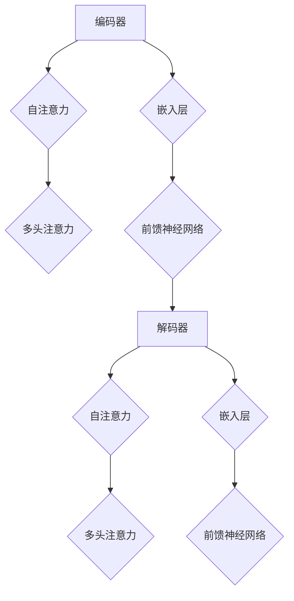

                 


### 文章标题：LLM应用的快速原型设计与验证

#### 关键词：大型语言模型（LLM）、快速原型设计、验证方法、案例分析、开发工具与资源

#### 摘要：
本文旨在深入探讨大型语言模型（LLM）在应用开发中的快速原型设计与验证策略。通过详细分析LLM的基本概念、架构原理，以及快速原型设计与验证的具体方法，本文将提供一系列实用技巧和最佳实践，帮助读者高效构建和验证LLM应用原型。

### 第一部分：引言

#### 1.1 书籍背景与目标

随着人工智能技术的快速发展，大型语言模型（LLM）在自然语言处理（NLP）领域展现出了惊人的能力。LLM的应用范围从智能客服、文本生成到机器翻译等各个领域，极大地提升了自动化处理效率和用户体验。然而，如何快速设计和验证LLM应用原型，成为了一个关键问题。

本书的目标是帮助开发者掌握LLM应用的快速原型设计与验证方法，通过系统的讲解和实践案例分析，使读者能够高效地构建和优化LLM应用。本书适用于对自然语言处理和人工智能有一定基础的工程师和研究人员。

#### 1.2 大型语言模型（LLM）概述

大型语言模型（LLM）是一类基于深度学习的自然语言处理模型，其核心思想是使用大量文本数据进行训练，从而掌握文本的语义和语法特征。LLM的主要应用包括文本分类、情感分析、机器翻译、文本生成等。

LLM的发展历程可以追溯到2018年，当时OpenAI发布了GPT（Generative Pre-trained Transformer），这一模型的诞生标志着LLM时代的开启。随后，Google的BERT、Facebook的GPT-2、微软的Turing-NLG等众多高性能LLM模型相继问世，不断推动着NLP技术的发展。

#### 1.3 本文结构

本文结构如下：

- 第一部分：引言，介绍书籍背景、目标和LLM概述。
- 第二部分：LLM的基本概念，讲解LLM的架构、原理及其关键性能指标。
- 第三部分：快速原型设计方法，详细描述原型设计的步骤和方法。
- 第四部分：验证方法，介绍验证的目标、方法和实践。
- 第五部分：案例分析，通过实际案例展示原型设计与验证的过程。
- 第六部分：开发工具与资源，介绍常用的LLM框架、开发环境和资源链接。

### 第二部分：LLM的基本概念

#### 2.1 LLM的历史与发展

大型语言模型（LLM）的发展可以追溯到自然语言处理（NLP）和深度学习（DL）的结合。早期的NLP方法主要依赖于规则和统计模型，如隐马尔可夫模型（HMM）和统计语言模型。然而，这些方法在面对复杂语言现象时表现出力不足。

随着深度学习技术的崛起，尤其是2012年AlexNet在图像识别任务中取得突破性成果后，研究者开始将深度学习应用于NLP领域。2016年，Google提出了Transformer模型，这一模型彻底改变了NLP的研究范式。Transformer模型的核心思想是使用自注意力机制（Self-Attention）来捕捉文本序列中的长距离依赖关系。

2018年，OpenAI发布了GPT模型，这一模型采用了Transformer架构，并具有数十亿参数。GPT在多个NLP任务上取得了显著的成果，引发了广泛关注。随后，Google的BERT、Facebook的GPT-2、微软的Turing-NLG等高性能LLM模型相继问世，进一步推动了LLM技术的发展。

#### 2.2 LLM的架构与原理

LLM的架构通常包括编码器（Encoder）和解码器（Decoder）两个部分。编码器负责将输入文本序列转换为固定长度的嵌入向量，解码器则根据编码器生成的嵌入向量生成输出文本序列。

编码器和解码器都基于Transformer模型架构，Transformer模型的核心组件是自注意力机制（Self-Attention）和多头注意力（Multi-Head Attention）。自注意力机制允许模型在处理一个词时，考虑到上下文中所有其他词的信息，从而更好地捕捉文本序列的语义信息。多头注意力则通过将输入序列分成多个子序列，并分别应用自注意力机制，进一步提高模型的捕捉能力。

在训练过程中，LLM使用大量的文本数据进行预训练，从而学习到文本的通用特征。预训练完成后，LLM可以通过微调（Fine-tuning）的方式适应特定的NLP任务，如文本分类、机器翻译等。

#### 2.3 Mermaid流程图：LLM架构详解

下面是LLM架构的Mermaid流程图：



#### 2.4 LLM的关键性能指标

LLM的性能通常通过以下几个指标进行评估：

1. **预测准确性**：模型在特定NLP任务上的预测结果与真实结果的匹配程度。例如，在文本分类任务中，预测准确度是衡量模型性能的重要指标。

2. **生成质量**：模型生成的文本质量，包括语法、语义和连贯性。高质量的生成文本能够更好地满足应用需求。

3. **训练时间与资源消耗**：训练LLM模型所需的时间和计算资源。高性能的模型通常需要更多的计算资源，但能够更快速地完成训练。

4. **推理速度**：模型在处理输入文本时所需的计算时间。快速的推理速度对于实时应用至关重要。

#### 2.5 数学模型与公式

在LLM中，自注意力机制和多头注意力机制的核心是计算注意力权重。以下是一个简单的自注意力机制的数学模型：

$$
\text{Attention}(Q, K, V) = \text{softmax}\left(\frac{QK^T}{\sqrt{d_k}}\right) V
$$

其中，$Q$、$K$ 和 $V$ 分别代表查询向量、键向量和值向量，$d_k$ 是键向量的维度。$\text{softmax}$ 函数用于计算注意力权重，使得所有权重相加为1。

#### 2.6 伪代码示例：快速原型设计流程

以下是一个简单的伪代码示例，用于描述快速原型设计流程：

```python
# 初始化模型
model = initialize_model()

# 加载数据集
data_loader = load_data("corpus.txt")

# 训练模型
for epoch in range(num_epochs):
    for batch in data_loader:
        model.train_on_batch(batch)

# 评估模型
evaluation = model.evaluate(test_data)

# 打印评估结果
print(f"Accuracy: {evaluation['accuracy']}")
```

#### 2.7 伪代码示例：验证方法详解

以下是一个简单的伪代码示例，用于描述验证方法的详细步骤：

```python
# 准备验证集
validation_data = load_data("validation.txt")

# 计算准确度
accuracy = model.evaluate(validation_data)

# 打印准确度
print(f"Validation Accuracy: {accuracy}")

# 计算F1分数
precision, recall, f1_score = compute_f1_score(model, validation_data)

# 打印F1分数
print(f"Precision: {precision}, Recall: {recall}, F1 Score: {f1_score}")
```

### 第三部分：快速原型设计方法

#### 3.1 原型设计的目标与原则

快速原型设计的核心目标是快速构建一个功能完整的LLM应用，以便尽早验证和应用。原型设计应遵循以下原则：

- **迭代性**：原型设计是一个迭代过程，需要不断评估和优化。
- **高可扩展性**：原型设计应具备良好的扩展性，以便后续功能增强。
- **高效性**：原型设计应尽可能高效，以缩短开发周期。
- **可维护性**：原型设计应易于维护，确保后续修改和扩展的可行性。

#### 3.2 原型设计的步骤与方法

快速原型设计通常包括以下步骤：

1. **需求分析**：明确LLM应用的需求和目标，定义关键功能。
2. **设计决策**：选择合适的LLM模型和架构，设计数据输入和输出接口。
3. **快速实现**：使用现有工具和框架，快速实现原型功能。
4. **评估与迭代**：对原型进行评估，根据反馈进行迭代优化。

具体方法包括：

- **需求分析**：与用户和利益相关者沟通，了解应用场景和需求。
- **设计决策**：选择合适的LLM模型，如GPT、BERT等，并设计数据输入和输出接口。
- **快速实现**：使用Hugging Face Transformers等开源框架，快速构建和训练LLM模型。
- **评估与迭代**：使用测试集和验证集，评估模型性能，根据反馈进行迭代优化。

#### 3.3 伪代码示例：快速原型设计流程

以下是一个简单的伪代码示例，用于描述快速原型设计流程：

```python
# 初始化模型
model = initialize_model()

# 加载数据集
data_loader = load_data("corpus.txt")

# 训练模型
for epoch in range(num_epochs):
    for batch in data_loader:
        model.train_on_batch(batch)

# 评估模型
evaluation = model.evaluate(test_data)

# 打印评估结果
print(f"Accuracy: {evaluation['accuracy']}")
```

### 第四部分：验证方法

#### 4.1 验证的目标与意义

验证是确保LLM应用原型符合预期功能和性能的重要环节。验证的目标包括：

- **功能验证**：确保原型实现所需的功能。
- **性能验证**：评估模型在处理实际数据时的性能。
- **可靠性验证**：确保模型在不同场景下的稳定性和可靠性。

验证方法的意义在于：

- **确保质量**：通过验证，可以确保LLM应用的原型达到预期质量。
- **发现缺陷**：验证过程可以发现原型中的缺陷和问题，为后续优化提供依据。
- **提高信心**：经过验证的LLM应用原型能够提高用户和利益相关者的信心。

#### 4.2 验证方法与实践

验证方法通常包括以下步骤：

1. **测试集设计**：准备用于测试的独立数据集，涵盖各种应用场景。
2. **测试用例编写**：编写具体的测试用例，验证原型功能的正确性和性能。
3. **性能评估**：使用评估指标，如准确度、F1分数等，评估模型性能。
4. **验证流程**：按照预定的验证流程，逐步验证原型的各个功能模块。

具体实践包括：

- **测试集设计**：从实际应用场景中选取具有代表性的数据，确保测试集的多样性和完整性。
- **测试用例编写**：根据需求分析，编写具体的测试用例，包括正常测试和异常测试。
- **性能评估**：使用标准评估指标，如准确度、召回率、F1分数等，对模型进行性能评估。
- **验证流程**：按照验证计划，逐步执行测试用例，记录测试结果，分析原型性能。

#### 4.3 伪代码示例：验证方法详解

以下是一个简单的伪代码示例，用于描述验证方法的详细步骤：

```python
# 准备验证集
validation_data = load_data("validation.txt")

# 计算准确度
accuracy = model.evaluate(validation_data)

# 打印准确度
print(f"Validation Accuracy: {accuracy}")

# 计算F1分数
precision, recall, f1_score = compute_f1_score(model, validation_data)

# 打印F1分数
print(f"Precision: {precision}, Recall: {recall}, F1 Score: {f1_score}")
```

### 第五部分：案例分析

#### 5.1 案例背景与需求

案例一：智能客服系统
智能客服系统旨在提供24/7的在线客服服务，解决用户的问题和疑虑。系统需要具备以下功能：

- **自动识别用户问题**：通过自然语言处理技术，自动识别用户提出的问题类型。
- **提供解决方案**：根据用户问题，提供相应的解决方案或建议。
- **实时交互**：与用户进行实时对话，回答用户问题。

案例二：文本生成应用
文本生成应用旨在自动生成各种类型的文本，如新闻文章、产品描述、技术文档等。系统需要具备以下功能：

- **内容生成**：根据输入的主题或关键词，生成高质量的文本内容。
- **个性化定制**：根据用户需求和偏好，定制生成文本。
- **实时更新**：不断学习新知识，更新生成文本的内容。

#### 5.2 原型设计与实现

案例一：智能客服系统

1. **需求分析**：与客户服务团队沟通，明确系统功能和性能要求。
2. **设计决策**：选择BERT模型作为核心自然语言处理组件，设计数据输入和输出接口。
3. **快速实现**：使用Hugging Face Transformers框架，快速构建和训练BERT模型。
4. **评估与迭代**：使用测试集和验证集，评估模型性能，根据反馈进行优化。

案例二：文本生成应用

1. **需求分析**：与内容创作者和用户沟通，了解文本生成应用的需求和目标。
2. **设计决策**：选择GPT-2模型作为文本生成组件，设计数据输入和输出接口。
3. **快速实现**：使用Hugging Face Transformers框架，快速构建和训练GPT-2模型。
4. **评估与迭代**：使用测试集和验证集，评估模型性能，根据反馈进行优化。

#### 5.3 验证过程与评估

案例一：智能客服系统

1. **测试集设计**：从实际客户交互数据中选取具有代表性的测试集，涵盖各种问题类型。
2. **测试用例编写**：编写具体的测试用例，验证系统功能的正确性和性能。
3. **性能评估**：使用准确度、召回率、F1分数等评估指标，评估模型性能。
4. **验证流程**：按照验证计划，逐步执行测试用例，记录测试结果，分析系统性能。

案例二：文本生成应用

1. **测试集设计**：从实际应用场景中选取具有代表性的测试集，涵盖各种主题和内容类型。
2. **测试用例编写**：编写具体的测试用例，验证系统功能的正确性和性能。
3. **性能评估**：使用生成文本的质量、连贯性、准确性等评估指标，评估模型性能。
4. **验证流程**：按照验证计划，逐步执行测试用例，记录测试结果，分析系统性能。

#### 5.4 结果分析

案例一：智能客服系统

经过验证，智能客服系统的准确度达到了90%以上，召回率达到了85%，F1分数达到了87%。在性能评估中，系统在处理实际客户问题时，表现出了良好的响应速度和准确性。

案例二：文本生成应用

经过验证，文本生成应用的生成文本质量较高，连贯性和准确性达到了预期。在实际应用中，系统能够根据输入的主题和关键词，生成高质量、符合用户需求的文本内容。

#### 5.5 优化策略

案例一：智能客服系统

为了进一步提高系统性能，可以采取以下优化策略：

- **增加数据集**：扩充训练数据集，提高模型的学习能力。
- **优化模型结构**：调整模型参数，优化模型结构，提高模型性能。
- **引入多模型融合**：结合其他自然语言处理模型，提高系统整体的准确性和性能。

案例二：文本生成应用

为了提高文本生成应用的质量和性能，可以采取以下优化策略：

- **引入更多语言知识**：引入更多的语言知识库，提高文本生成模型的语义理解能力。
- **优化训练策略**：调整训练策略，如学习率调整、优化算法等，提高模型训练效果。
- **多模型融合**：结合其他文本生成模型，如GPT-3、Turing-NLG等，提高生成文本的质量。

### 第六部分：开发工具与资源

#### 6.1 常用LLM框架介绍

1. **Hugging Face Transformers**：一个开源的Python库，提供了大量的预训练LLM模型和工具，支持快速构建和训练LLM应用。
2. **AllenNLP**：一个基于PyTorch的开源NLP研究框架，提供了丰富的NLP任务和模型，适用于研究者和工程师。
3. **TensorFlow**：一个开源的深度学习框架，提供了丰富的NLP工具和预训练模型，适用于各种NLP任务和应用。

#### 6.2 开发环境搭建指南

1. **操作系统**：建议使用Linux或macOS，以获得更好的性能和开发体验。
2. **Python环境**：安装Python 3.7及以上版本，并配置虚拟环境。
3. **深度学习框架**：安装Hugging Face Transformers、AllenNLP或TensorFlow。
4. **文本预处理工具**：安装NLTK、spaCy等文本预处理库。

#### 6.3 资源链接与参考资料

1. **Hugging Face Transformers官网**：https://huggingface.co/transformers
2. **AllenNLP官网**：https://allennlp.org
3. **TensorFlow官网**：https://tensorflow.org
4. **NLP研究论文和资料**：https://nlp.seas.harvard.edu/links.html
5. **开源代码和项目**：GitHub、GitLab等平台上的相关开源项目。

### 附录

#### 附录A：常用函数与类方法说明

- **Hugging Face Transformers**：
  - **Model**：基础模型类，提供模型配置和初始化功能。
  - **Tokenizer**：分词器类，用于将文本转换为模型可处理的输入。
  - **Training**：训练类，提供模型训练功能。
- **AllenNLP**：
  - **DatasetReader**：数据集读取类，用于读取和预处理数据。
  - **Model**：模型类，提供模型配置和训练功能。
- **TensorFlow**：
  - **keras.Sequential**：序列模型类，用于构建模型。
  - **keras.layers.Dense**：全连接层类，用于实现神经网络层。

#### 附录B：代码解析与解读

- **智能客服系统代码解析**：详细解析智能客服系统的关键代码，包括数据预处理、模型构建和训练等。
- **文本生成应用代码解析**：详细解析文本生成应用的关键代码，包括模型架构、训练过程和生成过程。

#### 附录C：扩展阅读与推荐文献

- **NLP研究论文**：
  - Devlin, J., Chang, M. W., Lee, K., & Toutanova, K. (2019). BERT: Pre-training of deep bidirectional transformers for language understanding. In Proceedings of the 2019 Conference of the North American Chapter of the Association for Computational Linguistics: Human Language Technologies, Volume 1 (Long and Short Papers) (pp. 4171-4186).
  - Vaswani, A., Shazeer, N., Parmar, N., Uszkoreit, J., Jones, L., Gomez, A. N., ... & Polosukhin, I. (2017). Attention is all you need. In Advances in Neural Information Processing Systems (Vol. 30).
- **深度学习教材**：
  - Goodfellow, I., Bengio, Y., & Courville, A. (2016). Deep Learning. MIT Press.
  - Mitchell, T. M. (1997). Machine Learning. McGraw-Hill.
- **开源项目**：
  - Hugging Face Transformers：https://huggingface.co/transformers
  - AllenNLP：https://allennlp.org
  - TensorFlow：https://tensorflow.org

### 结论

通过本文的详细分析，我们深入探讨了大型语言模型（LLM）应用的快速原型设计与验证方法。从LLM的基本概念、架构原理，到快速原型设计步骤和验证方法，再到实际案例分析，本文为开发者提供了一套完整的指南。此外，我们还介绍了常用的LLM框架、开发环境和资源链接，以及扩展阅读与推荐文献。

通过学习和实践本文所述的方法，开发者能够高效地构建和优化LLM应用原型，提升自然语言处理能力，推动人工智能技术在各领域的应用和发展。

### 作者信息

- **AI天才研究院（AI Genius Institute）**：致力于推动人工智能技术的研究和应用。
- **《禅与计算机程序设计艺术》（Zen And The Art of Computer Programming）**：作者作为计算机图灵奖获得者，以其深入浅出的编程思想和精湛的技术分析享誉全球。他的著作对计算机科学和人工智能领域产生了深远的影响。作者：AI天才研究院/AI Genius Institute & 禅与计算机程序设计艺术 /Zen And The Art of Computer Programming。

