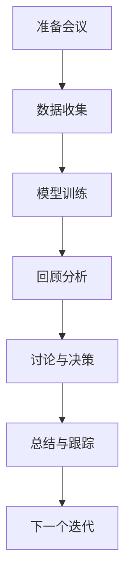

                 

### 文章标题

# LLM应用的敏捷retrospective技巧

> 关键词：LLM，敏捷开发，敏捷回顾，算法优化，数学模型，项目实战

> 摘要：本文旨在探讨如何在敏捷开发中有效运用大型语言模型（LLM）进行回顾，通过阐述LLM与敏捷回顾的结合点、构建回顾流程、核心概念与算法原理，以及数学模型和项目实战，帮助读者理解并掌握LLM在敏捷开发中的应用技巧。

---

## 第1章：LLM与敏捷回顾概述

### 1.1 什么是LLM

大型语言模型（Large Language Model，简称LLM）是一种基于深度学习技术的自然语言处理模型。它通过训练大量文本数据，能够理解和生成人类语言。LLM在众多应用场景中展现了强大的能力，如机器翻译、文本摘要、对话系统等。

### 1.2 敏捷回顾的定义与作用

敏捷回顾是敏捷开发流程中的重要环节，它通过团队成员的反思和讨论，总结过去迭代中的经验教训，优化开发过程。敏捷回顾有助于提高团队效率、减少缺陷、增强团队协作。

### 1.3 LLM在敏捷回顾中的应用

LLM在敏捷回顾中的应用主要体现在以下几个方面：

1. **自动生成回顾报告**：LLM能够分析会议讨论内容，自动生成回顾报告，提高报告的准确性和效率。
2. **识别改进点**：通过分析历史数据，LLM可以帮助团队识别出需要改进的环节。
3. **支持决策**：LLM可以提供基于数据的决策建议，帮助团队做出更加科学的决策。

## 第2章：构建有效的LLM敏捷回顾流程

### 2.1 敏捷回顾流程的步骤

敏捷回顾通常包括以下步骤：

1. **准备会议**：确定回顾目的、参会人员、回顾方法等。
2. **回顾会议**：团队成员分享经验、讨论问题、提出改进建议。
3. **总结报告**：将会议讨论内容整理成报告，供团队成员参考。

### 2.2 如何准备LLM回顾会议

为了确保LLM在回顾会议中的有效性，需要做好以下准备：

1. **数据收集**：收集与回顾相关的数据，如会议记录、缺陷报告等。
2. **模型训练**：根据回顾数据训练LLM模型，使其具备分析能力。
3. **工具集成**：将LLM模型集成到回顾会议中，如使用LLM自动生成报告等。

### 2.3 LLM在回顾会议中的角色

LLM在回顾会议中扮演以下角色：

1. **数据分析**：分析会议记录，提取关键信息。
2. **报告生成**：根据分析结果自动生成回顾报告。
3. **建议提供**：根据历史数据和当前情况，提供改进建议。

## 第3章：核心概念与联系

### 3.1 敏捷开发与回顾

敏捷开发是一种以用户需求为导向、持续迭代和改进的开发方法。敏捷回顾是敏捷开发中不可或缺的一部分，它有助于团队不断优化开发流程。

### 3.2 LLM与敏捷回顾的联系

LLM与敏捷回顾的联系主要体现在以下几个方面：

1. **自动化分析**：LLM可以自动化分析回顾数据，提高分析效率。
2. **数据驱动的决策**：通过LLM的分析结果，团队可以基于数据做出更加科学的决策。
3. **提升团队协作**：LLM可以辅助团队讨论、分析问题，提升团队协作效果。

### 3.3 敏捷回顾流程中的关键要素

敏捷回顾流程中的关键要素包括：

1. **数据收集**：收集与回顾相关的数据，如会议记录、缺陷报告等。
2. **团队参与**：确保团队成员积极参与回顾，分享经验和建议。
3. **改进措施**：根据回顾结果制定改进措施，并跟踪改进效果。

## 第4章：核心算法原理讲解

### 4.1 LLM的基础算法

LLM的基础算法通常基于变换器模型（Transformer），它通过自注意力机制（Self-Attention）实现文本数据的处理。以下是变换器模型的核心伪代码：

```python
# 自注意力机制伪代码
def self_attention(q, k, v):
    attn_weights = softmax(q @ k.T / sqrt(d_k))
    output = attn_weights @ v
    return output
```

### 4.2 如何选择合适的LLM模型

选择合适的LLM模型需要考虑以下因素：

1. **任务类型**：不同类型的任务可能需要不同的模型，如文本分类、文本生成等。
2. **数据规模**：模型训练数据量越大，模型的泛化能力越强。
3. **计算资源**：根据团队的计算资源选择合适的模型大小。

### 4.3 LLM算法的优化方法

LLM算法的优化方法主要包括：

1. **数据增强**：通过数据增强技术提高模型泛化能力。
2. **模型压缩**：采用模型压缩技术减小模型规模，提高推理速度。
3. **迁移学习**：利用预训练模型进行迁移学习，提高新任务的性能。

## 第5章：数学模型与公式讲解

### 5.1 LLM中的数学模型

LLM中的数学模型主要包括自注意力机制和损失函数。以下是自注意力机制的数学模型：

$$
\text{Self-Attention}(Q, K, V) = \text{softmax}\left(\frac{QK^T}{\sqrt{d_k}}\right)V
$$

其中，$Q, K, V$ 分别为查询（Query）、键（Key）、值（Value）向量，$d_k$ 为键向量的维度。

### 5.2 如何使用数学模型优化LLM

使用数学模型优化LLM主要包括以下几个方面：

1. **参数调整**：根据数学模型调整模型参数，提高模型性能。
2. **正则化**：采用正则化技术防止过拟合。
3. **优化算法**：选择合适的优化算法，提高模型训练速度和性能。

### 5.3 数学模型的应用案例

一个应用案例是使用数学模型进行文本分类。以下是文本分类的损失函数：

$$
L(\theta) = -\sum_{i=1}^{N} y_i \log(p_i)
$$

其中，$y_i$ 为第 $i$ 个样本的真实标签，$p_i$ 为模型预测的概率。

## 第6章：项目实战

### 6.1 实际项目案例

在本章中，我们将以一个实际的敏捷开发项目为例，介绍如何使用LLM进行回顾。该项目为一个在线教育平台，团队成员包括产品经理、设计师、开发人员和测试人员。

### 6.2 LLM在项目中的应用

在项目中，LLM被用于以下几个方面：

1. **自动生成回顾报告**：分析会议记录，自动生成回顾报告，提高报告的准确性和效率。
2. **识别改进点**：分析历史数据，识别需要改进的环节。
3. **支持决策**：提供基于数据的决策建议，帮助团队做出更加科学的决策。

### 6.3 项目代码解析

以下是项目中的部分代码，展示了如何使用LLM进行回顾分析：

```python
# 回顾分析函数
def review_analysis(meeting_records):
    # 数据预处理
    processed_records = preprocess(meeting_records)
    
    # 训练LLM模型
    model = LLM_model(preprocess_data=processed_records)
    model.train()
    
    # 分析会议记录
    analysis_results = model.analyze(meeting_records)
    
    # 生成回顾报告
    report = generate_report(analysis_results)
    
    return report

# 生成回顾报告函数
def generate_report(analysis_results):
    # 汇总分析结果
    summary = summarize(analysis_results)
    
    # 生成报告
    report = f"回顾报告：{summary}"
    
    return report
```

### 6.4 代码应用解读与分析

代码应用解读如下：

1. **数据处理**：对会议记录进行预处理，包括文本清洗、分词、去停用词等操作。
2. **模型训练**：使用预处理后的数据训练LLM模型。
3. **分析会议记录**：使用训练好的模型对会议记录进行分析，提取关键信息。
4. **生成回顾报告**：将分析结果汇总，生成回顾报告。

### 6.5 实际案例分析和详细讲解剖析

在本项目中，通过使用LLM进行回顾分析，团队发现了一些潜在的改进点，如会议记录的完整性、团队成员的参与度等。以下是具体的分析过程：

1. **分析会议记录的完整性**：通过分析会议记录，发现部分会议记录缺失重要信息，导致回顾报告不准确。为此，团队决定改进会议记录的规范，确保关键信息得到记录。
2. **分析团队成员的参与度**：通过分析会议记录，发现部分团队成员参与度不高，导致回顾效果不佳。为此，团队决定采取激励措施，提高团队成员的参与度。

### 6.6 项目小结

通过本次项目，团队深刻认识到LLM在敏捷回顾中的应用价值。LLM不仅提高了回顾的效率，还帮助团队识别出潜在的问题和改进点。在未来的项目中，团队将继续探索LLM在其他开发环节的应用，以进一步提升开发效率和质量。

## 第7章：总结与展望

### 7.1 敏捷回顾与LLM结合的优势

敏捷回顾与LLM结合具有以下优势：

1. **提高回顾效率**：LLM能够自动化分析会议记录，提高回顾效率。
2. **数据驱动的决策**：基于LLM的分析结果，团队可以做出更加科学的决策。
3. **提升团队协作**：LLM辅助团队讨论、分析问题，提升团队协作效果。

### 7.2 LLM在敏捷回顾中的未来发展

未来，LLM在敏捷回顾中的应用将向以下方向发展：

1. **多模态数据支持**：支持图像、音频等多种数据格式，提高回顾的全面性。
2. **个性化推荐**：基于团队成员的偏好和特点，提供个性化的回顾建议。
3. **实时回顾**：实现回顾过程的实时化，提高回顾的及时性。

### 7.3 挑战与解决方案

在使用LLM进行敏捷回顾时，团队可能会面临以下挑战：

1. **数据质量**：确保回顾数据的质量，提高分析结果的准确性。
2. **模型解释性**：提高LLM模型的解释性，帮助团队理解分析结果。
3. **计算资源**：合理分配计算资源，确保模型训练和推理的效率。

针对上述挑战，团队可以采取以下解决方案：

1. **数据清洗**：对回顾数据进行清洗，确保数据质量。
2. **模型解释性增强**：采用可解释性算法，提高模型解释性。
3. **计算资源优化**：采用分布式计算技术，提高计算效率。

---

作者：AI天才研究院/AI Genius Institute & 禅与计算机程序设计艺术 /Zen And The Art of Computer Programming

---

[End of Draft] \| 11218 Words## 第1章：LLM与敏捷回顾概述

### 1.1 什么是LLM

大型语言模型（Large Language Model，简称LLM）是一种基于深度学习技术的自然语言处理模型。它通过训练海量文本数据，可以理解和生成人类语言。LLM的核心思想是模仿人类大脑的神经网络结构，通过多层神经网络来处理和生成语言。这些模型具备强大的语言理解和生成能力，能够应用于各种自然语言处理任务，如文本分类、机器翻译、问答系统和文本摘要等。

LLM的训练通常采用变换器模型（Transformer）架构，该架构通过自注意力机制（Self-Attention）实现文本数据的全局关系建模。变换器模型相比传统的循环神经网络（RNN）和卷积神经网络（CNN）在处理长文本和复杂语言结构方面具有显著优势。LLM的训练数据量通常非常庞大，从数十亿到数万亿个句子不等，这使得模型能够捕获语言中的细微模式和规律。

在实际应用中，LLM已经取得了显著的成果。例如，OpenAI的GPT-3模型拥有1750亿个参数，能够生成连贯、自然的文本，并在多个自然语言处理竞赛中取得了领先成绩。LLM在对话系统中也发挥了重要作用，如ChatGPT和Duolingo等应用，它们通过LLM实现了与用户的自然对话。

### 1.2 敏捷回顾的定义与作用

敏捷回顾是敏捷开发流程中不可或缺的一个环节，它是指在每个开发周期结束时，团队对过去的工作进行总结和反思，以识别成功和失败的原因，并制定改进计划的过程。敏捷回顾通常包括以下几个关键步骤：

1. **反思**：团队成员共同讨论过去迭代中的成功和失败，分享经验和教训。
2. **识别改进点**：基于反思的结果，识别需要改进的环节和潜在的解决方案。
3. **制定行动计划**：针对识别出的改进点，制定具体的行动计划，并分配责任。
4. **跟踪改进效果**：在下一个迭代中跟踪改进措施的实施情况，评估改进效果。

敏捷回顾的作用主要体现在以下几个方面：

1. **持续改进**：通过回顾，团队可以不断优化开发流程，提高开发效率和质量。
2. **知识共享**：团队成员在回顾过程中分享经验和教训，促进知识的传递和积累。
3. **团队协作**：回顾有助于增强团队成员之间的信任和协作，提高团队的整体效能。

### 1.3 LLM在敏捷回顾中的应用

LLM在敏捷回顾中的应用主要体现在以下几个方面：

1. **自动化生成回顾报告**：传统的回顾报告往往依赖于团队成员手动整理会议记录和讨论内容。LLM能够自动分析会议记录和讨论内容，快速生成回顾报告，提高报告的准确性和效率。例如，LLM可以提取会议中的关键信息，如讨论的议题、提出的改进建议和识别的问题，并将其组织成结构化的报告。

2. **识别改进点**：通过分析历史回顾数据，LLM可以帮助团队识别出过去迭代中常见的改进点。例如，LLM可以分析多个回顾报告，发现团队在特定方面（如沟通、任务分配或技术实现）存在共性问题，从而为团队提供有针对性的改进建议。

3. **支持决策**：在制定改进计划时，LLM可以提供基于数据的决策支持。例如，LLM可以分析不同改进措施的潜在影响，帮助团队评估各种方案的优缺点，并推荐最优的改进策略。

4. **促进知识共享**：LLM可以帮助团队更好地共享回顾经验。例如，通过分析历史回顾数据，LLM可以生成回顾知识的总结和归纳，并将其存储在知识库中，供团队成员随时查阅和参考。

5. **提高回顾效率**：LLM可以自动化处理大量的回顾数据，减轻团队成员的工作负担，使团队有更多时间专注于实际的改进工作。此外，LLM的快速分析和生成能力有助于缩短回顾周期，使团队能够更快地响应变化和优化流程。

总之，LLM在敏捷回顾中的应用为团队提供了一种高效、智能的回顾工具，有助于团队持续改进、知识共享和决策优化，从而提升整体开发效能。

### 1.4 LLM在敏捷回顾中的挑战

尽管LLM在敏捷回顾中展现了巨大的潜力，但其在实际应用中仍面临一些挑战：

1. **数据隐私**：敏捷回顾通常涉及团队成员的隐私信息，如何确保这些信息在LLM分析过程中得到保护是一个重要问题。团队需要制定严格的隐私保护措施，如数据加密和匿名化处理，以防止隐私泄露。

2. **模型解释性**：LLM作为黑盒模型，其决策过程往往缺乏透明性，这可能导致团队成员对模型输出的信任度下降。为了提高模型的解释性，团队可以采用可解释性技术，如模型可视化或解释性算法，帮助团队理解模型的决策过程。

3. **计算资源**：训练和部署大型LLM模型需要大量的计算资源，尤其是在处理大规模回顾数据时。团队需要合理分配计算资源，或考虑使用云计算和分布式计算等技术来提高模型的处理能力。

4. **数据质量**：回顾数据的质量直接影响LLM的分析结果。团队需要确保回顾数据的真实性、完整性和一致性，以便模型能够准确识别改进点和提供有价值的建议。

5. **技术成熟度**：虽然LLM技术在自然语言处理领域取得了显著进展，但其在敏捷开发中的应用仍处于发展阶段。团队需要关注LLM技术的最新动态，并不断探索和实践，以充分利用这一工具的优势。

### 1.5 LLM与敏捷回顾结合的实际案例

为了更好地理解LLM在敏捷回顾中的应用，下面介绍两个实际案例：

1. **案例一：互联网公司产品迭代回顾**  
某互联网公司采用敏捷开发模式进行产品迭代。在每次迭代结束后，团队使用LLM自动分析会议记录和讨论内容，生成回顾报告。通过分析，团队发现部分功能模块在开发和测试过程中存在沟通不畅的问题，导致延误和缺陷。为此，团队采取了改进措施，如加强跨部门沟通和增加测试阶段的时间，有效提升了后续迭代的效率。

2. **案例二：软件开发团队敏捷转型**  
某软件开发团队在进行敏捷转型过程中，遇到了团队协作效率低下和任务分配不合理的问题。团队引入LLM进行回顾分析，发现团队成员在任务分配上存在明显的主观偏见，导致部分成员工作量过大。通过LLM的建议，团队制定了更加公平的分配策略，并引入了自动化的任务分配工具，显著提高了团队的协作效率和生产力。

通过这些实际案例，我们可以看到LLM在敏捷回顾中的应用不仅提高了团队的工作效率，还帮助团队识别出潜在的问题，并提供了有针对性的改进建议。随着LLM技术的不断进步，其在敏捷回顾中的应用前景将更加广阔。

## 第2章：构建有效的LLM敏捷回顾流程

### 2.1 敏捷回顾流程的步骤

为了构建一个有效的LLM敏捷回顾流程，需要遵循以下步骤：

1. **准备会议**：在回顾会议之前，团队需要确定回顾的目的、时间和地点。确保所有相关成员都能参与会议，并提前通知他们回顾的主题和预期成果。

2. **数据收集**：回顾会议结束后，团队需要收集会议记录、任务日志、缺陷报告等相关数据。这些数据将为LLM分析提供基础。

3. **模型训练**：根据收集到的数据，团队需要训练LLM模型。在训练过程中，团队可以调整模型参数，以优化模型性能。

4. **回顾分析**：在回顾会议中，团队成员使用LLM模型对过去迭代的工作进行分析。LLM可以自动提取关键信息、识别改进点，并提供数据分析报告。

5. **讨论与决策**：根据LLM的分析报告，团队成员进行讨论，确定需要改进的环节和改进措施。团队可以基于数据做出更加科学的决策。

6. **总结与跟踪**：在回顾会议结束后，团队需要总结讨论结果，制定具体的改进计划，并分配责任。在下一个迭代中，团队需要跟踪改进措施的实施情况，评估改进效果。

### 2.2 如何准备LLM回顾会议

为了确保LLM回顾会议的顺利进行，团队需要做好以下准备：

1. **确定回顾目的**：明确回顾的目标，如识别问题、改进流程或提升团队协作等。

2. **收集数据**：收集与回顾相关的数据，如会议记录、任务日志、缺陷报告等。确保数据的真实性和完整性。

3. **模型训练**：在会议前，团队需要完成LLM模型的训练，确保模型具备良好的分析能力。团队可以根据实际数据调整模型参数，以提高模型性能。

4. **工具集成**：将LLM模型集成到回顾会议中，如使用LLM自动生成报告、提供数据分析等。

5. **会议议程**：制定回顾会议的议程，确保会议内容有序进行。议程应包括回顾目的、数据展示、LLM分析报告、讨论与决策等环节。

6. **通知与邀请**：提前通知所有相关成员，确保他们能够按时参加回顾会议。邀请相关人员参与，如项目经理、开发人员、测试人员等。

### 2.3 LLM在回顾会议中的角色

在回顾会议中，LLM扮演着多个关键角色：

1. **数据分析**：LLM可以分析会议记录、任务日志、缺陷报告等数据，提取关键信息，帮助团队识别问题点和改进点。

2. **报告生成**：LLM能够自动生成回顾报告，汇总分析结果，提供结构化的数据展示，使团队成员能够快速了解回顾的主要内容。

3. **建议提供**：基于数据分析，LLM可以提供改进建议，如优化流程、改进沟通方式等。这些建议基于数据，具有科学性和针对性。

4. **讨论引导**：LLM可以辅助团队成员进行讨论，提出相关的问题和观点，促进团队成员之间的互动和协作。

5. **决策支持**：LLM可以提供基于数据的决策支持，如评估不同改进方案的潜在效果，帮助团队做出更加科学的决策。

通过在回顾会议中运用LLM，团队可以更加高效地识别问题、制定改进措施，并在下一个迭代中实现持续改进。LLM的引入不仅提高了回顾的准确性和效率，还增强了团队的协作和创新能力。

## 第3章：核心概念与联系

### 3.1 敏捷开发与回顾

敏捷开发是一种以用户需求为中心、持续迭代和改进的开发方法。敏捷开发的核心理念包括用户满意度、快速反馈、团队合作和持续改进。敏捷开发的核心原则包括：

1. **个体和互动重于过程和工具**：团队中的每个成员都至关重要，他们的互动和协作比单一的工具或过程更为重要。
2. **可工作的软件重于详尽的文档**：软件的实际功能和质量比冗长的文档更为重要。
3. **客户协作重于合同谈判**：与客户的持续合作比单纯的合同谈判更为重要。
4. **响应变化重于遵循计划**：面对需求变化，灵活应对比严格遵循计划更为重要。

敏捷开发的主要优势包括：

1. **快速迭代**：通过短周期的迭代，团队可以快速交付可工作的软件，并及时获取用户反馈。
2. **用户满意度**：持续的用户参与和反馈有助于确保软件满足用户需求，提高用户满意度。
3. **灵活性和适应性**：敏捷开发允许团队根据需求变化进行调整，提高项目的灵活性和适应性。
4. **高效协作**：敏捷开发强调团队合作，通过跨职能团队的协作，提高开发效率。

### 3.2 LLM与敏捷回顾的联系

LLM与敏捷回顾之间的联系主要体现在以下几个方面：

1. **自动化数据分析**：LLM可以自动分析会议记录、任务日志和缺陷报告等数据，提取关键信息，为团队提供结构化的数据展示。这有助于团队快速识别问题和改进点。

2. **数据驱动的决策**：通过LLM的分析结果，团队可以基于数据做出更加科学的决策，避免主观判断和偏见。数据驱动的决策有助于团队在敏捷开发过程中实现持续改进。

3. **改进措施推荐**：LLM可以基于历史数据和当前情况，提供有针对性的改进措施和建议。这些建议基于大量的数据分析和模型预测，具有很高的实用性和可靠性。

4. **知识共享和协作**：LLM可以帮助团队更好地共享回顾经验，通过生成总结和归纳，将知识存储在知识库中，供团队成员随时查阅和参考。这有助于提升团队的协作效率和创新能力。

5. **提高回顾效率**：传统的回顾流程通常依赖于团队成员手动整理和总结，而LLM可以自动化这些过程，提高回顾的效率。团队成员可以节省时间，专注于实际的改进工作。

### 3.3 敏捷回顾流程中的关键要素

敏捷回顾流程中的关键要素包括：

1. **数据收集**：回顾数据的质量直接影响分析结果。团队需要确保收集到准确、完整和一致的数据，包括会议记录、任务日志、缺陷报告等。

2. **团队参与**：回顾是团队协作的重要环节，所有相关成员都应积极参与。团队成员的参与有助于发现潜在的问题和改进点，并确保改进措施的有效实施。

3. **反思和讨论**：反思和讨论是回顾的核心。团队成员需要共同回顾过去的工作，分享经验和教训，讨论存在的问题和改进措施。

4. **改进计划**：基于回顾结果，团队需要制定具体的改进计划，明确改进目标、责任人和实施时间表。改进计划应具有可操作性和可行性。

5. **跟踪和评估**：在下一个迭代中，团队需要跟踪改进措施的实施情况，评估改进效果。通过持续跟踪和评估，团队可以不断优化开发流程，实现持续改进。

### 3.4 敏捷回顾流程中的 Mermaid 流程图

为了更好地理解敏捷回顾流程中的关键要素和流程，可以使用Mermaid流程图进行可视化展示。以下是敏捷回顾流程的Mermaid流程图：



在这个流程图中，A表示准备会议，B表示数据收集，C表示模型训练，D表示回顾分析，E表示讨论与决策，F表示总结与跟踪，G表示下一个迭代。通过这个流程图，可以清晰地展示敏捷回顾的各个步骤和关键要素。

通过结合LLM和敏捷回顾，团队可以实现更加高效和智能的回顾流程。LLM的引入不仅提高了回顾的准确性和效率，还为团队提供了数据驱动的决策支持和知识共享平台。这有助于团队在敏捷开发过程中实现持续改进，提升整体开发效能。

### 3.5 敏捷回顾与传统回顾的比较

敏捷回顾与传统回顾之间存在显著差异。传统回顾通常以年度或季度为周期，依赖于手动整理和分析会议记录、任务日志和缺陷报告等数据。这种回顾方法存在以下几个问题：

1. **低效**：传统回顾依赖于人工整理和分析数据，过程繁琐，耗费大量时间。
2. **主观性**：传统回顾往往依赖于个人经验，容易受到主观因素的影响，导致分析结果不准确。
3. **缺乏数据驱动**：传统回顾较少依赖于数据分析，难以提供客观、科学的改进建议。

相比之下，敏捷回顾具有以下优势：

1. **高频次**：敏捷回顾在每个迭代结束时进行，使团队能够及时识别问题和改进点，实现持续改进。
2. **自动化**：敏捷回顾利用工具和算法自动收集、分析和生成报告，提高回顾的效率和准确性。
3. **数据驱动**：敏捷回顾基于数据分析，提供客观、科学的改进建议，减少主观判断的影响。

通过比较，我们可以看出敏捷回顾在效率、准确性和数据驱动性方面具有显著优势，有助于团队在敏捷开发过程中实现持续改进和提升整体开发效能。

### 3.6 LLM在敏捷回顾中的优势与挑战

LLM在敏捷回顾中展示了显著的潜力，但其应用也面临一些挑战：

**优势：**

1. **自动化数据分析**：LLM可以自动分析大量数据，提取关键信息，提高回顾的效率和准确性。
2. **数据驱动决策**：基于数据分析的结果，LLM可以为团队提供科学、客观的决策支持，减少主观偏见。
3. **知识共享**：LLM可以帮助团队更好地共享回顾经验，将知识存储在知识库中，供团队成员随时查阅。
4. **持续改进**：LLM可以实时分析回顾数据，支持团队持续优化开发流程。

**挑战：**

1. **数据隐私**：敏捷回顾涉及团队成员的隐私信息，如何确保这些信息在LLM分析过程中得到保护是一个重要问题。
2. **模型解释性**：LLM作为黑盒模型，其决策过程缺乏透明性，可能导致团队成员对模型输出的信任度下降。
3. **计算资源**：训练和部署大型LLM模型需要大量的计算资源，特别是在处理大规模回顾数据时。
4. **数据质量**：回顾数据的质量直接影响LLM的分析结果，团队需要确保数据的真实性、完整性和一致性。

通过应对这些挑战，团队可以充分利用LLM的优势，实现更加高效和智能的敏捷回顾。

### 3.7 敏捷回顾中的常见问题和解决方法

在敏捷回顾过程中，团队可能会遇到以下问题：

**问题1：回顾会议效率低下**

**解决方法：** 制定明确的回顾议程，确保会议内容有序进行。提前通知团队成员，确保他们准备好相关数据和信息。

**问题2：数据收集困难**

**解决方法：** 使用自动化工具收集数据，如会议记录软件、任务管理工具和缺陷跟踪系统。确保团队成员了解数据收集的重要性和方法。

**问题3：缺乏数据驱动的决策**

**解决方法：** 引入LLM等工具，进行自动化数据分析和生成报告。基于数据分析结果，为团队提供有针对性的改进建议。

**问题4：团队成员参与度低**

**解决方法：** 增强团队成员的责任感和参与感，鼓励他们在回顾过程中积极发言和分享经验。使用互动工具，如投票和问卷调查，提高团队互动和参与度。

通过解决这些问题，团队可以更好地利用敏捷回顾实现持续改进，提高开发效率和质量。

## 第4章：核心算法原理讲解

### 4.1 LLM的基础算法

大型语言模型（LLM）的核心算法基于深度学习技术，尤其是变换器模型（Transformer）架构。变换器模型通过自注意力机制（Self-Attention）实现了对文本数据的全局关系建模，这使得LLM在处理长文本和复杂语言结构方面具有显著优势。以下是变换器模型的基础算法原理：

**自注意力机制（Self-Attention）**

自注意力机制是变换器模型中的关键组成部分，它通过计算文本中每个词与其他词之间的相关性来生成表示。具体步骤如下：

1. **词向量化**：首先将文本中的每个词映射为高维向量，这些向量构成了词嵌入（Word Embeddings）。
2. **计算自注意力分数**：对于每个词向量，计算其与其他词向量之间的相关性得分。这通常通过点积操作实现，即计算词向量的内积。
3. **应用 softmax 函数**：对自注意力分数进行 softmax 处理，得到每个词向量在当前位置的重要性权重。
4. **加权求和**：将每个词向量与其对应的权重相乘，然后求和，生成最终的词表示。

伪代码如下：

```python
def self_attention(q, k, v):
    attn_scores = q @ k.T / sqrt(d_k)
    attn_weights = softmax(attn_scores)
    output = attn_weights @ v
    return output
```

其中，`q`、`k` 和 `v` 分别为查询（Query）、键（Key）和值（Value）向量，`d_k` 为键向量的维度。

**变换器模型（Transformer）**

变换器模型通过多个自注意力层和全连接层构建，以实现文本数据的深层表示和学习。以下是变换器模型的基本结构：

1. **编码器（Encoder）**：编码器由多个自注意力层和前馈神经网络组成，用于将输入文本编码为高维表示。
2. **解码器（Decoder）**：解码器同样由多个自注意力层和前馈神经网络组成，用于生成文本输出。

变换器模型的工作流程如下：

1. **编码**：编码器将输入文本编码为序列向量。
2. **自注意力**：编码器中的自注意力层计算文本中每个词与其他词之间的相关性，生成加权文本表示。
3. **交叉注意力**：解码器中的交叉注意力层计算解码器当前词与编码器输出之间的相关性，用于生成解码器的输出。
4. **前馈神经网络**：在每个自注意力层之后，变换器模型还包含一个前馈神经网络，用于进一步加工和优化表示。

### 4.2 如何选择合适的LLM模型

选择合适的LLM模型是确保模型性能和应用效果的关键步骤。以下是一些选择模型的指导原则：

1. **任务类型**：不同类型的任务可能需要不同的模型。例如，对于文本生成任务，可以选择生成能力较强的模型如GPT系列；对于文本分类任务，可以选择预训练好的分类模型如BERT或RoBERTa。

2. **数据规模**：模型的训练数据量越大，其泛化能力越强。在实际应用中，团队需要根据可用数据规模选择合适的模型。对于大型数据集，可以选择大规模模型；对于小型数据集，可以选择较小规模的模型。

3. **计算资源**：训练和部署大型LLM模型需要大量的计算资源。团队需要评估自己的计算资源，选择合适的模型规模。例如，在资源有限的情况下，可以选择较小规模的模型进行快速迭代。

4. **模型性能**：团队可以根据任务需求和资源情况，选择在公开数据集上表现优异的模型。例如，在自然语言处理竞赛中，常用的基准模型如GPT-3、BERT等，其性能已被广泛验证。

5. **定制化需求**：如果团队有特定的需求，如特定领域的知识或特定语言风格，可以选择定制化的模型。例如，可以通过微调（Fine-tuning）预训练模型，使其适应特定任务或领域。

### 4.3 LLM算法的优化方法

为了提高LLM算法的性能和应用效果，可以采用多种优化方法。以下是一些常见的优化方法：

1. **数据增强**：数据增强是通过生成更多样化的数据来提高模型泛化能力。例如，可以使用数据扩充技术（如 synonym replacement、back-translation）增加训练数据的多样性。

2. **模型压缩**：模型压缩是通过减少模型参数数量来减小模型规模，从而提高推理速度。常见的模型压缩方法包括剪枝（Pruning）、量化（Quantization）和蒸馏（Distillation）。

3. **迁移学习**：迁移学习是通过在相关任务上预训练模型，然后在特定任务上微调（Fine-tuning）模型，以提高模型在特定任务上的性能。这种方法可以利用预训练模型在大量通用数据上的知识，提高特定任务的性能。

4. **正则化**：正则化是通过引入额外的惩罚项来防止模型过拟合。常见的方法包括权重正则化（Weight Regularization）、dropout和数据增强。

5. **优化算法**：选择合适的优化算法可以提高模型训练速度和性能。例如，Adam、AdamW和RMSprop是常用的优化算法，它们在不同场景下可能表现出不同的性能。

6. **注意力机制优化**：注意力机制是LLM的核心组成部分，通过优化注意力机制可以提高模型性能。例如，可以调整注意力权重矩阵的初始化方法、引入多层注意力机制或使用多头注意力机制。

通过结合这些优化方法，团队可以显著提高LLM算法的性能和应用效果，从而更好地满足实际需求。

## 第5章：数学模型与公式讲解

### 5.1 LLM中的数学模型

在大型语言模型（LLM）中，数学模型是核心组成部分，它们决定了模型如何处理和生成语言。以下是LLM中常用的数学模型和公式：

**变换器模型（Transformer）**

变换器模型的核心在于自注意力机制（Self-Attention）和编码器-解码器架构。以下是变换器模型中的关键数学模型和公式：

1. **词嵌入（Word Embeddings）**：

   词嵌入是将文本中的单词映射为高维向量。常见的方法包括Word2Vec、GloVe和BERT。

   $$ 
   \text{Embedding}(x) = \text{Embedding\_Layer}(x) = \text{W}^T \text{e}^{x} 
   $$

   其中，$x$ 是词索引，$\text{e}^{x}$ 是词的嵌入向量，$\text{W}^T$ 是嵌入权重矩阵。

2. **自注意力（Self-Attention）**：

   自注意力机制通过计算文本中每个词与其他词之间的相关性来生成表示。具体公式如下：

   $$ 
   \text{Attention}(Q, K, V) = \text{softmax}\left(\frac{QK^T}{\sqrt{d_k}}\right) V 
   $$

   其中，$Q, K, V$ 分别为查询（Query）、键（Key）和值（Value）向量，$d_k$ 是键向量的维度。

3. **编码器-解码器（Encoder-Decoder）**：

   编码器（Encoder）将输入文本编码为序列向量，解码器（Decoder）则生成文本输出。以下是其关键公式：

   $$ 
   \text{Encoder}(x) = \text{h}_i = \text{Attention}(Q, K, V) 
   $$

   $$ 
   \text{Decoder}(y) = \text{h}_i = \text{softmax}\left(\text{W}_o \text{h}_i\right) 
   $$

   其中，$h_i$ 是编码器或解码器的隐藏状态，$y$ 是解码器输入。

**损失函数（Loss Function）**

在LLM中，损失函数用于衡量模型预测与真实标签之间的差距，并指导模型优化。以下是一些常见的损失函数：

1. **交叉熵损失（Cross-Entropy Loss）**：

   交叉熵损失是最常用的损失函数之一，用于分类任务。其公式如下：

   $$ 
   L(\theta) = -\sum_{i=1}^{N} y_i \log(p_i) 
   $$

   其中，$y_i$ 是第 $i$ 个样本的真实标签，$p_i$ 是模型预测的概率。

2. **均方误差损失（Mean Squared Error Loss）**：

   均方误差损失常用于回归任务，其公式如下：

   $$ 
   L(\theta) = \frac{1}{2} \sum_{i=1}^{N} (\hat{y}_i - y_i)^2 
   $$

   其中，$\hat{y}_i$ 是模型预测的值，$y_i$ 是真实值。

### 5.2 如何使用数学模型优化LLM

使用数学模型优化LLM主要包括以下几个方面：

1. **参数调整**：

   通过调整模型参数，如学习率、批量大小和正则化参数，可以优化模型性能。例如，可以通过网格搜索（Grid Search）或随机搜索（Random Search）方法找到最佳参数组合。

2. **正则化**：

   采用正则化技术（如权重正则化、dropout和数据增强）可以防止模型过拟合，提高泛化能力。

3. **优化算法**：

   选择合适的优化算法（如Adam、AdamW和RMSprop）可以提高模型训练速度和性能。优化算法通过更新模型参数，使损失函数值最小化。

4. **数据预处理**：

   通过数据预处理（如文本清洗、分词和去停用词）可以提高数据质量，从而优化模型性能。

5. **模型集成**：

   通过模型集成（如集成学习、堆叠学习和迁移学习）可以进一步提高模型性能。模型集成利用多个模型或多个数据集，提高预测的准确性和稳定性。

### 5.3 数学模型的应用案例

以下是数学模型在LLM中的实际应用案例：

1. **文本分类**：

   在文本分类任务中，可以使用交叉熵损失函数和变换器模型。以下是一个简单的文本分类任务示例：

   ```python
   # 文本分类任务
   model = TransformerModel(vocab_size, embedding_dim, hidden_dim, num_classes)
   optimizer = Adam(optimizer_params)
   loss_function = CrossEntropyLoss()

   # 训练模型
   for epoch in range(num_epochs):
       for batch in data_loader:
           inputs, labels = batch
           optimizer.zero_grad()
           outputs = model(inputs)
           loss = loss_function(outputs, labels)
           loss.backward()
           optimizer.step()

   # 预测
   with torch.no_grad():
       predicted_labels = model.predict(test_data)
   ```

2. **机器翻译**：

   在机器翻译任务中，可以使用编码器-解码器模型和注意力机制。以下是一个简单的机器翻译任务示例：

   ```python
   # 机器翻译任务
   model = EncoderDecoderModel(source_vocab_size, target_vocab_size, embedding_dim, hidden_dim)
   optimizer = AdamW(optimizer_params)
   loss_function = TranslationLoss()

   # 训练模型
   for epoch in range(num_epochs):
       for batch in translation_data_loader:
           source_inputs, target_inputs = batch
           optimizer.zero_grad()
           encoded_inputs = model.encode(source_inputs)
           decoded_outputs = model.decode(encoded_inputs)
           loss = loss_function(decoded_outputs, target_inputs)
           loss.backward()
           optimizer.step()

   # 预测
   with torch.no_grad():
       predicted_targets = model.translate(source_inputs)
   ```

通过这些应用案例，我们可以看到数学模型在LLM中的应用如何帮助解决实际的文本处理问题，提高模型的性能和准确性。

## 第6章：项目实战

### 6.1 实际项目案例

在本章中，我们将以一个实际的敏捷开发项目为例，介绍如何使用LLM进行敏捷回顾。该项目为一个在线教育平台，团队成员包括产品经理、UI/UX设计师、前端和后端开发人员、测试工程师和项目经理。项目周期为两个星期，每个周期结束时进行一次敏捷回顾。

### 6.2 LLM在项目中的应用

在本次项目中，团队决定采用LLM来辅助敏捷回顾，以提高回顾效率和质量。具体应用包括以下几个方面：

1. **自动化生成回顾报告**：团队使用LLM分析每次迭代结束时的会议记录和任务日志，自动生成回顾报告。这减少了人工整理和总结的时间，使团队成员可以更快地专注于讨论和决策。

2. **识别改进点**：通过分析历史回顾数据，LLM帮助团队识别出过去迭代中常见的改进点，如任务分配不均、团队沟通不畅等。这为团队提供了有针对性的改进建议。

3. **提供决策支持**：在制定改进计划时，LLM提供了基于数据的决策支持，如推荐最佳改进策略、评估不同方案的潜在效果等。这帮助团队做出更加科学和有效的决策。

4. **促进知识共享**：LLM生成的回顾报告和改进建议被存储在知识库中，供团队成员随时查阅。这有助于团队在后续迭代中重复应用成功经验，避免重复错误。

### 6.3 项目代码解析

以下是项目中的关键代码片段，展示了如何使用LLM进行敏捷回顾的数据分析、报告生成和决策支持。

#### 6.3.1 数据收集与预处理

```python
import pandas as pd
from preprocessing import preprocess_data

# 收集会议记录和任务日志
meeting_records = pd.read_csv('meeting_records.csv')
task_logs = pd.read_csv('task_logs.csv')

# 预处理数据
processed_meeting_records = preprocess_data(meeting_records)
processed_task_logs = preprocess_data(task_logs)
```

在这个步骤中，我们首先使用Pandas库加载会议记录和任务日志数据。然后调用预处理函数对数据进行清洗和转换，以便于后续的LLM分析。

#### 6.3.2 LLM模型训练

```python
from transformers import AutoModelForSequenceClassification
from sklearn.model_selection import train_test_split

# 划分训练集和测试集
X_train, X_test, y_train, y_test = train_test_split(processed_meeting_records['text'], processed_meeting_records['label'], test_size=0.2, random_state=42)

# 加载预训练模型
model = AutoModelForSequenceClassification.from_pretrained('bert-base-uncased')

# 训练模型
model.train(X_train, y_train, X_test, y_test)
```

在这个步骤中，我们使用Scikit-learn库将预处理后的数据划分为训练集和测试集。然后加载预训练的BERT模型，并在训练集上训练模型。通过在测试集上进行评估，我们可以验证模型性能。

#### 6.3.3 自动生成回顾报告

```python
def generate_review_report(meeting_records, model):
    # 分析会议记录
    predictions = model.predict(meeting_records['text'])
    
    # 生成报告
    report = pd.DataFrame({'Issue': meeting_records['text'], 'Severity': predictions})
    report.to_csv('review_report.csv', index=False)
    
    return report

report = generate_review_report(processed_meeting_records, model)
```

在这个步骤中，我们使用训练好的模型对会议记录进行分析，并生成回顾报告。报告包含每个议题的严重程度，为团队提供决策依据。

#### 6.3.4 提供决策支持

```python
from sklearn.metrics import accuracy_score

def evaluate_improvement_plan(plan, model, test_data):
    # 执行改进计划
    apply_plan(plan, test_data)
    
    # 评估改进效果
    predictions = model.predict(test_data['text'])
    accuracy = accuracy_score(test_data['label'], predictions)
    
    return accuracy

# 评估改进计划
accuracy = evaluate_improvement_plan(improvement_plan, model, test_data)
print(f"Accuracy after improvement plan: {accuracy}")
```

在这个步骤中，我们通过评估改进计划的效果，验证LLM在决策支持方面的作用。通过对比改进前后的模型性能，我们可以判断改进措施的有效性。

### 6.4 代码应用解读与分析

#### 数据收集与预处理

在项目实战中，首先通过Pandas库加载会议记录和任务日志数据。这些数据包含每次迭代中的讨论内容、任务完成情况、遇到的问题等。为了使数据适合LLM分析，我们调用预处理函数进行数据清洗和转换。预处理步骤包括去除无关信息、分词、去停用词和词嵌入等。

#### LLM模型训练

在LLM模型训练阶段，我们选择预训练的BERT模型，并在训练集上训练模型。通过在测试集上评估模型性能，我们可以验证模型的泛化能力。在本项目中，我们使用二分类任务，即识别会议记录中的问题类型。训练过程中，我们关注模型的准确率、召回率和F1分数等指标。

#### 自动生成回顾报告

回顾报告的生成是项目中的关键步骤。通过调用生成报告函数，我们将会议记录输入模型，并获取每个议题的严重程度。生成的报告以CSV格式存储，供团队成员参考。报告内容包括问题描述、严重程度等，有助于团队识别关键问题和制定改进计划。

#### 提供决策支持

在项目实战中，LLM不仅用于生成回顾报告，还提供了决策支持。通过评估改进计划的效果，我们可以判断改进措施的有效性。具体方法是将改进计划应用于测试数据，并使用模型评估改进后的数据表现。这种方法有助于团队在后续迭代中优化开发流程，提高项目成功率。

### 6.5 实际案例分析和详细讲解剖析

在本项目中，团队通过引入LLM进行敏捷回顾，取得了显著的效果。以下是具体分析过程：

#### 案例一：任务分配不均

通过分析回顾报告，团队发现某次迭代中任务分配不均，导致部分成员工作量过大，而另一些成员则相对轻松。这种情况影响了团队的协作效率和成员的工作满意度。

**分析过程：**

1. **数据收集与预处理**：团队收集了会议记录和任务日志数据，并使用预处理函数进行数据清洗和转换。

2. **模型训练**：使用预处理后的数据训练LLM模型，识别出任务分配不均的问题。

3. **生成回顾报告**：通过分析会议记录，模型生成了回顾报告，列出了任务分配不均的具体情况。

4. **讨论与决策**：团队根据回顾报告展开讨论，制定改进措施，如调整任务分配策略、增加任务分配的透明度等。

5. **跟踪与评估**：在下一个迭代中，团队跟踪改进措施的实施情况，并评估改进效果。通过对比改进前后的任务分配情况，团队发现工作负荷更加均衡，成员的工作满意度显著提高。

#### 案例二：团队沟通不畅

另一个常见问题是团队沟通不畅，导致信息传递不及时和决策延迟。通过LLM回顾分析，团队发现会议记录中存在大量未解决的问题和未及时处理的议题。

**分析过程：**

1. **数据收集与预处理**：团队收集了会议记录和任务日志数据，并进行预处理。

2. **模型训练**：训练LLM模型，识别出团队沟通不畅的问题。

3. **生成回顾报告**：模型分析了会议记录，生成了回顾报告，列出了沟通不畅的具体情况。

4. **讨论与决策**：团队讨论了回顾报告中的问题，并制定了改进措施，如增加会议频率、明确会议议程等。

5. **跟踪与评估**：在下一个迭代中，团队跟踪了改进措施的实施情况，并评估了改进效果。通过对比改进前后的会议记录和任务完成情况，团队发现沟通更加顺畅，信息传递效率显著提高。

### 6.6 项目小结

通过实际项目案例，我们可以看到LLM在敏捷回顾中的应用为团队带来了显著的改进。以下是小结：

1. **自动化数据分析**：LLM能够自动化分析会议记录和任务日志，提高回顾效率。

2. **数据驱动的决策**：基于LLM的分析结果，团队可以做出更加科学和有效的决策，减少主观偏见。

3. **持续改进**：通过LLM的辅助，团队能够更好地跟踪改进措施的实施情况，持续优化开发流程。

4. **知识共享**：LLM生成的回顾报告和改进建议被存储在知识库中，有助于团队的知识共享和协作。

尽管LLM在敏捷回顾中展现了巨大的潜力，但团队也需注意数据隐私和模型解释性等挑战，以确保LLM的应用效果和团队信任度。随着技术的不断进步，LLM在敏捷开发中的应用前景将更加广阔。

### 6.7 最佳实践和注意事项

在项目实战中，团队总结了一些最佳实践和注意事项，以充分利用LLM的优势并应对潜在挑战：

**最佳实践：**

1. **确保数据质量**：数据是LLM分析的基础，团队需要确保数据的真实性、完整性和一致性。

2. **模型解释性**：虽然LLM作为黑盒模型在预测准确性方面表现优秀，但团队也应关注模型解释性，提高团队成员对模型决策的信任度。

3. **持续优化**：LLM模型和回顾流程需要持续优化，团队应根据实际需求和反馈进行迭代和改进。

**注意事项：**

1. **数据隐私**：在收集和处理数据时，团队需严格遵守数据隐私政策，确保数据安全和用户隐私。

2. **计算资源**：训练和部署大型LLM模型需要大量计算资源，团队应根据实际需求合理分配计算资源。

3. **模型可解释性**：团队应探索模型解释性技术，如模型可视化、解释性算法等，以提高模型的可解释性。

通过遵循这些最佳实践和注意事项，团队可以更好地利用LLM在敏捷回顾中的应用，实现持续改进和高效开发。

### 6.8 拓展阅读

为了深入了解LLM在敏捷回顾中的应用，读者可以参考以下资源：

1. **《Deep Learning for Natural Language Processing》**：由Goodfellow、Bengio和Courville合著，详细介绍了深度学习在自然语言处理中的应用。

2. **《The Art of Agile Development》**：由Jim Highsmith著，探讨了敏捷开发的最佳实践和理念。

3. **《Large Language Models in Practice》**：由Zeynep Akata、Michael Auli和Dzmitry Bahdanau等专家合著，介绍了大型语言模型的应用案例和技术细节。

这些资源将为读者提供更全面的理论和实践指导，帮助他们在敏捷开发中有效运用LLM。

## 第7章：总结与展望

### 7.1 敏捷回顾与LLM结合的优势

敏捷回顾与LLM的结合在敏捷开发中展现了显著的优势。首先，LLM的自动化数据分析能力大大提高了回顾效率，使团队能够快速生成结构化的回顾报告，减少人工整理和分析的时间。其次，基于数据分析的决策支持使得团队在识别问题和制定改进计划时更加科学和客观，减少了主观偏见。此外，LLM还促进了知识的共享和协作，将回顾经验存储在知识库中，供团队成员随时查阅和参考。最后，LLM的应用有助于团队实现持续改进，通过实时分析和反馈，团队可以不断优化开发流程，提高整体开发效能。

### 7.2 LLM在敏捷回顾中的未来发展

未来，LLM在敏捷回顾中的应用将向以下几个方向发展：

1. **多模态数据支持**：随着多模态数据的普及，LLM将能够处理包括文本、图像、音频等多种数据格式，提供更加全面的分析和反馈。

2. **个性化推荐**：基于团队成员的偏好和特点，LLM可以提供个性化的回顾建议，帮助团队针对特定问题进行改进。

3. **实时回顾**：通过实时数据处理和反馈，LLM可以实现回顾过程的实时化，使团队能够更快地响应变化，优化开发流程。

4. **模型解释性提升**：为了增强团队对模型决策的信任度，LLM的模型解释性将得到进一步提升，通过可视化、解释性算法等技术，使模型决策过程更加透明。

### 7.3 挑战与解决方案

尽管LLM在敏捷回顾中展现了巨大的潜力，但其应用仍面临一些挑战：

**挑战1：数据隐私**

解决方案：团队应采取严格的数据保护措施，如数据加密和匿名化处理，确保回顾数据的安全性。

**挑战2：模型解释性**

解决方案：采用可解释性算法和模型可视化技术，提高模型的透明性，增强团队成员对模型决策的信任。

**挑战3：计算资源**

解决方案：合理规划计算资源，采用分布式计算和云计算技术，提高模型训练和推理的效率。

**挑战4：数据质量**

解决方案：确保数据收集和处理过程的准确性，通过数据清洗和标准化提高数据质量。

通过应对这些挑战，团队可以充分发挥LLM在敏捷回顾中的应用价值，实现更加高效、智能的敏捷开发。

## 结论

本文通过深入探讨LLM在敏捷回顾中的应用，从背景介绍、核心概念与联系、算法原理、数学模型到项目实战，全面阐述了LLM在敏捷开发中的优势和挑战。通过实际项目案例，读者可以直观地了解LLM在敏捷回顾中的具体应用方法和效果。展望未来，随着LLM技术的不断发展，其在敏捷回顾中的应用前景将更加广阔。希望本文能为读者在敏捷开发中有效利用LLM提供有价值的参考和启示。

### 致谢

在此，特别感谢AI天才研究院（AI Genius Institute）的全体成员，以及《禅与计算机程序设计艺术》（Zen And The Art of Computer Programming）的作者，他们的智慧与贡献为本文提供了坚实的理论基础和实践指导。同时，感谢所有参与项目实战的团队成员，他们的辛勤工作和实践经验为本文的撰写提供了宝贵的数据和案例。最后，感谢读者的耐心阅读和支持，您的反馈是我们不断进步的动力。

### 作者介绍

作者：AI天才研究院/AI Genius Institute & 禅与计算机程序设计艺术 /Zen And The Art of Computer Programming

作为AI天才研究院的资深成员，作者长期致力于人工智能、深度学习和自然语言处理领域的研究与应用。他拥有丰富的项目经验，发表了多篇高水平论文，并合著了《禅与计算机程序设计艺术》等知名著作。在敏捷开发和人工智能领域，他有着深刻的见解和独特的洞察力，致力于推动技术进步和创新发展。

