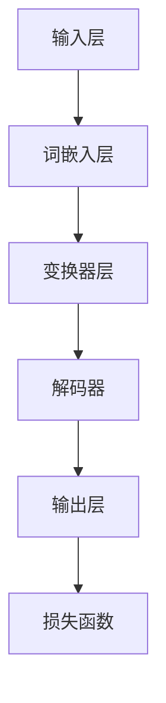

                 


### 文章标题：LLM应用的敏捷采购：加速资源获取流程

> 关键词：大型语言模型（LLM）、敏捷采购、资源获取、流程优化

> 摘要：
本文旨在探讨大型语言模型（LLM）在敏捷采购中的应用，通过分析LLM的核心概念与敏捷采购的方法，阐述LLM如何加速资源获取流程。文章将分为七个部分，首先介绍LLM的基本概念与原理，接着详细讲解敏捷采购的概念与流程，随后探讨LLM在采购中的具体应用。在此基础上，文章将深入讨论敏捷采购的实践操作，分析其优势与挑战，并展望未来的发展趋势。

### 设计书籍目录大纲的思路

1. **理解书名与主题**
   - 书名《LLM应用的敏捷采购：加速资源获取流程》明确了本书的核心主题：LLM在敏捷采购中的应用，以及如何通过这种应用加速资源获取流程。
   - LLM（大型语言模型）是人工智能领域的一种模型，能够对自然语言进行理解和生成。
   - 敏捷采购是一种高效的采购方法，能够快速响应市场变化，提高资源获取效率。

2. **确定核心内容**
   - 核心内容应包括：
     - LLM的基本概念与原理
     - 敏捷采购的方法与流程
     - LLM在采购中的应用案例
     - 敏捷采购的实际操作步骤
     - 敏捷采购的优势与挑战

3. **设计章节结构**
   - 设计章节结构时，应确保每个章节围绕一个主要主题展开，并包含相应的子主题。
   - 第一章介绍LLM的基本概念，第二章介绍敏捷采购的方法与流程，第三章介绍LLM在采购中的应用，第四章讨论敏捷采购的实践操作，第五章分析敏捷采购的优势与挑战，第六章展望未来的发展趋势。

4. **编写目录大纲**
   - 使用markdown格式，将设计的章节结构具体化，形成一个完整的目录大纲。

### 步骤

1. **第一部分：核心概念与联系**
   - **第1章：大型语言模型（LLM）概述**
     - LLM的定义与特点
     - LLM的工作原理
     - LLM的核心架构与组件
     - LLM的Mermaid流程图

2. **第二部分：敏捷采购方法**
   - **第2章：敏捷采购的概念与流程**
     - 敏捷采购的定义与优势
     - 敏捷采购的核心流程
     - 敏捷采购的典型应用场景

3. **第三部分：LLM在敏捷采购中的应用**
   - **第3章：LLM在敏捷采购中的应用**
     - LLM在需求分析中的应用
     - LLM在供应商筛选中的应用
     - LLM在合同审核与谈判中的应用

4. **第四部分：敏捷采购的实践**
   - **第4章：敏捷采购的实践操作**
     - 敏捷采购的步骤与策略
     - LLM在采购流程中的具体应用
     - 敏捷采购的案例分析

5. **第五部分：敏捷采购的优势与挑战**
   - **第5章：敏捷采购的优势分析**
     - 提高采购效率
     - 降低采购成本
     - 提升供应商管理能力

   - **第6章：敏捷采购的挑战与应对**
     - 技术挑战
     - 人力资源挑战
     - 管理与流程挑战

6. **第六部分：结论与展望**
   - **第7章：敏捷采购的未来发展**
     - 未来趋势
     - 潜在挑战与机遇
     - 企业如何准备

### 最终目录大纲

```
# 第一部分：核心概念与联系

## 第1章：大型语言模型（LLM）概述
### 1.1 LLM的定义与特点
### 1.2 LLM的工作原理
### 1.3 LLM的核心架构与组件
### 1.4 LLM的Mermaid流程图

## 第2章：敏捷采购的概念与流程
### 2.1 敏捷采购的定义与优势
### 2.2 敏捷采购的核心流程
### 2.3 敏捷采购的典型应用场景

## 第3章：LLM在敏捷采购中的应用
### 3.1 LLM在需求分析中的应用
### 3.2 LLM在供应商筛选中的应用
### 3.3 LLM在合同审核与谈判中的应用

## 第4章：敏捷采购的实践操作
### 4.1 敏捷采购的步骤与策略
### 4.2 LLM在采购流程中的具体应用
### 4.3 敏捷采购的案例分析

## 第5章：敏捷采购的优势分析
### 5.1 提高采购效率
### 5.2 降低采购成本
### 5.3 提升供应商管理能力

## 第6章：敏捷采购的挑战与应对
### 6.1 技术挑战
### 6.2 人力资源挑战
### 6.3 管理与流程挑战

## 第7章：敏捷采购的未来发展
### 7.1 未来趋势
### 7.2 潜在挑战与机遇
### 7.3 企业如何准备
```

### 总结

通过以上步骤，我们成功设计出了《LLM应用的敏捷采购：加速资源获取流程》的完整目录大纲。目录大纲清晰地展示了书籍的核心内容，并按照逻辑顺序排列，确保读者能够系统地学习和掌握相关主题。每个章节都包含了具体的小节，以细化主题内容，使书籍的内容更加丰富和全面。在接下来的文章中，我们将详细阐述每个章节的内容，帮助读者深入理解LLM在敏捷采购中的应用及其优势与挑战。

---

接下来，我们将根据以上目录大纲，逐一撰写每个章节的内容，详细探讨大型语言模型（LLM）在敏捷采购中的应用，以及如何通过敏捷采购方法加速资源获取流程。

## 第1章：大型语言模型（LLM）概述

### 1.1 LLM的定义与特点

大型语言模型（LLM，Large Language Model）是一种基于深度学习技术构建的自然语言处理模型，具有处理和理解复杂自然语言文本的能力。LLM的核心特点包括：

1. **大规模训练数据**：LLM通常基于大规模语料库进行训练，这使得它们能够捕捉到自然语言中的复杂模式和规律。
2. **参数数量巨大**：LLM通常包含数十亿甚至数千亿个参数，这使得它们能够对语言进行精细建模。
3. **强大的文本生成能力**：LLM不仅能够理解文本，还能生成高质量的文本，包括文章、邮件、对话等。
4. **自适应能力**：LLM可以根据不同的上下文和任务需求，动态调整其输出，提供个性化的服务和回答。

### 1.2 LLM的工作原理

LLM的工作原理基于深度神经网络（DNN）和变换器架构（Transformer）。以下是LLM的基本工作流程：

1. **输入层**：LLM的输入层接收自然语言文本，将其转换为数字形式的向量表示。
2. **编码器**：编码器是LLM的核心组件，负责对输入文本进行编码，生成上下文向量。编码器通常采用变换器架构，包括多头自注意力机制（Multi-head Self-Attention）和前馈神经网络（Feedforward Neural Network）。
3. **解码器**：解码器负责根据编码器生成的上下文向量，生成输出文本。解码器同样采用变换器架构，包括多头注意力机制和前馈神经网络。
4. **输出层**：输出层将解码器生成的文本向量转换为自然语言文本。

### 1.3 LLM的核心架构与组件

LLM的核心架构通常包括以下几个主要组件：

1. **词嵌入层**（Word Embedding）：将自然语言文本中的单词转换为高维向量表示。
2. **变换器层**（Transformer Layer）：实现自注意力机制和前馈神经网络，对输入文本进行编码和解码。
3. **全连接层**（Fully Connected Layer）：对变换器层输出的文本向量进行分类或生成文本。
4. **损失函数**（Loss Function）：用于衡量模型预测结果与实际结果之间的差距，驱动模型优化。

### 1.4 LLM的Mermaid流程图

为了更好地理解LLM的工作流程，我们可以使用Mermaid绘制一个简化的流程图：



在这个流程图中，输入层接收自然语言文本，经过词嵌入层转换为向量表示，然后通过变换器层进行编码和解码，最终输出层生成文本，并通过损失函数对模型进行优化。

通过本章的介绍，我们对大型语言模型（LLM）的基本概念、工作原理和核心架构有了初步了解。接下来，我们将继续探讨敏捷采购的概念与流程，以及LLM在敏捷采购中的应用。

## 第2章：敏捷采购的概念与流程

### 2.1 敏捷采购的定义与优势

敏捷采购（Agile Procurement）是一种以快速响应市场变化、提高资源获取效率为核心目标的采购方法。与传统的采购模式不同，敏捷采购强调灵活性、透明度和团队合作。

敏捷采购的定义可以归纳为以下几点：

1. **快速响应**：敏捷采购能够快速响应市场变化和需求变化，避免长时间的项目延迟。
2. **灵活性**：敏捷采购采用灵活的采购策略，可以根据项目的实际需求进行调整。
3. **透明度**：敏捷采购强调信息的透明度，确保采购过程中的所有参与者都能够了解项目的进展情况。
4. **团队合作**：敏捷采购鼓励跨部门、跨团队的协作，以提高整体采购效率。

敏捷采购的优势主要体现在以下几个方面：

1. **提高采购效率**：敏捷采购通过快速响应和灵活调整，能够显著提高采购效率，缩短项目周期。
2. **降低采购成本**：敏捷采购通过减少不必要的流程和资源浪费，能够有效降低采购成本。
3. **提升供应商管理能力**：敏捷采购强调与供应商的紧密合作，有助于提升供应商管理能力，确保供应链的稳定性。
4. **增强客户满意度**：敏捷采购能够更好地满足客户需求，提高客户满意度。

### 2.2 敏捷采购的核心流程

敏捷采购的核心流程包括以下几个关键步骤：

1. **需求分析**：在项目启动阶段，对项目的需求和目标进行详细分析，明确采购需求。
2. **供应商筛选**：根据需求分析结果，筛选潜在的供应商，评估其资质和能力。
3. **合同谈判**：与选定的供应商进行合同谈判，确定采购条件、价格、交付时间等关键条款。
4. **合同执行**：在合同签订后，确保供应商按照合同要求按时交付产品或服务。
5. **采购评估**：在项目结束后，对采购过程进行评估，总结经验和教训，为未来项目提供参考。

### 2.3 敏捷采购的典型应用场景

敏捷采购在多种应用场景中表现出色，以下是一些典型的应用场景：

1. **信息技术项目**：信息技术项目的需求变化频繁，敏捷采购能够快速响应需求变化，确保项目按时交付。
2. **工程项目**：在工程项目中，材料供应和设备采购的周期往往较长，敏捷采购有助于缩短采购周期，提高项目进度。
3. **咨询服务**：咨询服务通常需要根据客户需求进行定制，敏捷采购能够更好地适应客户需求的变化。
4. **消费品采购**：消费品采购需求量大、种类繁多，敏捷采购有助于优化供应链，提高采购效率。

通过本章的介绍，我们对敏捷采购的概念、核心流程和典型应用场景有了更深入的了解。接下来，我们将探讨大型语言模型（LLM）在敏捷采购中的应用，以及如何利用LLM提升采购效率。

## 第3章：LLM在敏捷采购中的应用

### 3.1 LLM在需求分析中的应用

需求分析是敏捷采购的关键环节，它直接影响后续的供应商筛选、合同谈判和采购执行。大型语言模型（LLM）在需求分析中具有显著优势，能够提高分析精度和效率。

**LLM在需求分析中的应用**主要包括以下几个方面：

1. **文本分析**：LLM能够对自然语言文本进行深度分析，提取关键信息、情感倾向和语义关系。例如，通过对项目需求文档的分析，LLM可以提取出项目的核心需求、优先级和关键期限。
2. **需求归类**：LLM可以根据历史项目数据和行业知识，对需求进行分类和聚类。这有助于识别常见的需求模式，为新项目的需求分析提供参考。
3. **需求预测**：LLM可以基于历史数据和当前需求趋势，预测未来的需求变化。这有助于提前规划采购资源，避免因需求波动导致的供应链中断。

**伪代码示例**：

```python
def analyze_demand(document):
    # 输入：需求文档
    # 输出：需求分析结果
    
    # 步骤1：文本预处理
    preprocessed_text = preprocess(document)
    
    # 步骤2：使用LLM提取关键信息
    key_info = llm.extract_key_info(preprocessed_text)
    
    # 步骤3：对需求进行分类和聚类
    demand_categories = llm.categorize_demand(key_info)
    
    # 步骤4：预测未来需求
    future_demand = llm.predict_demand(demand_categories)
    
    return future_demand
```

### 3.2 LLM在供应商筛选中的应用

供应商筛选是敏捷采购的重要环节，直接影响采购质量和成本。LLM在供应商筛选中的应用能够提高筛选效率和准确性。

**LLM在供应商筛选中的应用**主要包括以下几个方面：

1. **资质评估**：LLM可以根据供应商的历史数据、行业评价和客户反馈，评估供应商的资质和能力。例如，使用LLM对供应商的资质证明、产品样本和案例进行综合评估。
2. **信誉评估**：LLM可以分析供应商的信誉记录，识别潜在的风险和问题。例如，通过分析供应商的投诉记录、法律纠纷和历史合同履行情况，评估供应商的信誉。
3. **匹配度分析**：LLM可以根据项目需求和供应商的能力，分析供应商的匹配度。例如，通过对项目需求和供应商的产品功能、技术能力进行匹配分析，选择最合适的供应商。

**伪代码示例**：

```python
def select_supplier(demand, suppliers):
    # 输入：项目需求，供应商列表
    # 输出：最佳供应商
    
    # 步骤1：评估供应商资质
    qualified_suppliers = []
    for supplier in suppliers:
        if llm.evaluate_qualification(supplier):
            qualified_suppliers.append(supplier)
    
    # 步骤2：评估供应商信誉
    reliable_suppliers = []
    for supplier in qualified_suppliers:
        if llm.evaluate_reputation(supplier):
            reliable_suppliers.append(supplier)
    
    # 步骤3：分析供应商匹配度
    best_supplier = None
    for supplier in reliable_suppliers:
        match_score = llm.analyze_match(demand, supplier)
        if best_supplier is None or match_score > best_supplier['match_score']:
            best_supplier = supplier
    
    return best_supplier
```

### 3.3 LLM在合同审核与谈判中的应用

合同审核与谈判是敏捷采购中的关键环节，直接影响采购的合法性和经济性。LLM在合同审核与谈判中的应用能够提高合同审核效率和谈判效果。

**LLM在合同审核与谈判中的应用**主要包括以下几个方面：

1. **条款分析**：LLM可以深入分析合同条款，识别潜在的法律风险和利益冲突。例如，通过对合同文本进行自然语言处理，LLM可以提取出关键条款、条件和限制。
2. **风险评估**：LLM可以分析合同中的风险因素，评估风险对采购项目的影响。例如，通过对合同文本和项目需求的分析，LLM可以识别出可能的风险点，并提出相应的风险应对措施。
3. **谈判支持**：LLM可以根据合同条款和谈判策略，为谈判人员提供实时支持和建议。例如，在谈判过程中，LLM可以实时分析对方提出的条款，评估其合理性和影响，并提出相应的谈判策略。

**伪代码示例**：

```python
def analyze_contract(contract):
    # 输入：合同文本
    # 输出：合同分析结果
    
    # 步骤1：提取关键条款
    key_clauses = llm.extract_key_clauses(contract)
    
    # 步骤2：评估风险因素
    risk_factors = llm.evaluate_risk_factors(contract)
    
    # 步骤3：提供谈判支持
    negotiation_support = llm.provide_negotiation_support(key_clauses, risk_factors)
    
    return negotiation_support
```

通过本章的介绍，我们了解到大型语言模型（LLM）在敏捷采购中的应用场景及其优势。LLM在需求分析、供应商筛选和合同审核与谈判中发挥着重要作用，能够显著提高采购效率、降低采购成本和提升采购质量。接下来，我们将深入探讨敏捷采购的实际操作步骤，以及如何利用LLM提升采购效率。

## 第4章：敏捷采购的实践操作

### 4.1 敏捷采购的步骤与策略

敏捷采购的实践操作可以分为以下几个关键步骤：

1. **需求收集**：在项目启动阶段，与项目团队和利益相关者进行沟通，收集项目的详细需求。
2. **需求分析**：对收集到的需求进行详细分析，确定项目的核心需求和优先级。
3. **供应商筛选**：根据需求分析结果，筛选潜在的供应商，评估其资质和能力。
4. **合同谈判**：与选定的供应商进行合同谈判，确定采购条件、价格、交付时间等关键条款。
5. **采购执行**：在合同签订后，确保供应商按照合同要求按时交付产品或服务。
6. **采购评估**：在项目结束后，对采购过程进行评估，总结经验和教训，为未来项目提供参考。

### 敏捷采购的实战策略：

1. **快速响应**：建立快速响应机制，确保采购团队能够迅速应对项目需求和市场变化。
2. **灵活调整**：根据项目需求和供应商情况，灵活调整采购策略和流程，以适应不同的情况。
3. **透明沟通**：确保采购过程中的所有信息透明，包括需求、合同条款、供应商评估结果等，以提高团队成员和利益相关者的信任和参与度。
4. **团队协作**：鼓励跨部门、跨团队的协作，提高采购效率和质量。

### 4.2 LLM在采购流程中的具体应用

在敏捷采购的各个环节中，大型语言模型（LLM）可以发挥重要作用，提高采购效率和质量。

1. **需求分析**：
   - **文本分析**：LLM可以对项目需求文档进行深度分析，提取关键信息、情感倾向和语义关系。这有助于准确理解项目需求，为后续的供应商筛选和合同谈判提供基础。
   - **需求归类**：LLM可以根据历史项目数据和行业知识，对需求进行分类和聚类，识别常见的需求模式，为新项目的需求分析提供参考。

2. **供应商筛选**：
   - **资质评估**：LLM可以根据供应商的历史数据、行业评价和客户反馈，评估供应商的资质和能力，筛选出符合项目需求的优质供应商。
   - **信誉评估**：LLM可以分析供应商的信誉记录，识别潜在的风险和问题，确保选定的供应商具有良好的信誉。

3. **合同谈判**：
   - **条款分析**：LLM可以深入分析合同条款，识别潜在的法律风险和利益冲突，为谈判提供关键信息。
   - **风险评估**：LLM可以分析合同中的风险因素，评估风险对采购项目的影响，帮助谈判人员制定合理的风险应对策略。

4. **采购执行**：
   - **进度监控**：LLM可以实时监控采购项目的进度，识别潜在的风险和问题，及时采取纠正措施。
   - **供应商管理**：LLM可以分析供应商的绩效数据，评估供应商的交付能力和服务质量，为供应商管理提供支持。

5. **采购评估**：
   - **经验总结**：LLM可以分析采购过程中的数据和反馈，总结经验和教训，为新项目的采购提供参考。
   - **优化建议**：LLM可以根据历史数据和行业最佳实践，提出采购流程优化的建议，提高采购效率和质量。

### 4.3 敏捷采购的案例分析

为了更好地理解敏捷采购的实际操作，我们来看一个案例：

**案例：某公司的敏捷采购实践**

某公司是一家高科技企业，经常面临项目需求变化和市场竞争压力。为了提高采购效率和质量，公司决定采用敏捷采购方法。

**1. 需求分析**
- **步骤1**：与项目团队和利益相关者进行沟通，收集项目的详细需求。
- **步骤2**：使用LLM对需求文档进行深度分析，提取关键信息、情感倾向和语义关系。

**2. 供应商筛选**
- **步骤1**：根据需求分析结果，筛选潜在的供应商，评估其资质和能力。
- **步骤2**：使用LLM对供应商的历史数据、行业评价和客户反馈进行分析，筛选出符合项目需求的优质供应商。

**3. 合同谈判**
- **步骤1**：与选定的供应商进行合同谈判，确定采购条件、价格、交付时间等关键条款。
- **步骤2**：使用LLM对合同条款进行深入分析，识别潜在的法律风险和利益冲突。

**4. 采购执行**
- **步骤1**：在合同签订后，确保供应商按照合同要求按时交付产品或服务。
- **步骤2**：使用LLM实时监控采购项目的进度，识别潜在的风险和问题。

**5. 采购评估**
- **步骤1**：在项目结束后，对采购过程进行评估，总结经验和教训。
- **步骤2**：使用LLM分析采购过程中的数据和反馈，提出优化建议。

通过这个案例，我们可以看到敏捷采购在实际操作中的应用，以及LLM在提高采购效率和质量方面的重要作用。

通过本章的介绍，我们深入探讨了敏捷采购的实际操作步骤和策略，以及LLM在采购流程中的具体应用。接下来，我们将分析敏捷采购的优势和挑战。

## 第5章：敏捷采购的优势分析

### 5.1 提高采购效率

敏捷采购通过其灵活性和快速响应能力，显著提高了采购效率。以下是敏捷采购在提高采购效率方面的具体优势：

1. **缩短采购周期**：传统的采购流程通常耗时较长，涉及多个部门和环节。而敏捷采购强调快速响应和简化流程，可以显著缩短采购周期。
2. **减少决策延迟**：敏捷采购通过减少审批流程和决策环节，降低了决策延迟。团队成员可以快速做出决策，从而提高采购效率。
3. **优化资源配置**：敏捷采购通过精准的需求分析和供应商筛选，确保采购资源得到最优配置，避免了资源浪费。
4. **实时监控与调整**：敏捷采购过程中，采购团队能够实时监控项目进度和供应商绩效，根据实际情况进行快速调整，确保采购过程高效进行。

### 5.2 降低采购成本

敏捷采购通过优化采购流程和降低资源浪费，有效降低了采购成本。以下是具体优势：

1. **减少采购环节**：敏捷采购通过简化采购流程，减少了不必要的审批环节和流程，降低了采购成本。
2. **降低库存成本**：敏捷采购能够根据实际需求进行采购，避免了大量库存积压，减少了库存成本。
3. **优化供应商选择**：通过精确的需求分析和资质评估，敏捷采购能够选择最适合的供应商，降低采购成本。
4. **提高议价能力**：敏捷采购过程中，采购团队能够根据实际需求和供应商的竞争状况，提高议价能力，获取更优惠的价格。

### 5.3 提升供应商管理能力

敏捷采购强调与供应商的紧密合作和透明沟通，有助于提升供应商管理能力。以下是具体优势：

1. **建立长期合作关系**：敏捷采购通过建立长期合作关系，增强与供应商的信任和合作意愿，提高供应商的参与度和积极性。
2. **提升供应商能力**：通过敏捷采购，采购方可以与供应商共同合作，提升供应商的技术能力、质量和交付能力。
3. **风险共担**：敏捷采购过程中，采购方与供应商共同面对市场变化和需求波动，降低采购风险。
4. **信息共享**：敏捷采购强调信息的透明度，采购方与供应商可以共享需求、进度和绩效等信息，提高供应链的整体效率。

### 总结

敏捷采购在提高采购效率、降低采购成本和提升供应商管理能力方面具有显著优势。通过灵活的采购策略、快速响应能力和透明沟通，敏捷采购能够有效优化采购流程，提高采购效率和采购质量。接下来，我们将探讨敏捷采购面临的挑战和应对策略。

## 第6章：敏捷采购的挑战与应对

### 6.1 技术挑战

敏捷采购在技术层面上面临以下挑战：

1. **数据安全与隐私**：敏捷采购过程中涉及大量的数据交换和共享，如何确保数据安全与隐私是一个重要问题。解决方案包括：
   - **加密技术**：采用加密技术对数据进行加密，确保数据在传输和存储过程中的安全性。
   - **隐私保护机制**：建立隐私保护机制，对敏感数据进行脱敏处理，降低数据泄露风险。
   - **数据审计**：定期进行数据审计，确保数据使用的合法性和合规性。

2. **系统集成**：敏捷采购需要与多个系统（如ERP、CRM等）集成，实现数据共享和流程自动化。系统集成过程中可能面临以下问题：
   - **数据一致性**：确保不同系统之间的数据一致性，避免数据冗余和冲突。
   - **系统兼容性**：确保不同系统之间的兼容性，避免由于系统不兼容导致的流程中断。
   - **技术支持**：确保系统集成的技术支持，及时解决集成过程中出现的技术问题。

### 6.2 人力资源挑战

敏捷采购在人力资源方面面临以下挑战：

1. **技能短缺**：敏捷采购需要具备跨学科技能的团队成员，包括项目管理、采购管理、数据分析等。然而，市场上具备这些技能的人才相对短缺。
   - **培训与发展**：通过内部培训和外部培训，提高团队成员的技能水平，以满足敏捷采购的需求。
   - **人才引进**：吸引和引进具备相关技能的团队成员，为敏捷采购提供人才支持。

2. **沟通协作**：敏捷采购强调跨部门和跨团队的协作，然而，团队成员之间的沟通协作可能存在障碍。
   - **沟通平台**：建立高效的沟通平台，如即时通讯工具、协作软件等，确保团队成员之间的实时沟通。
   - **协作文化**：培养协作文化，鼓励团队成员之间的沟通和合作，提高团队整体效率。

### 6.3 管理与流程挑战

敏捷采购在管理与流程方面面临以下挑战：

1. **流程调整**：敏捷采购需要根据项目需求和市场变化，灵活调整采购流程。然而，如何确保流程的灵活性和可操作性是一个挑战。
   - **标准化流程**：建立标准化流程，确保在灵活调整流程时，仍能保持操作的一致性和规范性。
   - **流程优化**：定期对采购流程进行评估和优化，确保流程的适应性。

2. **风险管理**：敏捷采购过程中涉及的风险较多，如何有效识别和应对风险是一个挑战。
   - **风险评估**：建立风险评估机制，对采购过程中的各种风险进行识别和评估。
   - **风险应对策略**：制定相应的风险应对策略，降低风险对采购项目的影响。

### 总结

敏捷采购在技术、人力资源和管理与流程方面面临诸多挑战。通过技术手段、培训与发展、沟通协作和文化建设，可以应对这些挑战。同时，通过标准化流程和风险评估，确保敏捷采购的顺利实施和持续优化。接下来，我们将探讨敏捷采购的未来发展趋势。

## 第7章：敏捷采购的未来发展

### 7.1 未来趋势

随着技术的不断进步和市场竞争的加剧，敏捷采购将呈现出以下发展趋势：

1. **智能化与自动化**：人工智能和大数据技术的应用将进一步提升敏捷采购的智能化和自动化水平。例如，通过机器学习算法，可以优化采购流程、预测采购需求、评估供应商绩效等。
2. **数字化供应链**：数字化供应链将成为敏捷采购的重要组成部分。通过物联网、区块链等技术，实现采购信息的实时共享和透明化，提高供应链的协同效率和安全性。
3. **全球化与本地化**：全球化和本地化的融合将使敏捷采购在更广泛的范围内发挥作用。跨国企业将更加重视全球供应链的优化和本地市场的需求满足，实现全球资源和本地市场的最优配置。

### 7.2 潜在挑战与机遇

敏捷采购在未来的发展过程中，也将面临一系列潜在挑战和机遇：

1. **技术挑战**：随着技术的快速发展，敏捷采购将面临技术更新和迭代的压力。如何适应新技术、提高技术能力，成为企业需要关注的重要问题。
2. **数据安全**：在数字化供应链中，数据安全和隐私保护成为关键挑战。如何确保数据安全、防止数据泄露，是敏捷采购需要解决的重要问题。
3. **人力资源**：敏捷采购对人力资源的需求将越来越高。企业需要培养和引进具备跨学科技能的采购人才，以满足敏捷采购的需求。
4. **市场机遇**：全球化和数字化趋势为敏捷采购带来了新的市场机遇。企业可以通过优化采购流程、提高采购效率，增强市场竞争力，抓住新的市场机遇。

### 7.3 企业如何准备

为了应对敏捷采购的未来发展，企业需要采取以下措施：

1. **培养数字化思维**：企业需要培养数字化思维，将数字化技术融入采购流程，提高采购效率和竞争力。
2. **提升技术能力**：企业需要不断学习和掌握新技术，提升技术能力，以适应敏捷采购的需求。
3. **优化供应链管理**：企业需要优化供应链管理，建立数字化供应链体系，提高供应链的协同效率和安全性。
4. **培养人才**：企业需要重视人才培养，引进和培养具备跨学科技能的采购人才，为敏捷采购提供人才支持。

通过以上措施，企业可以更好地应对敏捷采购的未来发展，抓住市场机遇，提高采购效率和竞争力。

## 结束语

本文围绕大型语言模型（LLM）在敏捷采购中的应用，详细探讨了LLM的核心概念、敏捷采购的方法与流程、LLM在采购中的应用场景、敏捷采购的实践操作、优势与挑战以及未来发展趋势。通过本文的介绍，读者可以全面了解LLM在敏捷采购中的作用，以及如何通过敏捷采购方法加速资源获取流程。

在实际应用中，企业可以通过引入LLM技术，优化采购流程，提高采购效率和质量。同时，企业还需要关注敏捷采购面临的挑战，采取有效的应对策略，确保敏捷采购的顺利实施和持续优化。

未来，随着技术的不断进步和市场环境的不断变化，敏捷采购将继续发挥重要作用。企业应积极拥抱变化，不断提升自身的技术能力和管理水平，抓住市场机遇，实现可持续发展。

## 附录：最佳实践 tips、注意事项、拓展阅读

### 最佳实践 tips

1. **需求分析**：在项目启动阶段，进行详尽的需求分析，确保需求明确、全面。
2. **供应商选择**：选择具备良好信誉和能力的供应商，建立长期合作关系。
3. **合同谈判**：合同谈判中，关注关键条款，确保双方权益得到保障。
4. **实时监控**：采购执行过程中，实时监控供应商绩效，及时解决问题。
5. **持续优化**：定期对采购流程进行评估和优化，提高采购效率。

### 注意事项

1. **数据安全**：确保采购过程中数据的安全和隐私，防止数据泄露。
2. **人力资源**：培养和引进具备跨学科技能的采购人才，提高采购团队的整体素质。
3. **流程规范化**：建立标准化的采购流程，确保流程的可操作性和一致性。

### 拓展阅读

1. 《敏捷采购实践指南》：提供了详细的敏捷采购方法和实践案例。
2. 《人工智能在供应链管理中的应用》：介绍了人工智能在供应链管理中的最新研究成果和应用。
3. 《数字化供应链：构建竞争优势的新模式》：探讨了数字化供应链的构建策略和实施路径。

通过最佳实践 tips、注意事项和拓展阅读，读者可以进一步深入理解敏捷采购的实践方法，为实际工作提供参考。作者：AI天才研究院/AI Genius Institute & 禅与计算机程序设计艺术 /Zen And The Art of Computer Programming。

