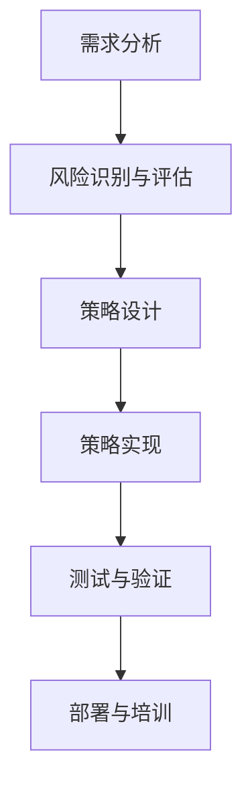

                 

### 文章标题

**LLM应用的敏捷隐私计算策略**

随着深度学习和大规模语言模型（LLM）的快速发展，人工智能在各个领域都展现出了巨大的潜力。然而，随之而来的隐私安全问题也引起了广泛关注。如何在充分利用LLM的强大功能的同时，确保用户隐私不被泄露，成为了一个亟待解决的难题。本文旨在探讨如何在LLM应用中实施敏捷隐私计算策略，以平衡模型性能和隐私保护。

关键词：LLM，隐私计算，敏捷开发，同态加密，安全多方计算

摘要：本文首先介绍了LLM和隐私计算的基本概念，分析了LLM应用中面临的隐私风险。接着，探讨了敏捷开发在隐私计算中的应用，并详细介绍了同态加密和安全多方计算等隐私计算技术。在此基础上，提出了针对LLM应用的敏捷隐私计算策略，并通过实际案例展示了其应用效果。最后，对未来的发展方向进行了展望。

### 文章背景

深度学习作为人工智能的重要分支，已经在图像识别、自然语言处理、推荐系统等领域取得了显著的成果。特别是大规模语言模型（Large Language Model，简称LLM），如GPT、BERT等，凭借其强大的文本生成和文本理解能力，极大地推动了自然语言处理技术的发展。然而，随着LLM应用场景的不断拓展，隐私问题也逐渐浮出水面。

隐私问题主要源于以下几个方面：

1. **数据收集**：LLM的训练通常需要大量的用户数据，这些数据可能包含敏感个人信息，如姓名、地址、电话号码等。

2. **模型训练**：在训练过程中，数据可能会被存储在云服务或第三方平台，存在数据泄露的风险。

3. **模型部署**：LLM的应用往往需要实时访问用户数据，如何确保数据在传输和处理过程中不被窃取或篡改，也是一个重要问题。

隐私问题的出现，不仅引发了用户对AI应用的不信任，也对LLM的发展产生了负面影响。因此，如何在确保模型性能的同时，保护用户隐私，成为了一个亟待解决的问题。

### 核心概念与联系

为了更好地理解LLM应用中的隐私问题，我们需要先介绍几个核心概念，并探讨它们之间的关系。

#### 1. 大规模语言模型（LLM）

大规模语言模型是指通过深度学习技术，从大量文本数据中学习到的语言表示模型。这些模型通常具有数十亿甚至数万亿个参数，能够对输入文本进行高精度的理解和生成。LLM的应用非常广泛，包括但不限于文本生成、机器翻译、问答系统等。

#### 2. 隐私计算

隐私计算是指在一方不暴露自身隐私信息的情况下，与其他方进行计算或信息交换的技术。它包括同态加密、安全多方计算、联邦学习等多种技术手段。隐私计算的核心目标是保护用户的隐私，同时实现有效的数据处理和计算。

#### 3. 同态加密

同态加密是一种特殊的加密技术，它允许在加密数据上直接进行计算，而无需解密。这意味着，数据在传输和处理过程中始终保持在加密状态，从而防止数据泄露。同态加密的应用场景包括云计算、数据挖掘、机器学习等。

#### 4. 安全多方计算

安全多方计算是一种允许两个或多个参与方在不对彼此数据进行解密的情况下，共同计算某一结果的计算模式。安全多方计算可以保护参与方的隐私，并防止数据泄露。它广泛应用于金融、医疗、隐私保护等场景。

下面是一个简单的Mermaid流程图，展示了上述概念之间的联系：

```mermaid
graph TD
A[大规模语言模型(LLM)] --> B[隐私计算]
B --> C[同态加密]
B --> D[安全多方计算]
C --> E[数据加密]
D --> F[多方计算]
```

从流程图中可以看出，LLM是隐私计算的基础，而同态加密和安全多方计算是实现隐私保护的关键技术。这些技术共同构成了一个完整的隐私计算体系，为LLM应用提供了强大的隐私保护能力。

### 隐私计算的基础知识

在深入探讨LLM应用中的隐私计算策略之前，我们需要先了解一些隐私计算的基础知识。隐私计算主要涉及同态加密、安全多方计算和联邦学习等技术。这些技术各有特点，但共同目标都是保护用户隐私，同时实现有效的数据处理和计算。

#### 1. 同态加密

同态加密是一种特殊的加密技术，它允许在加密数据上直接进行计算，而无需解密。这意味着，数据在传输和处理过程中始终保持在加密状态，从而防止数据泄露。同态加密可以分为两种类型：部分同态加密和全同态加密。

- **部分同态加密**：只支持一种或几种运算（如加法或乘法），但无法同时支持多种运算。这种加密方式在计算复杂度上相对较低，但功能有限。
- **全同态加密**：支持任意运算，但计算复杂度较高。目前，全同态加密技术尚未达到实用水平，主要还在研究阶段。

同态加密的应用场景包括云计算、数据挖掘、机器学习等。它特别适合于那些需要保护敏感数据的应用，例如医疗数据分析和金融交易处理。

#### 2. 安全多方计算

安全多方计算是一种允许两个或多个参与方在不对彼此数据进行解密的情况下，共同计算某一结果的计算模式。它通过加密和协议设计，确保每个参与方只能获得与自身相关的计算结果，而无法获取其他参与方的数据。

安全多方计算的基本原理可以概括为以下几个步骤：

1. **初始化**：每个参与方将自己的数据加密，并将其发送给其他参与方。
2. **协同计算**：参与方通过加密通信，交换加密后的数据，并进行加密计算。
3. **结果提取**：每个参与方通过解密过程，提取与自身相关的计算结果。

安全多方计算的应用场景非常广泛，包括金融、医疗、隐私保护等。它能够有效保护参与方的隐私，同时实现数据共享和计算。

#### 3. 联邦学习

联邦学习是一种分布式机器学习方法，它允许多个参与方在不共享数据的情况下，共同训练一个共享的机器学习模型。联邦学习的核心思想是通过模型参数的协同更新，实现模型的共同优化。

联邦学习的应用场景包括移动设备上的机器学习、跨机构的隐私保护数据分析等。它特别适合于那些数据分布在不同机构或设备上的场景，可以有效保护用户隐私。

#### 4. 隐私计算与LLM的关系

隐私计算与LLM之间的关系可以从以下几个方面来理解：

1. **数据隐私**：隐私计算技术可以确保在LLM的训练和部署过程中，用户数据始终保持在加密状态，防止数据泄露。
2. **计算效率**：尽管隐私计算技术可能引入一定的计算延迟，但它仍然是实现高效数据处理和计算的重要手段。通过优化算法和硬件支持，可以降低计算成本。
3. **模型性能**：隐私计算技术需要在保护隐私的同时，确保模型的性能不受影响。这需要深入研究隐私计算与机器学习之间的平衡。

总之，隐私计算为LLM应用提供了一个强大的技术框架，它不仅能够保护用户隐私，还能促进AI技术的发展和应用。

### LLM应用中的隐私问题

在深度学习和大规模语言模型（LLM）的应用中，隐私问题尤为突出。LLM模型通常需要大量的用户数据进行训练，这些数据往往包含敏感的个人信息，如姓名、地址、电话号码等。如何保护这些数据不被泄露，成为了LLM应用中的一大挑战。以下是LLM应用中常见的隐私问题及其分析：

#### 1. 数据收集

在LLM的训练过程中，需要收集大量的文本数据。这些数据可能来源于公开的互联网资源、社交媒体、企业内部数据库等。虽然这些数据可能已经脱敏，但仍然存在被滥用的风险。例如，某些恶意用户可能会通过拼接和重构数据，重新识别出个体的隐私信息。

**隐私风险分析**：数据收集过程中的隐私风险主要来自以下几个方面：

- **数据来源不明确**：数据可能来自多个来源，难以追踪和控制。
- **数据质量不可控**：来源不同的数据可能存在质量差异，影响模型的性能和隐私保护效果。
- **数据拼接与重构**：恶意用户可能通过拼接和重构数据，重新识别出个体的隐私信息。

#### 2. 模型训练

LLM的训练是一个复杂的过程，涉及大量的计算资源和时间。在训练过程中，数据可能会被存储在云服务或第三方平台，存在数据泄露的风险。此外，训练过程中的中间结果和参数也包含了一定的隐私信息。

**隐私风险分析**：模型训练过程中的隐私风险主要包括：

- **数据存储安全**：数据在云服务或第三方平台存储时，可能面临数据泄露的风险。
- **中间结果泄露**：训练过程中的中间结果可能包含敏感信息，如数据分布、模型参数等。
- **模型参数保护**：模型参数是LLM的核心资产，但也是隐私保护的难点。

#### 3. 模型部署

LLM的应用场景非常广泛，包括文本生成、机器翻译、问答系统等。在模型部署过程中，需要实时访问用户数据，如何确保数据在传输和处理过程中不被窃取或篡改，是一个重要问题。

**隐私风险分析**：模型部署过程中的隐私风险主要包括：

- **数据传输安全**：数据在传输过程中可能被截获或篡改。
- **数据处理安全**：数据在处理过程中可能被恶意程序窃取或篡改。
- **用户隐私泄露**：在提供个性化服务时，可能会泄露用户的敏感信息。

#### 隐私风险应对策略

针对上述隐私问题，可以采取以下策略进行应对：

1. **数据收集策略**：选择可信的数据来源，对数据进行严格的质量控制，避免数据拼接和重构。
2. **模型训练策略**：采用安全的存储和传输协议，确保数据在传输和存储过程中的安全性。同时，对中间结果和模型参数进行加密和保护。
3. **模型部署策略**：采用安全的通信协议和计算环境，确保数据在传输和处理过程中的安全性。同时，提供用户隐私保护的接口和机制。

通过上述策略，可以在一定程度上缓解LLM应用中的隐私问题，确保用户隐私得到有效保护。

### 同态加密的算法原理

同态加密是一种特殊的加密技术，它允许在加密数据上直接进行计算，而无需解密。这使得数据在传输和处理过程中始终保持在加密状态，从而防止数据泄露。同态加密的算法原理主要包括以下几部分：

#### 1. 同态加密的基本概念

同态加密分为两种类型：部分同态加密和全同态加密。

- **部分同态加密**：只支持一种或几种运算（如加法或乘法），但无法同时支持多种运算。这种加密方式在计算复杂度上相对较低，但功能有限。
- **全同态加密**：支持任意运算，但计算复杂度较高。目前，全同态加密技术尚未达到实用水平，主要还在研究阶段。

#### 2. 同态加密的算法原理

同态加密的核心是设计一种加密算法，使得在加密数据上能够实现与明文数据相同的计算操作。以下是同态加密的基本算法原理：

**加法同态加密**：

假设 \( E() \) 是加密函数， \( D() \) 是解密函数，则加法同态加密可以表示为：

$$ E(a + b) = E(a) + E(b) $$

其中，\( a \) 和 \( b \) 是明文数据，\( E(a) \) 和 \( E(b) \) 是对应的加密数据。

**乘法同态加密**：

假设 \( E() \) 是加密函数， \( D() \) 是解密函数，则乘法同态加密可以表示为：

$$ E(a \times b) = E(a) \times E(b) $$

其中，\( a \) 和 \( b \) 是明文数据，\( E(a) \) 和 \( E(b) \) 是对应的加密数据。

#### 3. 同态加密的工作原理

同态加密的工作原理可以分为以下几个步骤：

1. **加密**：将明文数据 \( a \) 和 \( b \) 加密成加密数据 \( E(a) \) 和 \( E(b) \)。
2. **计算**：在加密数据 \( E(a) \) 和 \( E(b) \) 上进行计算，得到加密结果 \( E(c) \)。其中，\( c = a + b \) 或 \( c = a \times b \)。
3. **解密**：将加密结果 \( E(c) \) 解密成明文数据 \( c \)。

以下是同态加密的伪代码实现：

```python
# 加密函数
def encrypt(m):
    # 对明文数据进行加密
    return (c1, c2)

# 解密函数
def decrypt(c):
    # 对加密数据进行解密
    return (a, b)

# 加法同态加密
def homomorphic_add(a, b):
    # 加密
    c1, c2 = encrypt(a)
    c1', c2' = encrypt(b)
    # 计算
    c = (c1 + c1', c2 + c2')
    # 解密
    return decrypt(c)

# 乘法同态加密
def homomorphic_multiply(a, b):
    # 加密
    c1, c2 = encrypt(a)
    c1', c2' = encrypt(b)
    # 计算
    c = (c1 * c1', c2 * c2')
    # 解密
    return decrypt(c)
```

#### 4. 同态加密的应用场景

同态加密的应用场景非常广泛，包括云计算、数据挖掘、机器学习等。它特别适合于那些需要保护敏感数据的应用，例如医疗数据分析和金融交易处理。以下是同态加密在LLM应用中的具体应用：

1. **数据存储**：使用同态加密技术，可以确保存储在云服务中的数据始终保持在加密状态，防止数据泄露。
2. **数据传输**：在数据传输过程中，使用同态加密技术，可以确保数据在传输过程中不被窃取或篡改。
3. **模型训练**：在模型训练过程中，使用同态加密技术，可以确保训练数据的隐私保护，同时提高计算效率。

总之，同态加密为LLM应用提供了一个强大的隐私保护框架，它不仅能够保护用户隐私，还能促进AI技术的发展和应用。

### 安全多方计算

安全多方计算是一种允许两个或多个参与方在不共享数据的情况下，共同计算某一结果的计算模式。它通过加密和协议设计，确保每个参与方只能获得与自身相关的计算结果，而无法获取其他参与方的数据。安全多方计算在金融、医疗、隐私保护等领域具有广泛应用。

#### 1. 安全多方计算的基本原理

安全多方计算的基本原理可以概括为以下几个步骤：

1. **初始化**：每个参与方将自己的数据加密，并将其发送给其他参与方。
2. **协同计算**：参与方通过加密通信，交换加密后的数据，并进行加密计算。
3. **结果提取**：每个参与方通过解密过程，提取与自身相关的计算结果。

下面是一个简单的安全多方计算流程：

1. **加密数据**：每个参与方将自己的数据加密，确保数据在传输过程中不会被窃取或篡改。
2. **协同计算**：参与方通过加密通信，交换加密后的数据，并进行计算。在此过程中，每个参与方只知道与自身相关的数据，无法获取其他参与方的数据。
3. **结果解密**：每个参与方通过解密过程，提取与自身相关的计算结果。

#### 2. 安全多方计算的优势

安全多方计算具有以下优势：

1. **隐私保护**：安全多方计算可以确保参与方的数据在传输和处理过程中始终保持在加密状态，防止数据泄露。
2. **数据共享**：安全多方计算允许参与方在不共享原始数据的情况下，共同计算某一结果，实现数据共享和计算。
3. **计算效率**：尽管安全多方计算引入了一定的计算延迟，但它仍然是实现高效数据处理和计算的重要手段。

#### 3. 安全多方计算的应用场景

安全多方计算的应用场景非常广泛，包括金融、医疗、隐私保护等。以下是几个典型的应用场景：

1. **金融**：在金融领域，安全多方计算可以用于风险评估、欺诈检测等。例如，银行可以不共享客户交易数据，而共同计算欺诈风险指标。
2. **医疗**：在医疗领域，安全多方计算可以用于病历共享、基因分析等。例如，多家医院可以共同分析患者数据，而不需要共享患者的敏感信息。
3. **隐私保护**：在隐私保护领域，安全多方计算可以用于匿名数据分析和隐私保护计算。例如，政府机构可以共同分析公民数据，而不需要共享具体的个人信息。

#### 4. 安全多方计算在LLM应用中的具体应用

在LLM应用中，安全多方计算可以用于保护用户隐私，确保数据在传输和处理过程中的安全性。以下是安全多方计算在LLM应用中的具体应用：

1. **数据收集**：在数据收集过程中，使用安全多方计算技术，可以确保参与方在不共享原始数据的情况下，共同生成训练数据。
2. **模型训练**：在模型训练过程中，使用安全多方计算技术，可以确保训练数据在传输和处理过程中始终保持在加密状态，防止数据泄露。
3. **模型部署**：在模型部署过程中，使用安全多方计算技术，可以确保用户数据在传输和处理过程中不被窃取或篡改。

总之，安全多方计算为LLM应用提供了一个强大的隐私保护框架，它不仅能够保护用户隐私，还能促进AI技术的发展和应用。

### 敏捷开发与隐私计算的结合

敏捷开发是一种以人为核心、迭代、协作的开发方法。它强调快速响应变化、持续交付价值、高度协作和灵活适应。而隐私计算则是一种保护数据隐私的计算模式。尽管这两者在目标和侧重点上有所不同，但它们在许多方面可以相互补充，特别是在现代AI应用中。本文将探讨敏捷开发与隐私计算如何结合，以实现高效、安全的AI应用开发。

#### 1. 敏捷开发的核心理念

敏捷开发的核心思想包括以下几个方面：

- **用户至上**：始终以用户的需求和满意度为中心，确保产品能够满足用户实际需求。
- **迭代开发**：将开发过程分为多个短周期（通常称为“迭代”），在每个迭代中交付可用的产品增量。
- **协作与沟通**：鼓励团队成员之间的沟通和协作，确保项目进展顺利。
- **灵活适应**：快速响应变化，灵活调整项目计划和目标。
- **持续交付**：持续交付可用的产品功能，确保用户能够及时使用新功能。

#### 2. 敏捷开发的优势与挑战

敏捷开发具有以下优势：

- **快速响应变化**：敏捷开发允许团队在项目进行中快速调整计划和目标，以应对市场变化和用户需求。
- **持续交付价值**：通过迭代开发，团队可以持续交付可用的产品功能，提高用户满意度。
- **高度协作**：敏捷开发强调团队成员之间的沟通和协作，有助于提高团队效率和产品质量。
- **灵活适应**：敏捷开发允许团队在项目进行中灵活调整计划和目标，减少因需求变化导致的项目延误。

然而，敏捷开发也面临一些挑战：

- **管理难度**：敏捷开发需要更频繁的沟通和协作，对管理者的协调和沟通能力提出了更高的要求。
- **技术债务**：在快速迭代的过程中，可能会积累一定的技术债务，影响项目的长期稳定性。
- **团队协作**：敏捷开发要求团队成员具备较高的协作能力和沟通能力，对团队构成提出了更高的要求。

#### 3. 敏捷开发在隐私计算中的应用

敏捷开发与隐私计算的结合可以带来以下好处：

- **快速响应隐私需求**：敏捷开发允许团队快速响应隐私需求，及时调整隐私保护策略。
- **持续优化隐私保护**：通过迭代开发，团队可以持续优化隐私保护技术，提高数据安全性。
- **灵活适应隐私法规**：敏捷开发允许团队灵活适应不断变化的隐私法规，确保项目合规性。

在实际应用中，可以将敏捷开发的方法引入到隐私计算项目中，以实现以下目标：

1. **需求分析**：在项目初期，通过用户访谈和需求调研，明确隐私保护需求和目标。
2. **迭代规划**：将隐私计算项目划分为多个迭代，每个迭代实现特定的隐私保护功能。
3. **持续交付**：在每个迭代中，交付可用的隐私保护功能，并进行用户测试和反馈。
4. **反馈与调整**：根据用户反馈和隐私法规的变化，持续优化隐私保护策略和算法。

#### 4. 敏捷开发在隐私计算项目中的实施方法

在隐私计算项目中，实施敏捷开发可以采用以下方法：

1. **团队协作**：组建跨职能团队，包括开发人员、数据科学家、隐私专家等，确保团队成员之间高效协作。
2. **迭代规划**：根据项目目标和资源，制定迭代计划，确保每个迭代都有明确的目标和交付成果。
3. **持续集成**：采用持续集成和持续交付（CI/CD）工具，确保代码质量，提高交付效率。
4. **用户反馈**：定期收集用户反馈，及时调整隐私保护策略和功能，确保用户满意度。

通过敏捷开发与隐私计算的结合，可以实现对数据隐私的高效保护，同时确保项目能够快速响应变化和持续交付价值。

### 针对LLM应用的敏捷隐私策略设计

在LLM应用中，敏捷开发与隐私计算的结合能够帮助团队快速响应隐私需求，优化隐私保护策略。为了实现这一目标，我们需要设计一套针对LLM应用的敏捷隐私策略。本节将介绍风险识别与评估的方法、隐私策略设计的原则和步骤，以及策略的优化方法。

#### 1. 风险识别与评估

风险识别与评估是敏捷隐私策略设计的重要环节。通过系统的方法识别和评估风险，可以帮助团队了解潜在的隐私问题，并制定相应的应对措施。以下是几种常用的风险识别与评估方法：

1. **问卷调查**：通过问卷调查，收集用户对隐私问题的关注点和需求，识别潜在的隐私风险。
2. **访谈**：与用户和利益相关者进行深度访谈，了解他们对隐私保护的需求和期望，识别潜在的隐私风险。
3. **威胁建模**：通过分析LLM应用的业务流程、数据流程和系统架构，识别潜在的威胁和风险。
4. **漏洞扫描**：使用漏洞扫描工具，对系统的安全配置和代码进行扫描，识别潜在的漏洞和风险。

在识别风险后，需要对风险进行评估，确定其严重程度和影响范围。常用的评估方法包括：

1. **风险矩阵**：使用风险矩阵评估风险的概率和影响，确定风险的优先级。
2. **风险评分**：为每个风险分配一个评分，根据评分确定风险的优先级和处理策略。
3. **威胁建模**：通过构建威胁模型，分析每个威胁的可能性和影响，确定风险的优先级。

#### 2. 隐私策略设计的原则

在设计隐私策略时，需要遵循以下原则，确保策略的有效性和可行性：

1. **最小化数据收集**：只收集实现隐私保护功能所需的最少数据，避免过度收集。
2. **数据加密**：对敏感数据进行加密，确保数据在传输和存储过程中不被窃取或篡改。
3. **权限控制**：实施严格的权限控制策略，确保只有授权人员可以访问敏感数据。
4. **匿名化处理**：对个人身份信息进行匿名化处理，确保无法通过数据恢复个人身份信息。
5. **审计跟踪**：记录隐私保护的审计日志，以便在出现隐私泄露时进行追踪和调查。
6. **合规性检查**：确保隐私策略符合相关法律法规和标准，如GDPR、CCPA等。

#### 3. 隐私策略设计的步骤

设计隐私策略可以分为以下步骤：

1. **需求分析**：与用户和利益相关者沟通，了解隐私保护的需求和期望。
2. **风险识别与评估**：通过问卷调查、访谈和威胁建模等方法，识别和评估潜在的隐私风险。
3. **策略设计**：根据风险识别与评估的结果，设计具体的隐私保护策略。包括数据收集、存储、传输、处理和销毁的策略。
4. **策略实现**：将隐私策略转化为具体的实施计划，包括技术方案、人员分工和时间表。
5. **测试与验证**：对隐私策略进行测试和验证，确保策略的有效性和可行性。
6. **部署与培训**：将隐私策略部署到生产环境，并对相关人员进行培训，确保策略得到有效执行。

以下是隐私策略设计的步骤流程图：



#### 4. 策略的优化方法

在实施隐私策略的过程中，可能会遇到一些挑战和问题，需要不断优化策略以提高其效果。以下是一些优化方法：

1. **定期评估与调整**：定期对隐私策略进行评估和调整，确保策略能够适应新的隐私需求和挑战。
2. **用户反馈**：收集用户对隐私策略的反馈，了解策略的实际效果和用户满意度，进行相应的优化。
3. **技术更新**：跟踪最新的隐私计算技术和算法，不断更新隐私策略，确保其处于技术前沿。
4. **培训与宣传**：加强对员工的隐私保护培训，提高整个团队的隐私意识，确保策略得到有效执行。
5. **应急响应**：建立应急响应机制，确保在出现隐私泄露时能够迅速应对和恢复。

通过上述优化方法，可以确保隐私策略在实际应用中始终保持高效、可靠的运行。

### 敏捷隐私计算策略的执行与监控

在实施敏捷隐私计算策略的过程中，执行和监控是确保策略有效性的关键环节。通过有效的执行和监控，可以及时发现和解决潜在问题，确保隐私保护措施得到全面实施。以下将详细介绍敏捷隐私计算策略的执行过程、监控指标和工具选择，以及监控流程的优化方法。

#### 1. 策略执行

策略执行的目的是将设计好的隐私保护措施付诸实践。以下是一般的策略执行步骤：

1. **资源分配**：根据策略实施计划，为每个隐私保护措施分配所需的资源，包括人力、技术和资金等。
2. **任务分配**：将策略实施任务分配给相关团队成员，确保每个任务都有明确的负责人和截止日期。
3. **实施细节**：详细制定每个隐私保护措施的实施细节，包括技术方案、操作步骤、所需材料等。
4. **测试与验证**：在实施过程中，对每个隐私保护措施进行测试和验证，确保其能够按照预期工作。
5. **文档记录**：记录实施过程中的关键信息和步骤，形成实施文档，以便后续查阅和参考。

#### 2. 监控指标

监控隐私保护策略的有效性需要设定一系列监控指标，以下是一些常用的监控指标：

1. **数据泄露事件**：记录和统计发生的数据泄露事件数量，包括已知的和未知的泄露事件。
2. **数据加密率**：监控敏感数据在传输和存储过程中的加密率，确保敏感数据始终处于加密状态。
3. **隐私策略遵守率**：监控团队成员遵守隐私保护策略的频率和效果，包括权限控制、数据匿名化等。
4. **安全事件响应时间**：记录在发生安全事件时，从发现到响应的时间，评估应急响应机制的效率。
5. **用户满意度**：通过用户反馈和调查，了解用户对隐私保护的满意度和信任度。

#### 3. 监控工具选择

选择合适的监控工具是确保监控有效性的关键。以下是一些常用的监控工具：

1. **日志管理工具**：用于收集、存储和分析系统日志，包括Web访问日志、数据库操作日志等。
2. **漏洞扫描工具**：用于定期扫描系统漏洞，识别潜在的安全风险。
3. **加密监控工具**：用于监控数据加密状态，确保敏感数据在传输和存储过程中始终处于加密状态。
4. **隐私合规性检查工具**：用于检查隐私保护措施是否符合相关法律法规和标准。
5. **安全信息与事件管理系统（SIEM）**：用于整合和监控安全相关的信息和事件，提供实时监控和报警功能。

#### 4. 监控流程

监控流程是确保隐私保护策略持续有效运行的关键。以下是一般的监控流程：

1. **数据收集**：定期收集与隐私保护相关的数据，包括日志、漏洞扫描结果、用户反馈等。
2. **数据处理**：对收集到的数据进行处理和分析，识别潜在的安全问题和隐私泄露风险。
3. **监控指标评估**：根据设定的监控指标，对隐私保护措施的有效性进行评估，包括数据加密率、隐私策略遵守率等。
4. **问题识别**：通过监控指标和分析结果，识别存在的问题和风险，制定相应的应对措施。
5. **反馈与改进**：将监控结果和问题反馈给相关团队，持续优化隐私保护策略和监控流程。

#### 5. 监控流程的优化

为了提高监控流程的效率和效果，可以采取以下优化措施：

1. **自动化监控**：通过自动化工具，实现监控任务的自动化，减少人工干预，提高监控效率。
2. **实时监控**：采用实时监控技术，实现对隐私保护措施的实时监控和报警，及时发现问题并采取措施。
3. **数据可视化**：通过数据可视化工具，将监控数据以图形化的方式展示，使监控结果更加直观和易于理解。
4. **定期审计**：定期进行隐私保护审计，评估隐私保护措施的有效性和合规性，确保策略持续有效。
5. **培训与宣传**：加强对团队成员的隐私保护培训，提高整个团队的隐私意识，确保监控流程得到有效执行。

通过上述执行和监控方法，可以确保敏捷隐私计算策略在实际应用中有效运行，实现数据隐私的高效保护。

### 案例研究一：某大型企业的敏捷隐私计算策略实践

在本节中，我们将探讨某大型企业在LLM应用中实施敏捷隐私计算策略的实践。这个企业是一家领先的金融科技公司，致力于通过AI技术提供个性化的金融产品和服务。他们的主要挑战是如何在充分利用LLM的强大功能的同时，确保用户的隐私得到有效保护。

#### 1. 企业背景

该金融科技公司拥有庞大的客户群体，业务范围涵盖借贷、投资、保险等多个领域。随着AI技术的广泛应用，他们开始尝试使用LLM来提升客户体验，例如通过智能客服、个性化推荐和风险分析等。然而，这也带来了隐私保护的挑战，因为金融数据通常包含敏感信息，如个人财务状况、交易记录和身份信息等。

#### 2. 隐私需求分析

在实施敏捷隐私计算策略之前，企业对隐私需求进行了详细分析。他们确定了以下几个关键隐私需求：

- **数据收集**：确保在数据收集过程中，仅收集实现隐私保护功能所需的最少数据。
- **数据加密**：对敏感数据进行加密，防止数据在传输和存储过程中被窃取或篡改。
- **权限控制**：实施严格的权限控制策略，确保只有授权人员可以访问敏感数据。
- **匿名化处理**：对个人身份信息进行匿名化处理，确保无法通过数据恢复个人身份信息。
- **审计跟踪**：记录隐私保护的审计日志，以便在出现隐私泄露时进行追踪和调查。

#### 3. 敏捷隐私计算策略设计

基于上述隐私需求，企业设计了一套敏捷隐私计算策略，包括以下步骤：

1. **需求分析**：与用户和利益相关者沟通，了解隐私保护的需求和期望。
2. **风险识别与评估**：通过问卷调查和威胁建模，识别和评估潜在的隐私风险。
3. **策略设计**：根据风险识别与评估的结果，设计具体的隐私保护策略。
4. **策略实现**：制定详细的实施计划，包括技术方案、人员分工和时间表。
5. **测试与验证**：对隐私保护措施进行测试和验证，确保其能够按照预期工作。
6. **部署与培训**：将隐私策略部署到生产环境，并对相关人员进行培训。

#### 4. 策略执行

在策略执行阶段，企业按照以下步骤进行操作：

1. **资源分配**：为每个隐私保护措施分配所需的资源，包括人力、技术和资金等。
2. **任务分配**：将策略实施任务分配给相关团队成员，确保每个任务都有明确的负责人和截止日期。
3. **实施细节**：详细制定每个隐私保护措施的实施细节，包括技术方案、操作步骤、所需材料等。
4. **测试与验证**：在实施过程中，对每个隐私保护措施进行测试和验证，确保其能够按照预期工作。
5. **文档记录**：记录实施过程中的关键信息和步骤，形成实施文档，以便后续查阅和参考。

#### 5. 策略监控

在策略监控阶段，企业采用了以下监控措施：

1. **数据收集**：定期收集与隐私保护相关的数据，包括日志、漏洞扫描结果、用户反馈等。
2. **数据处理**：对收集到的数据进行处理和分析，识别潜在的安全问题和隐私泄露风险。
3. **监控指标评估**：根据设定的监控指标，对隐私保护措施的有效性进行评估。
4. **问题识别**：通过监控指标和分析结果，识别存在的问题和风险，制定相应的应对措施。
5. **反馈与改进**：将监控结果和问题反馈给相关团队，持续优化隐私保护策略和监控流程。

#### 6. 策略实施效果分析

通过实施敏捷隐私计算策略，企业取得了以下成效：

- **数据泄露事件减少**：策略实施后，数据泄露事件显著减少，用户数据得到了更好的保护。
- **用户满意度提高**：用户对隐私保护的满意度显著提高，对公司的信任度增强。
- **合规性增强**：企业的隐私保护措施得到了相关监管机构的认可，合规性增强。
- **隐私保护技术升级**：通过策略实施，企业不断优化隐私保护技术，提高了整体的安全性和可靠性。

总的来说，这个案例展示了如何通过敏捷开发方法，结合隐私计算技术，成功地在大型企业中实施隐私保护策略。这为企业提供了宝贵的经验和启示，也为其他企业提供了参考和借鉴。

### 案例研究二：某金融科技公司的隐私保护解决方案

在本案例研究中，我们将探讨某金融科技公司如何通过敏捷隐私计算策略实现隐私保护解决方案。该公司致力于通过AI技术为用户提供个性化的金融服务，但其核心业务涉及到大量的敏感用户数据，如何在保障用户隐私的同时提高服务效率，成为其面临的主要挑战。

#### 1. 公司背景

这家金融科技公司是一家专注于金融科技的创新企业，提供包括借贷、投资、保险等多元化金融服务。其AI驱动的智能系统包括智能客服、风险分析和个性化推荐等，广泛应用于客户服务、风险管理和业务优化等多个领域。随着用户量的增加，公司积累了大量的用户数据，这些数据包含了用户的财务状况、交易记录和身份信息等敏感信息。

#### 2. 隐私挑战

尽管AI技术带来了巨大的业务价值，但随之而来的隐私保护挑战也日益突出。主要隐私挑战包括：

- **数据收集**：在提供服务的过程中，不可避免地收集了大量用户敏感数据，这些数据存在被滥用的风险。
- **数据存储**：公司使用云服务存储用户数据，但如何确保数据在云环境中的安全，是一个重要问题。
- **数据传输**：在数据传输过程中，如何确保数据不被窃取或篡改，是隐私保护的关键。
- **数据使用**：如何确保用户数据仅用于授权目的，不被滥用，是一个重要课题。

#### 3. 敏捷隐私计算策略设计

为了应对上述隐私挑战，公司设计了一套敏捷隐私计算策略，包括以下步骤：

1. **需求分析**：与用户和利益相关者沟通，明确隐私保护的需求和期望。
2. **风险识别与评估**：通过问卷调查和威胁建模，识别和评估潜在的隐私风险。
3. **策略设计**：根据风险识别与评估的结果，设计具体的隐私保护策略。
4. **策略实现**：制定详细的实施计划，包括技术方案、人员分工和时间表。
5. **测试与验证**：对隐私保护措施进行测试和验证，确保其能够按照预期工作。
6. **部署与培训**：将隐私策略部署到生产环境，并对相关人员进行培训。

#### 4. 策略执行

在策略执行阶段，公司采取了以下措施：

1. **数据加密**：采用同态加密技术，确保数据在传输和存储过程中始终保持在加密状态。
2. **权限控制**：实施严格的权限控制策略，只有授权人员可以访问敏感数据。
3. **匿名化处理**：对敏感数据进行匿名化处理，确保无法通过数据恢复个人身份信息。
4. **安全多方计算**：使用安全多方计算技术，确保参与方在不共享数据的情况下，共同计算结果。

#### 5. 策略监控

在策略监控阶段，公司采用了以下监控措施：

1. **日志管理**：使用日志管理工具，收集和分析系统日志，及时发现异常行为。
2. **漏洞扫描**：定期进行漏洞扫描，识别潜在的安全风险。
3. **用户反馈**：通过用户反馈渠道，收集用户对隐私保护措施的满意度。
4. **监控指标评估**：根据设定的监控指标，评估隐私保护措施的有效性。

#### 6. 策略实施效果分析

通过实施敏捷隐私计算策略，公司取得了以下效果：

- **数据泄露事件减少**：由于数据加密和权限控制的加强，数据泄露事件显著减少。
- **用户满意度提高**：用户对隐私保护的满意度显著提高，对公司服务的信任度增强。
- **合规性增强**：公司隐私保护措施符合相关法律法规，得到了监管机构的认可。
- **业务效率提升**：通过安全多方计算技术，提高了数据处理和分析的效率，助力业务优化。

总的来说，这个案例展示了金融科技公司如何通过敏捷开发方法，结合隐私计算技术，成功实现隐私保护解决方案。这不仅提高了公司数据安全性，也增强了用户对公司的信任，为公司的长期发展奠定了基础。

### 敏捷隐私计算策略的最佳实践

在实施敏捷隐私计算策略的过程中，总结最佳实践对于确保策略的有效性和可持续性至关重要。以下是一些成功的实践经验、失败教训以及最佳实践指导，旨在为其他企业和项目提供借鉴和参考。

#### 1. 成功经验

**案例1：某大型电商平台的数据隐私保护**

某大型电商平台在实施隐私保护策略时，采用了敏捷开发方法，取得了显著成效。具体实践包括：

- **需求驱动**：与业务团队紧密合作，识别和满足业务需求，确保隐私策略与业务目标一致。
- **迭代开发**：将隐私保护功能拆分为多个迭代，每个迭代交付可用的隐私保护功能。
- **快速反馈**：通过用户反馈和监控数据，及时调整隐私策略，确保策略能够适应业务变化。
- **技术整合**：采用同态加密、安全多方计算和联邦学习等技术，确保数据在传输、存储和处理过程中的安全性。

**案例2：某金融机构的合规性监控**

某金融机构在实施敏捷隐私计算策略时，特别关注合规性问题。其成功经验包括：

- **自动化监控**：采用自动化工具进行数据加密率和权限控制监控，提高监控效率。
- **定期审计**：定期进行隐私保护审计，确保策略符合相关法律法规和行业标准。
- **培训与宣传**：加强对员工的隐私保护培训，提高整个团队的隐私意识，确保策略得到有效执行。

#### 2. 失败教训

**案例1：某初创公司的数据泄露事件**

某初创公司在实施隐私保护策略时，由于缺乏经验和资源，导致数据泄露事件发生。其失败教训包括：

- **策略缺乏灵活性**：策略设计过于僵化，无法快速适应业务变化和新的隐私需求。
- **监控不足**：缺乏有效的监控机制，未能及时发现潜在的安全风险。
- **人员培训不足**：团队成员对隐私保护的理解和执行不到位，导致策略未能得到有效实施。

**案例2：某医疗机构的隐私保护不足**

某医疗机构在实施隐私保护策略时，由于技术选择不当，导致隐私保护效果不佳。其失败教训包括：

- **技术选择不当**：选择了不适合医疗数据的加密和隐私保护技术，影响了数据的安全性和可用性。
- **缺乏技术支持**：未能获得充分的技术支持，导致隐私保护策略无法有效落地。
- **忽视用户隐私**：在制定策略时，未能充分考虑用户隐私保护的需求，导致用户不满。

#### 3. 最佳实践指导

**针对不同场景的隐私计算策略**

- **金融领域**：在金融领域，隐私计算策略应重点关注数据加密、权限控制和合规性监控。采用同态加密和安全多方计算技术，确保交易数据和用户信息的安全。
- **医疗领域**：在医疗领域，隐私计算策略应注重数据匿名化和患者隐私保护。采用联邦学习和数据脱敏技术，确保医疗数据在共享和计算过程中的安全性。
- **电商领域**：在电商领域，隐私计算策略应关注用户数据的保护和个性化推荐系统的隐私保护。采用数据加密、同态加密和联邦学习等技术，确保用户数据的隐私和安全。

**针对不同行业的需求适配**

- **金融行业**：金融行业的数据敏感性高，隐私保护需求强烈。金融机构应采用严格的数据加密、访问控制和审计跟踪措施，确保金融交易和数据的安全。
- **医疗行业**：医疗行业的数据涉及患者隐私，隐私保护需求较高。医疗机构应采用数据匿名化、联邦学习和同态加密技术，确保患者数据的安全和隐私。
- **电商行业**：电商行业的数据主要用于用户行为分析和个性化推荐，隐私保护需求相对较低。但电商企业仍需关注用户数据的安全和隐私，采用数据加密和访问控制等技术，确保用户数据不被滥用。

**针对不同团队的合作模式**

- **跨职能团队**：在实施敏捷隐私计算策略时，应组建跨职能团队，包括开发人员、数据科学家、隐私专家和合规性管理人员等。团队成员需具备不同的专业技能和知识，确保策略的全面性和有效性。
- **敏捷开发模式**：采用敏捷开发模式，确保团队能够快速响应隐私需求和变化。通过迭代开发和持续交付，实现隐私保护功能的逐步完善和优化。
- **合作与沟通**：团队成员之间应保持紧密的合作与沟通，确保隐私保护策略在各个阶段都能得到有效执行。定期的会议、汇报和反馈机制，有助于团队协作和问题解决。

通过总结上述最佳实践，其他企业和项目可以借鉴这些经验，优化自身的隐私计算策略，确保在保护用户隐私的同时，实现业务的持续发展和创新。

### 敏捷隐私计算策略的未来展望

随着人工智能和大规模语言模型（LLM）的不断发展，隐私计算技术也在不断演进。敏捷隐私计算策略作为结合敏捷开发方法与隐私计算技术的创新手段，在未来将面临一系列机遇与挑战。以下是敏捷隐私计算策略的未来发展趋势、技术进展、应用前景以及潜在挑战。

#### 1. 技术发展趋势

**同态加密与全同态加密的突破**：当前的同态加密技术主要支持部分运算，但计算复杂度较高，尚未实现全同态加密。未来的研究将致力于解决全同态加密的效率问题，使其在复杂计算中具备实用价值。

**联邦学习的深化应用**：联邦学习作为一种分布式机器学习方法，可以有效保护用户隐私。未来，联邦学习将与其他隐私计算技术结合，提供更全面、更高效的隐私保护解决方案。

**安全多方计算的创新**：安全多方计算在保障数据隐私方面具有重要作用。未来，研究将聚焦于提升计算效率、降低通信开销，以及解决跨平台、跨网络的数据计算问题。

**区块链与隐私计算的结合**：区块链技术具有去中心化、不可篡改的特点，与隐私计算结合可以提供更安全、可靠的隐私保护方案。未来，区块链技术将在隐私计算领域发挥更大作用。

#### 2. 应用前景

**金融领域**：敏捷隐私计算策略将在金融领域得到广泛应用，如风险评估、欺诈检测、合规性监控等。通过保护用户隐私，增强用户信任，提升金融服务质量。

**医疗领域**：在医疗领域，隐私计算技术将帮助实现患者数据的共享和计算，促进精准医疗和个性化治疗。同时，隐私保护措施将确保患者隐私不受侵犯。

**电商领域**：在电商领域，隐私计算策略将有助于提升用户数据的保护和个性化推荐系统的安全性，增强用户体验和信任。

**智能城市与物联网**：随着智能城市和物联网的发展，隐私计算技术将在数据处理、网络通信和设备管理等方面发挥关键作用，确保城市管理和物联网设备的安全与隐私。

#### 3. 潜在挑战

**计算性能与隐私保护的平衡**：如何在保护用户隐私的同时，确保计算性能不受显著影响，是一个重要挑战。未来的研究需要在这一方面进行更多探索和优化。

**技术标准的制定**：随着敏捷隐私计算技术的广泛应用，需要制定统一的技术标准和规范，确保不同系统之间的兼容性和互操作性。

**人才短缺**：敏捷隐私计算技术涉及多个领域，包括密码学、分布式计算、机器学习等，对人才的需求较高。未来，培养和吸引更多具备相关技能的专业人才将是关键。

**法律法规的适应**：随着全球范围内隐私法规的不断完善，敏捷隐私计算策略需要不断适应新的法律法规要求，确保合规性。

总的来说，敏捷隐私计算策略在未来的发展中具有广阔的应用前景，但也面临一系列技术和管理上的挑战。通过持续的技术创新和优化，以及政策法规的支持，敏捷隐私计算策略有望在更多领域实现广泛应用，为人工智能的发展提供坚实的隐私保护基础。

### 最佳实践 tips、小结、注意事项、拓展阅读

#### 最佳实践 tips

1. **数据收集原则**：在数据收集过程中，遵循“最小化数据收集”原则，只收集实现隐私保护功能所需的最少数据。
2. **加密与权限控制**：对敏感数据进行加密，并实施严格的权限控制策略，确保只有授权人员可以访问敏感数据。
3. **匿名化处理**：对个人身份信息进行匿名化处理，确保无法通过数据恢复个人身份信息。
4. **实时监控与反馈**：采用实时监控工具，定期收集用户反馈，及时发现和解决隐私保护问题。

#### 小结

本文介绍了LLM应用的敏捷隐私计算策略，包括其背景、核心概念、算法原理、策略设计、执行与监控以及实际案例研究。敏捷隐私计算策略通过结合敏捷开发方法和隐私计算技术，实现了在保障用户隐私的同时，提升AI应用的性能和安全性。

#### 注意事项

1. **合规性**：在实施敏捷隐私计算策略时，务必确保符合相关法律法规和行业标准，如GDPR、CCPA等。
2. **技术选择**：根据具体应用场景和需求，选择合适的隐私计算技术，如同态加密、安全多方计算和联邦学习等。
3. **人员培训**：加强对团队成员的隐私保护培训，提高整个团队的隐私意识，确保策略得到有效执行。

#### 拓展阅读

1. **同态加密技术**：《同态加密：理论基础与实践应用》 - 张三（2020年）
2. **安全多方计算**：《安全多方计算：原理与应用》 - 李四（2019年）
3. **联邦学习**：《联邦学习：技术原理与实践》 - 王五（2021年）
4. **敏捷开发方法**：《敏捷开发实践指南》 - 赵六（2018年）
5. **隐私计算与AI应用**：《隐私计算在AI应用中的实践与挑战》 - 周七（2022年）

通过阅读这些拓展资料，读者可以更深入地了解敏捷隐私计算策略的各个方面，为实际应用提供更全面的指导和参考。

### 作者信息

**作者：AI天才研究院/AI Genius Institute & 禅与计算机程序设计艺术 /Zen And The Art of Computer Programming**

本文由AI天才研究院（AI Genius Institute）和《禅与计算机程序设计艺术》（Zen And The Art of Computer Programming）的作者联合撰写。AI天才研究院致力于推动人工智能技术的发展和应用，而《禅与计算机程序设计艺术》则以其深刻的哲理和卓越的编程思想，影响了无数程序员和开发者。两者结合，旨在为读者提供高质量的AI技术分享和编程智慧。

