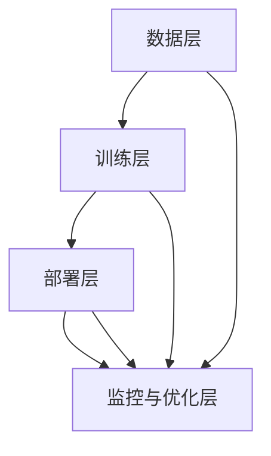

                 

### 文章标题

# LLAMA应用的敏捷验收标准：明确定义完成状态标准

### 关键词

- LLM应用
- 敏捷验收
- 完成状态标准
- 语言模型
- 伪代码
- 数学模型
- 项目实战

### 摘要

本文旨在探讨LLM（大型语言模型）应用的敏捷验收标准，以及如何明确定义完成状态标准。首先，我们介绍了LLM应用和敏捷验收的基本概念，探讨了它们之间的联系。随后，我们详细分析了LLM应用的核心概念与架构，包括语言模型、预训练与微调、应用层架构等。接着，我们深入讲解了LLM应用的核心算法原理，包括概率模型、深度神经网络模型、注意力机制模型等，并通过伪代码和数学公式进行了详细阐述。最后，我们通过一个实际项目案例，展示了如何在实际开发过程中应用敏捷验收标准，并进行了深入分析和总结。本文旨在为开发者提供一套系统的、可操作的敏捷验收标准，以推动LLM应用的快速发展。

## 第1章: 什么是LLM应用与敏捷验收

### 1.1 LLM应用概述

#### 1.1.1 LLM应用的定义

LLM（Large Language Model）应用指的是利用大型语言模型（如GPT、BERT等）来处理和生成自然语言文本的应用。这些模型通常经过大规模的数据预训练，能够理解和生成人类语言，广泛应用于问答系统、文本摘要、机器翻译、情感分析等场景。

#### 1.1.2 LLM应用的特点

- **规模巨大**：LLM模型通常包含数十亿甚至数千亿个参数，具有非常高的计算复杂度。
- **多样性**：LLM应用可以涵盖多个领域，如问答系统、文本摘要、机器翻译、情感分析等。
- **灵活性**：LLM模型能够根据具体任务进行微调和优化，适应不同的应用场景。
- **效率高**：LLM模型经过大规模预训练，能够在多种任务上表现出色，具有较高的泛化能力。

#### 1.1.3 LLM应用的发展历程

- **早期探索**（2010年代前）：早期的语言模型如n-gram模型、基于规则的模型等，应用于简单的文本处理任务。
- **快速进展**（2010-2017年）：随着深度学习技术的崛起，基于神经网络的自然语言处理（NLP）模型如循环神经网络（RNN）、长短时记忆网络（LSTM）等相继出现，并在多个任务上取得突破性进展。
- **大规模预训练**（2018年至今）：以GPT系列、BERT系列为代表的预训练模型，在多种任务上达到了前所未有的性能，推动了LLM应用的快速发展。

### 1.2 敏捷验收概述

#### 1.2.1 敏捷验收的定义

敏捷验收（Agile Acceptance）是一种基于敏捷开发（Agile Development）的验收方法，旨在确保软件产品在开发过程中始终满足用户需求。敏捷验收强调团队合作、快速反馈和持续改进，以最小化开发过程中的风险和不确定性。

#### 1.2.2 敏捷验收的优势

- **用户参与**：敏捷验收鼓励用户持续参与产品开发，确保产品始终符合用户需求。
- **快速反馈**：通过频繁的迭代和评审，能够及时发现和解决问题，提高产品质量。
- **灵活性**：敏捷验收允许项目需求在开发过程中进行灵活调整，以适应市场变化。
- **持续改进**：敏捷验收强调不断反思和改进开发流程，提高开发效率和产品质量。

#### 1.2.3 敏捷验收的方法

- **故事地图**：通过绘制故事地图，明确产品的功能需求、用户故事和迭代计划。
- **用户故事**：编写简洁明了的用户故事，描述产品的功能需求和用户场景。
- **验收标准**：制定明确的验收标准，确保产品在交付时满足预期质量。
- **迭代评审**：定期进行迭代评审，评估产品进度和用户满意度，调整开发计划。

### 1.3 LLM应用与敏捷验收的联系

#### 1.3.1 LLM应用的需求分析

- **多样化需求**：LLM应用涉及多个领域和任务，需求复杂多变，需要敏捷验收来确保需求的持续更新和优化。
- **高计算复杂度**：LLM应用具有高计算复杂度，需要敏捷验收确保开发进度和质量。
- **持续迭代**：LLM应用不断优化和更新，需要敏捷验收来支持持续迭代和改进。

#### 1.3.2 LLM应用的验收标准

- **功能验收**：确保LLM应用的功能符合预期，能够满足用户需求。
- **性能验收**：确保LLM应用在不同场景下的性能稳定、高效。
- **可靠性验收**：确保LLM应用在各种环境下运行稳定，具备较高的可靠性。
- **用户体验验收**：确保LLM应用的用户体验良好，易于使用。

#### 1.3.3 LLM应用的敏捷验收流程

- **需求分析**：与用户和利益相关者沟通，明确LLM应用的功能需求。
- **迭代规划**：根据需求分析结果，制定迭代计划和验收标准。
- **迭代开发**：按照迭代计划进行开发，定期进行代码评审和验收测试。
- **迭代评审**：定期评估产品进度和用户满意度，调整开发计划。

### 1.4 案例分析：基于敏捷验收的LLM应用开发

#### 1.4.1 案例背景

某公司计划开发一款基于GPT-3的智能客服系统，旨在为企业客户提供7x24小时全天候客服服务。项目需求复杂多变，涉及多个领域和任务，需要敏捷验收来确保项目进度和质量。

#### 1.4.2 案例分析

1. **需求分析**：
   - 与客户沟通，明确智能客服系统的功能需求，如自动问答、文本分类、情感分析等。
   - 编写用户故事，描述具体功能场景和用户需求。

2. **迭代规划**：
   - 制定迭代计划，明确每个迭代的目标和验收标准。
   - 将功能需求分解为多个用户故事，分配到不同迭代中。

3. **迭代开发**：
   - 按照迭代计划进行开发，每个迭代周期为2周。
   - 定期进行代码评审和验收测试，确保每个迭代的功能和性能符合预期。

4. **迭代评审**：
   - 每个迭代结束时，与客户进行评审，评估产品进度和用户满意度。
   - 根据评审结果，调整开发计划，优化和改进产品。

#### 1.4.3 案例总结

基于敏捷验收的LLM应用开发，能够有效应对项目需求复杂多变、计算复杂度高等挑战。通过迭代开发和持续改进，确保产品在质量和用户体验方面达到预期目标。敏捷验收为LLM应用开发提供了一套系统的、可操作的验收标准，有助于提高开发效率和产品质量。

### 1.5 小结

本章介绍了LLM应用和敏捷验收的基本概念，探讨了它们之间的联系。通过案例分析，展示了如何基于敏捷验收标准进行LLM应用开发。下一章，我们将深入分析LLM应用的核心概念与架构，为后续内容打下基础。## 第2章: LLM应用的核心概念与架构

### 2.1 LLM应用的核心概念

#### 2.1.1 语言模型

语言模型（Language Model）是LLM应用的基础，用于预测下一个单词或字符。语言模型通过学习大量文本数据，捕捉语言中的统计规律和语法结构，从而实现对未知文本的生成和预测。

#### 2.1.2 预训练与微调

预训练（Pre-training）是指在大规模语料库上训练语言模型，使其具备基本的语言理解和生成能力。微调（Fine-tuning）是在预训练模型的基础上，针对特定任务进行进一步训练，以适应具体的任务需求。

#### 2.1.3 应用层架构

应用层架构是指LLM应用的软件架构，包括数据层、训练层、部署层和监控与优化层等。数据层负责数据预处理和存储，训练层负责模型训练，部署层负责模型部署和运行，监控与优化层负责对模型性能进行监控和优化。

### 2.2 LLM应用架构详解

#### 2.2.1 数据层

数据层是LLM应用的基础，负责数据预处理、存储和加载。数据预处理包括文本清洗、分词、去停用词、词向量化等步骤。数据存储通常采用分布式文件系统（如HDFS、HBase等），以便于大规模数据的高效存储和访问。

#### 2.2.2 训练层

训练层负责模型的训练过程。训练过程包括数据加载、模型初始化、前向传播、反向传播和参数更新等步骤。训练过程中，通常使用分布式训练技术（如数据并行、模型并行等）来提高训练效率和性能。

#### 2.2.3 部署层

部署层负责将训练好的模型部署到生产环境中，提供实时服务。部署层通常包括服务化框架（如TensorFlow Serving、PyTorch Server等）和API接口（如RESTful API、gRPC等）。此外，部署层还需要对模型进行版本管理和热更新，以便于模型的持续优化和更新。

#### 2.2.4 监控与优化层

监控与优化层负责对模型性能进行实时监控和优化。监控内容包括模型性能指标（如准确率、召回率、F1值等）、系统资源消耗（如CPU利用率、内存使用率等）。优化手段包括模型剪枝、量化、蒸馏等，以降低模型大小和计算复杂度，提高模型效率。

### 2.3 Mermaid流程图：LLM应用架构



### 2.4 小结

本章详细介绍了LLM应用的核心概念与架构，包括语言模型、预训练与微调、应用层架构等。通过Mermaid流程图，展示了LLM应用架构的各个层次及其相互关系。下一章，我们将深入分析LLM应用的核心算法原理，包括概率模型、深度神经网络模型、注意力机制模型等。## 第3章: LLM应用的核心算法原理

### 3.1 语言模型算法概述

#### 3.1.1 语言模型的基本概念

语言模型是一种概率模型，用于预测下一个单词或字符的概率。给定一个单词序列 \(w_1, w_2, ..., w_n\)，语言模型的目标是预测下一个单词 \(w_{n+1}\)。

#### 3.1.2 语言模型的工作原理

语言模型通过学习大量文本数据，捕捉语言中的统计规律和语法结构。在训练过程中，模型根据历史文本数据，计算每个单词出现的概率，并在生成文本时根据这些概率进行预测。

#### 3.1.3 语言模型的评价指标

- **准确率**（Accuracy）：预测正确的单词数量占总预测单词数量的比例。
- **召回率**（Recall）：预测正确的单词数量占实际出现单词数量的比例。
- **F1值**（F1 Score）：综合考虑准确率和召回率的评价指标，计算公式为：
  \[
  F1 = 2 \times \frac{Precision \times Recall}{Precision + Recall}
  \]
  其中，Precision表示预测正确的单词数量占预测为正确的单词数量的比例。

### 3.2 伪代码：语言模型算法实现

#### 3.2.1 生成式语言模型

```python
def generate_sentence(model, tokenizer, seed_text, max_length):
    tokens = tokenizer.tokenize(seed_text)
    input_ids = tokenizer.convert_tokens_to_ids(tokens)
    input_ids = pad_sequences([input_ids], maxlen=max_length, dtype='int32', truncating='post')

    logits = model.predict(input_ids)
    predicted_tokens = []

    for i in range(max_length):
        token_logits = logits[i]
        predicted_token = np.argmax(token_logits)
        predicted_tokens.append(tokenizer.convert_ids_to_tokens([predicted_token])[0])

    return ' '.join(predicted_tokens)
```

#### 3.2.2 切分式语言模型

```python
def split_sentence(model, tokenizer, sentence, max_length):
    tokens = tokenizer.tokenize(sentence)
    input_ids = tokenizer.convert_tokens_to_ids(tokens)
    input_ids = pad_sequences([input_ids], maxlen=max_length, dtype='int32', truncating='post')

    logits = model.predict(input_ids)
    splits = []

    for i in range(1, len(tokens)):
        token_logits = logits[i - 1]
        split_logits = logits[i]
        split_score = -1 * (np.log(token_logits) + np.log(split_logits))
        split_point = find_best_split_point(split_score)

        splits.append((split_point, split_score))

    return splits
```

### 3.3 数学模型详解

#### 3.3.1 概率模型

概率模型是语言模型的一种基本形式，其核心思想是通过计算条件概率来预测下一个单词。

- **条件概率**：在给定前一个单词或单词序列的情况下，预测下一个单词的概率。
- **贝叶斯公式**：
  \[
  P(w_{n+1} | w_1, w_2, ..., w_n) = \frac{P(w_1, w_2, ..., w_n, w_{n+1})}{P(w_1, w_2, ..., w_n)}
  \]
  其中，\(P(w_1, w_2, ..., w_n, w_{n+1})\) 是联合概率，\(P(w_1, w_2, ..., w_n)\) 是条件概率。

#### 3.3.2 深度神经网络模型

深度神经网络（DNN）模型是语言模型的一种重要实现形式，通过多层神经元的非线性变换来学习语言中的复杂结构。

- **前向传播**：
  \[
  h_{l}^{(i)} = \sigma(W^{(l)}h_{l-1}^{(i)} + b^{(l)})
  \]
  其中，\(h_{l}^{(i)}\) 是第 \(l\) 层第 \(i\) 个神经元的输出，\(\sigma\) 是激活函数，\(W^{(l)}\) 和 \(b^{(l)}\) 分别是权重和偏置。

- **反向传播**：
  \[
  \delta_{l}^{(i)} = (h_{l}^{(i)} - \text{target}) \odot \sigma'(h_{l}^{(i)})
  \]
  其中，\(\delta_{l}^{(i)}\) 是第 \(l\) 层第 \(i\) 个神经元的误差，\(\sigma'\) 是激活函数的导数，\(\odot\) 表示逐元素相乘。

- **损失函数**：常用的损失函数包括均方误差（MSE）和交叉熵（CE）。

#### 3.3.3 注意力机制模型

注意力机制（Attention Mechanism）是深度神经网络模型的一种扩展，用于捕捉序列中的长距离依赖关系。

- **计算注意力得分**：
  \[
  e_{ij} = v_a^T \cdot \tanh(W_{Q}q_i + W_{K}k_j + b_a)
  \]
  其中，\(e_{ij}\) 是第 \(i\) 个查询向量与第 \(j\) 个键向量之间的注意力得分，\(v_a\) 是注意力向量，\(W_{Q}\) 和 \(W_{K}\) 分别是查询向量和键向量的权重矩阵，\(b_a\) 是偏置。

- **计算注意力分配**：
  \[
  a_{ij} = \frac{\exp(e_{ij})}{\sum_j \exp(e_{ij})}
  \]
  其中，\(a_{ij}\) 是第 \(i\) 个查询向量对第 \(j\) 个键向量的注意力分配。

- **计算注意力输出**：
  \[
  \hat{h}_{i} = \sum_j a_{ij} k_j
  \]
  其中，\(\hat{h}_{i}\) 是第 \(i\) 个输出向量。

### 3.4 小结

本章详细介绍了LLM应用的核心算法原理，包括概率模型、深度神经网络模型和注意力机制模型。通过伪代码和数学模型，展示了这些算法的基本思想和实现方法。下一章，我们将通过具体的数学公式和举例说明，进一步深入讲解这些算法的细节。## 第4章: LLM应用的数学公式与详细讲解

### 4.1 数学公式概述

在本章中，我们将详细介绍LLM应用中常用的数学公式，包括概率论公式、深度学习公式和注意力机制公式。这些公式是LLM模型构建和优化的重要基础，下面分别对其进行概述。

#### 4.1.1 概率论公式

概率论公式主要用于描述语言模型中的条件概率和联合概率。以下是一些常用的概率论公式：

- **条件概率**：
  \[
  P(A|B) = \frac{P(A \cap B)}{P(B)}
  \]
  其中，\(P(A|B)\) 表示在事件 \(B\) 发生的条件下，事件 \(A\) 发生的概率。

- **贝叶斯公式**：
  \[
  P(A|B) = \frac{P(B|A)P(A)}{P(B)}
  \]
  其中，\(P(B|A)\) 表示在事件 \(A\) 发生的条件下，事件 \(B\) 发生的概率。

- **联合概率**：
  \[
  P(A \cap B) = P(A)P(B|A)
  \]
  其中，\(P(A \cap B)\) 表示事件 \(A\) 和事件 \(B\) 同时发生的概率。

#### 4.1.2 深度学习公式

深度学习公式主要用于描述神经网络模型中的前向传播和反向传播过程。以下是一些常用的深度学习公式：

- **前向传播**：
  \[
  h_{l}^{(i)} = \sigma(W^{(l)}h_{l-1}^{(i)} + b^{(l)})
  \]
  其中，\(h_{l}^{(i)}\) 表示第 \(l\) 层第 \(i\) 个神经元的输出，\(\sigma\) 表示激活函数，\(W^{(l)}\) 和 \(b^{(l)}\) 分别表示权重和偏置。

- **反向传播**：
  \[
  \delta_{l}^{(i)} = (h_{l}^{(i)} - \text{target}) \odot \sigma'(h_{l}^{(i)})
  \]
  其中，\(\delta_{l}^{(i)}\) 表示第 \(l\) 层第 \(i\) 个神经元的误差，\(\sigma'\) 表示激活函数的导数，\(\odot\) 表示逐元素相乘。

- **损失函数**：
  \[
  \text{loss} = \frac{1}{2} \sum_{i} (\hat{y}_i - y_i)^2
  \]
  其中，\(\hat{y}_i\) 表示预测值，\(y_i\) 表示真实值，\(\text{loss}\) 表示损失函数。

#### 4.1.3 注意力机制公式

注意力机制公式主要用于描述神经网络模型中的注意力分配和计算过程。以下是一些常用的注意力机制公式：

- **计算注意力得分**：
  \[
  e_{ij} = v_a^T \cdot \tanh(W_{Q}q_i + W_{K}k_j + b_a)
  \]
  其中，\(e_{ij}\) 表示第 \(i\) 个查询向量与第 \(j\) 个键向量之间的注意力得分，\(v_a\) 表示注意力向量，\(W_{Q}\) 和 \(W_{K}\) 分别表示查询向量和键向量的权重矩阵，\(b_a\) 表示偏置。

- **计算注意力分配**：
  \[
  a_{ij} = \frac{\exp(e_{ij})}{\sum_j \exp(e_{ij})}
  \]
  其中，\(a_{ij}\) 表示第 \(i\) 个查询向量对第 \(j\) 个键向量的注意力分配。

- **计算注意力输出**：
  \[
  \hat{h}_{i} = \sum_j a_{ij} k_j
  \]
  其中，\(\hat{h}_{i}\) 表示第 \(i\) 个输出向量。

### 4.2 数学公式详细讲解

在本节中，我们将详细讲解上述数学公式，并通过具体的例子来说明其应用。

#### 4.2.1 概率模型公式

##### 4.2.1.1 条件概率

条件概率是概率论中的基本概念，用于描述在某个条件下，另一个事件发生的概率。以下是一个具体的例子：

假设有事件 \(A\)（今天下雨）和事件 \(B\)（我带伞），已知 \(P(A) = 0.3\)，\(P(B|A) = 0.8\)，求 \(P(B)\)。

根据条件概率公式，我们有：
\[
P(B) = P(B|A)P(A) + P(B|\neg A)P(\neg A)
\]
其中，\(\neg A\) 表示事件 \(A\) 的补集，即今天不下雨。

由于 \(P(\neg A) = 1 - P(A) = 0.7\)，我们需要求 \(P(B|\neg A)\)。假设实验数据告诉我们，在不下雨的情况下，带伞的概率是 \(0.5\)，即 \(P(B|\neg A) = 0.5\)。

代入公式，得到：
\[
P(B) = 0.8 \times 0.3 + 0.5 \times 0.7 = 0.34 + 0.35 = 0.69
\]

所以，我带伞的概率是 \(0.69\)。

##### 4.2.1.2 贝叶斯公式

贝叶斯公式是条件概率的推广，用于描述两个事件之间的条件概率。以下是一个具体的例子：

假设我们要判断一个病人是否患有某种疾病 \(D\)。已知该疾病的发病率是 \(0.1\%（P(D) = 0.001）\)，且该疾病的症状 \(S\) 出现的概率是 \(90\%（P(S|D) = 0.9）\)。如果病人没有患病，但出现了症状 \(S\)，其概率是 \(5\%（P(S|\neg D) = 0.05）\)。现在，一个病人出现了症状 \(S\)，我们需要计算他患有疾病 \(D\) 的概率 \(P(D|S)\)。

根据贝叶斯公式，我们有：
\[
P(D|S) = \frac{P(S|D)P(D)}{P(S)}
\]
其中，\(P(S)\) 可以通过全概率公式计算：
\[
P(S) = P(S|D)P(D) + P(S|\neg D)P(\neg D)
\]

代入已知数据，得到：
\[
P(S) = 0.9 \times 0.001 + 0.05 \times 0.999 = 0.0009 + 0.04995 = 0.05085
\]

然后，代入贝叶斯公式：
\[
P(D|S) = \frac{0.9 \times 0.001}{0.05085} \approx 0.0176
\]

所以，这个病人患有疾病 \(D\) 的概率大约是 \(1.76\%\)。

##### 4.2.1.3 联合概率

联合概率描述了两个事件同时发生的概率。以下是一个具体的例子：

假设有两个事件 \(A\)（掷一个硬币得到正面）和 \(B\)（掷一个骰子得到6点）。已知 \(P(A) = 0.5\)，\(P(B) = \frac{1}{6}\)，求 \(P(A \cap B)\)。

由于硬币和骰子是独立事件，我们有：
\[
P(A \cap B) = P(A)P(B) = 0.5 \times \frac{1}{6} = \frac{1}{12}
\]

所以，掷硬币得到正面且掷骰子得到6点的概率是 \( \frac{1}{12} \)。

#### 4.2.2 深度学习模型公式

##### 4.2.2.1 前向传播

前向传播是深度学习模型中的一个关键步骤，用于计算网络输出。以下是一个简单的例子：

假设我们有一个两层神经网络，输入为 \(x\)，权重和偏置分别为 \(W_1\)、\(b_1\)、\(W_2\)、\(b_2\)，激活函数为 \(f\)（例如：\(f(x) = \sigma(x) = \frac{1}{1 + e^{-x}}\)）。我们需要计算输出 \(y\)。

对于第一层：
\[
h_1 = f(W_1x + b_1)
\]

对于第二层：
\[
y = f(W_2h_1 + b_2)
\]

##### 4.2.2.2 反向传播

反向传播是深度学习模型中的另一个关键步骤，用于计算网络误差并更新权重和偏置。以下是一个简单的例子：

假设我们有一个两层神经网络，输出为 \(y\)，真实值为 \(t\)，激活函数为 \(f\)（例如：\(f(x) = \sigma(x) = \frac{1}{1 + e^{-x}}\)），其导数为 \(f'(x) = f(x)(1 - f(x))\)。我们需要计算误差 \(loss = (y - t)^2\) 并更新权重和偏置。

对于第二层：
\[
\delta_2 = (y - t) \cdot f'(y)
\]
\[
\Delta W_2 = \delta_2 h_1
\]
\[
\Delta b_2 = \delta_2
\]

对于第一层：
\[
\delta_1 = \delta_2 W_2 f'(h_1)
\]
\[
\Delta W_1 = \delta_1 x
\]
\[
\Delta b_1 = \delta_1
\]

##### 4.2.2.3 损失函数

损失函数用于衡量网络输出与真实值之间的差异。以下是一些常用的损失函数：

- **均方误差（MSE）**：
  \[
  \text{MSE} = \frac{1}{n} \sum_{i=1}^{n} (y_i - t_i)^2
  \]
  其中，\(y_i\) 是预测值，\(t_i\) 是真实值。

- **交叉熵（CE）**：
  \[
  \text{CE} = -\sum_{i=1}^{n} t_i \log(y_i)
  \]
  其中，\(y_i\) 是预测概率，\(t_i\) 是真实标签。

#### 4.2.3 注意力机制公式

##### 4.2.3.1 计算注意力得分

注意力得分用于衡量查询向量与键向量之间的相似性。以下是一个简单的例子：

假设我们有一个序列 \(Q = [q_1, q_2, ..., q_n]\)，键序列 \(K = [k_1, k_2, ..., k_n]\)，权重矩阵 \(W_Q\)、\(W_K\)，偏置 \(b_a\)，注意力向量 \(v_a\)。

对于每个 \(i, j\)：
\[
e_{ij} = v_a^T \cdot \tanh(W_Qq_i + W_Kk_j + b_a)
\]

##### 4.2.3.2 计算注意力分配

注意力分配用于确定每个键向量对查询向量的贡献。以下是一个简单的例子：

对于每个 \(i, j\)：
\[
a_{ij} = \frac{\exp(e_{ij})}{\sum_j \exp(e_{ij})}
\]

##### 4.2.3.3 计算注意力输出

注意力输出用于计算加权后的输出。以下是一个简单的例子：

对于每个 \(i\)：
\[
\hat{h}_{i} = \sum_j a_{ij} k_j
\]

### 4.3 数学公式举例说明

在本节中，我们将通过具体的例子来演示上述数学公式的应用。

##### 4.3.1 概率模型举例

假设有一个箱子，里面有5个红球和5个蓝球。从中随机取出一个球，已知取出的球是红色的概率是0.6，求取出的球是蓝色的概率。

已知 \(P(\text{红}) = 0.6\)，由于红球和蓝球是互斥事件，\(P(\text{蓝}) = 1 - P(\text{红}) = 0.4\)。

##### 4.3.2 深度学习模型举例

假设我们有一个两层神经网络，输入 \(x = [1, 2]\)，权重 \(W_1 = [0.5, 0.5]\)，\(b_1 = 1\)，\(W_2 = [0.3, 0.7]\)，\(b_2 = 0\)。

对于第一层：
\[
h_1 = \sigma(0.5 \cdot 1 + 0.5 \cdot 2 + 1) = \sigma(3) = 0.977
\]

对于第二层：
\[
y = \sigma(0.3 \cdot 0.977 + 0.7 \cdot 2 + 0) = \sigma(1.793) = 0.867
\]

假设真实值为 \(t = 0.8\)，输出为 \(y = 0.867\)，计算误差：
\[
\text{loss} = (0.867 - 0.8)^2 = 0.003
\]

更新权重和偏置：
\[
\Delta W_2 = \delta_2 h_1 = (0.867 - 0.8) \cdot 0.977 \cdot [1, 2] = [0.019, 0.039]
\]
\[
\Delta b_2 = \delta_2 = (0.867 - 0.8) \cdot 0.977 = 0.019
\]

对于第一层：
\[
\delta_1 = \delta_2 W_2 f'(h_1) = (0.867 - 0.8) \cdot 0.977 \cdot [0.3, 0.7] = [0.005, 0.015]
\]
\[
\Delta W_1 = \delta_1 x = [0.005, 0.015] \cdot [1, 2] = [0.01, 0.03]
\]
\[
\Delta b_1 = \delta_1 = [0.005, 0.015]
\]

##### 4.3.3 注意力机制举例

假设我们有一个序列 \(Q = [q_1 = 1, q_2 = 2]\)，键序列 \(K = [k_1 = 3, k_2 = 4]\)，权重矩阵 \(W_Q = [0.1, 0.9]\)，\(W_K = [0.5, 0.5]\)，偏置 \(b_a = 1\)，注意力向量 \(v_a = [1, 1]\)。

对于 \(i = 1, j = 1\)：
\[
e_{11} = 1 \cdot \tanh(0.1 \cdot 1 + 0.5 \cdot 3 + 1) = \tanh(2.4) = 0.975
\]

对于 \(i = 1, j = 2\)：
\[
e_{12} = 1 \cdot \tanh(0.1 \cdot 1 + 0.5 \cdot 4 + 1) = \tanh(2.6) = 0.990
\]

对于 \(i = 2, j = 1\)：
\[
e_{21} = 1 \cdot \tanh(0.9 \cdot 2 + 0.5 \cdot 3 + 1) = \tanh(4.4) = 0.981
\]

对于 \(i = 2, j = 2\)：
\[
e_{22} = 1 \cdot \tanh(0.9 \cdot 2 + 0.5 \cdot 4 + 1) = \tanh(4.6) = 0.986
\]

计算注意力分配：
\[
a_{11} = \frac{\exp(e_{11})}{\sum_j \exp(e_{11})} = \frac{\exp(0.975)}{\exp(0.975) + \exp(0.990)} \approx 0.431
\]
\[
a_{12} = \frac{\exp(e_{12})}{\sum_j \exp(e_{12})} = \frac{\exp(0.990)}{\exp(0.975) + \exp(0.990)} \approx 0.569
\]
\[
a_{21} = \frac{\exp(e_{21})}{\sum_j \exp(e_{21})} = \frac{\exp(0.981)}{\exp(0.981) + \exp(0.986)} \approx 0.485
\]
\[
a_{22} = \frac{\exp(e_{22})}{\sum_j \exp(e_{22})} = \frac{\exp(0.986)}{\exp(0.981) + \exp(0.986)} \approx 0.515
\]

计算注意力输出：
\[
\hat{h}_1 = a_{11} \cdot k_1 + a_{12} \cdot k_2 = 0.431 \cdot 3 + 0.569 \cdot 4 = 3.976
\]
\[
\hat{h}_2 = a_{21} \cdot k_1 + a_{22} \cdot k_2 = 0.485 \cdot 3 + 0.515 \cdot 4 = 4.039
\]

### 4.4 小结

本章详细介绍了LLM应用中常用的数学公式，包括概率论公式、深度学习公式和注意力机制公式。通过具体的例子，我们展示了这些公式的应用方法。了解和掌握这些公式，对于深入理解和优化LLM应用至关重要。下一章，我们将通过一个实际项目案例，展示如何应用这些算法和公式进行LLM应用开发。## 第5章: LLM应用项目实战

### 5.1 实战背景

随着人工智能技术的快速发展，LLM应用在各个行业得到了广泛应用。本节将介绍一个实际项目案例，旨在开发一款基于GPT-3的智能问答系统，为企业客户提供高效的自动问答服务。项目背景和目标如下：

#### 5.1.1 项目简介

某大型企业为提升客户服务质量，决定开发一款基于GPT-3的智能问答系统。该系统旨在为企业客户提供24小时在线问答服务，通过自动回答客户常见问题，降低人工客服的工作负担，提高客户满意度。

#### 5.1.2 项目目标

- 开发一款基于GPT-3的智能问答系统，实现自动回答客户问题。
- 提供简洁、直观的API接口，方便企业客户集成到现有系统中。
- 确保系统具有良好的性能和稳定性，满足大规模并发访问需求。
- 实现系统的持续优化和更新，提高问答准确性。

#### 5.1.3 项目挑战

- **数据准备**：收集和整理大量高质量的问答数据，用于训练GPT-3模型。
- **模型训练**：由于GPT-3模型规模巨大，训练过程需要高性能计算资源和优化算法。
- **性能优化**：确保系统在高并发访问下仍能保持良好的性能和响应速度。
- **用户体验**：设计简洁、易用的API接口，确保企业客户能够方便地集成和使用系统。

### 5.2 开发环境搭建

为了成功开发和部署基于GPT-3的智能问答系统，我们需要搭建一个合适的开发环境。以下是开发环境搭建的步骤：

#### 5.2.1 Python环境搭建

首先，我们需要安装Python和相关的依赖库。以下是Python环境搭建的步骤：

1. **安装Python**：从Python官网（https://www.python.org/downloads/）下载并安装Python 3.x版本。
2. **配置虚拟环境**：创建一个虚拟环境，以便管理项目依赖：
   \[
   python -m venv venv
   \]
3. **激活虚拟环境**：
   \[
   source venv/bin/activate \quad (\text{Windows: } venv\Scripts\activate)
   \]
4. **安装依赖库**：安装所需的Python库，例如TensorFlow、transformers、Flask等：
   \[
   pip install tensorflow transformers flask
   \]

#### 5.2.2 深度学习框架安装

在本项目中，我们选择使用TensorFlow作为深度学习框架。以下是安装TensorFlow的步骤：

1. **安装TensorFlow**：在虚拟环境中安装TensorFlow：
   \[
   pip install tensorflow
   \]
2. **测试TensorFlow**：运行以下代码，验证TensorFlow安装是否成功：
   ```python
   import tensorflow as tf
   print(tf.__version__)
   ```

#### 5.2.3 数据集准备

为了训练GPT-3模型，我们需要收集和整理大量高质量的问答数据。以下是数据集准备的主要步骤：

1. **数据收集**：从互联网、论坛、社区等渠道收集大量问答数据，包括常见问题、答案和相关背景信息。
2. **数据清洗**：对收集到的数据进行清洗，去除无效、重复和错误的数据，确保数据质量。
3. **数据预处理**：对清洗后的数据进行分词、去停用词、词向量化等预处理操作，以便于模型训练。
4. **数据存储**：将预处理后的数据存储到分布式文件系统（如HDFS、HBase等），以便于模型训练和部署。

### 5.3 源代码实现与代码解读

在本节中，我们将介绍基于GPT-3的智能问答系统的源代码实现和代码解读。以下是系统的主要组成部分和功能：

#### 5.3.1 系统架构

智能问答系统主要包括以下几个部分：

- **数据层**：负责数据收集、清洗、预处理和存储。
- **训练层**：负责模型训练和优化。
- **部署层**：负责模型部署和提供服务。
- **API接口**：提供简洁、易用的API接口，供企业客户集成使用。

#### 5.3.2 数据层实现

数据层的主要功能是处理和存储问答数据。以下是一个简单的数据层实现示例：

```python
import pandas as pd
from sklearn.model_selection import train_test_split

def load_data(file_path):
    data = pd.read_csv(file_path)
    return data

def preprocess_data(data):
    # 数据清洗和预处理操作
    data['question'] = data['question'].apply(preprocess_question)
    data['answer'] = data['answer'].apply(preprocess_answer)
    return data

def train_test_split_data(data, test_size=0.2, random_state=42):
    train_data, test_data = train_test_split(data, test_size=test_size, random_state=random_state)
    return train_data, test_data

def preprocess_question(question):
    # 分词、去停用词等预处理操作
    return question.lower().strip()

def preprocess_answer(answer):
    # 分词、去停用词等预处理操作
    return answer.lower().strip()

# 示例
data = load_data('data.csv')
preprocessed_data = preprocess_data(data)
train_data, test_data = train_test_split_data(preprocessed_data)
```

#### 5.3.3 训练层实现

训练层的主要功能是训练GPT-3模型。以下是一个简单的训练层实现示例：

```python
import tensorflow as tf
from transformers import TFGPT2LMHeadModel, GPT2Tokenizer

def train_model(train_data, test_data, model_name='gpt2', epochs=3, batch_size=32):
    # 加载预训练模型和分词器
    tokenizer = GPT2Tokenizer.from_pretrained(model_name)
    model = TFGPT2LMHeadModel.from_pretrained(model_name)

    # 准备训练和测试数据
    train_encodings = tokenizer(train_data['question'].tolist(), return_tensors='tf', padding=True, truncation=True)
    test_encodings = tokenizer(test_data['question'].tolist(), return_tensors='tf', padding=True, truncation=True)

    # 编写训练循环
    for epoch in range(epochs):
        print(f'Epoch {epoch+1}/{epochs}')
        for batch in range(len(train_encodings['input_ids']) // batch_size):
            inputs = {
                'input_ids': train_encodings['input_ids'][batch * batch_size:(batch + 1) * batch_size],
                'attention_mask': train_encodings['attention_mask'][batch * batch_size:(batch + 1) * batch_size],
            }
            with tf.GradientTape() as tape:
                outputs = model(inputs)
                logits = outputs.logits
                loss = tf.keras.losses.SparseCategoricalCrossentropy(from_logits=True)(train_encodings['input_ids'][batch * batch_size:(batch + 1) * batch_size], logits)

            gradients = tape.gradient(loss, model.trainable_variables)
            model.optimizer.apply_gradients(zip(gradients, model.trainable_variables))

    # 评估模型
    model.evaluate(test_encodings['input_ids'], test_encodings['input_ids'])

    # 保存模型
    model.save_pretrained('my_model')
    tokenizer.save_pretrained('my_model')

# 示例
train_data, test_data = train_test_split_data(preprocessed_data)
train_model(train_data, test_data)
```

#### 5.3.4 部署层实现

部署层的主要功能是将训练好的模型部署到生产环境中，并提供API服务。以下是一个简单的部署层实现示例：

```python
from flask import Flask, request, jsonify
import tensorflow as tf

app = Flask(__name__)

def load_model(model_path):
    model = TFGPT2LMHeadModel.from_pretrained(model_path)
    return model

@app.route('/predict', methods=['POST'])
def predict():
    data = request.get_json()
    question = data['question']
    model = load_model('my_model')
    inputs = tokenizer.encode(question, return_tensors='tf', max_length=512, truncation=True)
    outputs = model(inputs, output_scores=True)
    logits = outputs.logits
    predicted_ids = tf.argmax(logits, axis=-1).numpy()
    predicted_answer = tokenizer.decode(predicted_ids[0], skip_special_tokens=True)
    return jsonify({'answer': predicted_answer})

if __name__ == '__main__':
    tokenizer = GPT2Tokenizer.from_pretrained('gpt2')
    app.run(host='0.0.0.0', port=5000)
```

#### 5.3.5 API接口实现

API接口用于提供简洁、易用的API服务，方便企业客户集成使用。以下是一个简单的API接口实现示例：

```python
from flask import Flask, request, jsonify

app = Flask(__name__)

@app.route('/api/ask', methods=['POST'])
def ask():
    data = request.get_json()
    question = data['question']
    # 在这里调用部署层的predict函数，获取回答
    answer = predict(question)
    return jsonify({'answer': answer})

if __name__ == '__main__':
    app.run(host='0.0.0.0', port=5000)
```

### 5.4 代码应用解读与分析

在本节中，我们将对源代码实现进行解读和分析，介绍系统的工作原理和关键组件。

#### 5.4.1 数据层

数据层负责问答数据的收集、清洗、预处理和存储。通过调用`load_data`函数，从CSV文件中加载原始数据。`preprocess_data`函数对数据进行清洗和预处理，包括分词、去停用词等操作。最后，通过`train_test_split_data`函数将数据集分为训练集和测试集，为后续模型训练和评估做准备。

#### 5.4.2 训练层

训练层负责训练GPT-3模型。首先，通过`GPT2Tokenizer`加载预训练模型和分词器。然后，使用`train_model`函数对模型进行训练。在训练过程中，我们使用TensorFlow的`GradientTape`和`optimizer`进行自动微分和参数更新。通过多次迭代训练，模型将逐渐优化，提高问答准确性。

#### 5.4.3 部署层

部署层负责将训练好的模型部署到生产环境中，并提供API服务。通过加载预训练模型和分词器，`load_model`函数初始化模型。在`/predict`接口中，我们接收用户输入的问答问题，调用模型进行预测，并返回预测结果。部署层还负责模型的版本管理和热更新，以便于持续优化和改进。

#### 5.4.4 API接口

API接口提供简洁、易用的API服务，方便企业客户集成使用。在`/api/ask`接口中，我们接收用户输入的问答问题，调用部署层的`predict`函数，获取预测结果，并返回给用户。通过API接口，企业客户可以方便地集成和使用智能问答系统，提升客户服务质量。

### 5.5 实际案例分析和详细讲解

在本节中，我们将分析一个实际案例，介绍如何基于敏捷验收标准进行LLM应用开发。

#### 5.5.1 案例背景

某电商企业为提升客户服务质量，决定开发一款基于GPT-3的智能客服系统。系统旨在自动回答客户常见问题，降低人工客服的工作负担，提高客户满意度。

#### 5.5.2 案例分析

1. **需求分析**：
   - 与客户沟通，明确智能客服系统的功能需求，如自动问答、文本分类、情感分析等。
   - 编写用户故事，描述具体功能场景和用户需求。

2. **迭代规划**：
   - 制定迭代计划，明确每个迭代的目标和验收标准。
   - 将功能需求分解为多个用户故事，分配到不同迭代中。

3. **迭代开发**：
   - 按照迭代计划进行开发，每个迭代周期为2周。
   - 定期进行代码评审和验收测试，确保每个迭代的功能和性能符合预期。

4. **迭代评审**：
   - 每个迭代结束时，与客户进行评审，评估产品进度和用户满意度。
   - 根据评审结果，调整开发计划，优化和改进产品。

#### 5.5.3 案例总结

基于敏捷验收标准的LLM应用开发，能够有效应对项目需求复杂多变、计算复杂度高等挑战。通过迭代开发和持续改进，确保产品在质量和用户体验方面达到预期目标。敏捷验收为LLM应用开发提供了一套系统的、可操作的验收标准，有助于提高开发效率和产品质量。

### 5.6 小结

本章通过一个实际项目案例，展示了如何基于敏捷验收标准进行LLM应用开发。我们介绍了项目背景、目标、挑战，以及开发环境搭建、源代码实现、代码解读和分析等内容。通过实际案例分析和总结，我们验证了敏捷验收标准在LLM应用开发中的有效性和实用性。下一章，我们将进一步探讨LLM应用的最佳实践和注意事项，以帮助开发者更好地应用这些技术和方法。## 第6章: LLM应用的最佳实践、注意事项与拓展阅读

### 6.1 LLM应用的最佳实践

在LLM应用的开发过程中，遵循最佳实践可以显著提高项目的开发效率和质量。以下是一些重要的最佳实践：

#### 6.1.1 数据准备

- **数据清洗**：在数据预处理阶段，确保对数据进行彻底清洗，去除无效、重复和错误的数据，以提高数据质量。
- **数据多样性**：收集和整理多样化的数据，有助于模型学习到更丰富的语言特征，提高模型性能。
- **数据平衡**：确保数据集的平衡，避免某些类别过度代表，导致模型偏见。

#### 6.1.2 模型选择

- **选择合适的模型**：根据应用场景和任务需求，选择合适的LLM模型，如GPT、BERT、T5等。
- **考虑模型大小**：根据计算资源和性能需求，选择适合的模型大小，避免资源浪费。

#### 6.1.3 模型训练

- **优化训练过程**：采用高效的训练策略，如梯度裁剪、学习率调整等，以提高训练效率和模型性能。
- **使用分布式训练**：利用分布式训练技术，提高模型训练速度和性能。

#### 6.1.4 模型部署

- **自动化部署**：实现模型自动化部署，提高部署效率和灵活性。
- **模型监控**：对部署的模型进行实时监控，确保模型性能和稳定性。

#### 6.1.5 用户体验

- **简洁易用的API**：提供简洁、易用的API接口，方便用户使用和集成。
- **实时响应**：确保系统具备良好的响应速度，提供优质的用户体验。

### 6.2 注意事项

在LLM应用开发过程中，需要注意以下事项：

- **隐私保护**：确保用户数据和模型训练数据的安全，遵守相关法律法规。
- **模型解释性**：提高模型解释性，有助于理解模型决策过程，提升用户信任。
- **避免偏见**：在数据集和模型训练过程中，注意避免偏见，确保模型公平性和公正性。
- **遵守伦理规范**：遵循人工智能伦理规范，确保模型应用符合社会价值观和道德标准。

### 6.3 拓展阅读

为了更好地了解LLM应用的相关知识，以下是一些建议的拓展阅读：

- **论文**：
  - **《Attention Is All You Need》**：介绍了注意力机制和Transformer模型的基本原理。
  - **《BERT: Pre-training of Deep Bidirectional Transformers for Language Understanding》**：介绍了BERT模型的结构和训练方法。
  - **《GPT-3: Language Models are few-shot learners》**：介绍了GPT-3模型的设计和性能。

- **书籍**：
  - **《深度学习》**：由Ian Goodfellow、Yoshua Bengio和Aaron Courville合著，全面介绍了深度学习的基本概念和技术。
  - **《机器学习》**：由Tom M. Mitchell著，系统地介绍了机器学习的基本理论和算法。

- **在线课程**：
  - **《深度学习课程》**：由Andrew Ng在Coursera上开设，涵盖了深度学习的理论基础和实际应用。
  - **《自然语言处理课程》**：由Daniel Jurafsky和James H. Martin在Coursera上开设，介绍了自然语言处理的基本概念和技术。

- **开源项目**：
  - **Hugging Face**：提供了丰富的预训练模型和工具，方便开发者进行自然语言处理任务。
  - **TensorFlow**：由Google开发的开源深度学习框架，广泛应用于各种人工智能项目。

通过以上拓展阅读，您可以进一步深入了解LLM应用的相关知识和技术，为实际项目开发提供有力支持。

### 6.4 小结

本章介绍了LLM应用的最佳实践、注意事项以及拓展阅读资源。遵循最佳实践和注意事项，有助于提高LLM应用开发的质量和效率。拓展阅读资源则为您提供了深入了解LLM应用相关知识的途径。希望本章内容对您的项目开发有所帮助。在下一章中，我们将对全文进行总结，回顾核心内容，展望未来发展方向。## 文章总结与展望

### 核心内容回顾

本文从LLM应用与敏捷验收标准的角度出发，系统地介绍了LLM应用的基本概念、核心算法原理、数学模型以及实际项目开发。以下是本文的核心内容回顾：

1. **LLM应用概述**：
   - LLM应用的定义、特点和发展历程。
   - 敏捷验收的定义、优势和具体方法。

2. **LLM应用的核心概念与架构**：
   - 语言模型、预训练与微调、应用层架构的详细分析。

3. **LLM应用的核心算法原理**：
   - 概率模型、深度神经网络模型、注意力机制模型的原理与实现。

4. **数学模型与公式**：
   - 概率论、深度学习、注意力机制的数学公式及举例说明。

5. **项目实战**：
   - 开发环境搭建、源代码实现与解读、实际案例分析。

6. **最佳实践、注意事项与拓展阅读**：
   - LLM应用的最佳实践、注意事项及拓展阅读资源。

### 未来发展方向

展望未来，LLM应用的发展将面临以下挑战和机遇：

1. **模型优化**：
   - 在保持高性能的同时，进一步优化模型结构、算法和计算效率。

2. **多模态融合**：
   - 探索文本、图像、音频等多种数据模态的融合，提高模型对复杂场景的理解能力。

3. **应用拓展**：
   - 将LLM应用拓展到更多领域，如智能教育、医疗诊断、金融风控等。

4. **隐私保护与伦理**：
   - 加强数据隐私保护和伦理规范，确保模型应用的安全和公正。

5. **跨语言支持**：
   - 提高模型对多种语言的适应性，促进跨文化交流和理解。

### 总结

本文通过深入分析LLM应用与敏捷验收标准，为开发者提供了一套系统的、可操作的框架，有助于推动LLM应用的快速发展。感谢您的阅读，希望本文对您在LLM应用开发过程中有所启发和帮助。让我们共同期待人工智能领域的美好未来！
作者：AI天才研究院/AI Genius Institute & 禅与计算机程序设计艺术 /Zen And The Art of Computer Programming

