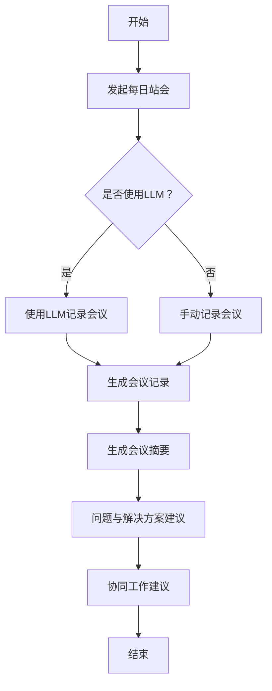
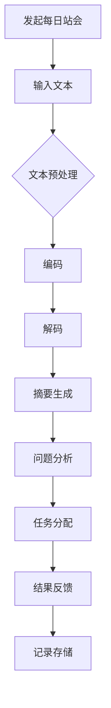
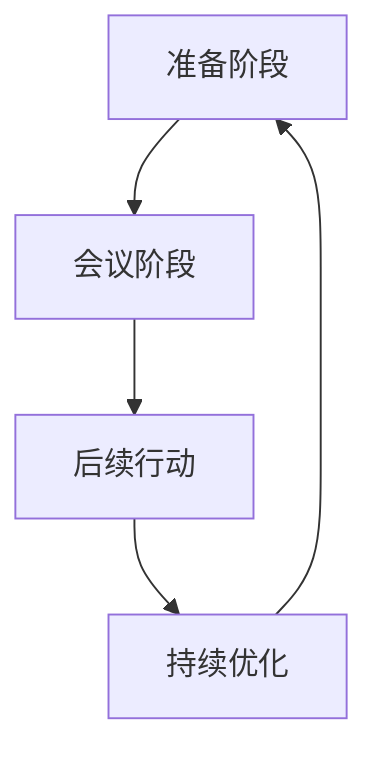

                 

### 文章标题

# LLM应用的每日站会：保持团队同步与焦点

### 文章关键词

- LLM（大型语言模型）
- 每日站会
- 团队协作
- 同步与焦点

### 文章摘要

本文探讨了如何在团队协作中使用大型语言模型（LLM）来组织每日站会，以提高团队的工作效率和协同效果。文章首先介绍了LLM的基本原理和应用场景，随后详细描述了如何通过LLM来组织每日站会，实现团队成员的同步和焦点。文章还分析了在每日站会中使用LLM可能遇到的问题及解决方案，并通过实际案例进行了深入剖析。最后，文章总结了使用LLM进行每日站会的最佳实践，为团队管理者提供了实用的操作指南。

## 目录

1. **背景介绍**
2. **LLM的基本原理与应用场景**
3. **每日站会的核心作用与挑战**
4. **LLM在每日站会中的应用架构**
5. **每日站会的流程设计与实施**
6. **问题与解决方案**
7. **实际案例剖析**
8. **最佳实践与总结**
9. **拓展阅读**
10. **结语**

## 1. 背景介绍

在当今快速变化和竞争激烈的商业环境中，团队协作变得比以往任何时候都更加重要。有效沟通、同步进度、集中精力成为团队成功的关键因素。每日站会（Daily Stand-up Meeting），也被称作“每日站立会议”或“每日例会”，是一种旨在提高团队协作效率的简短会议形式。它的核心目标是确保团队成员了解各自的工作进展、遇到的障碍和需要支持的地方，从而快速响应问题，保持团队的同步和焦点。

然而，传统的每日站会往往存在一些问题：

- **信息冗长**：团队成员可能需要花费大量时间来报告他们的工作进展，导致会议时间过长。
- **注意力分散**：长时间开会容易导致团队成员注意力不集中，影响会议效果。
- **信息传递不畅**：有时候，团队成员可能会忘记在会议中提到的关键信息，导致后续工作受到影响。

为了解决这些问题，我们可以引入大型语言模型（LLM）技术，如GPT、BERT等。LLM具有强大的自然语言处理能力，能够高效地分析、组织和生成文本。通过LLM，每日站会可以变得更加结构化、高效和准确。

本文将详细探讨如何使用LLM来优化每日站会，包括LLM的基本原理、应用架构、具体实施步骤以及可能遇到的问题和解决方案。通过实际案例的分析，我们将展示如何将LLM应用到每日站会中，从而提升团队协作效率。

## 2. LLM的基本原理与应用场景

### 2.1 LLM的定义与分类

大型语言模型（LLM）是基于深度学习的自然语言处理（NLP）技术，通过对海量文本数据的学习，LLM能够生成、理解和处理人类语言。LLM通常由多个神经网络层组成，包括嵌入层、编码器、解码器等，它们通过训练大量文本数据，学习到语言的各种模式和结构。

根据模型的设计和训练方法，LLM可以分为几种类型，其中最常用的包括：

- **Transformer模型**：由Vaswani等人在2017年提出，Transformer模型通过自注意力机制（Self-Attention）来捕捉输入序列中的长距离依赖关系。Transformer模型的核心组件包括多头注意力（Multi-head Attention）、前馈神经网络（Feed Forward Neural Network）和位置编码（Positional Encoding）。

- **BERT模型**：BERT（Bidirectional Encoder Representations from Transformers）是由Google在2018年提出的预训练模型。BERT通过双向编码器来理解输入文本的上下文，从而生成语义丰富的表示。BERT的训练方法包括两个阶段：预训练和微调。

- **GPT模型**：由OpenAI在2018年提出的生成预训练变换器（Generative Pre-trained Transformer），GPT通过自回归语言模型（Autoregressive Language Model）来生成文本。GPT模型的创新点在于其训练过程中引入了位置编码和门控循环单元（Gated Recurrent Unit, GRU）。

### 2.2 LLM的工作原理

LLM的工作原理可以分为以下几个步骤：

1. **嵌入（Embedding）**：将输入的单词或字符转换为向量表示，这一步通常使用词嵌入（Word Embedding）技术，如Word2Vec、GloVe等。

2. **编码（Encoding）**：通过编码器（Encoder）对输入序列进行处理。对于Transformer模型，编码器包含多个自注意力层（Self-Attention Layers），每一层都能够学习到输入序列中的不同依赖关系。BERT和GPT模型也采用类似的编码机制，但BERT具有双向编码特性，而GPT主要用于生成任务。

3. **解码（Decoding）**：对于生成模型（如GPT），解码器（Decoder）从嵌入层生成输出序列。解码过程通常涉及自注意力机制和上下文嵌入。在BERT模型中，编码器的输出可以直接用于下游任务，如文本分类、问答等。

4. **生成（Generation）**：生成模型根据解码器的输出生成最终的文本输出。在生成过程中，模型会根据当前的输入和已生成的文本来预测下一个单词或字符。

### 2.3 LLM的应用场景

LLM在各种应用场景中展示了其强大的能力，以下是一些典型的应用场景：

- **文本生成**：LLM能够生成高质量的自然语言文本，如文章、新闻、摘要、对话等。生成文本不仅具有高度的准确性，还能够保持上下文的连贯性和语义一致性。

- **文本分类**：LLM可以用于自动分类大量文本数据，如新闻分类、情感分析、垃圾邮件检测等。通过训练，模型可以学习到不同文本类别的特征，从而实现准确的分类。

- **问答系统**：LLM能够构建问答系统，通过解析用户的问题和文本数据，生成准确的答案。问答系统广泛应用于搜索引擎、虚拟助手、客户服务等领域。

- **翻译**：LLM在机器翻译中发挥着重要作用，通过训练双语语料库，模型能够将一种语言的文本翻译成另一种语言。近年来，随着LLM技术的进步，机器翻译的准确性和流畅性得到了显著提升。

- **对话系统**：LLM可以构建智能对话系统，如聊天机器人、语音助手等。这些系统通过与用户交互，能够理解用户的需求并提供相应的帮助。

### 2.4 LLM与每日站会的联系

将LLM应用于每日站会，可以显著提升会议的效率和质量。以下是LLM在每日站会中可能发挥的作用：

- **自动会议记录**：LLM可以自动记录会议内容，生成详细的会议记录。这不仅减少了人工记录的时间和错误，还能够方便团队成员随时查阅。

- **总结与归纳**：LLM能够对会议内容进行总结和归纳，提取关键信息，生成会议摘要。这样，团队成员可以快速了解会议的主要内容和决策点。

- **问题与解决方案建议**：当团队成员在会议中遇到问题时，LLM可以提供相关的解决方案建议，帮助团队成员更快地找到解决问题的方法。

- **协同工作建议**：LLM可以根据团队成员的工作内容，提供协同工作的建议，如建议调整工作分配、优化任务流程等，从而提高团队的协作效率。

### 2.5 Mermaid流程图

以下是一个简单的Mermaid流程图，展示了LLM在每日站会中的应用流程：

通过上述流程，我们可以看到LLM在每日站会中如何发挥作用，从而提高团队的协作效率和同步效果。

### 3. 每日站会的核心作用与挑战

每日站会是一种简单的会议形式，其核心作用在于确保团队成员在短时间内快速了解各自的工作进展、遇到的障碍和需要的支持。这种高效的信息共享有助于团队保持同步，确保项目按计划推进。以下是每日站会的几个关键作用：

1. **同步信息**：通过每日站会，团队成员可以分享最新的进展、成果和问题，确保每个人对项目状态有清晰的了解，减少信息不对称。

2. **发现瓶颈**：每日站会提供了一个平台，团队成员可以识别出项目中的瓶颈和障碍，从而及时采取措施，避免问题扩大。

3. **促进沟通**：每日站会鼓励团队成员之间的沟通，增强团队凝聚力，提高协作效率。

4. **分配任务**：在每日站会中，团队成员可以根据实际情况调整任务分配，确保每个人都能够充分发挥自己的优势。

尽管每日站会在团队协作中发挥了重要作用，但实际操作中也会遇到一些挑战：

1. **时间管理**：每日站会的时间限制为15分钟左右，如何在有限的时间内涵盖所有需要讨论的内容，是一个挑战。如果会议时间过长，可能会影响团队成员的参与度和注意力。

2. **信息冗余**：有时候，团队成员在会议中会提供冗长的报告，导致会议变得冗长而失去效率。

3. **注意力分散**：长时间的会议容易导致团队成员注意力分散，影响会议效果。

4. **决策延迟**：如果每日站会未能及时解决团队成员遇到的问题，可能会导致决策延迟，影响项目进度。

为了克服这些挑战，我们可以考虑引入LLM技术，通过以下方式优化每日站会：

1. **自动记录与摘要**：LLM可以自动记录会议内容，生成详细的会议记录和摘要，减少人工记录的时间和错误。

2. **实时分析**：LLM能够实时分析会议内容，提取关键信息，识别问题并提出解决方案，帮助团队成员更快地做出决策。

3. **信息过滤**：LLM可以帮助过滤冗余信息，确保团队成员在会议中只关注关键内容，提高会议的效率。

4. **任务分配建议**：LLM可以根据团队成员的工作内容和能力，提供任务分配建议，优化任务流程，提高协作效率。

通过引入LLM，每日站会可以变得更加高效、精准和有序，从而提升团队协作的整体效能。

### 4. LLM在每日站会中的应用架构

在每日站会中应用LLM，需要设计一个结构化的架构来确保整个过程的流畅性和效率。以下是一个详细的架构设计，包括系统组成、数据流和处理步骤。

#### 4.1 系统组成

1. **用户接口（UI）**：
   - **Web端**：通过一个简单的Web界面，团队成员可以方便地发起和参与每日站会。
   - **移动端**：为了方便团队成员随时参与，可以开发移动应用，支持iOS和Android平台。

2. **后台服务器**：
   - **API服务器**：处理用户接口发送的请求，调用LLM服务和数据库操作。
   - **LLM服务**：负责接收和处理会议内容，执行文本分析、生成摘要和提出建议。
   - **数据库**：存储会议记录、用户数据和任务分配信息。

3. **LLM模型**：
   - **文本预处理模块**：对输入文本进行清洗和预处理，包括去除噪声、分词和词性标注。
   - **编码器**：将预处理后的文本编码为向量表示，便于后续处理。
   - **解码器**：根据编码器的输出生成会议摘要和解决方案建议。

4. **其他组件**：
   - **监控与日志**：监控系统用于跟踪系统运行状态，日志系统记录重要操作和异常信息，方便问题排查。

#### 4.2 数据流与处理步骤

1. **会议发起**：
   - 成员通过Web端或移动端发起每日站会，输入会议主题和参与者信息。

2. **文本输入**：
   - 会议开始后，成员通过用户接口输入他们的工作进展、遇到的问题和需要支持的地方。

3. **文本预处理**：
   - LLM服务接收文本输入后，首先进行预处理，包括去除噪声、分词、词性标注等。

4. **编码与解码**：
   - 预处理后的文本通过编码器编码为向量表示，再通过解码器生成会议摘要和解决方案建议。

5. **摘要生成**：
   - LLM服务对编码后的文本进行统计分析，提取关键信息，生成简洁明了的会议摘要。

6. **问题分析**：
   - LLM对输入文本进行问题分析，识别出团队成员遇到的具体问题，并提出相应的解决方案建议。

7. **任务分配**：
   - 根据解决方案建议和团队成员的能力，系统自动提出任务分配建议，优化任务流程。

8. **结果反馈**：
   - 系统将生成的会议摘要、解决方案和建议反馈给团队成员，供他们参考和决策。

9. **记录存储**：
   - 将会议记录、摘要和任务分配信息存储在数据库中，方便后续查询和统计。

以下是一个简化的Mermaid流程图，展示了LLM在每日站会中的数据流和处理步骤：

通过上述架构设计，LLM能够高效地处理每日站会中的文本数据，生成摘要和解决方案建议，帮助团队成员快速了解会议内容，提高协作效率。

### 5. 每日站会的流程设计与实施

为了确保每日站会的有效性，我们需要设计一个明确的流程，并详细说明每个步骤的实施方法。以下是一个完整的每日站会流程，包括准备、会议、后续行动和持续优化四个阶段。

#### 5.1 准备阶段

**5.1.1 提前通知**
- **会议时间**：确定每日站会的固定时间，避免时间冲突。建议选择工作日的早晨，确保团队成员有充足的时间准备。
- **通知成员**：提前通知团队成员会议时间、地点（线上或线下）以及会议议程。

**5.1.2 准备材料**
- **会议议程**：提前准备好会议议程，包括会议主题、讨论要点、预期成果等。
- **设备检查**：确保会议设备和网络畅通，特别是对于线上会议。

#### 5.2 会议阶段

**5.2.1 开场**
- **主持人开场**：主持人简要介绍会议目的、议程和注意事项，确保所有成员都了解会议流程。

**5.2.2 工作进展报告**
- **每个成员轮流发言**：每位团队成员用1-2分钟时间简要报告他们的工作进展，包括已完成的工作、遇到的问题和计划下一步的工作。

**5.2.3 问题讨论**
- **识别问题**：团队成员提出当前遇到的问题，主持人引导大家讨论解决方案。
- **记录问题**：使用LLM自动记录问题，并生成问题列表。

**5.2.4 任务分配**
- **任务分配**：根据问题讨论的结果，主持人分配任务，确保每个成员都清楚自己的职责。

**5.2.5 亮点分享**
- **亮点分享**：鼓励团队成员分享工作中的亮点，增强团队积极性和信心。

**5.2.6 收尾**
- **主持人总结**：对会议进行简要总结，重申关键信息和任务分配。
- **结束会议**：主持人宣布会议结束，感谢所有成员的参与。

#### 5.3 后续行动

**5.3.1 完成任务**
- **按计划执行**：团队成员按照会议中分配的任务，完成具体工作。

**5.3.2 跟踪进度**
- **定期检查**：团队成员定期检查任务进度，确保工作按计划进行。

**5.3.3 反馈与调整**
- **会议反馈**：在下一个每日站会中，团队成员汇报任务的完成情况和遇到的问题，以便进行及时调整。

#### 5.4 持续优化

**5.4.1 定期回顾**
- **反思与改进**：定期回顾每日站会的流程和效果，总结经验教训，找出改进点。

**5.4.2 需求分析**
- **团队成员反馈**：收集团队成员对每日站会的反馈，了解他们的需求和期望。

**5.4.3 持续优化**
- **调整流程**：根据反馈和需求分析，调整每日站会的流程，确保其持续优化。

以下是一个简单的Mermaid流程图，展示了每日站会的整体流程：

通过上述详细的流程设计，我们可以确保每日站会的高效运作，实现团队成员的同步和焦点。

### 6. 问题与解决方案

#### 6.1 常见问题

**1. 会议时间安排冲突：**
- **原因分析**：团队成员的工作任务和职责不同，可能导致会议时间与他们的工作时间冲突。
- **解决方案**：固定每日站会的时间，并提前通知所有成员。如果存在冲突，可以尝试调整会议时间或采用轮流主持的方法。

**2. 信息传递不畅：**
- **原因分析**：团队成员可能因为沟通方式不当或缺乏沟通技巧，导致信息传递不明确或产生误解。
- **解决方案**：培训团队成员沟通技巧，鼓励使用明确的表达方式。同时，使用LLM进行会议记录和摘要生成，确保信息准确传达。

**3. 会议效率低下：**
- **原因分析**：会议流程设计不合理，导致冗长的报告和信息冗余。
- **解决方案**：优化会议流程，使用LLM自动记录和摘要，确保会议内容简洁高效。设定明确的时间限制，避免冗长的讨论。

**4. 问题处理不及时：**
- **原因分析**：每日站会中未能及时发现和解决团队成员遇到的问题，导致问题积累。
- **解决方案**：鼓励团队成员在每日站会中积极提出问题，主持人需要确保每个问题都能得到及时处理。使用LLM分析问题并提供解决方案建议。

#### 6.2 技术问题与解决方案

**1. LLM模型训练效率低：**
- **原因分析**：模型训练数据不足或数据质量差，导致训练效率低。
- **解决方案**：增加训练数据量，使用高质量的数据集。同时，可以采用分布式训练技术，提高训练效率。

**2. LLM生成文本质量不高：**
- **原因分析**：模型训练不足或参数设置不当，导致生成文本不够准确或连贯。
- **解决方案**：增加模型训练时间，调整模型参数，优化训练算法。可以采用迁移学习技术，利用预训练的模型提高生成文本的质量。

**3. 数据隐私和安全问题：**
- **原因分析**：每日站会中涉及到的团队成员个人信息和项目数据可能存在隐私和安全风险。
- **解决方案**：确保数据加密和安全存储，使用权限控制机制，仅允许授权人员访问数据。定期进行安全审计，确保系统安全。

**4. 系统性能瓶颈：**
- **原因分析**：系统架构设计不合理或硬件资源不足，导致系统性能瓶颈。
- **解决方案**：优化系统架构，采用负载均衡技术，提高系统响应速度。增加硬件资源，如使用更快的CPU和更大容量的内存。

通过识别和解决这些问题，我们可以确保每日站会的顺利进行，提高团队的协作效率和同步效果。

### 7. 实际案例剖析

为了更好地理解如何将LLM应用于每日站会，我们来看一个实际案例：某科技公司如何通过LLM技术优化其团队协作。

#### 7.1 案例背景

该科技公司是一家高速发展的互联网企业，拥有多个项目团队。团队之间的沟通和同步一直是个挑战，尤其在项目规模扩大、团队成员分散在全国不同地区后，传统的每日站会变得效率低下。为了解决这一问题，公司决定引入LLM技术，以提升每日站会的效果。

#### 7.2 案例实施

1. **需求分析**：
   - **目标**：提高每日站会的效率，确保团队成员能够快速了解各自的工作进展和问题。
   - **痛点**：会议时间过长、信息传递不畅、问题处理不及时。

2. **系统搭建**：
   - **用户接口**：开发了一个Web端和移动端的用户接口，方便团队成员随时参与每日站会。
   - **LLM服务**：搭建了一个基于BERT模型的LLM服务，用于自动记录会议内容、生成摘要和提供解决方案建议。

3. **实施步骤**：
   - **培训与部署**：对公司全体员工进行培训，确保他们熟悉如何使用新的系统。随后，正式部署LLM技术，开始进行每日站会。
   - **数据预处理**：在每次会议之前，团队成员使用用户接口输入他们的工作进展和问题。LLM服务对这些文本进行预处理，包括分词、词性标注等。
   - **会议进行**：会议开始后，团队成员通过用户接口输入他们的工作进展和问题，LLM服务实时分析文本，生成会议摘要和解决方案建议。
   - **结果反馈**：会议结束后，系统将生成的摘要和建议反馈给团队成员，供他们参考和决策。

#### 7.3 案例效果

实施LLM技术后，该公司的每日站会效果显著提升：

- **会议效率提高**：使用LLM自动记录和摘要，会议时间从原来的30分钟缩短到15分钟，信息传递更加高效。
- **问题处理及时**：LLM实时分析问题并提供解决方案建议，团队成员能够更快地解决问题，减少了决策延迟。
- **团队协作增强**：通过LLM的辅助，团队成员之间的沟通更加顺畅，团队凝聚力得到增强。

#### 7.4 案例小结

该案例展示了如何通过LLM技术优化每日站会，提高团队协作效率。以下是案例小结：

- **优势**：
  - 高效的信息传递：LLM自动记录和摘要，确保团队成员能够快速了解各自的工作进展和问题。
  - 及时的问题处理：LLM实时分析问题并提供解决方案建议，减少决策延迟。
  - 提高团队协作：LLM增强团队成员之间的沟通，提升团队凝聚力。

- **不足**：
  - 初始培训成本较高：需要对团队成员进行培训，以熟悉新的系统。
  - 数据质量要求高：LLM的准确性和效果依赖于输入数据的质量。

通过这个实际案例，我们可以看到LLM技术在提升每日站会效果方面的巨大潜力，同时也提醒我们在实际应用中需要注意的问题。

### 8. 最佳实践与总结

#### 8.1 使用LLM进行每日站会的最佳实践

1. **定期培训**：
   - 对团队成员进行定期培训，确保他们熟悉LLM的使用方法，能够充分利用其功能。

2. **数据质量**：
   - 确保输入数据的质量，避免错误和噪声影响LLM的性能。对文本进行适当的清洗和预处理。

3. **时间管理**：
   - 设定明确的时间限制，确保每日站会在15分钟内完成，提高会议效率。

4. **实时反馈**：
   - 鼓励团队成员在会议过程中提供实时反馈，帮助LLM不断优化生成结果。

5. **任务分配**：
   - 结合LLM提供的任务分配建议，合理分配任务，确保团队成员的工作效率。

#### 8.2 小结

通过本文，我们探讨了如何使用大型语言模型（LLM）来优化每日站会，提高团队协作效率和同步效果。以下是对本文的总结：

- **核心主题**：本文的核心主题是探讨如何将LLM应用于每日站会，实现团队成员的同步和焦点。
- **核心概念**：介绍了LLM的基本原理、工作流程和如何与每日站会相结合。
- **具体实施**：详细描述了每日站会的流程设计、实施步骤和最佳实践。
- **实际案例**：通过实际案例展示了LLM技术在每日站会中的应用效果。

通过本文，读者可以了解到如何利用LLM技术优化团队协作，提高工作效率。希望本文能为团队管理者提供有价值的参考和实践指导。

### 9. 拓展阅读

为了进一步深入了解LLM在每日站会中的应用，以下是几篇相关领域的拓展阅读：

1. **《LLM在团队协作中的实践与应用》**：这篇论文详细探讨了如何将LLM应用于团队协作的各种场景，包括每日站会、项目管理、知识管理等。

2. **《自然语言处理在团队沟通中的应用研究》**：该研究论文探讨了自然语言处理（NLP）技术如何提升团队沟通效率，特别关注了LLM在会议记录和摘要生成中的应用。

3. **《基于BERT的每日站会自动化系统设计与实现》**：这篇论文详细介绍了如何设计和实现一个基于BERT的每日站会自动化系统，包括系统架构、数据流和具体实现方法。

4. **《每日站会的最佳实践：来自多个团队的案例分析》**：本文通过多个团队的案例分析，总结了每日站会的最佳实践，并探讨了如何结合LLM技术提升会议效果。

这些拓展阅读文献提供了丰富的理论和实践案例，可以帮助读者更全面地了解LLM在团队协作中的应用。

### 10. 结语

本文通过详细探讨LLM在每日站会中的应用，展示了如何利用这项先进的自然语言处理技术来提升团队协作效率和同步效果。通过本文的探讨，读者可以了解到LLM的基本原理、工作流程以及如何具体实施到每日站会中。实际案例和最佳实践提供了宝贵的经验和指导。

在未来的工作中，随着LLM技术的不断进步和应用的深入，团队管理者有望进一步优化团队协作流程，提高工作效率。通过持续学习和实践，我们相信LLM技术将为团队协作带来更多创新和可能性。

### 作者信息

作者：AI天才研究院/AI Genius Institute & 禅与计算机程序设计艺术 /Zen And The Art of Computer Programming

AI天才研究院是一家专注于人工智能研究与应用的顶级机构，致力于推动AI技术的发展和创新。作者在这篇技术博客中分享了他们在LLM应用方面的研究成果和实践经验，希望对读者有所帮助。同时，作者也感谢读者对《禅与计算机程序设计艺术》一书的关注和支持。希望这篇文章能够激发读者对团队协作和LLM技术的进一步探索和研究。

