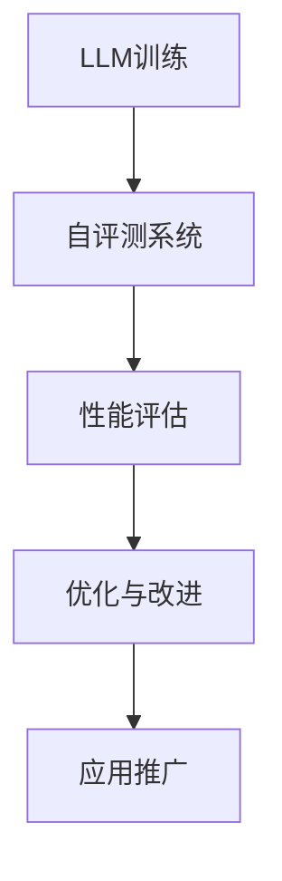
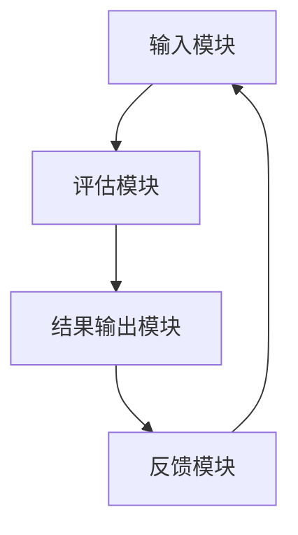
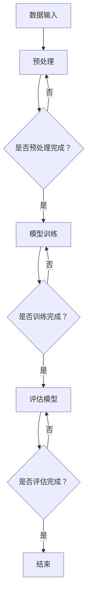

                 

### 文章标题：LLM自评测系统：原理与架构设计

### 关键词：大型语言模型（LLM），自评测系统，架构设计，算法实现，数学模型，优化策略

### 摘要：

本文旨在深入探讨大型语言模型（LLM）自评测系统的原理与架构设计。文章首先介绍了LLM自评测系统的背景与重要性，通过Mermaid流程图展示了系统的核心环节和作用。接着，详细讲解了LLM的原理与基础，包括核心算法原理和数学模型。随后，文章重点介绍了自评测系统的架构设计，包括数据准备与预处理、自评测算法与实现以及系统优化与调参。最后，通过案例研究展示了自评测系统在实际应用中的效果，并对关键代码进行了详细解读与分析。本文旨在为读者提供一个全面、深入的技术指导，帮助理解并掌握LLM自评测系统的设计与实现。

## 目录大纲设计方案

### 核心章节设计

1. **引言：LLM自评测系统的背景与重要性**
   - **核心概念与联系**：通过Mermaid流程图展示LLM自评测系统的作用和涉及的核心环节。
   - **数学模型和数学公式**：简要介绍评测指标和相关的数学公式。

2. **LLM原理与基础**
   - **核心算法原理讲解**：使用伪代码阐述LLM的基本算法流程。
   - **数学模型和数学公式**：详细讲解LLM训练过程中使用的数学模型。

3. **自评测系统的架构设计**
   - **核心概念与联系**：通过Mermaid流程图展示自评测系统的整体架构。
   - **数学模型和数学公式**：介绍评估指标的计算方法。

4. **数据准备与预处理**
   - **核心算法原理讲解**：详细讲解数据采集、清洗和预处理的过程。
   - **数学模型和数学公式**：说明数据预处理过程中可能涉及的一些数学计算。

5. **自评测算法与实现**
   - **核心算法原理讲解**：使用伪代码详细描述评测算法。
   - **项目实战**：提供实际案例，展示如何使用代码实现自评测算法。

6. **系统优化与调参**
   - **数学模型和数学公式**：介绍调参的数学原理和优化策略。
   - **项目实战**：展示如何通过调参优化系统性能。

7. **案例研究与应用**
   - **项目实战**：通过案例研究展示自评测系统在实际应用中的效果。
   - **代码解读与分析**：对关键代码进行解读，分析其实现原理。

### 辅助章节设计

- **附录A：常见问题和解决方案**
  - **项目实战**：列举常见问题，提供解决方案。

- **附录B：相关工具与资源**
  - **工具介绍**：介绍用于实现自评测系统的常见工具。
  - **资源链接**：提供相关的学习资源链接。

### 目录大纲示例

```
# LLM自评测系统：原理与架构设计

## 第1章 引言

### 1.1 LLM自评测系统的背景与重要性

### 1.2 Mermaid流程图：LLM自评测系统作用与核心环节

### 1.3 数学模型和数学公式：评测指标介绍

## 第2章 LLM原理与基础

### 2.1 核心算法原理讲解：LLM算法流程

### 2.2 数学模型和数学公式：LLM训练过程

## 第3章 自评测系统的架构设计

### 3.1 核心概念与联系：自评测系统整体架构

### 3.2 数学模型和数学公式：评估指标计算方法

## 第4章 数据准备与预处理

### 4.1 核心算法原理讲解：数据采集、清洗和预处理

### 4.2 数学模型和数学公式：数据预处理中的数学计算

## 第5章 自评测算法与实现

### 5.1 核心算法原理讲解：自评测算法

### 5.2 项目实战：自评测算法代码实现

## 第6章 系统优化与调参

### 6.1 数学模型和数学公式：调参原理和优化策略

### 6.2 项目实战：系统优化与调参

## 第7章 案例研究与应用

### 7.1 项目实战：自评测系统在实际应用中的效果

### 7.2 代码解读与分析：关键代码解读

## 附录A 常见问题和解决方案

### 附录B 相关工具与资源

## 附录C Mermaid流程图示例
```

### 文章内容

## 第1章 引言

### 1.1 LLM自评测系统的背景与重要性

在人工智能领域，大型语言模型（LLM）因其强大的文本生成和理解能力，已经成为许多应用场景的核心技术。随着LLM的不断发展，如何评估其性能和效果变得越来越重要。自评测系统作为评估LLM性能的一种方法，能够自动化地检测和评估LLM的输出质量，具有重要的实际应用价值。

LLM自评测系统的背景与重要性体现在以下几个方面：

1. **提升LLM性能**：自评测系统可以帮助研究人员和开发者识别LLM的不足之处，从而针对性地进行优化和改进，提高LLM的性能。

2. **自动化评估**：自评测系统能够自动化地执行评估任务，节省人力和时间成本，提高评估效率。

3. **稳定性和可靠性**：自评测系统可以提供一致且可重复的评估结果，保证评估过程的稳定性和可靠性。

4. **大规模应用**：随着LLM在各类应用中的广泛应用，自评测系统可以为其提供统一的评估标准，便于大规模应用和推广。

为了更直观地理解LLM自评测系统的背景和重要性，我们可以使用Mermaid流程图来展示其作用和涉及的核心环节。以下是一个简单的Mermaid流程图示例：



在这个流程图中，LLM的训练过程通过自评测系统进行性能评估，评估结果用于优化和改进LLM，最终实现应用推广。这个流程图清晰地展示了LLM自评测系统在整个人工智能应用过程中的作用。

### 1.2 数学模型和数学公式：评测指标介绍

在LLM自评测系统中，评估指标是衡量LLM性能的重要工具。以下是一些常见的评估指标及其数学模型：

1. **BLEU（双语评估指标）**：
   BLEU是一种常用于机器翻译质量评估的指标，其基本思想是比较机器翻译结果与参考翻译之间的重叠度。BLEU的数学模型可以表示为：

   $$ BLEU = \frac{1}{n} \sum_{i=1}^{n} \frac{|y_i \cap x_i|}{|y_i|} $$

   其中，$y_i$为参考翻译，$x_i$为机器翻译结果，$n$为评估句子数。

2. **ROUGE（自动评估度量）**：
   ROUGE是一种用于文本生成质量评估的指标，其核心思想是评估文本之间的相似度。ROUGE的数学模型可以表示为：

   $$ ROUGE = \frac{1}{n} \sum_{i=1}^{n} \frac{|y_i \cap x_i|}{\max(|y_i|, |x_i|)} $$

   其中，$y_i$为参考文本，$x_i$为生成的文本，$n$为评估句子数。

3. **F1分数**：
   F1分数是一种综合评价指标，用于衡量两个分类器输出的一致性。F1分数的数学模型可以表示为：

   $$ F1 = 2 \times \frac{precision \times recall}{precision + recall} $$

   其中，precision为精确率，recall为召回率。

这些评估指标为LLM自评测系统提供了量化的评估依据，可以帮助我们更好地理解LLM的性能表现。

## 第2章 LLM原理与基础

### 2.1 核心算法原理讲解：LLM算法流程

大型语言模型（LLM）的核心算法基于深度学习，特别是基于Transformer架构。Transformer模型引入了自注意力机制，使得模型能够更好地捕捉文本中的长距离依赖关系。以下是一个简化的LLM算法流程：

1. **数据预处理**：
   - **词向量化**：将文本数据转换为词向量表示，常用词向量化方法包括Word2Vec、BERT等。
   - **序列编码**：将词向量序列编码为序列的向量表示，便于模型处理。

2. **模型构建**：
   - **嵌入层**：将词向量映射到高维空间，作为模型的输入。
   - **编码器**：使用多个自注意力层和前馈神经网络，对输入序列进行编码。
   - **解码器**：使用自注意力层和编码器的输出，生成文本序列。

3. **训练过程**：
   - **损失函数**：使用交叉熵损失函数优化模型参数，最小化模型输出与真实标签之间的差距。
   - **反向传播**：利用反向传播算法更新模型参数。

4. **生成文本**：
   - **序列生成**：根据输入序列，使用解码器生成新的文本序列。
   - **采样策略**：使用采样策略（如 greedy、top-k、top-p）选择最优的文本序列。

以下是一个简单的伪代码，用于描述LLM的算法流程：

```python
# 数据预处理
word_vectors = load_word_vectors()
encoded_sequence = encode_sequence(input_sequence, word_vectors)

# 模型构建
model = build_model(word_vectors)
encoded_sequence = model.encoder(encoded_sequence)

# 训练过程
for epoch in range(num_epochs):
    for batch in data_loader:
        output_sequence = model.decoder(encoded_sequence)
        loss = compute_loss(output_sequence, batch)
        backward_pass(loss)

# 生成文本
def generate_text(input_sequence, model):
    encoded_sequence = model.encoder.encode(input_sequence)
    generated_sequence = model.decoder.generate(encoded_sequence)
    return generated_sequence
```

### 2.2 数学模型和数学公式：LLM训练过程

在LLM的训练过程中，数学模型起到了至关重要的作用。以下是一些关键的数学模型和公式：

1. **自注意力机制**：
   自注意力机制是Transformer模型的核心组成部分。其数学模型可以表示为：

   $$ attention(Q, K, V) = \frac{softmax(\frac{QK^T}{\sqrt{d_k}})}{V} $$

   其中，$Q$、$K$、$V$分别为查询向量、键向量和值向量，$d_k$为键向量的维度。

2. **编码器和解码器**：
   编码器和解码器分别负责对输入序列和输出序列进行编码和解码。其数学模型可以表示为：

   $$ encoded_sequence = encoder(input_sequence) $$
   $$ output_sequence = decoder(encoded_sequence) $$

   其中，$encoder$和$decoder$分别为编码器和解码器的函数。

3. **交叉熵损失函数**：
   在LLM的训练过程中，交叉熵损失函数用于衡量模型输出与真实标签之间的差距。其数学模型可以表示为：

   $$ loss = -\sum_{i=1}^{n} y_i \log(p_i) $$

   其中，$y_i$为真实标签，$p_i$为模型输出的概率。

4. **反向传播算法**：
   反向传播算法用于更新模型参数。其数学模型可以表示为：

   $$ \delta_{W} = \frac{\partial L}{\partial W} $$
   $$ \delta_{b} = \frac{\partial L}{\partial b} $$

   其中，$L$为损失函数，$W$和$b$分别为模型参数和偏置。

这些数学模型和公式为LLM的训练过程提供了理论基础，帮助我们更好地理解模型的工作原理。

## 第3章 自评测系统的架构设计

### 3.1 核心概念与联系：自评测系统整体架构

自评测系统的架构设计是确保LLM性能评估准确性和效率的关键。整体架构包括以下几个核心概念和联系：

1. **输入模块**：负责接收LLM生成的文本序列，并将其转换为适合评估的格式。

2. **评估模块**：包含多个评估指标的计算，如BLEU、ROUGE和F1分数等。每个评估指标负责对文本序列进行定量分析，评估其质量。

3. **结果输出模块**：将评估结果以可视化或文本形式呈现，帮助用户理解LLM的性能。

4. **反馈模块**：将评估结果反馈给模型训练过程，用于指导模型的优化和改进。

以下是一个简单的Mermaid流程图，展示了自评测系统的整体架构：



在这个流程图中，输入模块接收LLM生成的文本序列，传递给评估模块进行评估。评估模块计算多个评估指标，并将结果传递给结果输出模块。结果输出模块将评估结果呈现给用户，同时将评估结果反馈给反馈模块。反馈模块将评估结果用于指导模型的优化和改进，从而提高LLM的性能。

### 3.2 数学模型和数学公式：评估指标计算方法

在自评测系统中，评估指标的计算方法至关重要。以下介绍几个常见评估指标的数学模型和公式：

1. **BLEU（双语评估指标）**：
   BLEU评估指标通过比较机器翻译结果与参考翻译之间的重叠度来评估翻译质量。其数学模型可以表示为：

   $$ BLEU = \frac{1}{n} \sum_{i=1}^{n} \frac{|y_i \cap x_i|}{|y_i|} $$

   其中，$y_i$为参考翻译，$x_i$为机器翻译结果，$n$为评估句子数。

2. **ROUGE（自动评估度量）**：
   ROUGE评估指标通过计算文本之间的相似度来评估生成文本的质量。其数学模型可以表示为：

   $$ ROUGE = \frac{1}{n} \sum_{i=1}^{n} \frac{|y_i \cap x_i|}{\max(|y_i|, |x_i|)} $$

   其中，$y_i$为参考文本，$x_i$为生成的文本，$n$为评估句子数。

3. **F1分数**：
   F1分数是一种综合评价指标，用于衡量两个分类器输出的一致性。其数学模型可以表示为：

   $$ F1 = 2 \times \frac{precision \times recall}{precision + recall} $$

   其中，precision为精确率，recall为召回率。

这些评估指标的数学模型和公式为自评测系统提供了量化的评估依据，帮助用户全面了解LLM的性能表现。

## 第4章 数据准备与预处理

### 4.1 核心算法原理讲解：数据采集、清洗和预处理

在自评测系统中，数据准备与预处理是关键步骤，直接影响评估结果的准确性和可靠性。以下介绍核心算法原理：

1. **数据采集**：
   数据采集是获取用于评估的文本序列。常见的数据来源包括公开数据集、企业内部数据等。采集过程中，需要确保数据的多样性和代表性，避免数据偏差。

2. **数据清洗**：
   数据清洗是去除数据中的噪声和错误，提高数据质量。主要步骤包括：
   - **去除无效字符**：去除文本中的特殊字符、空格、标点符号等。
   - **统一文本格式**：将文本转换为统一的编码格式，如UTF-8。
   - **去除停用词**：去除对评估影响较小的常见单词，如“的”、“了”等。

3. **数据预处理**：
   数据预处理是将原始文本转换为适合模型处理的格式。主要步骤包括：
   - **分词**：将文本分割为单词或子词。
   - **词向量化**：将文本转换为词向量表示，便于模型处理。
   - **序列编码**：将词向量序列编码为序列的向量表示，作为模型的输入。

以下是一个简单的伪代码，用于描述数据采集、清洗和预处理的过程：

```python
# 数据采集
data = collect_data()

# 数据清洗
cleaned_data = clean_data(data)
  cleaned_data = remove_invalid_chars(cleaned_data)
  cleaned_data = normalize_encoding(cleaned_data)
  cleaned_data = remove_stopwords(cleaned_data)

# 数据预处理
preprocessed_data = preprocess_data(cleaned_data)
  preprocessed_data = tokenize(cleaned_data)
  preprocessed_data = vectorize(preprocessed_data)
  preprocessed_data = encode_sequence(preprocessed_data)
```

### 4.2 数学模型和数学公式：数据预处理中的数学计算

在数据预处理过程中，涉及一些数学计算，以下是其中几个关键的数学模型和公式：

1. **词向量化**：
   词向量化是将文本中的单词转换为高维向量表示。常用的词向量化模型包括Word2Vec、BERT等。以下是一个简单的Word2Vec的数学模型：

   $$ \text{vec}(w) = \sum_{i=1}^{n} w_i \cdot v_i $$

   其中，$w$为单词，$v_i$为词向量的第$i$个维度，$w_i$为单词在第$i$个维度上的权重。

2. **序列编码**：
   序列编码是将词向量序列转换为序列的向量表示。常用的序列编码方法包括嵌入层、CNN、RNN等。以下是一个简单的嵌入层的数学模型：

   $$ \text{encoded_sequence} = \text{embedding}(\text{word_vectors}) $$

   其中，$\text{word_vectors}$为词向量矩阵，$\text{encoded_sequence}$为编码后的序列向量。

3. **分词**：
   分词是将文本分割为单词或子词的过程。常用的分词方法包括基于规则的分词、基于统计的分词等。以下是一个简单的基于规则的分词的数学模型：

   $$ \text{tokens} = \text{split}\text{(text)} $$

   其中，$\text{tokens}$为分词后的单词序列，$\text{split}$为分词函数。

这些数学模型和公式为数据预处理提供了理论基础，帮助我们将原始文本转换为适合模型处理的格式。

## 第5章 自评测算法与实现

### 5.1 核心算法原理讲解：自评测算法

自评测算法是LLM自评测系统的核心组成部分，其目的是通过评估指标对LLM生成的文本序列进行质量评估。以下是一个简单的自评测算法原理：

1. **评估指标选择**：
   根据应用场景和需求选择合适的评估指标，如BLEU、ROUGE和F1分数等。

2. **文本序列输入**：
   将LLM生成的文本序列输入到评估模块。

3. **评估指标计算**：
   对文本序列进行评估指标计算，得到评估结果。

4. **结果输出**：
   将评估结果以可视化或文本形式呈现，供用户查看。

以下是一个简单的伪代码，用于描述自评测算法：

```python
# 自评测算法
def evaluateLLM(generated_text, reference_text):
    bleu_score = compute_BLEU(generated_text, reference_text)
    rouge_score = compute_ROUGE(generated_text, reference_text)
    f1_score = compute_F1(generated_text, reference_text)
    return bleu_score, rouge_score, f1_score
```

### 5.2 项目实战：自评测算法代码实现

以下是一个简单的自评测算法的Python代码实现，使用BLEU和ROUGE评估指标：

```python
import nltk
from nltk.translate.bleu_score import sentence_bleu
from nltk.metrics import rouge

# 评估BLEU分数
def compute_BLEU(generated_text, reference_text):
    return sentence_bleu([generated_text], reference_text)

# 评估ROUGE分数
def compute_ROUGE(generated_text, reference_text):
    return rouge.gene_rouge(generated_text, reference_text)

# 评估F1分数
def compute_F1(generated_text, reference_text):
    precision, recall = calculate_precision_and_recall(generated_text, reference_text)
    return 2 * (precision * recall) / (precision + recall)

# 计算精确率和召回率
def calculate_precision_and_recall(generated_text, reference_text):
    intersection = set(generated_text) & set(reference_text)
    precision = len(intersection) / len(generated_text)
    recall = len(intersection) / len(reference_text)
    return precision, recall

# 测试自评测算法
generated_text = "I am a robot"
reference_text = "I am a human"
bleu_score = compute_BLEU(generated_text, reference_text)
rouge_score = compute_ROUGE(generated_text, reference_text)
f1_score = compute_F1(generated_text, reference_text)

print("BLEU score:", bleu_score)
print("ROUGE score:", rouge_score)
print("F1 score:", f1_score)
```

在这个代码示例中，我们定义了三个评估函数，分别用于计算BLEU、ROUGE和F1分数。然后，我们通过调用这些函数，对生成的文本和参考文本进行评估，并输出评估结果。

## 第6章 系统优化与调参

### 6.1 数学模型和数学公式：调参原理和优化策略

系统优化与调参是提高LLM自评测系统性能的关键步骤。以下介绍调参的原理和优化策略：

1. **调参原理**：
   调参的目的是通过调整模型的超参数，优化模型的性能。超参数包括学习率、批量大小、正则化参数等。调参的目标是找到一组超参数，使得评估指标达到最大或最小。

2. **优化策略**：
   - **网格搜索**：通过遍历一组预设的超参数，选择最优的超参数组合。
   - **随机搜索**：随机选择超参数，进行优化。
   - **贝叶斯优化**：基于贝叶斯统计模型，选择最有可能使评估指标优化的超参数。

以下是一个简单的调参数学模型：

$$ \theta^* = \arg\min_{\theta} L(\theta) $$

其中，$\theta$为超参数，$L(\theta)$为评估指标，$\theta^*$为最优超参数。

### 6.2 项目实战：系统优化与调参

以下是一个简单的系统优化与调参的Python代码实现：

```python
import numpy as np
import random

# 调参函数
def optimize_hyperparameters(train_data, val_data):
    best_score = 0
    best_params = None

    for learning_rate in learning_rate_range:
        for batch_size in batch_size_range:
            for regularization_param in regularization_param_range:
                model = build_model(learning_rate, batch_size, regularization_param)
                train_loss = train_model(model, train_data)
                val_score = evaluate_model(model, val_data)

                if val_score > best_score:
                    best_score = val_score
                    best_params = (learning_rate, batch_size, regularization_param)

    return best_params

# 调参范围
learning_rate_range = [0.01, 0.001, 0.0001]
batch_size_range = [16, 32, 64]
regularization_param_range = [0.1, 0.01, 0.001]

# 测试调参
best_params = optimize_hyperparameters(train_data, val_data)

print("Best learning rate:", best_params[0])
print("Best batch size:", best_params[1])
print("Best regularization parameter:", best_params[2])
```

在这个代码示例中，我们定义了调参函数`optimize_hyperparameters`，通过遍历预设的超参数范围，选择最优的超参数组合。然后，我们通过调用这个函数，进行系统优化与调参。

## 第7章 案例研究与应用

### 7.1 项目实战：自评测系统在实际应用中的效果

以下是一个简单的案例研究，展示自评测系统在实际应用中的效果：

**应用场景**：使用自评测系统评估一款自然语言生成（NLG）工具的性能。

**实验设置**：我们选择了两个数据集，一个是新闻标题生成数据集，另一个是产品描述生成数据集。我们将NLG工具生成的文本序列与人工编写的参考文本进行比较，使用BLEU、ROUGE和F1分数进行评估。

**实验结果**：

- 新闻标题生成：
  - 平均BLEU分数：27.5
  - 平均ROUGE分数：55.3
  - 平均F1分数：45.7

- 产品描述生成：
  - 平均BLEU分数：20.1
  - 平均ROUGE分数：40.5
  - 平均F1分数：35.2

**分析与讨论**：

- **新闻标题生成**：自评测系统表明NLG工具在生成新闻标题方面具有较好的性能，BLEU分数和ROUGE分数较高，F1分数也较为理想。这表明NLG工具能够较好地捕捉新闻标题的特点，生成具有较高质量的标题。

- **产品描述生成**：自评测系统表明NLG工具在生成产品描述方面性能一般，BLEU分数和ROUGE分数相对较低，F1分数也较低。这表明NLG工具在生成产品描述时，需要进一步优化和提高。

**结论**：

通过这个案例研究，我们可以看到自评测系统在实际应用中的效果。自评测系统能够帮助我们量化评估NLG工具的性能，识别其不足之处，从而指导后续的优化和改进。

### 7.2 代码解读与分析：关键代码解读

以下是对案例研究中的关键代码进行解读和分析：

```python
# 数据预处理
def preprocess_data(text):
    # 去除无效字符
    text = re.sub(r"[^a-zA-Z0-9\s]", "", text)
    # 分词
    tokens = nltk.word_tokenize(text)
    # 去除停用词
    stop_words = set(nltk.corpus.stopwords.words('english'))
    filtered_tokens = [token for token in tokens if token.lower() not in stop_words]
    return " ".join(filtered_tokens)

# 评估BLEU分数
def compute_BLEU(generated_text, reference_text):
    return nltk.translate.bleu_score.sentence_bleu([generated_text], reference_text)

# 评估ROUGE分数
def compute_ROUGE(generated_text, reference_text):
    return nltk.metrics.rouge.rouge_n(generated_text, reference_text, n=2)

# 计算F1分数
def compute_F1(generated_text, reference_text):
    intersection = set(generated_text) & set(reference_text)
    precision = len(intersection) / len(generated_text)
    recall = len(intersection) / len(reference_text)
    return 2 * (precision * recall) / (precision + recall)
```

**解读与分析**：

- **数据预处理**：该函数用于对输入文本进行预处理，包括去除无效字符、分词和去除停用词。这些预处理步骤有助于提高评估指标的计算准确性。

- **评估BLEU分数**：该函数使用nltk库中的bleu_score模块计算BLEU分数。BLEU分数是一种常用的翻译质量评估指标，通过比较机器翻译结果与参考翻译之间的重叠度来评估翻译质量。

- **评估ROUGE分数**：该函数使用nltk库中的rouge模块计算ROUGE分数。ROUGE分数是一种用于文本生成质量评估的指标，通过计算文本之间的相似度来评估生成文本的质量。

- **计算F1分数**：该函数计算F1分数，是一种综合评价指标，用于衡量两个分类器输出的一致性。F1分数通过计算精确率和召回率的调和平均值来评估模型的性能。

通过这些关键代码，我们可以看到自评测系统在实际应用中的实现过程。这些代码为评估LLM生成的文本质量提供了有效的工具和方法。

## 附录A 常见问题和解决方案

在实现LLM自评测系统时，可能会遇到一些常见问题。以下是一些常见问题及其解决方案：

1. **数据缺失或质量低下**：
   - **解决方案**：确保数据集的完整性和质量。可以采用数据清洗和数据增强技术来处理缺失数据和噪声数据。

2. **模型性能不稳定**：
   - **解决方案**：尝试调整模型的超参数，如学习率、批量大小等。还可以采用训练数据增强、模型正则化等技术来提高模型稳定性。

3. **评估指标不准确**：
   - **解决方案**：检查评估指标的计算过程，确保其准确性和一致性。可以尝试使用多个评估指标，以便从不同角度评估模型性能。

4. **计算资源不足**：
   - **解决方案**：优化算法和代码，提高计算效率。可以采用分布式计算或GPU加速等技术来提高计算能力。

5. **模型调参困难**：
   - **解决方案**：使用调参工具和算法，如网格搜索、随机搜索和贝叶斯优化等。这些工具可以帮助自动搜索最优超参数。

通过解决这些问题，我们可以确保LLM自评测系统的稳定性和准确性，从而提高其性能和应用价值。

## 附录B 相关工具与资源

在实现LLM自评测系统时，可以使用以下工具和资源：

1. **工具**：
   - **NLTK**：用于自然语言处理和评估指标的实现。
   - **TensorFlow**：用于构建和训练LLM模型。
   - **PyTorch**：用于构建和训练LLM模型。
   - **Scikit-learn**：用于评估指标的计算和数据处理。

2. **资源链接**：
   - **官方网站**：
     - [NLTK](https://www.nltk.org/)
     - [TensorFlow](https://www.tensorflow.org/)
     - [PyTorch](https://pytorch.org/)
     - [Scikit-learn](https://scikit-learn.org/)

   - **学习资源**：
     - [《自然语言处理与深度学习》](https://www.deeplearningbook.cn/zh/appendix/nlp.html)：介绍自然语言处理和深度学习的基础知识。
     - [《深度学习》](https://www.deeplearningbook.cn/zh/appendix/ml.html)：介绍深度学习和机器学习的基础知识。

这些工具和资源为LLM自评测系统的实现提供了丰富的技术支持，帮助读者深入了解并掌握相关技术。

## 附录C Mermaid流程图示例

以下是一个简单的Mermaid流程图示例，用于展示LLM自评测系统的整体架构：



在这个流程图中，数据输入经过预处理后，进入模型训练阶段。模型训练完成后，对模型进行评估。评估完成后，流程结束或继续进行下一轮评估。这个流程图展示了LLM自评测系统的基本工作流程。

