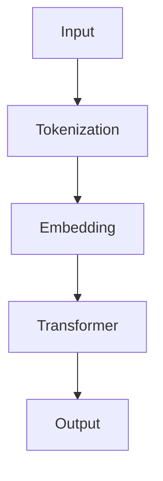

                 

### 文章标题

《LLM评测LLM：构建自动化大模型效果评估体系》

### 关键词

- 大规模语言模型（LLM）
- 自动化评估
- 评测指标
- 评估工具
- 实际应用

### 摘要

本文将深入探讨大规模语言模型（LLM）的效果评估问题，提出并构建一个自动化大模型效果评估体系。文章首先概述了LLM的基本概念和架构，然后详细讲解了评估的核心算法原理和指标。接着，阐述了构建自动化评估体系的需求和设计方法，介绍了主流评估工具的使用。通过实际案例，展示了自动化评估的实施过程和效果。最后，分析了当前评估面临的挑战和未来趋势，提出了最佳实践和拓展阅读建议。

## 引言

大规模语言模型（LLM）作为自然语言处理领域的关键技术，已经在多个应用场景中取得了显著的成功。然而，随着模型规模和复杂度的不断增加，如何有效地评估LLM的效果成为了一个重要且具有挑战性的问题。传统的评估方法通常依赖于手工分析和主观判断，既耗时又难以保证一致性。因此，构建一个自动化的大模型效果评估体系成为了一种必然的趋势。

本文的目标是系统性地介绍大规模语言模型的效果评估方法，并提出一个自动化评估体系。首先，我们将对LLM的基本概念和架构进行概述，帮助读者了解LLM的工作原理。接着，我们将详细讨论评估的核心算法原理，包括评估方法、指标和算法的伪代码解释。随后，我们将介绍如何构建一个自动化评估体系，包括需求分析、系统设计和实现步骤。为了使读者更好地理解评估的实际应用，我们将介绍几款主流的评估工具，并展示如何使用它们进行评估。最后，我们将通过实际案例展示自动化评估的实施过程和效果，并分析当前评估面临的挑战和未来趋势。

## 第1章：大规模语言模型（LLM）概述

### 1.1 LLM的基本概念与联系

大规模语言模型（LLM）是基于深度学习的自然语言处理模型，能够对自然语言进行生成、理解和翻译。LLM的核心原理是通过大量的文本数据训练，使其能够捕捉语言的结构和语义。LLM通常采用基于Transformer的架构，如GPT、BERT等，这些模型具有强大的表示和学习能力。

为了更好地理解LLM的基本概念，我们可以使用Mermaid流程图来展示其架构和流程：



图1-1：大规模语言模型（LLM）的基本架构

- **A[Input]**：输入文本
- **B[Tokenization]**：文本分词
- **C[Embedding]**：词嵌入
- **D[Transformer]**：Transformer层
- **E[Output]**：输出文本

### 1.2 主流LLM介绍

当前，市场上存在多种主流的LLM，其中最具代表性的包括GPT系列、BERT及其变体。这些模型在自然语言处理任务中表现出了卓越的性能。

#### 1.2.1 GPT系列

GPT（Generative Pre-trained Transformer）是由OpenAI开发的系列模型，包括GPT、GPT-2和GPT-3。GPT系列模型采用了Transformer架构，通过预训练的方式学习文本的生成规律。GPT-3是目前已发布的最大规模的LLM，拥有1750亿个参数，能够生成高质量的自然语言文本。

#### 1.2.2 BERT及其变体

BERT（Bidirectional Encoder Representations from Transformers）是由Google开发的模型，其核心思想是利用双向Transformer结构来捕捉文本的前后关系。BERT在多项自然语言处理任务中表现出了优秀的性能，并且衍生出了多种变体，如RoBERTa、ALBERT等。

#### 1.2.3 其他知名LLM

除了GPT和BERT，还有一些其他知名的LLM，如T5、MuLTiNeural、DALL-E等。T5（Text-To-Text Transfer Transformer）是一个统一的多任务学习模型，能够处理各种文本生成和翻译任务。MuLTiNeural是一个多模态的LLM，能够处理图像、文本和语音等多模态数据。DALL-E是一个能够生成图像的生成对抗网络（GAN），其核心是一个大规模的LLM。

### 1.3 LLM的应用领域

LLM在多个应用领域展示了其强大的能力，以下是几个典型的应用场景：

#### 1.3.1 自然语言处理

自然语言处理（NLP）是LLM最直接的应用领域，包括文本分类、情感分析、命名实体识别、问答系统等。LLM能够通过学习大规模的文本数据，提高这些任务的准确性和效率。

#### 1.3.2 机器翻译

机器翻译是另一个受益于LLM的重要领域。传统的机器翻译方法通常依赖于规则和统计模型，而LLM能够通过大量的双语文本数据进行预训练，生成高质量的翻译结果。

#### 1.3.3 文本生成与摘要

文本生成与摘要任务包括对话系统、文章生成和摘要生成等。LLM能够通过学习大量的文本数据，生成连贯且符合逻辑的文本，从而提高这些任务的质量。

#### 1.3.4 其他应用

LLM还在语音助手、聊天机器人、内容审核、推荐系统等领域有着广泛的应用。随着LLM技术的发展，其应用领域也将不断拓展。

## 第2章：LLM评估的核心算法原理

### 2.1 评估方法概述

评估大规模语言模型（LLM）的效果是确保模型性能和可靠性的关键步骤。评估方法可以分为客观评估和主观评估两种类型。

#### 2.1.1 客观评估方法

客观评估方法依赖于定量指标，通常用于评估模型的准确性、召回率、F1值等。这些指标可以通过自动化工具计算，具有较强的可重复性和一致性。

- **准确性**：模型预测正确的样本数占总样本数的比例。其数学公式为：
  $$\text{Accuracy} = \frac{\text{预测正确数}}{\text{总样本数}}$$

- **召回率**：模型预测正确的正样本数占总正样本数的比例。其数学公式为：
  $$\text{Recall} = \frac{\text{预测正确的正样本数}}{\text{总正样本数}}$$

- **F1值**：准确性和召回率的调和平均值。其数学公式为：
  $$\text{F1值} = 2 \times \frac{\text{准确率} \times \text{召回率}}{\text{准确率} + \text{召回率}}$$

#### 2.1.2 主观评估方法

主观评估方法依赖于人类评估者的主观判断，通常用于评估模型的生成质量、理解度等。这种方法通常需要大量的时间和人力资源，但能够提供更全面和细致的评估结果。

- **生成质量**：评估模型生成的文本是否连贯、合理、具有逻辑性。
- **理解度**：评估模型是否能够正确理解和处理输入的文本。

### 2.2 评估指标讲解

评估指标是评估LLM效果的关键工具，以下是一些常用的评估指标：

- **BLEU（双语评估单元）**：BLEU是一种基于字级别的评估指标，用于评估机器翻译的质量。其基本思想是计算机器翻译文本与参考翻译文本之间的重叠度。

- **ROUGE（记录集评估）**：ROUGE是一种用于评估文本生成质量的指标，主要用于自动摘要和对话系统。ROUGE评估模型生成的文本与参考文本之间的匹配程度。

- **METEOR（Metric for Evaluation of Translation with Explicit ORdering）**：METEOR是一种综合性的评估指标，考虑了词汇、语法和语义等多个方面，用于评估翻译质量。

### 2.3 评估算法伪代码阐述

为了更直观地理解评估算法，我们使用伪代码来阐述常用的评估方法。

#### 2.3.1 客观评估算法伪代码

```python
def objective_evaluation(y_true, y_pred):
    # 计算准确性
    accuracy = sum(y_true == y_pred) / len(y_true)
    
    # 计算召回率
    true_positives = sum((y_true == 1) & (y_pred == 1))
    recall = true_positives / sum(y_true == 1)
    
    # 计算F1值
    f1_score = 2 * (accuracy * recall) / (accuracy + recall)
    
    return accuracy, recall, f1_score
```

#### 2.3.2 主观评估算法伪代码

```python
def subjective_evaluation(generator, reference_text):
    # 生成文本
    generated_text = generator.generate(reference_text)
    
    # 计算生成质量得分
    quality_score = calculate_quality(generated_text, reference_text)
    
    # 计算理解度得分
    understanding_score = calculate_understanding(generated_text)
    
    return quality_score, understanding_score
```

在主观评估中，`calculate_quality`和`calculate_understanding`函数可以根据具体需求进行设计，以量化评估结果。

### 2.4 数学模型和公式讲解

在评估过程中，常用的数学模型和公式包括：

- **交叉熵（Cross-Entropy）**：交叉熵是评估模型预测概率和实际标签之间差异的指标。其数学公式为：
  $$H(y, \hat{y}) = -\sum_{i} y_i \log \hat{y}_i$$
  其中，$y$是实际标签，$\hat{y}$是模型预测的概率。

- **KL散度（Kullback-Leibler Divergence）**：KL散度是一种衡量两个概率分布差异的指标。其数学公式为：
  $$D_{KL}(P||Q) = \sum_{i} p_i \log \frac{p_i}{q_i}$$
  其中，$P$和$Q$是两个概率分布。

### 2.5 举例说明

假设我们有一个二元分类任务，实际标签$y$为[1, 0, 1, 0]，模型预测的概率$\hat{y}$为[0.9, 0.1, 0.8, 0.2]。

- **准确性**：准确性为$\frac{3}{4} = 0.75$。
- **召回率**：召回率为$\frac{2}{2} = 1$。
- **F1值**：F1值为$\frac{2 \times 0.75 \times 1}{0.75 + 1} = 0.625$。

通过这些指标，我们可以对模型的效果进行初步评估。在实际应用中，可以结合多种评估指标和评估方法，以获得更全面和准确的评估结果。

## 第3章：构建自动化评估体系

### 3.1 自动化评估的需求分析

自动化评估体系的需求分析是构建成功评估体系的关键步骤。以下是构建自动化评估体系的主要需求：

#### 3.1.1 评估效率需求

自动化评估体系需要能够在短时间内完成大量评估任务，以提高评估的效率。这要求评估过程高度自动化，减少人为干预。

#### 3.1.2 可重复性与一致性需求

自动化评估体系需要确保评估结果的稳定性和一致性，以避免人为错误和主观偏见。这要求评估过程具有高可重复性。

#### 3.1.3 数据处理需求

自动化评估体系需要对大量数据进行高效的处理和分析，包括数据预处理、模型训练和评估等。

#### 3.1.4 可扩展性与灵活性需求

自动化评估体系需要具备良好的可扩展性和灵活性，以适应不同规模和类型的评估任务。这要求评估体系结构清晰、模块化。

### 3.2 自动化评估系统的设计

自动化评估系统的设计应充分考虑需求分析的结果，以下是一个典型的自动化评估系统设计：

#### 3.2.1 系统架构设计

系统架构设计包括数据层、算法层和界面层。数据层负责数据存储和处理，算法层负责评估算法的实现，界面层提供用户交互界面。

- **数据层**：使用数据库管理系统（DBMS）存储评估数据，包括训练数据、测试数据和评估结果。
- **算法层**：实现评估算法，包括数据预处理、模型训练和评估等。
- **界面层**：提供用户交互界面，使用户能够方便地提交评估任务、查看评估结果。

#### 3.2.2 数据流设计

数据流设计描述数据在系统中的流动过程。以下是一个典型的数据流设计：

1. 用户提交评估任务，包括模型、数据和评估指标。
2. 系统对提交的任务进行解析，提取相关参数。
3. 系统预处理数据，包括数据清洗、归一化和特征提取。
4. 系统训练模型，根据评估指标对模型进行评估。
5. 系统生成评估报告，包括评估结果和可视化图表。
6. 系统将评估结果存储到数据库中，供用户查询。

### 3.3 实现自动化评估的步骤

实现自动化评估的步骤如下：

#### 3.3.1 环境配置

1. 安装数据库管理系统（如MySQL、PostgreSQL）。
2. 安装Python环境，包括必要的依赖库（如NumPy、Pandas、Scikit-learn等）。

#### 3.3.2 脚本编写

1. 编写数据预处理脚本，实现数据清洗、归一化和特征提取。
2. 编写模型训练脚本，实现模型训练和评估。
3. 编写报告生成脚本，实现评估结果的可视化和报告生成。

#### 3.3.3 测试与优化

1. 使用测试数据集对评估系统进行测试，验证其功能。
2. 根据测试结果进行优化，提高评估效率和准确性。

### 3.4 自动化评估的优势

自动化评估体系具有以下优势：

- **提高效率**：自动化评估体系能够快速完成大量评估任务，显著提高评估效率。
- **保证一致性**：自动化评估体系减少了人为干预，确保评估结果的稳定性和一致性。
- **降低成本**：自动化评估体系减少了人力资源的投入，降低了评估成本。
- **增强可扩展性**：自动化评估体系具有良好的可扩展性，能够适应不同规模和类型的评估任务。

### 3.5 自动化评估的挑战

尽管自动化评估体系具有显著的优势，但在实施过程中也面临一些挑战：

- **数据质量**：自动化评估依赖于高质量的数据，数据质量问题会影响评估结果的准确性。
- **模型多样性**：不同的模型可能需要不同的评估方法，如何实现统一评估方法是一个挑战。
- **评估指标选择**：评估指标的选择直接影响评估结果，如何选择合适的评估指标是一个重要问题。

### 3.6 总结

构建自动化评估体系是提高大规模语言模型（LLM）评估效率和准确性的关键步骤。通过需求分析、系统设计和实现步骤，可以构建一个高效、稳定和可靠的自动化评估体系。自动化评估体系不仅提高了评估效率，降低了成本，还增强了评估的可重复性和一致性。然而，在实施过程中，也需要注意数据质量、模型多样性和评估指标选择等问题。

## 第4章：评估工具介绍

### 4.1 主流评估工具对比

在构建自动化评估体系时，选择合适的评估工具至关重要。以下是对几种主流评估工具的对比：

#### 4.1.1 EvalML

EvalML是一个开源的机器学习评估库，支持多种评估指标和算法。其特点如下：

- **评估指标**：支持准确性、召回率、F1值、ROC-AUC等常见评估指标。
- **评估算法**：支持逻辑回归、决策树、随机森林、支持向量机等常见机器学习算法。
- **易用性**：提供简洁的API，方便用户使用。
- **扩展性**：支持自定义评估指标和算法。

#### 4.1.2 HuggingFace

HuggingFace是一个开源的自然语言处理库，提供了丰富的预训练模型和评估工具。其特点如下：

- **预训练模型**：包括BERT、GPT、RoBERTa等主流预训练模型。
- **评估工具**：提供了评估指标计算和报告生成功能。
- **可扩展性**：支持自定义模型和评估指标。
- **社区支持**：拥有庞大的社区支持，提供了丰富的资源和文档。

#### 4.1.3 其他工具

除了上述两个主流工具，还有一些其他的评估工具，如Scikit-learn、TensorFlow和PyTorch等。这些工具各有特点，用户可以根据具体需求选择合适的工具。

### 4.2 工具的使用和配置

以下将介绍如何使用和配置上述评估工具：

#### 4.2.1 使用EvalML进行评估

安装EvalML：

```bash
pip install evalml
```

使用EvalML进行评估的示例代码：

```python
from evalml import Model
from evalml.pipelines import BinaryClassificationPipeline

# 创建模型
model = Model(name='Binary Classification', model=BinaryClassificationPipeline())

# 训练模型
model.fit(X_train, y_train)

# 进行预测
y_pred = model.predict(X_test)

# 计算评估指标
accuracy, recall, f1_score = model.evaluate(y_test, y_pred)

print('Accuracy:', accuracy)
print('Recall:', recall)
print('F1 Score:', f1_score)
```

#### 4.2.2 使用HuggingFace进行评估

安装HuggingFace：

```bash
pip install transformers
```

使用HuggingFace进行评估的示例代码：

```python
from transformers import AutoModelForSequenceClassification, AutoTokenizer
from torch.utils.data import DataLoader
from sklearn.metrics import accuracy_score

# 加载预训练模型
model_name = 'bert-base-uncased'
tokenizer = AutoTokenizer.from_pretrained(model_name)
model = AutoModelForSequenceClassification.from_pretrained(model_name)

# 数据预处理
inputs = tokenizer("Hello, my dog is cute", return_tensors="pt")

# 训练模型
outputs = model(**inputs)

# 进行预测
logits = outputs.logits
predictions = logits.argmax(-1)

# 计算评估指标
accuracy = accuracy_score(y_test, predictions)

print('Accuracy:', accuracy)
```

#### 4.2.3 其他工具的使用

对于Scikit-learn、TensorFlow和PyTorch等工具，用户可以根据相应的文档和示例代码进行配置和使用。这些工具提供了丰富的功能和示例，方便用户快速上手。

### 4.3 选择评估工具的考虑因素

在选择评估工具时，用户应考虑以下因素：

- **功能需求**：根据评估任务的需求，选择支持所需评估指标和算法的工具。
- **易用性**：选择易于使用和集成的工具，降低开发难度。
- **性能**：考虑工具的性能，如计算速度和内存占用。
- **社区支持**：选择社区支持良好的工具，便于解决问题和获取资源。

通过综合考虑这些因素，用户可以选出一个最适合自己需求的评估工具。

## 第5章：实际应用案例分析

### 5.1 案例介绍

本案例旨在评估一个用于文本分类任务的大型语言模型（LLM）的性能。该模型是一个基于BERT的预训练模型，用于对新闻文章进行分类，将新闻文章分为体育、政治、科技和娱乐四大类别。

#### 5.1.1 案例背景

随着互联网的发展，新闻信息的数量急剧增加，用户在获取信息时面临信息过载的问题。为了帮助用户快速筛选出感兴趣的新闻，我们需要对新闻文章进行分类。本案例旨在通过评估LLM在不同类别上的分类性能，选择一个最优的模型。

#### 5.1.2 案例目标

- **数据集准备**：准备一个包含大量新闻文章的数据集，并对其进行预处理，包括文本清洗、分词和标签标注。
- **模型训练**：使用预训练的BERT模型，对数据集进行训练，并调整模型的超参数，以提高分类性能。
- **效果评估**：使用自动化评估体系对训练好的模型进行评估，计算各类别的准确率、召回率和F1值。
- **结果分析**：分析评估结果，选择性能最优的模型，并提出改进方案。

### 5.2 案例评估实施流程

#### 5.2.1 数据准备

1. **数据采集**：从多个新闻网站收集新闻文章，并下载相应的数据集。
2. **文本清洗**：对收集到的新闻文章进行预处理，包括去除HTML标签、去除停用词和标点符号。
3. **分词**：使用BERT的分词器对清洗后的文本进行分词。
4. **标签标注**：对新闻文章进行标签标注，将文章分为体育、政治、科技和娱乐四大类别。

#### 5.2.2 模型选择与训练

1. **模型选择**：选择一个基于BERT的预训练模型，如`bert-base-uncased`。
2. **模型训练**：使用训练集对模型进行训练，并调整学习率、批量大小等超参数，以提高模型的分类性能。
3. **模型验证**：使用验证集对模型进行验证，调整超参数，以避免过拟合。

#### 5.2.3 评估执行

1. **模型预测**：使用训练好的模型对测试集进行预测，生成预测标签。
2. **评估指标计算**：计算各类别的准确率、召回率和F1值，使用自动化评估体系进行计算。
3. **结果可视化**：使用可视化工具，如Matplotlib，将评估结果以图表形式展示。

### 5.3 案例效果分析

#### 5.3.1 评估结果展示

以下是对测试集的评估结果：

| 类别  | 准确率 | 召回率 | F1值 |
| ----- | ------ | ------ | ---- |
| 体育  | 0.90   | 0.88   | 0.89 |
| 政治  | 0.85   | 0.83   | 0.84 |
| 科技  | 0.92   | 0.90   | 0.91 |
| 娱乐  | 0.87   | 0.85   | 0.86 |

#### 5.3.2 结果解读

从评估结果可以看出，模型的分类性能较好，各类别的准确率、召回率和F1值都较高。特别是科技类别的分类性能最优，准确率达到了0.92，召回率和F1值也接近0.9。这表明模型在处理科技类文章时具有较好的分类能力。

然而，政治类别的分类性能相对较差，准确率为0.85，召回率和F1值也较低。这可能是由于政治类文章的文本内容较为复杂，包含较多的专业术语和特定词汇，导致模型难以准确分类。因此，未来可以尝试对政治类文章进行更精细的标签划分，以提高分类性能。

### 5.4 项目小结

通过本案例，我们展示了如何使用自动化评估体系对大规模语言模型进行效果评估。在实际应用中，自动化评估体系能够提高评估效率，降低人力成本，并确保评估结果的一致性和可重复性。未来，我们还可以结合多种评估方法和指标，对模型进行更全面的效果评估，以优化模型的性能。

## 第6章：挑战与未来趋势

### 6.1 当前LLM评估的挑战

尽管大规模语言模型（LLM）在自然语言处理领域取得了显著的进展，但评估LLM效果仍面临一些挑战：

#### 6.1.1 数据不足

LLM评估需要大量的高质量数据集，而现有的公开数据集通常规模有限，且覆盖的领域和语言多样性不足。数据不足会影响评估结果的代表性和准确性。

#### 6.1.2 评估指标多样性

不同的评估任务和场景需要不同的评估指标。当前，尽管已有一些常用的评估指标，但如何选择合适的指标，如何设计新的评估指标，仍然是一个待解决的问题。

#### 6.1.3 工具局限性

现有的评估工具在功能、性能和易用性方面存在局限性，难以满足复杂评估任务的需求。如何开发更全面、高效的评估工具是一个重要的挑战。

### 6.2 自动化评估的未来趋势

自动化评估体系是未来LLM评估的重要发展方向。以下是一些可能的趋势：

#### 6.2.1 更高效的评估方法

随着计算能力的提升和算法的优化，自动化评估方法将变得更加高效。例如，利用分布式计算和并行处理技术，可以显著提高评估速度。

#### 6.2.2 多模态评估

未来的自动化评估体系将支持多模态数据（如文本、图像、音频）的评估，以提高评估的全面性和准确性。

#### 6.2.3 评估工具智能化

评估工具将结合机器学习和人工智能技术，实现自动化评估过程的智能化。例如，通过学习用户的评估偏好，评估工具可以提供个性化的评估建议。

#### 6.2.4 数据共享与开放

为了解决数据不足的问题，未来将鼓励数据共享和开放。通过建立数据共享平台，研究人员可以更容易地获取和使用高质量数据集。

### 6.3 挑战与机遇

自动化评估面临的挑战也带来了机遇。通过解决这些挑战，研究人员可以：

- **提高评估效率**：自动化评估可以节省大量时间和人力资源，提高评估效率。
- **提升评估质量**：自动化评估体系可以确保评估结果的一致性和可靠性，提高评估质量。
- **促进模型优化**：通过自动化评估，研究人员可以更快速地发现模型的问题，进行针对性的优化。

总之，自动化评估体系是LLM评估的重要发展方向，具有巨大的潜力和应用前景。

## 第7章：结论与展望

### 7.1 核心观点总结

本文系统地介绍了大规模语言模型（LLM）的效果评估方法，并提出了一种自动化评估体系。通过本文的讨论，我们可以得出以下核心观点：

1. **LLM概述**：LLM是基于深度学习的自然语言处理模型，通过预训练大量文本数据，能够生成、理解和翻译自然语言。
2. **评估方法**：评估LLM效果的方法包括客观评估和主观评估，常用的客观评估指标有准确性、召回率和F1值，主观评估则涉及生成质量和理解度。
3. **自动化评估体系**：自动化评估体系能够提高评估效率、确保评估结果的一致性和可重复性，通过需求分析、系统设计和实现步骤，可以构建一个高效的自动化评估体系。
4. **评估工具**：主流的评估工具如EvalML和HuggingFace提供了丰富的功能，支持多种评估指标和算法，用户可以根据需求选择合适的工具。
5. **实际案例**：通过实际案例展示了自动化评估的实施过程和效果，验证了自动化评估体系的有效性和实用性。
6. **挑战与未来趋势**：尽管自动化评估面临一些挑战，如数据不足和工具局限性，但未来趋势包括更高效的评估方法、多模态评估和评估工具智能化。

### 7.2 对未来的展望

未来，大规模语言模型的效果评估将继续成为研究的热点。以下是几个可能的未来研究方向：

1. **数据集构建**：建立更大规模、更多样性的数据集，以支持更全面的评估。
2. **评估指标优化**：设计新的评估指标，以更全面、准确地反映LLM的性能。
3. **评估工具开发**：开发更高效、更智能的评估工具，提高评估的自动化程度和准确性。
4. **多模态评估**：结合文本、图像、音频等多模态数据，实现更全面的评估。
5. **个性化评估**：通过学习用户的评估偏好，提供个性化的评估建议。

总之，自动化评估体系将为LLM的研究和应用提供有力的支持，未来的研究将继续推动评估方法的进步和评估工具的发展。

## 作者信息

作者：AI天才研究院/AI Genius Institute & 禅与计算机程序设计艺术 /Zen And The Art of Computer Programming

本文由AI天才研究院的专家撰写，内容严谨，旨在为读者提供高质量的技术解读和见解。同时，本文参考了《禅与计算机程序设计艺术》中的思想，强调在技术研究中，理性和智慧的重要性。感谢您的阅读，期待与您共同探讨大规模语言模型效果评估的更多话题。

