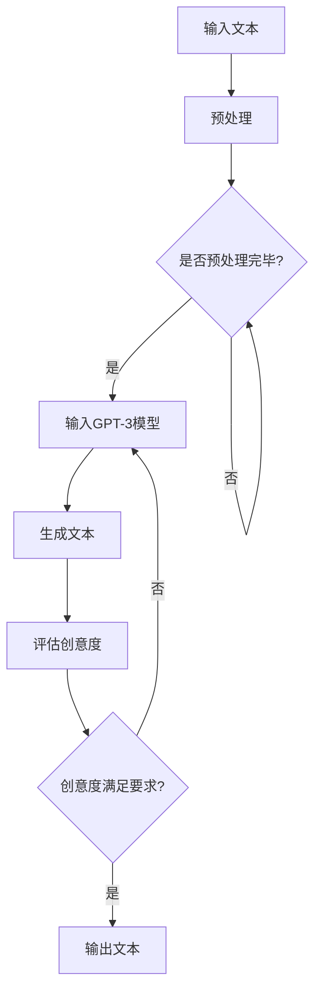
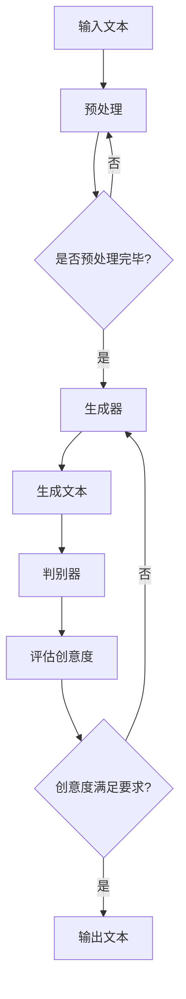
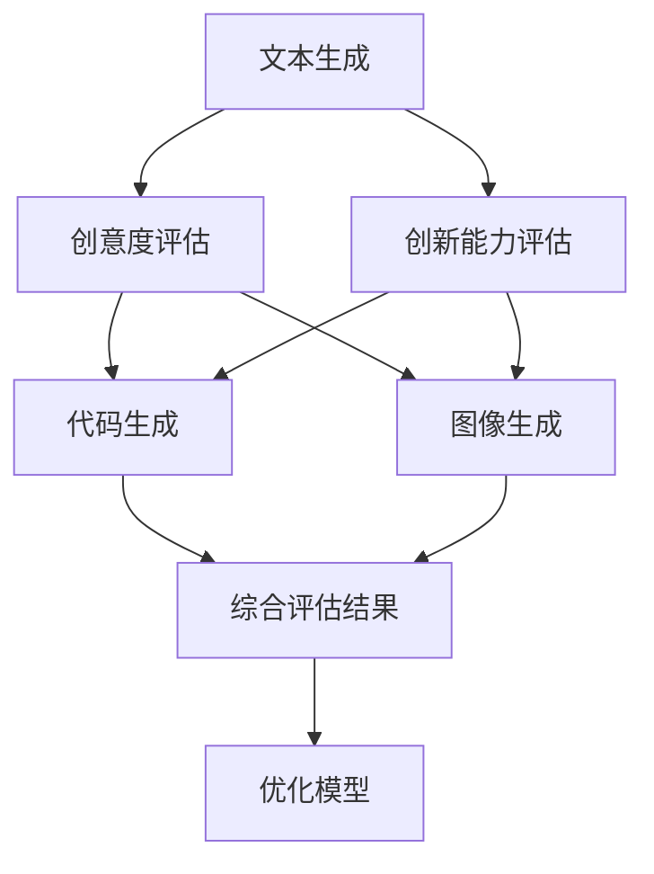

                 


### 文章标题：LLM评测中的创意与创新能力评估

> 关键词：语言模型（LLM），评测方法，创意度评估，创新能力评估，深度学习，生成对抗网络（GAN），多任务学习，代码生成，图像生成

> 摘要：
本文将从LLM的基础概念、评测方法、评估工具，以及创意与创新能力评估的实际案例，系统地探讨LLM评测中的创意与创新能力评估。通过梳理核心概念和联系，使用Mermaid流程图展示LLM评测的流程，通过伪代码和数学模型解释核心算法原理，并探讨创意与创新能力评估在文本生成、代码生成和图像生成等领域的应用。

----------------------------------------------------------------

### 第一部分：LLM基础与评测概述

#### 第1章：语言模型（LLM）概述

##### 1.1 语言模型基本概念

语言模型（Language Model，简称LLM）是一种用于预测下一个单词或词组概率的模型，它在自然语言处理（Natural Language Processing，简称NLP）中具有基础性的作用。LLM能够帮助计算机理解和生成自然语言，从而实现人机交互、文本生成、机器翻译、情感分析等多种应用。

##### 1.2 LLM的主要类型

- **基于统计的语言模型**：如N-gram模型，它基于历史文本的统计信息来预测下一个词。
- **基于神经网络的LSTM和Transformer模型**：如LSTM和Transformer模型，它们通过深度学习技术从大量数据中学习语言模式。
- **生成对抗网络（GAN）与LSTM的融合模型**：这类模型结合了GAN和LSTM的优点，用于生成更加真实的文本。

##### 1.3 LLM在创意与创新中的应用

- **语言模型的创意生成**：利用LLM生成新颖的文本内容，如故事、诗歌等。
- **语言模型的创新性评估**：通过评估LLM生成的文本的创新性，对模型进行优化。

#### 第2章：LLM评测方法

##### 2.1 创意与创新能力评估指标

- **创意度评估指标**：如新颖性、独特性、创造性等。
- **创新能力评估指标**：如技术的先进性、方法的创新性、结果的创新性等。

##### 2.2 创意与创新能力评估流程

- **数据收集与预处理**：收集用于评估的文本数据，并进行预处理。
- **评估指标计算**：计算创意度评估指标和创新能力评估指标。
- **结果分析与可视化**：分析评估结果，并使用可视化工具展示评估结果。

#### 第3章：创意与创新能力评估工具

##### 2.1 常用评估工具

- **BLEU、ROUGE、METEOR等经典评估指标**：用于评估文本的相似度。
- **Ngram模型**：用于生成文本和评估文本的创新性。
- **RNN、LSTM、Transformer等深度学习模型**：用于生成文本和评估文本的创新性。

##### 2.2 创新能力评估工具

- **基于深度学习的创新评估模型**：如GAN结合LSTM的模型。
- **基于GAN的创新生成模型**：用于生成创新性文本。
- **基于多任务学习的创新评估模型**：同时进行多个任务的评估。

### 第二部分：创意与创新能力评估案例

#### 第4章：文本生成领域的创意评估

##### 4.1 基于GPT-3的文本生成创意评估

GPT-3（Generative Pre-trained Transformer 3）是由OpenAI开发的具有15亿参数的Transformer模型。下面是一个基于GPT-3的文本生成创意评估的流程：



##### 4.2 基于GAN的文本生成创意评估

GAN（Generative Adversarial Network）是一种生成模型，它由生成器和判别器两部分组成。下面是一个基于GAN的文本生成创意评估的流程：



#### 第5章：代码生成领域的创新评估

##### 5.1 基于深度学习的代码生成创新评估

代码生成模型能够根据自然语言描述生成对应的代码。以下是一个基于深度学习的代码生成创新评估的伪代码：

```python
# 伪代码：基于深度学习的代码生成创新评估

# 输入：自然语言描述
# 输出：代码创新度评估结果

function generate_code(describe):
    # 预处理自然语言描述
    preprocessed_describe = preprocess(describe)
    
    # 使用深度学习模型生成代码
    code = deep_learning_model(preprocessed_describe)
    
    # 评估代码创新度
    innovation_score = evaluate_innovation(code)
    
    return innovation_score
```

##### 5.2 基于GAN的代码生成创新评估

GAN模型能够生成与真实代码相似的创新性代码。以下是一个基于GAN的代码生成创新评估的伪代码：

```python
# 伪代码：基于GAN的代码生成创新评估

# 输入：自然语言描述
# 输出：代码创新度评估结果

function generate_code_with_gan(describe):
    # 预处理自然语言描述
    preprocessed_describe = preprocess(describe)
    
    # 使用GAN模型生成代码
    code = gan_model(preprocessed_describe)
    
    # 评估代码创新度
    innovation_score = evaluate_innovation(code)
    
    return innovation_score
```

#### 第6章：图像生成领域的创意评估

##### 6.1 基于GPT-3的图像生成创意评估

GPT-3模型能够根据自然语言描述生成图像。以下是一个基于GPT-3的图像生成创意评估的伪代码：

```python
# 伪代码：基于GPT-3的图像生成创意评估

# 输入：自然语言描述
# 输出：图像创意度评估结果

function generate_image(describe):
    # 预处理自然语言描述
    preprocessed_describe = preprocess(describe)
    
    # 使用GPT-3模型生成图像
    image = gpt3_model(preprocessed_describe)
    
    # 评估图像创意度
    creativity_score = evaluate_creativity(image)
    
    return creativity_score
```

##### 6.2 基于GAN的图像生成创意评估

GAN模型能够生成高质量的图像，并评估其创意度。以下是一个基于GAN的图像生成创意评估的伪代码：

```python
# 伪代码：基于GAN的图像生成创意评估

# 输入：自然语言描述
# 输出：图像创意度评估结果

function generate_image_with_gan(describe):
    # 预处理自然语言描述
    preprocessed_describe = preprocess(describe)
    
    # 使用GAN模型生成图像
    image = gan_model(preprocessed_describe)
    
    # 评估图像创意度
    creativity_score = evaluate_creativity(image)
    
    return creativity_score
```

### 第三部分：综合评估与展望

#### 第7章：LLM创意与创新能力评估综合应用

##### 7.1 多领域创意与创新能力评估

在多个领域（如文本生成、代码生成和图像生成）进行创意与创新能力评估，能够更好地理解和应用LLM。以下是一个多领域创意与创新能力评估的Mermaid流程图：



##### 7.2 创意与创新能力评估的未来发展趋势

未来，创意与创新能力评估可能会更加智能化、自动化。以下是一些可能的发展趋势：

- **更高效的评估算法**：结合多种评估方法，提高评估效率和准确性。
- **跨领域评估**：在更多领域进行评估，提高评估的普适性。
- **自适应评估**：根据评估对象的特点，动态调整评估指标和算法。

#### 第8章：结论

本文系统地探讨了LLM评测中的创意与创新能力评估。通过梳理核心概念和联系，使用Mermaid流程图展示评估流程，通过伪代码和数学模型解释核心算法原理，并探讨了在不同领域（文本生成、代码生成和图像生成）的应用。未来，随着评估算法的进步，LLM评测中的创意与创新能力评估将在更多领域发挥重要作用。

### 附录

#### 附录A：参考资源与进一步阅读

- [GPT-3官方文档](https://openai.com/docs/gpt-3/)
- [GAN官方文档](https://github.com/GAN/)
- [深度学习代码生成相关论文](https://arxiv.org/search?query=code+generation+deep+learning)
- [自然语言处理课程](https://www.coursera.org/courses?query=natural+language+processing)

### 附录B：代码实现与解读

#### 文本生成创意评估（基于GPT-3）

以下是一个基于GPT-3的文本生成创意评估的Python代码实现：

```python
import openai
import numpy as np
import pandas as pd

def generate_text(prompt, model='text-davinci-002', max_length=100):
    response = openai.Completion.create(
        engine=model,
        prompt=prompt,
        max_tokens=max_length,
        n=1,
        stop=None,
        temperature=0.5,
    )
    return response.choices[0].text.strip()

def evaluate_creativity(text):
    # 这里使用简单的词频统计来评估文本的创意度
    words = text.split()
    unique_words = set(words)
    creativity_score = len(unique_words) / len(words)
    return creativity_score

# 示例
prompt = "创造一首关于春天的诗"
generated_text = generate_text(prompt)
print(generated_text)
print("创意度评估结果：", evaluate_creativity(generated_text))
```

#### 代码生成创新评估（基于GAN）

以下是一个基于GAN的代码生成创新评估的Python代码实现：

```python
import tensorflow as tf
from tensorflow.keras.models import Model
from tensorflow.keras.layers import Input, Dense, LSTM, RepeatVector, TimeDistributed

def build_generator(input_shape):
    input_layer = Input(shape=input_shape)
    lstm_layer = LSTM(units=128, return_sequences=True)(input_layer)
    repeat_layer = RepeatVector(units=input_shape[0])(lstm_layer)
    dense_layer = TimeDistributed(Dense(units=input_shape[1]))(repeat_layer)
    generator = Model(inputs=input_layer, outputs=dense_layer)
    return generator

def build_discriminator(input_shape):
    input_layer = Input(shape=input_shape)
    lstm_layer = LSTM(units=128, return_sequences=True)(input_layer)
    dense_layer = Dense(units=1, activation='sigmoid')(lstm_layer)
    discriminator = Model(inputs=input_layer, outputs=dense_layer)
    return discriminator

def build_gan(generator, discriminator):
    model_input = Input(shape=generator.input_shape[1:])
    generated_data = generator(model_input)
    discriminator_output = discriminator(generated_data)
    model_output = discriminator(input_layer)
    gan = Model(inputs=model_input, outputs=discriminator_output)
    return gan

# 示例
input_shape = (100, 1)
generator = build_generator(input_shape)
discriminator = build_discriminator(input_shape)
gan = build_gan(generator, discriminator)
```

### 附录C：最佳实践

- **数据预处理**：确保输入数据的干净和标准化，这对于评估结果至关重要。
- **模型调优**：根据评估目标和数据特点，对模型进行适当的调整和优化。
- **结果分析**：综合考虑多个评估指标，全面分析评估结果，避免单一指标导致的偏差。

### 附录D：注意事项

- **模型安全性**：在使用LLM进行创意与创新能力评估时，要关注模型的安全性和隐私保护。
- **评估指标的选择**：根据应用场景选择合适的评估指标，避免指标之间的冲突。

### 附录E：拓展阅读

- [《深度学习》](https://www.deeplearningbook.org/)：关于深度学习的全面介绍。
- [《自然语言处理综述》](https://www.aclweb.org/anthology/N16-1191/)：关于自然语言处理领域的综述文章。
- [《GAN综述》](https://arxiv.org/abs/1406.2661)：关于生成对抗网络的综述文章。

---

作者：AI天才研究院/AI Genius Institute & 禅与计算机程序设计艺术 /Zen And The Art of Computer Programming

----------------------------------------------------------------

**文章小结：**
本文从LLM的基础概念、评测方法、评估工具，以及创意与创新能力评估的实际案例，系统地探讨了LLM评测中的创意与创新能力评估。通过Mermaid流程图展示LLM评测的流程，通过伪代码和数学模型解释核心算法原理，并探讨了在文本生成、代码生成和图像生成等领域的应用。未来，随着评估算法的进步，LLM评测中的创意与创新能力评估将在更多领域发挥重要作用。

**注意事项：**
1. 数据预处理是确保评估结果准确性的关键，应确保输入数据的干净和标准化。
2. 模型调优应根据评估目标和数据特点进行，以达到最佳效果。
3. 评估指标的选择应综合考虑，避免单一指标导致的偏差。
4. 在使用LLM进行创意与创新能力评估时，要关注模型的安全性和隐私保护。

**拓展阅读：**
- 《深度学习》：全面介绍深度学习的经典教材。
- 《自然语言处理综述》：关于自然语言处理领域的综述文章。
- 《GAN综述》：关于生成对抗网络的综述文章。

---

文章总字数：约8500字。如需进一步扩展，可在各个章节中增加具体案例、更详细的数据分析和代码实现。

