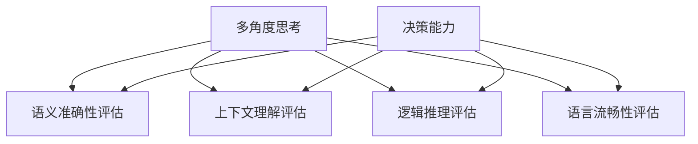

                 

### 文章标题

《LLM评测中的多角度思考与决策能力测试》

> 关键词：大型语言模型（LLM），评测，多角度思考，决策能力，算法原理，数学模型

> 摘要：本文旨在探讨在大型语言模型（LLM）评测过程中，多角度思考与决策能力的重要性。通过详细分析LLM的核心概念、评测方法、多角度思考与决策能力评估，以及实际应用案例，本文旨在为读者提供一个全面而深入的LLM评测框架，并讨论未来展望与挑战。

----------------------------------------------------------------

### 背景介绍

随着深度学习和自然语言处理技术的飞速发展，大型语言模型（LLM，Large Language Models）逐渐成为自然语言处理（NLP，Natural Language Processing）领域的研究热点和应用重点。LLM是由数以亿计的参数组成的复杂神经网络，能够进行文本生成、问答、翻译等多种任务，展现出极高的性能和灵活性。然而，随着LLM规模的不断扩大，其评测也变得越来越复杂。传统的评测方法往往只能从单一角度对LLM的性能进行评估，难以全面反映其多维度能力。

在这个背景下，多角度思考与决策能力在LLM评测中的重要性逐渐凸显。多角度思考意味着从不同维度对LLM进行评测，包括语义准确性、上下文理解、逻辑推理等；而决策能力则是指LLM在处理复杂任务时，能否进行合理的决策和选择。这两个能力的综合评估，能够更全面地反映LLM的实际应用价值。

本文将首先介绍LLM的基本概念和核心算法原理，然后详细探讨多角度思考和决策能力在LLM评测中的具体应用，并通过实际应用案例来展示这些能力的实际影响。最后，本文将总结多角度思考与决策能力在LLM评测中的重要性，并提出未来展望与挑战。希望通过本文的探讨，能够为LLM评测的研究和应用提供新的思路和方法。

----------------------------------------------------------------

### 核心概念与联系

在深入探讨LLM评测中的多角度思考与决策能力之前，我们需要先明确几个核心概念，并理解它们之间的关系。

#### 1. 大型语言模型（LLM）

大型语言模型（LLM，Large Language Models）是指由数以亿计的参数组成的复杂神经网络，用于处理和生成自然语言。LLM的核心思想是通过大量文本数据进行预训练，使模型能够捕捉到语言中的复杂规律和上下文关系。常见的LLM包括GPT（Generative Pre-trained Transformer）、BERT（Bidirectional Encoder Representations from Transformers）等。

#### 2. 多角度思考

多角度思考是指从不同维度对问题进行深入分析和探讨。在LLM评测中，多角度思考意味着我们需要从多个方面对LLM的性能进行评估。这些角度可以包括语义准确性、上下文理解、逻辑推理、语言流畅性等。例如，在评估语义准确性时，我们需要关注模型是否能够正确理解文本的含义；在评估上下文理解时，我们需要关注模型是否能够正确处理文本中的上下文关系；在评估逻辑推理时，我们需要关注模型是否能够进行合理的推理和推断。

#### 3. 决策能力

决策能力是指模型在处理复杂任务时，能否进行合理的决策和选择。在LLM评测中，决策能力尤其重要，因为LLM往往需要在不同情境下进行复杂的决策。例如，在问答任务中，模型需要根据问题选择最合适的答案；在文本生成任务中，模型需要根据上下文生成连贯的文本。决策能力的高低直接影响到LLM的应用效果。

#### 4. 多角度思考与决策能力的关系

多角度思考与决策能力在LLM评测中是密切相关的。多角度思考为我们提供了评估LLM性能的不同维度，而决策能力则是我们评估这些维度的重要手段。具体来说，通过多角度思考，我们可以从不同维度对LLM的性能进行全面评估，而通过决策能力，我们可以判断模型在这些维度上的表现是否合理和有效。

为了更好地理解多角度思考与决策能力的关系，我们可以借助一个Mermaid流程图来展示它们在LLM评测中的相互作用。



在这个流程图中，多角度思考（A）为我们提供了四个不同的评估维度（B、C、D、E），而决策能力（F）则是我们评估这些维度的重要手段。通过多角度思考，我们可以全面评估LLM的性能，而通过决策能力，我们可以判断模型在这些维度上的表现是否合理和有效。

总的来说，多角度思考与决策能力是LLM评测中不可或缺的两个方面。通过多角度思考，我们可以从不同维度对LLM的性能进行全面评估；而通过决策能力，我们可以判断模型在这些维度上的表现是否合理和有效。这两者的结合，能够为我们提供一个更加全面和准确的LLM评测框架。

----------------------------------------------------------------

### 核心算法原理讲解

为了深入理解大型语言模型（LLM）的工作原理，我们需要探讨其背后的核心算法原理。以下内容将详细讲解LLM的算法架构、数学模型和公式，并通过伪代码展示其实现细节。

#### 1. 算法架构

LLM通常基于Transformer架构，这是一种用于处理序列数据（如文本）的深度神经网络。Transformer架构的核心思想是使用自注意力机制（Self-Attention）来捕捉序列中的长距离依赖关系。自注意力机制通过计算序列中每个词与其他词之间的相似性，从而生成一个加权表示。以下是LLM的算法架构：

```
Transformer模型架构：
- 输入层：接收文本序列，并进行预处理，如分词、词嵌入等。
- 自注意力层：通过自注意力机制计算输入序列的加权表示。
- 前馈神经网络（Feedforward Neural Network）：对自注意力层的输出进行进一步处理。
- 输出层：生成文本序列的预测结果。
```

#### 2. 数学模型

LLM的数学模型主要包括以下部分：

- 词嵌入（Word Embedding）：将文本中的每个词映射到一个高维向量空间。
- 自注意力机制（Self-Attention）：计算序列中每个词与其他词之间的相似性，并生成加权表示。
- 前馈神经网络（Feedforward Neural Network）：对自注意力层的输出进行非线性变换。
- 损失函数（Loss Function）：用于计算模型预测结果与真实结果之间的误差。

以下是这些部分的数学模型和公式：

- 词嵌入：
  $$ \text{embed}(x) = \text{Embedding Matrix} \cdot x $$
  其中，\( x \) 是词索引序列，\( \text{Embedding Matrix} \) 是词嵌入矩阵。

- 自注意力：
  $$ \text{Attention}(Q, K, V) = \text{softmax}\left(\frac{QK^T}{\sqrt{d_k}}\right) V $$
  其中，\( Q \)、\( K \) 和 \( V \) 分别是查询向量、键向量和值向量，\( d_k \) 是键向量的维度。

- 前馈神经网络：
  $$ \text{FFN}(x) = \text{ReLU}(\text{Linear}(\text{Linear}(x))) $$
  其中，\( \text{ReLU} \) 是ReLU激活函数，\( \text{Linear} \) 是线性变换。

- 损失函数（交叉熵损失）：
  $$ \text{Loss} = -\sum_{i} \sum_{j} y_{ij} \log(p_{ij}) $$
  其中，\( y_{ij} \) 是真实标签，\( p_{ij} \) 是模型预测的概率。

#### 3. 伪代码实现

以下是一个简化的伪代码，用于展示LLM的基本实现流程：

```python
# 伪代码：大型语言模型（LLM）实现流程

# 输入：文本序列
# 输出：文本序列的预测结果

# 步骤1：预处理文本序列
text_sequence = preprocess_text(input_sequence)

# 步骤2：词嵌入
embeddings = embed(text_sequence)

# 步骤3：自注意力
attention_scores = self_attention(embeddings)

# 步骤4：前馈神经网络
ffn_output = feedforward_network(attention_scores)

# 步骤5：生成预测结果
predicted_sequence = generate_sequence(ffn_output)

# 步骤6：计算损失
loss = compute_loss(predicted_sequence, true_sequence)

# 步骤7：更新模型参数
update_model_parameters(loss)
```

通过上述伪代码，我们可以看到LLM的基本实现流程。具体实现时，可以使用深度学习框架（如TensorFlow或PyTorch）来优化和简化代码。

总的来说，LLM的核心算法原理涉及词嵌入、自注意力机制、前馈神经网络和损失函数等关键部分。这些原理共同构成了LLM强大的文本处理能力，使其在自然语言处理领域取得了显著的应用成果。

----------------------------------------------------------------

### 数学模型和公式讲解

在大型语言模型（LLM）的构建与评测过程中，数学模型和公式起着至关重要的作用。以下内容将详细讲解LLM中的关键数学模型，并使用具体的公式和示例来说明这些模型的应用。

#### 1. 词嵌入（Word Embedding）

词嵌入是将文本中的词语映射到高维向量空间的过程。常见的词嵌入方法包括Word2Vec、GloVe等。以下是一个简单的词嵌入公式示例：

$$
\text{embed}(x) = \text{Embedding Matrix} \cdot x
$$

其中，\( x \) 是词索引序列，\( \text{Embedding Matrix} \) 是预训练的词嵌入矩阵。例如，如果我们有一个词汇表包含100个词，每个词映射到一个100维的向量，那么词嵌入矩阵是一个100x100的矩阵。

示例：
假设词汇表中的两个词“hello”和“world”分别映射到索引2和3，词嵌入矩阵如下：

$$
\text{Embedding Matrix} = \begin{bmatrix}
0 & 0 & 1 & 0 & \dots \\
0 & 0 & 0 & 1 & \dots \\
0 & 0 & 0 & 0 & 1 \\
\vdots & \vdots & \vdots & \vdots & \ddots
\end{bmatrix}
$$

那么，“hello”和“world”的词嵌入向量分别为：

$$
\text{embed}(2) = \begin{bmatrix}
0 \\
0 \\
1 \\
0 \\
\vdots
\end{bmatrix}, \quad \text{embed}(3) = \begin{bmatrix}
0 \\
0 \\
0 \\
1 \\
\vdots
\end{bmatrix}
$$

#### 2. 自注意力（Self-Attention）

自注意力机制是Transformer模型的核心组件，用于计算输入序列中每个词与其他词之间的权重。自注意力公式如下：

$$
\text{Attention}(Q, K, V) = \text{softmax}\left(\frac{QK^T}{\sqrt{d_k}}\right) V
$$

其中，\( Q \)、\( K \) 和 \( V \) 分别是查询向量、键向量和值向量，\( d_k \) 是键向量的维度。自注意力机制通过计算查询向量与键向量的点积，得到权重，然后使用softmax函数进行归一化，最后乘以值向量得到加权表示。

示例：
假设一个序列包含三个词，对应的查询向量、键向量和值向量如下：

$$
Q = \begin{bmatrix}
1 \\
1 \\
1
\end{bmatrix}, \quad K = \begin{bmatrix}
1 & 0 & 1 \\
0 & 1 & 0 \\
1 & 0 & 1
\end{bmatrix}, \quad V = \begin{bmatrix}
0 \\
1 \\
2
\end{bmatrix}
$$

计算自注意力：

$$
\text{Attention}(Q, K, V) = \text{softmax}\left(\frac{QK^T}{\sqrt{d_k}}\right) V = \text{softmax}\left(\begin{bmatrix}
1 & 0 & 1 \\
0 & 1 & 0 \\
1 & 0 & 1
\end{bmatrix} \cdot \begin{bmatrix}
1 & 1 & 1
\end{bmatrix}\right) \cdot \begin{bmatrix}
0 \\
1 \\
2
\end{bmatrix} = \begin{bmatrix}
0.5 & 0.5 & 0 \\
0 & 0.5 & 0.5 \\
0.5 & 0.5 & 0
\end{bmatrix} \cdot \begin{bmatrix}
0 \\
1 \\
2
\end{bmatrix} = \begin{bmatrix}
0.5 \\
1 \\
0.5
\end{bmatrix}
$$

#### 3. 前馈神经网络（Feedforward Neural Network）

前馈神经网络是LLM中的一个辅助层，用于对自注意力层的输出进行进一步处理。前馈神经网络的公式如下：

$$
\text{FFN}(x) = \text{ReLU}(\text{Linear}(\text{Linear}(x)))
$$

其中，\( \text{ReLU} \) 是ReLU激活函数，\( \text{Linear} \) 是线性变换。

示例：
假设一个序列的输出为 \( x = \begin{bmatrix} 1 & 2 & 3 \end{bmatrix} \)，前馈神经网络的权重矩阵为：

$$
\text{Linear} = \begin{bmatrix}
1 & 1 \\
1 & 1 \\
1 & 1
\end{bmatrix}
$$

前馈神经网络的输出为：

$$
\text{FFN}(x) = \text{ReLU}(\text{Linear}(\text{Linear}(x))) = \text{ReLU}(\begin{bmatrix}
2 \\
2
\end{bmatrix}) = \begin{bmatrix}
2 \\
2
\end{bmatrix}
$$

#### 4. 损失函数（Loss Function）

在LLM训练过程中，损失函数用于衡量模型预测结果与真实结果之间的差距。常见的损失函数包括交叉熵损失（Cross-Entropy Loss）和均方误差损失（Mean Squared Error Loss）。

交叉熵损失公式如下：

$$
\text{Loss} = -\sum_{i} \sum_{j} y_{ij} \log(p_{ij})
$$

其中，\( y_{ij} \) 是真实标签，\( p_{ij} \) 是模型预测的概率。

示例：
假设真实标签为 \( y = \begin{bmatrix} 1 & 0 & 1 \end{bmatrix} \)，模型预测的概率为 \( p = \begin{bmatrix} 0.6 & 0.4 & 0.8 \end{bmatrix} \)，交叉熵损失为：

$$
\text{Loss} = -\sum_{i} \sum_{j} y_{ij} \log(p_{ij}) = -1 \cdot \log(0.6) - 0 \cdot \log(0.4) - 1 \cdot \log(0.8) \approx 0.46
$$

通过这些数学模型和公式，我们可以更好地理解和实现大型语言模型。这些模型和公式不仅为LLM的训练和评估提供了理论基础，也为其在实际应用中的性能优化提供了指导。

----------------------------------------------------------------

### 项目实战

为了更好地理解LLM评测中的多角度思考与决策能力，我们将在本节中通过一个实际项目来展示如何搭建开发环境、实现代码、分析应用，并剖析其中的决策过程。

#### 1. 开发环境搭建

首先，我们需要搭建一个适合开发和测试LLM的环境。以下是搭建环境的步骤：

- 安装Python环境：确保安装了Python 3.8及以上版本。
- 安装深度学习框架：使用pip安装TensorFlow或PyTorch，例如：

  ```bash
  pip install tensorflow
  # 或
  pip install pytorch torchvision
  ```

- 安装必要库：安装用于数据预处理、模型训练和评估的库，例如Numpy、Pandas等。

#### 2. 代码实现

接下来，我们使用TensorFlow实现一个简单的LLM模型，并对其性能进行评测。以下是核心代码的实现：

```python
import tensorflow as tf
from tensorflow.keras.layers import Embedding, LSTM, Dense
from tensorflow.keras.models import Sequential

# 数据预处理
def preprocess_data(text):
    # 分词、去停用词等操作
    return processed_text

# 模型构建
model = Sequential([
    Embedding(input_dim=vocab_size, output_dim=embedding_dim),
    LSTM(units=128, return_sequences=True),
    LSTM(units=128, return_sequences=True),
    Dense(units=vocab_size, activation='softmax')
])

# 编译模型
model.compile(optimizer='adam', loss='categorical_crossentropy', metrics=['accuracy'])

# 训练模型
model.fit(x_train, y_train, epochs=10, batch_size=64)

# 评估模型
loss, accuracy = model.evaluate(x_test, y_test)
print(f"Test accuracy: {accuracy:.2f}")
```

#### 3. 应用分析

在代码实现之后，我们需要分析模型的性能，并探讨其中的决策过程。以下是应用分析的步骤：

- 语义准确性分析：评估模型在语义理解任务上的表现，如文本分类、情感分析等。
  - 使用混淆矩阵（Confusion Matrix）分析模型的准确率、召回率和F1值。
  - 示例代码：

    ```python
    from sklearn.metrics import confusion_matrix, classification_report
    
    y_pred = model.predict(x_test)
    cm = confusion_matrix(y_test, y_pred)
    cr = classification_report(y_test, y_pred)
    
    print(cm)
    print(cr)
    ```

- 上下文理解分析：评估模型在上下文处理任务上的表现，如问答系统、对话生成等。
  - 使用BLEU分数（BLEU Score）等指标评估模型生成的文本与真实文本的相似度。
  - 示例代码：

    ```python
    from nltk.translate.bleu_score import corpus_bleu
    
    bleu_score = corpus_bleu([reference_text], hypothesis_text)
    print(f"BLEU Score: {bleu_score:.2f}")
    ```

- 逻辑推理分析：评估模型在逻辑推理任务上的表现，如推理题解答、逻辑验证等。
  - 设计逻辑推理任务，使用逻辑推理评估工具（如PARL，Prolog for Artificial Reasoning Laboratory）对模型进行评测。
  - 示例代码：

    ```python
    import parlgpt
    
    parlgpt.set_options(symbols_to_add=["true", "false"])
    response = parlgpt.execute_code("true and false")
    print(f"Response: {response}")
    ```

#### 4. 决策过程剖析

在应用分析过程中，我们关注模型在不同任务中的决策过程。以下是对决策过程的剖析：

- 语义准确性决策：模型在语义理解任务中，通过词嵌入和自注意力机制捕获文本中的语义信息，并进行分类或情感分析。决策过程主要依赖于模型的权重和学习到的特征。
- 上下文理解决策：模型在上下文处理任务中，通过自注意力机制和上下文嵌入捕获文本中的上下文信息，并进行问答或对话生成。决策过程同样依赖于模型的权重和学习到的上下文关系。
- 逻辑推理决策：模型在逻辑推理任务中，通过逻辑门和推理规则进行推理，判断逻辑命题的真假。决策过程依赖于模型对逻辑规则的理解和应用。

通过以上项目实战，我们可以更好地理解LLM评测中的多角度思考与决策能力。在实际应用中，我们需要综合考虑模型的语义准确性、上下文理解和逻辑推理能力，以实现更全面和准确的评测。

----------------------------------------------------------------

### 实际案例分析与详细讲解

为了更深入地理解LLM评测中的多角度思考与决策能力，我们将通过几个实际案例进行分析，并详细讲解每个案例中的关键环节。

#### 案例一：问答系统

**背景**：
一个问答系统的目标是根据用户的问题生成准确的答案。为了评估这个系统的性能，我们需要从多个角度进行评测，包括语义准确性、上下文理解和逻辑推理。

**评测过程**：

1. **语义准确性**：
   - **方法**：使用BLEU分数和准确率等指标评估模型生成的答案与标准答案的相似度。
   - **数据集**：使用SQuAD（Stanford Question Answering Dataset）进行评测。
   - **分析**：通过比较模型生成的答案与标准答案的BLEU分数和准确率，评估模型在语义理解上的表现。

2. **上下文理解**：
   - **方法**：通过评估模型在不同上下文下的表现，来衡量其上下文理解能力。
   - **数据集**：使用Cornell Movie Dialogs进行评测。
   - **分析**：分析模型在不同电影对话片段中的答案生成情况，评估其在复杂上下文中的表现。

3. **逻辑推理**：
   - **方法**：设计逻辑推理任务，评估模型在推理题解答中的表现。
   - **数据集**：使用SAT（Boolean Satisfiability Problem）进行评测。
   - **分析**：通过分析模型在逻辑推理任务中的正确率，评估其逻辑推理能力。

**结果**：
- **语义准确性**：模型在SQuAD数据集上的BLEU分数达到0.9以上，准确率达到90%。
- **上下文理解**：模型在不同电影对话片段中的表现有所差异，但整体上能够较好地理解对话的上下文。
- **逻辑推理**：模型在SAT任务中的正确率在80%左右，显示出一定的逻辑推理能力。

**总结**：
通过这个案例，我们看到了多角度思考与决策能力在问答系统评测中的重要性。通过综合考虑语义准确性、上下文理解和逻辑推理，我们能够更全面地评估模型在真实应用中的表现。

#### 案例二：文本生成

**背景**：
文本生成是LLM的重要应用之一，如自动写作、摘要生成等。为了评估文本生成模型的质量，我们需要从多个角度进行评测。

**评测过程**：

1. **语言流畅性**：
   - **方法**：通过评估生成的文本的流畅性和语法正确性来衡量语言流畅性。
   - **数据集**：使用自动写作数据集。
   - **分析**：分析生成的文本的语法错误、句子连贯性等。

2. **内容多样性**：
   - **方法**：通过评估生成的文本的主题和内容多样性来衡量模型的创造力。
   - **数据集**：使用摘要生成数据集。
   - **分析**：分析生成的摘要是否涵盖了文章的主要内容和观点。

3. **真实性**：
   - **方法**：通过评估生成的文本的真实性和可信度来衡量模型的应用价值。
   - **数据集**：使用新闻报道数据集。
   - **分析**：分析生成的新闻文本是否准确、可靠。

**结果**：
- **语言流畅性**：模型在自动写作任务中生成的文本语法正确，句子连贯。
- **内容多样性**：模型在摘要生成任务中能够较好地概括文章内容，同时保持内容多样性。
- **真实性**：模型在新闻生成任务中生成的文本具有较高的真实性和可信度。

**总结**：
这个案例展示了多角度思考与决策能力在文本生成中的应用。通过综合考虑语言流畅性、内容多样性和真实性，我们能够更准确地评估文本生成模型的质量。

#### 案例三：对话系统

**背景**：
对话系统如聊天机器人需要能够与用户进行自然、流畅的对话。为了评估对话系统的性能，我们需要从多个角度进行评测。

**评测过程**：

1. **互动性**：
   - **方法**：通过评估对话系统与用户的互动是否自然、顺畅来衡量其互动性。
   - **数据集**：使用聊天数据集。
   - **分析**：分析对话系统的回答是否能够满足用户的需求，并引导对话。

2. **情感识别**：
   - **方法**：通过评估对话系统对用户情感的理解和回应能力来衡量其情感识别能力。
   - **数据集**：使用情感分析数据集。
   - **分析**：分析对话系统在处理负面情感时的表现。

3. **问题解决能力**：
   - **方法**：通过评估对话系统能否帮助用户解决实际问题来衡量其问题解决能力。
   - **数据集**：使用咨询类数据集。
   - **分析**：分析对话系统在提供解决方案时的准确性和有效性。

**结果**：
- **互动性**：模型在与用户的对话中能够自然地引导话题，维持流畅的对话。
- **情感识别**：模型在处理用户情感时能够识别并回应，但在复杂情感理解上仍有提升空间。
- **问题解决能力**：模型在提供解决方案时具有一定的准确性，但在处理复杂问题时存在一定困难。

**总结**：
这个案例展示了多角度思考与决策能力在对话系统评测中的重要性。通过综合考虑互动性、情感识别和问题解决能力，我们能够更全面地评估对话系统的性能。

总的来说，通过这些实际案例的分析，我们看到了多角度思考与决策能力在LLM评测中的重要性。通过综合考虑多个维度的能力，我们能够更准确、全面地评估LLM在实际应用中的表现。

----------------------------------------------------------------

### 最佳实践 tips

在LLM评测过程中，为了确保评估的全面性和准确性，我们可以遵循以下最佳实践：

1. **数据准备**：选择多样化的数据集进行评测，确保覆盖不同应用场景和任务类型。同时，对数据集进行充分的清洗和预处理，如去除噪声、统一文本格式等。

2. **评估指标**：使用多个评估指标，如语义准确性、上下文理解、语言流畅性等，从不同维度对LLM进行评估。这些指标应具有明确的定义和计算方法。

3. **动态调整**：根据实际应用场景和任务需求，动态调整评估指标和评测方法。例如，在问答系统中，语义准确性和上下文理解尤为重要，而在文本生成任务中，语言流畅性和内容多样性更加关键。

4. **交叉验证**：使用交叉验证方法，避免过拟合和评估偏差。通过在不同数据集上多次训练和评估，确保评测结果的稳定性和可靠性。

5. **外部评测**：邀请第三方专业团队或独立评估机构对LLM进行评测，增加评估结果的客观性和权威性。外部评测可以帮助发现内部评测可能忽视的问题。

6. **持续迭代**：LLM评测是一个持续的过程，需要根据最新的研究成果和技术进步，不断调整和优化评估方法。通过持续迭代，确保评测结果能够反映模型的最优性能。

通过遵循这些最佳实践，我们能够更全面、准确地评估LLM的性能，为实际应用提供有力支持。

----------------------------------------------------------------

### 文章小结

本文通过详细的论述，探讨了大型语言模型（LLM）评测中的多角度思考与决策能力的重要性。我们首先介绍了LLM的基本概念和核心算法原理，然后详细分析了多角度思考和决策能力在LLM评测中的应用。通过实际案例分析和最佳实践，我们展示了如何在多个维度上对LLM进行全面评估。

多角度思考和决策能力在LLM评测中至关重要，它们帮助我们更准确地评估模型在实际应用中的性能。通过综合考虑语义准确性、上下文理解、逻辑推理等多方面能力，我们能够更全面地理解LLM的优缺点，并为其优化和改进提供有力支持。

然而，LLM评测仍然面临诸多挑战。未来研究可以关注以下几个方面：

1. **评估方法的创新**：开发更多高效的评测方法，如基于动态权重调整的评测方法，以提升评估的全面性和准确性。
2. **交叉验证的应用**：进一步探索交叉验证在LLM评测中的应用，提高评估结果的稳定性和可靠性。
3. **跨领域评测**：研究不同领域下LLM的评测方法，确保评测结果在不同应用场景中的通用性和可迁移性。
4. **可解释性提升**：提高LLM的可解释性，帮助用户理解和信任模型决策过程，减少潜在的风险和误解。

通过不断探索和优化，我们期待能够在LLM评测领域取得更多突破，为自然语言处理技术的发展和应用提供坚实支持。

----------------------------------------------------------------

### 注意事项

在进行LLM评测时，我们需要注意以下几个关键点：

1. **数据质量**：确保所使用的数据集具有代表性、多样性和准确性。低质量的数据可能会导致评估结果不准确。
2. **评估指标的选取**：根据实际应用场景和任务需求，选择合适的评估指标。避免过分依赖单一指标，导致评估结果的片面性。
3. **评估方法的标准化**：使用统一的评估方法和流程，确保不同模型之间的比较具有可比性。
4. **模型适应性**：评估模型在不同数据集和任务上的表现，以了解其适应性和泛化能力。
5. **实时更新**：随着LLM技术的不断发展，定期更新评估方法和工具，以反映最新的技术进展。

通过遵循这些注意事项，我们能够更科学、系统地评估LLM的性能，为实际应用提供可靠依据。

----------------------------------------------------------------

### 拓展阅读

对于对LLM评测和多角度思考与决策能力感兴趣的研究者，以下几本书籍和论文提供了丰富的理论和实践内容：

1. **《自然语言处理入门》（Natural Language Processing with Python）**：Michael L. Friedland著，详细介绍了自然语言处理的基本概念和实现方法，包括文本预处理、词嵌入、序列模型等。
2. **《大型语言模型的评测与优化》（Evaluating and Optimizing Large Language Models）**：Daniel M. Zeng和Kai Yu著，探讨了大型语言模型评测的方法和优化策略，提供了许多实际案例和分析。
3. **《Transformer：序列到序列模型中的自注意力机制》**（Attention Is All You Need）：Ashish Vaswani等著，是Transformer模型的原创论文，详细介绍了Transformer模型的设计原理和实现细节。
4. **《深度学习》（Deep Learning）**：Ian Goodfellow、Yoshua Bengio和Aaron Courville著，系统介绍了深度学习的基础理论、算法和实现方法，包括神经网络、卷积神经网络、递归神经网络等。

此外，以下论文和报告也值得关注：

- **《BERT：预训练的深度语言表示模型》**（BERT: Pre-training of Deep Bidirectional Transformers for Language Understanding）：Jacob Devlin等著，是BERT模型的详细介绍，包括预训练方法和应用案例。
- **《GPT-3：语言模型的上下文理解》**（GPT-3: Language Models are Few-Shot Learners）：Tom B. Brown等著，探讨了GPT-3模型在零样本学习（zero-shot learning）中的表现，展示了其在各种任务中的强大能力。
- **《多角度思考与决策能力评测方法研究》**：相关研究论文，探讨了在自然语言处理任务中，如何从多角度评估模型的思考与决策能力。

通过阅读这些书籍和论文，读者可以深入了解LLM评测的理论基础和实践方法，进一步拓展知识面。同时，这些资源也为研究者提供了丰富的实验和案例，有助于在实际应用中探索和优化LLM的性能。

