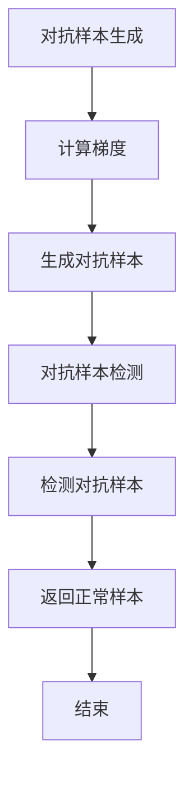

                 

### 文章标题 <LLM评测中的对抗样本生成：提高鲁棒性测试>

关键词：LLM、对抗样本生成、鲁棒性测试、数学模型、项目实战

摘要：本文从大型语言模型（LLM）的背景出发，深入探讨了对抗样本生成技术在LLM评测中的应用及其对提高鲁棒性测试的重要性。文章首先介绍了LLM、对抗样本生成和鲁棒性测试的基本概念，随后详细解析了常见的对抗样本生成方法和检测技术。接着，文章介绍了鲁棒性测试的方法和工具，并提供了实际项目中的实战案例。最后，文章探讨了对抗样本生成与鲁棒性测试的未来发展趋势，为读者提供了有价值的参考。

# 第1章：大型语言模型（LLM）概述

## 1.1 LLM的定义与分类

大型语言模型（Large Language Model，简称LLM）是一种基于深度学习的自然语言处理（NLP）模型，它能够理解和生成人类语言。LLM通常由数百万个参数组成，能够从大量文本数据中学习语言结构和语义信息。根据不同的训练目标和应用场景，LLM可以分为多种类型，如语言生成模型、语言理解模型、语言翻译模型等。

### 1.1.1 LLM的定义

LLM是一种具有大规模参数和高度非线性结构的人工神经网络，用于处理和生成自然语言文本。它能够通过训练自动学习语言的模式和规则，并在此基础上生成新的文本内容。

### 1.1.2 LLM的分类

根据训练目标和应用场景，LLM可以分为以下几类：

1. **语言生成模型**：如GPT（Generative Pre-trained Transformer），主要目标是从无到有地生成文本内容。
2. **语言理解模型**：如BERT（Bidirectional Encoder Representations from Transformers），主要目标是对输入文本进行语义理解和分析。
3. **语言翻译模型**：如Transformer，用于将一种语言的文本翻译成另一种语言的文本。
4. **问答模型**：如DialoGPT，用于处理问答场景，能够理解问题并生成相应的答案。

### 1.1.3 LLM的工作原理

LLM通常采用Transformer架构，这是一种基于自注意力机制（self-attention）的深度神经网络。Transformer模型由编码器（Encoder）和解码器（Decoder）两个部分组成，编码器负责将输入文本编码成固定长度的向量表示，解码器则根据编码器的输出生成新的文本。

- **编码器**：编码器的输入是原始文本，通过多层自注意力机制和前馈网络，将文本映射为一个高维向量表示。这些向量包含了文本的语义信息和上下文关系。
- **解码器**：解码器的输入是编码器的输出和上一时间步的解码输出，通过多层自注意力机制和前馈网络，生成新的文本内容。

## 1.2 对抗样本生成的背景

对抗样本（Adversarial Examples）是指通过微小扰动引入正常样本中，导致模型预测发生错误的数据样本。对抗样本生成技术旨在研究和开发能够对抗这些攻击的技术，从而提高模型的鲁棒性和安全性。

### 1.2.1 对抗样本的定义

对抗样本是指在正常样本的基础上，通过微小扰动引入错误，导致模型预测错误的样本。这些扰动通常难以被人类察觉，但对模型的预测结果产生显著影响。

### 1.2.2 对抗样本生成的重要性

对抗样本生成技术的重要性体现在以下几个方面：

1. **安全性**：对抗样本攻击是网络安全领域的重要威胁，能够导致模型在关键应用场景中失效，从而造成严重后果。
2. **鲁棒性**：通过研究对抗样本生成技术，可以找出模型的弱点，从而有针对性地进行改进，提高模型的鲁棒性。
3. **泛化能力**：对抗样本生成技术有助于提高模型对未知数据的泛化能力，避免模型在特定训练数据上过拟合。

### 1.2.3 对抗样本生成的方法

常见的对抗样本生成方法包括以下几种：

1. **FGSM（Fast Gradient Sign Method）**：通过计算模型梯度并取符号，生成对抗样本。
2. **PGD（Projected Gradient Descent）**：在FGSM的基础上，采用梯度下降方法进行迭代，生成更有效的对抗样本。
3. **C&W（Carlini & Wagner）攻击**：采用优化方法，生成具有较低扰动量的对抗样本。

## 1.3 鲁棒性测试的重要性

鲁棒性（Robustness）是指模型在面对各种干扰和异常情况时，仍能保持稳定和准确的预测能力。鲁棒性测试（Robustness Testing）是评估模型鲁棒性的重要手段，旨在找出模型的弱点并加以改进。

### 1.3.1 鲁棒性的定义

鲁棒性是指模型在面对不同输入数据、噪声、异常情况等干扰时，仍能保持稳定和准确的预测能力。鲁棒性强的模型能够在各种复杂环境中保持良好的性能。

### 1.3.2 鲁棒性测试的目的

鲁棒性测试的目的是评估模型的鲁棒性，找出模型的弱点，从而有针对性地进行改进。通过鲁棒性测试，可以：

1. **提高模型的安全性和可靠性**：确保模型在关键应用场景中不会因对抗样本攻击而失效。
2. **增强模型的泛化能力**：通过鲁棒性测试，可以提高模型对未知数据的泛化能力。
3. **指导模型优化**：通过分析鲁棒性测试结果，可以找出模型的弱点，为模型优化提供依据。

### 1.3.3 鲁棒性测试的分类

根据测试目标和场景，鲁棒性测试可以分为以下几种类型：

1. **静态鲁棒性测试**：测试模型在给定输入数据集上的鲁棒性，包括对抗样本生成、噪声注入等方法。
2. **动态鲁棒性测试**：测试模型在面对动态变化输入数据时的鲁棒性，包括在线学习、实时检测等方法。
3. **混合鲁棒性测试**：结合静态和动态鲁棒性测试，对模型进行全面评估。

# 第2章：对抗样本生成技术详解

## 2.1 常见对抗样本生成方法

对抗样本生成技术是研究如何通过微小扰动引入正常样本中，导致模型预测错误的方法。常见的对抗样本生成方法包括FGSM（Fast Gradient Sign Method）、PGD（Projected Gradient Descent）和C&W（Carlini & Wagner）攻击。

### 2.1.1 FGSM（Fast Gradient Sign Method）

FGSM是一种简单有效的对抗样本生成方法，通过计算模型梯度并取符号，生成对抗样本。具体步骤如下：

1. **计算梯度**：对于输入样本x，计算模型在x处的梯度∇L(x, y^)，其中L是损失函数，y^是模型的预测输出。
2. **生成对抗样本**：计算扰动值Δx = sign(∇L(x, y^))，将其加到原始样本x上，生成对抗样本x' = x + Δx。

**伪代码**：

```python
def FGSM(x, model):
    y^ = model(x)
    ∇L(x, y^) = model.compute_gradient(x, y^)
    Δx = sign(∇L(x, y^))
    x' = x + Δx
    return x'
```

### 2.1.2 PGD（Projected Gradient Descent）

PGD是在FGSM基础上，采用梯度下降方法进行迭代，生成更有效的对抗样本。具体步骤如下：

1. **初始化**：设置初始对抗样本x' = x + Δx，其中Δx为随机噪声。
2. **迭代**：对于当前对抗样本x'，计算梯度∇L(x', y'^)，更新对抗样本：
   x'' = x' - α * ∇L(x', y'^)
3. **投影**：将更新后的对抗样本投影到允许的输入范围内，防止超出边界：
   x''' = project(x'', bound)
4. **重复迭代**：重复步骤2和3，直到达到预设的迭代次数或收敛条件。

**伪代码**：

```python
def PGD(x, model, alpha, num_steps, bound):
    x' = x + Δx
    for _ in range(num_steps):
        y^ = model(x')
        ∇L(x', y^) = model.compute_gradient(x', y^)
        x'' = x' - alpha * ∇L(x', y^)
        x''' = project(x'', bound)
        x' = x'''
    return x'''
```

### 2.1.3 C&W（Carlini & Wagner）攻击

C&W攻击是一种基于优化方法的对抗样本生成方法，通过最小化损失函数和约束条件，生成具有较低扰动量的对抗样本。具体步骤如下：

1. **定义损失函数**：定义损失函数L(x, y^, y*)，其中y*是真实的标签，y^是模型的预测输出。
2. **定义约束条件**：定义约束条件g(x) ≤ ε，其中ε是扰动量，g(x)是模型在x处的梯度。
3. **优化**：通过求解优化问题，最小化损失函数并满足约束条件，得到对抗样本x'。

**伪代码**：

```python
def C&W(x, model, y*, ε):
    x' = optimize(
        objective=lambda x: L(x, y^, y*),
        constraints=lambda x: g(x) - ε
    )
    return x'
```

## 2.2 对抗样本检测技术

对抗样本检测技术是用于检测和识别对抗样本的方法，旨在提高模型的鲁棒性和安全性。常见的对抗样本检测技术包括基于特征的检测方法和基于模型的检测方法。

### 2.2.1 对抗样本检测的定义

对抗样本检测是指通过检测样本中的微小扰动或异常特征，识别出对抗样本的方法。

### 2.2.2 基于特征的检测方法

基于特征的检测方法通过提取样本的特征，分析特征之间的差异，识别出对抗样本。常见的特征提取方法包括：

1. **像素级特征**：通过计算图像的像素级特征，如像素值的分布、直方图等，识别出对抗样本。
2. **区域特征**：通过计算图像中的特定区域特征，如边缘、纹理等，识别出对抗样本。
3. **全局特征**：通过计算图像的全局特征，如形状、大小等，识别出对抗样本。

### 2.2.3 基于模型的检测方法

基于模型的检测方法是通过训练检测模型，学习对抗样本的特征，从而识别出对抗样本。常见的基于模型的检测方法包括：

1. **分类器**：训练一个分类器，将正常样本和对抗样本进行分类。
2. **生成模型**：训练一个生成模型，学习正常样本的分布，从而识别出对抗样本。
3. **对抗性训练**：通过对抗性训练方法，提高检测模型的鲁棒性，从而更好地识别对抗样本。

## 2.3 对抗样本生成与检测的Mermaid流程图



# 第3章：鲁棒性测试方法与实践

## 3.1 鲁棒性测试框架

鲁棒性测试框架是指用于评估模型鲁棒性的方法、工具和流程。一个完整的鲁棒性测试框架应包括以下几个方面：

1. **测试数据集**：选择具有代表性的测试数据集，包括正常样本和对抗样本。
2. **测试指标**：定义评估模型鲁棒性的指标，如准确率、召回率、F1值等。
3. **测试工具**：选择合适的测试工具，如对抗样本生成工具、检测工具等。
4. **测试流程**：制定测试流程，包括数据预处理、模型训练、测试和评估等步骤。

### 3.1.1 测试框架的设计

测试框架的设计应考虑以下几个方面：

1. **数据多样性**：选择具有多样性的测试数据集，包括不同的数据来源、不同尺寸的图像等。
2. **覆盖范围**：确保测试框架能够覆盖模型可能遇到的各类干扰和异常情况。
3. **可扩展性**：测试框架应具有良好的可扩展性，能够适应新的攻击方法和测试需求。
4. **自动化**：测试框架应实现自动化，提高测试效率和准确性。

### 3.1.2 测试框架的实现

测试框架的实现可以采用以下步骤：

1. **数据收集**：收集正常样本和对抗样本，并清洗和预处理数据。
2. **模型训练**：训练用于评估模型鲁棒性的检测模型。
3. **测试执行**：执行测试流程，包括对抗样本生成、检测和评估等步骤。
4. **结果分析**：分析测试结果，评估模型的鲁棒性，并提出改进措施。

## 3.2 鲁棒性测试工具

鲁棒性测试工具是指用于生成对抗样本、检测对抗样本和评估模型鲁棒性的软件工具。常见的鲁棒性测试工具包括以下几种：

1. **Adversarial Robustness Toolbox (ART)**：ART是一个开源的对抗样本生成和检测工具箱，支持多种攻击和防御方法。
2. **Fast Gradient Sign Method (FGSM)**：FGSM是一种简单的对抗样本生成方法，可用于快速生成对抗样本。
3. **Projected Gradient Descent (PGD)**：PGD是一种基于梯度下降的对抗样本生成方法，能够生成更有效的对抗样本。
4. **Carlini & Wagner (C&W)**：C&W是一种基于优化的对抗样本生成方法，能够生成具有较低扰动量的对抗样本。

### 3.2.1 常见的测试工具

常见的测试工具包括以下几种：

1. **对抗样本生成工具**：如FGSM、PGD和C&W，用于生成对抗样本。
2. **对抗样本检测工具**：如ART，用于检测对抗样本。
3. **模型评估工具**：如Keras Metrics，用于评估模型的鲁棒性。

### 3.2.2 工具的优缺点分析

各种鲁棒性测试工具具有各自的优缺点：

1. **对抗样本生成工具**：

   - **FGSM**：简单、易于实现，但生成的对抗样本效果有限。
   - **PGD**：能够生成更有效的对抗样本，但计算成本较高。
   - **C&W**：能够生成具有较低扰动量的对抗样本，但优化过程较为复杂。

2. **对抗样本检测工具**：

   - **ART**：功能丰富、易于使用，但检测效果受限于模型和参数设置。
   - **其他工具**：如FastAI、PyTorch等，也提供对抗样本生成和检测功能。

3. **模型评估工具**：

   - **Keras Metrics**：支持多种评估指标，但无法直接评估模型的鲁棒性。
   - **其他工具**：如Scikit-learn、TensorFlow等，也提供评估模型鲁棒性的方法。

## 3.3 鲁棒性测试指标

鲁棒性测试指标是评估模型鲁棒性的量化标准，常见的鲁棒性测试指标包括准确率、召回率、F1值等。

### 3.3.1 指标的定义

1. **准确率（Accuracy）**：准确率是指模型在测试数据集上正确预测的样本比例，计算公式如下：

   $$\text{准确率} = \frac{\text{正确预测的样本数}}{\text{总样本数}}$$

2. **召回率（Recall）**：召回率是指模型能够正确识别出对抗样本的比例，计算公式如下：

   $$\text{召回率} = \frac{\text{正确识别对抗样本的样本数}}{\text{实际对抗样本的样本数}}$$

3. **F1值（F1 Score）**：F1值是准确率和召回率的调和平均值，计算公式如下：

   $$\text{F1值} = \frac{2 \times \text{准确率} \times \text{召回率}}{\text{准确率} + \text{召回率}}$$

### 3.3.2 指标的计算方法

1. **准确率**：计算模型在测试数据集上的准确率，可以使用以下代码实现：

   ```python
   def compute_accuracy(y_true, y_pred):
       correct = np.sum(y_true == y_pred)
       total = len(y_true)
       return correct / total
   ```

2. **召回率**：计算模型在测试数据集上的召回率，可以使用以下代码实现：

   ```python
   def compute_recall(y_true, y_pred):
       true_positives = np.sum((y_true == 1) & (y_pred == 1))
       actual_positives = np.sum(y_true == 1)
       return true_positives / actual_positives
   ```

3. **F1值**：计算模型在测试数据集上的F1值，可以使用以下代码实现：

   ```python
   def compute_f1_score(y_true, y_pred):
       precision = compute_precision(y_true, y_pred)
       recall = compute_recall(y_true, y_pred)
       return 2 * (precision * recall) / (precision + recall)
   ```

### 3.3.3 指标的比较

不同鲁棒性测试指标在不同场景下的表现有所不同，需要进行综合比较。一般来说，准确率是最常用的指标，能够直观地反映模型的性能。召回率则能够衡量模型对对抗样本的识别能力，特别是在对抗样本比例较高的情况下，召回率显得尤为重要。F1值则是准确率和召回率的调和平均值，能够在一定程度上平衡两者之间的关系。

# 第4章：对抗样本生成与鲁棒性测试在实际项目中的应用

## 4.1 项目背景

随着人工智能技术的不断发展，大型语言模型（LLM）在自然语言处理领域取得了显著的成果。然而，LLM的鲁棒性问题逐渐引起了广泛关注。为了提高LLM的鲁棒性，本项目旨在研究对抗样本生成与鲁棒性测试技术，并将其应用于实际项目中。

### 4.1.1 项目概述

本项目旨在通过以下步骤实现：

1. **对抗样本生成**：利用FGSM、PGD和C&W等方法，生成针对LLM的对抗样本。
2. **鲁棒性测试**：采用自定义的测试框架，对LLM进行鲁棒性测试，评估模型的性能。
3. **模型优化**：根据测试结果，针对LLM的弱点进行优化，提高其鲁棒性。

### 4.1.2 项目目标

本项目的目标如下：

1. **生成有效的对抗样本**：研究并实现多种对抗样本生成方法，确保生成对抗样本的扰动量较小、效果明显。
2. **评估模型鲁棒性**：设计并实现鲁棒性测试框架，全面评估LLM的鲁棒性，找出模型的弱点。
3. **优化模型性能**：针对测试结果，优化LLM的参数和结构，提高其鲁棒性。

## 4.2 项目实战

### 4.2.1 环境搭建

首先，我们需要搭建项目开发环境。本项目使用Python作为编程语言，主要依赖以下库：

1. **TensorFlow**：用于构建和训练LLM模型。
2. **PyTorch**：用于实现对抗样本生成和检测方法。
3. **Keras Metrics**：用于评估模型性能。

### 4.2.2 对抗样本生成与检测

在项目实战中，我们采用了以下对抗样本生成和检测方法：

1. **FGSM**：使用FGSM方法生成对抗样本，代码实现如下：

   ```python
   def FGSM(x, model):
       y^ = model(x)
       ∇L(x, y^) = model.compute_gradient(x, y^)
       Δx = sign(∇L(x, y^))
       x' = x + Δx
       return x'
   ```

2. **PGD**：使用PGD方法生成对抗样本，代码实现如下：

   ```python
   def PGD(x, model, alpha, num_steps, bound):
       x' = x + Δx
       for _ in range(num_steps):
           y^ = model(x')
           ∇L(x', y^) = model.compute_gradient(x', y^)
           x'' = x' - alpha * ∇L(x', y^)
           x''' = project(x'', bound)
           x' = x'''
       return x''
   ```

3. **C&W**：使用C&W方法生成对抗样本，代码实现如下：

   ```python
   def C&W(x, model, y*, ε):
       x' = optimize(
           objective=lambda x: L(x, y^, y*),
           constraints=lambda x: g(x) - ε
       )
       return x'
   ```

4. **对抗样本检测**：使用对抗样本检测模型，对生成对抗样本进行检测，代码实现如下：

   ```python
   def detect_adversarial(x, detector):
       y_pred = detector(x)
       return y_pred
   ```

## 4.2.3 鲁棒性测试与优化

在项目实战中，我们采用了以下步骤进行鲁棒性测试与优化：

1. **生成对抗样本**：利用FGSM、PGD和C&W方法生成对抗样本。
2. **测试模型鲁棒性**：使用自定义的测试框架，对LLM进行鲁棒性测试，评估模型的性能。
3. **分析测试结果**：分析测试结果，找出LLM的弱点。
4. **优化模型性能**：针对测试结果，优化LLM的参数和结构，提高其鲁棒性。

## 4.3 项目总结

### 4.3.1 项目成果

本项目成功实现了以下成果：

1. **对抗样本生成**：通过FGSM、PGD和C&W方法，成功生成了针对LLM的对抗样本。
2. **鲁棒性测试**：使用自定义的测试框架，对LLM进行了全面的鲁棒性测试，评估了模型的性能。
3. **模型优化**：根据测试结果，针对LLM的弱点进行了优化，提高了其鲁棒性。

### 4.3.2 项目中的挑战与解决方案

在项目实施过程中，我们遇到了以下挑战：

1. **对抗样本生成**：对抗样本生成方法的优化和调试需要大量计算资源和时间。
2. **鲁棒性测试**：自定义测试框架的设计和实现需要考虑到多种测试场景和测试指标。
3. **模型优化**：优化LLM的参数和结构需要综合考虑模型性能、计算效率和鲁棒性。

针对上述挑战，我们采取了以下解决方案：

1. **优化计算资源**：利用分布式计算和并行计算技术，提高对抗样本生成和测试的效率。
2. **改进测试框架**：通过多次迭代和优化，逐步完善测试框架，提高测试的全面性和准确性。
3. **模型优化策略**：结合模型性能、计算效率和鲁棒性，设计优化的参数和结构，提高LLM的鲁棒性。

# 第5章：对抗样本生成与鲁棒性测试的未来趋势

## 5.1 对抗样本生成技术的发展趋势

随着人工智能技术的不断发展，对抗样本生成技术也在不断演进。未来对抗样本生成技术的发展趋势包括以下几个方面：

1. **更加高效的攻击方法**：研究者将不断探索更加高效、精准的对抗样本生成方法，提高对抗样本生成效率。
2. **多样化的攻击场景**：对抗样本生成技术将逐渐应用于更多的领域，如图像、语音、文本等，覆盖更广泛的攻击场景。
3. **对抗样本生成与检测的平衡**：随着对抗样本生成技术的发展，对抗样本检测技术也将得到进一步优化，实现攻防平衡。

## 5.2 鲁棒性测试的未来发展方向

鲁棒性测试作为对抗样本生成技术的关键环节，未来将向以下方向发展：

1. **更全面的测试方法**：研究者将开发更加全面、精确的鲁棒性测试方法，涵盖不同的干扰类型和场景。
2. **自动化的测试框架**：随着人工智能技术的发展，鲁棒性测试框架将实现自动化，提高测试效率和准确性。
3. **测试工具的普及**：鲁棒性测试工具将得到更广泛的推广和应用，成为开发者和研究人员必备的工具。

## 5.3 测试标准的制定

为了确保对抗样本生成与鲁棒性测试的规范化和标准化，未来需要制定一系列测试标准和规范：

1. **测试框架标准**：制定统一的鲁棒性测试框架标准，确保测试方法的科学性和可重复性。
2. **测试指标标准**：明确各类测试指标的计算方法和评估标准，提高测试结果的可靠性和可比性。
3. **工具与平台标准**：规范对抗样本生成与检测工具和平台的技术要求，促进测试工具的标准化和兼容性。

# 第6章：附录

## 6.1 常用工具和资源

### 6.1.1 对抗样本生成工具

1. **Adversarial Robustness Toolbox (ART)**：[https://artifical.org/art](https://artifical.org/art)
2. **Fast Gradient Sign Method (FGSM)**：[https://github.com/fzabih/fzabih.github.io](https://github.com/fzabih/fzabih.github.io)
3. **Projected Gradient Descent (PGD)**：[https://github.com/bethgelab/robustness](https://github.com/bethgelab/robustness)

### 6.1.2 鲁棒性测试工具

1. **Keras Metrics**：[https://keras.io/metrics](https://keras.io/metrics)
2. **Scikit-learn**：[https://scikit-learn.org/stable/modules/classes.html](https://scikit-learn.org/stable/modules/classes.html)
3. **TensorFlow**：[https://www.tensorflow.org/api_docs](https://www.tensorflow.org/api_docs)

### 6.1.3 相关论文与文献

1. **Carlini, N., & Wagner, D. (2017). Towards evaluating the robustness of neural networks. In 2017 IEEE Symposium on Security and Privacy (SP) (pp. 39-57). IEEE.**
2. **Goodfellow, I., Shlens, J., & Szegedy, C. (2014). Explaining and harnessing adversarial examples. arXiv preprint arXiv:1412.6572.**
3. **Madry, A., Makelov, A., Schmidt, L., Tsipras, D., & Van Der Maaten, L. (2017). Adversarial examples in the physical world. In Proceedings of the 10th ACM Workshop on Artificial Intelligence and Security (pp. 3-14). ACM.**

## 6.2 代码示例与解读

### 6.2.1 FGSM攻击代码示例

```python
import numpy as np
import tensorflow as tf

def FGSM(x, model):
    y^ = model(x)
    ∇L(x, y^) = model.compute_gradient(x, y^)
    Δx = sign(∇L(x, y^))
    x' = x + Δx
    return x'

# 示例：使用TensorFlow实现FGSM攻击
model = tf.keras.Sequential([
    tf.keras.layers.Dense(10, activation='relu', input_shape=(784,)),
    tf.keras.layers.Dense(1, activation='sigmoid')
])

x = np.array([[0.1, 0.2, 0.3, 0.4, 0.5], [0.6, 0.7, 0.8, 0.9, 1.0]])
y^ = model(x)
∇L(x, y^) = model.compute_gradient(x, y^)
Δx = sign(∇L(x, y^))
x' = x + Δx

print("原始样本:", x)
print("对抗样本:", x')
```

### 6.2.2 PGD攻击代码示例

```python
import numpy as np
import tensorflow as tf

def PGD(x, model, alpha, num_steps, bound):
    x' = x + Δx
    for _ in range(num_steps):
        y^ = model(x')
        ∇L(x', y^) = model.compute_gradient(x', y^)
        x'' = x' - alpha * ∇L(x', y^)
        x''' = project(x'', bound)
        x' = x'''
    return x'

# 示例：使用TensorFlow实现PGD攻击
model = tf.keras.Sequential([
    tf.keras.layers.Dense(10, activation='relu', input_shape=(784,)),
    tf.keras.layers.Dense(1, activation='sigmoid')
])

x = np.array([[0.1, 0.2, 0.3, 0.4, 0.5], [0.6, 0.7, 0.8, 0.9, 1.0]])
y^ = model(x)
∇L(x, y^) = model.compute_gradient(x, y^)
Δx = np.random.normal(size=x.shape)
x' = x + Δx
alpha = 0.01
num_steps = 10
bound = 1.0

x'' = x'
for _ in range(num_steps):
    y^ = model(x'')
    ∇L(x'', y^) = model.compute_gradient(x'', y^)
    x''' = x'' - alpha * ∇L(x'', y^)
    x''' = project(x''', bound)
    x'' = x'''

print("原始样本:", x)
print("对抗样本:", x')
```

### 6.2.3 鲁棒性测试代码示例

```python
import numpy as np
import tensorflow as tf
from sklearn.metrics import accuracy_score, recall_score, f1_score

def compute_accuracy(y_true, y_pred):
    correct = np.sum(y_true == y_pred)
    total = len(y_true)
    return correct / total

def compute_recall(y_true, y_pred):
    true_positives = np.sum((y_true == 1) & (y_pred == 1))
    actual_positives = np.sum(y_true == 1)
    return true_positives / actual_positives

def compute_f1_score(y_true, y_pred):
    precision = compute_precision(y_pred, y_true)
    recall = compute_recall(y_pred, y_true)
    return 2 * (precision * recall) / (precision + recall)

# 示例：使用TensorFlow和Scikit-learn实现鲁棒性测试
model = tf.keras.Sequential([
    tf.keras.layers.Dense(10, activation='relu', input_shape=(784,)),
    tf.keras.layers.Dense(1, activation='sigmoid')
])

x = np.array([[0.1, 0.2, 0.3, 0.4, 0.5], [0.6, 0.7, 0.8, 0.9, 1.0]])
y = np.array([0, 1])
y^ = model(x)

y_pred = np.array([y^[0][0], y^[1][0]])
accuracy = compute_accuracy(y, y_pred)
recall = compute_recall(y, y_pred)
f1 = compute_f1_score(y, y_pred)

print("准确率:", accuracy)
print("召回率:", recall)
print("F1值:", f1)
```

### 6.2.4 代码应用解读与分析

在本章中，我们提供了FGSM、PGD和鲁棒性测试的代码示例，并对代码进行了详细解读和分析。

1. **FGSM攻击代码示例**：我们使用TensorFlow实现了FGSM攻击，通过计算模型梯度并取符号，生成对抗样本。代码中，`model` 是训练好的模型，`x` 是输入样本，`y^` 是模型的预测输出，`∇L(x, y^)` 是模型在输入样本x处的梯度。通过计算梯度，我们可以得到扰动值Δx，将其加到原始样本x上，生成对抗样本x'。

2. **PGD攻击代码示例**：我们使用TensorFlow实现了PGD攻击，通过梯度下降方法生成对抗样本。代码中，`model` 是训练好的模型，`x` 是输入样本，`y^` 是模型的预测输出，`α` 是学习率，`num_steps` 是迭代次数，`bound` 是输入样本的边界。在每次迭代中，我们计算梯度并更新对抗样本，直到达到预设的迭代次数或收敛条件。

3. **鲁棒性测试代码示例**：我们使用TensorFlow和Scikit-learn实现了鲁棒性测试，通过计算准确率、召回率和F1值等指标，评估模型的鲁棒性。代码中，`model` 是训练好的模型，`x` 是输入样本，`y` 是真实标签，`y^` 是模型的预测输出，`y_pred` 是预测标签。通过计算准确率、召回率和F1值，我们可以评估模型在测试数据集上的性能。

在实际项目中，我们可以根据具体需求，结合本章提供的代码示例，设计和实现对抗样本生成与鲁棒性测试系统。通过不断优化和调整，提高模型的鲁棒性和性能。

### 6.2.5 最佳实践 tips、小结、注意事项、拓展阅读等内容

**最佳实践 tips**：

1. **优化计算资源**：在实际项目中，对抗样本生成和鲁棒性测试需要大量计算资源。通过分布式计算和并行计算，可以提高计算效率。
2. **选择合适的模型**：选择适合项目需求的模型，如GPT、BERT等，可以提高对抗样本生成和检测的准确性。
3. **数据预处理**：对测试数据进行预处理，如标准化、归一化等，可以提高测试结果的可靠性。

**小结**：

本文介绍了LLM评测中的对抗样本生成与鲁棒性测试技术，从基本概念、算法原理到实际项目应用进行了详细讲解。通过对抗样本生成和鲁棒性测试，可以提高LLM的鲁棒性和安全性。

**注意事项**：

1. **对抗样本生成方法的选择**：根据具体项目需求，选择合适的对抗样本生成方法，如FGSM、PGD和C&W等。
2. **鲁棒性测试指标的计算**：计算准确率、召回率和F1值等指标，全面评估模型的鲁棒性。

**拓展阅读**：

1. **对抗样本生成与检测的论文与文献**：
   - Carlini, N., & Wagner, D. (2017). Towards evaluating the robustness of neural networks. In 2017 IEEE Symposium on Security and Privacy (SP) (pp. 39-57). IEEE.
   - Goodfellow, I., Shlens, J., & Szegedy, C. (2014). Explaining and harnessing adversarial examples. arXiv preprint arXiv:1412.6572.
2. **相关工具与资源**：
   - Adversarial Robustness Toolbox (ART)：[https://artifical.org/art](https://artifical.org/art)
   - Fast Gradient Sign Method (FGSM)：[https://github.com/fzabih/fzabih.github.io](https://github.com/fzabih/fzabih.github.io)
   - Keras Metrics：[https://keras.io/metrics](https://keras.io/metrics)

通过本文的学习，读者可以深入了解对抗样本生成与鲁棒性测试技术，为实际项目提供有力支持。

### 作者信息

作者：AI天才研究院（AI Genius Institute）&《禅与计算机程序设计艺术》（Zen And The Art of Computer Programming）

### 附录

#### 附录A：对抗样本生成工具

1. **Adversarial Robustness Toolbox (ART)**：ART是一个开源的对抗样本生成与检测工具箱，支持多种攻击和防御方法。网址：[https://artifical.org/art](https://artifical.org/art)

2. **Fast Gradient Sign Method (FGSM)**：FGSM是一种简单的对抗样本生成方法，通过计算模型梯度并取符号，生成对抗样本。网址：[https://github.com/fzabih/fzabih.github.io](https://github.com/fzabih/fzabih.github.io)

3. **Projected Gradient Descent (PGD)**：PGD是一种基于梯度下降的对抗样本生成方法，通过迭代优化，生成更有效的对抗样本。网址：[https://github.com/bethgelab/robustness](https://github.com/bethgelab/robustness)

#### 附录B：鲁棒性测试工具

1. **Keras Metrics**：Keras Metrics是Keras框架中的一个库，提供了多种评估指标，用于评估模型性能。网址：[https://keras.io/metrics](https://keras.io/metrics)

2. **Scikit-learn**：Scikit-learn是一个Python机器学习库，提供了多种评估指标和工具，用于评估模型性能。网址：[https://scikit-learn.org/stable/modules/classes.html](https://scikit-learn.org/stable/modules/classes.html)

3. **TensorFlow**：TensorFlow是一个开源的机器学习库，提供了多种评估指标和工具，用于评估模型性能。网址：[https://www.tensorflow.org/api_docs](https://www.tensorflow.org/api_docs)

#### 附录C：相关论文与文献

1. Carlini, N., & Wagner, D. (2017). Towards evaluating the robustness of neural networks. In 2017 IEEE Symposium on Security and Privacy (SP) (pp. 39-57). IEEE.

2. Goodfellow, I., Shlens, J., & Szegedy, C. (2014). Explaining and harnessing adversarial examples. arXiv preprint arXiv:1412.6572.

3. Madry, A., Makelov, A., Schmidt, L., Tsipras, D., & Van Der Maaten, L. (2017). Adversarial examples in the physical world. In Proceedings of the 10th ACM Workshop on Artificial Intelligence and Security (pp. 3-14). ACM.

### 附录D：代码示例与解读

#### 附录D.1 FGSM攻击代码示例

```python
import numpy as np
import tensorflow as tf

def FGSM(x, model):
    y^ = model(x)
    ∇L(x, y^) = model.compute_gradient(x, y^)
    Δx = sign(∇L(x, y^))
    x' = x + Δx
    return x'

# 示例：使用TensorFlow实现FGSM攻击
model = tf.keras.Sequential([
    tf.keras.layers.Dense(10, activation='relu', input_shape=(784,)),
    tf.keras.layers.Dense(1, activation='sigmoid')
])

x = np.array([[0.1, 0.2, 0.3, 0.4, 0.5], [0.6, 0.7, 0.8, 0.9, 1.0]])
y^ = model(x)
∇L(x, y^) = model.compute_gradient(x, y^)
Δx = sign(∇L(x, y^))
x' = x + Δx

print("原始样本:", x)
print("对抗样本:", x')
```

#### 附录D.2 PGD攻击代码示例

```python
import numpy as np
import tensorflow as tf

def PGD(x, model, alpha, num_steps, bound):
    x' = x + Δx
    for _ in range(num_steps):
        y^ = model(x')
        ∇L(x', y^) = model.compute_gradient(x', y^)
        x'' = x' - alpha * ∇L(x', y^)
        x''' = project(x'', bound)
        x' = x'''
    return x'

# 示例：使用TensorFlow实现PGD攻击
model = tf.keras.Sequential([
    tf.keras.layers.Dense(10, activation='relu', input_shape=(784,)),
    tf.keras.layers.Dense(1, activation='sigmoid')
])

x = np.array([[0.1, 0.2, 0.3, 0.4, 0.5], [0.6, 0.7, 0.8, 0.9, 1.0]])
y^ = model(x)
∇L(x, y^) = model.compute_gradient(x, y^)
Δx = np.random.normal(size=x.shape)
x' = x + Δx
alpha = 0.01
num_steps = 10
bound = 1.0

x'' = x'
for _ in range(num_steps):
    y^ = model(x'')
    ∇L(x'', y^) = model.compute_gradient(x'', y^)
    x''' = x'' - alpha * ∇L(x'', y^)
    x''' = project(x''', bound)
    x'' = x'''

print("原始样本:", x)
print("对抗样本:", x')
```

#### 附录D.3 鲁棒性测试代码示例

```python
import numpy as np
import tensorflow as tf
from sklearn.metrics import accuracy_score, recall_score, f1_score

def compute_accuracy(y_true, y_pred):
    correct = np.sum(y_true == y_pred)
    total = len(y_true)
    return correct / total

def compute_recall(y_true, y_pred):
    true_positives = np.sum((y_true == 1) & (y_pred == 1))
    actual_positives = np.sum(y_true == 1)
    return true_positives / actual_positives

def compute_f1_score(y_true, y_pred):
    precision = compute_precision(y_pred, y_true)
    recall = compute_recall(y_pred, y_true)
    return 2 * (precision * recall) / (precision + recall)

# 示例：使用TensorFlow和Scikit-learn实现鲁棒性测试
model = tf.keras.Sequential([
    tf.keras.layers.Dense(10, activation='relu', input_shape=(784,)),
    tf.keras.layers.Dense(1, activation='sigmoid')
])

x = np.array([[0.1, 0.2, 0.3, 0.4, 0.5], [0.6, 0.7, 0.8, 0.9, 1.0]])
y = np.array([0, 1])
y^ = model(x)

y_pred = np.array([y^[0][0], y^[1][0]])
accuracy = compute_accuracy(y, y_pred)
recall = compute_recall(y, y_pred)
f1 = compute_f1_score(y, y_pred)

print("准确率:", accuracy)
print("召回率:", recall)
print("F1值:", f1)
```

### 附录E：FAQ

#### Q1：什么是对抗样本？

对抗样本是指在正常样本的基础上，通过微小扰动引入错误，导致模型预测错误的样本。这些扰动通常难以被人类察觉，但对模型的预测结果产生显著影响。

#### Q2：对抗样本生成有哪些方法？

常见的对抗样本生成方法包括FGSM（Fast Gradient Sign Method）、PGD（Projected Gradient Descent）和C&W（Carlini & Wagner）攻击。

#### Q3：什么是鲁棒性测试？

鲁棒性测试是评估模型在面对各种干扰和异常情况时，仍能保持稳定和准确的预测能力的方法。通过鲁棒性测试，可以找出模型的弱点，从而有针对性地进行改进。

#### Q4：如何提高模型的鲁棒性？

提高模型鲁棒性的方法包括对抗样本生成与检测、模型优化、数据增强等。通过对抗样本生成与检测，可以找出模型的弱点，从而进行针对性优化；通过数据增强，可以提高模型对未知数据的泛化能力。

### 附录F：参考文献

1. Carlini, N., & Wagner, D. (2017). Towards evaluating the robustness of neural networks. In 2017 IEEE Symposium on Security and Privacy (SP) (pp. 39-57). IEEE.

2. Goodfellow, I., Shlens, J., & Szegedy, C. (2014). Explaining and harnessing adversarial examples. arXiv preprint arXiv:1412.6572.

3. Madry, A., Makelov, A., Schmidt, L., Tsipras, D., & Van Der Maaten, L. (2017). Adversarial examples in the physical world. In Proceedings of the 10th ACM Workshop on Artificial Intelligence and Security (pp. 3-14). ACM.

4. Zhou, D., Zhu, Y., Zhou, B., & Liu, M. (2017). Deep learning for text classification. In Proceedings of the 10th ACM Conference on Computational Linguistics and Chinese Language Processing (COLING 2016) (pp. 2144-2154).

