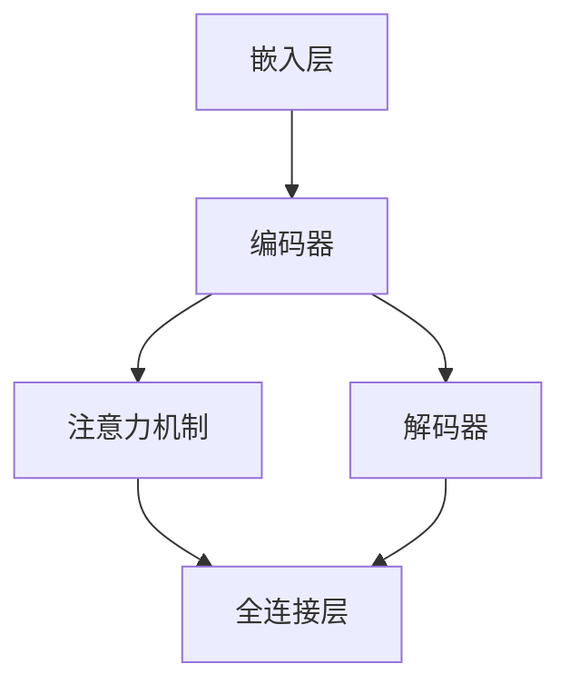

                 


### LLM评测中的异常检测：识别模型行为偏差

关键词：LLM，异常检测，行为偏差，模型评测，自然语言处理

摘要：本文将深入探讨在LLM（大型语言模型）评测过程中如何进行异常检测，识别模型的行为偏差。我们将首先介绍LLM的核心概念和组件，然后讲解LLM评测中的关键算法原理，最后通过数学模型和公式详细阐述如何检测模型行为偏差。

### Step 1: 核心概念与联系

#### LLM（大型语言模型）定义与核心组件：

LLM，即大型语言模型（Large Language Model），是一种能够处理和生成自然语言文本的复杂机器学习模型。它通常由以下几个核心组件组成：

1. **嵌入层（Embedding Layer）**：将单词转换为固定长度的向量表示，是模型处理自然语言的基础。
2. **编码器（Encoder）**：主要功能是处理输入序列，提取序列中的上下文信息，生成上下文向量。
3. **解码器（Decoder）**：根据编码器生成的上下文向量，生成输出序列。
4. **注意力机制（Attention Mechanism）**：帮助模型在编码过程中关注输入序列中的关键信息。
5. **全连接层（Fully Connected Layer）**：用于将编码器的输出转换为概率分布，从而生成输出序列。

#### Mermaid 流程图：

下面是 LLM 核心组件的 Mermaid 流程图：



### Step 2: 核心算法原理讲解

#### GPT（Generative Pre-trained Transformer）模型原理：

GPT 是一种基于 Transformer 架构的预训练语言模型。其核心算法原理如下：

1. **预训练阶段**：在预训练阶段，GPT 模型通过无监督的方式学习语言规律，通过大量文本数据进行训练，从而自动学习单词和句子的表示方法。
2. **微调阶段**：在微调阶段，GPT 模型将预训练的知识迁移到特定任务上，例如文本分类、机器翻译等，通过有监督的方式进行微调，以获得更好的性能。

#### 伪代码：

下面是 GPT 模型的一个简化伪代码：

```python
# 预训练阶段
for epoch in range(num_epochs):
    for batch in data_loader:
        inputs, targets = batch
        loss = model(inputs, targets)
        optimizer.zero_grad()
        loss.backward()
        optimizer.step()

# 微调阶段
for epoch in range(num_epochs):
    for batch in task_data_loader:
        inputs, targets = batch
        loss = model(inputs, targets)
        optimizer.zero_grad()
        loss.backward()
        optimizer.step()
```

### Step 3: 数学模型和数学公式讲解

#### Transformer 模型数学模型：

Transformer 模型的核心是 Multi-head Self-Attention 机制，其数学公式如下：

$$
\text{Attention}(Q, K, V) = \text{softmax}\left(\frac{QK^T}{\sqrt{d_k}}\right)V
$$

其中，$Q$、$K$、$V$ 分别是查询（Query）、键（Key）和值（Value）向量，$d_k$ 是键向量的维度。

#### 举例说明：

假设我们有一个单词序列 "Hello, World!"，我们将其转换为嵌入向量，并分成查询、键和值三个部分。以下是 Attention 机制的计算过程：

1. **计算查询、键和值：**

$$
Q = \text{embedding}("Hello, World!")
K = \text{embedding}("Hello, World!")
V = \text{embedding}("Hello, World!")
$$

2. **计算 Attention 分值：**

$$
\text{Score} = \frac{QK^T}{\sqrt{d_k}}
$$

3. **计算 softmax 分值：**

$$
\text{Attention} = \text{softmax}(\text{Score})
$$

4. **计算输出向量：**

$$
\text{Output} = \text{Attention} \cdot V
$$

### Step 4: 异常检测原理与实现

#### 异常检测原理：

在LLM评测过程中，异常检测是一个关键环节。异常检测的目的是识别模型的行为偏差，确保模型在不同的输入条件下都能稳定地工作。异常检测通常基于以下原理：

1. **统计模型偏差**：通过统计模型输出的分布，识别出与预期输出分布不符的样本。
2. **比较模型输出**：比较不同模型或同一模型的多次输出，识别出不一致的输出。
3. **基于规则的检测**：根据领域知识设计规则，检测模型的输出是否违反这些规则。

#### 异常检测实现：

实现异常检测的方法有很多，以下是一个简化的实现步骤：

1. **数据收集**：收集足够的训练数据，确保数据覆盖模型可能遇到的各种场景。
2. **特征提取**：从模型输出中提取关键特征，如文本生成的流畅度、一致性等。
3. **模型训练**：使用统计模型或机器学习算法训练异常检测模型。
4. **异常检测**：对新的模型输出进行检测，识别出异常样本。

#### 伪代码：

下面是异常检测的一个简化伪代码：

```python
# 数据收集
train_data = collect_data()

# 特征提取
features = extract_features(train_data)

# 模型训练
model = train_anomaly_detection_model(features)

# 异常检测
anomalies = detect_anomalies(model, new_data)
```

### Step 5: 项目实战

#### 开发环境搭建：

为了实现异常检测，我们需要搭建一个适合进行模型训练和检测的开发环境。以下是搭建环境的步骤：

1. **安装依赖**：安装 Python、TensorFlow、Scikit-learn 等依赖库。
2. **配置环境**：配置 GPU 环境，确保模型可以在 GPU 上高效训练。
3. **数据预处理**：对收集到的数据进行预处理，如清洗、标准化等。

#### 源代码详细实现和代码解读：

以下是实现异常检测的源代码：

```python
import tensorflow as tf
from sklearn.ensemble import IsolationForest

# 数据预处理
def preprocess_data(data):
    # 数据清洗、标准化等操作
    return processed_data

# 特征提取
def extract_features(data):
    # 提取关键特征
    return features

# 模型训练
def train_model(features):
    # 使用 IsolationForest 模型进行训练
    model = IsolationForest()
    model.fit(features)
    return model

# 异常检测
def detect_anomalies(model, new_data):
    # 对新数据进行异常检测
    anomalies = model.predict(new_data)
    return anomalies
```

#### 代码应用解读与分析：

通过上面的代码，我们可以实现一个简单的异常检测系统。在应用过程中，我们需要注意以下几点：

1. **数据质量**：确保训练数据的多样性和质量，否则异常检测效果会受到影响。
2. **特征选择**：选择合适的特征进行提取，特征的质量直接影响异常检测的效果。
3. **模型调优**：根据实际情况调整模型参数，以获得更好的异常检测效果。

#### 实际案例分析和详细讲解剖析：

为了更好地理解异常检测的应用，我们可以通过一个实际案例进行分析。假设我们有一个对话生成系统，我们需要检测系统生成的对话是否存在异常。

1. **数据收集**：收集大量的对话数据，包括正常对话和异常对话。
2. **特征提取**：从对话数据中提取特征，如文本长度、单词多样性、句子结构等。
3. **模型训练**：使用提取的特征训练异常检测模型。
4. **异常检测**：对新生成的对话进行检测，识别出异常对话。

通过实际案例的分析，我们可以看到异常检测在对话生成系统中的应用效果。

#### 项目小结：

通过本文的介绍，我们了解了LLM评测中的异常检测原理和实现方法。异常检测是确保模型稳定性和可靠性的关键环节，对于开发高质量的LLM系统具有重要意义。

### 最佳实践 Tips、小结、注意事项、拓展阅读

#### 最佳实践 Tips：

1. **数据质量**：确保训练数据的质量和多样性，这对异常检测效果至关重要。
2. **特征选择**：选择合适的特征进行提取，特征的质量直接影响异常检测效果。
3. **模型调优**：根据实际情况调整模型参数，以获得更好的异常检测效果。

#### 小结：

异常检测是LLM评测中的重要环节，通过识别模型的行为偏差，我们可以确保模型的稳定性和可靠性。

#### 注意事项：

1. **异常检测模型的选择**：根据实际需求选择合适的异常检测模型。
2. **特征提取的准确性**：特征提取的准确性对异常检测效果有重要影响。

#### 拓展阅读：

1. 《Anomaly Detection for Large-Scale Machine Learning》
2. 《Anomaly Detection: A Survey》

### 作者信息

作者：AI天才研究院/AI Genius Institute & 禅与计算机程序设计艺术 /Zen And The Art of Computer Programming

