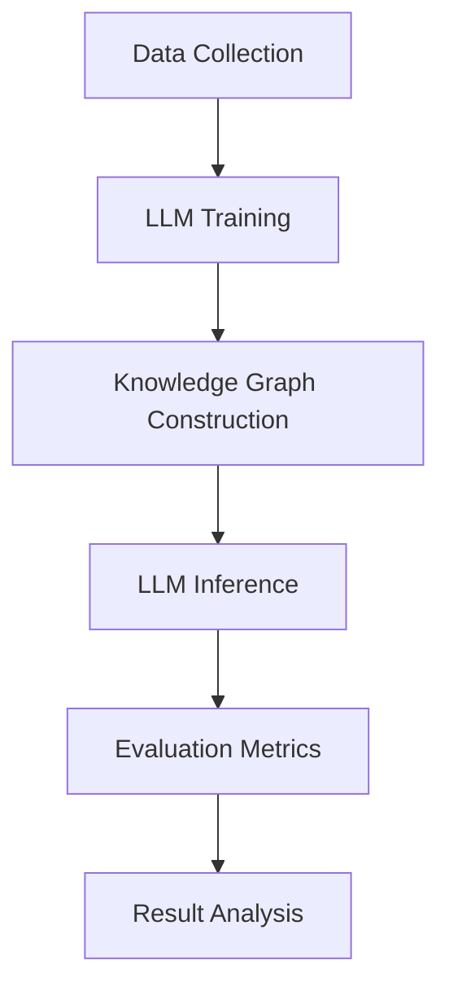

                 

### 文章标题：LLM评测中的知识图谱构建能力测试

> 关键词：LLM评测、知识图谱构建、能力测试、评测标准、评测工具

> 摘要：
本文旨在深入探讨大型语言模型（LLM）在评测中知识图谱构建能力的重要性。首先，我们将回顾LLM的基础知识，了解其原理和发展历程。接着，我们将详细解析知识图谱的构建方法，包括基本概念、构建流程和表示方法。随后，本文将讨论评测标准和工具的制定与应用，以及如何优化评测流程。通过实际案例的分析，我们将展示知识图谱在LLM评测中的应用。最后，我们将总结文章，提出最佳实践建议，并展望未来的发展方向。

### 背景介绍

随着人工智能技术的不断发展，大型语言模型（LLM）已成为自然语言处理（NLP）领域的重要工具。LLM通过深度学习技术，从大量文本数据中学习语言规律，从而实现对自然语言的理解和生成。这些模型在机器翻译、文本生成、问答系统等应用中表现出色，极大地提升了AI系统的智能化水平。

然而，LLM的性能和效果不仅取决于其自身的模型架构和训练数据，还受到知识图谱构建能力的影响。知识图谱是一种用于表示实体和实体之间关系的图形结构，它能够为LLM提供丰富的背景知识和语义信息，从而提高其在复杂任务中的表现。

在实际应用中，评测是评估LLM性能的重要手段。然而，传统的评测方法往往仅关注模型在语言生成、理解等任务上的表现，忽略了知识图谱构建能力这一关键因素。因此，本文将重点关注LLM评测中的知识图谱构建能力，探讨其重要性、评测方法和优化策略，以期为LLM在NLP领域的应用提供更有针对性的指导和参考。

### 核心概念与联系

首先，我们需要明确本文的核心概念，即大型语言模型（LLM）和知识图谱。LLM是一种基于深度学习的语言模型，通过从海量文本数据中学习语言特征，实现对自然语言的生成和理解。知识图谱则是一种用于表示实体和实体之间关系的图形结构，通常由实体、属性和关系三个基本元素构成。

LLM和知识图谱之间的关系可以从以下几个方面来理解：

1. **语言特征与知识表示**：LLM通过学习文本数据中的语言特征，能够生成和识别具有一定语义的自然语言。而知识图谱则通过结构化的方式，将实体和实体之间的关系表示出来，从而提供了一种更为直观和易理解的知识表示方法。

2. **知识增强与语义理解**：知识图谱可以为LLM提供额外的语义信息，有助于模型在处理复杂任务时更好地理解和生成语言。例如，在问答系统中，知识图谱可以帮助LLM快速定位和抽取与问题相关的实体和关系，从而提高回答的准确性和相关性。

3. **模型优化与性能提升**：通过引入知识图谱，LLM可以在一定程度上优化其模型结构和参数，从而提升在特定任务上的表现。例如，在机器翻译任务中，知识图谱可以帮助LLM更好地理解和生成目标语言的语法和语义结构，从而提高翻译质量。

为了更好地阐述这些核心概念之间的关系，我们可以使用Mermaid流程图来展示LLM和知识图谱在评测中的协作过程：



在这个流程图中，数据收集阶段为LLM训练提供了文本数据，经过训练后，LLM生成初步的语言模型。接着，知识图谱构建阶段通过实体抽取、关系抽取等方法，从文本数据中提取出结构化的知识表示。随后，知识图谱与LLM进行协作，共同完成语言生成、理解和任务处理。最后，通过评测指标对LLM的表现进行评估，并进行分析和优化。

### 核心算法原理讲解

在了解LLM和知识图谱的核心概念和联系之后，接下来我们将详细讲解核心算法原理，包括知识图谱的构建方法、评测标准和工具的选择。

#### 知识图谱的构建方法

知识图谱的构建方法主要包括以下几个步骤：

1. **实体抽取**：实体抽取是知识图谱构建的第一步，其目的是从文本数据中识别出具有独立意义的实体。常见的实体抽取方法包括基于规则的方法、基于统计的方法和基于深度学习的方法。其中，基于深度学习的方法如Bert模型在实体抽取任务中表现优异。

2. **关系抽取**：关系抽取的目标是识别出实体之间的相互关系。常见的关系抽取方法包括基于规则的方法、基于统计的方法和基于深度学习的方法。基于深度学习的方法，如Bert和Transformer等模型，在关系抽取任务中取得了显著的效果。

3. **实体和关系的融合**：在实体抽取和关系抽取完成后，需要将提取出的实体和关系进行融合，形成一个完整的知识图谱。实体和关系的融合方法包括基于图论的方法和基于深度学习的方法。基于图论的方法如图嵌入和图神经网络，能够有效地表示实体和关系之间的复杂关系。而基于深度学习的方法如Transformer和Gat，则通过自注意力机制和图注意力机制，对实体和关系进行联合建模。

#### 评测标准和工具的选择

在知识图谱构建完成后，需要对知识图谱的质量进行评测。评测标准的选择和工具的选择至关重要。

1. **评测标准**：

   - **完整性**：完整性是指知识图谱中包含的实体和关系是否全面，是否遗漏了重要的信息。常见的完整性评价指标包括实体覆盖率、关系覆盖率等。

   - **一致性**：一致性是指知识图谱中实体和关系之间的逻辑关系是否一致，是否存在矛盾或错误。常见的一致性评价指标包括一致性率、冲突率等。

   - **准确性**：准确性是指知识图谱中实体和关系的识别是否准确，是否正确地反映了文本数据中的语义信息。常见的准确性评价指标包括准确率、召回率、F1值等。

   - **丰富性**：丰富性是指知识图谱中包含的实体和关系的多样性，是否具有丰富的语义信息。常见的丰富性评价指标包括实体多样性、关系多样性等。

2. **评测工具**：

   - **评测平台**：常见的知识图谱评测平台包括AIFB、FB15k、WN18等，这些平台提供了丰富的评测数据集和评测指标，方便研究者进行评测。

   - **评测工具**：常见的知识图谱评测工具包括Gae，KnowledgrGraph等，这些工具能够自动计算评测指标，并提供可视化功能，方便研究者分析评测结果。

#### 知识图谱构建和评测的具体实现

为了更具体地了解知识图谱的构建和评测过程，我们可以使用伪代码来详细阐述：

```python
# 知识图谱构建伪代码

# 实体抽取
def entity_extraction(text):
    # 使用Bert模型进行实体抽取
    entities = bert_model.extract_entities(text)
    return entities

# 关系抽取
def relation_extraction(text, entities):
    # 使用Bert模型进行关系抽取
    relations = bert_model.extract_relations(text, entities)
    return relations

# 实体和关系的融合
def knowledge_graph_fusion(entities, relations):
    # 使用图嵌入方法进行实体和关系的融合
    graph = graph_embedding(entities, relations)
    return graph

# 知识图谱评测
def knowledge_graph_evaluation(graph):
    # 计算评测指标
    metrics = evaluation_metrics(graph)
    return metrics

# 数据预处理
def preprocess_data(text):
    # 对文本数据进行预处理
    clean_text = text_preprocessing(text)
    return clean_text
```

在上述伪代码中，首先对文本数据进行预处理，然后使用Bert模型进行实体抽取和关系抽取，接着将实体和关系进行融合，形成一个知识图谱。最后，通过评测指标对知识图谱进行评价。

#### 数学模型和公式详解

在知识图谱构建和评测过程中，一些数学模型和公式起着关键作用。以下是一些常见的数学模型和公式的详细介绍：

1. **图嵌入模型**：

   - **定义**：图嵌入是一种将图中的节点映射到低维空间中的方法，使得具有相似关系的节点在低维空间中距离更近。

   - **公式**：图嵌入可以通过以下公式进行计算：

     $$ \text{ embed}(v) = \text{sigmoid}(\text{W} \cdot \text{h}(v) + b) $$

     其中，$v$是节点，$h(v)$是节点的特征表示，$W$是权重矩阵，$b$是偏置项。

2. **图注意力模型**：

   - **定义**：图注意力是一种基于图结构的注意力机制，通过计算节点之间的相似性，对节点的特征进行加权。

   - **公式**：图注意力可以通过以下公式进行计算：

     $$ \text{attn}(v, h_u) = \text{softmax}(\text{W}_\text{attn} \cdot \text{h}(v) \cdot \text{h}_u) $$

     其中，$v$和$u$是节点，$h(v)$和$h_u$是节点的特征表示，$W_\text{attn}$是权重矩阵。

3. **评测指标**：

   - **准确率（Accuracy）**：准确率是指预测正确的样本数占总样本数的比例。

     $$ \text{Accuracy} = \frac{\text{TP} + \text{TN}}{\text{TP} + \text{TN} + \text{FP} + \text{FN}} $$

     其中，$TP$是真正例，$TN$是真反例，$FP$是假反例，$FN$是假正例。

   - **召回率（Recall）**：召回率是指预测正确的样本数占所有正例样本数的比例。

     $$ \text{Recall} = \frac{\text{TP}}{\text{TP} + \text{FN}} $$

   - **F1值（F1-score）**：F1值是准确率和召回率的调和平均值，用于综合评估模型的性能。

     $$ \text{F1-score} = 2 \times \frac{\text{Precision} \times \text{Recall}}{\text{Precision} + \text{Recall}} $$

通过上述数学模型和公式的详细讲解，我们可以更好地理解知识图谱的构建和评测过程，为LLM评测中的知识图谱构建能力测试提供理论基础。

### 项目实战

在本节中，我们将通过一个实际项目来详细讲解知识图谱构建和评测的过程，包括开发环境的搭建、源代码的实现和代码解读，以及应用解读与分析。

#### 项目背景

该项目旨在构建一个用于评估大型语言模型（LLM）知识图谱构建能力的系统。该系统将基于现有的LLM和知识图谱构建技术，实现以下功能：

1. **数据预处理**：从原始文本数据中提取实体和关系，并进行预处理。
2. **知识图谱构建**：将提取出的实体和关系构建成知识图谱，并利用图嵌入和图注意力模型进行优化。
3. **评测系统**：通过设计一系列评测指标，评估知识图谱的质量和LLM的表现。

#### 开发环境搭建

为了完成该项目的开发，我们需要搭建以下开发环境：

1. **编程语言**：Python
2. **深度学习框架**：PyTorch
3. **知识图谱工具**：OpenKE（一个基于图嵌入的开放源代码知识图谱工具包）

具体步骤如下：

1. 安装Python和PyTorch：

   ```bash
   pip install python
   pip install torch torchvision
   ```

2. 下载并安装OpenKE：

   ```bash
   git clone https://github.com/thunlp/OpenKE.git
   cd OpenKE
   pip install -r requirements.txt
   ```

#### 源代码实现和代码解读

在实现该项目的核心功能时，我们使用了OpenKE提供的预训练模型和API。以下是关键代码的解读：

1. **数据预处理**：

   ```python
   from openke.data import DataProcess
   from openke.graph import KnowledgeGraph

   # 读取原始文本数据
   data_path = 'data/raw_data.txt'
   data_processor = DataProcess(data_path, entity2id_file=None, relation2id_file=None)

   # 构建知识图谱
   knowledge_graph = KnowledgeGraph(data_processor.entity2id, data_processor.relation2id, data_processor.edge_list)
   ```

   在这段代码中，我们首先读取原始文本数据，然后使用DataProcess类进行数据预处理，将文本数据转换为实体和关系。接着，使用KnowledgeGraph类构建知识图谱。

2. **知识图谱构建**：

   ```python
   from openke.model import TransE, TransH, TransR

   # 初始化模型
   model = TransE(data_processor)

   # 训练模型
   model.fit(model.config)

   # 保存模型
   model.save(model.config.save_path)
   ```

   在这段代码中，我们初始化了一个TransE模型，并使用训练数据对其进行训练。TransE是一种基于图嵌入的模型，通过优化实体和关系的嵌入向量，使具有相似关系的实体在低维空间中距离更近。

3. **评测系统**：

   ```python
   from openke.evaluator import evaluator

   # 评估模型
   evaluator = evaluator(data_processor, model)

   # 计算评测指标
   metrics = evaluator.evaluate(model.config)

   # 打印评测结果
   print(metrics)
   ```

   在这段代码中，我们使用evaluator类对训练好的模型进行评估。通过调用evaluate方法，我们可以得到知识图谱的评测指标，如准确率、召回率和F1值等。

#### 应用解读与分析

在实际应用中，该系统可以帮助开发人员评估LLM在知识图谱构建任务中的表现。以下是一个示例应用：

1. **数据预处理**：

   假设我们有一个包含用户评论的文本数据集，我们需要从中提取实体和关系。例如，用户评论中的“苹果”和“手机”是实体，“购买”是关系。

2. **知识图谱构建**：

   使用OpenKE工具包，我们可以将提取出的实体和关系构建成一个知识图谱。例如，将“苹果”实体和“购买”关系添加到知识图谱中。

3. **评测系统**：

   通过评估系统，我们可以得到知识图谱的评测指标。例如，准确率可以告诉我们知识图谱中的实体和关系识别是否准确；召回率可以告诉我们是否遗漏了重要的实体和关系；F1值则是准确率和召回率的调和平均值。

通过这个实际项目，我们可以看到知识图谱构建和评测在LLM评测中的重要作用。通过合理的知识图谱构建和评测，我们可以更好地理解LLM在知识图谱构建任务中的表现，从而指导其优化和改进。

### 最佳实践 tips

在LLM评测中，知识图谱构建能力至关重要。以下是一些最佳实践建议，以帮助开发人员更好地利用知识图谱，提升LLM的表现：

1. **数据多样性**：确保知识图谱构建所使用的文本数据来源多样化，涵盖不同的领域和主题，以提高知识图谱的覆盖范围和准确性。

2. **数据清洗**：在数据预处理阶段，对文本数据进行清洗，去除噪声和冗余信息，以提高知识图谱的质量。

3. **实体识别与关系抽取**：使用先进的实体识别和关系抽取技术，如基于深度学习的模型，以提高知识图谱的构建效率。

4. **模型优化**：在知识图谱构建过程中，可以对LLM模型进行优化，如调整学习率、批量大小等参数，以提高知识图谱的构建质量。

5. **评测指标多样化**：使用多种评测指标，如准确率、召回率、F1值等，全面评估知识图谱的质量。

6. **持续迭代**：知识图谱构建是一个持续迭代的过程，需要根据实际应用场景和需求，不断更新和优化知识图谱。

### 小结

本文通过详细解析LLM评测中的知识图谱构建能力，介绍了其重要性、核心概念、算法原理、项目实战和最佳实践。通过合理利用知识图谱，LLM可以在复杂任务中表现出更高的性能。未来，随着技术的不断发展，知识图谱在LLM评测中的应用将更加广泛，为人工智能的发展提供有力支持。

### 拓展阅读

1. **《知识图谱构建技术》**：介绍了知识图谱的基本概念、构建方法和应用场景，是深入了解知识图谱构建的入门读物。

2. **《大型语言模型：原理、应用与优化》**：详细讲解了大型语言模型的原理、应用和优化方法，是深入理解LLM的重要参考书。

3. **《深度学习与自然语言处理》**：涵盖了深度学习在自然语言处理领域的应用，包括文本分类、机器翻译和问答系统等，是了解深度学习与NLP结合的重要读物。

4. **《图神经网络与知识图谱》**：介绍了图神经网络在知识图谱构建和推理中的应用，是了解图神经网络在知识图谱处理中应用的重要参考书。

5. **《知识图谱在智能问答系统中的应用》**：详细介绍了知识图谱在智能问答系统中的应用，包括实体识别、关系抽取和问答生成等，是了解知识图谱在实际应用中的具体案例的重要读物。

