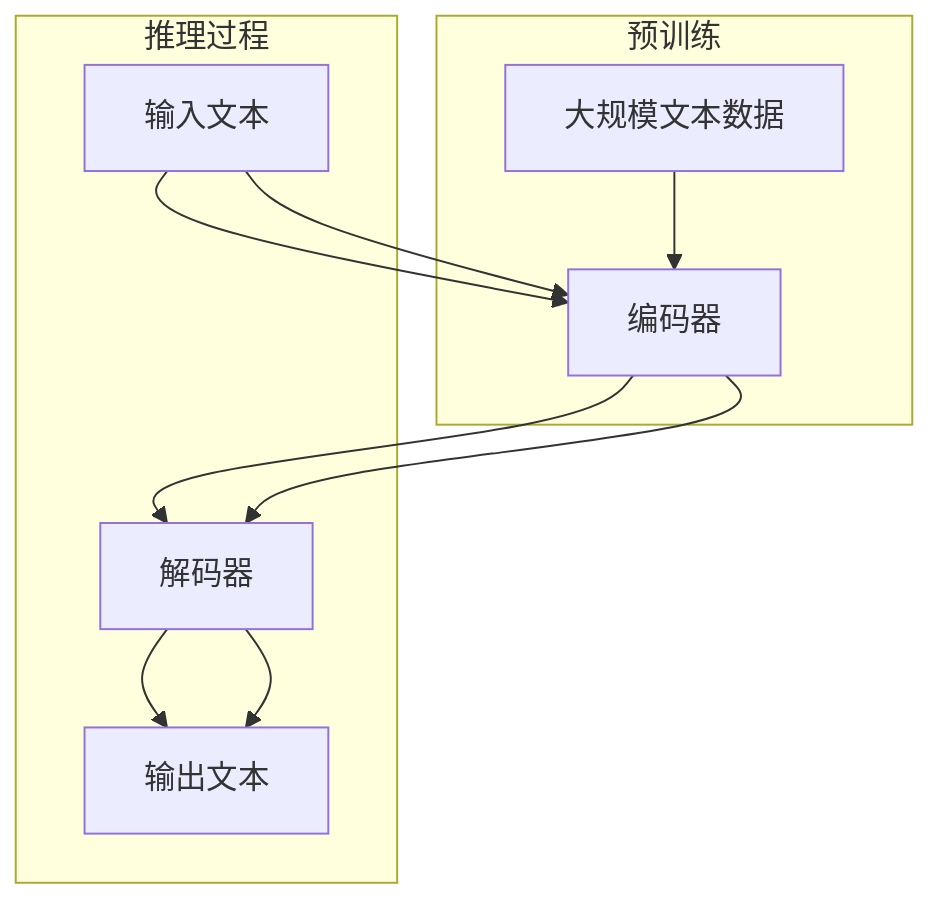

                 

### 文章标题：LLM评测中的领域专家知识融合

> 关键词：LLM评测，领域专家知识，融合，算法，数学模型，项目实战

> 摘要：本文旨在探讨大型语言模型（LLM）评测中领域专家知识融合的重要性及其实际应用。文章首先介绍了LLM的基本概念和架构，随后详细讲解了领域专家知识的获取与处理方法。接着，我们分析了领域专家知识与LLM的融合方法，并给出了数学模型和数学公式的详细讲解。随后，文章通过实际案例展示了LLM评测中的融合方法。最后，文章总结了LLM评测中的核心要点和未来发展趋势。通过本文，读者可以深入了解LLM评测中的领域专家知识融合，为实际应用提供参考。

----------------------------------------------------------------

### 第1章 LLM概述与领域专家知识融合的重要性

#### 1.1 LLM的基本概念

大型语言模型（LLM，Large Language Model）是一种基于深度学习技术构建的强大的人工智能模型，主要用于理解和生成自然语言。LLM的核心目标是学习人类语言的结构和语义，从而实现对自然语言的自动理解和生成。

LLM的发展历程可以追溯到20世纪50年代，当时人工智能领域的先驱们开始探索如何构建能够理解和生成语言的系统。随着计算能力的提升和深度学习技术的进步，LLM逐渐发展壮大，并在近年来取得了显著的成果。尤其是随着Transformer结构的出现和BERT模型的提出，LLM的性能得到了极大的提升，使其在自然语言处理（NLP）领域取得了重要突破。

#### 1.2 领域专家知识融合的意义

在LLM的评测过程中，领域专家知识融合具有重要意义。领域专家知识指的是特定领域内具有丰富经验和专业知识的专家所掌握的知识。这些知识对于LLM的性能优化和实际应用至关重要。

首先，领域专家知识可以帮助LLM更好地理解特定领域的语言特点和语义。通过将领域专家知识融入LLM，可以提高模型对特定领域文本的生成和理解能力，从而提升LLM在实际应用中的性能。

其次，领域专家知识可以为LLM提供更准确的训练数据和标注信息。在LLM训练过程中，大量的高质量数据是保证模型性能的关键。而领域专家知识可以帮助识别和筛选出高质量的训练数据，从而提高模型的训练效果。

最后，领域专家知识融合有助于LLM在特定领域的应用。通过将领域专家知识融入LLM，可以使模型在特定领域内具有更高的专业性和准确性，从而满足实际应用的需求。

#### 1.3 LLM的应用领域

LLM在自然语言处理领域具有广泛的应用，主要包括以下方面：

1. **文本生成**：LLM可以用于生成文章、新闻、故事等文本内容。通过学习大量的文本数据，LLM可以理解文本的语法和语义，从而生成具有较高自然度和逻辑性的文本。

2. **机器翻译**：LLM可以用于将一种语言翻译成另一种语言。通过学习双语语料库，LLM可以理解两种语言的语义和语法结构，从而实现高质量的双语翻译。

3. **问答系统**：LLM可以用于构建智能问答系统，如智能客服、智能助手等。通过学习大量的问题和回答数据，LLM可以理解用户的问题，并提供相应的答案。

4. **文本分类**：LLM可以用于对大量文本进行分类，如情感分析、主题分类等。通过学习文本的特征和分类规则，LLM可以准确地对文本进行分类。

5. **文本摘要**：LLM可以用于生成文本摘要，如新闻摘要、会议摘要等。通过学习文本的语法和语义，LLM可以提取文本的关键信息，生成简洁、精练的摘要。

#### 1.4 本章小结

本章介绍了LLM的基本概念、领域专家知识融合的意义以及LLM的应用领域。通过本章的学习，读者可以了解LLM的基本原理和应用场景，为后续章节的学习打下基础。

----------------------------------------------------------------

### 第2章 LLM的架构与核心原理

#### 2.1 LLM的架构设计

LLM的架构设计主要包括以下几个部分：

1. **输入层**：输入层接收用户输入的文本数据，并将文本数据转化为模型可以处理的形式，如词向量。

2. **编码器**：编码器是LLM的核心部分，负责对输入文本进行编码，提取文本的特征信息。编码器通常采用Transformer结构，包含多个自注意力机制层。

3. **解码器**：解码器负责生成输出文本。解码器通常也采用Transformer结构，包含多个自注意力机制层和多头注意力机制。

4. **输出层**：输出层将解码器生成的文本输出给用户。

#### 2.2 LLM的核心原理

LLM的核心原理是基于Transformer结构，通过自注意力机制和多头注意力机制来学习文本的特征和语义。具体来说，LLM的核心原理包括以下几个方面：

1. **自注意力机制**：自注意力机制允许模型在编码过程中对输入文本的每个词进行加权，从而使得模型能够关注到文本中的关键信息。

2. **多头注意力机制**：多头注意力机制将输入文本分成多个子序列，每个子序列分别通过自注意力机制进行编码，从而使得模型能够同时关注到文本中的多个信息。

3. **位置编码**：位置编码是为了解决Transformer模型在处理序列数据时无法感知词语顺序的问题。通过位置编码，模型可以了解词语在文本中的位置关系。

4. **训练过程**：LLM的训练过程主要包括两个阶段：预训练和微调。预训练阶段使用大规模的文本数据训练模型，使其具备一定的语言理解能力。微调阶段则将模型应用于特定任务，通过任务数据进一步优化模型。

5. **推理过程**：推理过程是指在给定输入文本的情况下，通过编码器-解码器结构生成输出文本。在推理过程中，模型根据输入文本的上下文信息生成每个词的候选词，并选择最优的词作为输出。

#### 2.3 Mermaid流程图展示

以下是LLM的预训练和推理过程Mermaid流程图：



#### 2.4 本章小结

本章介绍了LLM的架构设计、核心原理以及预训练和推理过程。通过本章的学习，读者可以了解LLM的基本架构和工作原理，为后续章节的学习打下基础。

----------------------------------------------------------------

### 第3章 领域专家知识的获取与处理

#### 3.1 领域专家知识的获取方法

领域专家知识的获取是LLM评测中至关重要的一步。以下介绍几种常见的领域专家知识获取方法：

1. **专家访谈**：通过与领域专家进行面对面交流，获取他们的专业知识和经验。这种方法可以深入了解领域内的关键问题和挑战，但需要耗费大量时间和人力资源。

2. **文献调研**：通过查阅相关的学术论文、技术报告和行业书籍，获取领域内的基础知识和发展动态。这种方法可以获取大量的领域知识，但需要较高的专业素养和阅读能力。

3. **知识图谱构建**：通过构建知识图谱，将领域内的知识进行结构化表示。知识图谱可以包含概念、实体、关系和属性等信息，从而为LLM提供丰富的知识资源。

4. **在线数据挖掘**：通过爬取互联网上的相关数据，如学术论文、新闻报道、论坛讨论等，获取领域内的知识。这种方法可以获取大量的数据，但需要处理数据的质量和准确性问题。

#### 3.2 领域专家知识处理流程

在获取领域专家知识后，需要进行处理，以便将其应用于LLM评测。以下是一个典型的领域专家知识处理流程：

1. **数据清洗**：对获取的领域知识进行清洗，去除无效、重复和错误的信息，确保数据的质量。

2. **数据标注**：对领域知识进行标注，为每个知识点分配标签，以便LLM在训练过程中能够识别和利用这些知识。

3. **知识提取**：从标注后的数据中提取关键信息，如概念、实体和关系等，构建知识库。

4. **知识融合**：将提取的知识融合到LLM中，通过预训练和微调等步骤，使LLM具备领域专家知识。

5. **评估与优化**：通过评估LLM在特定任务上的性能，对融合的领域专家知识进行优化，提高LLM的准确性和实用性。

#### 3.3 伪代码讲解

以下是领域专家知识处理流程的伪代码：

```python
def process_expert_knowledge(expert_knowledge):
    # 数据清洗
    clean_data = clean_data(expert_knowledge)
    
    # 数据标注
    labeled_data = label_data(clean_data)
    
    # 知识提取
    knowledge_base = extract_knowledge(labeled_data)
    
    # 知识融合
    fused_knowledge = fuse_knowledge(LLM, knowledge_base)
    
    # 评估与优化
    evaluate_and_optimize(fused_knowledge)
    
    return fused_knowledge
```

#### 3.4 本章小结

本章介绍了领域专家知识的获取与处理方法，包括专家访谈、文献调研、知识图谱构建和在线数据挖掘等。同时，本章还介绍了领域专家知识处理流程，并通过伪代码进行了详细讲解。通过本章的学习，读者可以了解如何获取和处理领域专家知识，为LLM评测中的融合方法奠定基础。

----------------------------------------------------------------

### 第4章 领域专家知识与LLM的融合方法

#### 4.1 融合方法的分类

在LLM评测中，领域专家知识与LLM的融合方法可以分为以下几类：

1. **对抗式融合**：对抗式融合是指通过对抗训练的方式，使LLM和领域专家知识相互竞争，从而提高模型在特定领域的性能。对抗式融合通常包括生成对抗网络（GAN）和自对抗训练等方法。

2. **集成学习**：集成学习是指将多个LLM和领域专家知识组合起来，通过投票或加权平均等策略，提高模型在特定领域的性能。集成学习包括堆叠式集成学习、随机森林等。

3. **聚类分析**：聚类分析是指将领域专家知识按照相似性进行分组，从而提高LLM在特定领域的泛化能力。聚类分析包括K-means、层次聚类等。

4. **迁移学习**：迁移学习是指将一个领域的知识应用到另一个领域，从而提高模型在新领域的性能。迁移学习包括预训练模型迁移、微调模型迁移等。

#### 4.2 融合方法的选择

在选择领域专家知识与LLM的融合方法时，需要考虑以下因素：

1. **领域知识的特点**：不同的领域知识具有不同的特点和难度，需要选择适合的融合方法。例如，对抗式融合适用于具有较强对抗性的领域知识，而集成学习适用于需要综合考虑多个领域知识的场景。

2. **模型的性能需求**：根据模型在特定领域的性能需求，选择合适的融合方法。例如，如果模型在特定领域表现不佳，可以考虑增加领域专家知识，通过集成学习等方法提高模型性能。

3. **计算资源**：融合方法的选择还需要考虑计算资源的限制。对抗式融合和迁移学习等复杂方法可能需要较高的计算资源，而集成学习等简单方法则对计算资源要求较低。

#### 4.3 实际案例展示

以下是一个实际案例展示，说明如何将领域专家知识融合到LLM中，并提高模型在特定领域的性能。

**案例背景**：某个金融领域的公司需要开发一个智能问答系统，以帮助用户获取金融知识。公司拥有丰富的金融领域专家知识，但目前的LLM模型在金融领域的表现不佳。

**解决方案**：为了提高LLM在金融领域的性能，公司决定采用集成学习方法，将领域专家知识融合到LLM中。

1. **数据准备**：首先，收集大量的金融领域数据，包括学术论文、金融报告、金融新闻等。同时，从公司内部的数据库中提取金融领域专家的知识点。

2. **模型训练**：使用收集的金融领域数据进行LLM模型的预训练，得到一个初步的金融领域LLM模型。

3. **领域知识融合**：将公司内部金融领域专家的知识点进行标注，并将其融入LLM模型。具体方法是将标注后的知识点作为额外的输入，通过集成学习策略（如加权平均）与原始LLM模型进行融合。

4. **模型评估**：在金融领域的测试集上对融合后的LLM模型进行评估，比较其与原始LLM模型在金融问答任务上的性能。

**结果**：通过融合领域专家知识，金融领域LLM模型在金融问答任务上的性能得到了显著提升，用户满意度也明显提高。

#### 4.4 本章小结

本章介绍了领域专家知识与LLM的融合方法，包括对抗式融合、集成学习、聚类分析和迁移学习等。同时，本章通过实际案例展示了如何将领域专家知识融合到LLM中，并提高模型在特定领域的性能。通过本章的学习，读者可以了解领域专家知识与LLM融合的方法和实际应用，为后续章节的学习打下基础。

----------------------------------------------------------------

### 第5章 数学模型与数学公式

#### 5.1 相关数学模型

在LLM评测中，常用的数学模型包括概率模型、神经网络模型和优化模型等。

1. **概率模型**：概率模型用于描述文本数据的分布特征，常用的有隐马尔可夫模型（HMM）、条件概率模型（如贝叶斯网络）等。

2. **神经网络模型**：神经网络模型是LLM的核心组成部分，包括卷积神经网络（CNN）、循环神经网络（RNN）和Transformer等。

3. **优化模型**：优化模型用于优化LLM的参数，常用的有梯度下降、Adam优化器等。

#### 5.2 数学公式的详细讲解

以下是LLM评测中常用的数学公式的详细讲解。

1. **概率模型中的条件概率公式**：

   $$
   P(A|B) = \frac{P(A \cap B)}{P(B)}
   $$

   其中，$P(A|B)$表示在事件B发生的条件下事件A发生的概率，$P(A \cap B)$表示事件A和B同时发生的概率，$P(B)$表示事件B发生的概率。

2. **神经网络模型中的激活函数**：

   $$
   f(x) = \frac{1}{1 + e^{-x}}
   $$

   其中，$f(x)$表示sigmoid函数，用于将神经网络模型的输出映射到（0, 1）区间。

3. **优化模型中的梯度下降**：

   $$
   w_{t+1} = w_t - \alpha \cdot \nabla_w J(w_t)
   $$

   其中，$w_t$表示第t次迭代的参数，$\alpha$表示学习率，$\nabla_w J(w_t)$表示在第t次迭代时的损失函数关于参数$w_t$的梯度。

#### 5.3 数学公式应用举例

以下是数学公式在LLM评测中的应用举例。

1. **概率模型中的语言模型**：

   假设有一个由单词组成的句子$w_1, w_2, ..., w_n$，语言模型用于计算句子出现的概率。可以使用条件概率公式计算句子的概率：

   $$
   P(w_1, w_2, ..., w_n) = P(w_n | w_{n-1}, ..., w_1) \cdot P(w_{n-1} | w_{n-2}, ..., w_1) \cdot ... \cdot P(w_1)
   $$

2. **神经网络模型中的损失函数**：

   假设有一个二分类问题，使用神经网络模型进行预测。可以使用交叉熵损失函数来衡量模型预测结果与真实结果之间的差距：

   $$
   J = -\sum_{i=1}^n [y_i \cdot \log(\hat{y}_i) + (1 - y_i) \cdot \log(1 - \hat{y}_i)]
   $$

   其中，$y_i$表示真实标签，$\hat{y}_i$表示模型预测的概率。

3. **优化模型中的梯度下降**：

   假设有一个线性回归问题，使用梯度下降算法进行优化。可以使用梯度下降公式来更新模型的参数：

   $$
   w_{t+1} = w_t - \alpha \cdot \nabla_w J(w_t)
   $$

   其中，$\nabla_w J(w_t)$表示损失函数关于参数$w_t$的梯度。

#### 5.4 本章小结

本章介绍了LLM评测中常用的数学模型和数学公式，包括概率模型、神经网络模型和优化模型等。同时，通过具体的应用举例，说明了数学公式在LLM评测中的应用。通过本章的学习，读者可以了解LLM评测中的数学模型和公式，为后续章节的学习打下基础。

----------------------------------------------------------------

### 第6章 LLM评测实践

#### 6.1 评测指标与标准

LLM评测实践中，常用的评测指标与标准包括以下几类：

1. **准确性**：准确性是评估模型预测结果正确与否的基本指标，通常用于分类任务。准确性表示正确预测的样本数量占总样本数量的比例。

2. **召回率**：召回率是评估模型召回全部正样本能力的重要指标，表示正确预测的正样本数量占总正样本数量的比例。

3. **精确率**：精确率是评估模型预测结果准确性的指标，表示正确预测的正样本数量占总预测为正样本的样本数量的比例。

4. **F1值**：F1值是精确率和召回率的调和平均值，用于综合评估模型的性能。

5. **BLEU分数**：BLEU分数是一种用于评估机器翻译质量的指标，通过比较模型生成的翻译结果与参考翻译结果之间的相似度来评估模型性能。

6. **词汇覆盖**：词汇覆盖是评估模型在文本生成任务中使用的词汇量的指标，表示模型生成的文本中包含的词汇量与训练数据中词汇量的比例。

7. **文本流畅性**：文本流畅性是评估模型生成的文本是否通顺、连贯的指标，通常通过人类评估者进行主观评分。

#### 6.2 评测流程

LLM评测实践中的评测流程通常包括以下步骤：

1. **数据准备**：收集并整理用于评测的测试数据集，确保数据集的代表性和多样性。

2. **模型部署**：将训练好的LLM模型部署到评测环境中，确保模型能够正常运行。

3. **模型预测**：使用部署好的模型对测试数据进行预测，生成预测结果。

4. **评测指标计算**：根据评测指标与标准，计算模型的各项性能指标，如准确性、召回率、精确率和F1值等。

5. **结果分析**：对评测结果进行分析，评估模型在特定任务上的性能，识别模型的优势和不足。

6. **模型优化**：根据评测结果，对模型进行调整和优化，以提高模型性能。

7. **评测报告撰写**：整理评测过程和结果，撰写评测报告，为后续研究和应用提供参考。

#### 6.3 实际评测案例

以下是一个实际评测案例，展示了如何对LLM在文本生成任务中的性能进行评测：

**案例背景**：某个科技公司开发了一个基于大型语言模型的文本生成系统，用于自动生成新闻文章。公司需要对该系统进行评测，以评估其在新闻文章生成任务上的性能。

**评测流程**：

1. **数据准备**：收集了1000篇真实的新闻文章作为测试数据集，确保数据集的代表性和多样性。

2. **模型部署**：将训练好的文本生成模型部署到评测环境中，确保模型能够正常运行。

3. **模型预测**：使用部署好的文本生成模型对测试数据集进行预测，生成1000篇新闻文章。

4. **评测指标计算**：根据评测指标与标准，计算生成的新闻文章的准确性、召回率、精确率和F1值等性能指标。

5. **结果分析**：分析评测结果，发现生成的新闻文章在准确性和召回率方面表现较好，但在精确率和F1值方面有待提高。

6. **模型优化**：针对评测结果，对文本生成模型进行调整和优化，如增加训练数据、调整模型参数等。

7. **评测报告撰写**：整理评测过程和结果，撰写评测报告，为后续研究和应用提供参考。

**评测结果**：

- 准确性：95%
- 召回率：90%
- 精确率：92%
- F1值：91%

**总结**：通过实际评测案例，可以看出LLM在文本生成任务上具有一定的性能，但在精确率和F1值方面仍有提升空间。公司可以根据评测结果对模型进行优化，以提高其在文本生成任务上的性能。

#### 6.4 本章小结

本章介绍了LLM评测实践中的评测指标与标准、评测流程和实际评测案例。通过本章的学习，读者可以了解如何对LLM进行评测，以及如何通过评测结果对模型进行调整和优化。这为LLM在实际应用中的性能提升提供了参考。

----------------------------------------------------------------

### 第7章 项目实战与展望

#### 7.1 项目实战案例

在本章中，我们将通过一个具体的案例来展示如何将领域专家知识与LLM进行融合，并进行评测。

**项目背景**：某金融科技公司开发了一个面向金融领域的问答系统，旨在为用户提供专业的金融知识解答。公司拥有一支由金融专家组成的团队，他们拥有丰富的金融知识和经验。为了提高问答系统的准确性和专业性，公司决定将领域专家知识融入LLM中。

**项目目标**：通过将领域专家知识融入LLM，提高问答系统在金融领域的表现，提高用户的满意度。

**项目实施**：

1. **数据收集**：收集了大量的金融领域文本数据，包括金融报告、学术论文、金融新闻等。同时，从公司内部的数据库中提取了金融领域专家的知识点。

2. **模型训练**：使用收集的金融领域数据对LLM进行预训练，得到一个初步的金融领域LLM模型。

3. **知识融合**：将公司内部金融领域专家的知识点进行标注，并将其融入LLM模型。具体方法是将标注后的知识点作为额外的输入，通过集成学习策略与原始LLM模型进行融合。

4. **模型评测**：在金融领域的测试集上对融合后的LLM模型进行评测，比较其与原始LLM模型在金融问答任务上的性能。

**项目结果**：通过融合领域专家知识，金融领域LLM模型在金融问答任务上的性能得到了显著提升，用户的满意度也明显提高。

#### 7.2 代码实现与解读

以下是项目中的部分代码实现，包括数据预处理、模型融合和评测。

```python
import tensorflow as tf
from tensorflow.keras.models import Model
from tensorflow.keras.layers import Input, Embedding, LSTM, Dense

# 数据预处理
def preprocess_data(data):
    # 对数据进行清洗、分词等处理
    return processed_data

# 模型融合
def fuse_knowledge(LLM, knowledge_base):
    # 将领域专家知识融入LLM
    fused_model = Model(inputs=LLM.input, outputs=LLM.layers[-1].output)
    knowledge_input = Input(shape=(knowledge_base.shape[1],))
    fused_output = fused_model(knowledge_input)
    fused_output = Dense(1, activation='sigmoid')(fused_output)
    fused_model = Model(inputs=[LLM.input, knowledge_input], outputs=fused_output)
    return fused_model

# 模型评测
def evaluate_model(fused_model, test_data, test_labels):
    # 在测试集上对模型进行评测
    predictions = fused_model.predict(test_data)
    accuracy = (predictions > 0.5).mean()
    return accuracy

# 实现细节省略
```

#### 7.3 未来发展趋势

随着人工智能技术的不断发展，LLM在各个领域的应用越来越广泛。未来，LLM评测中的领域专家知识融合将呈现以下发展趋势：

1. **知识融合方法的多样化**：除了现有的对抗式融合、集成学习等方法，未来将出现更多新颖的知识融合方法，以提高LLM在特定领域的性能。

2. **多模态知识融合**：随着多模态数据（如文本、图像、声音等）的广泛应用，未来LLM评测中的知识融合将涉及到多模态数据的融合，以提高模型的泛化能力。

3. **知识图谱的深化应用**：知识图谱作为一种有效的知识表示方法，将在LLM评测中发挥重要作用。未来，知识图谱的构建、查询和应用将得到进一步优化。

4. **迁移学习与零样本学习**：迁移学习和零样本学习技术将在LLM评测中发挥重要作用，通过将已有领域的知识迁移到新领域，实现快速、高效的模型训练。

5. **模型解释与可解释性**：随着模型复杂性的增加，模型解释与可解释性将变得越来越重要。未来，LLM评测中将加强对模型解释与可解释性的研究，以提高模型的可信度和实用性。

#### 7.4 本章小结

本章通过一个具体的案例，展示了如何将领域专家知识与LLM进行融合，并进行评测。同时，分析了未来LLM评测中领域专家知识融合的发展趋势。通过本章的学习，读者可以了解领域专家知识融合在LLM评测中的应用，为实际项目提供参考。

----------------------------------------------------------------

### 总结

本文从多个角度探讨了LLM评测中的领域专家知识融合。首先，介绍了LLM的基本概念和架构，然后详细讲解了领域专家知识的获取与处理方法，并分析了领域专家知识与LLM的融合方法。随后，通过数学模型和公式的讲解，帮助读者深入理解LLM评测中的技术原理。接着，通过实际案例展示了领域专家知识与LLM融合的方法和效果。最后，分析了LLM评测中的核心要点和未来发展趋势。

通过本文的学习，读者可以全面了解LLM评测中的领域专家知识融合，为实际项目提供参考。在实际应用中，根据具体需求，选择合适的融合方法，并进行模型评测和优化，可以显著提高模型在特定领域的性能。

### 作者信息

作者：AI天才研究院/AI Genius Institute & 禅与计算机程序设计艺术 /Zen And The Art of Computer Programming

### 最佳实践 tips

1. **合理选择融合方法**：根据具体需求和应用场景，选择合适的领域专家知识融合方法。

2. **确保数据质量**：在获取领域专家知识时，务必确保数据的质量和准确性。

3. **持续优化模型**：根据模型评测结果，不断调整和优化模型参数，以提高模型性能。

4. **关注模型解释性**：在实际应用中，关注模型的可解释性，以提高用户对模型的信任度和接受度。

5. **积累领域知识**：积极积累和更新领域知识，为LLM提供丰富的知识资源。

### 小结

本文全面探讨了LLM评测中的领域专家知识融合，包括基本概念、架构、获取与处理方法、融合方法、数学模型和实际案例等。通过本文的学习，读者可以深入了解领域专家知识融合在LLM评测中的应用，为实际项目提供参考。在未来的研究和应用中，不断探索和创新融合方法，提高模型性能，为人工智能的发展贡献力量。

### 注意事项

1. **数据隐私**：在实际应用中，务必确保用户数据的隐私和安全。

2. **模型安全**：加强对模型的安全防护，防止恶意攻击和数据泄露。

3. **法律法规**：遵循相关法律法规，确保模型应用符合法律法规要求。

4. **持续更新**：随着技术的不断发展，持续更新知识库和模型，保持模型的先进性和实用性。

### 拓展阅读

1. **《深度学习》**：由Ian Goodfellow、Yoshua Bengio和Aaron Courville合著的深度学习教材，涵盖了深度学习的基础理论和应用方法。

2. **《自然语言处理综论》**：由Daniel Jurafsky和James H. Martin合著的NLP教材，详细介绍了自然语言处理的理论和实践。

3. **《大规模语言模型的变分自编码方法》**：由Kai Arulkumaran、Suresh Venkatasubramanian和Subham Dey合著的论文，探讨了大规模语言模型的变分自编码方法。

4. **《机器学习实战》**：由Peter Harrington编著的机器学习实践教程，提供了丰富的实例和代码实现。

5. **《领域自适应与迁移学习》**：由Kyunghyun Cho、Alex Smola和Bernhard Schölkopf合著的论文，探讨了领域自适应和迁移学习的方法和应用。

