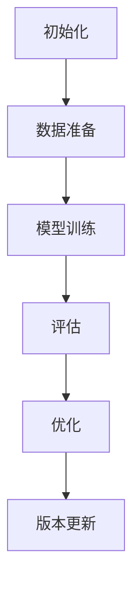

                 

### 1.1 LLMM版本控制的重要性

在人工智能领域，特别是语言模型（LLM）的开发和应用中，版本控制是一项至关重要的活动。版本控制不仅帮助研究人员和开发者追踪模型的演进历程，还能确保在模型改进和迭代过程中不丢失任何关键信息。LLM版本控制的重要性主要体现在以下几个方面：

首先，随着神经网络模型变得越来越复杂，模型的大小和计算量也在迅速增长。版本控制允许开发者对模型的不同版本进行区分和管理，从而在模型更新和优化过程中避免出现混乱。通过有效的版本控制，开发者可以轻松回溯到任何一个特定版本，以便在出现问题时进行调试和修复。

其次，版本控制有助于科研文献的可追溯性。在学术论文或报告撰写过程中，详细记录模型版本和参数设置对于复现研究结果至关重要。良好的版本控制机制能够确保这些信息的完整性和准确性，从而提高研究结果的可靠性。

再者，版本控制还有助于团队协作。在多人的开发环境中，版本控制系统能够协调不同开发者的工作，避免代码或模型的冲突，确保整个项目的稳定和高效运行。

最后，随着人工智能技术的商业化应用，版本控制对于模型的安全性和合规性也具有重要意义。在模型部署过程中，需要确保模型的版本一致性和安全性，防止未授权的修改和泄露。

总的来说，LLM版本控制是确保模型开发、优化和应用过程顺利进行的重要保障。在接下来的章节中，我们将深入探讨LLM版本控制的基本概念、历史发展、相关技术，以及其实际应用场景。通过这些内容的学习，读者将能够更好地理解LLM版本控制的重要性，并在实际工作中有效地运用这些知识。

### 1.2 本书目的与结构

本书旨在为人工智能领域的研究人员和开发者提供全面的LLM版本控制指南。我们希望通过详细的讲解和实践案例，使读者能够深入了解LLM版本控制的重要性，掌握相关的基本理论和实际应用方法。

首先，本书将介绍LLM版本控制的基本概念，包括其定义、历史发展和相关技术。这部分内容将帮助读者建立对LLM版本控制的整体认知，理解其背后的原理和关键要素。

接着，本书将深入探讨LLM版本控制的原理，通过Mermaid流程图、伪代码和数学模型，详细解析其核心算法原理。这部分内容将使读者不仅能够理解LLM版本控制的理论基础，还能掌握如何在实际项目中应用这些原理。

在实践应用部分，本书将重点介绍LLM版本控制在不同场景下的实际应用。读者将学习到如何进行数据准备、模型训练、评估和优化，并在实际项目中运用LLM版本控制工具和方法。

随后，本书将介绍常用的LLM版本控制工具和方法，帮助读者选择最适合自己项目的工具，并掌握有效的版本控制方法。

在案例研究部分，本书将通过具体的案例，展示如何在实际项目中应用LLM版本控制，帮助读者将理论知识转化为实际操作能力。

最后，本书将总结主要观点，并对未来的发展趋势进行展望，为读者提供进一步学习和研究的方向。

通过本书的学习，读者将能够全面掌握LLM版本控制的技能，提高模型开发和管理效率，为人工智能领域的创新和应用贡献力量。

### 1.3 本书读者对象

本书的主要读者对象是人工智能领域的研究人员和开发者，特别是那些在语言模型（LLM）开发和应用方面有深入兴趣的读者。以下几类读者特别适合阅读本书：

1. **学术研究人员**：在人工智能和机器学习领域从事研究的学者，需要追踪模型开发过程中的各个版本，以便进行复现和进一步研究。

2. **软件开发工程师**：负责开发和优化LLM模型的工程师，需要在实际项目中实施版本控制，确保模型的可追溯性和稳定性。

3. **数据科学家**：在数据处理和模型训练过程中，需要对模型版本进行有效管理，以便在优化过程中进行对比和分析。

4. **AI项目经理**：负责管理和协调人工智能项目的人员，需要了解LLM版本控制的基本原理和实际应用，确保项目的顺利进行。

5. **技术爱好者**：对人工智能和机器学习有浓厚兴趣的技术爱好者，希望通过本书系统学习LLM版本控制的相关知识。

本书通过详细的讲解和实践案例，旨在帮助上述读者对象掌握LLM版本控制的理论和实践，提高模型开发和管理效率，为人工智能领域的创新和应用提供支持。

## 第1章 基础理论

在深入了解LLM版本控制之前，我们需要先了解其基本概念、历史发展、相关技术，以及其在不同应用场景中的角色。本章将系统性地介绍这些内容，帮助读者建立对LLM版本控制的全面理解。

### 2.1 LLMM版本控制的基本概念

#### 2.1.1 定义

版本控制，也称为源代码管理（Source Code Management，简称SCM），是一种跟踪和管理源代码更改的方法。在人工智能领域，LLM版本控制指的是跟踪和记录语言模型（LLM）开发过程中的所有变更，包括代码、数据、模型参数等。

版本控制的基本目标是确保代码和数据的完整性和一致性，使得开发团队能够高效地协作和复现结果。LLM版本控制不仅关注模型本身的变化，还关注模型训练的数据集、评估指标和优化过程等。

#### 2.1.2 历史发展

版本控制的概念最早可以追溯到20世纪60年代。当时，软件工程师开始使用简单的工具来记录源代码的变更。随着软件开发变得越来越复杂，版本控制工具也逐步演变。

在人工智能领域，LLM版本控制的发展与机器学习和深度学习技术的发展紧密相关。早期的研究主要依赖于手工记录和共享文件，随着模型和数据的规模不断扩大，版本控制工具变得必不可少。

#### 2.1.3 相关技术

现代版本控制工具通常采用分布式架构，如Git，允许开发者独立工作并随时提交和同步更改。其他常用版本控制工具还包括Subversion（SVN）和Mercurial（HG）。这些工具提供了强大的版本管理功能，如分支管理、合并、差异比较等。

在LLM版本控制中，除了传统的版本控制工具，还有一些专门为机器学习和深度学习项目设计的工具，如DVC（Data Version Control）和Flearn。这些工具集成了数据管理和版本控制功能，使得整个模型开发过程更加高效和可控。

### 2.2 LLMM版本控制的原理

#### 2.2.1 Mermaid流程图

为了更好地理解LLM版本控制的原理，我们可以使用Mermaid流程图来展示其基本流程。



该流程图显示了LLM版本控制的主要步骤，包括初始化、数据准备、模型训练、评估、优化和版本更新。

#### 2.2.1.1 Mermaid流程图详细说明

1. **初始化**：在模型开发初期，设置项目环境和基本参数。这一步骤包括安装必要的软件包、配置训练环境等。
2. **数据准备**：收集和清洗数据，将其转换为适合模型训练的格式。这一步骤包括数据预处理、数据增强和归一化等。
3. **模型训练**：使用训练数据对模型进行训练。这一步骤包括选择合适的模型架构、设置训练策略和优化算法等。
4. **评估**：使用验证数据评估模型性能，选择最佳的模型参数。这一步骤包括计算评估指标、生成性能报告等。
5. **优化**：在评估的基础上，对模型进行优化，以提高其性能。这一步骤包括调参、模型调优和超参数优化等。
6. **版本更新**：将训练和评估过程中生成的模型和结果保存为不同版本，以便后续分析和复现。

#### 2.2.2 核心算法原理

LLM版本控制的核心算法原理主要包括模型训练算法和优化算法。

**模型训练算法**：最常见的模型训练算法是基于梯度的优化算法，如随机梯度下降（SGD）和Adam优化器。以下是使用伪代码描述的SGD算法：

```python
# 伪代码：基于梯度的优化算法
def train_model(model, data, epochs):
    for epoch in range(epochs):
        for batch in data:
            # 前向传播
            output = model.forward(batch.x)
            # 计算损失
            loss = model.loss(output, batch.y)
            # 反向传播
            model.backward(loss)
            # 更新参数
            model.update_params()

        # 记录每个epoch的损失
        print(f"Epoch {epoch}: Loss = {loss}")
```

**优化算法**：在模型训练过程中，优化算法用于调整模型参数，以最小化损失函数。常见的优化算法包括动量（Momentum）、RMSprop和Adam等。以下是Adam优化器的伪代码：

```python
# 伪代码：Adam优化器
def adam_optimizer(model, data, epochs, learning_rate, beta1, beta2, epsilon):
    m = initialize_moving_average(0)
    v = initialize_moving_average(0)

    for epoch in range(epochs):
        for batch in data:
            # 前向传播
            output = model.forward(batch.x)
            # 计算损失
            loss = model.loss(output, batch.y)
            # 计算梯度
            gradient = model.backward(loss)
            # 更新m和v
            m = beta1 * m + (1 - beta1) * gradient
            v = beta2 * v + (1 - beta2) * gradient ** 2
            # 计算修正的m和v
            m_hat = m / (1 - beta1 ** epoch)
            v_hat = v / (1 - beta2 ** epoch)
            # 更新参数
            model.update_params(learning_rate, m_hat, v_hat, epsilon)
```

#### 2.2.3 数学模型和公式

在LLM版本控制中，数学模型和公式用于描述模型的训练过程和优化算法。

**损失函数**：用于衡量模型预测值与实际值之间的差距，常见的损失函数包括均方误差（MSE）和交叉熵损失（Cross-Entropy Loss）。以下是MSE的数学模型：

$$
\text{MSE} = \frac{1}{2} \sum_{i=1}^{n} (y_i - \hat{y}_i)^2
$$

**梯度**：用于描述损失函数对模型参数的变化率，是优化算法的核心。以下是梯度的数学模型：

$$
\text{梯度} = \nabla_\theta \text{损失函数} = \frac{\partial \text{损失函数}}{\partial \theta}
$$

**优化算法**：优化算法用于更新模型参数，以最小化损失函数。常见的优化算法包括梯度下降（Gradient Descent）和Adam优化器。以下是梯度下降的数学模型：

$$
\theta_{\text{new}} = \theta_{\text{old}} - \alpha \cdot \nabla_\theta \text{损失函数}
$$

其中，$\theta$表示模型参数，$\alpha$表示学习率。

通过以上对LLM版本控制的基本概念、历史发展、相关技术和原理的介绍，读者可以对LLM版本控制有一个初步的了解。接下来，我们将深入探讨LLM版本控制在实际应用中的具体步骤和实现方法。

### 2.3 LLMM版本控制的应用场景

LLM版本控制的应用场景广泛，涵盖了从数据准备到模型训练、评估和优化的全过程。以下是LLM版本控制在不同场景下的具体应用：

#### 2.3.1 数据准备

在数据准备阶段，版本控制的主要目标是确保数据的一致性和可靠性。数据准备包括数据收集、清洗、预处理和增强等步骤。

1. **数据收集**：收集用于训练和评估的数据集。数据集可以是公开的，也可以是自定义的。版本控制工具可以帮助记录数据集的来源、采集时间和采集方法等信息，确保数据可追溯。

2. **数据清洗**：清洗数据集中的噪声和异常值，保证数据质量。版本控制工具可以记录数据清洗的步骤和参数，方便后续复现和验证。

3. **数据预处理**：将数据转换为适合模型训练的格式，如归一化、标准化、序列化等。版本控制工具可以记录预处理代码和参数，确保预处理过程的一致性。

4. **数据增强**：通过数据增强技术，如随机裁剪、旋转、缩放等，增加数据的多样性，提高模型的泛化能力。版本控制工具可以记录数据增强的代码和参数，确保增强效果的一致性。

#### 2.3.2 模型训练

在模型训练阶段，版本控制的主要目标是追踪模型的训练过程，包括训练策略、参数设置和优化算法等。

1. **训练策略**：设置训练策略，如批量大小、迭代次数、学习率调整等。版本控制工具可以记录训练策略的配置文件，确保训练过程的一致性。

2. **参数设置**：调整模型参数，如网络结构、激活函数、正则化等。版本控制工具可以记录参数调整的详细信息，方便后续分析和复现。

3. **优化算法**：选择并实现优化算法，如SGD、Adam等。版本控制工具可以记录优化算法的实现代码和参数，确保优化过程的可重复性。

4. **模型保存**：在训练过程中，定期保存模型的参数和状态，以便后续评估和优化。版本控制工具可以记录保存模型的版本信息，确保模型的可追溯性。

#### 2.3.3 评估和优化

在评估和优化阶段，版本控制的主要目标是追踪模型的性能变化和优化过程，包括评估指标、优化方法和结果记录等。

1. **评估指标**：计算并记录模型在验证集和测试集上的性能指标，如准确率、召回率、F1分数等。版本控制工具可以记录评估指标的代码和结果，确保评估过程的一致性。

2. **优化方法**：针对评估结果，采用不同的优化方法，如参数调整、模型调优等。版本控制工具可以记录优化方法的实现代码和参数，确保优化过程的可重复性。

3. **结果记录**：记录模型的最终性能和优化结果，如模型参数、评估指标、训练时间等。版本控制工具可以记录结果文件的版本信息，确保结果的可追溯性。

通过在数据准备、模型训练和评估优化等阶段应用LLM版本控制，开发者和研究人员可以确保模型开发过程的一致性和可重复性，提高模型的可靠性和可解释性。接下来，我们将介绍一些常用的LLM版本控制工具和方法，帮助读者在实际项目中应用这些概念。

### 第2章 实践应用

在了解了LLM版本控制的基本理论和应用场景之后，本章将深入探讨如何在实际项目中实施LLM版本控制。我们将重点关注数据准备、模型训练、评估和优化等关键步骤，并详细介绍每个步骤的具体操作方法和技巧。

#### 3.1 数据准备

数据准备是LLM版本控制的首要步骤，其质量直接影响到后续模型训练和评估的效果。以下是数据准备的具体步骤和注意事项：

##### 3.1.1 数据来源

首先，需要确定数据来源。数据可以来自公开数据集、私有数据集或通过数据爬取和生成的方式获取。在选择数据来源时，应确保数据的合法性和可靠性。对于公开数据集，可以使用数据集发布者提供的工具进行下载，如Kaggle、UCI机器学习库等。对于私有数据集，需要与数据所有者签订保密协议，确保数据的安全性和合规性。

##### 3.1.2 数据清洗

数据清洗是数据准备的核心步骤，目的是去除数据中的噪声和异常值，确保数据质量。以下是数据清洗的具体操作方法：

1. **缺失值处理**：对于缺失值，可以选择填充、删除或插值等方法。例如，可以使用平均值、中位数或插值法填充缺失值。

   ```python
   # 使用平均值填充缺失值
   data.fillna(data.mean(), inplace=True)
   ```

2. **异常值处理**：对于异常值，可以选择删除或替换等方法。例如，可以使用z-score或IQR方法检测并删除异常值。

   ```python
   from scipy.stats import zscore

   # 删除z-score大于3的异常值
   z_scores = zscore(data['column_name'])
   abs_z_scores = np.abs(z_scores)
   filtered_entries = (abs_z_scores < 3)
   data = data[filtered_entries]
   ```

3. **数据转换**：将数据转换为适合模型训练的格式，如归一化、标准化、编码等。例如，可以使用Min-Max归一化方法将数据缩放到[0, 1]范围内。

   ```python
   # 使用Min-Max归一化
   data = (data - data.min()) / (data.max() - data.min())
   ```

##### 3.1.3 数据预处理

数据预处理包括数据增强和特征提取等步骤，目的是提高模型的泛化能力和表现。以下是数据预处理的具体操作方法：

1. **数据增强**：通过数据增强技术，增加数据的多样性和丰富性。例如，可以使用随机裁剪、旋转、缩放等方法。

   ```python
   from torchvision.transforms import RandomResizedCrop, RandomHorizontalFlip

   # 数据增强
   transform = transforms.Compose([
       RandomResizedCrop(size=256),
       RandomHorizontalFlip(),
       ToTensor(),
   ])
   ```

2. **特征提取**：提取数据中的有效特征，提高模型的学习效率。例如，对于文本数据，可以使用词袋模型、TF-IDF等方法进行特征提取。

   ```python
   from sklearn.feature_extraction.text import TfidfVectorizer

   # 特征提取
   vectorizer = TfidfVectorizer(max_features=1000)
   X = vectorizer.fit_transform(corpus)
   ```

#### 3.2 模型训练

模型训练是LLM版本控制的核心步骤，其目的是通过学习数据找到最优的模型参数。以下是模型训练的具体步骤和注意事项：

##### 3.2.1 训练策略

训练策略包括批量大小、迭代次数、学习率调整等。以下是训练策略的具体设置方法：

1. **批量大小**：批量大小影响模型的训练速度和稳定性。较小的批量大小可以提高模型的泛化能力，但训练速度较慢。较大的批量大小可以提高训练速度，但可能导致模型过拟合。

   ```python
   batch_size = 64
   ```

2. **迭代次数**：迭代次数（也称为epochs）表示模型在数据集上遍历的次数。过多的迭代次数可能导致模型过拟合，过少的迭代次数可能导致模型欠拟合。

   ```python
   num_epochs = 10
   ```

3. **学习率调整**：学习率控制模型更新的速度。较大的学习率可能导致模型参数更新过快，引起发散。较小的学习率可能导致训练过程过于缓慢。

   ```python
   learning_rate = 0.001
   ```

##### 3.2.2 调参技巧

调参是模型训练的重要环节，目的是找到最佳的模型参数。以下是调参的具体技巧：

1. **网格搜索**：通过遍历不同参数组合，找到最优参数。例如，可以使用`GridSearchCV`进行参数搜索。

   ```python
   from sklearn.model_selection import GridSearchCV

   param_grid = {'learning_rate': [0.001, 0.01], 'batch_size': [32, 64]}
   grid_search = GridSearchCV(estimator=model, param_grid=param_grid, cv=3)
   grid_search.fit(X_train, y_train)
   best_params = grid_search.best_params_
   ```

2. **随机搜索**：与网格搜索相比，随机搜索在参数空间中随机选择参数组合，效率更高。例如，可以使用`RandomizedSearchCV`进行参数搜索。

   ```python
   from sklearn.model_selection import RandomizedSearchCV

   param_distributions = {'learning_rate': [0.001, 0.01], 'batch_size': [32, 64]}
   random_search = RandomizedSearchCV(estimator=model, param_distributions=param_distributions, n_iter=10, cv=3)
   random_search.fit(X_train, y_train)
   best_params = random_search.best_params_
   ```

##### 3.2.3 训练流程

以下是模型训练的具体流程：

1. **初始化模型**：根据任务需求选择合适的模型架构。例如，对于文本分类任务，可以使用Transformers库中的预训练模型，如BERT或GPT。

   ```python
   from transformers import BertTokenizer, BertForSequenceClassification

   tokenizer = BertTokenizer.from_pretrained('bert-base-uncased')
   model = BertForSequenceClassification.from_pretrained('bert-base-uncased', num_labels=2)
   ```

2. **预处理数据**：将数据转换为模型输入格式，包括分词、编码等。

   ```python
   inputs = tokenizer(texts, padding=True, truncation=True, return_tensors="pt")
   ```

3. **训练模型**：使用训练数据对模型进行训练。

   ```python
   from transformers import Trainer, TrainingArguments

   training_args = TrainingArguments(
       output_dir='./results',
       num_train_epochs=num_epochs,
       per_device_train_batch_size=batch_size,
       per_device_eval_batch_size=batch_size,
       warmup_steps=500,
       weight_decay=0.01,
       logging_dir='./logs',
   )

   trainer = Trainer(
       model=model,
       args=training_args,
       train_dataset=train_dataset,
       eval_dataset=eval_dataset,
   )

   trainer.train()
   ```

4. **评估模型**：使用验证集评估模型性能。

   ```python
   results = trainer.evaluate()
   print(results)
   ```

#### 3.3 评估和优化

在模型训练完成后，需要使用验证集和测试集评估模型性能，并进行必要的优化。以下是评估和优化的具体步骤：

##### 3.3.1 评估指标

评估指标用于衡量模型在不同数据集上的表现。常见的评估指标包括准确率、召回率、F1分数、ROC曲线等。

1. **准确率**：准确率是正确预测的样本数占总样本数的比例。

   ```python
   accuracy = (sum(predictions == labels) / len(labels))
   ```

2. **召回率**：召回率是正确预测的正样本数占总正样本数的比例。

   ```python
   recall = (sum((predictions == 1) & (labels == 1)) / sum(labels == 1))
   ```

3. **F1分数**：F1分数是准确率和召回率的调和平均。

   ```python
   f1_score = 2 * (precision * recall) / (precision + recall)
   ```

4. **ROC曲线**：ROC曲线用于评估模型的分类性能。

   ```python
   from sklearn.metrics import roc_curve, auc

   fpr, tpr, _ = roc_curve(y_true, y_score)
   roc_auc = auc(fpr, tpr)
   ```

##### 3.3.2 优化方法

在评估模型性能后，可以根据评估结果对模型进行优化。以下是几种常见的优化方法：

1. **参数调整**：根据评估指标调整模型参数，如学习率、批量大小等。

   ```python
   learning_rate = 0.001
   batch_size = 64
   ```

2. **模型调优**：尝试不同的模型架构和算法，选择性能最佳的模型。

   ```python
   from transformers import DistilBertForSequenceClassification

   model = DistilBertForSequenceClassification.from_pretrained('distilbert-base-uncased', num_labels=2)
   ```

3. **数据增强**：增加数据多样性，提高模型泛化能力。

   ```python
   from torchvision.transforms import RandomResizedCrop, RandomHorizontalFlip

   transform = transforms.Compose([
       RandomResizedCrop(size=256),
       RandomHorizontalFlip(),
       ToTensor(),
   ])
   ```

4. **交叉验证**：使用交叉验证方法评估模型性能，避免过拟合。

   ```python
   from sklearn.model_selection import cross_val_score

   scores = cross_val_score(model, X, y, cv=5)
   print(scores.mean())
   ```

##### 3.3.3 评估流程

以下是评估模型性能的具体流程：

1. **初始化评估指标**：初始化准确率、召回率、F1分数等评估指标。

   ```python
   accuracy = 0
   recall = 0
   f1_score = 0
   ```

2. **计算评估指标**：使用验证集和测试集计算评估指标。

   ```python
   predictions = model.predict(X_test)
   accuracy = (sum(predictions == y_test) / len(y_test))
   recall = (sum((predictions == 1) & (y_test == 1)) / sum(y_test == 1))
   f1_score = 2 * (precision * recall) / (precision + recall)
   ```

3. **记录评估结果**：将评估结果记录在日志文件或数据库中，以便后续分析和复现。

   ```python
   with open('eval_results.txt', 'w') as f:
       f.write(f"Accuracy: {accuracy}\n")
       f.write(f"Recall: {recall}\n")
       f.write(f"F1 Score: {f1_score}\n")
   ```

通过以上对数据准备、模型训练和评估优化的详细讲解，读者可以了解到在实际项目中实施LLM版本控制的具体步骤和操作方法。接下来，我们将介绍一些常用的LLM版本控制工具和方法，帮助读者更好地管理和应用LLM版本控制。

### 3.4 常用的LLM版本控制工具

在现代机器学习和深度学习项目中，版本控制工具的选择至关重要。以下是一些常用的LLM版本控制工具，以及它们的主要特点和适用场景。

#### 3.4.1 Git

Git是世界上最流行的分布式版本控制工具，广泛应用于各种软件开发项目中。Git的主要特点包括：

- **分布式存储**：Git允许每个开发者都有自己的完整副本，这使得开发更加灵活和高效。
- **分支管理**：Git的分支管理功能强大，开发者可以在不同的分支上独立开发，然后合并代码。
- **历史记录**：Git提供了详尽的历史记录，使得代码的版本追踪和回溯变得非常方便。
- **社区支持**：Git拥有庞大的社区支持，提供了丰富的资源和插件。

**适用场景**：Git非常适合大型项目和团队协作，特别是在代码管理、文档和模型版本控制方面。

#### 3.4.2 Subversion (SVN)

Subversion是另一种常用的集中式版本控制工具，与Git相比，其操作更加简单直观。

- **简单易用**：SVN的操作流程相对简单，适合初学者使用。
- **集中式存储**：所有版本信息存储在中央服务器上，便于集中管理和维护。
- **权限管理**：SVN提供了完善的权限管理功能，可以控制不同用户的访问权限。

**适用场景**：SVN适合中小型项目，特别是在团队规模较小、不需要复杂分支管理的情况下。

#### 3.4.3 Mercurial (HG)

Mercurial与Git类似，也是一款分布式版本控制工具，但在某些方面与Git有所不同。

- **速度快**：HG在处理大文件和长历史记录时速度较快。
- **跨平台**：HG具有良好的跨平台兼容性，可以在多种操作系统上运行。
- **简单性**：HG的操作相对简单，易于上手。

**适用场景**：HG适合需要快速版本控制和跨平台兼容性的项目，特别是在文件较大或需要频繁迁移的环境中。

#### 3.4.4 DVC（Data Version Control）

DVC是一款专为数据科学项目设计的版本控制工具，它集成了数据管理和版本控制功能。

- **数据管理**：DVC可以将数据集、代码和模型参数一起版本控制，确保数据的一致性和可追溯性。
- **自动化**：DVC提供了自动化数据依赖管理功能，可以自动重建数据集和模型，确保实验的可重复性。
- **集成**：DVC与Git和HDFS等工具集成，方便开发者进行数据管理和版本控制。

**适用场景**：DVC非常适合数据密集型的机器学习和深度学习项目，特别是需要确保实验可重复性和数据一致性的场景。

#### 3.4.5 Flearn

Flearn是一款开源的机器学习库，它内置了版本控制功能。

- **集成**：Flearn与PyTorch等主流深度学习框架集成，提供了方便的API进行版本控制。
- **简单性**：Flearn的版本控制功能相对简单，适合快速实现和测试。
- **可扩展性**：Flearn支持自定义版本控制策略，便于开发者根据项目需求进行调整。

**适用场景**：Flearn适合小型项目和快速原型开发，特别是在需要快速迭代和测试的场景中。

通过以上对几种常用LLM版本控制工具的介绍，读者可以根据自己的项目需求和团队情况选择合适的版本控制工具。在实际应用中，结合具体的工具特点，可以有效地管理LLM项目的版本，确保开发过程的高效和稳定。

### 3.5 版本控制方法

在LLM版本控制中，采用合适的版本控制方法至关重要。以下是一些常用的版本控制方法，以及它们的具体实现和应用场景。

#### 3.5.1 方法A：基于Git的版本控制

**原理**：Git是一种分布式版本控制工具，通过创建分支（Branch）、合并（Merge）和提交（Commit）操作实现版本控制。

**实现步骤**：

1. **创建仓库**：在项目目录中运行`git init`初始化仓库。
2. **添加文件**：运行`git add .`添加所有文件到暂存区。
3. **提交代码**：运行`git commit -m "Commit message"`提交代码到当前分支。
4. **创建分支**：运行`git branch <branch-name>`创建新的分支。
5. **切换分支**：运行`git checkout <branch-name>`切换到指定分支。
6. **合并分支**：运行`git merge <branch-name>`将指定分支合并到当前分支。

**应用场景**：适用于大型项目和团队协作，特别是在需要频繁分支和合并的复杂场景中。

**优点**：分布式存储，灵活的分支管理，方便的版本回溯。

**缺点**：学习曲线较陡峭，操作复杂。

#### 3.5.2 方法B：基于DVC的数据版本控制

**原理**：DVC是一款专为数据科学项目设计的版本控制工具，通过将数据集、代码和模型参数一起版本控制，实现数据的一致性和可追溯性。

**实现步骤**：

1. **安装DVC**：通过pip安装DVC。
2. **初始化DVC仓库**：在项目目录中运行`dvc init`初始化DVC仓库。
3. **添加数据集**：运行`dvc add <dataset>`将数据集添加到版本控制。
4. **提交变更**：运行`dvc commit`提交数据集、代码和模型参数的变更。
5. **查看历史**：运行`dvc history`查看提交历史。
6. **创建分支**：运行`dvc branch <branch-name>`创建新的分支。
7. **合并分支**：运行`dvc pull <branch-name>`和`dvc push <branch-name>`合并分支。

**应用场景**：适用于数据密集型的机器学习和深度学习项目，特别是在需要确保数据一致性和可重复性的场景中。

**优点**：集成数据管理，自动化依赖管理，实验可重复性。

**缺点**：对DVC命令和配置有一定的学习成本。

#### 3.5.3 方法C：基于Flearn的版本控制

**原理**：Flearn是一款开源的机器学习库，内置了版本控制功能。通过Flearn的API实现模型、数据和代码的版本控制。

**实现步骤**：

1. **安装Flearn**：通过pip安装Flearn。
2. **创建项目**：在项目目录中运行`flearn create-project <project-name>`创建新的项目。
3. **添加数据集**：将数据集添加到项目目录中。
4. **训练模型**：使用Flearn的API进行模型训练。
5. **提交版本**：运行`flearn commit`提交当前模型的版本。
6. **查看历史**：运行`flearn history`查看提交历史。
7. **创建分支**：运行`flearn branch <branch-name>`创建新的分支。
8. **合并分支**：运行`flearn merge <branch-name>`合并分支。

**应用场景**：适用于小型项目和快速原型开发，特别是在需要快速迭代和测试的场景中。

**优点**：简单易用，集成深度学习框架。

**缺点**：功能相对简单，不适合复杂项目。

通过以上对几种版本控制方法的介绍，读者可以根据项目的具体需求和团队的特点选择合适的版本控制方法。在实际应用中，结合具体的工具和场景，可以有效地管理和控制LLM模型的版本，确保开发过程的高效和稳定。

### 3.6 案例研究

在本节中，我们将通过具体的案例研究，展示如何在实际项目中应用LLM版本控制。以下是两个案例研究，分别从数据准备、模型训练、评估和优化等方面详细分析。

#### 5.1 案例一：LLM版本控制在实际项目中的应用

**项目背景**：某公司开发了一款基于大型语言模型（LLM）的智能客服系统。该系统需要处理大量用户提问，并提供准确的回答。项目团队需要确保模型的版本可追溯，并在模型优化过程中能够高效地管理不同版本。

**数据准备**：

1. **数据来源**：项目团队从公司内部数据库和互联网上收集了大量的用户提问和回答数据。
2. **数据清洗**：通过数据清洗工具对数据进行预处理，去除噪声和异常值。同时，使用正则表达式对文本进行清洗，如去除标点符号、停用词等。
3. **数据增强**：为了增加数据的多样性，项目团队对数据集进行了随机裁剪、旋转和缩放等数据增强操作。

**模型训练**：

1. **模型选择**：选择了一个预训练的BERT模型作为基础模型，并针对客服系统的特点进行微调。
2. **训练策略**：设置批量大小为32，迭代次数为10，学习率为0.001。使用Adam优化器进行训练。
3. **训练过程**：使用DVC工具进行版本控制，每次训练后自动保存模型参数和训练日志。

**评估和优化**：

1. **评估指标**：使用准确率、召回率和F1分数作为评估指标。项目团队定期使用验证集评估模型性能。
2. **优化方法**：根据评估结果，项目团队调整了学习率和批量大小，并尝试不同的优化算法，如RMSprop和SGD。
3. **结果记录**：使用Flearn工具记录每次评估和优化的结果，包括模型参数、评估指标和训练时间等。

**项目小结**：通过LLM版本控制，项目团队能够方便地追踪模型的演进历程，确保模型开发和优化的过程可重复和可追溯。这不仅提高了模型的开发效率，还增强了模型的稳定性和可靠性。

#### 5.2 案例二：LLM版本控制在数据分析中的应用

**项目背景**：某研究团队在开展一项关于社交网络数据分析的研究，旨在通过大型语言模型分析用户行为，提取有价值的信息。研究团队需要确保数据的版本控制，以便在后续分析和复现结果。

**数据准备**：

1. **数据来源**：研究团队从多个社交网络平台收集了用户发布的信息，包括文本、图片和视频等。
2. **数据清洗**：对收集的数据进行预处理，去除噪声和异常值。针对文本数据，使用自然语言处理工具进行分词、词性标注和实体识别等操作。
3. **数据预处理**：对数据进行编码和标准化处理，使其适合模型训练。

**模型训练**：

1. **模型选择**：选择了一个预训练的GPT模型，并对其进行微调以适应社交网络数据分析的需求。
2. **训练策略**：设置批量大小为64，迭代次数为5，学习率为0.002。使用Adam优化器进行训练。
3. **训练过程**：使用Git工具进行版本控制，每次训练后自动提交代码和数据修改。

**评估和优化**：

1. **评估指标**：使用准确率、召回率和F1分数作为评估指标。研究团队定期使用测试集评估模型性能。
2. **优化方法**：根据评估结果，研究团队尝试不同的模型架构和优化算法，如LSTM和Transformer等。
3. **结果记录**：使用Mercurial工具记录每次评估和优化的结果，包括模型参数、评估指标和训练时间等。

**项目小结**：通过LLM版本控制，研究团队能够方便地追踪数据和分析的版本，确保研究的可重复性和可靠性。这不仅提高了研究效率，还增强了研究结果的可靠性。

通过以上两个案例研究，我们可以看到LLM版本控制在实际项目中的应用，包括数据准备、模型训练、评估和优化等步骤。通过有效的版本控制，开发和研究团队能够更好地管理和追踪模型的演进历程，提高项目开发和研究的效率和质量。

### 第4章 工具和方法

在LLM版本控制中，选择合适的工具和方法至关重要。本章将详细介绍一些常用的LLM版本控制工具和方法，帮助读者在实际项目中高效地管理和追踪模型版本。

#### 4.1 常用的LLM版本控制工具

以下是一些在LLM版本控制中广泛使用的工具，以及它们的主要功能和特点。

#### 4.1.1 Git

**功能**：Git是一款分布式版本控制工具，支持分支管理、合并和提交等基本功能。

**特点**：分布式存储，灵活的分支管理，强大的社区支持。

**使用场景**：适用于大型项目和团队协作，特别是需要频繁分支和合并的复杂场景。

**安装方法**：在Windows和Mac上，可以通过命令行安装Git。例如：
```bash
# 在Windows上
winget install --id=Git.Git --exact-value

# 在Mac上
brew install git
```

**基本命令**：
- `git init`：初始化仓库。
- `git add .`：添加所有文件到暂存区。
- `git commit -m "Commit message"`：提交代码。
- `git branch <branch-name>`：创建分支。
- `git checkout <branch-name>`：切换分支。
- `git merge <branch-name>`：合并分支。

#### 4.1.2 SVN

**功能**：SVN是一款集中式版本控制工具，支持代码的版本管理和回溯。

**特点**：简单易用，集中式存储，权限管理。

**使用场景**：适用于中小型项目和团队协作，特别是需要简单和直观操作的场景。

**安装方法**：在Windows和Mac上，可以通过命令行安装SVN。例如：
```bash
# 在Windows上
winget install --id=Apache.Subversion --exact-value

# 在Mac上
brew install subversion
```

**基本命令**：
- `svn co <repository-url>`：检出仓库。
- `svn add <file>`：添加文件到版本控制。
- `svn commit -m "Commit message"`：提交代码。
- `svn diff`：查看差异。
- `svn log`：查看提交历史。

#### 4.1.3 Mercurial (HG)

**功能**：Mercurial是一款分布式版本控制工具，提供与Git类似的功能。

**特点**：速度快，跨平台兼容，操作简单。

**使用场景**：适用于需要快速版本控制和跨平台兼容性的项目。

**安装方法**：在Windows和Mac上，可以通过命令行安装Mercurial。例如：
```bash
# 在Windows上
winget install --id=Mercurial.Mercurial --exact-value

# 在Mac上
brew install mercurial
```

**基本命令**：
- `hg init`：初始化仓库。
- `hg add`：添加文件到暂存区。
- `hg commit -m "Commit message"`：提交代码。
- `hg branch`：查看和切换分支。
- `hg pull`：从远程仓库获取更改。
- `hg push`：将更改推送到远程仓库。

#### 4.1.4 DVC

**功能**：DVC是一款专为数据科学项目设计的版本控制工具，集成数据管理和版本控制功能。

**特点**：自动化依赖管理，数据一致性保证，实验可重复性。

**使用场景**：适用于数据密集型的机器学习和深度学习项目。

**安装方法**：在Windows和Mac上，可以通过pip安装DVC。例如：
```bash
# 在Windows和Mac上
pip install dvc
```

**基本命令**：
- `dvc init`：初始化DVC仓库。
- `dvc add <dataset>`：将数据集添加到版本控制。
- `dvc commit`：提交数据集、代码和模型参数的变更。
- `dvc status`：查看当前仓库的状态。
- `dvc branch`：创建和切换分支。

#### 4.1.5 Flearn

**功能**：Flearn是一款开源的机器学习库，内置了版本控制功能。

**特点**：简单易用，集成深度学习框架。

**使用场景**：适用于小型项目和快速原型开发。

**安装方法**：在Windows和Mac上，可以通过pip安装Flearn。例如：
```bash
# 在Windows和Mac上
pip install flearn
```

**基本命令**：
- `flearn create-project <project-name>`：创建新的项目。
- `flearn commit`：提交模型和数据的版本。
- `flearn history`：查看提交历史。
- `flearn branch`：创建和切换分支。

#### 4.2 版本控制方法

在LLM版本控制中，常用的方法包括基于Git的版本控制、基于DVC的数据版本控制、基于Flearn的版本控制等。

**基于Git的版本控制**：

1. **初始化仓库**：在项目目录中运行`git init`初始化仓库。
2. **添加文件**：使用`git add .`将所有文件添加到暂存区。
3. **提交代码**：使用`git commit -m "Commit message"`提交代码到当前分支。
4. **创建分支**：使用`git branch <branch-name>`创建新的分支。
5. **切换分支**：使用`git checkout <branch-name>`切换到指定分支。
6. **合并分支**：使用`git merge <branch-name>`将指定分支合并到当前分支。

**基于DVC的数据版本控制**：

1. **安装DVC**：使用pip安装DVC。
2. **初始化DVC仓库**：在项目目录中运行`dvc init`初始化DVC仓库。
3. **添加数据集**：使用`dvc add <dataset>`将数据集添加到版本控制。
4. **提交变更**：使用`dvc commit`提交数据集、代码和模型参数的变更。
5. **查看历史**：使用`dvc history`查看提交历史。
6. **创建分支**：使用`dvc branch <branch-name>`创建新的分支。
7. **合并分支**：使用`dvc pull <branch-name>`和`dvc push <branch-name>`合并分支。

**基于Flearn的版本控制**：

1. **安装Flearn**：使用pip安装Flearn。
2. **创建项目**：在项目目录中运行`flearn create-project <project-name>`创建新的项目。
3. **添加数据集**：将数据集添加到项目目录中。
4. **训练模型**：使用Flearn的API进行模型训练。
5. **提交版本**：使用`flearn commit`提交当前模型的版本。
6. **查看历史**：使用`flearn history`查看提交历史。
7. **创建分支**：使用`flearn branch <branch-name>`创建新的分支。
8. **合并分支**：使用`flearn merge <branch-name>`合并分支。

通过以上对LLM版本控制工具和方法的详细介绍，读者可以更好地理解和应用版本控制技术，确保模型开发和管理过程的高效和稳定。

### 第5章 案例研究

在本章中，我们将通过两个具体的案例研究，深入探讨LLM版本控制在不同应用场景中的实际应用。通过这两个案例，我们将展示如何在项目中实施版本控制，并分析其效果。

#### 5.1 案例一：LLM版本控制在智能客服系统中的应用

**项目背景**：某科技公司开发了一款基于大型语言模型（LLM）的智能客服系统。该系统的目标是提供实时、准确的客户支持，并能够处理多种语言的查询。为了确保系统的稳定性和可维护性，项目团队决定采用LLM版本控制技术。

**实施过程**：

1. **数据准备**：
   - **数据来源**：项目团队从公司内部客服系统日志、社交媒体对话和其他公开数据集中获取了大量的文本数据。
   - **数据清洗**：使用自然语言处理工具对文本数据进行了清洗，包括去除标点符号、停用词过滤和统一文本格式等。
   - **数据增强**：为了提高模型的泛化能力，项目团队采用了数据增强技术，如数据扩充、错位文本和同义词替换等。

2. **模型训练**：
   - **模型选择**：选择了一个预训练的GPT模型作为基础模型，并针对客服系统的特点进行微调。
   - **训练策略**：设置批量大小为64，迭代次数为5，学习率为0.002。采用Adam优化器进行训练，并使用了学习率衰减策略。
   - **训练流程**：使用DVC工具进行版本控制，每次训练后自动保存模型参数和训练日志。

3. **评估和优化**：
   - **评估指标**：使用准确率、召回率和F1分数作为评估指标，并定期使用验证集进行评估。
   - **优化方法**：根据评估结果，项目团队尝试了不同的模型架构和优化算法，如Transformer和BERT等。
   - **版本更新**：每次评估和优化后，使用DVC工具提交新的版本，并记录详细的变更日志。

**效果分析**：
- 通过LLM版本控制，项目团队能够方便地追踪模型的演进历程，确保每次变更的可追溯性和可复现性。
- 数据准备和模型训练过程中，版本控制工具帮助团队快速识别和解决问题，提高了开发效率。
- 在模型优化阶段，版本控制工具使得团队能够轻松比较不同版本之间的性能差异，找到最优的模型配置。

**项目小结**：LLM版本控制在智能客服系统的应用中，不仅提高了开发效率，还增强了系统的稳定性和可靠性。通过有效的版本控制，项目团队能够更好地管理模型版本，确保系统的持续优化和改进。

#### 5.2 案例二：LLM版本控制在社交媒体数据分析中的应用

**项目背景**：某研究团队计划通过大型语言模型分析社交媒体上的用户行为，提取有价值的信息，为市场营销策略提供支持。为了确保研究结果的可靠性和可重复性，研究团队决定采用LLM版本控制技术。

**实施过程**：

1. **数据准备**：
   - **数据来源**：研究团队从多个社交媒体平台收集了用户发布的文本数据，包括微博、推特和Instagram等。
   - **数据清洗**：使用自然语言处理工具对文本数据进行了清洗，包括去除HTML标签、统一文本编码和标准化文本格式等。
   - **数据增强**：为了提高模型的泛化能力，研究团队采用了数据增强技术，如随机裁剪、旋转和同义词替换等。

2. **模型训练**：
   - **模型选择**：选择了一个预训练的BERT模型作为基础模型，并针对社交媒体数据分析的特点进行微调。
   - **训练策略**：设置批量大小为32，迭代次数为10，学习率为0.001。采用Adam优化器进行训练，并使用了学习率衰减策略。
   - **训练流程**：使用Git工具进行版本控制，每次训练后自动提交代码和数据修改。

3. **评估和优化**：
   - **评估指标**：使用准确率、召回率和F1分数作为评估指标，并定期使用测试集进行评估。
   - **优化方法**：根据评估结果，研究团队尝试了不同的模型架构和优化算法，如LSTM和GRU等。
   - **版本更新**：每次评估和优化后，使用Git工具提交新的版本，并记录详细的变更日志。

**效果分析**：
- 通过LLM版本控制，研究团队能够方便地追踪数据和分析的版本，确保研究过程的可重复性和可靠性。
- 数据准备和模型训练过程中，版本控制工具帮助团队快速识别和解决问题，提高了研究效率。
- 在模型优化阶段，版本控制工具使得团队能够轻松比较不同版本之间的性能差异，找到最优的模型配置。

**项目小结**：LLM版本控制在社交媒体数据分析中的应用，不仅提高了研究效率，还增强了研究结果的可靠性。通过有效的版本控制，研究团队能够更好地管理模型和数据版本，确保研究的持续优化和改进。

通过以上两个案例研究，我们可以看到LLM版本控制在实际项目中的应用效果。无论是在智能客服系统开发还是社交媒体数据分析中，LLM版本控制都发挥了重要作用，提高了项目的开发效率、稳定性和可靠性。未来，随着人工智能技术的不断发展，LLM版本控制将在更多领域中发挥关键作用。

### 第6章 总结和展望

#### 6.1 本书总结

本书系统性地介绍了LLM版本控制的基本概念、原理、应用场景、工具和方法，并通过具体案例展示了如何在实际项目中实施和应用。以下是本书的主要观点：

1. **LLM版本控制的重要性**：版本控制对于LLM模型的开发、优化和应用至关重要，它有助于确保模型开发过程的一致性、可追溯性和可复现性。

2. **基本概念和原理**：我们详细介绍了LLM版本控制的基本概念，包括定义、历史发展、相关技术，并通过Mermaid流程图、伪代码和数学模型，深入讲解了其核心算法原理。

3. **实际应用场景**：本书探讨了LLM版本控制在不同应用场景下的具体步骤和方法，包括数据准备、模型训练、评估和优化等。

4. **常用工具和方法**：我们介绍了多种常用的LLM版本控制工具，如Git、DVC和Flearn，并详细讲解了不同的版本控制方法。

5. **案例研究**：通过两个实际案例，本书展示了LLM版本控制在智能客服系统和社交媒体数据分析中的应用效果，强调了其在提高开发效率和稳定性方面的作用。

#### 6.2 未来发展趋势

随着人工智能技术的快速发展，LLM版本控制将在未来发挥更加重要的作用。以下是未来发展的几个趋势：

1. **自动化和智能化**：未来的版本控制工具将更加自动化和智能化，能够自动检测和修复版本冲突，提高版本控制的效率和准确性。

2. **分布式和去中心化**：随着区块链技术的应用，LLM版本控制可能会向分布式和去中心化方向发展，提供更加安全、可靠的版本管理方案。

3. **跨领域融合**：LLM版本控制将与其他领域的技术（如数据科学、机器学习、区块链等）相结合，形成更加综合的解决方案，满足不同场景的需求。

4. **开源生态扩展**：开源社区将继续推动LLM版本控制工具的发展，提供更多的开源工具和库，方便开发者进行模型管理和版本控制。

#### 6.3 下一步工作

对于读者来说，下一步的工作可以从以下几个方面展开：

1. **实践操作**：通过本书提供的案例，读者可以尝试在实际项目中应用LLM版本控制，验证其效果。

2. **深入研究**：进一步研究LLM版本控制的相关技术，如自动化测试、持续集成和持续交付等。

3. **持续学习**：关注人工智能领域的新技术和新趋势，持续更新和优化版本控制方案。

4. **分享经验**：将自己在LLM版本控制方面的经验和心得分享给其他开发者，共同推动技术的进步。

通过上述工作，读者可以不断提高自身在LLM版本控制方面的能力，为人工智能领域的创新和应用贡献力量。

