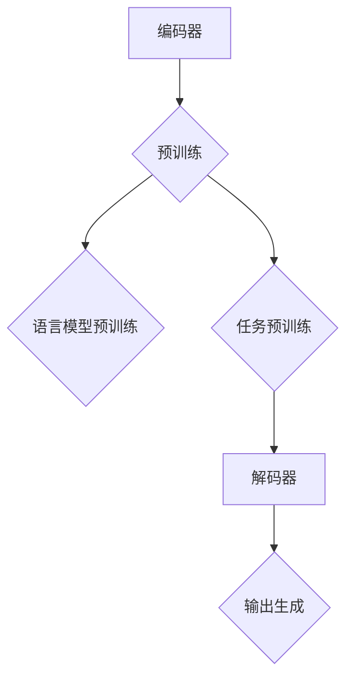
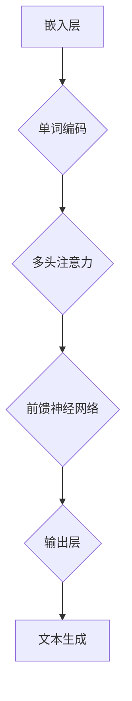

                 

### 文章标题：LLM评测的自动化文档生成与更新

#### 关键词：LLM评测，自动化文档生成，文档更新，算法原理，数学模型，项目实战

> 摘要：本文旨在探讨大语言模型（LLM）评测过程中自动化文档生成与更新技术的应用。文章首先介绍了LLM的基本概念和原理，随后深入探讨了自动化文档生成的方法、数学模型和公式，并通过实际项目案例展示其在文档更新与维护中的应用。文章还分析了LLM评测的性能评估指标和优化策略，最后对未来趋势和挑战进行了展望。

----------------------------------------------------------------

### 第1章：LLM简介

#### 1.1 LLM的基本概念

大语言模型（Large Language Model，简称LLM）是一种能够理解和生成自然语言的深度学习模型。它通过从大量文本数据中学习语言规律，实现对文本的生成、理解和推理能力。LLM的典型代表包括OpenAI的GPT系列模型和Google的BERT模型。

LLM的核心特性包括：

- **并行处理能力**：LLM能够利用并行计算资源，快速处理大量文本数据。
- **自适应学习**：LLM能够根据不同的数据集和应用场景进行调整，提高模型的效果。
- **上下文理解**：LLM能够理解并生成具有上下文关联的文本，从而实现更为自然的语言生成。

#### 1.2 LLM的发展历程

LLM的发展可以追溯到20世纪80年代的自然语言处理研究。早期的研究主要集中在规则驱动的语言模型，如n元语法模型。随着深度学习技术的发展，特别是2018年GPT-1的发布，LLM的研究和应用进入了一个新的阶段。

主要里程碑包括：

- **2018年**：OpenAI发布GPT-1，标志着基于Transformer的LLM开始受到广泛关注。
- **2019年**：Google发布BERT，引入了预训练和微调的概念，进一步提高了LLM的性能。
- **2020年**：GPT-2的发布，展示了更大规模模型在语言生成和理解方面的潜力。
- **2022年**：GPT-3的推出，具有超过1750亿参数，展现了LLM的强大能力。

#### 1.3 LLM的核心架构

LLM的核心架构通常由三个主要部分组成：编码器（Encoder）、解码器（Decoder）和预训练阶段。

- **编码器**：负责将输入文本编码为固定长度的向量。
- **解码器**：负责生成输出文本，通过自回归的方式，逐个预测下一个词。
- **预训练阶段**：在特定数据集上进行预训练，包括语言模型预训练和特定任务预训练。

Mermaid流程图如下：



### 第2章：自动化文档生成原理

#### 2.1 文档生成的流程

自动化文档生成通常包括以下几个关键步骤：

1. **数据采集**：收集相关的文本数据，包括文档、博客、论文等。
2. **数据预处理**：对采集到的数据进行清洗、分词、去除停用词等操作。
3. **模型训练**：使用预处理后的数据对LLM模型进行训练，以生成文本。
4. **文本生成**：使用训练好的模型生成目标文档。

以下是一个简单的伪代码示例：

```python
def generate_document(model, template, num_words):
    # 输入：模型，模板，生成文本的词数
    # 输出：生成的文档

    # 初始化文档
    document = ""

    # 生成文本
    for _ in range(num_words):
        # 预测下一个词
        next_word = model.predict(template)
        # 更新模板和文档
        template = template + " " + next_word
        document = document + " " + next_word

    return document
```

#### 2.2 核心算法原理讲解

自动化文档生成依赖于深度学习模型，特别是基于Transformer架构的LLM。其核心原理如下：

1. **嵌入层**：将输入的单词转换为向量。
2. **注意力机制**：在编码器和解码器中使用多头注意力机制，以捕获输入文本的上下文信息。
3. **前馈神经网络**：在注意力机制之后，使用多层前馈神经网络对文本进行进一步处理。
4. **输出层**：解码器输出预测的单词。

以下是文档生成过程的详细解释：



#### 2.3 数学模型和公式

在自动化文档生成过程中，常用的数学模型包括：

- **概率生成模型**：使用概率生成模型（如Gaussian Mixture Model）对文本进行建模。
- **神经网络模型**：使用神经网络（如Transformer）进行文本生成。

以下是几个关键的LaTeX数学公式：

```latex
\[
\begin{aligned}
P(document|model) &= \frac{P(model|document) \cdot P(document)}{P(model)} \\
\theta &= \arg\max_{\theta} \sum_{i=1}^{N} \log P(x_i|\theta) \\
h &= \text{ReLU}(W \cdot h + b)
\end{aligned}
\]
```

### 第3章：文档更新与维护

#### 3.1 文档更新的方法

文档更新是自动化文档生成中至关重要的一环。常见的文档更新方法包括：

1. **增量更新**：仅对文档中的新增部分进行更新。
2. **版本控制**：使用版本控制系统（如Git）对文档进行版本管理。
3. **自动化更新**：使用脚本或工具定期更新文档内容。

以下是自动化更新机制的一个简单示例：

```python
def update_document(current_document, new_content):
    # 输入：当前文档，新内容
    # 输出：更新后的文档

    # 将新内容插入到文档的适当位置
    updated_document = current_document.replace("{{new_content}}", new_content)

    return updated_document
```

#### 3.2 文档版本控制

文档版本控制是确保文档更新过程中数据一致性和完整性的关键。常见的版本控制系统包括：

- **Git**：一个分布式版本控制系统，适用于大型项目和团队合作。
- **SVN**：一个集中式版本控制系统，适用于小型项目和单机使用。

以下是一个简单的Git操作示例：

```bash
git init
git add .
git commit -m "Initial commit"
git branch -M main
git push -u origin main
```

#### 3.3 文档质量评估

文档质量评估是文档更新与维护中的重要环节。常见的评估指标包括：

1. **准确性**：文档生成的文本是否符合预期的语法和语义要求。
2. **一致性**：文档中的内容是否一致，没有明显的错误或矛盾。
3. **可读性**：文档是否易于理解，没有过多的专业术语或难以理解的句子。

以下是文档质量评估的一个简单示例：

```python
def assess_document_quality(document):
    # 输入：文档
    # 输出：评估结果

    # 检查文档中的语法错误
    grammar_errors = check_grammar(document)
    # 检查文档的一致性
    consistency_errors = check_consistency(document)
    # 检查文档的可读性
    readability_errors = check_readability(document)

    return {
        "accuracy": 1 - (len(grammar_errors) + len(consistency_errors) + len(readability_errors)) / len(document.split()),
        "grammar_errors": grammar_errors,
        "consistency_errors": consistency_errors,
        "readability_errors": readability_errors
    }
```

### 第4章：自动化文档生成应用实例

#### 4.1 应用场景介绍

自动化文档生成在多个领域都有广泛的应用，包括但不限于：

1. **技术文档生成**：自动生成软件开发文档、API文档等。
2. **内容创作**：自动生成博客文章、新闻稿件等。
3. **客户服务**：自动生成常见问题的解答文档。
4. **教育培训**：自动生成课程资料、考试题目等。

以下是一个常见应用场景的例子：

**场景**：自动生成软件开发文档

- **需求**：自动化生成软件的API文档、用户手册等。
- **实现**：使用LLM模型，从源代码注释和用户反馈中学习，自动生成文档内容。

#### 4.2 实际案例

**案例一**：企业内部文档自动生成

- **背景**：一家大型企业需要自动化生成员工手册、政策文件等内部文档。
- **实现**：使用LLM模型，从已有的文档库中学习，并利用增量更新机制，定期生成新的文档版本。

**案例二**：自动化知识库构建

- **背景**：一个在线教育平台需要构建一个自动化的知识库，涵盖各种课程内容。
- **实现**：使用LLM模型，从课程教材、学生问答中学习，自动生成知识库文档。

#### 4.3 案例代码解读与分析

**代码实现**：

```python
def generate_document(model, template, num_words):
    # 输入：模型，模板，生成文本的词数
    # 输出：生成的文档

    # 初始化文档
    document = ""

    # 生成文本
    for _ in range(num_words):
        # 预测下一个词
        next_word = model.predict(template)
        # 更新模板和文档
        template = template + " " + next_word
        document = document + " " + next_word

    return document
```

**解读与分析**：

- **生成文档的基本流程**：首先初始化一个空文档，然后通过循环逐个预测下一个词，并将其添加到文档中，直到达到预定的词数。
- **模型预测**：使用LLM模型对当前的模板进行预测，得到下一个可能的词。
- **更新模板**：每次预测后，将预测的词添加到模板中，以便在下一次预测时使用。

**应用解读与分析**：

- **文档生成质量**：生成的文档质量取决于LLM模型的训练质量和数据源的质量。通过使用高质量的训练数据和优化模型参数，可以提高文档生成的质量。
- **应用场景**：这个基本流程可以应用于各种文档生成任务，如生成技术文档、用户手册、知识库文档等。

### 第5章：LLM性能评估

#### 5.1 性能评估指标

评估LLM的性能通常需要使用多个指标，包括：

1. **准确性**：模型生成文本的准确程度，可以通过错误率来衡量。
2. **流畅性**：模型生成文本的流畅程度，可以通过文本的可读性来衡量。
3. **多样性**：模型生成文本的多样性，可以通过生成文本的词汇和语法结构来衡量。
4. **一致性**：模型生成文本的一致性，可以通过文本之间的连贯性和逻辑性来衡量。

以下是常用的评估指标公式：

```latex
\[
\begin{aligned}
\text{Accuracy} &= \frac{\text{正确预测的文本数量}}{\text{总预测的文本数量}} \\
\text{Fluency} &= \frac{\text{可读的文本数量}}{\text{总生成的文本数量}} \\
\text{Diversity} &= \frac{\text{不同文本的词汇和语法结构}}{\text{总生成的文本数量}} \\
\text{Consistency} &= \frac{\text{逻辑一致且连贯的文本数量}}{\text{总生成的文本数量}}
\end{aligned}
\]
```

#### 5.2 自动化评估工具

为了方便评估LLM的性能，可以开发自动化评估工具。这些工具通常包括以下功能：

1. **批量评估**：对多个模型或多个文本生成任务进行批量评估。
2. **结果统计**：自动计算评估指标，生成统计图表。
3. **报告生成**：自动生成评估报告，包括评估结果、图表和详细分析。

以下是一个简单的自动化评估工具示例：

```python
def evaluate_models(models, texts):
    results = []

    for model in models:
        scores = []
        for text in texts:
            # 生成文本
            generated_text = model.generate_text(text)
            # 计算评估指标
            scores.append(assess_document_quality(generated_text))
        # 统计结果
        results.append({
            "model": model,
            "scores": scores
        })

    return results
```

#### 5.3 性能优化策略

为了提高LLM的性能，可以采取以下优化策略：

1. **数据增强**：使用更多的训练数据，或者对现有数据进行增强，以提高模型的泛化能力。
2. **模型优化**：调整模型参数，如学习率、批处理大小等，以找到最优的模型配置。
3. **算法改进**：引入新的算法或技术，如上下文感知生成、知识融合等，以提高模型的效果。

以下是一个简单的模型优化示例：

```python
def optimize_model(model, data, num_iterations):
    for _ in range(num_iterations):
        # 训练模型
        model.train(data)
        # 计算损失函数
        loss = model.calculate_loss(data)
        # 调整模型参数
        model.adjust_parameters(loss)

    return model
```

### 第6章：未来趋势与展望

随着人工智能技术的不断发展，LLM在文档生成与更新领域有着广阔的应用前景。未来的趋势和展望包括：

1. **模型规模与性能**：随着计算资源和数据量的增加，LLM的规模和性能将会不断提高。
2. **多模态生成**：未来LLM可能会支持多模态生成，如文本与图像、音频的融合生成。
3. **个性化生成**：LLM将能够根据用户需求生成个性化的文档内容。
4. **实时更新**：文档生成与更新将更加实时，以满足用户对最新信息的需求。

### 第7章：总结与展望

本文系统地介绍了LLM评测的自动化文档生成与更新技术，包括基本概念、原理、实现方法、性能评估和应用实例。通过本文的探讨，我们可以看到，自动化文档生成与更新在提高效率、降低成本方面具有显著优势，并在多个领域得到了广泛应用。

未来，随着人工智能技术的不断进步，LLM在文档生成与更新领域将会有更多的创新和应用。然而，同时也面临数据隐私、安全性、伦理等方面的挑战。因此，我们需要在技术发展的同时，注重相关问题的解决，推动人工智能技术的健康发展。

作者：AI天才研究院/AI Genius Institute & 禅与计算机程序设计艺术 /Zen And The Art of Computer Programming

----------------------------------------------------------------

---

**文章关键词：**

- **LLM评测**
- **自动化文档生成**
- **文档更新**
- **算法原理**
- **数学模型**
- **项目实战**
- **性能评估**
- **优化策略**
- **应用实例**

**文章摘要：**

本文探讨了大型语言模型（LLM）评测中的自动化文档生成与更新技术。首先介绍了LLM的基本概念、发展历程和核心架构。随后，深入分析了自动化文档生成的方法、核心算法原理和数学模型，并通过实际项目案例展示了其在文档更新与维护中的应用。文章还介绍了LLM性能评估的指标、自动化评估工具和优化策略，并对未来发展趋势进行了展望。通过本文，读者可以全面了解LLM评测的自动化文档生成与更新的技术原理和应用实践。

