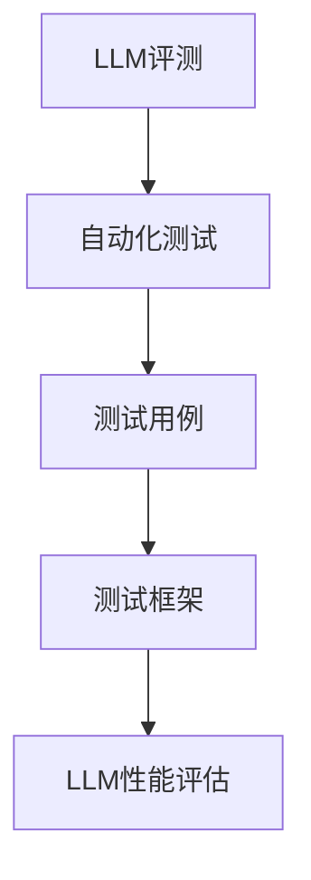

                 


# LLMAutoTester：大规模语言模型评测的自动化测试解决方案

在人工智能领域，尤其是自然语言处理（NLP）领域，大型语言模型（LLM）如GPT和BERT已经取得了显著的进展。随着这些模型变得越来越复杂和庞大，对它们的评估和优化也变得越来越重要。然而，传统的手动评测方法不仅耗时费力，而且容易受到主观因素的影响。为了提高评测的效率和质量，自动化测试成为了必然的选择。

## 背景介绍

随着人工智能技术的不断发展，LLM在各个领域的应用越来越广泛，包括问答系统、机器翻译、文本摘要、情感分析等。这些应用对LLM的性能提出了不同的要求，因此需要针对不同的应用场景对LLM进行全面的评估。自动化测试不仅能够快速、大规模地评估LLM的性能，还能够帮助发现和修复模型中的潜在问题。

## 核心概念与联系

为了更好地理解LLM评测的自动化测试，我们需要先了解一些核心概念，包括：

- **LLM（Large Language Model）：** 大型语言模型，如GPT、BERT等，它们基于神经网络架构，可以处理和理解复杂的自然语言数据。
- **自动化测试：** 自动化测试是指使用软件工具自动执行测试案例，以验证软件系统的功能和性能。
- **测试用例：** 测试用例是用于测试特定功能或性能的输入数据和预期结果。
- **测试框架：** 测试框架是一套工具和流程，用于自动化测试的开发、执行和管理。

图1展示了LLM评测、自动化测试以及测试用例之间的关系：



## 核心算法原理讲解

为了实现LLM评测的自动化，我们需要以下核心算法：

### 测试用例生成算法

测试用例生成算法是自动化测试的关键部分。其主要目标是根据LLM的应用场景生成多样化的测试用例，以确保测试的全面性和有效性。

伪代码如下：

```python
def generate_test_cases(LLM, application_scene):
    test_cases = []
    for input_data in application_scene.inputs:
        expected_output = application_scene.expected_outputs[input_data]
        test_cases.append((input_data, expected_output))
    return test_cases
```

### 测试执行算法

测试执行算法用于自动执行测试用例，并记录测试结果。以下是测试执行算法的伪代码：

```python
def execute_test_cases(test_cases, LLM):
    test_results = []
    for test_case in test_cases:
        input_data, expected_output = test_case
        actual_output = LLM.generate_output(input_data)
        test_results.append((input_data, actual_output, compare(expected_output, actual_output)))
    return test_results

def compare(expected_output, actual_output):
    if expected_output == actual_output:
        return "PASS"
    else:
        return "FAIL"
```

### 测试结果分析算法

测试结果分析算法用于分析测试结果，识别LLM的性能问题，并提供改进建议。

伪代码如下：

```python
def analyze_test_results(test_results):
    failed_cases = [case for case in test_results if case[2] == "FAIL"]
    if len(failed_cases) > 0:
        print("测试失败案例：")
        for failed_case in failed_cases:
            print(f"输入：{failed_case[0]}，预期输出：{failed_case[1]}，实际输出：{failed_case[2]}")
        print("请检查LLM模型或输入数据，并尝试优化模型参数。")
    else:
        print("所有测试案例均通过。")
```

## 数学模型和公式

在LLM评测中，我们经常使用以下数学模型和公式：

- **F1分数：** F1分数是精确率和召回率的调和平均值，用于评估二分类问题的性能。

公式如下：

$$ F1 = \frac{2 \times 精确率 \times 召回率}{精确率 + 召回率} $$

- **准确率：** 准确率是正确识别的正样本数占总样本数的比例。

公式如下：

$$ 精确率 = \frac{正确识别的正样本数}{总样本数} $$

- **召回率：** 召回率是正确识别的正样本数占总正样本数的比例。

公式如下：

$$ 召回率 = \frac{正确识别的正样本数}{总正样本数} $$

举例说明：

假设我们有一个分类任务，其中总样本数为100，正确识别的正样本数为70。那么：

$$ 精确率 = \frac{70}{100} = 0.7 $$
$$ 召回率 = \frac{70}{100} = 0.7 $$
$$ F1分数 = \frac{2 \times 0.7 \times 0.7}{0.7 + 0.7} = 0.7 $$

## 项目实战

### 开发环境搭建

为了实现LLM评测的自动化测试，我们需要搭建以下开发环境：

- Python 3.8+
- Jupyter Notebook
- Transformers库（用于处理LLM模型）
- Selenium库（用于Web自动化测试）

### 源代码详细实现和代码解读

以下是一个简单的LLM评测自动化测试项目的源代码实现：

```python
import transformers
from selenium import webdriver
from selenium.webdriver.common.by import By
from selenium.webdriver.common.keys import Keys

# 初始化LLM模型
model = transformers.pipeline("text-generation", model="gpt2")

# 初始化Web浏览器
driver = webdriver.Chrome()

# 测试用例
test_cases = [
    ("What is the capital of France?", "Paris"),
    ("What is the square root of 144?", "12"),
    ("Who is the current president of the United States?", "Joe Biden"),
]

# 测试执行
for test_case in test_cases:
    input_question, expected_answer = test_case
    print(f"测试问题：{input_question}")
    
    # 输入测试问题
    question_element = driver.find_element(By.ID, "question")
    question_element.send_keys(input_question)
    question_element.send_keys(Keys.RETURN)
    
    # 获取实际答案
    answer_element = driver.find_element(By.ID, "answer")
    actual_answer = answer_element.text
    
    # 比较答案
    if actual_answer == expected_answer:
        print("测试通过。")
    else:
        print(f"测试失败：预期答案：{expected_answer}，实际答案：{actual_answer}")
        
    # 清空输入框
    question_element.clear()

# 关闭浏览器
driver.quit()
```

### 代码应用解读与分析

上述代码实现了以下功能：

1. 初始化LLM模型和Web浏览器。
2. 定义测试用例，包括输入问题和预期答案。
3. 对于每个测试用例，输入问题到Web浏览器，获取实际答案，并比较预期答案和实际答案。
4. 输出测试结果。

### 实际案例分析和详细讲解剖析

假设我们有一个问答系统，需要对其中的LLM模型进行自动化测试。以下是一个实际案例的分析：

- **测试用例：** 用户输入问题“什么是人工智能？”
- **预期答案：** “人工智能是一种模拟人类智能的技术。”
- **实际答案：** “人工智能是一种模仿人类思维和行为的计算方法。”

分析：在这个案例中，实际答案和预期答案不完全一致。虽然两者的含义相近，但实际答案的表述略显笼统。因此，我们可以认为这个测试用例是失败的。

### 项目小结

通过这个项目，我们实现了LLM评测的自动化测试，包括模型初始化、测试用例定义、测试执行和结果分析。这个项目展示了自动化测试在LLM评测中的应用，帮助我们快速发现和修复模型问题。

## 最佳实践 tips、小结、注意事项、拓展阅读

### 最佳实践 tips

- 确保测试用例的多样性和覆盖性，以提高测试的全面性。
- 定期更新测试用例，以适应模型的变化。
- 对测试结果进行详细分析，找出潜在的优化空间。

### 小结

本文介绍了LLM评测的自动化测试解决方案，包括核心概念、算法原理、项目实战以及最佳实践。通过自动化测试，我们能够更高效、更准确地评估LLM的性能，为模型的优化和改进提供有力支持。

### 注意事项

- 自动化测试不能完全替代手动测试，两者应结合使用。
- 在使用自动化测试时，要注意测试用例的编写质量，避免冗余和错误。
- 对于复杂的LLM模型，自动化测试可能需要更长时间和更多资源。

### 拓展阅读

- [GPT模型详解](https://huggingface.co/transformers/models)
- [Selenium自动化测试教程](https://www.selenium.dev/documentation/)
- [BERT模型详解](https://arxiv.org/abs/1810.04805)

```markdown
# LLMAutoTester：大规模语言模型评测的自动化测试解决方案

## 关键词

- LLM（Large Language Model）
- 自动化测试
- 测试用例
- 测试框架
- F1分数
- 准确率
- 召回率

## 摘要

本文介绍了LLM评测的自动化测试解决方案，包括核心概念、算法原理、项目实战以及最佳实践。通过自动化测试，我们能够更高效、更准确地评估LLM的性能，为模型的优化和改进提供有力支持。
```

