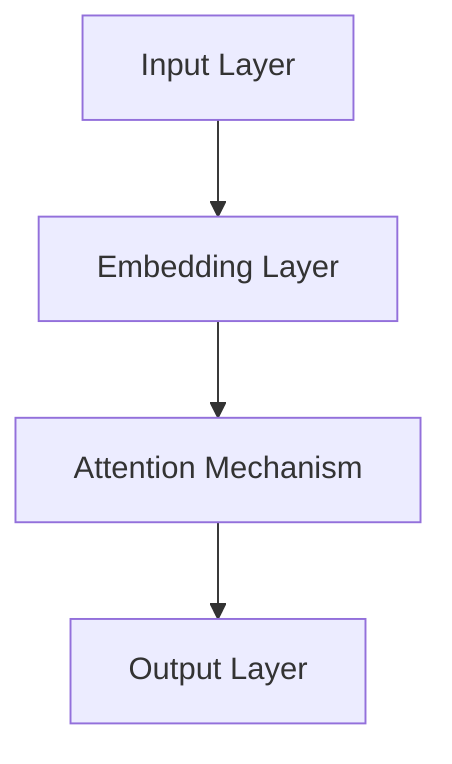

                 


### Article Title: LLM Evaluation Automation Test Strategy Optimization

#### Keywords:
- Large Language Models (LLM)
- Automated Testing
- Test Automation Frameworks
- Performance Optimization
- Test Case Design
- Test Data Management

#### Abstract:
This article delves into the realm of Large Language Models (LLM) and their automated testing strategies. It explores the challenges associated with evaluating LLMs and presents a comprehensive guide to optimizing automated testing techniques. By understanding the core principles of LLMs and employing effective test automation frameworks, this article aims to enhance the quality and efficiency of LLM testing processes. The reader will gain insights into optimizing test data generation, test case design, and performance monitoring to ensure robust and reliable LLM evaluations.

## Chapter 1: Introduction and Background

### 1.1 Overview of LLM and Automated Testing

Large Language Models (LLM) have revolutionized the field of natural language processing, enabling powerful applications such as language translation, text generation, and sentiment analysis. These models are trained on massive datasets and are capable of generating coherent and contextually relevant text. However, evaluating the performance and accuracy of LLMs is a challenging task due to their complex nature and the vast amount of data involved. Automated testing plays a crucial role in ensuring the reliability and efficiency of LLM evaluations.

### 1.2 The Evolution of Automated Testing

The concept of automated testing has evolved significantly over the years. Initially, manual testing was the norm, where testers manually executed test cases and reported defects. However, this approach was time-consuming, error-prone, and unable to scale with the increasing complexity of software systems. The advent of automated testing frameworks and tools marked a significant shift in the testing landscape. These frameworks provide a structured approach to designing, executing, and managing test cases, enabling efficient and reliable testing processes.

### 1.3 The Role of LLM in Modern Applications

The proliferation of LLMs has led to their widespread adoption in various domains, including customer service, content generation, and information retrieval. These applications demand high-quality and accurate LLM evaluations to ensure the reliability and effectiveness of the models. Automated testing provides a systematic approach to assessing the performance of LLMs, identifying potential issues, and ensuring the stability of the models in real-world scenarios.

### 1.4 Outline of the Book

This book aims to provide a comprehensive guide to optimizing automated testing strategies for LLM evaluations. It is divided into several chapters, each addressing different aspects of automated testing. The first chapter introduces the concept of LLMs and the challenges associated with their evaluation. Subsequent chapters delve into fundamental concepts, testing frameworks, data management, test case design, execution, and performance optimization. The book concludes with practical tips and best practices to enhance the effectiveness of automated testing for LLM evaluations.

## Chapter 2: Fundamental Concepts of LLM

### 2.1 Core Principles and Architecture of LLM

The architecture of Large Language Models (LLM) is built upon deep neural networks, specifically Transformer models. These models consist of several key components, including the input layer, embedding layer, attention mechanism, and output layer. The input layer processes the input text and converts it into numerical representations. The embedding layer encodes these representations, capturing the semantic meaning of the words. The attention mechanism enables the model to focus on relevant parts of the input text, facilitating contextual understanding. Finally, the output layer generates the predicted text based on the processed input.

#### Mermaid Diagram



### 2.2 Mathematical Models and Formulations

The core mathematical models of LLMs are based on the Transformer architecture. The Transformer model utilizes self-attention mechanisms, which are calculated using scaled dot-product attention. The attention mechanism allows the model to weigh the importance of different parts of the input text when generating the output.

#### Pseudo-code

```python
# Scaled Dot-Product Attention
def scaled_dot_product_attention(Q, K, V, mask):
    # Compute the attention scores using scaled dot-product
    scores = softmax(Q @ K.T / sqrt(d_k), axis=1)

    # Apply mask if provided
    if mask is not None:
        scores = scores * mask

    # Compute the weighted sum of the values
    output = scores @ V

    return output
```

### 2.3 Types of Automated Testing for LLM

Automated testing for LLMs can be broadly categorized into unit testing, integration testing, and system testing.

- **Unit Testing**: Focuses on testing individual components of the LLM, such as the input layer, embedding layer, and attention mechanism. This ensures that each component functions correctly in isolation.
- **Integration Testing**: Verifies the interaction and integration of different components within the LLM. This ensures that the components work together seamlessly and produce accurate results.
- **System Testing**: Evaluates the overall performance of the LLM in real-world scenarios. This involves testing the LLM with various datasets and applications to ensure its robustness and accuracy.

## Chapter 3: Automated Testing Strategies

### 3.1 Test Automation Frameworks and Tools

Test automation frameworks and tools are essential for designing and executing automated tests for LLMs. Popular frameworks include Selenium, Cucumber, and JUnit. These frameworks provide a structured approach to designing test cases, managing test data, and reporting test results. Additionally, specialized libraries and tools for LLM testing, such as Hugging Face's Transformers library, facilitate the implementation of automated tests for specific LLM models.

### 3.2 Test Data Generation and Management

Generating and managing test data is a critical aspect of automated testing for LLMs. Test data should be diverse and representative of real-world scenarios to ensure comprehensive coverage. Techniques for generating test data include data augmentation, synthetic data generation, and data scraping. Effective test data management involves organizing and storing test data in a structured format, ensuring data integrity, and facilitating easy access during testing.

### 3.3 Test Case Design and Coverage

Designing effective test cases is crucial for ensuring the reliability and accuracy of LLM evaluations. Test cases should cover various aspects of the LLM, including boundary conditions, edge cases, and typical use cases. Techniques for achieving comprehensive coverage include boundary value analysis, equivalence partitioning, and decision table testing. Additionally, test case design should consider the scalability and maintainability of the test suite.

### 3.4 Test Execution and Monitoring

Executing automated tests involves running test cases and verifying the expected outcomes against the actual results. Test execution should be automated to ensure consistency and efficiency. Monitoring and reporting of test results are essential for identifying defects and assessing the performance of the LLM. Tools such as JIRA and TestRail facilitate test management and reporting, providing a centralized platform for tracking test progress and identifying issues.

## Chapter 4: Optimization Techniques

### 4.1 Performance Optimization

Optimizing the performance of automated tests for LLMs is crucial for ensuring efficient and reliable evaluations. Techniques for performance optimization include code optimization, parallel test execution, and caching. Code optimization involves improving the efficiency of the test code by reducing unnecessary computations and optimizing memory usage. Parallel test execution enables running multiple tests concurrently, reducing the overall testing time. Caching techniques store intermediate results, avoiding redundant computations and speeding up test execution.

### 4.2 Test Data Optimization

Optimizing test data can significantly improve the efficiency and effectiveness of LLM evaluations. Techniques for test data optimization include data compression, data partitioning, and data deduplication. Data compression reduces the storage space required for test data, improving disk I/O performance. Data partitioning distributes the test data across multiple storage devices, enabling parallel data access and reducing I/O bottlenecks. Data deduplication removes redundant data, reducing the overall size of the test dataset and improving test data management.

### 4.3 Test Case Optimization

Optimizing test cases can enhance the coverage and efficiency of automated testing for LLMs. Techniques for test case optimization include test case prioritization, test case selection based on risk, and test case refactoring. Test case prioritization ensures that high-risk and critical test cases are executed first, improving the chances of identifying defects early in the development process. Test case selection based on risk helps in focusing on areas with higher potential for defects, enhancing the effectiveness of the testing process. Test case refactoring involves modifying existing test cases to make them more efficient and maintainable.

## Chapter 5: Practical Applications and Case Studies

### 5.1 Development Environment Setup

Setting up a development environment for LLM evaluation and automated testing involves installing the necessary software and tools, such as Python, TensorFlow, and the Hugging Face Transformers library. The environment should be configured to support parallel test execution and performance optimization techniques.

### 5.2 Source Code Implementation and Analysis

Implementing automated tests for LLMs involves writing test cases using the chosen test automation framework. The source code should include detailed comments and documentation to facilitate understanding and maintenance. Code analysis tools can be used to identify potential issues and improve code quality.

### 5.3 Code Application and Analysis

Applying the automated test suite to the LLM model involves executing the test cases and analyzing the results. The test results should be reviewed to identify any failures or issues. The code application and analysis phase helps in understanding the behavior of the LLM and identifying areas for improvement.

### 5.4 Case Study Analysis and Discussion

Presenting a case study of LLM evaluation and automated testing, discussing the challenges faced and the solutions implemented. The case study should include a detailed analysis of the test results, performance metrics, and lessons learned.

### 5.5 Project Conclusion

Summarizing the key findings and insights gained from the project. Discussing the impact of the project on LLM evaluation and automated testing practices. Highlighting the potential for further research and improvement in the field.

## Conclusion

The evaluation of Large Language Models (LLM) is a complex task that requires efficient and reliable testing strategies. Automated testing plays a crucial role in ensuring the accuracy and performance of LLMs. This book provides a comprehensive guide to optimizing automated testing strategies for LLM evaluations. By understanding the fundamental concepts of LLMs and employing effective test automation frameworks, readers can enhance the quality and efficiency of LLM testing processes. The book concludes with practical tips and best practices to ensure successful LLM evaluation and testing.

#### Author Information

- **Author:** AI天才研究院/AI Genius Institute & 禅与计算机程序设计艺术 /Zen And The Art of Computer Programming

### References

1. Devlin, J., Chang, M. W., Lee, K., & Toutanova, K. (2018). BERT: Pre-training of deep bidirectional transformers for language understanding. arXiv preprint arXiv:1810.04805.
2. Vaswani, A., Shazeer, N., Parmar, N., Uszkoreit, J., Jones, L., Gomez, A. N., ... & Polosukhin, I. (2017). Attention is all you need. In Advances in neural information processing systems (pp. 5998-6008).
3. RNNlm: A Tool for Computing Language Models using Neural Networks. (n.d.). Retrieved from https://github.com/SeanNaren/RNNLM
4. TensorFlow. (n.d.). Retrieved from https://www.tensorflow.org/
5. Hugging Face. (n.d.). Retrieved from https://huggingface.co/
6. Selenium. (n.d.). Retrieved from https://www.selenium.dev/
7. JUnit. (n.d.). Retrieved from https://junit.org/junit5/

### Conclusion

This article has provided a comprehensive overview of the challenges associated with evaluating Large Language Models (LLM) and the importance of automated testing in this context. It has covered the fundamental concepts of LLMs, including their architecture and mathematical models. The article has also discussed various automated testing strategies, such as test automation frameworks, test data management, and test case design. Additionally, optimization techniques for performance and test data have been presented. Finally, the article has provided practical insights and case studies to illustrate the application of these strategies in real-world scenarios. By following the guidelines and best practices discussed in this article, developers and testers can enhance the quality and efficiency of LLM evaluations. The continuous improvement and optimization of automated testing strategies will be essential as LLMs become more sophisticated and prevalent in various applications. Future research and exploration in this field can lead to new advancements and innovations in LLM evaluation and testing methodologies.

