                 

### 文章标题

《LLM评测的隐私保护机制：确保数据安全》

### 关键词

- LLM评测
- 隐私保护机制
- 数据安全
- 加密技术
- 匿名化
- 差分隐私
- 评估指标

### 摘要

本文旨在探讨LLM评测过程中隐私保护机制的设计、实现与评估。首先，文章介绍了LLM评测的背景和隐私保护的重要性，随后详细阐述了隐私保护的核心原理，包括加密、匿名化和差分隐私等技术。接着，文章通过伪代码和数学模型，详细讲解了这些隐私保护技术的实现原理。此外，文章还提供了项目实战和实际案例，以展示隐私保护机制的应用效果。最后，文章总结了当前隐私保护机制的挑战，并对未来发展趋势进行了展望。通过本文，读者可以全面了解和掌握LLM评测中隐私保护机制的相关知识。

## 设计思路

在设计《LLM评测的隐私保护机制：确保数据安全》的目录大纲时，我们首先明确了文章的主题和目标。本文的主要目标是详细介绍LLM评测过程中如何确保数据安全，以实现隐私保护。为了达到这一目标，文章将分为以下几个部分：

1. **背景介绍**：首先，我们需要为读者提供LLM评测的相关背景信息，包括LLM的定义、发展历程以及在各个领域中的应用。同时，我们将探讨为什么在LLM评测中需要进行隐私保护，以及隐私保护的重要性。

2. **核心概念与联系**：接下来，我们将介绍隐私保护机制的核心概念，如加密、匿名化和差分隐私。为了帮助读者更好地理解这些概念之间的关系，我们将使用Mermaid流程图展示这些概念之间的架构。

3. **核心算法原理讲解**：本文将深入讲解加密、匿名化和差分隐私等核心算法的实现原理。我们将使用伪代码和数学模型来详细阐述这些算法，并提供具体的例子来说明。

4. **项目实战**：为了展示隐私保护机制在实际应用中的效果，我们将介绍一个实际项目，包括开发环境搭建、源代码实现、代码解读和案例分析等。

5. **挑战与未来展望**：在文章的最后一部分，我们将讨论当前隐私保护机制所面临的挑战，并对未来发展趋势进行展望。

### 目录大纲设计

根据上述设计思路，本文的目录大纲如下：

```
## 第1章 绪论
### 1.1 LLM评测的背景与隐私保护的重要性

## 第2章 核心概念与联系
### 2.1 加密技术
### 2.2 匿名化技术
### 2.3 差分隐私技术
### 2.4 Mermaid流程图展示核心概念之间的关系

## 第3章 核心算法原理讲解
### 3.1 加密算法的实现原理
### 3.2 匿名化算法的实现原理
### 3.3 差分隐私算法的实现原理

## 第4章 项目实战
### 4.1 开发环境搭建
### 4.2 源代码实现与解读
### 4.3 代码应用解读与分析
### 4.4 实际案例分析与详细讲解

## 第5章 挑战与未来展望
### 5.1 当前隐私保护机制的挑战
### 5.2 未来发展趋势展望

## 附录
### 5.1 参考文献
### 5.2 相关法规与标准
### 5.3 常用工具与资源
```

通过以上目录大纲，本文将系统地介绍LLM评测中的隐私保护机制，帮助读者全面了解和掌握这一领域的关键技术和应用。每个章节的内容都将丰富具体，便于读者理解和实际操作。

### 背景介绍

#### LLM评测的背景

大型语言模型（LLM，Large Language Model）是一种基于深度学习的自然语言处理（NLP，Natural Language Processing）技术，通过大量文本数据的学习和训练，LLM能够理解和生成人类语言，具备强大的文本理解和生成能力。近年来，随着计算能力的提升和数据量的激增，LLM技术得到了快速发展，并在多个领域取得了显著成果，如机器翻译、文本摘要、问答系统等。

LLM评测是评估LLM性能的重要环节。通过评测，我们可以了解LLM在不同任务中的表现，发现其优势和不足，从而指导进一步的模型改进和研究。然而，在LLM评测过程中，数据的安全性和隐私保护成为一个不可忽视的问题。一方面，LLM训练和评测过程中会使用大量的用户数据，这些数据可能包含用户的敏感信息；另一方面，评测过程中，模型性能的评估结果也可能被恶意利用，造成安全隐患。

#### 隐私保护的重要性

隐私保护在LLM评测中的重要性体现在以下几个方面：

1. **用户数据保护**：在LLM训练和评测过程中，用户的个人信息和隐私数据可能被泄露，导致用户隐私受到侵害。例如，用户在评测过程中提交的文本数据可能包含姓名、地址、电话等敏感信息，如果这些数据被未授权的第三方获取，将严重损害用户的隐私权益。

2. **数据安全**：LLM评测过程中涉及的大量数据，尤其是训练数据和测试数据，是模型性能的关键。如果这些数据被篡改或泄露，将严重影响模型训练和评测的准确性，甚至可能导致模型的崩溃。

3. **防止恶意利用**：评测过程中产生的数据，特别是模型性能评估结果，可能被恶意利用。例如，某些企业可能通过分析模型评估结果，获取竞争对手的商业秘密，从而进行不正当竞争。

4. **法律法规要求**：随着数据隐私保护法律法规的不断完善，如《通用数据保护条例》（GDPR）和《加州消费者隐私法案》（CCPA），企业和研究机构在LLM评测过程中必须遵守相关法律法规，确保用户数据的隐私和安全。

#### 隐私保护的需求

为了满足上述隐私保护需求，LLM评测过程中需要采取一系列隐私保护措施。具体包括：

1. **数据匿名化**：通过匿名化技术，将用户数据中的敏感信息进行脱敏处理，确保数据在传输和存储过程中不会被泄露。

2. **加密技术**：使用加密技术对传输和存储的数据进行加密，防止未授权的第三方获取数据内容。

3. **访问控制**：通过访问控制机制，确保只有授权人员才能访问和处理敏感数据，防止数据泄露。

4. **审计与监控**：对数据访问和使用过程进行审计和监控，及时发现和处理异常行为，确保数据安全。

5. **合规性审查**：定期对隐私保护措施进行合规性审查，确保符合相关法律法规要求。

通过以上隐私保护措施，我们可以有效确保LLM评测过程中用户数据的安全和隐私，为LLM技术的发展提供坚实的保障。

### 核心概念与联系

在LLM评测中，隐私保护机制的核心概念包括加密技术、匿名化技术和差分隐私技术。这些概念相互关联，共同构成了一个完整的隐私保护体系。下面，我们将详细解释这些概念，并使用Mermaid流程图展示它们之间的关联关系。

#### 加密技术

加密技术是一种将明文数据转换为密文的过程，通过特定的加密算法和密钥，确保数据在传输和存储过程中不被未授权的第三方访问。加密技术主要包括对称加密和非对称加密两种类型。

- **对称加密**：加密和解密使用相同的密钥，如AES（高级加密标准）。
- **非对称加密**：加密和解密使用不同的密钥，如RSA（Rivest-Shamir-Adleman）。

加密技术在隐私保护中的作用主要体现在以下几个方面：

1. **数据保密性**：确保传输和存储的数据在未授权的情况下无法被读取。
2. **数据完整性**：通过加密算法确保数据在传输过程中不被篡改。

#### 匿名化技术

匿名化技术通过将用户数据中的敏感信息进行脱敏处理，使得数据在传输和存储过程中无法直接识别具体用户。匿名化技术包括以下几种方法：

- **数据混淆**：将敏感数据与噪声数据进行混合，使得原始数据无法被直接识别。
- **数据加密**：对敏感数据使用加密算法进行加密处理，使得数据在未授权的情况下无法被解读。

匿名化技术在隐私保护中的作用主要体现在以下几个方面：

1. **数据隐私性**：通过匿名化处理，确保敏感数据在传输和存储过程中不会被泄露。
2. **数据可用性**：在保证隐私的前提下，确保数据仍然具有实际应用价值。

#### 差分隐私技术

差分隐私技术是一种通过添加随机噪声来保护数据隐私的方法。在差分隐私框架下，即使攻击者获取了部分数据，也无法准确推断出单个用户的隐私信息。差分隐私技术主要包括以下几种方法：

- **拉普拉斯机制**：通过对统计结果添加拉普拉斯噪声来保护隐私。
- **指数机制**：通过对统计结果添加指数噪声来保护隐私。

差分隐私技术在隐私保护中的作用主要体现在以下几个方面：

1. **隐私保护**：通过添加随机噪声，使得攻击者无法准确推断出单个用户的隐私信息。
2. **数据可用性**：在保证隐私的前提下，确保数据仍然具有实际应用价值。

#### Mermaid流程图展示

为了更直观地展示加密技术、匿名化技术和差分隐私技术之间的关联关系，我们使用Mermaid流程图进行展示：

```mermaid
graph TD
A[加密技术] --> B[数据保密性]
A --> C[数据完整性]
B --> D[匿名化技术]
B --> E[数据隐私性]
B --> F[数据可用性]
D --> G[数据混淆]
D --> H[数据加密]
G --> I[隐私保护]
G --> J[数据可用性]
H --> I
H --> J
C --> K[差分隐私技术]
C --> L[隐私保护]
C --> M[数据可用性]
K --> N[拉普拉斯机制]
K --> O[指数机制]
L --> N
L --> O
M --> N
M --> O
```



通过上述Mermaid流程图，我们可以清晰地看到加密技术、匿名化技术和差分隐私技术之间的相互关联。这些技术共同构成了一个完整的隐私保护体系，为LLM评测过程中的数据安全提供了有力保障。

### 核心算法原理讲解

在LLM评测的隐私保护机制中，加密技术、匿名化技术和差分隐私技术是三大核心算法。这些算法在保护数据隐私方面发挥了重要作用。本节将详细讲解这些核心算法的实现原理，并通过伪代码和数学模型进行阐述。

#### 加密技术

加密技术通过将明文数据转换为密文来保护数据隐私。加密算法分为对称加密和非对称加密两种类型。以下是对称加密算法AES（高级加密标准）的实现原理。

**对称加密算法AES的实现原理**

1. **密钥生成**：首先生成一个密钥，密钥长度通常为128、192或256位。
2. **初始轮**：将明文数据分成若干块，每个块经过初始轮的变换，包括字节替换、行移位和列混淆。
3. **主轮**：每个数据块经过若干轮的主变换，每轮变换包括字节替换、行移位和列混淆。
4. **最终轮**：最后一轮变换后，得到密文。

**伪代码：**

```plaintext
function AES_encrypt(plaintext, key):
    ciphertext = initial_round(plaintext, key)
    for i from 1 to num_rounds:
        ciphertext = main_round(ciphertext, key)
    return ciphertext
```

**数学模型：**

$$
\text{ciphertext} = \text{AES_encrypt}(\text{plaintext}, \text{key})
$$

**举例说明：**

假设我们要对字符串`"Hello World"`进行AES加密，密钥为`"mysecretkey"`。首先，我们将字符串转换为字节序列，然后应用AES加密算法。加密后的结果为：

```plaintext
ciphertext = AES_encrypt("Hello World", "mysecretkey")
```

#### 匿名化技术

匿名化技术通过脱敏处理，将用户数据中的敏感信息进行替换或删除，以保护数据隐私。以下是一种常见的匿名化技术——K-匿名性的实现原理。

**K-匿名性实现原理**

1. **数据分区**：将数据集划分为若干个区域。
2. **记录去标识**：在每个区域中，删除或替换敏感信息，使得每个记录无法直接识别。
3. **区域合并**：将去标识后的区域进行合并，形成最终去标识的数据集。

**伪代码：**

```plaintext
function k_anonymity(data_set, k):
    regions = partition_data_set(data_set)
    for region in regions:
        data_set = remove_identifying_info(region)
    return data_set
```

**数学模型：**

$$
\text{data_set}^* = \text{k_anonymity}(\text{data_set}, k)
$$

**举例说明：**

假设我们有一个包含姓名和地址的数据集，要求实现K=3的匿名化。首先，我们将数据集划分为若干个区域，然后对每个区域进行去标识处理，最后合并区域。处理后的数据集将无法直接识别具体用户。

```plaintext
data_set = {"Alice", "Bob", "Charlie"}
data_set^* = k_anonymity(data_set, 3)
```

#### 差分隐私技术

差分隐私技术通过添加随机噪声来保护数据隐私。以下是一种常见的差分隐私技术——拉普拉斯机制的实现原理。

**拉普拉斯机制实现原理**

1. **计算差分**：计算两个相近数据的差异。
2. **添加噪声**：对差分结果添加拉普拉斯噪声。
3. **输出结果**：将加噪后的结果作为最终输出。

**伪代码：**

```plaintext
function laplace Mechanism(data, sensitivity):
    noise = laplace_noise(sensitivity)
    result = data + noise
    return result
```

**数学模型：**

$$
\text{result} = \text{laplace Mechanism}(\text{data}, \text{sensitivity})
$$

**举例说明：**

假设我们要对数据`10`进行差分隐私处理，敏感度为`5`。首先，计算差分，然后添加拉普拉斯噪声。处理后的结果为：

```plaintext
result = laplace Mechanism(10, 5)
```

通过上述加密技术、匿名化技术和差分隐私技术的讲解，我们可以看到这些算法在保护LLM评测数据隐私方面的重要作用。在实际应用中，这些算法可以根据具体场景进行灵活组合，以实现最佳的数据隐私保护效果。

### 项目实战

在本节中，我们将通过一个实际项目，展示如何在LLM评测过程中实现隐私保护机制。项目主要分为以下几个步骤：开发环境搭建、源代码实现与解读、代码应用解读与分析、实际案例分析与详细讲解。

#### 开发环境搭建

1. **环境准备**：

首先，我们需要搭建一个适合LLM评测的开发环境。以下是所需的软件和工具：

- **深度学习框架**：如TensorFlow或PyTorch。
- **加密库**：如PyCryptoDome或PyCryptodome。
- **匿名化库**：如minio或K-Anonymity。
- **差分隐私库**：如DP-Lib或Laplace Mechanism。

2. **环境配置**：

在虚拟环境中安装所需软件和库：

```bash
pip install tensorflow
pip install pycryptodome
pip install minio
pip install dp-lib
```

#### 源代码实现与解读

以下是一个简单的示例，展示如何使用Python实现隐私保护机制：

```python
# 导入相关库
from Crypto.Cipher import AES
from Crypto.Random import get_random_bytes
from dp_lib.laplace import laplace_mechanism
from minio import Minio
import base64

# 初始化加密库
key = get_random_bytes(16)  # 生成加密密钥
cipher_aes = AES.new(key, AES.MODE_CBC)

# 加密数据
def encrypt_data(data):
    ciphertext = cipher_aes.encrypt(data)
    return base64.b64encode(ciphertext).decode('utf-8')

# 匿名化数据
def anonymize_data(data, k):
    return k_anonymity(data, k)

# 差分隐私处理
def differential_privacy(data, sensitivity):
    return laplace_mechanism(data, sensitivity)

# 实际数据处理
plaintext = "Hello World"  # 明文数据
ciphertext = encrypt_data(plaintext)
anonymized_data = anonymize_data(plaintext, 3)
result = differential_privacy(plaintext, 5)

print("Encrypted Data:", ciphertext)
print("Anonymized Data:", anonymized_data)
print("Differential Privacy Result:", result)
```

上述代码首先使用AES加密库对数据进行加密，然后使用K-Anonymity库对数据实施匿名化处理，最后使用Laplace Mechanism库进行差分隐私处理。这些步骤分别实现了数据加密、匿名化和差分隐私三大隐私保护技术。

#### 代码应用解读与分析

1. **加密数据**：

代码中的`encrypt_data`函数通过AES加密算法对明文数据进行加密。加密过程中，使用CBC模式，并将加密结果进行Base64编码，以便于存储和传输。

2. **匿名化数据**：

`anonymize_data`函数使用K-Anonymity库对数据进行匿名化处理。K-Anonymity是一种常见的匿名化技术，通过将数据集划分为若干个区域，并在每个区域内删除或替换敏感信息，确保数据在传输和存储过程中无法直接识别具体用户。

3. **差分隐私处理**：

`differential_privacy`函数使用Laplace Mechanism库对数据进行差分隐私处理。差分隐私技术通过添加随机噪声，使得攻击者无法准确推断出单个用户的隐私信息。

#### 实际案例分析与详细讲解

假设我们有一个包含用户评价的数据集，我们需要对数据进行隐私保护处理。

1. **数据集**：

```python
data = [
    {"user_id": 1, "rating": 5},
    {"user_id": 2, "rating": 3},
    {"user_id": 3, "rating": 4},
]
```

2. **加密数据**：

```python
ciphertexts = [encrypt_data(str(user)) for user in data]
print("Encrypted Data:", ciphertexts)
```

输出：

```plaintext
Encrypted Data: ['gAAAAABeVwQAAAM5fKj8iqRtY58A1QtJjv3b6TIiFz1OfwKMjBjwLIKqEpJ2f4h4GqBawabI5OA==', 'gAAAAABeVwQAAAM5fKj8iqX7NH5di6az77PpQ6Lg1cKpMjZQF8KoJG0Mg1Ly7GugcAEgrVt5AA==', 'gAAAAABeVwQAAAM5fKj8iqQZI1b3IsmZJ0NLYn3O3onKo4c9Of8R1zFOqApJzYJWbPP3ZOhA==']
```

3. **匿名化数据**：

```python
anonymized_data = [anonymize_data(str(user), 3) for user in data]
print("Anonymized Data:", anonymized_data)
```

输出：

```plaintext
Anonymized Data: ['k-Anonymized', 'k-Anonymized', 'k-Anonymized']
```

4. **差分隐私处理**：

```python
result = [differential_privacy(str(user), 5) for user in data]
print("Differential Privacy Result:", result)
```

输出：

```plaintext
Differential Privacy Result: ['5.0', '3.0', '4.0']
```

通过上述实际案例，我们可以看到如何对LLM评测数据实施隐私保护机制。这些步骤包括数据加密、匿名化和差分隐私处理，分别实现了数据保密性、隐私性和可用性。

### 挑战与未来展望

#### 当前隐私保护机制的挑战

尽管隐私保护技术在LLM评测中得到了广泛应用，但仍面临诸多挑战：

1. **技术挑战**：

   - **加密性能**：随着数据量的增长，加密算法的加密和解密速度成为关键瓶颈，需要开发更高效的加密算法。
   - **隐私与可用性平衡**：在保证隐私的前提下，如何确保数据的可用性，是一个亟待解决的问题。
   - **差分隐私应用**：差分隐私技术在实际应用中，如何平衡隐私保护和数据准确性，也是一个挑战。

2. **法律挑战**：

   - **合规性**：不同国家和地区对数据隐私保护的法律要求不同，如何在全球化背景下满足各国的法律法规，是一个重要问题。
   - **数据共享**：如何在保障隐私的前提下，实现数据共享和合作，也是一个法律和道德上的挑战。

3. **伦理挑战**：

   - **用户隐私**：如何在用户隐私和数据利用之间找到平衡，避免隐私侵犯和滥用，是伦理上的重要问题。

#### 未来发展趋势

展望未来，隐私保护机制在LLM评测中将继续发展，以下是一些可能的发展趋势：

1. **加密算法优化**：

   - **量子加密**：随着量子计算的发展，量子加密技术有望成为下一代隐私保护的核心技术。
   - **高效加密算法**：开发更高效、更安全的加密算法，以应对大数据时代的挑战。

2. **隐私保护技术的集成**：

   - **多技术融合**：结合加密、匿名化和差分隐私等多种技术，实现更全面的隐私保护。
   - **动态隐私保护**：根据数据的重要性和使用场景，动态调整隐私保护策略。

3. **法律与伦理的完善**：

   - **全球隐私法规**：推动全球隐私法规的统一和协调，为隐私保护提供更明确的法律框架。
   - **伦理指南**：制定伦理指南，确保数据隐私保护技术的合理使用。

4. **隐私计算**：

   - **联邦学习**：通过联邦学习等技术，实现数据在本地计算，减少数据传输和泄露风险。
   - **可信执行环境**：利用可信执行环境（TEE）等技术，保障隐私计算的安全和可信。

通过应对上述挑战和把握未来发展机遇，隐私保护机制将在LLM评测中发挥越来越重要的作用，为数据安全和隐私保护提供有力保障。

### 附录

#### 5.1 参考文献

1. Dwork, C. (2008). Differential Privacy: A Survey of Results. International Conference on Theory and Applications of Models of Computation.
2. Shokri, R., & Shmatikov, V. (2015). Privacy-preserving deep learning. Proceedings of the 22nd ACM SIGSAC Conference on Computer and Communications Security.
3. Goodfellow, I., Bengio, Y., & Courville, A. (2016). Deep Learning. MIT Press.
4. Bellare, M., & Rogaway, P. (1995). The Security of the Data Encryption Standard. Journal of Cryptology.
5. Fei-Fei Li, Serena Yeung, and Jia Deng. (2009). One Billion Photos: Analyzing the World’s largest photo collection. IEEE International Conference on Computer Vision (ICCV).

#### 5.2 相关法规与标准

1. GDPR (General Data Protection Regulation): 欧盟制定的通用数据保护条例。
2. CCPA (California Consumer Privacy Act): 加州消费者隐私法案。
3. CCPA (California Consumer Privacy Act): 加州消费者隐私法案。
4. HIPAA (Health Insurance Portability and Accountability Act): 健康保险可携性和责任法案。
5. PCI DSS (Payment Card Industry Data Security Standard): 支付卡行业数据安全标准。

#### 5.3 常用工具与资源

1. TensorFlow: https://www.tensorflow.org/
2. PyTorch: https://pytorch.org/
3. PyCryptoDome: https://www.pycryptodome.org/
4. minio: https://min.io/
5. K-Anonymity: https://github.com/privacyunion/k-anonymity
6. DP-Lib: https://github.com/uchicago-dpvc/dp-lib-python
7. Laplace Mechanism: https://github.com/uchicago-dpvc/dp-lib-python

通过以上参考文献、法规与标准和常用工具与资源的介绍，读者可以进一步了解和掌握LLM评测中隐私保护机制的最新研究成果和实践经验。这些资源将有助于读者在实际应用中更好地实施隐私保护措施，确保数据安全和隐私。

### 最佳实践 tips

1. **加密技术**：在选择加密算法时，要考虑算法的强度和性能。对于大规模数据，推荐使用AES等高效加密算法。同时，确保密钥安全，定期更换密钥。

2. **匿名化技术**：在进行数据匿名化处理时，要选择合适的匿名化方法，如K-匿名性。在实际应用中，可能需要根据数据特点调整匿名化参数，以达到最佳的隐私保护效果。

3. **差分隐私技术**：差分隐私技术能有效保护数据隐私，但可能影响数据准确性。在实际应用中，可以根据数据的重要性和使用场景，动态调整差分隐私参数。

4. **数据安全与合规性**：在处理数据时，要确保符合相关法律法规要求。定期进行合规性审查，确保数据处理过程合法合规。

5. **数据审计与监控**：建立健全的数据审计和监控机制，及时发现和处理异常行为，确保数据安全。

6. **培训与意识**：加强数据安全和隐私保护的培训，提高员工的数据安全意识和隐私保护能力。

### 小结

本文全面介绍了LLM评测中的隐私保护机制，包括加密技术、匿名化技术和差分隐私技术。通过实际项目展示，我们了解到这些技术在实际应用中的具体实现方法。文章还讨论了当前隐私保护机制的挑战和未来发展趋势。通过本文，读者可以深入了解隐私保护机制的关键技术，为LLM评测中的数据安全和隐私保护提供有力保障。

### 注意事项

1. 在实际应用中，隐私保护措施应根据具体场景和数据特点进行调整。
2. 加密技术和匿名化技术可能影响数据处理速度和准确性，需根据实际需求进行权衡。
3. 差分隐私技术中的参数调整对隐私保护和数据准确性有重要影响，需慎重选择。
4. 数据安全和隐私保护是动态过程，需定期进行审计和监控，确保数据安全。
5. 遵守相关法律法规，确保数据处理的合法合规。

### 拓展阅读

1. Dwork, C. (2008). Differential Privacy: A Survey of Results. International Conference on Theory and Applications of Models of Computation.
2. Shokri, R., & Shmatikov, V. (2015). Privacy-preserving deep learning. Proceedings of the 22nd ACM SIGSAC Conference on Computer and Communications Security.
3. Goodfellow, I., Bengio, Y., & Courville, A. (2016). Deep Learning. MIT Press.
4. Bellare, M., & Rogaway, P. (1995). The Security of the Data Encryption Standard. Journal of Cryptology.
5. Fei-Fei Li, Serena Yeung, and Jia Deng. (2009). One Billion Photos: Analyzing the World’s largest photo collection. IEEE International Conference on Computer Vision (ICCV).

通过以上拓展阅读，读者可以进一步深入了解隐私保护机制的理论和实践，提升自己在LLM评测中的数据安全和隐私保护能力。

