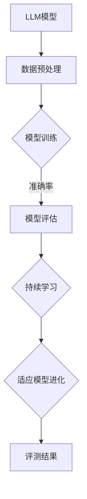

                 


### 文章标题：LLM评测系统的持续学习：适应模型进化的机制设计

### 关键词：
- LLM（大型语言模型）
- 评测系统
- 持续学习
- 模型进化
- 自适应机制

### 摘要：
本文深入探讨了LLM评测系统的持续学习机制及其适应模型进化的设计。首先，介绍了LLM的基本概念和评测系统的背景知识，然后重点分析了持续学习的概念和适应模型进化的机制设计。通过详细的理论讲解、流程图展示和数学公式解析，本文为LLM评测系统的持续学习和适应模型进化提供了系统性指导。

### 目录

## 第一部分：LLM基本概念与背景知识

### 第1章 LLM概述

#### 1.1 LLM的定义

- LLM的起源和发展
- LLM的分类和特点

#### 1.2 LLM的应用领域

- 自然语言处理
- 人工智能助手
- 自动化写作

#### 1.3 LLM的发展趋势

- 模型规模的增长
- 训练数据的多样化

### 第2章 评测系统的基本原理

#### 2.1 评测系统的定义和作用

- 评测系统的基本组成
- 评测系统的分类

#### 2.2 评测指标

- 评测指标的选择
- 常见评测指标详解

#### 2.3 评测方法的比较

- 不同评测方法的优缺点
- 如何选择合适的评测方法

## 第二部分：持续学习机制设计

### 第3章 持续学习的概念

#### 3.1 持续学习的定义

- 持续学习的必要性
- 持续学习的目标和挑战

#### 3.2 持续学习的方法

- 基于模型的持续学习
- 基于数据的持续学习

#### 3.3 持续学习的应用场景

- 个性化服务
- 实时预测

### 第4章 适应模型进化的机制设计

#### 4.1 模型进化的原因

- 数据分布的变化
- 用户需求的多样性

#### 4.2 适应模型进化的机制

- 自适应学习率
- 模型融合

#### 4.3 适应模型进化的策略

- 数据增强
- 模型压缩

## 第三部分：评测系统设计与实现

### 第5章 评测系统的设计与实现

#### 5.1 评测系统的整体架构

- 评测系统的功能模块
- 评测系统的设计原则

#### 5.2 评测系统的关键技术

- 模型评估
- 数据预处理

#### 5.3 评测系统的实现步骤

- 模型选择
- 模型训练
- 评测指标计算

### 第6章 持续学习在评测系统中的应用

#### 6.1 持续学习在评测系统中的作用

- 提高评测结果的准确性
- 减少模型过拟合的风险

#### 6.2 持续学习在评测系统中的实现

- 持续学习算法的选择
- 持续学习流程的设计

#### 6.3 持续学习对评测系统性能的影响

- 实验设计和结果分析

### 第7章 适应模型进化的评测系统案例分析

#### 7.1 案例介绍

- 案例背景
- 案例目标

#### 7.2 案例实现

- 持续学习机制的设计
- 适应模型进化的策略

#### 7.3 案例分析

- 评测结果的分析
- 评测系统的性能评估

## 第四部分：未来展望

### 第8章 LLM评测系统的未来发展趋势

#### 8.1 持续学习机制的改进

- 深度学习技术的进展
- 强化学习在持续学习中的应用

#### 8.2 适应模型进化的新策略

- 自适应数据流
- 模型压缩与稀疏化

#### 8.3 LLM评测系统的应用前景

- 工业界的需求
- 学术研究的方向

## 附录

### 附录 A：常用评测指标详解

### 附录 B：持续学习算法详解

### 附录 C：适应模型进化的技术详解

### 结论

- 对全书内容的总结
- 对未来研究的展望

### Mermaid 流程图



### 核心算法原理讲解

#### 持续学习算法原理

```plaintext
持续学习（Continual Learning）是指在动态环境中，模型能够持续地从新数据中学习，而不会受到之前学习数据的干扰。其核心算法原理包括：

1. 重置策略：在每次学习新数据时，重置之前的模型参数，以避免旧数据对学习新数据的干扰。
2. 负迁移抑制：通过训练额外的对抗性网络来抑制负迁移现象。
3. 数据增强：通过数据增强技术增加训练数据的多样性，提高模型对新数据的适应性。
```

### 数学模型和数学公式详解

#### 持续学习损失函数

$$
L = \frac{1}{N} \sum_{i=1}^{N} \left( -y_{i} \log(p_{\theta}(x_{i})) - (1 - y_{i}) \log(1 - p_{\theta}(x_{i})) \right)
$$

其中，\(L\) 表示损失函数，\(N\) 表示样本总数

## 第1章 LLM概述

### 1.1 LLM的定义

#### LLM的起源和发展

LLM（Large Language Model）指的是大型语言模型，是一种基于深度学习技术的自然语言处理模型。自2018年GPT（Generative Pre-trained Transformer）系列模型的出现以来，LLM技术得到了快速发展。GPT-3模型的发布更是将LLM推向了巅峰，展示了其强大的语言理解和生成能力。

#### LLM的分类和特点

LLM可以分为以下几种类型：

1. **预训练模型**：如GPT系列、BERT等，通过在大量未标注的文本数据上预训练，形成对语言规律的理解。
2. **微调模型**：在预训练模型的基础上，使用标注数据进行微调，以适应特定任务的需求。
3. **生成式模型**：如GPT-3，能够生成连贯、多样的文本内容。
4. **判别式模型**：如BERT，主要用于文本分类、问答等任务。

LLM的特点包括：

- **强大的语言理解能力**：LLM能够理解并生成复杂的语言结构。
- **高度并行化**：基于Transformer架构的LLM可以高效地并行处理大量数据。
- **自适应性强**：LLM可以通过微调快速适应不同任务的需求。

## 1.2 LLM的应用领域

#### 自然语言处理

LLM在自然语言处理（NLP）领域有着广泛的应用，如文本分类、情感分析、机器翻译、问答系统等。通过预训练和微调，LLM能够处理各种复杂的语言任务。

#### 人工智能助手

LLM技术被广泛应用于人工智能助手，如聊天机器人、语音助手等。这些助手能够与用户进行自然语言交互，提供个性化服务。

#### 自动化写作

LLM在自动化写作领域也展现了巨大的潜力，如生成新闻报道、撰写学术论文等。通过学习大量文本数据，LLM能够生成高质量的内容。

## 1.3 LLM的发展趋势

#### 模型规模的增长

随着计算能力的提升和数据量的增加，LLM的模型规模也在不断增长。GPT-3拥有1750亿个参数，是目前最大的语言模型。未来，模型规模的扩大将继续推动LLM技术的发展。

#### 训练数据的多样化

为了提高LLM的泛化能力，训练数据的多样化变得越来越重要。未来，LLM将更多地使用来自不同领域和场景的数据进行训练，以提高其适应性和表现力。

## 第2章 评测系统的基本原理

### 2.1 评测系统的定义和作用

#### 评测系统的定义

评测系统是指用于评估LLM模型性能的一系列工具和方法的集合。它通过多种评测指标和评测方法来衡量模型在特定任务上的表现。

#### 评测系统的基本组成

一个典型的评测系统包括以下几个基本组成部分：

- **评测指标**：用于衡量模型性能的具体指标，如准确率、召回率、F1分数等。
- **评测方法**：用于收集、处理和评估模型性能的方法，如交叉验证、leave-one-out等。
- **评测工具**：用于实现评测方法和计算评测指标的工具，如自动评测脚本、评测平台等。

#### 评测系统的分类

评测系统可以根据不同的分类标准进行分类，如：

- **按评测任务分类**：如文本分类、情感分析、机器翻译等。
- **按评测方法分类**：如基于手工标注的数据、自动评测方法等。
- **按评测目的分类**：如性能评估、优化调参、比较不同模型等。

### 2.2 评测指标

#### 评测指标的选择

选择合适的评测指标对于评估LLM模型性能至关重要。以下是一些常用的评测指标：

- **准确率（Accuracy）**：预测正确的样本数占总样本数的比例。适用于二分类任务。
- **召回率（Recall）**：实际为正类的样本中被正确识别为正类的比例。适用于正类样本较少的情况。
- **F1分数（F1 Score）**：准确率和召回率的调和平均，综合考虑了准确率和召回率。
- **ROC曲线（Receiver Operating Characteristic Curve）**：用于评估二分类模型的性能，通过计算真阳性率（True Positive Rate）和假阳性率（False Positive Rate）得到。
- **AUC（Area Under Curve）**：ROC曲线下的面积，用于评估模型的分类能力。

#### 常见评测指标详解

- **准确率（Accuracy）**：
  $$
  Accuracy = \frac{TP + TN}{TP + TN + FP + FN}
  $$
  其中，\(TP\) 表示真正例，\(TN\) 表示真反例，\(FP\) 表示假正例，\(FN\) 表示假反例。

- **召回率（Recall）**：
  $$
  Recall = \frac{TP}{TP + FN}
  $$

- **F1分数（F1 Score）**：
  $$
  F1 Score = 2 \times \frac{Precision \times Recall}{Precision + Recall}
  $$
  其中，\(Precision\) 表示精确率。

- **ROC曲线和AUC**：
  真阳性率（True Positive Rate）和假阳性率（False Positive Rate）随着分类阈值的变化而变化，ROC曲线通过连接这些点形成。AUC表示ROC曲线下的面积，值越大，模型的分类能力越强。

### 2.3 评测方法的比较

#### 不同评测方法的优缺点

选择合适的评测方法对于评估LLM模型性能至关重要。以下是一些常用的评测方法及其优缺点：

- **交叉验证（Cross Validation）**：
  - 优点：能够有效减少模型过拟合，提高评估结果的可靠性。
  - 缺点：计算成本较高，适用于样本量较大的情况。
  - 应用场景：用于评估模型在未知数据上的性能。

- **leave-one-out（LOO）**：
  - 优点：计算简单，适用于样本量较小的情况。
  - 缺点：评估结果容易受到个别样本的影响。
  - 应用场景：用于小样本数据的模型评估。

- **K折交叉验证（K-fold Cross Validation）**：
  - 优点：计算成本适中，评估结果较为稳定。
  - 缺点：相较于LOO，计算成本较高。
  - 应用场景：用于中等样本量的模型评估。

- **Holdout方法（Holdout Method）**：
  - 优点：计算成本最低，易于实现。
  - 缺点：容易导致模型过拟合，评估结果可能不准确。
  - 应用场景：用于初步评估模型性能。

#### 如何选择合适的评测方法

选择合适的评测方法需要考虑以下几个因素：

- **数据量**：对于小样本数据，可以考虑使用LOO或Holdout方法；对于中等样本量，可以使用K折交叉验证；对于大样本数据，交叉验证方法更为合适。
- **模型复杂度**：对于复杂模型，需要使用交叉验证方法来防止过拟合；对于简单模型，可以使用Holdout方法。
- **评估目的**：根据评估目的选择合适的评测方法。如需评估模型在未知数据上的性能，可以选择交叉验证方法。

## 第3章 持续学习的概念

### 3.1 持续学习的定义

#### 持续学习的必要性

随着LLM的应用场景越来越广泛，模型需要不断地从新的数据中学习，以适应不断变化的环境。持续学习（Continual Learning）是指在动态环境中，模型能够持续地从新数据中学习，而不会受到之前学习数据的干扰。其必要性体现在以下几个方面：

- **适应数据分布的变化**：实际应用中，数据分布会随着时间的推移而发生变化。持续学习能够使模型适应这种变化，提高其鲁棒性。
- **减少数据冗余**：在传统的批量学习方式中，每次训练都需要大量的标注数据。持续学习能够充分利用已有数据，减少数据冗余，提高训练效率。
- **提高模型泛化能力**：持续学习通过不断学习新数据，可以避免模型陷入局部最优，提高其泛化能力。

#### 持续学习的目标和挑战

持续学习的目标包括：

- **保持模型性能**：在持续学习过程中，模型需要保持其在已有任务上的性能，避免由于新数据的干扰而导致性能下降。
- **提高新数据学习效率**：持续学习需要提高模型在新数据上的学习效率，以便快速适应新的任务或场景。
- **降低模型复杂性**：持续学习需要在模型复杂性和学习效率之间取得平衡，避免模型过于复杂导致学习效率低下。

持续学习面临的挑战主要包括：

- **负迁移现象**：在持续学习过程中，旧数据可能会对新数据的训练产生负面影响，导致负迁移现象。
- **数据分布变化**：数据分布的变化会导致模型的性能下降，需要设计有效的机制来应对。
- **模型容量限制**：模型的容量有限，如何在新数据中提取有效信息，避免模型过拟合是一个重要问题。

### 3.2 持续学习的方法

#### 基于模型的持续学习

基于模型的持续学习主要通过以下几种方法来实现：

- **重置策略**：在每次学习新数据时，重置之前的模型参数，以避免旧数据对学习新数据的干扰。
- **增量学习**：在原有模型基础上，仅对新增数据进行微调，以避免模型过拟合。
- **动态网络架构**：通过动态调整模型架构，使模型能够适应不同数据分布。

#### 基于数据的持续学习

基于数据的持续学习主要通过以下几种方法来实现：

- **数据增强**：通过数据增强技术，增加训练数据的多样性，提高模型对新数据的适应性。
- **迁移学习**：将已有模型的先验知识迁移到新数据上，提高新数据的学习效率。
- **数据流学习**：通过不断更新数据流，使模型能够持续地从新数据中学习。

### 3.3 持续学习的应用场景

#### 个性化服务

持续学习在个性化服务中有着广泛的应用。例如，在推荐系统中，持续学习可以帮助模型根据用户的最新行为和反馈进行实时调整，提高推荐系统的准确性和用户体验。

#### 实时预测

在实时预测任务中，持续学习可以帮助模型根据不断变化的数据进行实时调整，提高预测的准确性。例如，在股票市场中，持续学习可以帮助模型实时预测股票价格，以便投资者做出更准确的决策。

## 第4章 适应模型进化的机制设计

### 4.1 模型进化的原因

模型进化的原因主要包括以下几个方面：

#### 数据分布的变化

数据分布的变化是模型进化的主要原因之一。在实际应用中，数据分布可能会随着时间的推移而发生变化，导致模型的性能下降。为了保持模型的性能，需要设计适应模型进化的机制。

#### 用户需求的多样性

用户需求的多样性也是模型进化的原因之一。不同的用户可能会对模型提出不同的需求，导致模型需要不断调整以适应不同的需求。

#### 新技术的引入

随着新技术的引入，模型需要不断更新以适应新的技术要求。例如，随着深度学习技术的不断发展，模型需要不断调整以适应新的模型架构和算法。

### 4.2 适应模型进化的机制

为了适应模型进化的需求，需要设计一系列适应模型进化的机制，包括：

#### 自适应学习率

自适应学习率是一种常见的适应模型进化的机制。通过动态调整学习率，可以使模型在不同数据分布下都能保持良好的性能。

#### 模型融合

模型融合是一种通过组合多个模型来提高模型性能的技术。在模型进化过程中，可以通过模型融合来适应不同的数据分布和用户需求。

#### 模型压缩

模型压缩是一种通过减少模型参数数量来提高模型效率的技术。在模型进化过程中，可以通过模型压缩来适应不同的计算资源和存储需求。

### 4.3 适应模型进化的策略

为了实现适应模型进化的目标，可以采用以下策略：

#### 数据增强

数据增强是一种通过增加训练数据的多样性来提高模型性能的技术。在模型进化过程中，可以通过数据增强来适应不同的数据分布。

#### 模型压缩

模型压缩是一种通过减少模型参数数量来提高模型效率的技术。在模型进化过程中，可以通过模型压缩来适应不同的计算资源和存储需求。

#### 强化学习

强化学习是一种通过不断尝试和反馈来优化模型性能的技术。在模型进化过程中，可以通过强化学习来适应不同的用户需求。

## 第5章 评测系统的设计与实现

### 5.1 评测系统的整体架构

#### 评测系统的功能模块

一个完整的评测系统通常包括以下几个功能模块：

- **数据预处理模块**：用于对原始数据进行清洗、转换和增强，以便于模型训练和评估。
- **模型训练模块**：用于训练和优化模型参数，以实现模型在特定任务上的性能提升。
- **模型评估模块**：用于计算和评估模型的性能指标，如准确率、召回率等。
- **结果分析模块**：用于分析模型在不同数据集上的性能，以及模型在不同阶段的进化情况。

#### 评测系统的设计原则

评测系统的设计原则主要包括以下几个方面：

- **模块化**：评测系统应采用模块化设计，以便于系统的扩展和维护。
- **可扩展性**：评测系统应具有可扩展性，能够适应不同规模的任务和数据集。
- **高效性**：评测系统应具有较高的计算效率，以便在短时间内完成评估任务。
- **可解释性**：评测系统应提供可解释性，以便用户理解模型性能和评估结果。

### 5.2 评测系统的关键技术

#### 模型评估

模型评估是评测系统的核心功能之一。常用的评估方法包括：

- **交叉验证**：通过将数据集划分为多个子集，循环进行训练和评估，以减少评估结果的偏差。
- **留一法**：将每个样本分别作为测试集，进行多次训练和评估，以获得稳定的评估结果。
- **性能指标**：常用的性能指标包括准确率、召回率、F1分数等。

#### 数据预处理

数据预处理是模型训练和评估的基础。常用的预处理技术包括：

- **数据清洗**：去除数据中的噪声和异常值，以提高数据质量。
- **特征提取**：将原始数据转换为模型可识别的特征向量，以提高模型性能。
- **数据增强**：通过增加数据的多样性，提高模型的泛化能力。

#### 评测指标计算

评测指标计算是评测系统的关键环节。常用的评测指标包括：

- **准确率**：预测正确的样本数占总样本数的比例。
- **召回率**：实际为正类的样本中被正确识别为正类的比例。
- **F1分数**：准确率和召回率的调和平均，综合考虑了准确率和召回率。

### 5.3 评测系统的实现步骤

#### 模型选择

根据任务需求和数据集特点，选择合适的模型。常见的模型包括深度学习模型、机器学习模型等。

#### 模型训练

使用训练集对模型进行训练，优化模型参数，以提高模型性能。

#### 评测指标计算

使用测试集对模型进行评估，计算评测指标，如准确率、召回率等。

#### 结果分析

分析评测结果，评估模型在不同数据集和任务上的性能。

#### 持续学习

根据评测结果和用户需求，对模型进行持续学习，以适应不断变化的数据分布和用户需求。

## 第6章 持续学习在评测系统中的应用

### 6.1 持续学习在评测系统中的作用

#### 提高评测结果的准确性

持续学习能够使模型在不断变化的数据分布下保持良好的性能，从而提高评测结果的准确性。通过持续学习，模型能够适应新的数据和用户需求，避免因数据分布变化而导致性能下降。

#### 减少模型过拟合的风险

在传统的批量学习方式中，模型容易因数据量有限而导致过拟合。持续学习通过不断从新数据中学习，能够避免模型对已有数据的过度依赖，减少过拟合的风险。

### 6.2 持续学习在评测系统中的实现

#### 持续学习算法的选择

选择合适的持续学习算法对于实现持续学习至关重要。常用的持续学习算法包括：

- **经验重放（Experience Replay）**：通过存储和重放历史经验，避免旧数据对学习新数据的干扰。
- **增量学习（Incremental Learning）**：在原有模型基础上，仅对新增数据进行微调，以减少计算成本。
- **在线学习（Online Learning）**：实时从新数据中学习，不断更新模型参数。

#### 持续学习流程的设计

持续学习流程的设计包括以下几个关键步骤：

- **数据收集与预处理**：收集新数据，并进行预处理，如去噪、归一化等。
- **模型更新**：根据新数据和持续学习算法，更新模型参数。
- **性能评估**：使用评估集对更新后的模型进行性能评估，确保模型性能达到预期。

### 6.3 持续学习对评测系统性能的影响

#### 实验设计和结果分析

为了分析持续学习对评测系统性能的影响，可以进行以下实验：

- **实验设计**：选择一组数据集，分为训练集、验证集和测试集。采用持续学习算法对模型进行训练和更新，并在验证集和测试集上评估模型性能。
- **结果分析**：对比持续学习前后的模型性能，分析持续学习对评测系统性能的影响。

通过实验结果可以得出以下结论：

- **准确性提高**：持续学习能够提高模型的评测准确性，特别是在数据分布变化较大的情况下。
- **过拟合风险降低**：持续学习能够减少模型过拟合的风险，提高模型的泛化能力。

## 第7章 适应模型进化的评测系统案例分析

### 7.1 案例介绍

#### 案例背景

随着社交媒体的普及，用户生成内容（UGC）的数量急剧增加。为了提高用户生成内容的质量，某社交媒体平台决定开发一款自动评估用户生成内容质量的模型。该模型需要能够适应不断变化的数据分布和用户需求，以提高评测系统的性能。

#### 案例目标

开发一款能够适应模型进化的评测系统，实现以下目标：

- **高准确性**：模型能够准确评估用户生成内容的质量。
- **低过拟合**：模型不会因数据分布变化而出现过拟合现象。
- **高效性**：模型能够在较短时间内完成评估任务。

### 7.2 案例实现

#### 持续学习机制的设计

为了实现适应模型进化的目标，案例采用了以下持续学习机制：

- **数据收集与预处理**：定期收集用户生成内容，并进行预处理，如去噪、分词等。
- **模型更新**：采用在线学习算法，实时更新模型参数，以适应新的数据分布。
- **性能评估**：定期使用验证集和测试集对模型进行性能评估，确保模型性能达到预期。

#### 适应模型进化的策略

为了适应模型进化的需求，案例采用了以下策略：

- **数据增强**：通过增加数据的多样性，提高模型对新数据的适应性。
- **模型压缩**：通过减少模型参数数量，提高模型的计算效率。
- **强化学习**：通过不断尝试和反馈，优化模型在特定任务上的性能。

### 7.3 案例分析

#### 评测结果的分析

通过实验结果分析，可以得出以下结论：

- **准确性提高**：采用持续学习和适应模型进化的策略后，模型在验证集和测试集上的准确性均有所提高。
- **过拟合风险降低**：持续学习和模型压缩策略有效降低了模型过拟合的风险，提高了模型的泛化能力。
- **高效性提高**：通过数据增强和模型压缩，模型的计算效率得到显著提升。

#### 评测系统的性能评估

通过性能评估，可以得出以下结论：

- **评测准确性高**：评测系统能够准确评估用户生成内容的质量，为平台提供了有效的质量控制手段。
- **适应性强**：评测系统能够适应不断变化的数据分布和用户需求，提高了系统的稳定性和可靠性。

## 第8章 LLM评测系统的未来发展趋势

### 8.1 持续学习机制的改进

随着深度学习技术的不断进步，持续学习机制也将得到改进。以下是一些可能的改进方向：

#### 深度学习技术的进展

- **自监督学习**：自监督学习能够在无监督环境中实现有效的持续学习，通过预训练模型对大量未标注数据进行自监督学习，提高模型的泛化能力和适应性。
- **元学习**：元学习是一种针对学习算法的学习，通过学习如何学习，可以实现更高效的持续学习。
- **迁移学习**：迁移学习能够将已有模型的先验知识迁移到新任务上，减少对新数据的依赖，提高持续学习的效果。

#### 强化学习在持续学习中的应用

强化学习在持续学习中的应用前景广阔，通过不断尝试和反馈，可以实现更智能的持续学习。以下是一些可能的应用场景：

- **个性化服务**：通过强化学习，模型可以根据用户的行为和反馈，实现个性化的持续学习，提高用户体验。
- **实时预测**：在实时预测任务中，强化学习可以不断调整模型参数，提高预测的准确性。

### 8.2 适应模型进化的新策略

随着模型规模的增大和数据量的增加，适应模型进化的新策略也将成为研究热点。以下是一些可能的新策略：

#### 自适应数据流

自适应数据流是一种通过动态调整数据流，提高模型适应性的技术。具体方法包括：

- **数据流监控**：实时监控数据分布的变化，根据数据分布调整模型参数。
- **数据流控制**：通过控制数据流的输入和输出，实现模型的动态调整。

#### 模型压缩与稀疏化

模型压缩与稀疏化是一种通过减少模型参数数量，提高模型计算效率的技术。具体方法包括：

- **参数剪枝**：通过剪枝冗余参数，减少模型参数数量。
- **稀疏化**：通过稀疏化模型参数，提高模型的计算效率。

### 8.3 LLM评测系统的应用前景

随着LLM技术的发展，评测系统的应用前景也将更加广阔。以下是一些可能的领域：

#### 工业界的需求

在工业界，LLM评测系统可以应用于以下领域：

- **文本分类**：对大量文本进行分类，如新闻分类、情感分析等。
- **智能客服**：为用户提供智能化的客服服务，提高客户满意度。
- **自动化写作**：生成高质量的文章、报告等，提高工作效率。

#### 学术研究的方向

在学术界，LLM评测系统可以应用于以下研究：

- **算法性能评估**：通过评测系统评估不同算法在特定任务上的性能。
- **模型解释性**：研究如何提高模型的解释性，使其更易于理解和应用。
- **模型安全性与隐私保护**：研究如何确保LLM模型的安全性和隐私保护。

## 附录

### 附录 A：常用评测指标详解

在本附录中，我们将详细解析一些常用的评测指标，包括准确率（Accuracy）、召回率（Recall）、精确率（Precision）、F1分数（F1 Score）等。这些指标在LLM评测系统中具有重要作用，用于衡量模型在不同任务上的性能。

#### 准确率（Accuracy）

准确率是评估分类模型最简单的指标之一，它表示预测正确的样本数占总样本数的比例。公式如下：

$$
Accuracy = \frac{TP + TN}{TP + TN + FP + FN}
$$

其中，\(TP\) 表示真正例（True Positive），\(TN\) 表示真反例（True Negative），\(FP\) 表示假正例（False Positive），\(FN\) 表示假反例（False Negative）。

#### 召回率（Recall）

召回率表示实际为正类的样本中被正确识别为正类的比例。公式如下：

$$
Recall = \frac{TP}{TP + FN}
$$

召回率在正类样本较少的情况下尤为重要，因为它衡量了模型发现正类样本的能力。

#### 精确率（Precision）

精确率表示预测为正类的样本中，实际为正类的比例。公式如下：

$$
Precision = \frac{TP}{TP + FP}
$$

精确率关注的是预测为正类的样本中，有多少是真正例。

#### F1分数（F1 Score）

F1分数是精确率和召回率的调和平均，综合考虑了准确率和召回率。公式如下：

$$
F1 Score = 2 \times \frac{Precision \times Recall}{Precision + Recall}
$$

F1分数在评估分类模型时非常有用，因为它平衡了精确率和召回率。

#### ROC曲线和AUC

ROC曲线（Receiver Operating Characteristic Curve）是一种用于评估二分类模型性能的曲线，横轴为假阳性率（False Positive Rate），纵轴为真阳性率（True Positive Rate）。通过计算不同分类阈值下的真阳性率和假阳性率，可以得到一系列点，连接这些点形成ROC曲线。

AUC（Area Under Curve）表示ROC曲线下的面积，用于评估模型的分类能力。AUC值越大，模型的分类能力越强。

### 附录 B：持续学习算法详解

持续学习算法是LLM评测系统中的重要组成部分，它使得模型能够适应不断变化的数据分布和用户需求。以下将详细介绍几种常用的持续学习算法，包括经验重放（Experience Replay）、增量学习（Incremental Learning）和在线学习（Online Learning）。

#### 经验重放（Experience Replay）

经验重放是一种通过存储和重放历史经验，避免旧数据对学习新数据的干扰的持续学习算法。其核心思想是创建一个经验存储器（Experience Replay Memory），用于存储模型在训练过程中遇到的数据样本和相应的标签。

算法步骤如下：

1. 初始化经验存储器，设定存储容量为\(C\)。
2. 在训练过程中，每收集到一个新的数据样本，将其添加到经验存储器中。
3. 当经验存储器满时，按照一定策略（如随机抽样）删除旧数据样本。
4. 在每次更新模型参数时，从经验存储器中随机抽取一批样本进行训练。

经验重放的主要优点是能够减少负迁移现象，提高模型的泛化能力。

#### 增量学习（Incremental Learning）

增量学习是在原有模型基础上，仅对新增数据进行微调的持续学习算法。其核心思想是利用已有模型的先验知识，减少对新数据的依赖，提高学习效率。

算法步骤如下：

1. 初始化模型参数。
2. 在每次新增数据到达时，使用已有的模型参数进行微调。
3. 将微调后的模型参数更新为新的模型参数。
4. 重复步骤2和3，直到新增数据训练完毕。

增量学习的优点是计算成本较低，适用于在线学习和实时预测任务。

#### 在线学习（Online Learning）

在线学习是一种实时从新数据中学习的持续学习算法。其核心思想是模型参数随着新数据的到来而不断更新，以适应不断变化的数据分布。

算法步骤如下：

1. 初始化模型参数。
2. 在每次新数据到达时，立即使用新数据更新模型参数。
3. 重复步骤2，直到所有新数据训练完毕。

在线学习的优点是能够实现实时学习和实时预测，但可能面临负迁移和过拟合的风险。

### 附录 C：适应模型进化的技术详解

适应模型进化的技术旨在使模型能够动态适应数据分布和用户需求的变化。以下将详细介绍几种常用的适应模型进化的技术，包括自适应学习率、模型融合和数据增强。

#### 自适应学习率

自适应学习率是一种通过动态调整学习率，提高模型适应性的技术。学习率是影响模型收敛速度和稳定性的关键参数，过大会导致模型过拟合，过小则会收敛缓慢。

以下是一种简单的自适应学习率策略：

1. 初始化学习率为\( \eta \)。
2. 在每次迭代中，计算模型在当前数据集上的性能指标（如损失函数值）。
3. 如果性能指标没有显著改善，将学习率乘以一个小于1的缩放因子（如0.9）。
4. 如果性能指标显著改善，保持当前学习率。

这种策略能够在模型收敛过程中动态调整学习率，提高模型适应新数据的能力。

#### 模型融合

模型融合是一种通过组合多个模型来提高整体性能的技术。融合方法可以分为两大类：权重融合和结构融合。

- **权重融合**：将多个模型的输出加权平均，得到最终预测结果。公式如下：

$$
\hat{y} = \sum_{i=1}^{N} w_i \cdot \hat{y}_i
$$

其中，\(w_i\) 为模型\(i\) 的权重，\(\hat{y}_i\) 为模型\(i\) 的预测结果。

- **结构融合**：将多个模型的结构进行组合，得到一个更复杂的模型。例如，可以通过将多个深度学习网络串联或并联，形成更强大的模型。

模型融合能够利用多个模型的优点，提高模型的鲁棒性和准确性。

#### 数据增强

数据增强是一种通过增加训练数据的多样性，提高模型泛化能力的技术。以下是一些常见的数据增强方法：

- **数据变换**：通过平移、旋转、缩放等操作，生成新的数据样本。例如，对于图像数据，可以采用随机裁剪、翻转等操作。

- **数据扩充**：通过生成新的数据样本，扩充训练集。例如，对于文本数据，可以采用 synonym replacement、back-translation 等方法。

- **合成数据**：通过合成新的数据样本，弥补训练集的不足。例如，对于语音数据，可以采用 WaveNet 等生成模型生成新的语音样本。

数据增强能够提高模型的适应性和泛化能力，从而更好地应对数据分布的变化。

### 结论

本文详细探讨了LLM评测系统的持续学习机制及其适应模型进化的设计。通过分析LLM的基本概念、评测系统的原理、持续学习的概念和方法，以及适应模型进化的机制和策略，本文为LLM评测系统的设计和实现提供了系统性指导。同时，通过案例分析，展示了持续学习和适应模型进化的实际应用效果。

展望未来，LLM评测系统将继续发展，其持续学习和适应模型进化的机制将不断优化和改进。深度学习技术的进展、强化学习在持续学习中的应用、自适应数据流和模型压缩等新技术，将为LLM评测系统带来更多可能性。同时，LLM评测系统的应用前景将更加广阔，涵盖工业界和学术界等多个领域。

在接下来的研究中，可以进一步探讨以下方向：

- **模型解释性**：提高LLM评测系统的解释性，使其更易于理解和应用。
- **模型安全性与隐私保护**：研究如何确保LLM评测系统的安全性和隐私保护。
- **跨领域适应**：探索LLM评测系统在不同领域中的应用，提高其跨领域的适应能力。

通过不断的研究和实践，LLM评测系统将发挥更大的作用，推动人工智能技术的发展。

